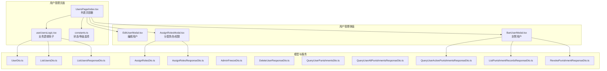
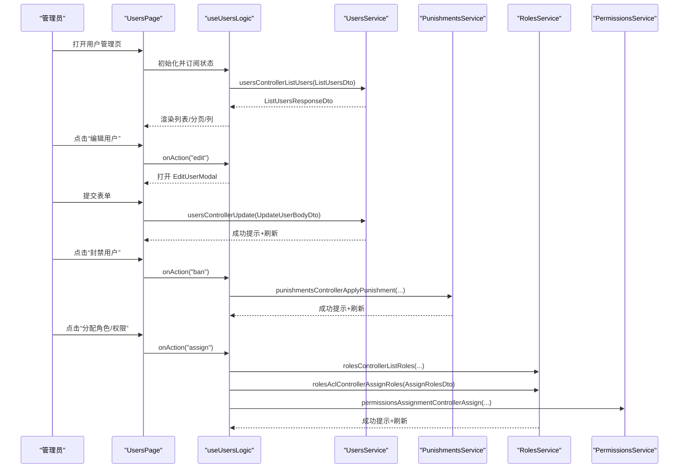
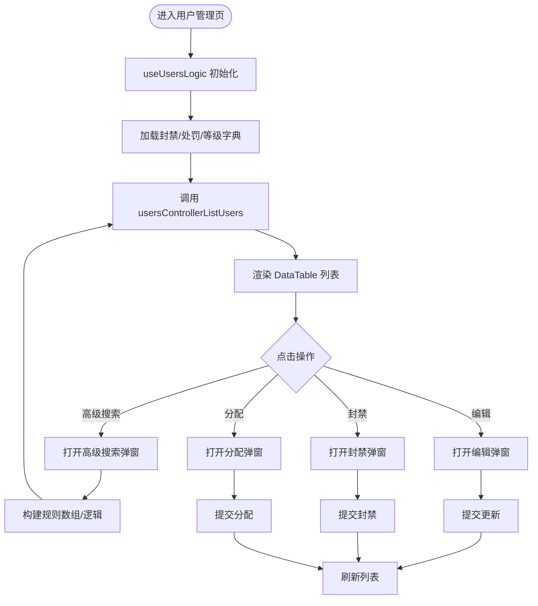
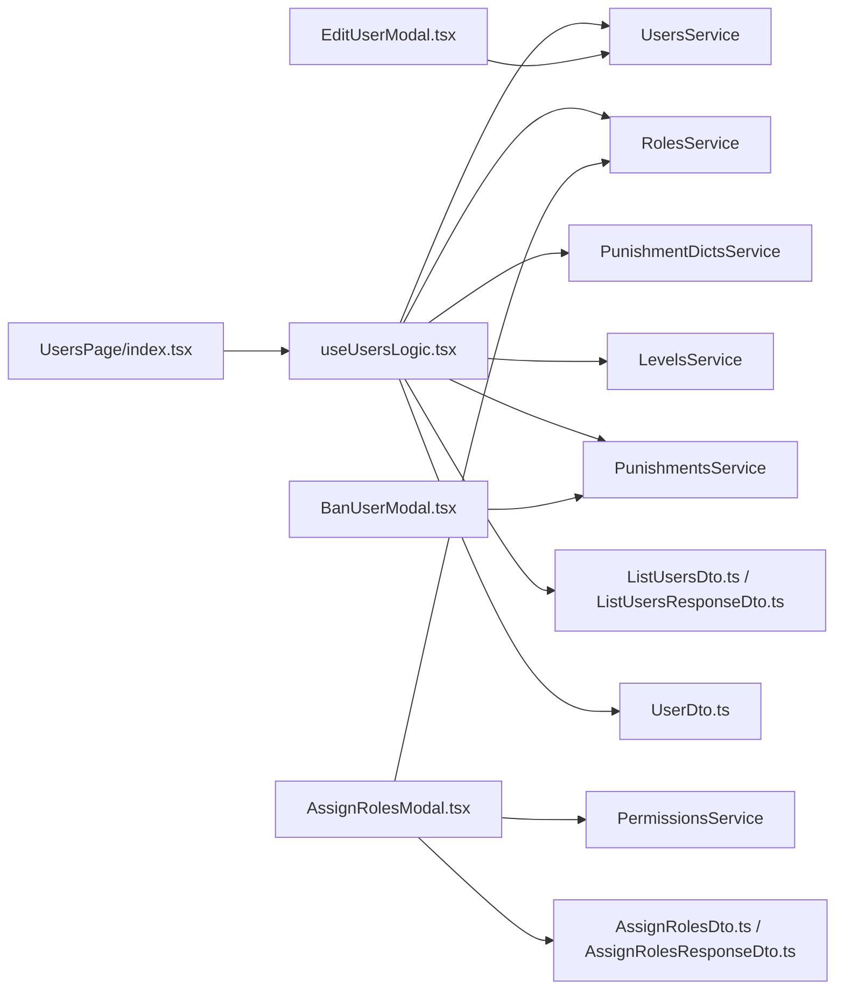
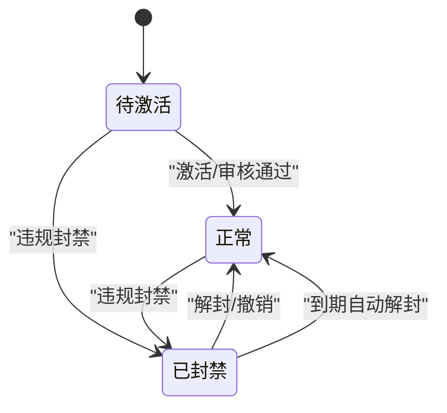

# 用户管理

<cite>
**本文引用的文件**
- [src/modules/admin/pages/users-security/users/UsersPage/index.tsx](file://src/modules/admin/pages/users-security/users/UsersPage/index.tsx)
- [src/modules/admin/pages/users-security/users/UsersPage/useUsersLogic.tsx](file://src/modules/admin/pages/users-security/users/UsersPage/useUsersLogic.tsx)
- [src/modules/admin/pages/users-security/users/UsersPage/constants.ts](file://src/modules/admin/pages/users-security/users/UsersPage/constants.ts)
- [src/modules/admin/pages/users-security/users/UsersPage/components/EditUserModal.tsx](file://src/modules/admin/pages/users-security/users/UsersPage/components/EditUserModal.tsx)
- [src/modules/admin/pages/users-security/users/UsersPage/components/BanUserModal.tsx](file://src/modules/admin/pages/users-security/users/UsersPage/components/BanUserModal.tsx)
- [src/modules/admin/pages/users-security/users/UsersPage/components/AssignRolesModal.tsx](file://src/modules/admin/pages/users-security/users/UsersPage/components/AssignRolesModal.tsx)
- [src/api/models/UserDto.ts](file://src/api/models/UserDto.ts)
- [src/api/models/ListUsersDto.ts](file://src/api/models/ListUsersDto.ts)
- [src/api/models/ListUsersResponseDto.ts](file://src/api/models/ListUsersResponseDto.ts)
- [src/api/models/AssignRolesDto.ts](file://src/api/models/AssignRolesDto.ts)
- [src/api/models/AssignRolesResponseDto.ts](file://src/api/models/AssignRolesResponseDto.ts)
- [src/api/models/AdminFreezeDto.ts](file://src/api/models/AdminFreezeDto.ts)
- [src/api/models/DeleteUserResponseDto.ts](file://src/api/models/DeleteUserResponseDto.ts)
- [src/api/models/QueryUserPunishmentsDto.ts](file://src/api/models/QueryUserPunishmentsDto.ts)
- [src/api/models/QueryUserAllPunishmentsResponseDto.ts](file://src/api/models/QueryUserAllPunishmentsResponseDto.ts)
- [src/api/models/QueryUserActivePunishmentsResponseDto.ts](file://src/api/models/QueryUserActivePunishmentsResponseDto.ts)
- [src/api/models/ListPunishmentRecordsResponseDto.ts](file://src/api/models/ListPunishmentRecordsResponseDto.ts)
- [src/api/models/RevokePunishmentResponseDto.ts](file://src/api/models/RevokePunishmentResponseDto.ts)
- [src/modules/admin/pages/users-security/users/punishments/index.tsx](file://src/modules/admin/pages/users-security/users/punishments/index.tsx)
- [src/modules/admin/pages/users-security/users/punishments/hooks/usePunishmentsLogic.tsx](file://src/modules/admin/pages/users-security/users/punishments/hooks/usePunishmentsLogic.tsx)
</cite>

## 目录
1. [简介](#简介)
2. [项目结构](#项目结构)
3. [核心组件](#核心组件)
4. [架构总览](#架构总览)
5. [组件详解](#组件详解)
6. [依赖关系分析](#依赖关系分析)
7. [性能考量](#性能考量)
8. [故障排查指南](#故障排查指南)
9. [结论](#结论)
10. [附录](#附录)

## 简介
本文件系统性梳理 zTorrent 站点“用户管理”子系统的设计与实现，覆盖用户信息管理、状态控制、权限与角色分配、行为监控与封禁管理、高级搜索与批量能力、以及审计与合规建议。文档以代码为依据，结合可视化图示，帮助开发者与运营人员快速理解与高效使用用户管理功能。

## 项目结构
用户管理功能主要位于后台管理前端模块中，采用页面级组件 + 逻辑钩子 + 业务弹窗组件的分层组织方式，并通过统一的 API 模型与服务层进行数据交互。

**图表来源**
- [src/modules/admin/pages/users-security/users/UsersPage/index.tsx](file://src/modules/admin/pages/users-security/users/UsersPage/index.tsx#L1-L326)
- [src/modules/admin/pages/users-security/users/UsersPage/useUsersLogic.tsx](file://src/modules/admin/pages/users-security/users/UsersPage/useUsersLogic.tsx#L1-L625)
- [src/modules/admin/pages/users-security/users/UsersPage/constants.ts](file://src/modules/admin/pages/users-security/users/UsersPage/constants.ts#L1-L11)
- [src/modules/admin/pages/users-security/users/UsersPage/components/EditUserModal.tsx](file://src/modules/admin/pages/users-security/users/UsersPage/components/EditUserModal.tsx#L1-L102)
- [src/modules/admin/pages/users-security/users/UsersPage/components/BanUserModal.tsx](file://src/modules/admin/pages/users-security/users/UsersPage/components/BanUserModal.tsx#L1-L184)
- [src/modules/admin/pages/users-security/users/UsersPage/components/AssignRolesModal.tsx](file://src/modules/admin/pages/users-security/users/UsersPage/components/AssignRolesModal.tsx#L1-L169)
- [src/api/models/UserDto.ts](file://src/api/models/UserDto.ts#L1-L108)
- [src/api/models/ListUsersDto.ts](file://src/api/models/ListUsersDto.ts#L1-L138)
- [src/api/models/ListUsersResponseDto.ts](file://src/api/models/ListUsersResponseDto.ts#L1-L13)
- [src/api/models/AssignRolesDto.ts](file://src/api/models/AssignRolesDto.ts#L1-L16)
- [src/api/models/AssignRolesResponseDto.ts](file://src/api/models/AssignRolesResponseDto.ts#L1-L9)
- [src/api/models/AdminFreezeDto.ts](file://src/api/models/AdminFreezeDto.ts#L1-L12)
- [src/api/models/DeleteUserResponseDto.ts](file://src/api/models/DeleteUserResponseDto.ts#L1-L8)
- [src/api/models/QueryUserPunishmentsDto.ts](file://src/api/models/QueryUserPunishmentsDto.ts#L1-L11)
- [src/api/models/QueryUserAllPunishmentsResponseDto.ts](file://src/api/models/QueryUserAllPunishmentsResponseDto.ts#L1-L10)
- [src/api/models/QueryUserActivePunishmentsResponseDto.ts](file://src/api/models/QueryUserActivePunishmentsResponseDto.ts#L1-L9)
- [src/api/models/ListPunishmentRecordsResponseDto.ts](file://src/api/models/ListPunishmentRecordsResponseDto.ts#L1-L12)
- [src/api/models/RevokePunishmentResponseDto.ts](file://src/api/models/RevokePunishmentResponseDto.ts#L1-L8)

**章节来源**
- [src/modules/admin/pages/users-security/users/UsersPage/index.tsx](file://src/modules/admin/pages/users-security/users/UsersPage/index.tsx#L1-L326)
- [src/modules/admin/pages/users-security/users/UsersPage/useUsersLogic.tsx](file://src/modules/admin/pages/users-security/users/UsersPage/useUsersLogic.tsx#L1-L625)

## 核心组件
- 列表页容器：负责搜索、分页、列渲染、弹窗编排与全局状态管理。
- 业务逻辑钩子：封装查询参数、字典加载、权限校验、操作路由跳转、删除确认等。
- 弹窗组件：编辑用户、封禁用户、分配角色/权限，均通过表单校验与服务调用完成。
- 数据模型：统一描述用户、查询条件、返回结构、角色/权限分配、封禁记录与撤销响应等。

**章节来源**
- [src/modules/admin/pages/users-security/users/UsersPage/index.tsx](file://src/modules/admin/pages/users-security/users/UsersPage/index.tsx#L14-L326)
- [src/modules/admin/pages/users-security/users/UsersPage/useUsersLogic.tsx](file://src/modules/admin/pages/users-security/users/UsersPage/useUsersLogic.tsx#L28-L625)
- [src/api/models/UserDto.ts](file://src/api/models/UserDto.ts#L5-L70)
- [src/api/models/ListUsersDto.ts](file://src/api/models/ListUsersDto.ts#L6-L75)
- [src/api/models/ListUsersResponseDto.ts](file://src/api/models/ListUsersResponseDto.ts#L6-L12)

## 架构总览
用户管理从前端页面到后端服务的调用链路如下：

**图表来源**
- [src/modules/admin/pages/users-security/users/UsersPage/index.tsx](file://src/modules/admin/pages/users-security/users/UsersPage/index.tsx#L14-L326)
- [src/modules/admin/pages/users-security/users/UsersPage/useUsersLogic.tsx](file://src/modules/admin/pages/users-security/users/UsersPage/useUsersLogic.tsx#L160-L344)
- [src/modules/admin/pages/users-security/users/UsersPage/components/EditUserModal.tsx](file://src/modules/admin/pages/users-security/users/UsersPage/components/EditUserModal.tsx#L58-L72)
- [src/modules/admin/pages/users-security/users/UsersPage/components/BanUserModal.tsx](file://src/modules/admin/pages/users-security/users/UsersPage/components/BanUserModal.tsx#L82-L98)
- [src/modules/admin/pages/users-security/users/UsersPage/components/AssignRolesModal.tsx](file://src/modules/admin/pages/users-security/users/UsersPage/components/AssignRolesModal.tsx#L62-L95)

## 组件详解

### 用户列表与高级搜索
- 支持基础关键词搜索（用户名/邮箱），并提供高级搜索面板，支持多字段、多运算符、AND/OR 组合。
- 列包含：序号、用户名、状态标签、角色/权限查看、等级、VIP、下载权限、创建/访问时间、操作下拉菜单。
- 分页与排序：基于 ListUsersDto 的分页与排序字段配置，支持多种排序维度。

**图表来源**
- [src/modules/admin/pages/users-security/users/UsersPage/useUsersLogic.tsx](file://src/modules/admin/pages/users-security/users/UsersPage/useUsersLogic.tsx#L90-L240)
- [src/modules/admin/pages/users-security/users/UsersPage/index.tsx](file://src/modules/admin/pages/users-security/users/UsersPage/index.tsx#L63-L126)

**章节来源**
- [src/modules/admin/pages/users-security/users/UsersPage/index.tsx](file://src/modules/admin/pages/users-security/users/UsersPage/index.tsx#L63-L126)
- [src/modules/admin/pages/users-security/users/UsersPage/useUsersLogic.tsx](file://src/modules/admin/pages/users-security/users/UsersPage/useUsersLogic.tsx#L160-L240)
- [src/api/models/ListUsersDto.ts](file://src/api/models/ListUsersDto.ts#L6-L75)

### 用户信息编辑
- 表单包含：邮箱（可选）、新密码（可选，留空则不修改）。
- 提交时构造 UpdateUserBodyDto 并调用 usersControllerUpdate，成功后关闭弹窗并刷新列表。

**章节来源**
- [src/modules/admin/pages/users-security/users/UsersPage/components/EditUserModal.tsx](file://src/modules/admin/pages/users-security/users/UsersPage/components/EditUserModal.tsx#L58-L72)
- [src/modules/admin/pages/users-security/users/UsersPage/useUsersLogic.tsx](file://src/modules/admin/pages/users-security/users/UsersPage/useUsersLogic.tsx#L281-L284)

### 用户封禁管理
- 封禁弹窗提供：处罚类型、封禁原因、详细原因、封禁时长。
- 提交时调用 punishmentsControllerApplyPunishment，成功后关闭弹窗并刷新列表。
- 支持封禁字典与处罚类型字典的异步加载。

**章节来源**
- [src/modules/admin/pages/users-security/users/UsersPage/components/BanUserModal.tsx](file://src/modules/admin/pages/users-security/users/UsersPage/components/BanUserModal.tsx#L82-L98)
- [src/modules/admin/pages/users-security/users/UsersPage/useUsersLogic.tsx](file://src/modules/admin/pages/users-security/users/UsersPage/useUsersLogic.tsx#L322-L332)

### 角色与权限分配
- 支持两种分配路径：
  - 角色分配：覆盖式，调用 rolesAclControllerAssignRoles。
  - 独立权限分配：覆盖式，调用 permissionsAssignmentControllerAssign。
- 输入支持多选角色与文本框权限键（逗号/中文逗号/换行分隔）。

**章节来源**
- [src/modules/admin/pages/users-security/users/UsersPage/components/AssignRolesModal.tsx](file://src/modules/admin/pages/users-security/users/UsersPage/components/AssignRolesModal.tsx#L62-L95)
- [src/api/models/AssignRolesDto.ts](file://src/api/models/AssignRolesDto.ts#L5-L14)
- [src/api/models/AssignRolesResponseDto.ts](file://src/api/models/AssignRolesResponseDto.ts#L5-L7)

### 用户状态控制与冻结
- 当前实现聚焦于封禁与解封/记录入口；冻结可通过 AdminFreezeDto 结构体定义目标用户 ID，便于后续扩展冻结接口。

**章节来源**
- [src/api/models/AdminFreezeDto.ts](file://src/api/models/AdminFreezeDto.ts#L5-L10)

### 用户删除与审计
- 删除用户通过 usersControllerRemove 完成，返回 DeleteUserResponseDto。
- 用户行为审计与封禁记录可通过“解封/记录”入口进入封禁管理页，支持按用户名筛选、高级查询与撤销操作。

**章节来源**
- [src/modules/admin/pages/users-security/users/UsersPage/useUsersLogic.tsx](file://src/modules/admin/pages/users-security/users/UsersPage/useUsersLogic.tsx#L313-L321)
- [src/api/models/DeleteUserResponseDto.ts](file://src/api/models/DeleteUserResponseDto.ts#L5-L7)
- [src/modules/admin/pages/users-security/users/punishments/index.tsx](file://src/modules/admin/pages/users-security/users/punishments/index.tsx#L1-L40)
- [src/modules/admin/pages/users-security/users/punishments/hooks/usePunishmentsLogic.tsx](file://src/modules/admin/pages/users-security/users/punishments/hooks/usePunishmentsLogic.tsx#L1-L29)

## 依赖关系分析
- 页面与逻辑：UsersPage 依赖 useUsersLogic 进行状态与副作用管理。
- 逻辑与服务：useUsersLogic 依赖 UsersService、RolesService、PunishmentDictsService、LevelsService 等服务。
- 弹窗与服务：EditUserModal、BanUserModal、AssignRolesModal 分别调用对应服务完成业务。
- 模型与契约：ListUsersDto/Response、UserDto、AssignRolesDto/Response 等作为前后端契约。

**图表来源**
- [src/modules/admin/pages/users-security/users/UsersPage/index.tsx](file://src/modules/admin/pages/users-security/users/UsersPage/index.tsx#L8-L61)
- [src/modules/admin/pages/users-security/users/UsersPage/useUsersLogic.tsx](file://src/modules/admin/pages/users-security/users/UsersPage/useUsersLogic.tsx#L5-L18)
- [src/modules/admin/pages/users-security/users/UsersPage/components/EditUserModal.tsx](file://src/modules/admin/pages/users-security/users/UsersPage/components/EditUserModal.tsx#L9)
- [src/modules/admin/pages/users-security/users/UsersPage/components/BanUserModal.tsx](file://src/modules/admin/pages/users-security/users/UsersPage/components/BanUserModal.tsx#L16)
- [src/modules/admin/pages/users-security/users/UsersPage/components/AssignRolesModal.tsx](file://src/modules/admin/pages/users-security/users/UsersPage/components/AssignRolesModal.tsx#L11-L12)
- [src/api/models/ListUsersDto.ts](file://src/api/models/ListUsersDto.ts#L1-L138)
- [src/api/models/ListUsersResponseDto.ts](file://src/api/models/ListUsersResponseDto.ts#L1-L13)
- [src/api/models/UserDto.ts](file://src/api/models/UserDto.ts#L1-L108)
- [src/api/models/AssignRolesDto.ts](file://src/api/models/AssignRolesDto.ts#L1-L16)
- [src/api/models/AssignRolesResponseDto.ts](file://src/api/models/AssignRolesResponseDto.ts#L1-L9)

**章节来源**
- [src/modules/admin/pages/users-security/users/UsersPage/useUsersLogic.tsx](file://src/modules/admin/pages/users-security/users/UsersPage/useUsersLogic.tsx#L1-L625)

## 性能考量
- 列表懒加载与字典缓存：在进入页面时一次性加载封禁/处罚/等级字典，减少重复请求。
- 高级搜索规则映射：对日期范围等字段进行序列化处理，避免无效请求。
- 分页与排序：通过 ListUsersDto 控制 page/limit/sortBy/order，避免一次性拉取全量数据。
- 弹窗确认与防抖：删除与封禁等高风险操作使用确认弹窗，降低误操作成本。

[本节为通用指导，无需列出具体文件来源]

## 故障排查指南
- 列表加载失败：检查网络与服务可用性，确认 ListUsersDto 参数是否符合后端约束。
- 权限不足：onAction 内部会根据本地存储的权限键进行判断，若无相应权限将提示并阻止操作。
- 封禁/解封异常：确认封禁字典与处罚类型字典加载状态，确保选择项有效。
- 分配失败：角色/权限分配为覆盖式，若出现权限异常，请核对权限键格式与服务端返回。

**章节来源**
- [src/modules/admin/pages/users-security/users/UsersPage/useUsersLogic.tsx](file://src/modules/admin/pages/users-security/users/UsersPage/useUsersLogic.tsx#L46-L55)
- [src/modules/admin/pages/users-security/users/UsersPage/useUsersLogic.tsx](file://src/modules/admin/pages/users-security/users/UsersPage/useUsersLogic.tsx#L313-L321)

## 结论
用户管理模块以清晰的页面-逻辑-弹窗分层与完善的模型契约为基础，实现了从用户检索、编辑、封禁到角色/权限分配的完整闭环。通过高级搜索与字典化配置，兼顾了易用性与可扩展性。建议在后续迭代中补充“冻结”与“批量操作”能力，并完善审计日志与隐私保护策略。

[本节为总结性内容，无需列出具体文件来源]

## 附录

### 用户状态变更流程（概念示意）

[本图为概念示意，无需列出具体文件来源]

### 用户管理操作示例（步骤化）
- 用户创建流程：由后端注册/导入流程完成，前端通过用户列表可见。
- 用户信息编辑：在“编辑用户”弹窗中填写邮箱/新密码并提交。
- 用户封禁管理：在“封禁用户”弹窗中选择处罚类型、原因、时长并提交。
- 用户角色分配：在“分配角色/权限”弹窗中勾选角色或输入权限键并提交。
- 用户删除：在操作下拉菜单中选择“删除用户”，确认后执行。

**章节来源**
- [src/modules/admin/pages/users-security/users/UsersPage/components/EditUserModal.tsx](file://src/modules/admin/pages/users-security/users/UsersPage/components/EditUserModal.tsx#L58-L72)
- [src/modules/admin/pages/users-security/users/UsersPage/components/BanUserModal.tsx](file://src/modules/admin/pages/users-security/users/UsersPage/components/BanUserModal.tsx#L82-L98)
- [src/modules/admin/pages/users-security/users/UsersPage/components/AssignRolesModal.tsx](file://src/modules/admin/pages/users-security/users/UsersPage/components/AssignRolesModal.tsx#L62-L95)
- [src/modules/admin/pages/users-security/users/UsersPage/useUsersLogic.tsx](file://src/modules/admin/pages/users-security/users/UsersPage/useUsersLogic.tsx#L313-L321)

### 用户搜索与过滤要点
- 基础搜索：用户名/邮箱模糊匹配。
- 高级搜索：支持多字段、多运算符（含日期范围 BETWEEN）、AND/OR 组合。
- 排序：支持按创建时间、更新时间、用户名、最后登录时间、等级、VIP 等字段排序。

**章节来源**
- [src/api/models/ListUsersDto.ts](file://src/api/models/ListUsersDto.ts#L6-L75)
- [src/modules/admin/pages/users-security/users/UsersPage/useUsersLogic.tsx](file://src/modules/admin/pages/users-security/users/UsersPage/useUsersLogic.tsx#L164-L191)

### 用户权限与角色分配要点
- 角色分配：覆盖式，传入 roleKeys 数组。
- 独立权限分配：覆盖式，传入以逗号/中文逗号/换行分隔的权限键列表。
- 权限来源：角色继承 + 独立权限叠加。

**章节来源**
- [src/modules/admin/pages/users-security/users/UsersPage/components/AssignRolesModal.tsx](file://src/modules/admin/pages/users-security/users/UsersPage/components/AssignRolesModal.tsx#L62-L95)
- [src/api/models/AssignRolesDto.ts](file://src/api/models/AssignRolesDto.ts#L5-L14)

### 用户行为监控与审计
- 行为监控：通过“下载记录”“解封/记录”等入口关联到相关数据视图。
- 审计建议：对高风险操作（封禁/解封/删除/权限变更）增加审计日志字段与回溯能力。

**章节来源**
- [src/modules/admin/pages/users-security/users/UsersPage/useUsersLogic.tsx](file://src/modules/admin/pages/users-security/users/UsersPage/useUsersLogic.tsx#L276-L280)
- [src/modules/admin/pages/users-security/users/punishments/index.tsx](file://src/modules/admin/pages/users-security/users/punishments/index.tsx#L1-L40)

### 用户信息安全与隐私保护
- 个人信息最小化：仅在必要时展示与收集邮箱、最后登录时间/IP 等。
- 敏感字段处理：passkey 等敏感字段不在列表页直接展示，避免泄露。
- 访问控制：通过 can 权限校验限制敏感操作。

**章节来源**
- [src/api/models/UserDto.ts](file://src/api/models/UserDto.ts#L59-L61)
- [src/modules/admin/pages/users-security/users/UsersPage/useUsersLogic.tsx](file://src/modules/admin/pages/users-security/users/UsersPage/useUsersLogic.tsx#L46-L55)