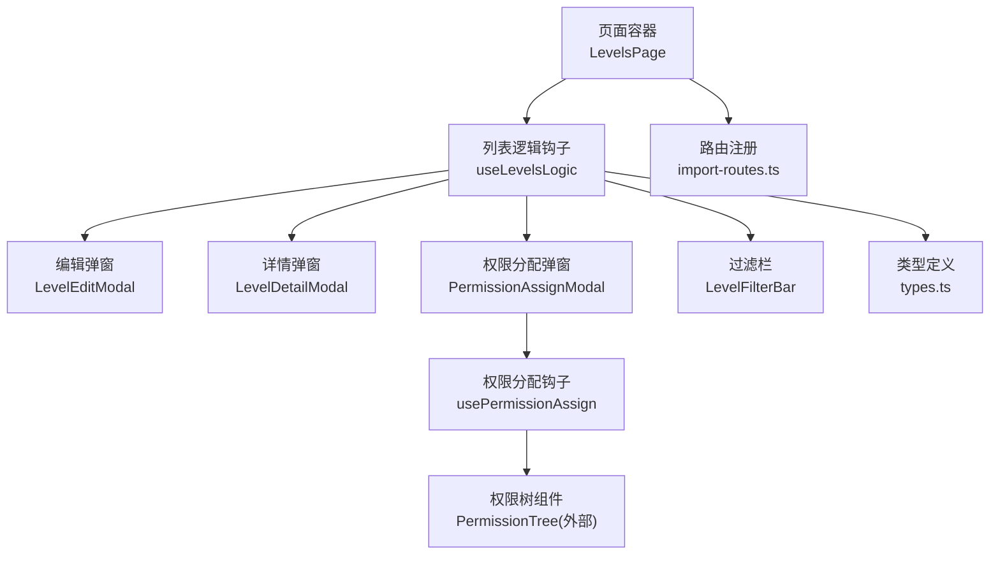
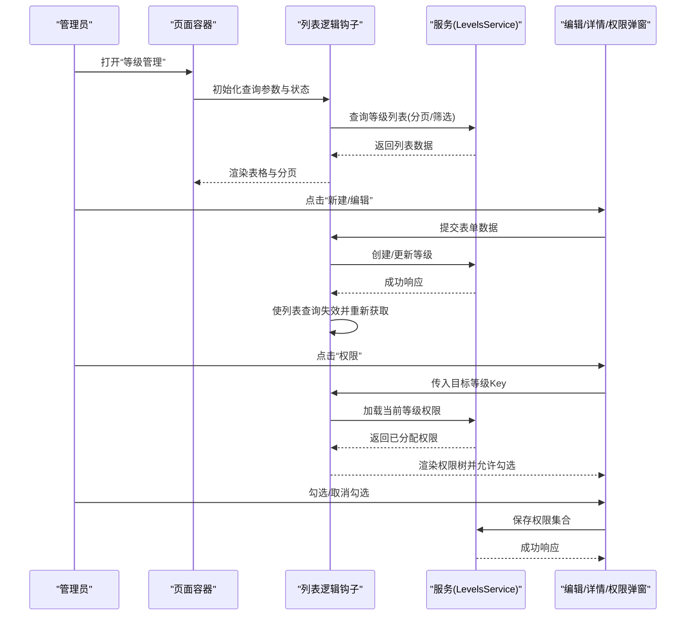
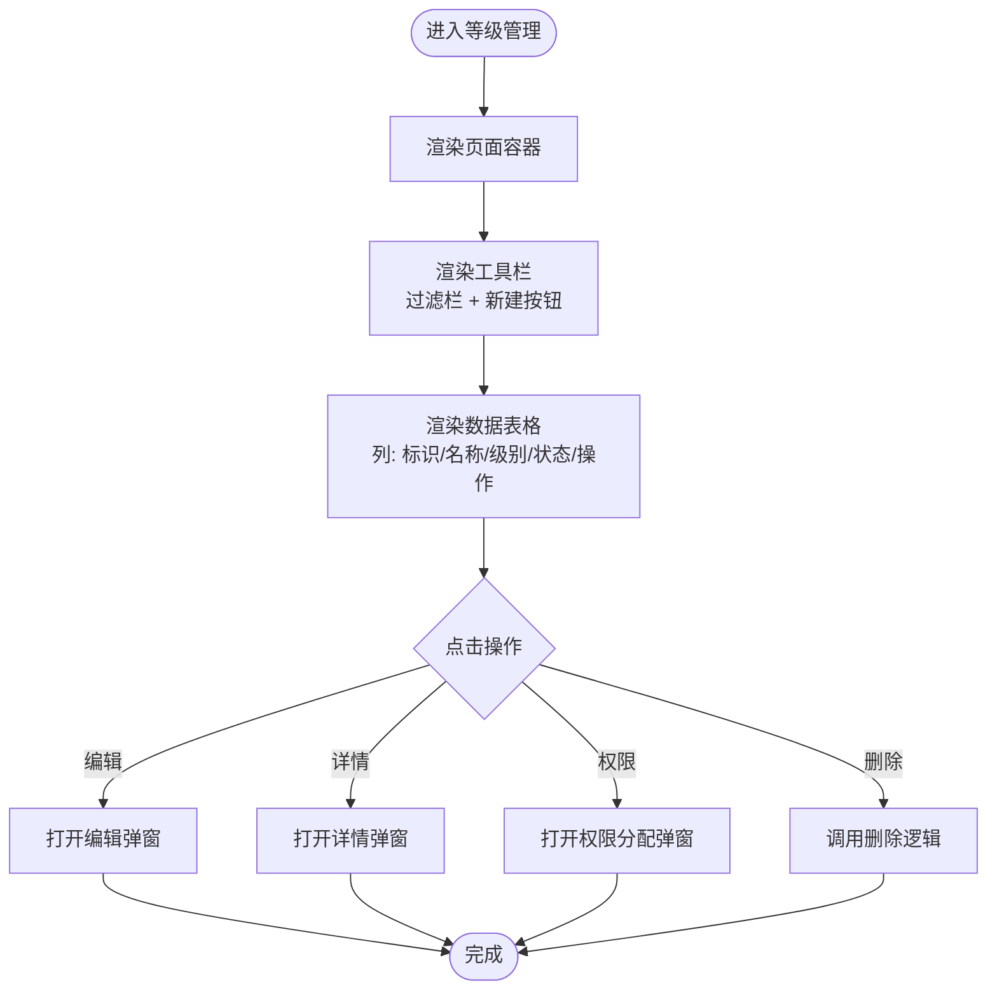
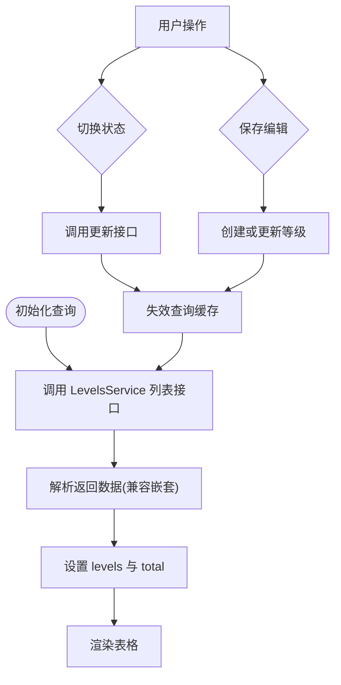
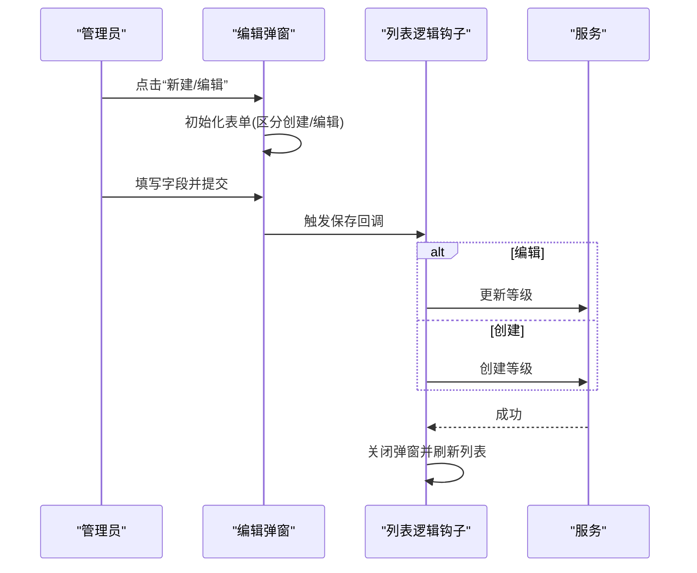
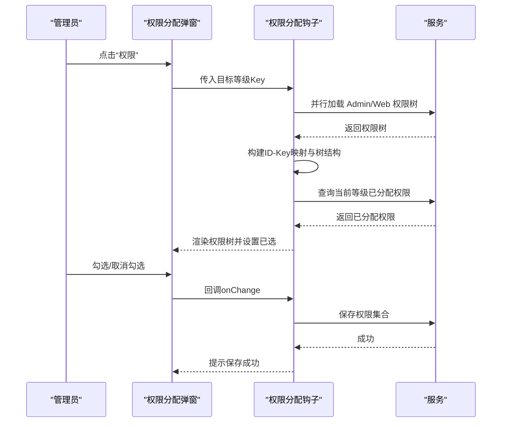
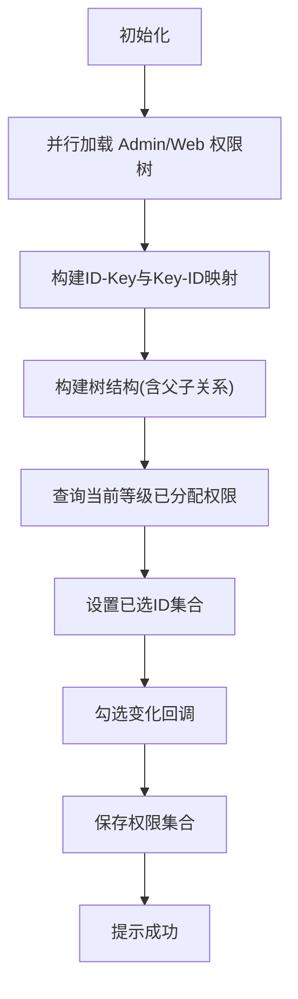
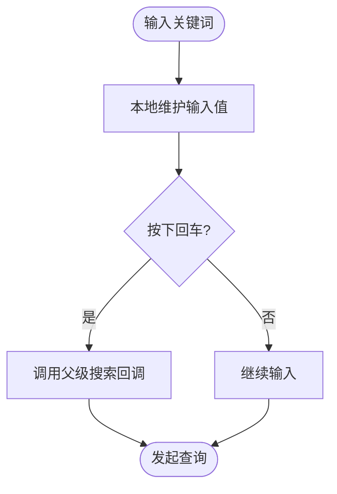
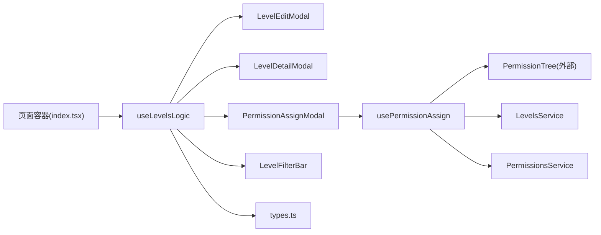

# 等级管理

<cite>
**本文引用的文件**
- [src/modules/admin/pages/users-security/users/levels/index.tsx](file://src/modules/admin/pages/users-security/users/levels/index.tsx)
- [src/modules/admin/pages/users-security/users/levels/types.ts](file://src/modules/admin/pages/users-security/users/levels/types.ts)
- [src/modules/admin/pages/users-security/users/levels/hooks/useLevelsLogic.tsx](file://src/modules/admin/pages/users-security/users/levels/hooks/useLevelsLogic.tsx)
- [src/modules/admin/pages/users-security/users/levels/hooks/usePermissionAssign.tsx](file://src/modules/admin/pages/users-security/users/levels/hooks/usePermissionAssign.tsx)
- [src/modules/admin/pages/users-security/users/levels/components/LevelEditModal.tsx](file://src/modules/admin/pages/users-security/users/levels/components/LevelEditModal.tsx)
- [src/modules/admin/pages/users-security/users/levels/components/LevelDetailModal.tsx](file://src/modules/admin/pages/users-security/users/levels/components/LevelDetailModal.tsx)
- [src/modules/admin/pages/users-security/users/levels/components/PermissionAssignModal.tsx](file://src/modules/admin/pages/users-security/users/levels/components/PermissionAssignModal.tsx)
- [src/modules/admin/pages/users-security/users/levels/components/LevelFilterBar.tsx](file://src/modules/admin/pages/users-security/users/levels/components/LevelFilterBar.tsx)
- [src/api/models/CreateLevelDto.ts](file://src/api/models/CreateLevelDto.ts)
- [src/api/models/UpdateLevelDto.ts](file://src/api/models/UpdateLevelDto.ts)
- [src/api/models/LevelPermissionDto.ts](file://src/api/models/LevelPermissionDto.ts)
- [src/api/models/ListLevelsRequestDto.ts](file://src/api/models/ListLevelsRequestDto.ts)
- [scripts/import-routes.ts](file://scripts/import-routes.ts)
</cite>

## 目录
1. [简介](#简介)
2. [项目结构](#项目结构)
3. [核心组件](#核心组件)
4. [架构总览](#架构总览)
5. [详细组件分析](#详细组件分析)
6. [依赖分析](#依赖分析)
7. [性能考虑](#性能考虑)
8. [故障排查指南](#故障排查指南)
9. [结论](#结论)
10. [附录](#附录)

## 简介
本文件系统化梳理“等级管理”功能的前端实现与交互流程，覆盖等级定义、权限配置、查询筛选、批量操作与变更审计等能力。文档以仓库现有代码为依据，不臆造未实现的功能；同时提供最佳实践建议与常见问题解决方案，帮助管理员高效、安全地维护用户等级体系。

## 项目结构
等级管理位于后台管理页面的“用户与安全—用户—等级”路径下，采用模块化组织，包含页面容器、类型定义、业务逻辑钩子、弹窗组件与权限分配组件等。

图表来源
- [src/modules/admin/pages/users-security/users/levels/index.tsx](file://src/modules/admin/pages/users-security/users/levels/index.tsx#L1-L87)
- [src/modules/admin/pages/users-security/users/levels/hooks/useLevelsLogic.tsx](file://src/modules/admin/pages/users-security/users/levels/hooks/useLevelsLogic.tsx#L1-L215)
- [src/modules/admin/pages/users-security/users/levels/hooks/usePermissionAssign.tsx](file://src/modules/admin/pages/users-security/users/levels/hooks/usePermissionAssign.tsx#L1-L156)
- [src/modules/admin/pages/users-security/users/levels/components/LevelEditModal.tsx](file://src/modules/admin/pages/users-security/users/levels/components/LevelEditModal.tsx#L1-L109)
- [src/modules/admin/pages/users-security/users/levels/components/LevelDetailModal.tsx](file://src/modules/admin/pages/users-security/users/levels/components/LevelDetailModal.tsx#L1-L33)
- [src/modules/admin/pages/users-security/users/levels/components/PermissionAssignModal.tsx](file://src/modules/admin/pages/users-security/users/levels/components/PermissionAssignModal.tsx#L1-L119)
- [src/modules/admin/pages/users-security/users/levels/components/LevelFilterBar.tsx](file://src/modules/admin/pages/users-security/users/levels/components/LevelFilterBar.tsx#L1-L56)
- [scripts/import-routes.ts](file://scripts/import-routes.ts#L778-L783)

章节来源
- [src/modules/admin/pages/users-security/users/levels/index.tsx](file://src/modules/admin/pages/users-security/users/levels/index.tsx#L1-L87)
- [src/modules/admin/pages/users-security/users/levels/types.ts](file://src/modules/admin/pages/users-security/users/levels/types.ts#L1-L28)
- [scripts/import-routes.ts](file://scripts/import-routes.ts#L778-L783)

## 核心组件
- 页面容器：负责渲染表格、工具栏、分页与弹窗，协调各交互动作。
- 列表逻辑钩子：封装查询、筛选、编辑、删除、状态切换等操作，并管理表格列定义。
- 编辑弹窗：支持创建与编辑等级的关键字段（标识、显示名、权重、描述、启用状态）。
- 权限分配弹窗：基于权限树进行 Admin/Web 权限的勾选与保存。
- 权限分配钩子：拉取权限树、构建映射、加载当前等级权限、保存新权限。
- 过滤栏：提供按名称/标识的搜索输入与回车快捷键。
- 类型定义：统一等级项、查询参数、默认查询与下拉选项类型。

章节来源
- [src/modules/admin/pages/users-security/users/levels/hooks/useLevelsLogic.tsx](file://src/modules/admin/pages/users-security/users/levels/hooks/useLevelsLogic.tsx#L1-L215)
- [src/modules/admin/pages/users-security/users/levels/components/LevelEditModal.tsx](file://src/modules/admin/pages/users-security/users/levels/components/LevelEditModal.tsx#L1-L109)
- [src/modules/admin/pages/users-security/users/levels/hooks/usePermissionAssign.tsx](file://src/modules/admin/pages/users-security/users/levels/hooks/usePermissionAssign.tsx#L1-L156)
- [src/modules/admin/pages/users-security/users/levels/components/PermissionAssignModal.tsx](file://src/modules/admin/pages/users-security/users/levels/components/PermissionAssignModal.tsx#L1-L119)
- [src/modules/admin/pages/users-security/users/levels/components/LevelFilterBar.tsx](file://src/modules/admin/pages/users-security/users/levels/components/LevelFilterBar.tsx#L1-L56)
- [src/modules/admin/pages/users-security/users/levels/types.ts](file://src/modules/admin/pages/users-security/users/levels/types.ts#L1-L28)

## 架构总览
等级管理采用“页面容器 + 钩子 + 组件”的分层设计，数据流通过 React Query 管理缓存与失效，配合权限树组件完成权限分配。

图表来源
- [src/modules/admin/pages/users-security/users/levels/index.tsx](file://src/modules/admin/pages/users-security/users/levels/index.tsx#L1-L87)
- [src/modules/admin/pages/users-security/users/levels/hooks/useLevelsLogic.tsx](file://src/modules/admin/pages/users-security/users/levels/hooks/useLevelsLogic.tsx#L31-L119)
- [src/modules/admin/pages/users-security/users/levels/hooks/usePermissionAssign.tsx](file://src/modules/admin/pages/users-security/users/levels/hooks/usePermissionAssign.tsx#L99-L143)

## 详细组件分析

### 页面容器与表格
- 负责渲染标题、工具栏、数据表格、分页控件以及三个弹窗。
- 工具栏左侧为过滤栏，右侧为“新建等级”按钮。
- 表格列包括：权重标识、等级名称、级别(rank)、状态、操作（编辑/详情/权限/删除）。

图表来源
- [src/modules/admin/pages/users-security/users/levels/index.tsx](file://src/modules/admin/pages/users-security/users/levels/index.tsx#L36-L86)
- [src/modules/admin/pages/users-security/users/levels/hooks/useLevelsLogic.tsx](file://src/modules/admin/pages/users-security/users/levels/hooks/useLevelsLogic.tsx#L122-L191)

章节来源
- [src/modules/admin/pages/users-security/users/levels/index.tsx](file://src/modules/admin/pages/users-security/users/levels/index.tsx#L1-L87)
- [src/modules/admin/pages/users-security/users/levels/hooks/useLevelsLogic.tsx](file://src/modules/admin/pages/users-security/users/levels/hooks/useLevelsLogic.tsx#L122-L191)

### 列表逻辑钩子（useLevelsLogic）
- 查询与缓存：使用 React Query 查询等级列表，支持分页与按名称/标识筛选。
- 状态管理：维护编辑/详情/权限弹窗的开关与目标数据。
- 操作封装：封装“启用/禁用”“删除”“保存”等异步操作，并在成功后使查询失效以刷新数据。
- 表格列定义：包含“权重标识”“等级名称”“级别”“状态”“操作”等列，状态列使用 Switch 控件，操作列包含编辑、详情、权限、删除按钮。

图表来源
- [src/modules/admin/pages/users-security/users/levels/hooks/useLevelsLogic.tsx](file://src/modules/admin/pages/users-security/users/levels/hooks/useLevelsLogic.tsx#L31-L67)
- [src/modules/admin/pages/users-security/users/levels/hooks/useLevelsLogic.tsx](file://src/modules/admin/pages/users-security/users/levels/hooks/useLevelsLogic.tsx#L86-L119)

章节来源
- [src/modules/admin/pages/users-security/users/levels/hooks/useLevelsLogic.tsx](file://src/modules/admin/pages/users-security/users/levels/hooks/useLevelsLogic.tsx#L1-L215)

### 编辑弹窗（LevelEditModal）
- 字段：标识（Key）、显示名称（Label）、权重（Rank）、描述（Description）、是否启用（IsActive）。
- 行为：创建模式下标识不可编辑；提交时根据是否存在旧记录决定创建或更新。
- 校验：标识在创建时必填，显示名称必填；权重为数值输入。

图表来源
- [src/modules/admin/pages/users-security/users/levels/components/LevelEditModal.tsx](file://src/modules/admin/pages/users-security/users/levels/components/LevelEditModal.tsx#L22-L49)
- [src/modules/admin/pages/users-security/users/levels/hooks/useLevelsLogic.tsx](file://src/modules/admin/pages/users-security/users/levels/hooks/useLevelsLogic.tsx#L102-L113)

章节来源
- [src/modules/admin/pages/users-security/users/levels/components/LevelEditModal.tsx](file://src/modules/admin/pages/users-security/users/levels/components/LevelEditModal.tsx#L1-L109)
- [src/modules/admin/pages/users-security/users/levels/hooks/useLevelsLogic.tsx](file://src/modules/admin/pages/users-security/users/levels/hooks/useLevelsLogic.tsx#L102-L113)

### 权限分配弹窗（PermissionAssignModal）
- 功能：对 Admin/Web 两类权限分别进行勾选与保存。
- 数据来源：通过权限分配钩子加载权限树与当前等级已分配权限。
- 交互：Tab 切换 Admin/Web；勾选变化时自动保存；保存成功提示。

图表来源
- [src/modules/admin/pages/users-security/users/levels/components/PermissionAssignModal.tsx](file://src/modules/admin/pages/users-security/users/levels/components/PermissionAssignModal.tsx#L14-L39)
- [src/modules/admin/pages/users-security/users/levels/hooks/usePermissionAssign.tsx](file://src/modules/admin/pages/users-security/users/levels/hooks/usePermissionAssign.tsx#L14-L51)
- [src/modules/admin/pages/users-security/users/levels/hooks/usePermissionAssign.tsx](file://src/modules/admin/pages/users-security/users/levels/hooks/usePermissionAssign.tsx#L99-L143)

章节来源
- [src/modules/admin/pages/users-security/users/levels/components/PermissionAssignModal.tsx](file://src/modules/admin/pages/users-security/users/levels/components/PermissionAssignModal.tsx#L1-L119)
- [src/modules/admin/pages/users-security/users/levels/hooks/usePermissionAssign.tsx](file://src/modules/admin/pages/users-security/users/levels/hooks/usePermissionAssign.tsx#L1-L156)

### 权限分配钩子（usePermissionAssign）
- 权限树：并行获取 Admin/Web 两棵权限树，构建父子关系与节点映射。
- 当前权限：根据目标等级 Key 查询已分配权限，映射到已选ID集合。
- 保存：将选中ID集合转换为权限Key并调用保存接口，成功后提示。

图表来源
- [src/modules/admin/pages/users-security/users/levels/hooks/usePermissionAssign.tsx](file://src/modules/admin/pages/users-security/users/levels/hooks/usePermissionAssign.tsx#L14-L51)
- [src/modules/admin/pages/users-security/users/levels/hooks/usePermissionAssign.tsx](file://src/modules/admin/pages/users-security/users/levels/hooks/usePermissionAssign.tsx#L99-L143)

章节来源
- [src/modules/admin/pages/users-security/users/levels/hooks/usePermissionAssign.tsx](file://src/modules/admin/pages/users-security/users/levels/hooks/usePermissionAssign.tsx#L1-L156)

### 过滤栏（LevelFilterBar）
- 支持按“名称或标识”搜索，内部维护本地输入值，避免父组件重渲染。
- 提供回车快捷键触发搜索。

图表来源
- [src/modules/admin/pages/users-security/users/levels/components/LevelFilterBar.tsx](file://src/modules/admin/pages/users-security/users/levels/components/LevelFilterBar.tsx#L16-L27)

章节来源
- [src/modules/admin/pages/users-security/users/levels/components/LevelFilterBar.tsx](file://src/modules/admin/pages/users-security/users/levels/components/LevelFilterBar.tsx#L1-L56)

### 类型定义（types.ts）
- 等级项 LevelItem：包含 id、key、label、rank、description、isActive、createdAt、updatedAt。
- 查询参数 LevelsQuery：page、limit、key、label。
- 默认查询 DEFAULT_QUERY：page=1、limit=10。
- SelectOption：用于下拉选择的通用结构。

章节来源
- [src/modules/admin/pages/users-security/users/levels/types.ts](file://src/modules/admin/pages/users-security/users/levels/types.ts#L1-L28)

### API 模型与服务契约
- 创建等级 CreateLevelDto：key、label、rank、description。
- 更新等级 UpdateLevelDto：label、rank、description、isActive。
- 等级权限 LevelPermissionDto：id、key、name、type、scope、description。
- 列出等级请求 ListLevelsRequestDto：key、label、page、limit。
- 路由注册：后台路由包含“等级管理”，权限键为“admin/levels”。

章节来源
- [src/api/models/CreateLevelDto.ts](file://src/api/models/CreateLevelDto.ts#L5-L22)
- [src/api/models/UpdateLevelDto.ts](file://src/api/models/UpdateLevelDto.ts#L5-L22)
- [src/api/models/LevelPermissionDto.ts](file://src/api/models/LevelPermissionDto.ts#L5-L12)
- [src/api/models/ListLevelsRequestDto.ts](file://src/api/models/ListLevelsRequestDto.ts#L5-L10)
- [scripts/import-routes.ts](file://scripts/import-routes.ts#L778-L783)

## 依赖分析
- 页面容器依赖列表逻辑钩子与多个弹窗组件。
- 列表逻辑钩子依赖 LevelsService 与权限分配钩子。
- 权限分配钩子依赖 PermissionsService 与 LevelsService。
- 过滤栏与类型定义被页面容器与逻辑钩子共同使用。

图表来源
- [src/modules/admin/pages/users-security/users/levels/index.tsx](file://src/modules/admin/pages/users-security/users/levels/index.tsx#L1-L87)
- [src/modules/admin/pages/users-security/users/levels/hooks/useLevelsLogic.tsx](file://src/modules/admin/pages/users-security/users/levels/hooks/useLevelsLogic.tsx#L1-L215)
- [src/modules/admin/pages/users-security/users/levels/hooks/usePermissionAssign.tsx](file://src/modules/admin/pages/users-security/users/levels/hooks/usePermissionAssign.tsx#L1-L156)
- [src/modules/admin/pages/users-security/users/levels/components/PermissionAssignModal.tsx](file://src/modules/admin/pages/users-security/users/levels/components/PermissionAssignModal.tsx#L1-L119)

章节来源
- [src/modules/admin/pages/users-security/users/levels/index.tsx](file://src/modules/admin/pages/users-security/users/levels/index.tsx#L1-L87)
- [src/modules/admin/pages/users-security/users/levels/hooks/useLevelsLogic.tsx](file://src/modules/admin/pages/users-security/users/levels/hooks/useLevelsLogic.tsx#L1-L215)
- [src/modules/admin/pages/users-security/users/levels/hooks/usePermissionAssign.tsx](file://src/modules/admin/pages/users-security/users/levels/hooks/usePermissionAssign.tsx#L1-L156)

## 性能考虑
- 查询缓存与失效：使用 React Query 对列表查询进行缓存，并在编辑/删除/权限保存后主动失效，确保数据一致性与减少重复请求。
- 组件拆分与 memo：过滤栏独立为组件并使用 memo，避免父组件重渲染导致的无意义重渲染。
- 权限树懒加载：权限树与映射在首次加载后缓存，减少重复计算。
- 分页与筛选：列表支持分页与关键词筛选，降低单次传输量。

章节来源
- [src/modules/admin/pages/users-security/users/levels/hooks/useLevelsLogic.tsx](file://src/modules/admin/pages/users-security/users/levels/hooks/useLevelsLogic.tsx#L31-L45)
- [src/modules/admin/pages/users-security/users/levels/components/LevelFilterBar.tsx](file://src/modules/admin/pages/users-security/users/levels/components/LevelFilterBar.tsx#L11-L15)
- [src/modules/admin/pages/users-security/users/levels/hooks/usePermissionAssign.tsx](file://src/modules/admin/pages/users-security/users/levels/hooks/usePermissionAssign.tsx#L15-L32)

## 故障排查指南
- 列表不刷新
  - 现象：保存/删除/权限变更后列表未更新。
  - 处理：确认操作成功回调中是否调用了查询失效；检查 React Query 的 queryKey 是否一致。
  - 参考
    - [src/modules/admin/pages/users-security/users/levels/hooks/useLevelsLogic.tsx](file://src/modules/admin/pages/users-security/users/levels/hooks/useLevelsLogic.tsx#L51-L67)
- 权限保存失败
  - 现象：勾选权限后提示失败或未生效。
  - 处理：检查权限Key映射是否建立；确认保存接口返回的错误信息；确认目标等级Key有效。
  - 参考
    - [src/modules/admin/pages/users-security/users/levels/hooks/usePermissionAssign.tsx](file://src/modules/admin/pages/users-security/users/levels/hooks/usePermissionAssign.tsx#L127-L143)
- 权限树为空
  - 现象：权限分配弹窗显示空白。
  - 处理：确认权限树加载成功；检查 Admin/Web 两棵权限树是否正确返回；确认映射函数是否执行。
  - 参考
    - [src/modules/admin/pages/users-security/users/levels/hooks/usePermissionAssign.tsx](file://src/modules/admin/pages/users-security/users/levels/hooks/usePermissionAssign.tsx#L14-L51)
- 搜索无效
  - 现象：输入关键词后未触发查询。
  - 处理：确认过滤栏的回车事件与点击事件均调用父级回调；检查查询参数是否包含 label。
  - 参考
    - [src/modules/admin/pages/users-security/users/levels/components/LevelFilterBar.tsx](file://src/modules/admin/pages/users-security/users/levels/components/LevelFilterBar.tsx#L19-L27)
    - [src/modules/admin/pages/users-security/users/levels/hooks/useLevelsLogic.tsx](file://src/modules/admin/pages/users-security/users/levels/hooks/useLevelsLogic.tsx#L70-L76)

## 结论
等级管理模块以清晰的分层设计实现了从“列表展示—筛选—编辑—权限分配—保存刷新”的完整闭环。通过 React Query 的缓存与失效策略、权限树的映射与懒加载、以及组件级别的性能优化，系统在可用性与性能上取得平衡。后续可在权限审计、批量操作与等级变更日志方面进一步完善。

## 附录

### 等级配置示例（步骤说明）
- 新建等级
  - 打开“等级管理”，点击“新建等级”。
  - 填写标识（唯一且不可更改）、显示名称、权重（越大等级越高）、描述、启用状态。
  - 点击“保存”，等待成功提示并刷新列表。
  - 参考
    - [src/modules/admin/pages/users-security/users/levels/components/LevelEditModal.tsx](file://src/modules/admin/pages/users-security/users/levels/components/LevelEditModal.tsx#L51-L104)
    - [src/modules/admin/pages/users-security/users/levels/hooks/useLevelsLogic.tsx](file://src/modules/admin/pages/users-security/users/levels/hooks/useLevelsLogic.tsx#L102-L113)
- 设置等级权限
  - 在列表中点击“权限”，打开权限分配弹窗。
  - 在 Admin/Web 标签页中勾选所需权限，系统自动保存。
  - 参考
    - [src/modules/admin/pages/users-security/users/levels/components/PermissionAssignModal.tsx](file://src/modules/admin/pages/users-security/users/levels/components/PermissionAssignModal.tsx#L41-L114)
    - [src/modules/admin/pages/users-security/users/levels/hooks/usePermissionAssign.tsx](file://src/modules/admin/pages/users-security/users/levels/hooks/usePermissionAssign.tsx#L127-L143)

### 等级查询与筛选
- 支持按“名称或标识”关键词搜索，回车或点击“搜索”按钮触发查询。
- 支持分页与每页条数调整，切换页码或条数会重置到第1页。
- 参考
  - [src/modules/admin/pages/users-security/users/levels/components/LevelFilterBar.tsx](file://src/modules/admin/pages/users-security/users/levels/components/LevelFilterBar.tsx#L16-L56)
  - [src/modules/admin/pages/users-security/users/levels/hooks/useLevelsLogic.tsx](file://src/modules/admin/pages/users-security/users/levels/hooks/useLevelsLogic.tsx#L69-L84)

### 等级生命周期管理
- 创建：填写必要字段并保存。
- 启用/禁用：在状态列切换，即时生效。
- 编辑：修改名称、权重、描述等。
- 删除：在操作列点击删除，需谨慎操作。
- 参考
  - [src/modules/admin/pages/users-security/users/levels/hooks/useLevelsLogic.tsx](file://src/modules/admin/pages/users-security/users/levels/hooks/useLevelsLogic.tsx#L86-L119)

### 等级权限配置最佳实践
- 权限最小化：仅授予完成任务所需的最小权限集合。
- 分类管理：优先使用 Admin/Web 分类隔离权限，避免交叉混淆。
- 变更审计：建议在权限保存后记录操作人与时间（当前实现未包含审计字段，可扩展）。
- 参考
  - [src/modules/admin/pages/users-security/users/levels/hooks/usePermissionAssign.tsx](file://src/modules/admin/pages/users-security/users/levels/hooks/usePermissionAssign.tsx#L127-L143)

### 等级公平性与激励机制建议
- 公平性：权重（rank）应与社区贡献度、活跃度等指标挂钩，避免主观偏见。
- 激励：为不同等级设置差异化权益（如上传配额、查看权限），形成正向激励。
- 审计：对等级变更与权限调整进行记录，便于复核与申诉。
- 参考
  - [src/modules/admin/pages/users-security/users/levels/components/LevelEditModal.tsx](file://src/modules/admin/pages/users-security/users/levels/components/LevelEditModal.tsx#L76-L83)