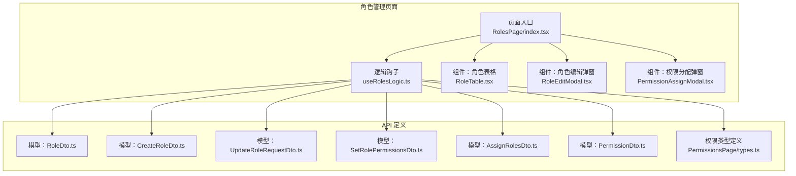
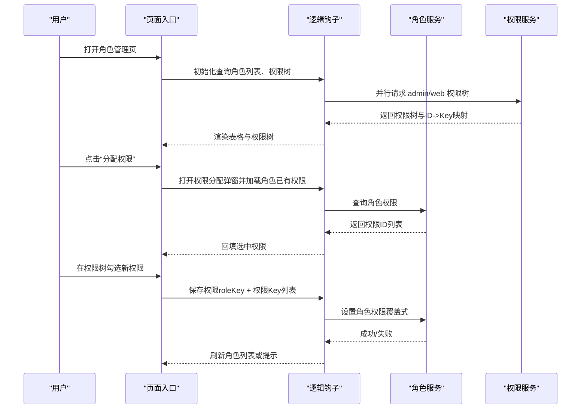
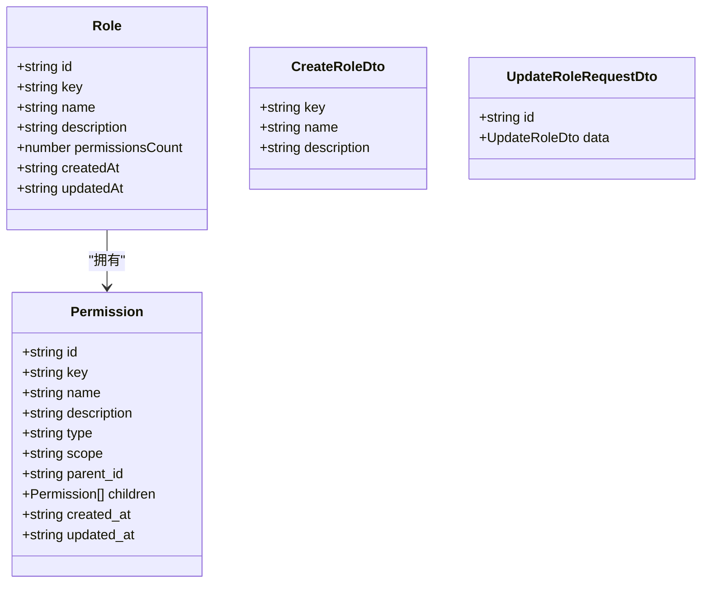
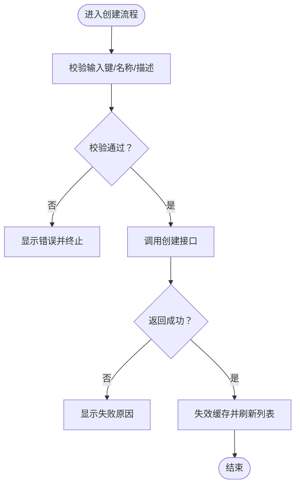
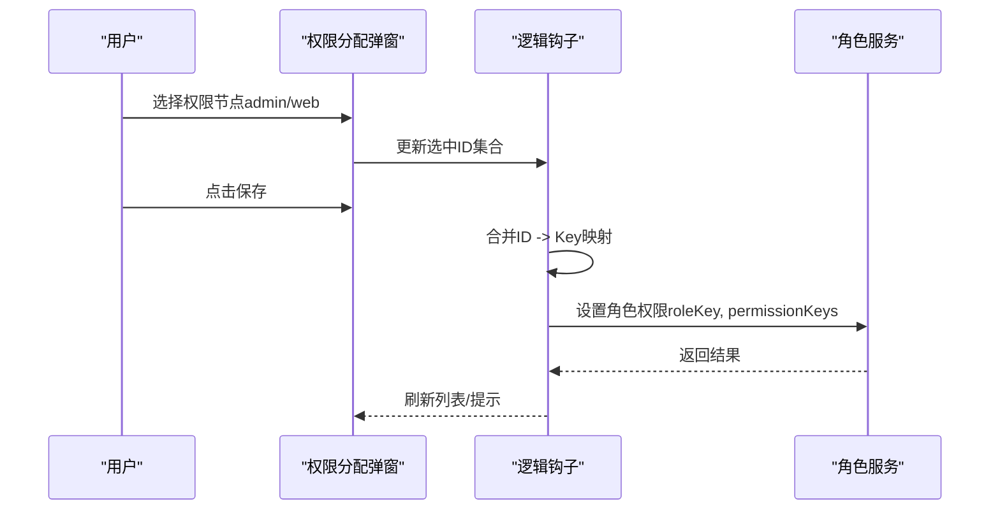
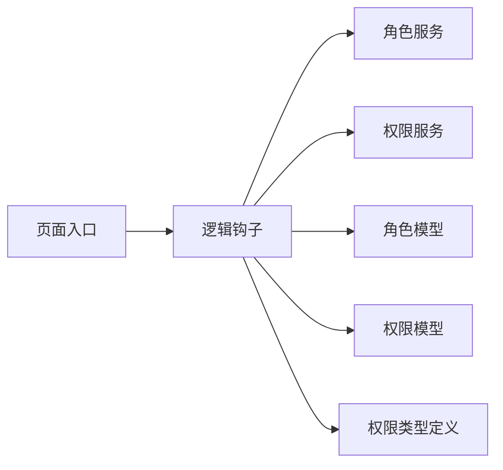

# 角色管理

<cite>
**本文引用的文件**
- [src/modules/admin/pages/users-security/RolesPage/index.tsx](file://src/modules/admin/pages/users-security/RolesPage/index.tsx)
- [src/modules/admin/pages/users-security/RolesPage/hooks/useRolesLogic.ts](file://src/modules/admin/pages/users-security/RolesPage/hooks/useRolesLogic.ts)
- [src/modules/admin/pages/users-security/RolesPage/components/RoleTable.tsx](file://src/modules/admin/pages/users-security/RolesPage/components/RoleTable.tsx)
- [src/modules/admin/pages/users-security/RolesPage/components/RoleEditModal.tsx](file://src/modules/admin/pages/users-security/RolesPage/components/RoleEditModal.tsx)
- [src/modules/admin/pages/users-security/RolesPage/components/PermissionAssignModal.tsx](file://src/modules/admin/pages/users-security/RolesPage/components/PermissionAssignModal.tsx)
- [src/modules/admin/pages/users-security/RolesPage/types.ts](file://src/modules/admin/pages/users-security/RolesPage/types.ts)
- [src/api/services/RolesService.ts](file://src/api/services/RolesService.ts)
- [src/api/models/RoleDto.ts](file://src/api/models/RoleDto.ts)
- [src/api/models/CreateRoleDto.ts](file://src/api/models/CreateRoleDto.ts)
- [src/api/models/UpdateRoleRequestDto.ts](file://src/api/models/UpdateRoleRequestDto.ts)
- [src/api/models/SetRolePermissionsDto.ts](file://src/api/models/SetRolePermissionsDto.ts)
- [src/api/models/AssignRolesDto.ts](file://src/api/models/AssignRolesDto.ts)
- [src/api/models/PermissionDto.ts](file://src/api/models/PermissionDto.ts)
- [src/modules/admin/pages/users-security/PermissionsPage/types.ts](file://src/modules/admin/pages/users-security/PermissionsPage/types.ts)
</cite>

## 目录
1. [简介](#简介)
2. [项目结构](#项目结构)
3. [核心组件](#核心组件)
4. [架构总览](#架构总览)
5. [详细组件分析](#详细组件分析)
6. [依赖分析](#依赖分析)
7. [性能考虑](#性能考虑)
8. [故障排查指南](#故障排查指南)
9. [结论](#结论)
10. [附录](#附录)

## 简介
本文件系统性阐述角色管理功能的架构设计与实现细节，涵盖角色定义、角色权限分配、角色继承关系与角色用户绑定机制。文档还解释角色创建流程、角色权限批量配置与变更追踪，并提供角色模板管理、批量操作与权限审计的建议方案。最后给出角色设计最佳实践、命名规范与权限最小化原则，以及常见问题的解决方案。

## 项目结构
角色管理功能位于后台管理模块的“用户与安全”页面下，采用“页面 + 逻辑钩子 + 组件”的分层组织方式：
- 页面入口负责组合状态与动作，渲染表格与弹窗
- 逻辑钩子封装查询、变更与业务流程
- 组件拆分表格、编辑弹窗、权限分配弹窗等可复用 UI
- API 层通过服务与模型定义角色与权限的数据契约

图表来源
- [src/modules/admin/pages/users-security/RolesPage/index.tsx](file://src/modules/admin/pages/users-security/RolesPage/index.tsx#L1-L99)
- [src/modules/admin/pages/users-security/RolesPage/hooks/useRolesLogic.ts](file://src/modules/admin/pages/users-security/RolesPage/hooks/useRolesLogic.ts#L1-L330)
- [src/modules/admin/pages/users-security/RolesPage/components/RoleTable.tsx](file://src/modules/admin/pages/users-security/RolesPage/components/RoleTable.tsx#L1-L167)
- [src/modules/admin/pages/users-security/RolesPage/components/RoleEditModal.tsx](file://src/modules/admin/pages/users-security/RolesPage/components/RoleEditModal.tsx#L1-L124)
- [src/modules/admin/pages/users-security/RolesPage/components/PermissionAssignModal.tsx](file://src/modules/admin/pages/users-security/RolesPage/components/PermissionAssignModal.tsx#L1-L115)
- [src/api/models/RoleDto.ts](file://src/api/models/RoleDto.ts#L1-L36)
- [src/api/models/CreateRoleDto.ts](file://src/api/models/CreateRoleDto.ts#L1-L17)
- [src/api/models/UpdateRoleRequestDto.ts](file://src/api/models/UpdateRoleRequestDto.ts#L1-L11)
- [src/api/models/SetRolePermissionsDto.ts](file://src/api/models/SetRolePermissionsDto.ts#L1-L16)
- [src/api/models/AssignRolesDto.ts](file://src/api/models/AssignRolesDto.ts#L1-L16)
- [src/api/models/PermissionDto.ts](file://src/api/models/PermissionDto.ts#L1-L85)
- [src/modules/admin/pages/users-security/PermissionsPage/types.ts](file://src/modules/admin/pages/users-security/PermissionsPage/types.ts#L1-L23)

章节来源
- [src/modules/admin/pages/users-security/RolesPage/index.tsx](file://src/modules/admin/pages/users-security/RolesPage/index.tsx#L1-L99)
- [src/modules/admin/pages/users-security/RolesPage/hooks/useRolesLogic.ts](file://src/modules/admin/pages/users-security/RolesPage/hooks/useRolesLogic.ts#L1-L330)

## 核心组件
- 页面入口：聚合状态与动作，渲染角色表格与两个弹窗（编辑、权限分配）
- 逻辑钩子：封装角色列表、权限树、创建/更新/删除、权限分配等业务流程
- 表格组件：展示角色列表、分页、搜索、操作按钮
- 编辑弹窗：表单校验与提交（含角色键唯一性约束）
- 权限分配弹窗：按作用域（admin/web）选择权限树节点并保存

章节来源
- [src/modules/admin/pages/users-security/RolesPage/index.tsx](file://src/modules/admin/pages/users-security/RolesPage/index.tsx#L1-L99)
- [src/modules/admin/pages/users-security/RolesPage/hooks/useRolesLogic.ts](file://src/modules/admin/pages/users-security/RolesPage/hooks/useRolesLogic.ts#L1-L330)
- [src/modules/admin/pages/users-security/RolesPage/components/RoleTable.tsx](file://src/modules/admin/pages/users-security/RolesPage/components/RoleTable.tsx#L1-L167)
- [src/modules/admin/pages/users-security/RolesPage/components/RoleEditModal.tsx](file://src/modules/admin/pages/users-security/RolesPage/components/RoleEditModal.tsx#L1-L124)
- [src/modules/admin/pages/users-security/RolesPage/components/PermissionAssignModal.tsx](file://src/modules/admin/pages/users-security/RolesPage/components/PermissionAssignModal.tsx#L1-L115)

## 架构总览
角色管理遵循“前端状态 + API 调用 + 数据模型”的清晰边界：
- 前端状态：分页、搜索、弹窗状态、选中权限集合
- API 调用：角色 CRUD、角色权限设置、权限树拉取
- 数据模型：角色、权限、权限树节点、请求/响应 DTO

图表来源
- [src/modules/admin/pages/users-security/RolesPage/index.tsx](file://src/modules/admin/pages/users-security/RolesPage/index.tsx#L1-L99)
- [src/modules/admin/pages/users-security/RolesPage/hooks/useRolesLogic.ts](file://src/modules/admin/pages/users-security/RolesPage/hooks/useRolesLogic.ts#L28-L125)
- [src/api/services/RolesService.ts](file://src/api/services/RolesService.ts#L1-L30)

## 详细组件分析

### 角色定义与数据模型
- 角色实体包含唯一键、显示名、描述、创建/更新时间与权限数量
- 角色创建/更新使用独立 DTO，确保字段约束与后端一致
- 权限实体包含键、名称、类型（API/Page/Button）、作用域（WEB/ADMIN）、父子关系与时间戳

图表来源
- [src/api/models/RoleDto.ts](file://src/api/models/RoleDto.ts#L1-L36)
- [src/api/models/CreateRoleDto.ts](file://src/api/models/CreateRoleDto.ts#L1-L17)
- [src/api/models/UpdateRoleRequestDto.ts](file://src/api/models/UpdateRoleRequestDto.ts#L1-L11)
- [src/modules/admin/pages/users-security/PermissionsPage/types.ts](file://src/modules/admin/pages/users-security/PermissionsPage/types.ts#L1-L23)

章节来源
- [src/api/models/RoleDto.ts](file://src/api/models/RoleDto.ts#L1-L36)
- [src/api/models/CreateRoleDto.ts](file://src/api/models/CreateRoleDto.ts#L1-L17)
- [src/api/models/UpdateRoleRequestDto.ts](file://src/api/models/UpdateRoleRequestDto.ts#L1-L11)
- [src/api/models/PermissionDto.ts](file://src/api/models/PermissionDto.ts#L1-L85)
- [src/modules/admin/pages/users-security/PermissionsPage/types.ts](file://src/modules/admin/pages/users-security/PermissionsPage/types.ts#L1-L23)

### 角色创建流程
- 表单校验：角色键（小写、数字、短横线）、名称长度、描述长度
- 提交后调用创建接口，成功后刷新角色列表
- 失败时输出错误信息

图表来源
- [src/modules/admin/pages/users-security/RolesPage/components/RoleEditModal.tsx](file://src/modules/admin/pages/users-security/RolesPage/components/RoleEditModal.tsx#L11-L19)
- [src/modules/admin/pages/users-security/RolesPage/hooks/useRolesLogic.ts](file://src/modules/admin/pages/users-security/RolesPage/hooks/useRolesLogic.ts#L128-L143)

章节来源
- [src/modules/admin/pages/users-security/RolesPage/components/RoleEditModal.tsx](file://src/modules/admin/pages/users-security/RolesPage/components/RoleEditModal.tsx#L1-L124)
- [src/modules/admin/pages/users-security/RolesPage/hooks/useRolesLogic.ts](file://src/modules/admin/pages/users-security/RolesPage/hooks/useRolesLogic.ts#L128-L143)

### 角色权限分配与批量配置
- 权限树：按作用域（admin/web）分别加载，支持自动层级推导
- 选中策略：维护 admin/web 的选中 ID 集合，保存时转换为权限 Key 列表
- 覆盖式设置：以传入的权限 Key 列表为准，替换角色当前权限

图表来源
- [src/modules/admin/pages/users-security/RolesPage/components/PermissionAssignModal.tsx](file://src/modules/admin/pages/users-security/RolesPage/components/PermissionAssignModal.tsx#L1-L115)
- [src/modules/admin/pages/users-security/RolesPage/hooks/useRolesLogic.ts](file://src/modules/admin/pages/users-security/RolesPage/hooks/useRolesLogic.ts#L41-L125)
- [src/modules/admin/pages/users-security/RolesPage/hooks/useRolesLogic.ts](file://src/modules/admin/pages/users-security/RolesPage/hooks/useRolesLogic.ts#L243-L263)

章节来源
- [src/modules/admin/pages/users-security/RolesPage/components/PermissionAssignModal.tsx](file://src/modules/admin/pages/users-security/RolesPage/components/PermissionAssignModal.tsx#L1-L115)
- [src/modules/admin/pages/users-security/RolesPage/hooks/useRolesLogic.ts](file://src/modules/admin/pages/users-security/RolesPage/hooks/useRolesLogic.ts#L41-L125)
- [src/modules/admin/pages/users-security/RolesPage/hooks/useRolesLogic.ts](file://src/modules/admin/pages/users-security/RolesPage/hooks/useRolesLogic.ts#L243-L263)

### 角色继承关系与角色用户绑定机制
- 角色继承：当前实现未见显式“角色继承”逻辑，权限分配为覆盖式设置
- 角色用户绑定：提供“为用户分配角色”的数据结构（AssignRolesDto），可用于后续扩展

章节来源
- [src/api/models/SetRolePermissionsDto.ts](file://src/api/models/SetRolePermissionsDto.ts#L1-L16)
- [src/api/models/AssignRolesDto.ts](file://src/api/models/AssignRolesDto.ts#L1-L16)

### 角色模板管理与批量操作
- 模板管理：当前未发现专用“角色模板”页面或模型
- 批量操作：可在现有权限分配弹窗基础上扩展“批量勾选/清空”与“模板应用”能力（建议）

章节来源
- [src/modules/admin/pages/users-security/RolesPage/components/PermissionAssignModal.tsx](file://src/modules/admin/pages/users-security/RolesPage/components/PermissionAssignModal.tsx#L1-L115)

### 角色权限审计
- 当前未发现权限变更审计日志的前端展示
- 建议在角色详情页增加“权限历史”或“审计记录”卡片，展示最近变更与操作者

章节来源
- [src/modules/admin/pages/users-security/RolesPage/index.tsx](file://src/modules/admin/pages/users-security/RolesPage/index.tsx#L1-L99)

## 依赖分析
- 组件耦合：页面入口依赖逻辑钩子；逻辑钩子依赖服务与模型；组件之间通过 props 解耦
- 外部依赖：React Query（查询/缓存）、TanStack Table（表格）、Zod（表单校验）、Sonner（通知）
- API 依赖：角色服务与权限服务提供 CRUD 与权限树接口

图表来源
- [src/modules/admin/pages/users-security/RolesPage/index.tsx](file://src/modules/admin/pages/users-security/RolesPage/index.tsx#L1-L99)
- [src/modules/admin/pages/users-security/RolesPage/hooks/useRolesLogic.ts](file://src/modules/admin/pages/users-security/RolesPage/hooks/useRolesLogic.ts#L1-L330)
- [src/api/services/RolesService.ts](file://src/api/services/RolesService.ts#L1-L30)
- [src/api/models/RoleDto.ts](file://src/api/models/RoleDto.ts#L1-L36)
- [src/api/models/PermissionDto.ts](file://src/api/models/PermissionDto.ts#L1-L85)
- [src/modules/admin/pages/users-security/PermissionsPage/types.ts](file://src/modules/admin/pages/users-security/PermissionsPage/types.ts#L1-L23)

章节来源
- [src/modules/admin/pages/users-security/RolesPage/hooks/useRolesLogic.ts](file://src/modules/admin/pages/users-security/RolesPage/hooks/useRolesLogic.ts#L1-L330)

## 性能考虑
- 权限树缓存：权限树查询设置 5 分钟缓存，减少重复请求
- 列表分页：角色列表支持分页与搜索，避免一次性加载大量数据
- 异步加载：权限树采用并行请求 admin/web 两棵树，提升首屏体验
- 本地状态：权限分配弹窗内维护选中集合，降低重渲染成本

章节来源
- [src/modules/admin/pages/users-security/RolesPage/hooks/useRolesLogic.ts](file://src/modules/admin/pages/users-security/RolesPage/hooks/useRolesLogic.ts#L41-L51)
- [src/modules/admin/pages/users-security/RolesPage/hooks/useRolesLogic.ts](file://src/modules/admin/pages/users-security/RolesPage/hooks/useRolesLogic.ts#L124-L125)

## 故障排查指南
- 创建/更新失败：检查后端返回的错误消息，确认角色键是否唯一、格式是否符合要求
- 权限分配失败：确认角色 key 是否存在，权限 Key 列表是否正确映射
- 权限树为空：检查权限服务可用性与作用域参数
- 删除角色：确认无用户绑定后再执行删除

章节来源
- [src/modules/admin/pages/users-security/RolesPage/hooks/useRolesLogic.ts](file://src/modules/admin/pages/users-security/RolesPage/hooks/useRolesLogic.ts#L140-L143)
- [src/modules/admin/pages/users-security/RolesPage/hooks/useRolesLogic.ts](file://src/modules/admin/pages/users-security/RolesPage/hooks/useRolesLogic.ts#L192-L195)
- [src/modules/admin/pages/users-security/RolesPage/hooks/useRolesLogic.ts](file://src/modules/admin/pages/users-security/RolesPage/hooks/useRolesLogic.ts#L256-L259)

## 结论
角色管理功能以清晰的分层架构实现了角色定义、权限分配与用户绑定的基础能力。当前实现强调覆盖式权限设置与简洁的 UI 流程，适合快速落地。后续可扩展角色模板、批量操作与权限审计能力，进一步完善角色体系的可运维性与可追溯性。

## 附录

### 角色配置示例（步骤指引）
- 新建角色
  - 打开“添加角色”，填写角色键（仅小写字母、数字、短横线）、名称与描述
  - 点击“添加”，成功后在列表中可见
- 分配权限
  - 在角色列表点击“分配权限”，打开权限分配弹窗
  - 在 admin/web 标签页勾选所需权限节点
  - 点击“保存配置”，完成覆盖式设置
- 编辑/删除角色
  - 点击“编辑”修改名称与描述
  - 点击“删除”确认后从系统移除

章节来源
- [src/modules/admin/pages/users-security/RolesPage/components/RoleEditModal.tsx](file://src/modules/admin/pages/users-security/RolesPage/components/RoleEditModal.tsx#L1-L124)
- [src/modules/admin/pages/users-security/RolesPage/components/PermissionAssignModal.tsx](file://src/modules/admin/pages/users-security/RolesPage/components/PermissionAssignModal.tsx#L1-L115)
- [src/modules/admin/pages/users-security/RolesPage/components/RoleTable.tsx](file://src/modules/admin/pages/users-security/RolesPage/components/RoleTable.tsx#L1-L167)

### 角色设计最佳实践
- 命名规范
  - 角色键：全小写、使用短横线连接单词，语义明确且全局唯一
  - 角色名：直观表达职责，便于识别
- 权限最小化
  - 优先授予完成任务所需的最小权限集合
  - 使用作用域区分（admin/web）避免越权
- 组织结构
  - 将相似职责的角色归类到同一模板，便于批量应用
- 变更追踪
  - 对关键角色的权限变更进行记录与审批

### 角色权限变更追踪（建议）
- 在角色详情页增加“权限历史”卡片，展示最近变更时间、操作者与变更内容
- 对覆盖式设置增加“差异对比”视图，帮助回溯变更