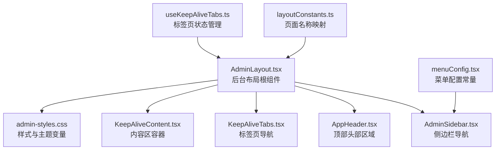
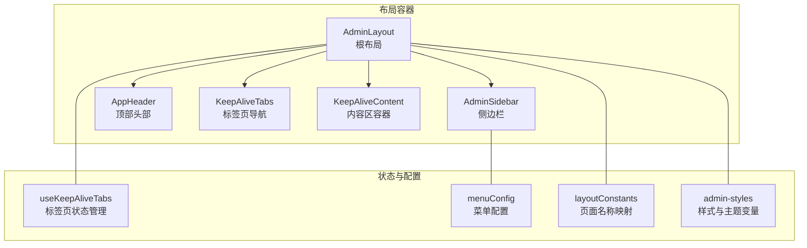
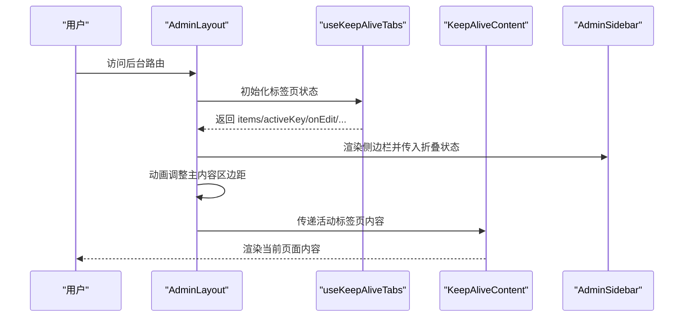
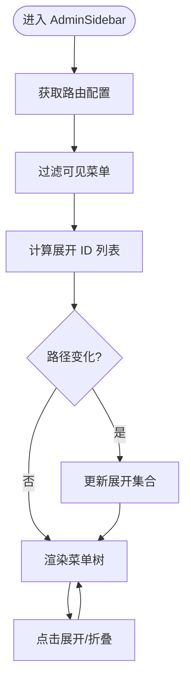
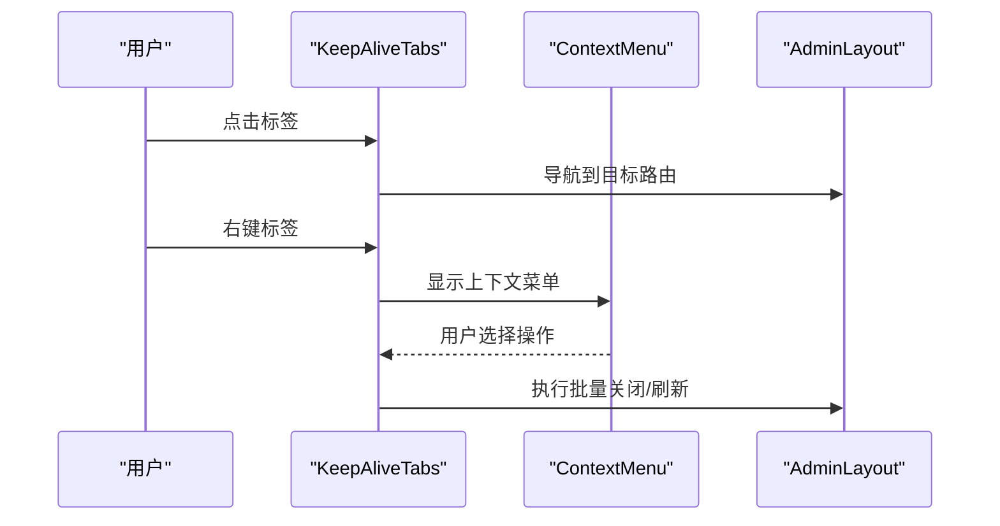
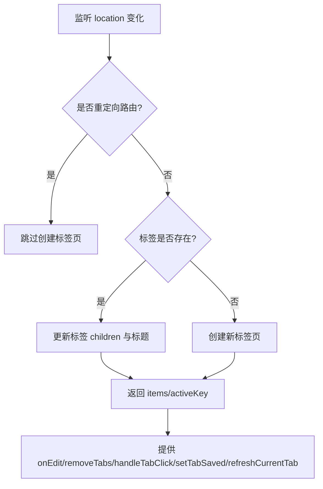
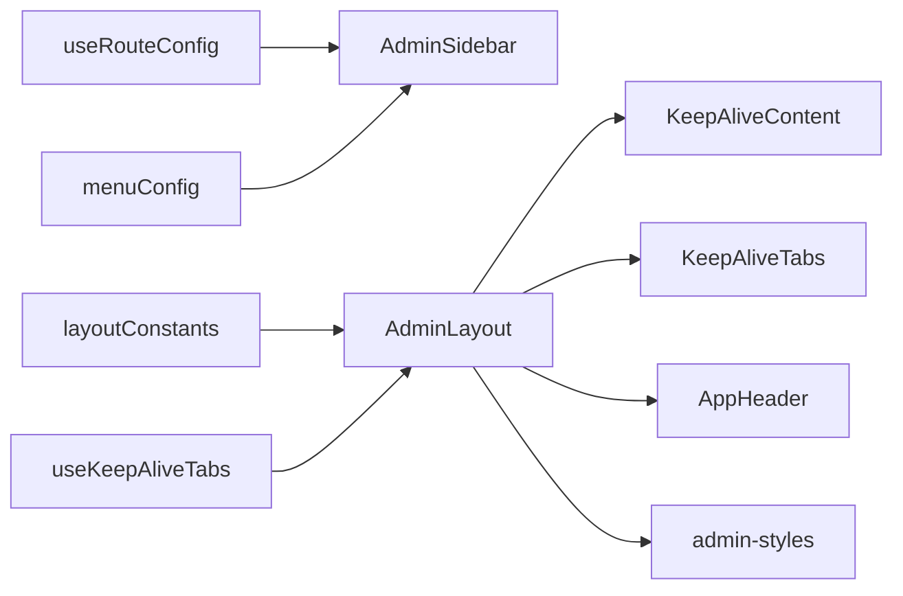

# 管理员界面布局

<cite>
**本文档引用的文件**
- [README.md](file://README.md)
- [AdminLayout.tsx](file://src/modules/admin/layouts/AdminLayout.tsx)
- [AdminSidebar.tsx](file://src/modules/admin/layouts/AdminSidebar.tsx)
- [AppHeader.tsx](file://src/modules/admin/layouts/AppHeader.tsx)
- [KeepAliveTabs.tsx](file://src/modules/admin/layouts/KeepAlive/KeepAliveTabs.tsx)
- [KeepAliveContent.tsx](file://src/modules/admin/layouts/KeepAlive/KeepAliveContent.tsx)
- [useKeepAliveTabs.ts](file://src/modules/admin/layouts/KeepAlive/useKeepAliveTabs.ts)
- [menuConfig.tsx](file://src/modules/admin/layouts/constants/menuConfig.tsx)
- [layoutConstants.ts](file://src/modules/admin/layouts/layoutConstants.ts)
- [admin-styles.css](file://src/modules/admin/layouts/admin-styles.css)
- [index.tsx](file://src/modules/admin/layouts/index.tsx)
</cite>

## 目录
1. [简介](#简介)
2. [项目结构](#项目结构)
3. [核心组件](#核心组件)
4. [架构总览](#架构总览)
5. [详细组件分析](#详细组件分析)
6. [依赖关系分析](#依赖关系分析)
7. [性能考虑](#性能考虑)
8. [故障排除指南](#故障排除指南)
9. [结论](#结论)
10. [附录](#附录)

## 简介
本文件面向管理员界面布局，系统性阐述后台管理系统的整体布局设计，包括侧边栏导航、顶部头部区域、主内容区域的结构与功能；详解菜单配置系统、响应式设计实现、主题切换机制与导航状态管理；解释布局组件的组合方式、样式系统与用户体验设计原则，并提供布局定制指南、组件复用模式与最佳实践建议。

## 项目结构
管理员布局位于 admin 模块的 layouts 目录下，采用“布局 + 侧边栏 + 标签页 + 内容区”的分层组织方式。核心入口导出为 AdminLayout，默认作为后台路由的根布局组件。

图表来源
- [AdminLayout.tsx](file://src/modules/admin/layouts/AdminLayout.tsx#L20-L94)
- [AdminSidebar.tsx](file://src/modules/admin/layouts/AdminSidebar.tsx#L169-L289)
- [AppHeader.tsx](file://src/modules/admin/layouts/AppHeader.tsx#L1-L41)
- [KeepAliveTabs.tsx](file://src/modules/admin/layouts/KeepAlive/KeepAliveTabs.tsx#L45-L222)
- [KeepAliveContent.tsx](file://src/modules/admin/layouts/KeepAlive/KeepAliveContent.tsx#L10-L36)
- [menuConfig.tsx](file://src/modules/admin/layouts/constants/menuConfig.tsx#L72-L418)
- [layoutConstants.ts](file://src/modules/admin/layouts/layoutConstants.ts#L1-L36)
- [useKeepAliveTabs.ts](file://src/modules/admin/layouts/KeepAlive/useKeepAliveTabs.ts#L14-L240)
- [admin-styles.css](file://src/modules/admin/layouts/admin-styles.css#L15-L83)

章节来源
- [README.md](file://README.md#L1-L11)
- [index.tsx](file://src/modules/admin/layouts/index.tsx#L1-L4)

## 核心组件
- AdminLayout：后台布局根组件，负责整体容器、侧边栏、标签页与内容区的协调，集成 KeepAlive 标签页状态管理与动态标题同步。
- AdminSidebar：可折叠的侧边栏导航，支持无限层级菜单、图标映射、自动展开与高亮。
- AppHeader：顶部头部区域，承载 KeepAliveTabs 标签页导航与操作按钮。
- KeepAliveTabs：可滚动的标签页导航，支持右键菜单、批量关闭、刷新与登出。
- KeepAliveContent：内容区容器，按标签页键值切换显示对应内容，支持滚动容器与上下文传递。
- useKeepAliveTabs：标签页状态钩子，负责标签页创建/更新/删除、动态标题解析、刷新与保存状态标记。
- menuConfig：静态菜单配置与图标映射，支撑侧边栏渲染。
- layoutConstants：页面路径到中文名称的映射，辅助标签页标题生成。
- admin-styles：Admin 模块专用样式与设计令牌，提供主题变量与组件样式覆盖。

章节来源
- [AdminLayout.tsx](file://src/modules/admin/layouts/AdminLayout.tsx#L20-L94)
- [AdminSidebar.tsx](file://src/modules/admin/layouts/AdminSidebar.tsx#L169-L289)
- [AppHeader.tsx](file://src/modules/admin/layouts/AppHeader.tsx#L1-L41)
- [KeepAliveTabs.tsx](file://src/modules/admin/layouts/KeepAlive/KeepAliveTabs.tsx#L45-L222)
- [KeepAliveContent.tsx](file://src/modules/admin/layouts/KeepAlive/KeepAliveContent.tsx#L10-L36)
- [useKeepAliveTabs.ts](file://src/modules/admin/layouts/KeepAlive/useKeepAliveTabs.ts#L14-L240)
- [menuConfig.tsx](file://src/modules/admin/layouts/constants/menuConfig.tsx#L72-L418)
- [layoutConstants.ts](file://src/modules/admin/layouts/layoutConstants.ts#L1-L36)
- [admin-styles.css](file://src/modules/admin/layouts/admin-styles.css#L15-L83)

## 架构总览
后台布局采用“布局容器 + 导航 + 内容”的三层结构，配合 KeepAlive 标签页实现多页面状态持久化与快速切换。侧边栏基于路由配置动态生成菜单树，顶部标签页提供统一导航与操作入口，内容区按标签页键值渲染对应页面。

图表来源
- [AdminLayout.tsx](file://src/modules/admin/layouts/AdminLayout.tsx#L20-L94)
- [AdminSidebar.tsx](file://src/modules/admin/layouts/AdminSidebar.tsx#L169-L289)
- [AppHeader.tsx](file://src/modules/admin/layouts/AppHeader.tsx#L1-L41)
- [KeepAliveTabs.tsx](file://src/modules/admin/layouts/KeepAlive/KeepAliveTabs.tsx#L45-L222)
- [KeepAliveContent.tsx](file://src/modules/admin/layouts/KeepAlive/KeepAliveContent.tsx#L10-L36)
- [useKeepAliveTabs.ts](file://src/modules/admin/layouts/KeepAlive/useKeepAliveTabs.ts#L14-L240)
- [menuConfig.tsx](file://src/modules/admin/layouts/constants/menuConfig.tsx#L72-L418)
- [layoutConstants.ts](file://src/modules/admin/layouts/layoutConstants.ts#L1-L36)
- [admin-styles.css](file://src/modules/admin/layouts/admin-styles.css#L15-L83)

## 详细组件分析

### AdminLayout：后台布局根组件
- 结构职责
  - 提供全局容器与背景色，承载侧边栏与主内容区。
  - 集成 KeepAlive 上下文，注入标签页保存状态设置能力。
  - 通过 Framer Motion 动画控制主内容区左右边距，适配侧边栏折叠。
  - 通过 Suspense 与 RouteProgressBar 提供路由切换的加载反馈。
- 状态与交互
  - 维护侧边栏折叠状态，向侧边栏传递折叠回调。
  - 通过 useKeepAliveTabs 获取标签页集合、活动键、编辑与点击事件。
  - 同步当前标签页标题到浏览器标签，支持动态标题。
  - 提供刷新与登出操作回调。
- 样式与主题
  - 使用 admin-styles 中的主题变量，确保 Admin 模块样式隔离。
  - 通过 #root-admin 容器应用作用域变量，避免与前台样式冲突。

图表来源
- [AdminLayout.tsx](file://src/modules/admin/layouts/AdminLayout.tsx#L20-L94)
- [useKeepAliveTabs.ts](file://src/modules/admin/layouts/KeepAlive/useKeepAliveTabs.ts#L14-L240)
- [KeepAliveContent.tsx](file://src/modules/admin/layouts/KeepAlive/KeepAliveContent.tsx#L10-L36)
- [AdminSidebar.tsx](file://src/modules/admin/layouts/AdminSidebar.tsx#L169-L289)

章节来源
- [AdminLayout.tsx](file://src/modules/admin/layouts/AdminLayout.tsx#L20-L94)
- [admin-styles.css](file://src/modules/admin/layouts/admin-styles.css#L15-L83)

### AdminSidebar：侧边栏导航
- 菜单生成
  - 基于 useRouteConfig 获取路由配置，过滤不可见项，递归渲染菜单树。
  - 支持图标映射（Lucide 图标），根据层级调整缩进与样式。
- 激活与展开
  - 通过 isPathActiveInTree 递归判断当前路径是否匹配某菜单或其子项。
  - 自动展开当前路径的所有祖先菜单，保证导航可视性。
  - 支持手动折叠/展开，维护 expandedMenus 集合。
- 响应式与交互
  - 折叠状态下仅显示图标与中心对齐按钮，节省空间。
  - 支持鼠标悬停高亮与选中态颜色区分。
- 性能优化
  - 使用 useMemo 缓存展开 ID 计算，减少重复遍历。
  - 使用 useState 与 Set 管理展开状态，避免深层渲染。

图表来源
- [AdminSidebar.tsx](file://src/modules/admin/layouts/AdminSidebar.tsx#L169-L289)
- [menuConfig.tsx](file://src/modules/admin/layouts/constants/menuConfig.tsx#L72-L418)

章节来源
- [AdminSidebar.tsx](file://src/modules/admin/layouts/AdminSidebar.tsx#L169-L289)
- [menuConfig.tsx](file://src/modules/admin/layouts/constants/menuConfig.tsx#L72-L418)

### AppHeader：顶部头部区域
- 组成
  - 承载 KeepAliveTabs 标签页导航，提供刷新与登出操作入口。
- 设计
  - 高度固定为 49px，与侧边栏顶部品牌区高度一致，保证视觉平衡。
  - 通过 Flex 布局实现标签区自适应与右侧操作区对齐。

章节来源
- [AppHeader.tsx](file://src/modules/admin/layouts/AppHeader.tsx#L1-L41)

### KeepAliveTabs：标签页导航
- 功能特性
  - 可滚动标签区，自动定位到活动标签，确保可见性。
  - 支持右键上下文菜单：关闭、关闭其他、关闭右侧、关闭已保存、全部关闭。
  - 支持 Home 标签特殊样式与未保存状态指示点。
  - 提供刷新按钮与登出按钮。
- 交互行为
  - 点击标签切换路由，支持批量删除标签页。
  - 通过 ref 与 useEffect 实现滚动定位与可见性检测。
- 复杂度
  - 时间复杂度 O(n)（n 为标签数量），滚动定位使用原生 API，性能稳定。

图表来源
- [KeepAliveTabs.tsx](file://src/modules/admin/layouts/KeepAlive/KeepAliveTabs.tsx#L45-L222)
- [AdminLayout.tsx](file://src/modules/admin/layouts/AdminLayout.tsx#L20-L94)

章节来源
- [KeepAliveTabs.tsx](file://src/modules/admin/layouts/KeepAlive/KeepAliveTabs.tsx#L45-L222)

### KeepAliveContent：内容区容器
- 职责
  - 根据标签页键值渲染对应内容，隐藏非活动标签页。
  - 为活动标签页提供滚动容器与上下文传递，支持刷新键值。
- 设计
  - 使用条件渲染与 CSS 类控制显示/隐藏，避免销毁已有组件状态。
  - 通过 TabKeyContext 传递当前标签键，便于子组件读取。

章节来源
- [KeepAliveContent.tsx](file://src/modules/admin/layouts/KeepAlive/KeepAliveContent.tsx#L10-L36)

### useKeepAliveTabs：标签页状态管理
- 路由到名称映射
  - 遍历路由配置，构建 path -> 名称映射表，支持动态路由参数匹配。
- 标签页生命周期
  - 监听 location 变化，自动创建/更新标签页，设置可关闭性。
  - 支持批量删除标签页，自动切换活动标签。
- 刷新与保存状态
  - 提供刷新当前标签页方法，通过增加 refreshKey 触发重新渲染。
  - 提供 setTabSaved 方法，标记未保存修改状态。
- 重定向处理
  - 检测重定向路由，避免创建无效标签页。

图表来源
- [useKeepAliveTabs.ts](file://src/modules/admin/layouts/KeepAlive/useKeepAliveTabs.ts#L14-L240)

章节来源
- [useKeepAliveTabs.ts](file://src/modules/admin/layouts/KeepAlive/useKeepAliveTabs.ts#L14-L240)

### 菜单配置系统与响应式设计
- 菜单配置
  - menuConfig 提供静态菜单树与图标映射，支持多级嵌套与权限字段。
  - layoutConstants 提供路径到中文名称的映射，辅助标签页标题生成。
- 响应式设计
  - AdminSidebar 在折叠状态下仅显示图标，底部提供折叠按钮。
  - KeepAliveTabs 标签区可滚动，避免溢出。
  - admin-styles 提供细滚动条与主题变量，优化视觉与交互体验。

章节来源
- [menuConfig.tsx](file://src/modules/admin/layouts/constants/menuConfig.tsx#L72-L418)
- [layoutConstants.ts](file://src/modules/admin/layouts/layoutConstants.ts#L1-L36)
- [AdminSidebar.tsx](file://src/modules/admin/layouts/AdminSidebar.tsx#L169-L289)
- [KeepAliveTabs.tsx](file://src/modules/admin/layouts/KeepAlive/KeepAliveTabs.tsx#L45-L222)
- [admin-styles.css](file://src/modules/admin/layouts/admin-styles.css#L318-L417)

### 主题切换机制与样式系统
- 主题变量
  - admin-styles 定义了 Admin 模块专用的设计令牌（间距、圆角、字号、主色、文字色、边框色、背景色、阴影等）。
- 样式隔离
  - 通过 .admin-layout 作用域与 #root-admin 容器，确保 Admin 样式与前台样式互不干扰。
- 组件样式覆盖
  - 提供 admin-* 前缀的工具类与组件样式覆盖，如 admin-page、admin-card、admin-input 等。
- 动画与滚动条
  - 侧边栏展开/收起动画优化，禁用菜单子菜单展开动画以提升响应速度。
  - 提供通用滚动条与表格专用滚动条样式，支持 hover 显示与平滑过渡。

章节来源
- [admin-styles.css](file://src/modules/admin/layouts/admin-styles.css#L15-L83)
- [admin-styles.css](file://src/modules/admin/layouts/admin-styles.css#L290-L313)
- [admin-styles.css](file://src/modules/admin/layouts/admin-styles.css#L318-L417)

### 导航状态管理
- 路由驱动的状态
  - 通过 useLocation 与 useOutlet 监听路由变化，动态创建/更新标签页。
  - 通过 useNavigate 实现标签页间的路由切换与批量关闭后的回退。
- 激活态与高亮
  - 侧边栏菜单与标签页均支持精确匹配与父子匹配，保证导航高亮一致性。
- 保存状态标记
  - 通过 setTabSaved 标记未保存修改，提示用户进行保存。

章节来源
- [useKeepAliveTabs.ts](file://src/modules/admin/layouts/KeepAlive/useKeepAliveTabs.ts#L14-L240)
- [AdminSidebar.tsx](file://src/modules/admin/layouts/AdminSidebar.tsx#L169-L289)
- [KeepAliveTabs.tsx](file://src/modules/admin/layouts/KeepAlive/KeepAliveTabs.tsx#L45-L222)

## 依赖关系分析
- 组件耦合
  - AdminLayout 依赖 useKeepAliveTabs、AdminSidebar、AppHeader、KeepAliveContent。
  - AdminSidebar 依赖 menuConfig 与 useRouteConfig。
  - KeepAliveTabs 依赖上下文菜单与下拉菜单组件。
- 数据流
  - 路由配置 → 菜单渲染 → 标签页创建/更新 → 内容区渲染。
- 外部依赖
  - Framer Motion 用于侧边栏与主内容区的过渡动画。
  - Lucide 图标库用于菜单图标。
  - Ant Design 组件与样式在 admin-styles 中进行覆盖与优化。

图表来源
- [AdminLayout.tsx](file://src/modules/admin/layouts/AdminLayout.tsx#L20-L94)
- [AdminSidebar.tsx](file://src/modules/admin/layouts/AdminSidebar.tsx#L169-L289)
- [useKeepAliveTabs.ts](file://src/modules/admin/layouts/KeepAlive/useKeepAliveTabs.ts#L14-L240)
- [menuConfig.tsx](file://src/modules/admin/layouts/constants/menuConfig.tsx#L72-L418)
- [layoutConstants.ts](file://src/modules/admin/layouts/layoutConstants.ts#L1-L36)
- [admin-styles.css](file://src/modules/admin/layouts/admin-styles.css#L15-L83)

章节来源
- [AdminLayout.tsx](file://src/modules/admin/layouts/AdminLayout.tsx#L20-L94)
- [AdminSidebar.tsx](file://src/modules/admin/layouts/AdminSidebar.tsx#L169-L289)
- [useKeepAliveTabs.ts](file://src/modules/admin/layouts/KeepAlive/useKeepAliveTabs.ts#L14-L240)
- [menuConfig.tsx](file://src/modules/admin/layouts/constants/menuConfig.tsx#L72-L418)
- [layoutConstants.ts](file://src/modules/admin/layouts/layoutConstants.ts#L1-L36)
- [admin-styles.css](file://src/modules/admin/layouts/admin-styles.css#L15-L83)

## 性能考虑
- 渲染优化
  - KeepAliveContent 通过条件渲染隐藏非活动标签页，避免销毁已有组件状态，降低重渲染成本。
  - AdminSidebar 使用 useMemo 缓存展开 ID 计算，减少重复遍历。
- 动画与滚动
  - 侧边栏展开/收起使用 transform 与 cubic-bezier 缓动函数，提升感知速度。
  - 禁用菜单子菜单展开动画，减少不必要的重绘。
- 滚动条与布局
  - 提供细滚动条与 hover 显示策略，减少视觉干扰。
  - 标签页自动滚动定位，避免用户手动滚动。

## 故障排除指南
- 标签页无法创建
  - 检查路由配置是否正确，确认路径与名称映射是否存在。
  - 若为重定向路由，将不会创建标签页，需检查路由配置。
- 标签页标题不正确
  - 确认 layoutConstants 中是否存在对应路径映射，或动态路由参数是否匹配。
- 侧边栏菜单不展开
  - 检查当前路径是否在展开 ID 列表中，确认父路径是否正确。
- 样式冲突
  - 确认 #root-admin 容器与 .admin-layout 作用域是否正确应用，避免与前台样式相互影响。

章节来源
- [useKeepAliveTabs.ts](file://src/modules/admin/layouts/KeepAlive/useKeepAliveTabs.ts#L14-L240)
- [layoutConstants.ts](file://src/modules/admin/layouts/layoutConstants.ts#L1-L36)
- [AdminSidebar.tsx](file://src/modules/admin/layouts/AdminSidebar.tsx#L169-L289)
- [admin-styles.css](file://src/modules/admin/layouts/admin-styles.css#L15-L83)

## 结论
管理员界面布局通过清晰的分层设计与完善的标签页状态管理，实现了高效、可扩展且具有良好用户体验的后台管理界面。菜单配置系统、响应式设计与主题切换机制共同保障了布局的灵活性与一致性。建议在后续迭代中持续优化路由配置与样式覆盖，确保布局在不同场景下的稳定性与可维护性。

## 附录
- 布局定制指南
  - 菜单定制：在 menuConfig 中添加/修改菜单项与图标映射，确保路径与权限字段正确。
  - 页面标题：在 layoutConstants 中添加路径到中文名称的映射，提升标签页可读性。
  - 样式定制：通过 admin-styles 修改设计令牌与组件样式覆盖，确保与整体设计风格一致。
- 组件复用模式
  - 将公共逻辑抽象为自定义 Hook（如 useKeepAliveTabs），在多个页面中复用。
  - 使用上下文（如 KeepAliveContext）传递状态，减少 props 传递层级。
- 最佳实践
  - 保持路由配置与菜单配置的一致性，避免出现死链或不可访问的菜单项。
  - 合理使用 KeepAlive，避免长时间驻留大量重型组件导致内存占用过高。
  - 在侧边栏与标签页中提供明确的高亮与状态提示，提升用户导航效率。