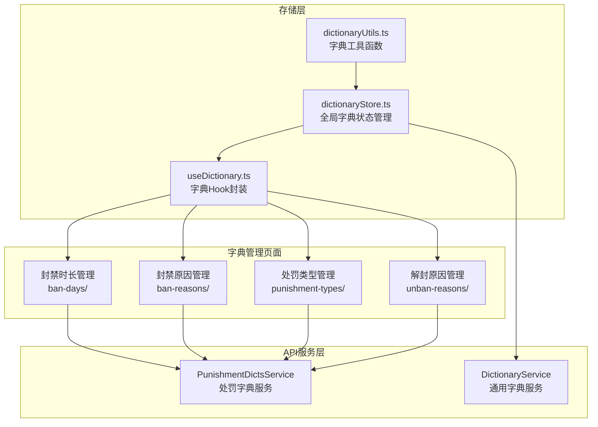
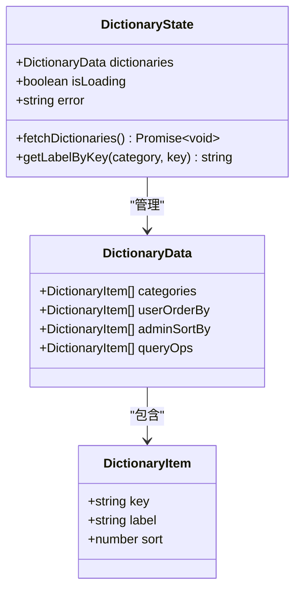
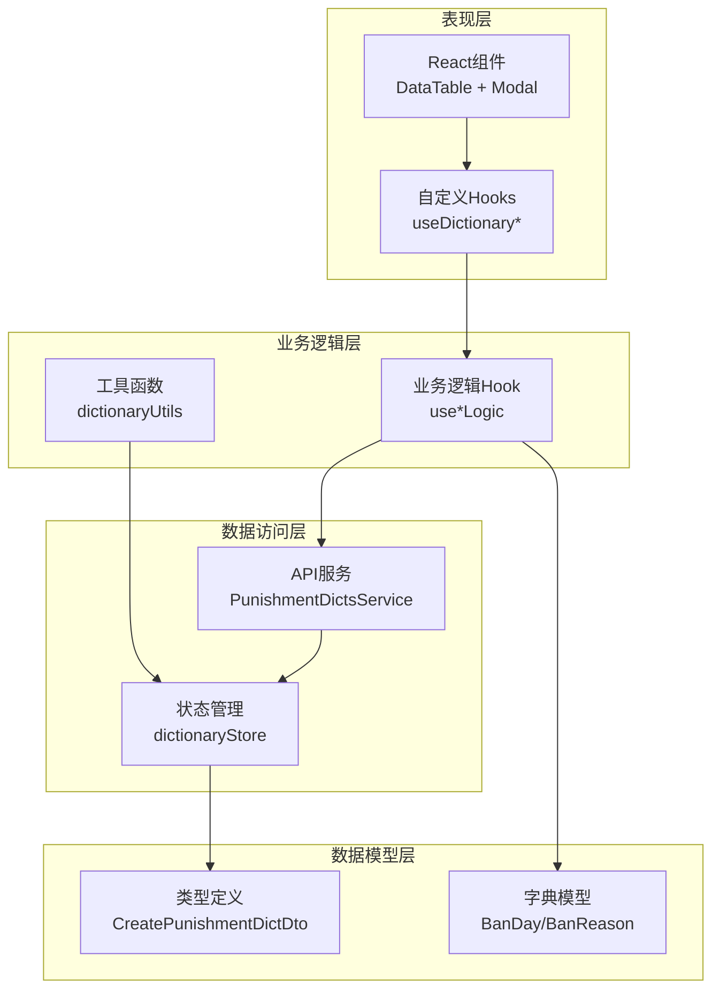
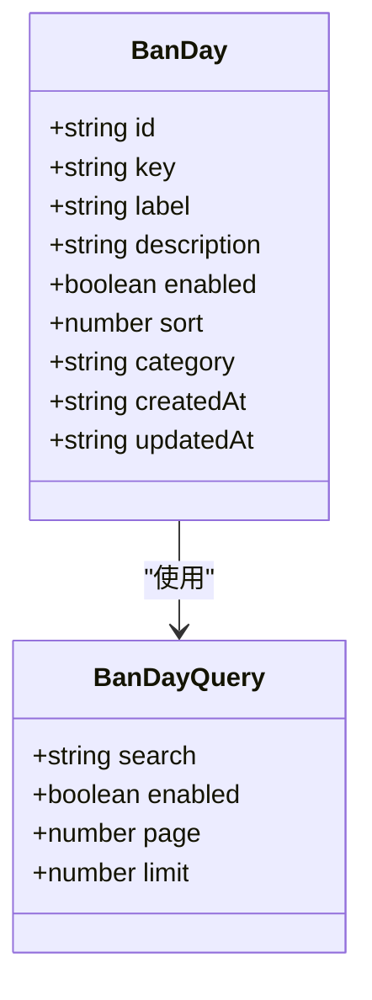
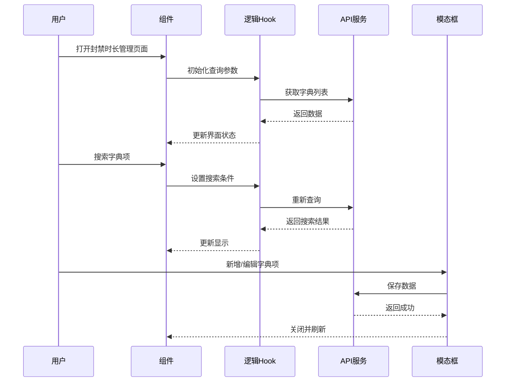
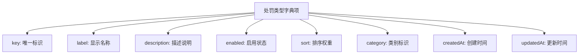
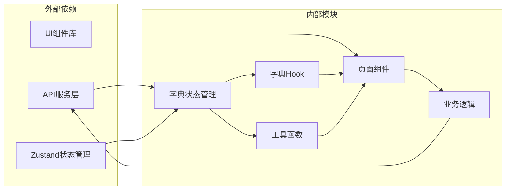

# 字典数据管理

<cite>
**本文档引用的文件**
- [dictionaryStore.ts](file://src/stores/dictionaryStore.ts)
- [useDictionary.ts](file://src/hooks/useDictionary.ts)
- [dictionaryUtils.ts](file://src/utils/dictionaryUtils.ts)
- [ban-days/types.ts](file://src/modules/admin/pages/system/dictionary/ban-days/types.ts)
- [ban-reasons/types.ts](file://src/modules/admin/pages/system/dictionary/ban-reasons/types.ts)
- [punishment-types/types.ts](file://src/modules/admin/pages/system/dictionary/punishment-types/types.ts)
- [unban-reasons/types.ts](file://src/modules/admin/pages/system/dictionary/unban-reasons/types.ts)
- [ban-days/index.tsx](file://src/modules/admin/pages/system/dictionary/ban-days/index.tsx)
- [ban-reasons/index.tsx](file://src/modules/admin/pages/system/dictionary/ban-reasons/index.tsx)
- [punishment-types/index.tsx](file://src/modules/admin/pages/system/dictionary/punishment-types/index.tsx)
- [unban-reasons/index.tsx](file://src/modules/admin/pages/system/dictionary/unban-reasons/index.tsx)
- [ban-days/useBanDaysLogic.tsx](file://src/modules/admin/pages/system/dictionary/ban-days/useBanDaysLogic.tsx)
</cite>

## 目录
1. [简介](#简介)
2. [项目结构](#项目结构)
3. [核心组件](#核心组件)
4. [架构概览](#架构概览)
5. [详细组件分析](#详细组件分析)
6. [依赖关系分析](#依赖关系分析)
7. [性能考虑](#性能考虑)
8. [故障排除指南](#故障排除指南)
9. [结论](#结论)

## 简介

字典数据管理功能是 zTorrent 站点管理系统中的重要组成部分，负责维护各类系统字典数据。本功能涵盖了封禁天数、封禁原因、处罚类型和解封原因等字典项的完整生命周期管理。

系统采用统一的字典管理架构，通过全局状态管理器提供字典数据的获取、缓存和查询能力，同时为各个具体的字典管理页面提供标准化的数据访问接口。所有字典数据都支持启用/禁用状态管理、排序规则控制和多条件查询功能。

## 项目结构

字典数据管理功能主要分布在以下目录结构中：

**图表来源**
- [dictionaryStore.ts](file://src/stores/dictionaryStore.ts#L1-L119)
- [useDictionary.ts](file://src/hooks/useDictionary.ts#L1-L57)
- [dictionaryUtils.ts](file://src/utils/dictionaryUtils.ts#L1-L34)

**章节来源**
- [dictionaryStore.ts](file://src/stores/dictionaryStore.ts#L1-L119)
- [useDictionary.ts](file://src/hooks/useDictionary.ts#L1-L57)
- [dictionaryUtils.ts](file://src/utils/dictionaryUtils.ts#L1-L34)

## 核心组件

### 全局字典状态管理器

全局字典状态管理器是整个字典系统的中枢，负责：

- **数据获取与缓存**：从后端API获取字典数据并缓存到内存中
- **数据标准化**：将后端返回的不规范数据转换为统一的前端格式
- **查询接口**：提供按类别和键值查询对应标签的方法
- **状态管理**：管理加载状态、错误信息和数据刷新

**图表来源**
- [dictionaryStore.ts](file://src/stores/dictionaryStore.ts#L15-L51)

### 字典Hook封装层

字典Hook封装层提供了更便捷的使用方式，包括：

- **分类专用Hook**：针对不同字典类别的专门查询方法
- **批量获取接口**：一次性获取某个类别下的所有字典项
- **状态暴露**：直接暴露store的状态和方法

**章节来源**
- [dictionaryStore.ts](file://src/stores/dictionaryStore.ts#L45-L118)
- [useDictionary.ts](file://src/hooks/useDictionary.ts#L3-L56)
- [dictionaryUtils.ts](file://src/utils/dictionaryUtils.ts#L20-L33)

## 架构概览

字典数据管理采用分层架构设计，确保了良好的可维护性和扩展性：

**图表来源**
- [ban-days/index.tsx](file://src/modules/admin/pages/system/dictionary/ban-days/index.tsx#L1-L155)
- [ban-days/useBanDaysLogic.tsx](file://src/modules/admin/pages/system/dictionary/ban-days/useBanDaysLogic.tsx#L1-L211)
- [dictionaryStore.ts](file://src/stores/dictionaryStore.ts#L1-L119)

## 详细组件分析

### 封禁时长管理模块

封禁时长管理模块是字典数据管理的核心功能之一，提供了完整的CRUD操作：

#### 数据模型定义

**图表来源**
- [ban-days/types.ts](file://src/modules/admin/pages/system/dictionary/ban-days/types.ts#L6-L11)

#### 核心功能特性

1. **搜索过滤**：支持按键值、名称、描述进行模糊搜索
2. **状态管理**：支持启用/禁用状态的实时切换
3. **分页查询**：支持大数据量的分页浏览
4. **排序控制**：支持自定义排序规则

#### 用户界面流程

**图表来源**
- [ban-days/index.tsx](file://src/modules/admin/pages/system/dictionary/ban-days/index.tsx#L20-L154)
- [ban-days/useBanDaysLogic.tsx](file://src/modules/admin/pages/system/dictionary/ban-days/useBanDaysLogic.tsx#L31-L74)

**章节来源**
- [ban-days/types.ts](file://src/modules/admin/pages/system/dictionary/ban-days/types.ts#L1-L32)
- [ban-days/index.tsx](file://src/modules/admin/pages/system/dictionary/ban-days/index.tsx#L1-L155)
- [ban-days/useBanDaysLogic.tsx](file://src/modules/admin/pages/system/dictionary/ban-days/useBanDaysLogic.tsx#L1-L211)

### 封禁原因管理模块

封禁原因管理模块提供了类似的功能，但专注于封禁原因的管理：

#### 功能特点

- **统一的管理界面**：与封禁时长管理保持一致的用户体验
- **状态控制**：支持原因的启用/禁用管理
- **搜索功能**：支持多维度的搜索过滤
- **批量操作**：支持新增、编辑、删除操作

**章节来源**
- [ban-reasons/types.ts](file://src/modules/admin/pages/system/dictionary/ban-reasons/types.ts#L1-L32)
- [ban-reasons/index.tsx](file://src/modules/admin/pages/system/dictionary/ban-reasons/index.tsx#L1-L127)

### 处罚类型管理模块

处罚类型管理模块提供了处罚类型的配置和管理功能：

#### 数据结构

**图表来源**
- [punishment-types/types.ts](file://src/modules/admin/pages/system/dictionary/punishment-types/types.ts#L6-L11)

**章节来源**
- [punishment-types/types.ts](file://src/modules/admin/pages/system/dictionary/punishment-types/types.ts#L1-L27)
- [punishment-types/index.tsx](file://src/modules/admin/pages/system/dictionary/punishment-types/index.tsx#L1-L125)

### 解封原因管理模块

解封原因管理模块提供了完整的解封原因管理功能：

#### 特殊功能

- **删除确认机制**：重要的删除操作需要二次确认
- **状态管理**：支持原因的启用/禁用控制
- **搜索过滤**：支持多条件的搜索和筛选

**章节来源**
- [unban-reasons/types.ts](file://src/modules/admin/pages/system/dictionary/unban-reasons/types.ts#L1-L24)
- [unban-reasons/index.tsx](file://src/modules/admin/pages/system/dictionary/unban-reasons/index.tsx#L1-L151)

## 依赖关系分析

字典数据管理功能的依赖关系呈现清晰的层次结构：

**图表来源**
- [dictionaryStore.ts](file://src/stores/dictionaryStore.ts#L12-L13)
- [useDictionary.ts](file://src/hooks/useDictionary.ts#L1)
- [dictionaryUtils.ts](file://src/utils/dictionaryUtils.ts#L1)

### 关键依赖关系

1. **状态管理依赖**：所有页面组件都依赖于全局字典状态管理器
2. **API服务依赖**：业务逻辑层依赖于特定的API服务进行数据操作
3. **工具函数依赖**：提供统一的字典查询和转换功能
4. **UI组件依赖**：使用统一的表格和模态框组件

**章节来源**
- [dictionaryStore.ts](file://src/stores/dictionaryStore.ts#L53-L118)
- [useDictionary.ts](file://src/hooks/useDictionary.ts#L1-L57)
- [dictionaryUtils.ts](file://src/utils/dictionaryUtils.ts#L1-L34)

## 性能考虑

### 数据缓存策略

系统采用了智能的数据缓存机制来优化性能：

- **内存缓存**：字典数据在首次加载后会被缓存到内存中
- **懒加载**：只有在需要时才触发数据请求
- **去重处理**：避免重复的API调用

### 查询优化

- **分页查询**：大数据量场景下使用分页减少单次请求数据量
- **条件过滤**：支持多条件组合查询，提高查询效率
- **状态复用**：利用React状态提升组件渲染性能

### 错误处理

系统实现了完善的错误处理机制：

- **网络错误**：捕获并处理API调用异常
- **数据错误**：对不规范的数据进行兼容性处理
- **用户反馈**：提供友好的错误提示信息

## 故障排除指南

### 常见问题及解决方案

#### 字典数据加载失败

**问题现象**：页面显示空白或加载状态持续

**可能原因**：
- API服务不可用
- 网络连接异常
- 数据格式不正确

**解决步骤**：
1. 检查API服务状态
2. 验证网络连接
3. 查看浏览器开发者工具中的错误信息
4. 确认数据格式符合预期

#### 字典项显示异常

**问题现象**：字典项显示为键值而非标签

**可能原因**：
- 字典数据未正确加载
- 键值不存在
- 标签字段为空

**解决步骤**：
1. 确认字典数据已成功加载
2. 检查键值是否存在于字典中
3. 验证标签字段是否有值
4. 调用刷新字典数据的方法

#### 搜索功能失效

**问题现象**：搜索框输入无效或搜索结果不正确

**可能原因**：
- 查询参数设置错误
- API接口不支持搜索
- 前端过滤逻辑异常

**解决步骤**：
1. 检查查询参数的设置
2. 验证API接口的搜索功能
3. 确认前端过滤逻辑正常
4. 查看控制台是否有JavaScript错误

**章节来源**
- [dictionaryStore.ts](file://src/stores/dictionaryStore.ts#L100-L106)
- [ban-days/useBanDaysLogic.tsx](file://src/modules/admin/pages/system/dictionary/ban-days/useBanDaysLogic.tsx#L44-L48)

## 结论

字典数据管理功能通过精心设计的架构和实现，为 zTorrent 站点提供了强大而灵活的字典数据管理能力。系统具有以下优势：

1. **统一的数据管理**：通过全局状态管理器实现了字典数据的统一管理
2. **模块化的架构设计**：每个字典管理模块都是独立的，便于维护和扩展
3. **完善的错误处理**：提供了全面的错误处理和用户反馈机制
4. **良好的性能表现**：通过缓存和优化策略确保了良好的用户体验

未来可以考虑的功能增强包括：
- 导入导出功能的完善
- 版本管理和变更追踪的实现
- 更丰富的数据验证规则
- 批量操作功能的扩展