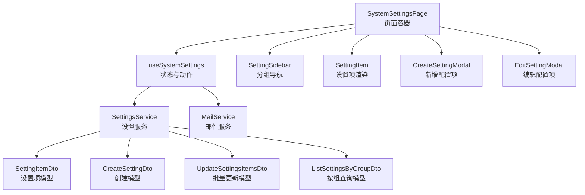
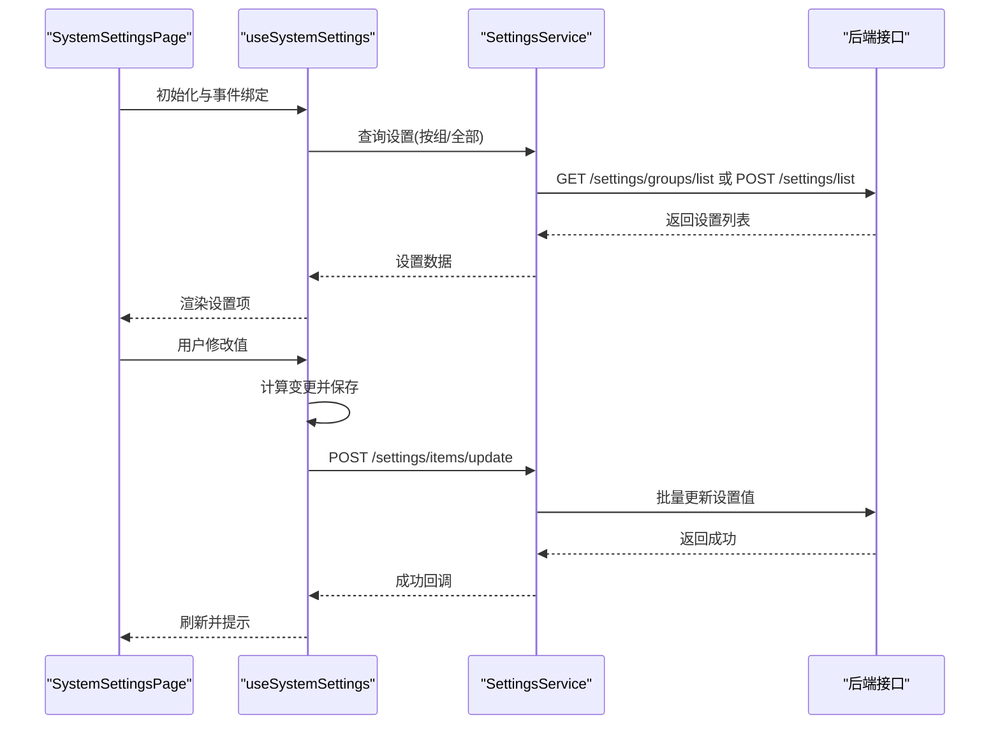
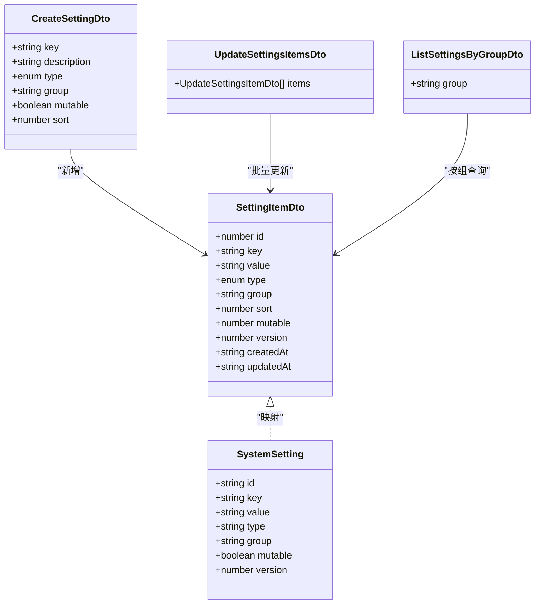
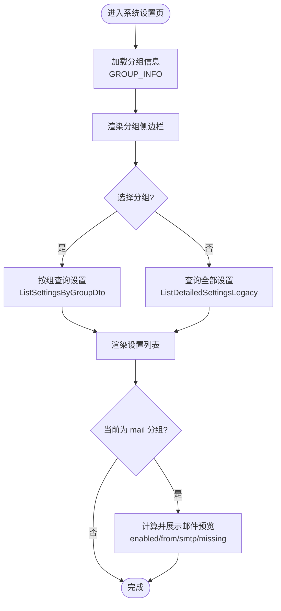
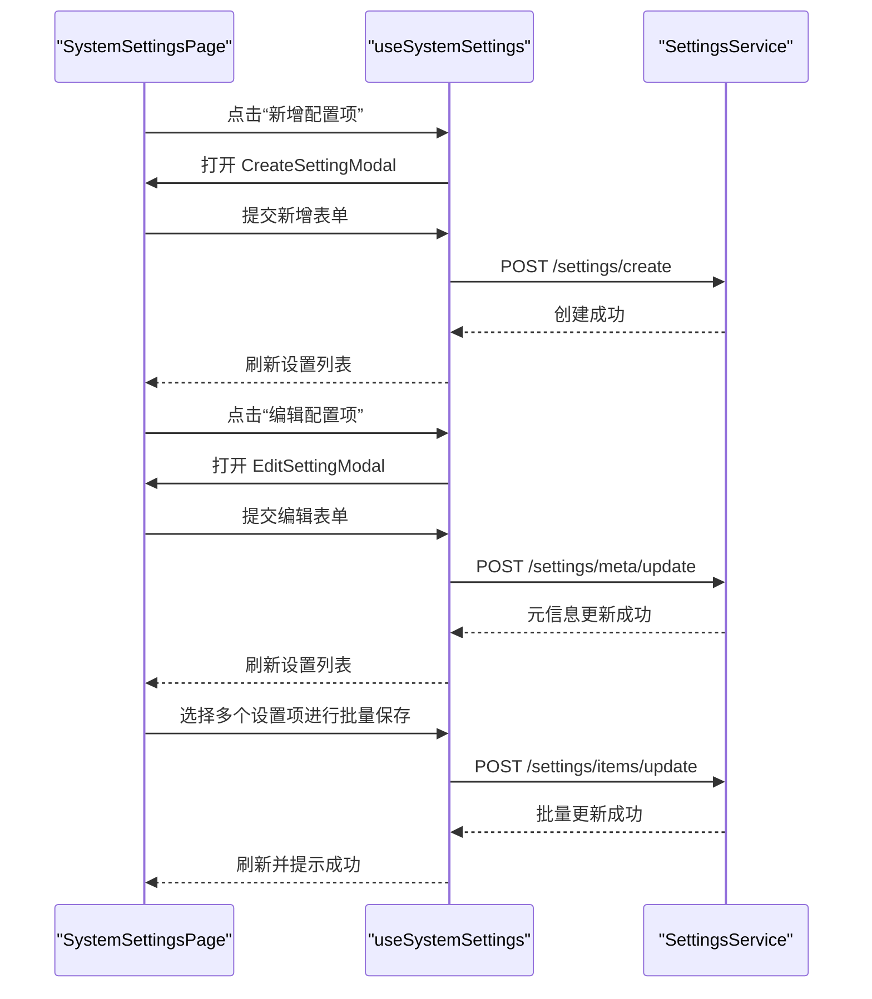
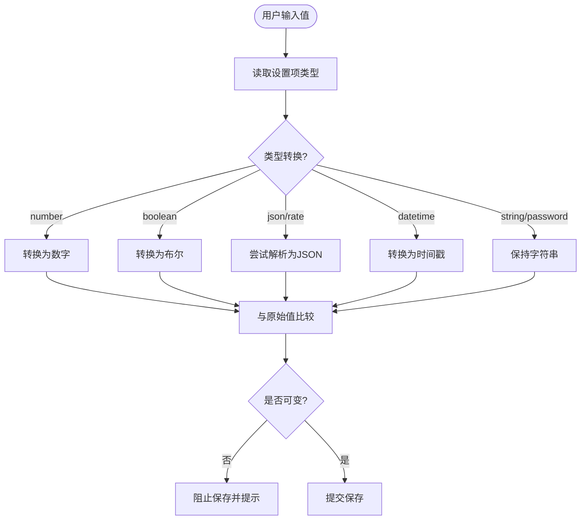
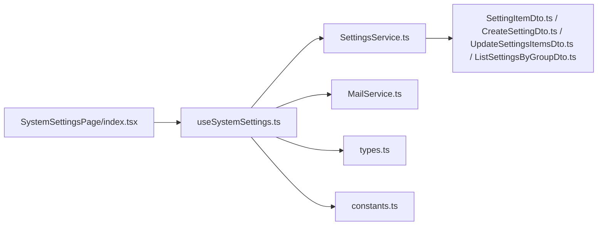

# 系统设置管理

<cite>
**本文档引用的文件**
- [src/modules/admin/pages/system/SystemSettingsPage/index.tsx](file://src/modules/admin/pages/system/SystemSettingsPage/index.tsx)
- [src/modules/admin/pages/system/SystemSettingsPage/hooks/useSystemSettings.ts](file://src/modules/admin/pages/system/SystemSettingsPage/hooks/useSystemSettings.ts)
- [src/modules/admin/pages/system/SystemSettingsPage/components/SettingSidebar.tsx](file://src/modules/admin/pages/system/SystemSettingsPage/components/SettingSidebar.tsx)
- [src/modules/admin/pages/system/SystemSettingsPage/components/SettingItem.tsx](file://src/modules/admin/pages/system/SystemSettingsPage/components/SettingItem.tsx)
- [src/modules/admin/pages/system/SystemSettingsPage/components/CreateSettingModal.tsx](file://src/modules/admin/pages/system/SystemSettingsPage/components/CreateSettingModal.tsx)
- [src/modules/admin/pages/system/SystemSettingsPage/components/EditSettingModal.tsx](file://src/modules/admin/pages/system/SystemSettingsPage/components/EditSettingModal.tsx)
- [src/modules/admin/pages/system/SystemSettingsPage/constants.ts](file://src/modules/admin/pages/system/SystemSettingsPage/constants.ts)
- [src/modules/admin/pages/system/SystemSettingsPage/types.ts](file://src/modules/admin/pages/system/SystemSettingsPage/types.ts)
- [src/api/models/SettingItemDto.ts](file://src/api/models/SettingItemDto.ts)
- [src/api/models/CreateSettingDto.ts](file://src/api/models/CreateSettingDto.ts)
- [src/api/models/UpdateSettingsItemsDto.ts](file://src/api/models/UpdateSettingsItemsDto.ts)
- [src/api/models/ListSettingsByGroupDto.ts](file://src/api/models/ListSettingsByGroupDto.ts)
- [src/api/services/SettingsService.ts](file://src/api/services/SettingsService.ts)
</cite>

## 目录
1. [简介](#简介)
2. [项目结构](#项目结构)
3. [核心组件](#核心组件)
4. [架构总览](#架构总览)
5. [详细组件分析](#详细组件分析)
6. [依赖关系分析](#依赖关系分析)
7. [性能考量](#性能考量)
8. [故障排除指南](#故障排除指南)
9. [结论](#结论)
10. [附录](#附录)

## 简介
本文件面向系统设置管理功能，提供从数据模型到前端交互、从权限控制到验证机制的完整说明。系统设置采用“键值对+分组+类型”的统一模型，支持站点信息、邮件配置、功能开关、安全策略等多类配置项的增删改查、批量导入导出、实时校验与版本控制。本文档同时给出最佳实践、安全配置建议与常见问题排查路径。

## 项目结构
系统设置管理位于后台管理模块的系统设置页面，采用“页面容器 + 钩子 + 组件 + 常量/类型 + API 模型/服务”的分层组织方式：
- 页面容器负责布局与状态编排
- 钩子封装查询、变更、邮件工具等业务逻辑
- 组件拆分侧边栏、设置项渲染、弹窗等职责
- 常量与类型定义分组与类型约束
- API 模型与服务对接后端接口

图表来源
- [src/modules/admin/pages/system/SystemSettingsPage/index.tsx](file://src/modules/admin/pages/system/SystemSettingsPage/index.tsx#L47-L292)
- [src/modules/admin/pages/system/SystemSettingsPage/hooks/useSystemSettings.ts](file://src/modules/admin/pages/system/SystemSettingsPage/hooks/useSystemSettings.ts#L76-L511)
- [src/api/services/SettingsService.ts](file://src/api/services/SettingsService.ts#L17-L219)
- [src/api/models/SettingItemDto.ts](file://src/api/models/SettingItemDto.ts#L5-L40)
- [src/api/models/CreateSettingDto.ts](file://src/api/models/CreateSettingDto.ts#L5-L46)
- [src/api/models/UpdateSettingsItemsDto.ts](file://src/api/models/UpdateSettingsItemsDto.ts#L5-L13)
- [src/api/models/ListSettingsByGroupDto.ts](file://src/api/models/ListSettingsByGroupDto.ts#L5-L12)

章节来源
- [src/modules/admin/pages/system/SystemSettingsPage/index.tsx](file://src/modules/admin/pages/system/SystemSettingsPage/index.tsx#L47-L292)
- [src/modules/admin/pages/system/SystemSettingsPage/hooks/useSystemSettings.ts](file://src/modules/admin/pages/system/SystemSettingsPage/hooks/useSystemSettings.ts#L76-L511)

## 核心组件
- 页面容器 SystemSettingsPage：负责布局、顶部操作区（保存/重置/新增）、分组导航、设置列表渲染、以及各弹窗的打开/关闭与提交。
- 钩子 useSystemSettings：封装查询设置、变更监听、批量保存、新增/编辑元信息、邮件连通性检测与诊断邮件发送等动作。
- 侧边栏 SettingSidebar：基于分组常量渲染分组导航，支持切换分组。
- 设置项组件 SettingItem：根据类型渲染输入控件，显示分组标签、不可变提示、版本与更新时间等。
- 新增/编辑弹窗 CreateSettingModal / EditSettingModal：提供表单校验与提交，支持键名后缀、类型、描述、可运行时修改、排序值等元信息。
- 常量与类型 constants.ts / types.ts：定义分组信息、设置类型集合、系统设置接口类型。
- API 模型与服务：SettingItemDto、CreateSettingDto、UpdateSettingsItemsDto、ListSettingsByGroupDto 与 SettingsService。

章节来源
- [src/modules/admin/pages/system/SystemSettingsPage/index.tsx](file://src/modules/admin/pages/system/SystemSettingsPage/index.tsx#L47-L292)
- [src/modules/admin/pages/system/SystemSettingsPage/hooks/useSystemSettings.ts](file://src/modules/admin/pages/system/SystemSettingsPage/hooks/useSystemSettings.ts#L76-L511)
- [src/modules/admin/pages/system/SystemSettingsPage/components/SettingSidebar.tsx](file://src/modules/admin/pages/system/SystemSettingsPage/components/SettingSidebar.tsx#L12-L41)
- [src/modules/admin/pages/system/SystemSettingsPage/components/SettingItem.tsx](file://src/modules/admin/pages/system/SystemSettingsPage/components/SettingItem.tsx#L243-L281)
- [src/modules/admin/pages/system/SystemSettingsPage/components/CreateSettingModal.tsx](file://src/modules/admin/pages/system/SystemSettingsPage/components/CreateSettingModal.tsx#L26-L178)
- [src/modules/admin/pages/system/SystemSettingsPage/components/EditSettingModal.tsx](file://src/modules/admin/pages/system/SystemSettingsPage/components/EditSettingModal.tsx#L26-L175)
- [src/modules/admin/pages/system/SystemSettingsPage/constants.ts](file://src/modules/admin/pages/system/SystemSettingsPage/constants.ts#L8-L80)
- [src/modules/admin/pages/system/SystemSettingsPage/types.ts](file://src/modules/admin/pages/system/SystemSettingsPage/types.ts#L27-L49)
- [src/api/models/SettingItemDto.ts](file://src/api/models/SettingItemDto.ts#L5-L40)
- [src/api/models/CreateSettingDto.ts](file://src/api/models/CreateSettingDto.ts#L5-L46)
- [src/api/models/UpdateSettingsItemsDto.ts](file://src/api/models/UpdateSettingsItemsDto.ts#L5-L13)
- [src/api/models/ListSettingsByGroupDto.ts](file://src/api/models/ListSettingsByGroupDto.ts#L5-L12)
- [src/api/services/SettingsService.ts](file://src/api/services/SettingsService.ts#L17-L219)

## 架构总览
系统设置管理采用前后端分离的调用链路：前端通过 SettingsService 与后端交互，支持按组查询、批量更新、新增、删除、元信息更新、审核开关读取等功能；邮件工具通过 MailService 提供连通性检测与诊断邮件发送能力。

图表来源
- [src/modules/admin/pages/system/SystemSettingsPage/index.tsx](file://src/modules/admin/pages/system/SystemSettingsPage/index.tsx#L96-L292)
- [src/modules/admin/pages/system/SystemSettingsPage/hooks/useSystemSettings.ts](file://src/modules/admin/pages/system/SystemSettingsPage/hooks/useSystemSettings.ts#L103-L156)
- [src/api/services/SettingsService.ts](file://src/api/services/SettingsService.ts#L48-L100)

章节来源
- [src/api/services/SettingsService.ts](file://src/api/services/SettingsService.ts#L17-L219)

## 详细组件分析

### 数据模型与类型
- SettingItemDto：后端返回的设置项结构，包含自增主键、键、值、类型、分组、描述、是否可变、排序、JSON Schema、更新人、版本号、时间戳等。
- CreateSettingDto：新增设置项请求体，包含键、描述、类型、分组、是否可运行时修改、排序等。
- UpdateSettingsItemsDto：批量更新请求体，包含待更新的设置项数组。
- ListSettingsByGroupDto：按组查询请求体，包含分组名称。
- SettingType / SettingGroup：前端类型定义，约束可用类型与分组集合。
- SystemSetting：前端内部使用的设置项接口，与后端模型映射。

图表来源
- [src/api/models/SettingItemDto.ts](file://src/api/models/SettingItemDto.ts#L5-L40)
- [src/api/models/CreateSettingDto.ts](file://src/api/models/CreateSettingDto.ts#L5-L46)
- [src/api/models/UpdateSettingsItemsDto.ts](file://src/api/models/UpdateSettingsItemsDto.ts#L5-L13)
- [src/api/models/ListSettingsByGroupDto.ts](file://src/api/models/ListSettingsByGroupDto.ts#L5-L12)
- [src/modules/admin/pages/system/SystemSettingsPage/types.ts](file://src/modules/admin/pages/system/SystemSettingsPage/types.ts#L27-L49)

章节来源
- [src/api/models/SettingItemDto.ts](file://src/api/models/SettingItemDto.ts#L5-L40)
- [src/api/models/CreateSettingDto.ts](file://src/api/models/CreateSettingDto.ts#L5-L46)
- [src/api/models/UpdateSettingsItemsDto.ts](file://src/api/models/UpdateSettingsItemsDto.ts#L5-L13)
- [src/api/models/ListSettingsByGroupDto.ts](file://src/api/models/ListSettingsByGroupDto.ts#L5-L12)
- [src/modules/admin/pages/system/SystemSettingsPage/types.ts](file://src/modules/admin/pages/system/SystemSettingsPage/types.ts#L1-L49)

### 分组管理与显示逻辑
- 分组信息由常量 GROUP_INFO 定义，包含 key、name、description 等，用于侧边栏导航与页面标题说明。
- 侧边栏 SettingSidebar 基于 GROUP_INFO 渲染分组按钮，点击切换 selectedGroup。
- 页面顶部显示当前分组名称与描述；在 mail 分组下额外展示启用状态、发件人与 SMTP 预览及缺失项提示。
- 设置项渲染时根据类型选择输入控件，并显示分组标签与不可变提示。

图表来源
- [src/modules/admin/pages/system/SystemSettingsPage/constants.ts](file://src/modules/admin/pages/system/SystemSettingsPage/constants.ts#L8-L68)
- [src/modules/admin/pages/system/SystemSettingsPage/components/SettingSidebar.tsx](file://src/modules/admin/pages/system/SystemSettingsPage/components/SettingSidebar.tsx#L12-L41)
- [src/modules/admin/pages/system/SystemSettingsPage/hooks/useSystemSettings.ts](file://src/modules/admin/pages/system/SystemSettingsPage/hooks/useSystemSettings.ts#L191-L216)

章节来源
- [src/modules/admin/pages/system/SystemSettingsPage/constants.ts](file://src/modules/admin/pages/system/SystemSettingsPage/constants.ts#L8-L68)
- [src/modules/admin/pages/system/SystemSettingsPage/components/SettingSidebar.tsx](file://src/modules/admin/pages/system/SystemSettingsPage/components/SettingSidebar.tsx#L12-L41)
- [src/modules/admin/pages/system/SystemSettingsPage/hooks/useSystemSettings.ts](file://src/modules/admin/pages/system/SystemSettingsPage/hooks/useSystemSettings.ts#L191-L216)

### 设置项增删改查与批量导入导出
- 新增配置项：CreateSettingModal 支持选择分组、输入键名后缀、类型、描述、可运行时修改、排序值，提交后调用 SettingsService.settingsControllerCreate。
- 编辑元信息：EditSettingModal 支持修改分组、键名后缀（可重命名）、类型、描述、可运行时修改、排序值，提交后调用 SettingsService.settingsControllerUpdateSettingMeta。
- 删除配置项：通过 SettingsService.settingsControllerDeleteSettingByKey 实现按键删除。
- 批量更新：useSystemSettings 中将变更后的键值对转换为目标类型后调用 SettingsService.settingsControllerUpdateSettingsItems。
- 搜索：支持按键或值搜索，查询全部设置并本地过滤。

图表来源
- [src/modules/admin/pages/system/SystemSettingsPage/components/CreateSettingModal.tsx](file://src/modules/admin/pages/system/SystemSettingsPage/components/CreateSettingModal.tsx#L69-L84)
- [src/modules/admin/pages/system/SystemSettingsPage/components/EditSettingModal.tsx](file://src/modules/admin/pages/system/SystemSettingsPage/components/EditSettingModal.tsx#L68-L83)
- [src/modules/admin/pages/system/SystemSettingsPage/hooks/useSystemSettings.ts](file://src/modules/admin/pages/system/SystemSettingsPage/hooks/useSystemSettings.ts#L396-L448)
- [src/api/services/SettingsService.ts](file://src/api/services/SettingsService.ts#L107-L130)
- [src/api/services/SettingsService.ts](file://src/api/services/SettingsService.ts#L166-L188)
- [src/api/services/SettingsService.ts](file://src/api/services/SettingsService.ts#L77-L100)

章节来源
- [src/modules/admin/pages/system/SystemSettingsPage/components/CreateSettingModal.tsx](file://src/modules/admin/pages/system/SystemSettingsPage/components/CreateSettingModal.tsx#L26-L178)
- [src/modules/admin/pages/system/SystemSettingsPage/components/EditSettingModal.tsx](file://src/modules/admin/pages/system/SystemSettingsPage/components/EditSettingModal.tsx#L26-L175)
- [src/modules/admin/pages/system/SystemSettingsPage/hooks/useSystemSettings.ts](file://src/modules/admin/pages/system/SystemSettingsPage/hooks/useSystemSettings.ts#L396-L448)
- [src/api/services/SettingsService.ts](file://src/api/services/SettingsService.ts#L77-L188)

### 设置值验证机制
- 类型归一化：根据设置项类型对输入值进行解析与比较，确保数值、布尔、JSON、时间等类型的正确性。
- 不可变检查：若设置项标记为不可变，则禁止运行时修改。
- 表单校验：新增/编辑弹窗对键名后缀进行正则校验，确保以字母开头且仅包含字母/数字/下划线/点/连字符。
- 邮件配置校验：通过邮件工具弹窗查看 SMTP 配置快照并屏蔽敏感字段，支持发送诊断邮件与连通性检测。

图表来源
- [src/modules/admin/pages/system/SystemSettingsPage/hooks/useSystemSettings.ts](file://src/modules/admin/pages/system/SystemSettingsPage/hooks/useSystemSettings.ts#L30-L59)
- [src/modules/admin/pages/system/SystemSettingsPage/hooks/useSystemSettings.ts](file://src/modules/admin/pages/system/SystemSettingsPage/hooks/useSystemSettings.ts#L218-L220)
- [src/modules/admin/pages/system/SystemSettingsPage/components/CreateSettingModal.tsx](file://src/modules/admin/pages/system/SystemSettingsPage/components/CreateSettingModal.tsx#L55-L67)
- [src/modules/admin/pages/system/SystemSettingsPage/components/EditSettingModal.tsx](file://src/modules/admin/pages/system/SystemSettingsPage/components/EditSettingModal.tsx#L55-L66)

章节来源
- [src/modules/admin/pages/system/SystemSettingsPage/hooks/useSystemSettings.ts](file://src/modules/admin/pages/system/SystemSettingsPage/hooks/useSystemSettings.ts#L30-L59)
- [src/modules/admin/pages/system/SystemSettingsPage/hooks/useSystemSettings.ts](file://src/modules/admin/pages/system/SystemSettingsPage/hooks/useSystemSettings.ts#L218-L220)
- [src/modules/admin/pages/system/SystemSettingsPage/components/CreateSettingModal.tsx](file://src/modules/admin/pages/system/SystemSettingsPage/components/CreateSettingModal.tsx#L55-L67)
- [src/modules/admin/pages/system/SystemSettingsPage/components/EditSettingModal.tsx](file://src/modules/admin/pages/system/SystemSettingsPage/components/EditSettingModal.tsx#L55-L66)

### 权限控制与用户界面
- 页面容器 SystemSettingsPage 负责组装 UI 并暴露操作按钮（保存、重置、新增、邮件工具）。
- 钩子 useSystemSettings 将查询、变更、提交等动作与 UI 解耦，便于权限与路由守卫在上层控制访问。
- 邮件工具弹窗提供“测试连通性”“查看 SMTP 配置”“发送测试邮件”等能力，便于管理员快速验证邮件配置。

章节来源
- [src/modules/admin/pages/system/SystemSettingsPage/index.tsx](file://src/modules/admin/pages/system/SystemSettingsPage/index.tsx#L96-L292)
- [src/modules/admin/pages/system/SystemSettingsPage/hooks/useSystemSettings.ts](file://src/modules/admin/pages/system/SystemSettingsPage/hooks/useSystemSettings.ts#L289-L337)

### 邮件配置、站点信息与功能开关
- 邮件配置（mail 分组）：支持 SMTP 主机、端口、加密、发件人邮箱与昵称等；页面顶部实时展示启用状态与配置预览；提供连通性检测与诊断邮件发送。
- 站点信息（site 分组）：包含站点名称、域名、联系方式等基础信息。
- 功能开关：通过布尔类型设置项实现功能开关，如注册开关、邀请开关、限流开关等。
- 审核设置（review 分组）：提供审核开关读取接口，配合后端策略控制内容审核流程。

章节来源
- [src/modules/admin/pages/system/SystemSettingsPage/index.tsx](file://src/modules/admin/pages/system/SystemSettingsPage/index.tsx#L187-L218)
- [src/modules/admin/pages/system/SystemSettingsPage/hooks/useSystemSettings.ts](file://src/modules/admin/pages/system/SystemSettingsPage/hooks/useSystemSettings.ts#L191-L216)
- [src/api/services/SettingsService.ts](file://src/api/services/SettingsService.ts#L195-L217)

## 依赖关系分析
- 页面容器依赖钩子提供的状态与动作函数。
- 钩子依赖 SettingsService 与 MailService，负责网络请求与状态管理。
- 组件依赖常量与类型定义，保证分组与类型的一致性。
- API 模型与服务构成前后端契约，确保数据结构与接口签名稳定。

图表来源
- [src/modules/admin/pages/system/SystemSettingsPage/index.tsx](file://src/modules/admin/pages/system/SystemSettingsPage/index.tsx#L18-L23)
- [src/modules/admin/pages/system/SystemSettingsPage/hooks/useSystemSettings.ts](file://src/modules/admin/pages/system/SystemSettingsPage/hooks/useSystemSettings.ts#L4-L7)
- [src/api/services/SettingsService.ts](file://src/api/services/SettingsService.ts#L5-L14)
- [src/modules/admin/pages/system/SystemSettingsPage/constants.ts](file://src/modules/admin/pages/system/SystemSettingsPage/constants.ts#L1-L80)
- [src/modules/admin/pages/system/SystemSettingsPage/types.ts](file://src/modules/admin/pages/system/SystemSettingsPage/types.ts#L1-L49)
- [src/api/models/SettingItemDto.ts](file://src/api/models/SettingItemDto.ts#L5-L40)
- [src/api/models/CreateSettingDto.ts](file://src/api/models/CreateSettingDto.ts#L5-L46)
- [src/api/models/UpdateSettingsItemsDto.ts](file://src/api/models/UpdateSettingsItemsDto.ts#L5-L13)
- [src/api/models/ListSettingsByGroupDto.ts](file://src/api/models/ListSettingsByGroupDto.ts#L5-L12)

章节来源
- [src/modules/admin/pages/system/SystemSettingsPage/index.tsx](file://src/modules/admin/pages/system/SystemSettingsPage/index.tsx#L18-L23)
- [src/modules/admin/pages/system/SystemSettingsPage/hooks/useSystemSettings.ts](file://src/modules/admin/pages/system/SystemSettingsPage/hooks/useSystemSettings.ts#L4-L7)
- [src/api/services/SettingsService.ts](file://src/api/services/SettingsService.ts#L5-L14)

## 性能考量
- 查询缓存：React Query 的 staleTime 设为 5 分钟，减少重复请求。
- 本地过滤：搜索模式下一次性拉取全部设置，再在前端过滤，适合中等规模配置集。
- 批量更新：将多次变更合并为一次批量请求，降低网络往返。
- 输入归一化：在保存前进行类型解析与相等性判断，避免无效请求与重复写入。

章节来源
- [src/modules/admin/pages/system/SystemSettingsPage/hooks/useSystemSettings.ts](file://src/modules/admin/pages/system/SystemSettingsPage/hooks/useSystemSettings.ts#L155-L156)
- [src/modules/admin/pages/system/SystemSettingsPage/hooks/useSystemSettings.ts](file://src/modules/admin/pages/system/SystemSettingsPage/hooks/useSystemSettings.ts#L349-L394)

## 故障排除指南
- 保存失败：检查是否有未保存的更改、网络状态与后端返回的错误码；查看控制台日志。
- 新增冲突：键已存在会返回冲突错误，确认键名唯一性。
- 连通性失败：使用“测试连通性”按钮检查 SMTP 配置；查看报告中的错误详情。
- 配置不完整：邮件分组下若缺少主机、端口或发件人邮箱，页面会高亮提示缺失项。
- 诊断邮件：通过“发送测试邮件”弹窗发送诊断邮件，查看返回结果定位问题。

章节来源
- [src/modules/admin/pages/system/SystemSettingsPage/hooks/useSystemSettings.ts](file://src/modules/admin/pages/system/SystemSettingsPage/hooks/useSystemSettings.ts#L227-L241)
- [src/modules/admin/pages/system/SystemSettingsPage/hooks/useSystemSettings.ts](file://src/modules/admin/pages/system/SystemSettingsPage/hooks/useSystemSettings.ts#L244-L265)
- [src/modules/admin/pages/system/SystemSettingsPage/hooks/useSystemSettings.ts](file://src/modules/admin/pages/system/SystemSettingsPage/hooks/useSystemSettings.ts#L268-L287)
- [src/modules/admin/pages/system/SystemSettingsPage/hooks/useSystemSettings.ts](file://src/modules/admin/pages/system/SystemSettingsPage/hooks/useSystemSettings.ts#L289-L337)
- [src/modules/admin/pages/system/SystemSettingsPage/index.tsx](file://src/modules/admin/pages/system/SystemSettingsPage/index.tsx#L124-L152)

## 结论
系统设置管理通过清晰的分层设计与完善的前端状态管理，实现了对多类型配置项的高效管理。借助分组导航、类型化输入、批量更新与邮件工具，管理员可以便捷地维护站点信息、功能开关与安全策略。建议在生产环境中结合权限控制与审计日志，确保配置变更的可追溯性与安全性。

## 附录
- 最佳实践
  - 使用明确的键命名规范（分组.后缀），便于分组与检索。
  - 对敏感信息（密码、令牌）使用 password 类型并在前端屏蔽显示。
  - 合理设置可运行时修改标志，避免核心参数在运行时被误改。
  - 批量导入导出时先在测试环境验证 JSON Schema 与类型一致性。
- 安全配置建议
  - 邮件配置使用 SSL/TLS 加密传输，定期轮换凭据。
  - 限制可运行时修改的配置项范围，核心参数建议通过重启生效。
  - 对外暴露的设置接口应配合鉴权与审计，记录每次变更。
- 常见问题
  - 键名非法：确保键名后缀符合正则要求。
  - 类型不匹配：在保存前确认输入值与设置项类型一致。
  - 排序异常：排序值应为数字，数值越小越靠前。