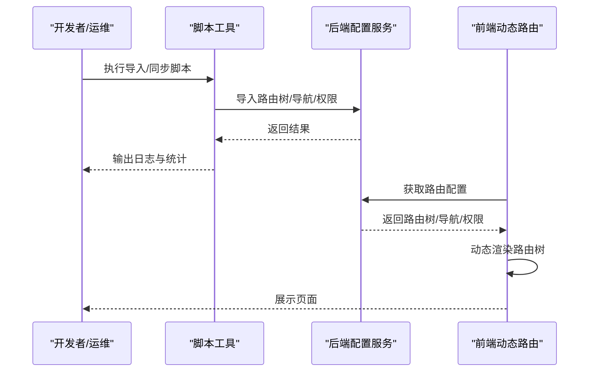
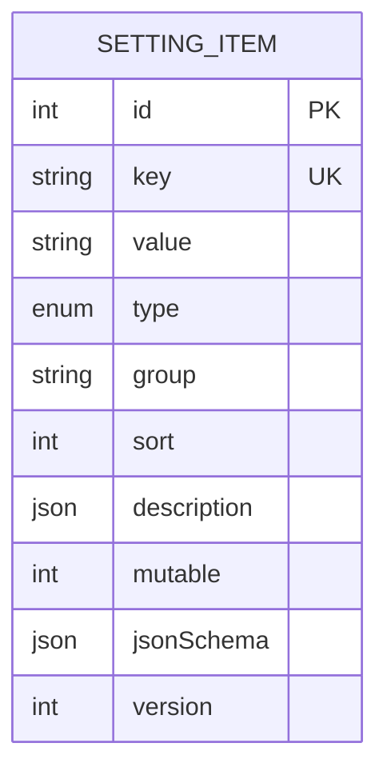
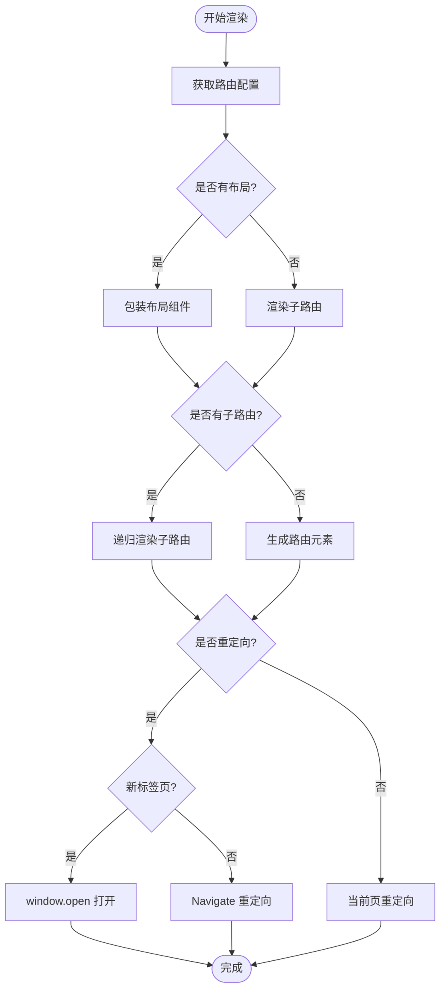
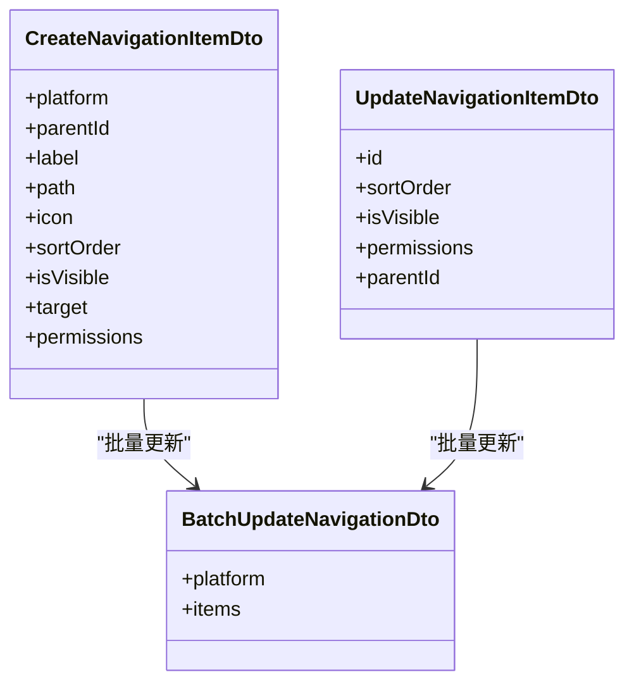
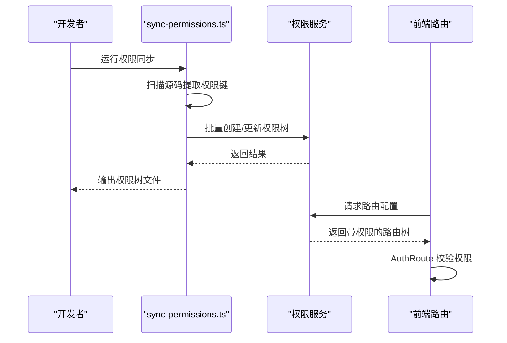
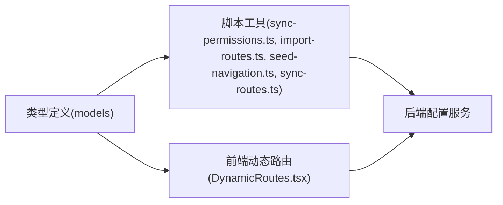

# 系统配置管理

<cite>
**本文档引用的文件**
- [CreateSettingDto.ts](file://src/api/models/CreateSettingDto.ts)
- [UpdateSettingsItemsDto.ts](file://src/api/models/UpdateSettingsItemsDto.ts)
- [SettingItemDto.ts](file://src/api/models/SettingItemDto.ts)
- [BatchUpdateNavigationDto.ts](file://src/api/models/BatchUpdateNavigationDto.ts)
- [CreateNavigationItemDto.ts](file://src/api/models/CreateNavigationItemDto.ts)
- [UpdateNavigationItemDto.ts](file://src/api/models/UpdateNavigationItemDto.ts)
- [CreateRouteDto.ts](file://src/api/models/CreateRouteDto.ts)
- [UpdateRouteDto.ts](file://src/api/models/UpdateRouteDto.ts)
- [RouteTreeNodeDto.ts](file://src/api/models/RouteTreeNodeDto.ts)
- [BindRoutePermissionsDto.ts](file://src/api/models/BindRoutePermissionsDto.ts)
- [SortRoutesDto.ts](file://src/api/models/SortRoutesDto.ts)
- [ImportRoutesDto.ts](file://src/api/models/ImportRoutesDto.ts)
- [DynamicRoutes.tsx](file://src/routes/DynamicRoutes.tsx)
- [sync-routes.ts](file://scripts/sync-routes.ts)
- [import-routes.ts](file://scripts/import-routes.ts)
- [seed-navigation.ts](file://scripts/seed-navigation.ts)
- [check-routes.ts](file://scripts/check-routes.ts)
- [sync-permissions.ts](file://scripts/sync-permissions.ts)
</cite>

## 目录
1. [简介](#简介)
2. [项目结构](#项目结构)
3. [核心组件](#核心组件)
4. [架构总览](#架构总览)
5. [详细组件分析](#详细组件分析)
6. [依赖关系分析](#依赖关系分析)
7. [性能考虑](#性能考虑)
8. [故障排查指南](#故障排查指南)
9. [结论](#结论)
10. [附录](#附录)

## 简介
本文件系统性梳理 zTorrent-site 项目的系统配置管理能力，涵盖系统设置、字典管理、路由配置与导航管理的完整链路。文档基于仓库中的类型定义、动态路由渲染器与配套脚本，阐述配置项的数据模型、验证规则、持久化机制、动态路由的权限绑定与前端集成，并提供备份恢复、版本管理与变更追踪的实践建议。

## 项目结构
系统配置相关的核心位置分布如下：
- 类型定义层：位于 `src/api/models/`，定义了系统设置、导航、路由等配置项的请求/响应模型
- 动态路由渲染层：位于 `src/routes/DynamicRoutes.tsx`，负责根据后端配置动态生成路由树
- 脚本工具层：位于 `scripts/`，提供路由导入、导航初始化、权限同步等运维脚本

```mermaid
graph TB
subgraph "类型定义层"
M1["SettingItemDto.ts"]
M2["CreateSettingDto.ts"]
M3["UpdateSettingsItemsDto.ts"]
M4["CreateNavigationItemDto.ts"]
M5["UpdateNavigationItemDto.ts"]
M6["BatchUpdateNavigationDto.ts"]
M7["CreateRouteDto.ts"]
M8["UpdateRouteDto.ts"]
M9["RouteTreeNodeDto.ts"]
M10["BindRoutePermissionsDto.ts"]
M11["SortRoutesDto.ts"]
M12["ImportRoutesDto.ts"]
end
subgraph "动态路由渲染层"
R1["DynamicRoutes.tsx"]
end
subgraph "脚本工具层"
S1["import-routes.ts"]
S2["seed-navigation.ts"]
S3["sync-routes.ts"]
S4["check-routes.ts"]
S5["sync-permissions.ts"]
end
M1 --> R1
M2 --> R1
M3 --> R1
M4 --> R1
M5 --> R1
M6 --> R1
M7 --> R1
M8 --> R1
M9 --> R1
M10 --> R1
M11 --> R1
M12 --> R1
S1 --> R1
S2 --> R1
S3 --> R1
S4 --> R1
S5 --> R1
```

**图表来源**
- [DynamicRoutes.tsx](file://src/routes/DynamicRoutes.tsx#L1-L308)
- [CreateSettingDto.ts](file://src/api/models/CreateSettingDto.ts#L1-L46)
- [SettingItemDto.ts](file://src/api/models/SettingItemDto.ts#L1-L40)
- [CreateNavigationItemDto.ts](file://src/api/models/CreateNavigationItemDto.ts#L1-L53)
- [UpdateNavigationItemDto.ts](file://src/api/models/UpdateNavigationItemDto.ts#L1-L28)
- [BatchUpdateNavigationDto.ts](file://src/api/models/BatchUpdateNavigationDto.ts#L1-L26)
- [CreateRouteDto.ts](file://src/api/models/CreateRouteDto.ts#L1-L75)
- [UpdateRouteDto.ts](file://src/api/models/UpdateRouteDto.ts#L1-L79)
- [RouteTreeNodeDto.ts](file://src/api/models/RouteTreeNodeDto.ts#L1-L75)
- [BindRoutePermissionsDto.ts](file://src/api/models/BindRoutePermissionsDto.ts#L1-L16)
- [SortRoutesDto.ts](file://src/api/models/SortRoutesDto.ts#L1-L13)
- [ImportRoutesDto.ts](file://src/api/models/ImportRoutesDto.ts#L1-L13)
- [import-routes.ts](file://scripts/import-routes.ts#L1-L800)
- [seed-navigation.ts](file://scripts/seed-navigation.ts#L1-L259)
- [sync-routes.ts](file://scripts/sync-routes.ts#L1-L718)
- [check-routes.ts](file://scripts/check-routes.ts#L1-L29)
- [sync-permissions.ts](file://scripts/sync-permissions.ts#L1-L718)

**章节来源**
- [DynamicRoutes.tsx](file://src/routes/DynamicRoutes.tsx#L1-L308)

## 核心组件
- 系统设置模型
  - 创建设置：CreateSettingDto，包含键、描述、类型、分组、是否可运行时修改、排序等字段
  - 设置项：SettingItemDto，包含自增主键、创建/更新时间、删除时间、键、值、类型、分组、排序、描述、可变标记、JSON Schema、更新者、版本等
  - 批量更新：UpdateSettingsItemsDto，包含待更新的设置项列表
- 导航管理模型
  - 创建导航项：CreateNavigationItemDto，包含平台类型、父节点、标签、路径、图标、排序、可见性、打开方式、所需权限
  - 更新导航项：UpdateNavigationItemDto，包含导航项ID、排序、可见性、权限、父节点
  - 批量更新导航：BatchUpdateNavigationDto，包含平台类型与更新列表
- 路由配置模型
  - 创建路由：CreateRouteDto，包含路由唯一标识、路径、组件、布局、名称、父路由ID、重定向、排序、可见性、启用状态、索引路由、新标签页打开、图标、权限列表
  - 更新路由：UpdateRouteDto，包含路由ID与上述字段的可选更新
  - 路由树节点：RouteTreeNodeDto，包含布局、索引、新标签页、重定向、排序、图标、可见性、启用状态、权限与子路由
  - 绑定权限：BindRoutePermissionsDto，包含路由ID与权限列表（完整替换）
  - 排序：SortRoutesDto，包含排序项列表
  - 导入：ImportRoutesDto，包含路由树列表

**章节来源**
- [CreateSettingDto.ts](file://src/api/models/CreateSettingDto.ts#L1-L46)
- [UpdateSettingsItemsDto.ts](file://src/api/models/UpdateSettingsItemsDto.ts#L1-L13)
- [SettingItemDto.ts](file://src/api/models/SettingItemDto.ts#L1-L40)
- [CreateNavigationItemDto.ts](file://src/api/models/CreateNavigationItemDto.ts#L1-L53)
- [UpdateNavigationItemDto.ts](file://src/api/models/UpdateNavigationItemDto.ts#L1-L28)
- [BatchUpdateNavigationDto.ts](file://src/api/models/BatchUpdateNavigationDto.ts#L1-L26)
- [CreateRouteDto.ts](file://src/api/models/CreateRouteDto.ts#L1-L75)
- [UpdateRouteDto.ts](file://src/api/models/UpdateRouteDto.ts#L1-L79)
- [RouteTreeNodeDto.ts](file://src/api/models/RouteTreeNodeDto.ts#L1-L75)
- [BindRoutePermissionsDto.ts](file://src/api/models/BindRoutePermissionsDto.ts#L1-L16)
- [SortRoutesDto.ts](file://src/api/models/SortRoutesDto.ts#L1-L13)
- [ImportRoutesDto.ts](file://src/api/models/ImportRoutesDto.ts#L1-L13)

## 架构总览
系统配置管理采用“后端配置 + 前端动态渲染”的架构模式：
- 后端提供配置项的增删改查与权限绑定接口
- 前端通过动态路由渲染器根据后端返回的路由树动态生成页面
- 脚本工具负责初始导入、导航种子数据与权限同步

**图表来源**
- [DynamicRoutes.tsx](file://src/routes/DynamicRoutes.tsx#L255-L264)
- [import-routes.ts](file://scripts/import-routes.ts#L1-L800)
- [seed-navigation.ts](file://scripts/seed-navigation.ts#L206-L258)
- [sync-routes.ts](file://scripts/sync-routes.ts#L62-L99)
- [sync-permissions.ts](file://scripts/sync-permissions.ts#L62-L99)

## 详细组件分析

### 系统设置管理
- 数据模型
  - 键与类型：键唯一标识配置项，类型支持字符串、数字、布尔、JSON、时间戳、速率、密码等
  - 分组与排序：通过分组与排序值控制界面展示顺序
  - 运行时可变：可配置是否允许运行时修改
- 验证规则
  - 必填字段：键为必填
  - 类型约束：类型枚举限定
  - 可选字段：描述、分组、排序、可变标记等
- 持久化机制
  - 设置项包含创建/更新/删除时间、版本号等审计字段，便于变更追踪与版本管理

**图表来源**
- [SettingItemDto.ts](file://src/api/models/SettingItemDto.ts#L5-L27)

**章节来源**
- [CreateSettingDto.ts](file://src/api/models/CreateSettingDto.ts#L5-L30)
- [UpdateSettingsItemsDto.ts](file://src/api/models/UpdateSettingsItemsDto.ts#L6-L11)
- [SettingItemDto.ts](file://src/api/models/SettingItemDto.ts#L5-L27)

### 字典管理（通过设置项扩展）
- 字典通常以键值对形式存储，可利用系统设置的 JSON 类型字段承载复杂结构
- 建议通过分组与排序字段进行分类与排序，结合可变标记实现运行时调整

**章节来源**
- [CreateSettingDto.ts](file://src/api/models/CreateSettingDto.ts#L17-L29)
- [SettingItemDto.ts](file://src/api/models/SettingItemDto.ts#L16-L26)

### 路由配置与动态渲染
- 路由模型
  - 唯一标识：routeKey
  - 路径与组件：path、component
  - 布局与索引：layout、isIndex
  - 权限绑定：permissions
  - 重定向与新标签页：redirect、openInNewTab
  - 启用与可见性：isEnabled、isVisible
- 动态渲染流程
  - 前端通过 useRouteConfig 获取路由树
  - renderLayoutRoutes 根据布局类型选择 AppLayout/AdminLayout/ForumLayout
  - renderRoute 递归渲染子路由，处理重定向、索引路由与懒加载
  - 支持新标签页打开重定向与局部 404 页面

**图表来源**
- [DynamicRoutes.tsx](file://src/routes/DynamicRoutes.tsx#L56-L125)
- [DynamicRoutes.tsx](file://src/routes/DynamicRoutes.tsx#L130-L249)

**章节来源**
- [CreateRouteDto.ts](file://src/api/models/CreateRouteDto.ts#L9-L61)
- [UpdateRouteDto.ts](file://src/api/models/UpdateRouteDto.ts#L9-L65)
- [RouteTreeNodeDto.ts](file://src/api/models/RouteTreeNodeDto.ts#L9-L57)
- [DynamicRoutes.tsx](file://src/routes/DynamicRoutes.tsx#L56-L125)
- [DynamicRoutes.tsx](file://src/routes/DynamicRoutes.tsx#L130-L249)

### 导航管理
- 导航模型
  - 平台类型：desktop/mobile
  - 结构：支持父子关系与多级嵌套
  - 权限绑定：permissions
  - 可见性与排序：isVisible、sortOrder
- 初始化与导入
  - seed-navigation.ts 提供桌面端/移动端导航种子数据
  - import-routes.ts 提供路由树导入示例

**图表来源**
- [CreateNavigationItemDto.ts](file://src/api/models/CreateNavigationItemDto.ts#L5-L42)
- [UpdateNavigationItemDto.ts](file://src/api/models/UpdateNavigationItemDto.ts#L5-L26)
- [BatchUpdateNavigationDto.ts](file://src/api/models/BatchUpdateNavigationDto.ts#L5-L24)

**章节来源**
- [CreateNavigationItemDto.ts](file://src/api/models/CreateNavigationItemDto.ts#L9-L42)
- [UpdateNavigationItemDto.ts](file://src/api/models/UpdateNavigationItemDto.ts#L9-L26)
- [BatchUpdateNavigationDto.ts](file://src/api/models/BatchUpdateNavigationDto.ts#L10-L24)
- [seed-navigation.ts](file://scripts/seed-navigation.ts#L17-L204)
- [import-routes.ts](file://scripts/import-routes.ts#L7-L349)

### 权限绑定与前端集成
- 权限模型
  - BindRoutePermissionsDto：将权限列表完整替换到指定路由
- 前端集成
  - DynamicRoutes.tsx 中的 AuthRoute 用于路由级鉴权
  - 脚本 sync-permissions.ts 与 sync-routes.ts 用于从源码扫描并同步权限树

**图表来源**
- [BindRoutePermissionsDto.ts](file://src/api/models/BindRoutePermissionsDto.ts#L5-L14)
- [DynamicRoutes.tsx](file://src/routes/DynamicRoutes.tsx#L10-L10)
- [sync-permissions.ts](file://scripts/sync-permissions.ts#L78-L99)
- [sync-routes.ts](file://scripts/sync-routes.ts#L78-L99)

**章节来源**
- [BindRoutePermissionsDto.ts](file://src/api/models/BindRoutePermissionsDto.ts#L9-L14)
- [DynamicRoutes.tsx](file://src/routes/DynamicRoutes.tsx#L10-L10)
- [sync-permissions.ts](file://scripts/sync-permissions.ts#L78-L99)
- [sync-routes.ts](file://scripts/sync-routes.ts#L78-L99)

## 依赖关系分析
- 前端依赖后端配置
  - DynamicRoutes.tsx 依赖 useRouteConfig 获取路由树
  - 路由树来源于后端接口，前端仅负责渲染
- 脚本工具依赖后端接口
  - import-routes.ts、seed-navigation.ts、sync-routes.ts、sync-permissions.ts 通过 HTTP 调用后端配置接口
- 类型定义统一
  - 所有配置模型均来自 src/api/models，确保前后端契约一致

**图表来源**
- [DynamicRoutes.tsx](file://src/routes/DynamicRoutes.tsx#L1-L308)
- [sync-permissions.ts](file://scripts/sync-permissions.ts#L22-L72)
- [import-routes.ts](file://scripts/import-routes.ts#L1-L800)
- [seed-navigation.ts](file://scripts/seed-navigation.ts#L4-L259)
- [sync-routes.ts](file://scripts/sync-routes.ts#L22-L72)

**章节来源**
- [DynamicRoutes.tsx](file://src/routes/DynamicRoutes.tsx#L1-L308)
- [sync-permissions.ts](file://scripts/sync-permissions.ts#L22-L72)
- [import-routes.ts](file://scripts/import-routes.ts#L1-L800)
- [seed-navigation.ts](file://scripts/seed-navigation.ts#L4-L259)
- [sync-routes.ts](file://scripts/sync-routes.ts#L22-L72)

## 性能考虑
- 路由懒加载
  - 动态路由渲染器对组件进行懒加载，减少首屏负载
- 布局按需包装
  - 仅在存在布局时包装 AppLayout/AdminLayout/ForumLayout，避免不必要的组件开销
- 子路由过滤
  - 未启用的子路由会被过滤，减少无效渲染
- 批量导入与同步
  - 脚本采用批量创建/更新，降低网络往返次数

**章节来源**
- [DynamicRoutes.tsx](file://src/routes/DynamicRoutes.tsx#L77-L86)
- [DynamicRoutes.tsx](file://src/routes/DynamicRoutes.tsx#L138-L141)
- [DynamicRoutes.tsx](file://src/routes/DynamicRoutes.tsx#L89-L90)
- [sync-permissions.ts](file://scripts/sync-permissions.ts#L91-L95)
- [sync-routes.ts](file://scripts/sync-routes.ts#L91-L95)

## 故障排查指南
- 路由导入失败
  - 检查 API 基础地址与访问令牌配置
  - 使用 check-routes.ts 检查后端 API 文档中的路由是否存在
- 导航导入失败
  - seed-navigation.ts 会尝试两种端点路径策略，确认后端实际端点
- 权限同步异常
  - 确认源码中权限键命名规范与 requiredPermissions 使用
  - 检查后端 /permissions/all 接口返回数据格式

**章节来源**
- [check-routes.ts](file://scripts/check-routes.ts#L4-L26)
- [seed-navigation.ts](file://scripts/seed-navigation.ts#L206-L258)
- [sync-permissions.ts](file://scripts/sync-permissions.ts#L62-L72)
- [sync-routes.ts](file://scripts/sync-routes.ts#L62-L72)

## 结论
本系统通过统一的类型定义、动态路由渲染与配套脚本工具，实现了配置驱动的系统管理能力。系统设置、字典管理、路由配置与导航管理在后端集中维护，前端通过动态渲染实现灵活展示。配合权限绑定与脚本同步，能够高效地完成配置的导入、更新与变更追踪。

## 附录
- 最佳实践
  - 使用分组与排序字段组织配置项，提升可维护性
  - 对敏感配置使用密码类型并在前端隐藏显示
  - 路由权限与组件权限保持一致，避免权限错配
- 安全配置
  - 严格限制后台权限的授予范围，遵循最小权限原则
  - 对外暴露的路由应明确权限绑定，避免未授权访问
- 性能调优
  - 合理使用懒加载与布局包装，减少不必要的组件实例化
  - 批量导入与同步，降低频繁小请求带来的开销
- 备份与恢复
  - 建议定期导出路由树与导航配置，结合版本控制系统进行版本管理
  - 变更追踪可通过设置项的版本号与更新者字段实现