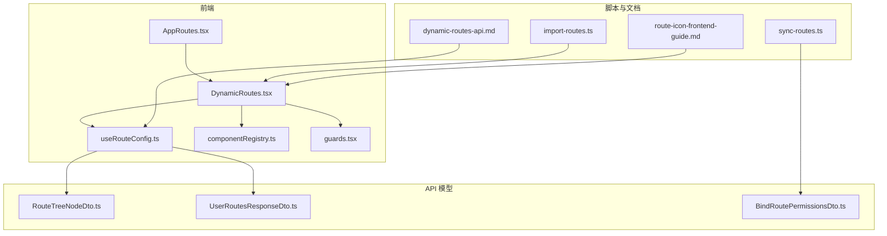
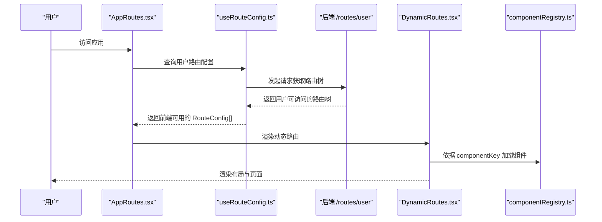
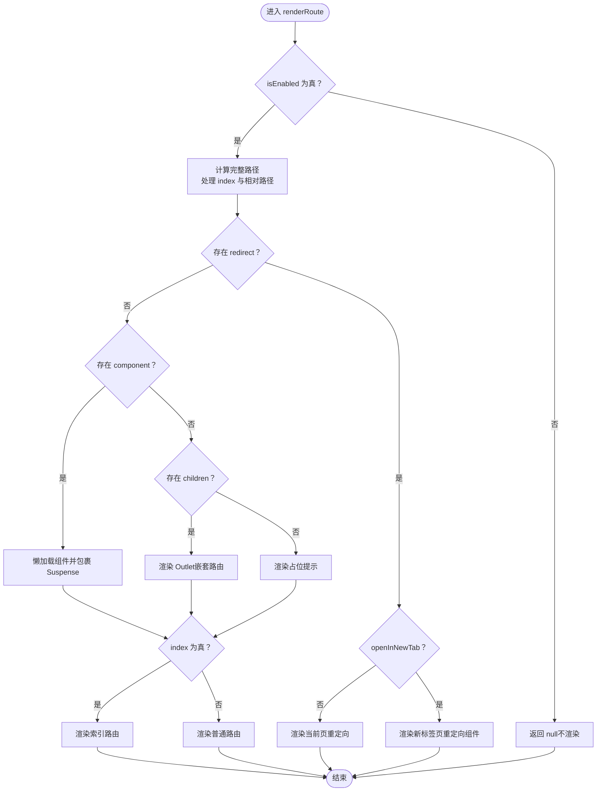
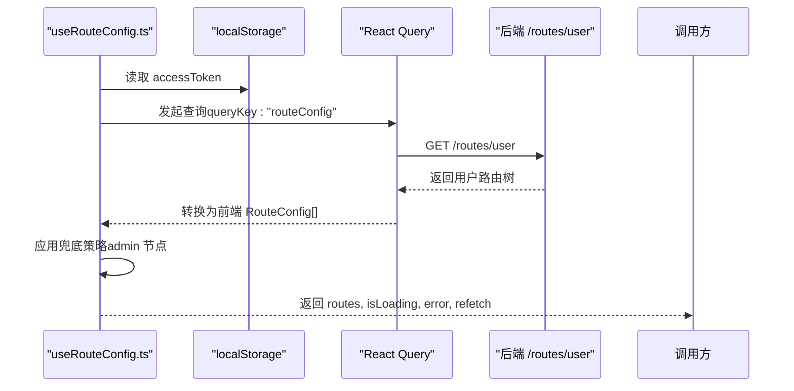
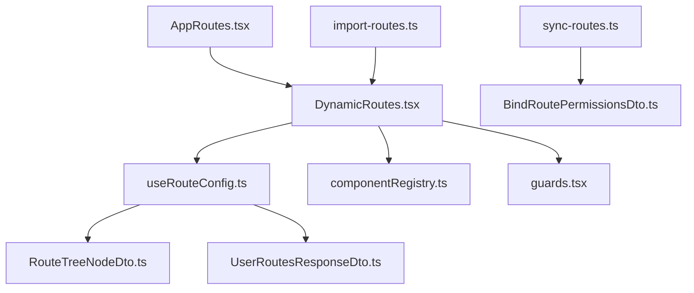

# 路由配置管理

<cite>
**本文档引用的文件**
- [DynamicRoutes.tsx](file://src/routes/DynamicRoutes.tsx)
- [AppRoutes.tsx](file://src/routes/AppRoutes.tsx)
- [routeConfig.ts](file://src/types/routeConfig.ts)
- [import-routes.ts](file://scripts/import-routes.ts)
- [sync-routes.ts](file://scripts/sync-routes.ts)
- [useRouteConfig.ts](file://src/hooks/useRouteConfig.ts)
- [guards.tsx](file://src/routes/guards.tsx)
- [componentRegistry.ts](file://src/routes/componentRegistry.ts)
- [dynamic-routes-api.md](file://docs/dev/dynamic-routes-api.md)
- [route-icon-frontend-guide.md](file://src/modules/admin/pages/system/routes/route-icon-frontend-guide.md)
- [RouteTreeNodeDto.ts](file://src/api/models/RouteTreeNodeDto.ts)
- [UserRoutesResponseDto.ts](file://src/api/models/UserRoutesResponseDto.ts)
- [BindRoutePermissionsDto.ts](file://src/api/models/BindRoutePermissionsDto.ts)
- [package.json](file://package.json)
</cite>

## 目录
1. [简介](#简介)
2. [项目结构](#项目结构)
3. [核心组件](#核心组件)
4. [架构总览](#架构总览)
5. [详细组件分析](#详细组件分析)
6. [依赖关系分析](#依赖关系分析)
7. [性能考量](#性能考量)
8. [故障排查指南](#故障排查指南)
9. [结论](#结论)
10. [附录](#附录)

## 简介
本文件面向“路由配置管理”功能，系统性阐述动态路由系统的配置与管理能力，涵盖以下主题：
- 路由节点的创建、编辑、删除与排序
- 路由树形结构的展示、权限绑定与图标配置
- 路由导入导出、批量操作与数据验证机制
- 路由权限继承、访问控制与前端集成
- 最佳实践、性能优化建议与常见问题解决方案

## 项目结构
动态路由系统由前端动态渲染层、路由配置钩子、组件注册表、路由守卫与后端 API 共同构成。前端通过查询后端提供的用户可访问路由树，按需渲染布局与页面，并在权限不足时进行拦截。

**图表来源**
- [AppRoutes.tsx](file://src/routes/AppRoutes.tsx#L73-L98)
- [DynamicRoutes.tsx](file://src/routes/DynamicRoutes.tsx#L270-L292)
- [useRouteConfig.ts](file://src/hooks/useRouteConfig.ts#L38-L108)
- [componentRegistry.ts](file://src/routes/componentRegistry.ts#L1-L259)
- [guards.tsx](file://src/routes/guards.tsx#L11-L15)
- [RouteTreeNodeDto.ts](file://src/api/models/RouteTreeNodeDto.ts#L5-L62)
- [UserRoutesResponseDto.ts](file://src/api/models/UserRoutesResponseDto.ts#L5-L12)
- [BindRoutePermissionsDto.ts](file://src/api/models/BindRoutePermissionsDto.ts#L5-L14)
- [import-routes.ts](file://scripts/import-routes.ts#L1-L1109)
- [sync-routes.ts](file://scripts/sync-routes.ts#L1-L718)
- [dynamic-routes-api.md](file://docs/dev/dynamic-routes-api.md#L1-L127)
- [route-icon-frontend-guide.md](file://src/modules/admin/pages/system/routes/route-icon-frontend-guide.md#L1-L61)

**章节来源**
- [AppRoutes.tsx](file://src/routes/AppRoutes.tsx#L1-L115)
- [DynamicRoutes.tsx](file://src/routes/DynamicRoutes.tsx#L1-L308)
- [useRouteConfig.ts](file://src/hooks/useRouteConfig.ts#L1-L109)
- [componentRegistry.ts](file://src/routes/componentRegistry.ts#L1-L259)
- [guards.tsx](file://src/routes/guards.tsx#L1-L103)
- [RouteTreeNodeDto.ts](file://src/api/models/RouteTreeNodeDto.ts#L1-L75)
- [UserRoutesResponseDto.ts](file://src/api/models/UserRoutesResponseDto.ts#L1-L13)
- [BindRoutePermissionsDto.ts](file://src/api/models/BindRoutePermissionsDto.ts#L1-L16)
- [import-routes.ts](file://scripts/import-routes.ts#L1-L1109)
- [sync-routes.ts](file://scripts/sync-routes.ts#L1-L718)
- [dynamic-routes-api.md](file://docs/dev/dynamic-routes-api.md#L1-L127)
- [route-icon-frontend-guide.md](file://src/modules/admin/pages/system/routes/route-icon-frontend-guide.md#L1-L61)

## 核心组件
- 动态路由渲染器：根据后端返回的路由树递归渲染，支持布局包装、索引路由、重定向与新标签页打开。
- 路由配置钩子：拉取用户可访问路由树，负责鉴权状态监听、缓存与兜底策略。
- 组件注册表：维护 componentKey 到懒加载组件的映射，支持按需加载。
- 路由守卫：提供登录态与权限双重守卫，支持角色与权限的 AND/OR 组合校验。
- API 模型：定义后端返回的路由树节点结构与响应体，支撑前端数据转换与渲染。
- 脚本工具：提供路由导入、权限同步与批量操作能力，辅助后端管理。

**章节来源**
- [DynamicRoutes.tsx](file://src/routes/DynamicRoutes.tsx#L56-L125)
- [useRouteConfig.ts](file://src/hooks/useRouteConfig.ts#L38-L108)
- [componentRegistry.ts](file://src/routes/componentRegistry.ts#L15-L259)
- [guards.tsx](file://src/routes/guards.tsx#L11-L102)
- [RouteTreeNodeDto.ts](file://src/api/models/RouteTreeNodeDto.ts#L5-L62)
- [UserRoutesResponseDto.ts](file://src/api/models/UserRoutesResponseDto.ts#L5-L12)
- [import-routes.ts](file://scripts/import-routes.ts#L1-L1109)
- [sync-routes.ts](file://scripts/sync-routes.ts#L1-L718)

## 架构总览
动态路由系统采用“后端驱动”的模式：前端通过查询接口获取用户可访问的路由树，再由动态渲染器将其转换为实际的路由配置。权限控制贯穿于守卫层与后端过滤层，确保只有具备相应权限的节点才会出现在最终路由表中。

**图表来源**
- [AppRoutes.tsx](file://src/routes/AppRoutes.tsx#L73-L98)
- [useRouteConfig.ts](file://src/hooks/useRouteConfig.ts#L63-L100)
- [DynamicRoutes.tsx](file://src/routes/DynamicRoutes.tsx#L255-L264)
- [componentRegistry.ts](file://src/routes/componentRegistry.ts#L248-L250)
- [dynamic-routes-api.md](file://docs/dev/dynamic-routes-api.md#L16-L58)

**章节来源**
- [dynamic-routes-api.md](file://docs/dev/dynamic-routes-api.md#L1-L127)
- [AppRoutes.tsx](file://src/routes/AppRoutes.tsx#L73-L98)
- [useRouteConfig.ts](file://src/hooks/useRouteConfig.ts#L38-L108)
- [DynamicRoutes.tsx](file://src/routes/DynamicRoutes.tsx#L255-L264)

## 详细组件分析

### 动态路由渲染器（DynamicRoutes）
职责与特性：
- 递归渲染路由树，支持布局包装（app/admin/forum/none）。
- 处理索引路由与路径组合，确保父子路由正确拼接。
- 支持重定向（当前页与新标签页）、懒加载与 Outlet 嵌套。
- 过滤未启用的子节点，保证只渲染有效路由。

**图表来源**
- [DynamicRoutes.tsx](file://src/routes/DynamicRoutes.tsx#L56-L125)

**章节来源**
- [DynamicRoutes.tsx](file://src/routes/DynamicRoutes.tsx#L56-L125)
- [DynamicRoutes.tsx](file://src/routes/DynamicRoutes.tsx#L130-L249)

### 路由配置钩子（useRouteConfig）
职责与特性：
- 通过 React Query 拉取用户路由树，提供加载状态与错误处理。
- 监听认证状态变化，确保登录后能及时刷新路由配置。
- 提供兜底策略：当后端未返回 admin 节点时，注入本地兜底节点以保证 /admin 路由可匹配。
- 设置缓存时间与重试策略，提升用户体验与稳定性。

**图表来源**
- [useRouteConfig.ts](file://src/hooks/useRouteConfig.ts#L38-L100)
- [dynamic-routes-api.md](file://docs/dev/dynamic-routes-api.md#L16-L58)

**章节来源**
- [useRouteConfig.ts](file://src/hooks/useRouteConfig.ts#L38-L108)

### 组件注册表（componentRegistry）
职责与特性：
- 维护 componentKey 到懒加载组件的映射，支持多模块页面与后台管理页面。
- 提供 getComponent 与 hasComponent 辅助方法，便于动态渲染器按需加载。

**章节来源**
- [componentRegistry.ts](file://src/routes/componentRegistry.ts#L15-L259)

### 路由守卫（guards）
职责与特性：
- 登录态守卫：未登录则重定向至登录页。
- 权限守卫：基于用户角色与权限进行 AND/OR 组合校验；admin 用户直接放行；权限不足时重定向至首页。
- 支持 name 参数用于日志记录与调试。

**章节来源**
- [guards.tsx](file://src/routes/guards.tsx#L11-L102)

### 路由类型定义（routeConfig）
职责与特性：
- 定义前端路由配置的数据结构，包括 id、path、component、layout、permissions、children、name、index、redirect、openInNewTab、isVisible、isEnabled、icon 等字段。
- 为动态渲染器与数据转换提供统一的类型约束。

**章节来源**
- [routeConfig.ts](file://src/types/routeConfig.ts#L14-L41)

### API 模型（RouteTreeNodeDto / UserRoutesResponseDto / BindRoutePermissionsDto）
职责与特性：
- RouteTreeNodeDto：后端返回的路由树节点，包含 id、path、component、layout、name、index、openInNewTab、redirect、sortOrder、icon、isVisible、isEnabled、permissions、children 等字段。
- UserRoutesResponseDto：用户路由响应体，包含 routes 数组。
- BindRoutePermissionsDto：后台绑定权限的请求体，包含 routeId 与 permissions。

**章节来源**
- [RouteTreeNodeDto.ts](file://src/api/models/RouteTreeNodeDto.ts#L5-L62)
- [UserRoutesResponseDto.ts](file://src/api/models/UserRoutesResponseDto.ts#L5-L12)
- [BindRoutePermissionsDto.ts](file://src/api/models/BindRoutePermissionsDto.ts#L5-L14)

### 路由导入与权限同步脚本
- import-routes.ts：提供完整的路由配置数据（含 app/admin/forum 三类布局），支持 sortOrder、isVisible、permissions 等字段，便于一次性导入。
- sync-routes.ts：扫描前端源码，提取页面与按钮权限键，构建权限树并通过批量创建接口上传至后端，支持 API 权限合并与输出权限树文件。

**章节来源**
- [import-routes.ts](file://scripts/import-routes.ts#L1-L1109)
- [sync-routes.ts](file://scripts/sync-routes.ts#L1-L718)

## 依赖关系分析
动态路由系统的关键依赖关系如下：

**图表来源**
- [AppRoutes.tsx](file://src/routes/AppRoutes.tsx#L8-L8)
- [DynamicRoutes.tsx](file://src/routes/DynamicRoutes.tsx#L5-L15)
- [useRouteConfig.ts](file://src/hooks/useRouteConfig.ts#L8-L10)
- [componentRegistry.ts](file://src/routes/componentRegistry.ts#L6-L6)
- [guards.tsx](file://src/routes/guards.tsx#L5-L6)
- [RouteTreeNodeDto.ts](file://src/api/models/RouteTreeNodeDto.ts#L5-L6)
- [UserRoutesResponseDto.ts](file://src/api/models/UserRoutesResponseDto.ts#L5-L6)
- [BindRoutePermissionsDto.ts](file://src/api/models/BindRoutePermissionsDto.ts#L5-L6)
- [import-routes.ts](file://scripts/import-routes.ts#L1-L10)
- [sync-routes.ts](file://scripts/sync-routes.ts#L25-L28)

**章节来源**
- [AppRoutes.tsx](file://src/routes/AppRoutes.tsx#L1-L115)
- [DynamicRoutes.tsx](file://src/routes/DynamicRoutes.tsx#L1-L308)
- [useRouteConfig.ts](file://src/hooks/useRouteConfig.ts#L1-L109)
- [componentRegistry.ts](file://src/routes/componentRegistry.ts#L1-L259)
- [guards.tsx](file://src/routes/guards.tsx#L1-L103)
- [RouteTreeNodeDto.ts](file://src/api/models/RouteTreeNodeDto.ts#L1-L75)
- [UserRoutesResponseDto.ts](file://src/api/models/UserRoutesResponseDto.ts#L1-L13)
- [BindRoutePermissionsDto.ts](file://src/api/models/BindRoutePermissionsDto.ts#L1-L16)
- [import-routes.ts](file://scripts/import-routes.ts#L1-L1109)
- [sync-routes.ts](file://scripts/sync-routes.ts#L1-L718)

## 性能考量
- 懒加载与 Suspense：动态渲染器与组件注册表均采用懒加载，结合 Suspense 提升首屏性能与交互体验。
- 缓存策略：useRouteConfig 设置 5 分钟缓存时间，减少频繁请求；同时提供 refetch 以手动刷新。
- 兜底策略：当后端未返回 admin 节点时，注入本地兜底节点，避免路由匹配失败导致的白屏。
- 组件映射：集中维护 componentKey 到组件的映射，避免重复导入与打包体积膨胀。
- 权限守卫：在守卫层进行快速判定，避免无效渲染与资源浪费。

[本节为通用性能建议，无需特定文件引用]

## 故障排查指南
- 路由未显示或空白
  - 检查 isEnabled 与 isVisible 字段是否为 true。
  - 确认 componentKey 是否存在于组件注册表。
  - 核对路径拼接是否正确（index 与相对路径）。
- 权限不足被重定向
  - 检查 requiredPermissions 与 requiredRoles 的组合策略（AND/OR）。
  - 确认用户权限与角色是否包含所需项。
- 登录后路由未更新
  - 确认认证状态变化事件是否触发（authChange 与 storage 事件）。
  - 使用 refetch 主动刷新路由配置。
- Admin 路由无法匹配
  - 检查后端是否返回 admin 节点；若未返回，确认本地兜底策略是否生效。
- 图标不显示
  - 确认 icon 字段格式是否符合“库名前缀:组件名”规范。
  - 检查前端 DynamicIcon 组件是否正确解析并渲染。

**章节来源**
- [DynamicRoutes.tsx](file://src/routes/DynamicRoutes.tsx#L56-L125)
- [guards.tsx](file://src/routes/guards.tsx#L35-L102)
- [useRouteConfig.ts](file://src/hooks/useRouteConfig.ts#L46-L100)
- [route-icon-frontend-guide.md](file://src/modules/admin/pages/system/routes/route-icon-frontend-guide.md#L13-L61)

## 结论
动态路由系统通过“后端驱动 + 前端渲染 + 权限守卫”的架构，实现了灵活、可扩展、可维护的路由配置管理。配合脚本工具与 API 文档，管理员可在后台完成路由节点的创建、编辑、删除、排序与权限绑定，前端则以最小成本完成集成与渲染。建议在生产环境中结合缓存策略、懒加载与权限守卫，持续优化性能与安全性。

[本节为总结性内容，无需特定文件引用]

## 附录

### 路由节点字段说明（RouteTreeNodeDto）
- id：节点唯一标识
- path：路由路径
- component：前端组件标识符
- layout：布局类型（app/admin/forum/none）
- name：显示名称
- index：是否为索引路由
- openInNewTab：重定向是否在新标签页打开
- redirect：重定向目标
- sortOrder：排序权重
- icon：图标标识符（如 "Lucide:Home"、"Antd:DashboardOutlined"）
- isVisible：是否在菜单中可见
- isEnabled：是否启用
- permissions：所需权限列表
- children：子节点数组

**章节来源**
- [RouteTreeNodeDto.ts](file://src/api/models/RouteTreeNodeDto.ts#L5-L62)

### 后端接口一览（动态路由）
- 用户路由接口：POST /routes/user（获取用户可访问路由树）
- 路由管理接口（后台）：/admin/routes/tree、/admin/routes/create、/admin/routes/update、/admin/routes/delete、/admin/routes/sort、/admin/routes/bind-permissions
- 开发调试工具：POST /routes/clear-cache、POST /routes/import

**章节来源**
- [dynamic-routes-api.md](file://docs/dev/dynamic-routes-api.md#L16-L76)
- [dynamic-routes-api.md](file://docs/dev/dynamic-routes-api.md#L123-L127)

### 前端图标渲染建议
- 建议封装通用图标组件，解析 icon 字段并根据库名前缀渲染对应图标。
- 支持 Lucide 与 Ant Design 图标库，确保格式为“库名:组件名”。

**章节来源**
- [route-icon-frontend-guide.md](file://src/modules/admin/pages/system/routes/route-icon-frontend-guide.md#L13-L61)

### 脚本与工具
- import-routes.ts：提供完整的路由配置数据，便于一次性导入。
- sync-routes.ts：扫描前端源码提取权限键，构建权限树并通过批量创建接口上传。

**章节来源**
- [import-routes.ts](file://scripts/import-routes.ts#L1-L1109)
- [sync-routes.ts](file://scripts/sync-routes.ts#L1-L718)