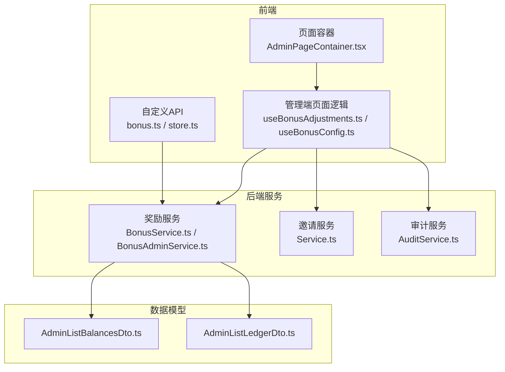
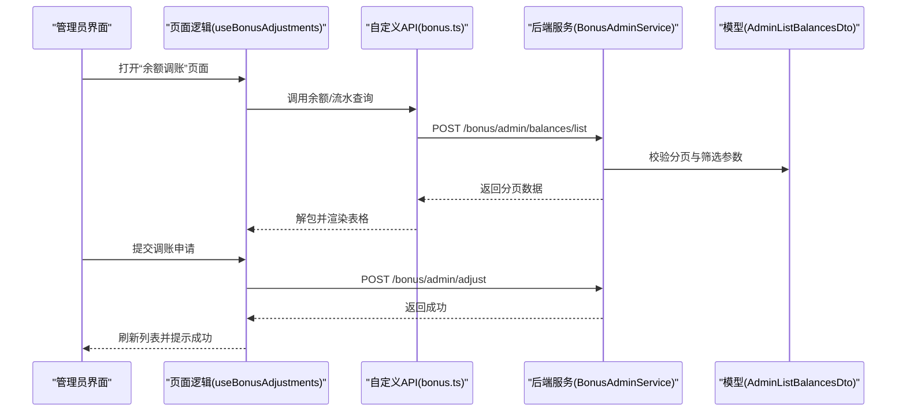
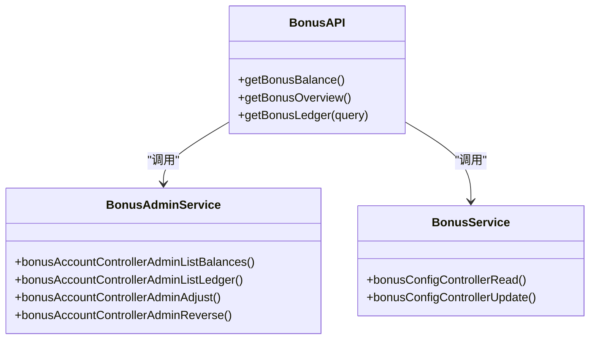
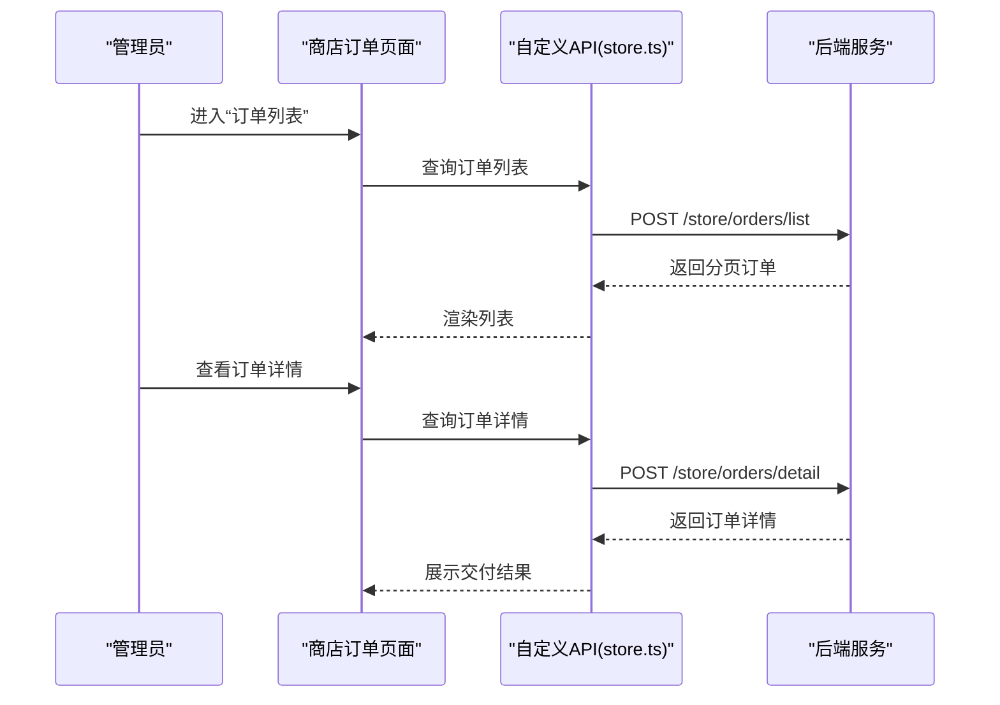
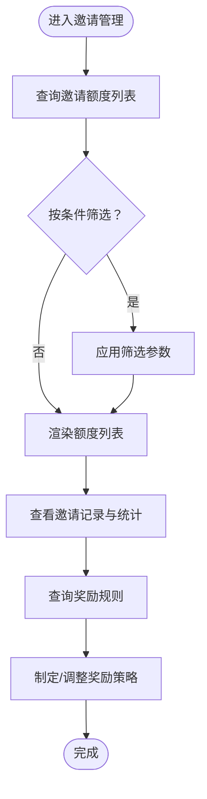
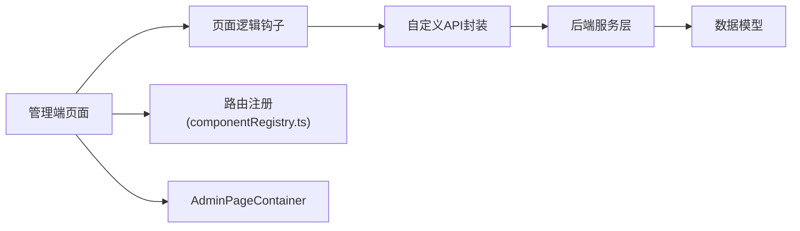

# 经济系统管理

<cite>
**本文档引用的文件**
- [bonus.ts](file://src/api/custom/bonus.ts)
- [store.ts](file://src/api/custom/store.ts)
- [BonusAdminService.ts](file://src/api/services/BonusAdminService.ts)
- [BonusService.ts](file://src/api/services/BonusService.ts)
- [AdminListBalancesDto.ts](file://src/api/models/AdminListBalancesDto.ts)
- [AdminListLedgerDto.ts](file://src/api/models/AdminListLedgerDto.ts)
- [useBonusAdjustments.ts](file://src/modules/admin/pages/economy/bonus/BonusAdjustmentsPage/hooks/useBonusAdjustments.ts)
- [useBonusConfig.ts](file://src/modules/admin/pages/economy/bonus/Rules/hooks/useBonusConfig.ts)
- [useBonusLedger.ts](file://src/modules/app/pages/Bonus/hooks/useBonusLedger.ts)
- [useBonusLedgerLogic.tsx](file://src/modules/admin/pages/economy/bonus/BonusLedgerPage/useBonusLedgerLogic.tsx)
- [types.ts（邀请共享）](file://src/modules/admin/shared/invites/types.ts)
- [Service.ts（邀请核心服务）](file://src/api/services/Service.ts)
- [AuditService.ts](file://src/api/services/AuditService.ts)
- [AuditHistoryResponseDto.ts](file://src/api/models/AuditHistoryResponseDto.ts)
- [AuditHistoryItemDto.ts](file://src/api/models/AuditHistoryItemDto.ts)
- [componentRegistry.ts](file://src/routes/componentRegistry.ts)
- [AdminPageContainer.tsx](file://src/modules/admin/components/AdminPageContainer.tsx)
</cite>

## 目录
1. [引言](#引言)
2. [项目结构](#项目结构)
3. [核心组件](#核心组件)
4. [架构总览](#架构总览)
5. [详细组件分析](#详细组件分析)
6. [依赖关系分析](#依赖关系分析)
7. [性能考量](#性能考量)
8. [故障排查指南](#故障排查指南)
9. [结论](#结论)
10. [附录](#附录)

## 引言
本文件面向后台经济系统管理功能，系统性梳理奖励系统、商店管理、邀请制度与互动功能的实现与运维要点。内容覆盖奖励规则配置、余额调整、交易流水与对账、商店商品与订单管理、邀请配额与统计、奖励发放机制、经济数据分析、风险控制与合规审计等。同时提供运营最佳实践、财务审计与风险管理策略，帮助管理员高效、安全地运营经济体系。

## 项目结构
经济系统管理主要分布在以下模块与文件：
- 前端自定义 API 封装：奖励与商店的前端轻量封装，统一响应解包与请求构造
- 后端服务层：奖励与商店的管理员服务、业务服务、模型定义
- 管理端页面逻辑：余额与流水查询、奖励规则配置、商店商品与订单管理
- 邀请与互动：邀请额度与记录、互动工单与推荐等运营支撑
- 审计与合规：资源审核历史查询，支持经济行为的可追溯性

图表来源
- [bonus.ts](file://src/api/custom/bonus.ts#L1-L90)
- [store.ts](file://src/api/custom/store.ts#L1-L145)
- [BonusAdminService.ts](file://src/api/services/BonusAdminService.ts#L1-L34)
- [BonusService.ts](file://src/api/services/BonusService.ts#L1-L27)
- [Service.ts（邀请核心服务）](file://src/api/services/Service.ts#L160-L211)
- [AuditService.ts](file://src/api/services/AuditService.ts#L1-L40)
- [AdminListBalancesDto.ts](file://src/api/models/AdminListBalancesDto.ts#L1-L44)
- [AdminListLedgerDto.ts](file://src/api/models/AdminListLedgerDto.ts#L1-L44)
- [AdminPageContainer.tsx](file://src/modules/admin/components/AdminPageContainer.tsx#L1-L38)

章节来源
- [bonus.ts](file://src/api/custom/bonus.ts#L1-L90)
- [store.ts](file://src/api/custom/store.ts#L1-L145)
- [BonusAdminService.ts](file://src/api/services/BonusAdminService.ts#L1-L34)
- [BonusService.ts](file://src/api/services/BonusService.ts#L1-L27)
- [Service.ts（邀请核心服务）](file://src/api/services/Service.ts#L160-L211)
- [AuditService.ts](file://src/api/services/AuditService.ts#L1-L40)
- [AdminListBalancesDto.ts](file://src/api/models/AdminListBalancesDto.ts#L1-L44)
- [AdminListLedgerDto.ts](file://src/api/models/AdminListLedgerDto.ts#L1-L44)
- [AdminPageContainer.tsx](file://src/modules/admin/components/AdminPageContainer.tsx#L1-L38)

## 核心组件
- 奖励系统（魔力值/积分）
  - 余额与概览查询、流水分页查询与过滤
  - 管理员余额与流水分页查询、余额调账、冲正
  - 奖励规则配置读取与更新、模拟计算
- 商店管理（积分商城）
  - 商品列表、上架/下架、库存管理
  - 订单列表、订单详情、购买下单（含幂等键）
- 邀请制度
  - 邀请额度与记录、统计维度（发送/接受/过期/撤销）
  - 奖励规则查询（用于发放邀请奖励）
- 互动与合规
  - 审核历史查询，支持经济相关操作的审计与追溯

章节来源
- [bonus.ts](file://src/api/custom/bonus.ts#L18-L89)
- [store.ts](file://src/api/custom/store.ts#L59-L144)
- [useBonusAdjustments.ts](file://src/modules/admin/pages/economy/bonus/BonusAdjustmentsPage/hooks/useBonusAdjustments.ts#L1-L92)
- [useBonusConfig.ts](file://src/modules/admin/pages/economy/bonus/Rules/hooks/useBonusConfig.ts#L1-L52)
- [types.ts（邀请共享）](file://src/modules/admin/shared/invites/types.ts#L1-L34)
- [Service.ts（邀请核心服务）](file://src/api/services/Service.ts#L160-L211)
- [AuditService.ts](file://src/api/services/AuditService.ts#L1-L40)

## 架构总览
经济系统管理采用“前端自定义 API + 后端服务层 + 管理端页面逻辑”的分层架构：
- 前端自定义 API 负责统一请求构造与响应解包，屏蔽底层 OpenAPI 细节
- 后端服务层提供管理员与业务接口，承载规则配置、余额与流水、商店订单等能力
- 管理端页面逻辑通过 React Query 管理状态与缓存，提供分页、筛选、批量操作
- 审计服务贯穿关键操作，确保合规与可追溯

图表来源
- [useBonusAdjustments.ts](file://src/modules/admin/pages/economy/bonus/BonusAdjustmentsPage/hooks/useBonusAdjustments.ts#L1-L92)
- [bonus.ts](file://src/api/custom/bonus.ts#L18-L89)
- [BonusAdminService.ts](file://src/api/services/BonusAdminService.ts#L23-L32)
- [AdminListBalancesDto.ts](file://src/api/models/AdminListBalancesDto.ts#L5-L42)

## 详细组件分析

### 奖励系统（魔力值/积分）
- 余额与概览
  - 支持查询当前余额、收支汇总与月度趋势
  - 适合用于仪表盘与报表展示
- 流水管理
  - 支持按类型（收入/支出）、原因、时间段、幂等键等条件分页查询
  - 管理端可进行冲正（反向入账），保障账实一致
- 余额调账
  - 支持管理员对指定用户进行增减分的余额调整，并可绑定外部参考号
  - 调账后刷新缓存，保证列表与余额实时准确
- 奖励规则配置
  - 支持读取与更新规则配置，提供模拟计算能力，便于评估规则变更影响

图表来源
- [bonus.ts](file://src/api/custom/bonus.ts#L18-L89)
- [BonusAdminService.ts](file://src/api/services/BonusAdminService.ts#L16-L34)
- [BonusService.ts](file://src/api/services/BonusService.ts#L21-L27)

章节来源
- [bonus.ts](file://src/api/custom/bonus.ts#L18-L89)
- [useBonusLedger.ts](file://src/modules/app/pages/Bonus/hooks/useBonusLedger.ts#L1-L33)
- [useBonusLedgerLogic.tsx](file://src/modules/admin/pages/economy/bonus/BonusLedgerPage/useBonusLedgerLogic.tsx#L71-L106)
- [useBonusAdjustments.ts](file://src/modules/admin/pages/economy/bonus/BonusAdjustmentsPage/hooks/useBonusAdjustments.ts#L1-L92)
- [useBonusConfig.ts](file://src/modules/admin/pages/economy/bonus/Rules/hooks/useBonusConfig.ts#L1-L52)
- [AdminListBalancesDto.ts](file://src/api/models/AdminListBalancesDto.ts#L5-L42)
- [AdminListLedgerDto.ts](file://src/api/models/AdminListLedgerDto.ts#L5-L42)

### 商店管理（积分商城）
- 商品管理
  - 支持按状态、关键词分页查询商品列表
  - 支持上架/下架、库存管理，便于控制稀缺性与成本
- 订单管理
  - 支持按状态、时间段分页查询订单列表
  - 支持订单详情查询与交付结果追踪
- 购买流程
  - 提供购买下单接口，支持幂等键避免重复扣款
  - 支持按商品 key 购买（如邀请码）

图表来源
- [store.ts](file://src/api/custom/store.ts#L59-L144)

章节来源
- [store.ts](file://src/api/custom/store.ts#L59-L144)

### 邀请制度
- 邀请额度与记录
  - 支持查询用户的邀请额度（永久/限时）、消耗状态与关联记录
  - 支持分页查询所有邀请额度，支持按用户、是否永久、是否有效筛选
- 邀请记录与统计
  - 记录邀请发送、接受、过期、撤销等状态
  - 提供统计维度（总数、未使用、已接受、已过期、已撤销）
- 奖励规则
  - 提供邀请奖励规则查询接口，便于制定与调整奖励策略

图表来源
- [types.ts（邀请共享）](file://src/modules/admin/shared/invites/types.ts#L1-L34)
- [Service.ts（邀请核心服务）](file://src/api/services/Service.ts#L188-L211)

章节来源
- [types.ts（邀请共享）](file://src/modules/admin/shared/invites/types.ts#L1-L34)
- [Service.ts（邀请核心服务）](file://src/api/services/Service.ts#L188-L211)

### 互动与合规（审计）
- 审核历史
  - 支持查询任意资源的审核历史，包含操作类型、旧/新状态、备注、原因代码、操作人等
  - 为经济系统中的敏感操作提供可追溯性与合规依据

章节来源
- [AuditService.ts](file://src/api/services/AuditService.ts#L1-L40)
- [AuditHistoryResponseDto.ts](file://src/api/models/AuditHistoryResponseDto.ts#L1-L16)
- [AuditHistoryItemDto.ts](file://src/api/models/AuditHistoryItemDto.ts#L1-L49)

## 依赖关系分析
- 组件耦合
  - 页面逻辑与自定义 API 强耦合，便于统一处理响应与错误
  - 自定义 API 与后端服务层弱耦合，通过 OpenAPI 请求封装
- 外部依赖
  - React Query 管理远端状态与缓存
  - 路由注册集中于组件注册表，便于统一导航与懒加载
- 潜在风险
  - 响应解包逻辑需保持一致性，避免前后端字段差异导致解析异常
  - 幂等键在购买流程中至关重要，需确保前端生成与后端校验一致

图表来源
- [componentRegistry.ts](file://src/routes/componentRegistry.ts#L220-L227)
- [AdminPageContainer.tsx](file://src/modules/admin/components/AdminPageContainer.tsx#L1-L38)

章节来源
- [componentRegistry.ts](file://src/routes/componentRegistry.ts#L220-L227)
- [AdminPageContainer.tsx](file://src/modules/admin/components/AdminPageContainer.tsx#L1-L38)

## 性能考量
- 分页与筛选
  - 使用分页参数与精确筛选条件，避免一次性拉取大量数据
- 缓存与重试
  - 利用 React Query 的缓存与失效策略，减少重复请求
- 幂等键
  - 在高并发购买场景中，使用幂等键避免重复扣款与订单重复
- 响应解包
  - 统一解包逻辑，减少重复判断与类型转换开销

## 故障排查指南
- 奖励与余额问题
  - 若余额不一致，优先检查流水冲正是否正确执行
  - 使用管理员余额查询接口核对最小/最大余额边界
- 商店订单问题
  - 若订单重复或未扣款，检查幂等键是否正确传递与去重
  - 核对商品状态与库存，确认购买时商品是否仍可售
- 邀请额度问题
  - 核对额度是否过期或已被消耗
  - 检查邀请记录状态是否与预期一致
- 审计与合规
  - 对关键操作使用审核历史接口回溯，定位问题责任人与时间线

章节来源
- [useBonusAdjustments.ts](file://src/modules/admin/pages/economy/bonus/BonusAdjustmentsPage/hooks/useBonusAdjustments.ts#L43-L71)
- [store.ts](file://src/api/custom/store.ts#L77-L88)
- [types.ts（邀请共享）](file://src/modules/admin/shared/invites/types.ts#L1-L34)
- [AuditService.ts](file://src/api/services/AuditService.ts#L1-L40)

## 结论
本经济系统管理方案以清晰的分层架构与完善的管理工具实现奖励、商店、邀请与合规的全链路治理。通过规则配置、余额调账、流水冲正、订单与额度管理以及审计历史查询，既能满足日常运营需要，又能保障财务准确性与合规性。建议结合本文的最佳实践与风险策略，持续优化规则与流程，提升用户体验与系统稳定性。

## 附录
- 运营最佳实践
  - 定期复核奖励规则，结合月度趋势与业务目标动态调整
  - 对高价值商品与限量活动启用库存与时间窗口控制
  - 在促销与活动前进行模拟计算，评估对整体经济的影响
- 财务审计与风险管理
  - 对所有余额调账与冲正操作保留审计日志
  - 建立异常监控（如异常退款、重复订单），及时预警与处置
  - 对邀请奖励与消费行为建立周期性对账机制，确保账实相符