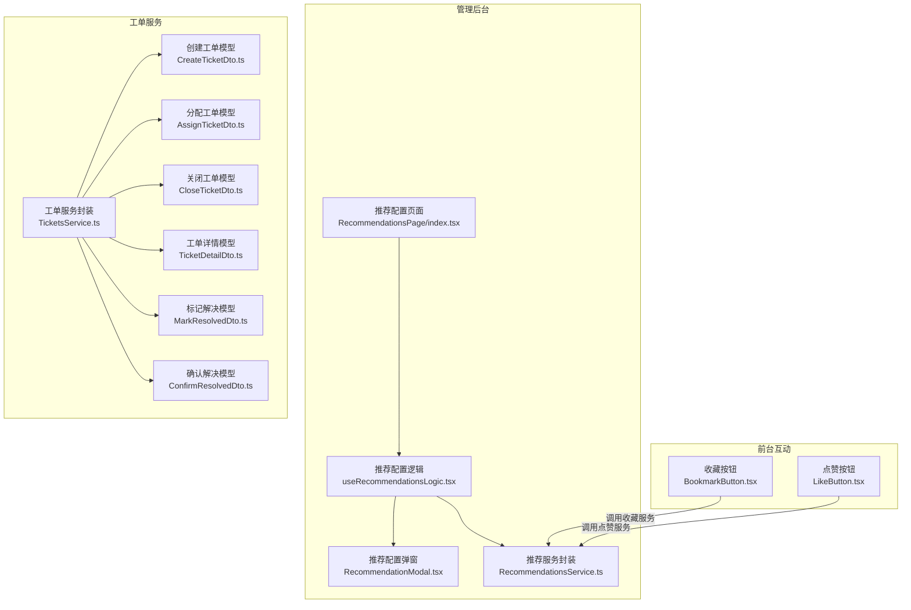
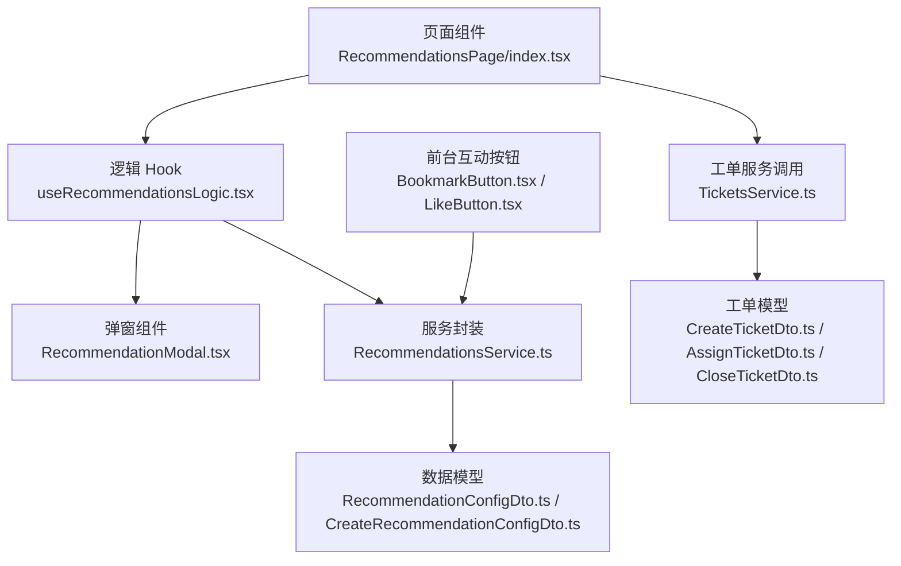
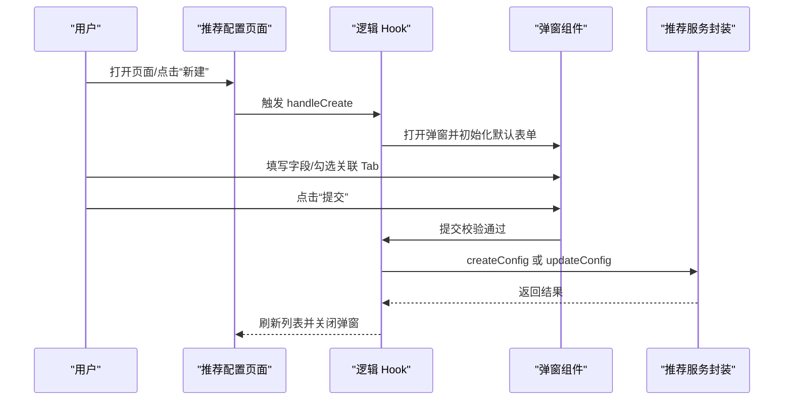
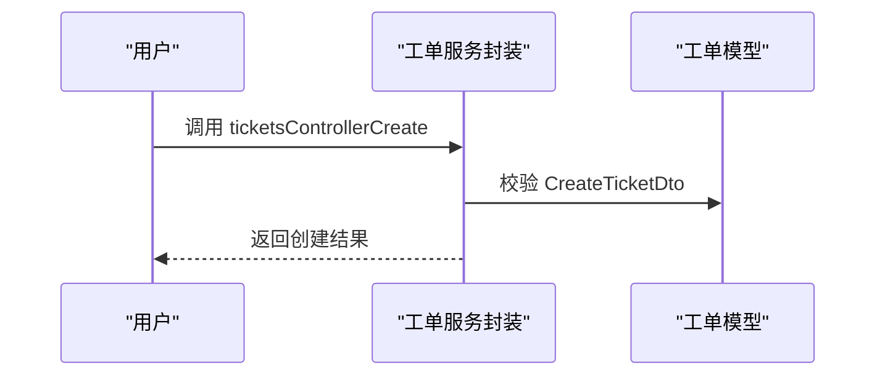
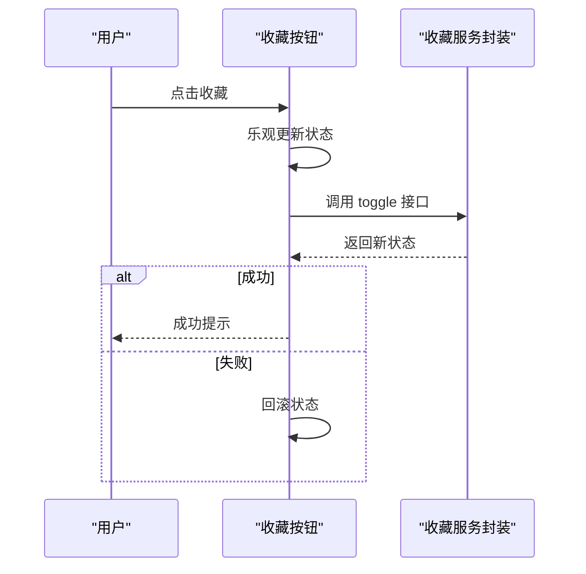
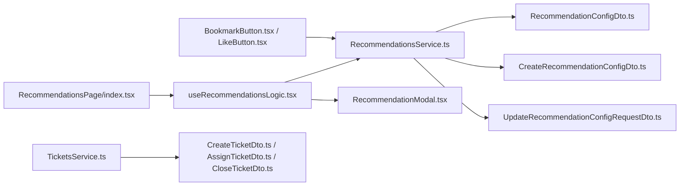

# 互动管理

<cite>
**本文引用的文件**
- [RecommendationsPage/index.tsx](file://src/modules/admin/pages/operations/interaction/RecommendationsPage/index.tsx)
- [RecommendationsPage/useRecommendationsLogic.tsx](file://src/modules/admin/pages/operations/interaction/RecommendationsPage/useRecommendationsLogic.tsx)
- [RecommendationsPage/components/RecommendationModal.tsx](file://src/modules/admin/pages/operations/interaction/RecommendationsPage/components/RecommendationModal.tsx)
- [RecommendationsService.ts](file://src/api/services/RecommendationsService.ts)
- [RecommendationConfigDto.ts](file://src/api/models/RecommendationConfigDto.ts)
- [CreateRecommendationConfigDto.ts](file://src/api/models/CreateRecommendationConfigDto.ts)
- [UpdateRecommendationConfigRequestDto.ts](file://src/api/models/UpdateRecommendationConfigRequestDto.ts)
- [RecommendationTabDto.ts](file://src/api/models/RecommendationTabDto.ts)
- [TicketsService.ts](file://src/api/services/TicketsService.ts)
- [CreateTicketDto.ts](file://src/api/models/CreateTicketDto.ts)
- [AssignTicketDto.ts](file://src/api/models/AssignTicketDto.ts)
- [CloseTicketDto.ts](file://src/api/models/CloseTicketDto.ts)
- [TicketDetailDto.ts](file://src/api/models/TicketDetailDto.ts)
- [MarkResolvedDto.ts](file://src/api/models/MarkResolvedDto.ts)
- [ConfirmResolvedDto.ts](file://src/api/models/ConfirmResolvedDto.ts)
- [BookmarkButton.tsx](file://src/modules/forum/components/Interaction/BookmarkButton.tsx)
- [LikeButton.tsx](file://src/modules/forum/components/Interaction/LikeButton.tsx)
</cite>

## 目录
1. [简介](#简介)
2. [项目结构](#项目结构)
3. [核心组件](#核心组件)
4. [架构总览](#架构总览)
5. [详细组件分析](#详细组件分析)
6. [依赖关系分析](#依赖关系分析)
7. [性能考量](#性能考量)
8. [故障排查指南](#故障排查指南)
9. [结论](#结论)
10. [附录](#附录)

## 简介
本文件面向“互动管理”功能，围绕两大主线展开：
- 推荐系统配置与管理：涵盖推荐策略配置、个性化推荐策略、Tab 关联、展示样式与排序权重等。
- 工单系统生命周期管理：覆盖工单创建、分配、处理、关闭与统计分析，以及模板化配置与优先级管理。

同时，文档补充了用户互动按钮（收藏、点赞）的交互行为，并给出最佳实践、自动化规则建议与效率提升方案，帮助运营与开发团队高效维护与优化互动体验。

## 项目结构
互动管理功能主要分布在以下区域：
- 管理后台-互动配置：推荐配置的增删改查、Tab 关联、策略筛选与启用控制。
- 前台互动组件：收藏、点赞等用户互动按钮。
- 工单服务接口：提供工单创建、详情、统计、分配、关闭等接口模型与调用入口。

图表来源
- [RecommendationsPage/index.tsx](file://src/modules/admin/pages/operations/interaction/RecommendationsPage/index.tsx#L1-L110)
- [RecommendationsPage/useRecommendationsLogic.tsx](file://src/modules/admin/pages/operations/interaction/RecommendationsPage/useRecommendationsLogic.tsx#L1-L321)
- [RecommendationsPage/components/RecommendationModal.tsx](file://src/modules/admin/pages/operations/interaction/RecommendationsPage/components/RecommendationModal.tsx#L1-L181)
- [RecommendationsService.ts](file://src/api/services/RecommendationsService.ts)
- [BookmarkButton.tsx](file://src/modules/forum/components/Interaction/BookmarkButton.tsx#L1-L96)
- [LikeButton.tsx](file://src/modules/forum/components/Interaction/LikeButton.tsx#L1-L117)
- [TicketsService.ts](file://src/api/services/TicketsService.ts)
- [CreateTicketDto.ts](file://src/api/models/CreateTicketDto.ts#L1-L30)
- [AssignTicketDto.ts](file://src/api/models/AssignTicketDto.ts#L1-L10)
- [CloseTicketDto.ts](file://src/api/models/CloseTicketDto.ts#L1-L10)
- [TicketDetailDto.ts](file://src/api/models/TicketDetailDto.ts#L1-L8)
- [MarkResolvedDto.ts](file://src/api/models/MarkResolvedDto.ts#L1-L8)
- [ConfirmResolvedDto.ts](file://src/api/models/ConfirmResolvedDto.ts#L1-L8)

章节来源
- [RecommendationsPage/index.tsx](file://src/modules/admin/pages/operations/interaction/RecommendationsPage/index.tsx#L1-L110)
- [RecommendationsPage/useRecommendationsLogic.tsx](file://src/modules/admin/pages/operations/interaction/RecommendationsPage/useRecommendationsLogic.tsx#L1-L321)
- [RecommendationsPage/components/RecommendationModal.tsx](file://src/modules/admin/pages/operations/interaction/RecommendationsPage/components/RecommendationModal.tsx#L1-L181)
- [RecommendationsService.ts](file://src/api/services/RecommendationsService.ts)
- [BookmarkButton.tsx](file://src/modules/forum/components/Interaction/BookmarkButton.tsx#L1-L96)
- [LikeButton.tsx](file://src/modules/forum/components/Interaction/LikeButton.tsx#L1-L117)
- [TicketsService.ts](file://src/api/services/TicketsService.ts)
- [CreateTicketDto.ts](file://src/api/models/CreateTicketDto.ts#L1-L30)
- [AssignTicketDto.ts](file://src/api/models/AssignTicketDto.ts#L1-L10)
- [CloseTicketDto.ts](file://src/api/models/CloseTicketDto.ts#L1-L10)
- [TicketDetailDto.ts](file://src/api/models/TicketDetailDto.ts#L1-L8)
- [MarkResolvedDto.ts](file://src/api/models/MarkResolvedDto.ts#L1-L8)
- [ConfirmResolvedDto.ts](file://src/api/models/ConfirmResolvedDto.ts#L1-L8)

## 核心组件
- 推荐配置页面与逻辑：负责推荐配置的列表、搜索、筛选、分页、启用/禁用切换、创建/编辑弹窗与提交、删除确认等。
- 推荐配置弹窗：提供标题、关联 Tab、策略类型、时间范围、展示样式、展示数量、排序权重、启用状态等字段的受控表单。
- 前台互动按钮：收藏与点赞按钮，支持乐观更新与动画反馈。
- 工单服务与模型：提供工单创建、详情、统计、分配、关闭、标记/确认解决等接口与数据模型。

章节来源
- [RecommendationsPage/index.tsx](file://src/modules/admin/pages/operations/interaction/RecommendationsPage/index.tsx#L1-L110)
- [RecommendationsPage/useRecommendationsLogic.tsx](file://src/modules/admin/pages/operations/interaction/RecommendationsPage/useRecommendationsLogic.tsx#L1-L321)
- [RecommendationsPage/components/RecommendationModal.tsx](file://src/modules/admin/pages/operations/interaction/RecommendationsPage/components/RecommendationModal.tsx#L1-L181)
- [RecommendationConfigDto.ts](file://src/api/models/RecommendationConfigDto.ts#L1-L28)
- [CreateRecommendationConfigDto.ts](file://src/api/models/CreateRecommendationConfigDto.ts#L1-L52)
- [UpdateRecommendationConfigRequestDto.ts](file://src/api/models/UpdateRecommendationConfigRequestDto.ts#L1-L16)
- [RecommendationTabDto.ts](file://src/api/models/RecommendationTabDto.ts)
- [BookmarkButton.tsx](file://src/modules/forum/components/Interaction/BookmarkButton.tsx#L1-L96)
- [LikeButton.tsx](file://src/modules/forum/components/Interaction/LikeButton.tsx#L1-L117)
- [TicketsService.ts](file://src/api/services/TicketsService.ts#L28-L79)
- [CreateTicketDto.ts](file://src/api/models/CreateTicketDto.ts#L1-L30)
- [AssignTicketDto.ts](file://src/api/models/AssignTicketDto.ts#L1-L10)
- [CloseTicketDto.ts](file://src/api/models/CloseTicketDto.ts#L1-L10)
- [TicketDetailDto.ts](file://src/api/models/TicketDetailDto.ts#L1-L8)
- [MarkResolvedDto.ts](file://src/api/models/MarkResolvedDto.ts#L1-L8)
- [ConfirmResolvedDto.ts](file://src/api/models/ConfirmResolvedDto.ts#L1-L8)

## 架构总览
互动管理采用“页面-逻辑-Hook-服务封装-模型”的分层设计：
- 页面负责 UI 布局与交互触发；
- Hook 负责状态管理、查询缓存、异步动作与副作用；
- 服务封装统一调用 API；
- 模型定义请求/响应数据结构；
- 前台互动组件通过服务封装与后端交互，实现用户即时反馈。

图表来源
- [RecommendationsPage/index.tsx](file://src/modules/admin/pages/operations/interaction/RecommendationsPage/index.tsx#L1-L110)
- [RecommendationsPage/useRecommendationsLogic.tsx](file://src/modules/admin/pages/operations/interaction/RecommendationsPage/useRecommendationsLogic.tsx#L1-L321)
- [RecommendationsPage/components/RecommendationModal.tsx](file://src/modules/admin/pages/operations/interaction/RecommendationsPage/components/RecommendationModal.tsx#L1-L181)
- [RecommendationsService.ts](file://src/api/services/RecommendationsService.ts)
- [RecommendationConfigDto.ts](file://src/api/models/RecommendationConfigDto.ts#L1-L28)
- [CreateRecommendationConfigDto.ts](file://src/api/models/CreateRecommendationConfigDto.ts#L1-L52)
- [TicketsService.ts](file://src/api/services/TicketsService.ts#L28-L79)
- [CreateTicketDto.ts](file://src/api/models/CreateTicketDto.ts#L1-L30)
- [AssignTicketDto.ts](file://src/api/models/AssignTicketDto.ts#L1-L10)
- [CloseTicketDto.ts](file://src/api/models/CloseTicketDto.ts#L1-L10)
- [BookmarkButton.tsx](file://src/modules/forum/components/Interaction/BookmarkButton.tsx#L1-L96)
- [LikeButton.tsx](file://src/modules/forum/components/Interaction/LikeButton.tsx#L1-L117)

## 详细组件分析

### 推荐系统配置与管理
- 功能要点
  - 列表展示：标题、关联 Tab、策略类型、时间范围、展示数量、排序权重、启用状态、创建时间与操作列。
  - 搜索与筛选：按标题模糊搜索、按策略类型筛选；前端模拟过滤与分页切片。
  - 启用/禁用：通过开关直接切换配置状态，服务端更新后刷新缓存。
  - 创建/编辑：标题、关联 Tab（多选）、策略类型、时间范围、展示样式、展示数量、排序权重、启用状态。
  - 删除：二次确认弹窗，确认后调用删除接口并刷新缓存。
- 数据模型
  - 配置模型：包含 id、标题、策略类型、时间范围、展示数量、排序权重、启用状态、创建/更新时间等。
  - 创建/更新模型：包含标题、关联 Tab ID 列表、策略类型、可选的时间范围/展示数量/排序权重/启用状态/样式等。
  - Tab 模型：用于下拉选项展示标签与分类键信息。
- 交互流程（创建/编辑）

图表来源
- [RecommendationsPage/index.tsx](file://src/modules/admin/pages/operations/interaction/RecommendationsPage/index.tsx#L1-L110)
- [RecommendationsPage/useRecommendationsLogic.tsx](file://src/modules/admin/pages/operations/interaction/RecommendationsPage/useRecommendationsLogic.tsx#L120-L186)
- [RecommendationsPage/components/RecommendationModal.tsx](file://src/modules/admin/pages/operations/interaction/RecommendationsPage/components/RecommendationModal.tsx#L1-L181)
- [RecommendationsService.ts](file://src/api/services/RecommendationsService.ts)

章节来源
- [RecommendationsPage/index.tsx](file://src/modules/admin/pages/operations/interaction/RecommendationsPage/index.tsx#L1-L110)
- [RecommendationsPage/useRecommendationsLogic.tsx](file://src/modules/admin/pages/operations/interaction/RecommendationsPage/useRecommendationsLogic.tsx#L1-L321)
- [RecommendationsPage/components/RecommendationModal.tsx](file://src/modules/admin/pages/operations/interaction/RecommendationsPage/components/RecommendationModal.tsx#L1-L181)
- [RecommendationConfigDto.ts](file://src/api/models/RecommendationConfigDto.ts#L1-L28)
- [CreateRecommendationConfigDto.ts](file://src/api/models/CreateRecommendationConfigDto.ts#L1-L52)
- [UpdateRecommendationConfigRequestDto.ts](file://src/api/models/UpdateRecommendationConfigRequestDto.ts#L1-L16)
- [RecommendationTabDto.ts](file://src/api/models/RecommendationTabDto.ts)

### 工单系统生命周期管理
- 功能要点
  - 创建：标题、分类（技术/账户/资源/举报/其他）、优先级（低/正常/高/紧急）、内容、附件、客户端请求 ID。
  - 分配：指定处理人或清空。
  - 处理与关闭：提供关闭原因；支持标记/确认解决。
  - 统计与详情：提供统计接口与详情接口。
- 交互流程（创建）

图表来源
- [TicketsService.ts](file://src/api/services/TicketsService.ts#L65-L74)
- [CreateTicketDto.ts](file://src/api/models/CreateTicketDto.ts#L1-L30)

章节来源
- [TicketsService.ts](file://src/api/services/TicketsService.ts#L28-L79)
- [CreateTicketDto.ts](file://src/api/models/CreateTicketDto.ts#L1-L30)
- [AssignTicketDto.ts](file://src/api/models/AssignTicketDto.ts#L1-L10)
- [CloseTicketDto.ts](file://src/api/models/CloseTicketDto.ts#L1-L10)
- [TicketDetailDto.ts](file://src/api/models/TicketDetailDto.ts#L1-L8)
- [MarkResolvedDto.ts](file://src/api/models/MarkResolvedDto.ts#L1-L8)
- [ConfirmResolvedDto.ts](file://src/api/models/ConfirmResolvedDto.ts#L1-L8)

### 用户互动按钮（收藏/点赞）
- 收藏按钮
  - 支持图标模式与标准模式；点击时进行乐观更新，失败则回滚；成功后提示反馈。
- 点赞按钮
  - 支持图标模式与标准模式；点击时进行乐观更新并触发动画；失败则回滚；成功后回调更新外部状态。
- 交互流程（收藏）

图表来源
- [BookmarkButton.tsx](file://src/modules/forum/components/Interaction/BookmarkButton.tsx#L26-L48)

章节来源
- [BookmarkButton.tsx](file://src/modules/forum/components/Interaction/BookmarkButton.tsx#L1-L96)
- [LikeButton.tsx](file://src/modules/forum/components/Interaction/LikeButton.tsx#L1-L117)

## 依赖关系分析
- 页面与逻辑：页面组件依赖逻辑 Hook，逻辑 Hook 通过服务封装访问 API。
- 逻辑与服务：逻辑 Hook 使用 TanStack Query 管理查询缓存，统一处理加载、错误与刷新。
- 服务与模型：服务封装依赖数据模型定义请求/响应结构。
- 前台组件与服务：前台互动按钮通过服务封装与后端交互，实现用户即时反馈。

图表来源
- [RecommendationsPage/index.tsx](file://src/modules/admin/pages/operations/interaction/RecommendationsPage/index.tsx#L1-L110)
- [RecommendationsPage/useRecommendationsLogic.tsx](file://src/modules/admin/pages/operations/interaction/RecommendationsPage/useRecommendationsLogic.tsx#L1-L321)
- [RecommendationsPage/components/RecommendationModal.tsx](file://src/modules/admin/pages/operations/interaction/RecommendationsPage/components/RecommendationModal.tsx#L1-L181)
- [RecommendationsService.ts](file://src/api/services/RecommendationsService.ts)
- [RecommendationConfigDto.ts](file://src/api/models/RecommendationConfigDto.ts#L1-L28)
- [CreateRecommendationConfigDto.ts](file://src/api/models/CreateRecommendationConfigDto.ts#L1-L52)
- [UpdateRecommendationConfigRequestDto.ts](file://src/api/models/UpdateRecommendationConfigRequestDto.ts#L1-L16)
- [BookmarkButton.tsx](file://src/modules/forum/components/Interaction/BookmarkButton.tsx#L1-L96)
- [LikeButton.tsx](file://src/modules/forum/components/Interaction/LikeButton.tsx#L1-L117)
- [TicketsService.ts](file://src/api/services/TicketsService.ts)
- [CreateTicketDto.ts](file://src/api/models/CreateTicketDto.ts#L1-L30)
- [AssignTicketDto.ts](file://src/api/models/AssignTicketDto.ts#L1-L10)
- [CloseTicketDto.ts](file://src/api/models/CloseTicketDto.ts#L1-L10)

章节来源
- [RecommendationsPage/index.tsx](file://src/modules/admin/pages/operations/interaction/RecommendationsPage/index.tsx#L1-L110)
- [RecommendationsPage/useRecommendationsLogic.tsx](file://src/modules/admin/pages/operations/interaction/RecommendationsPage/useRecommendationsLogic.tsx#L1-L321)
- [RecommendationsPage/components/RecommendationModal.tsx](file://src/modules/admin/pages/operations/interaction/RecommendationsPage/components/RecommendationModal.tsx#L1-L181)
- [RecommendationsService.ts](file://src/api/services/RecommendationsService.ts)
- [RecommendationConfigDto.ts](file://src/api/models/RecommendationConfigDto.ts#L1-L28)
- [CreateRecommendationConfigDto.ts](file://src/api/models/CreateRecommendationConfigDto.ts#L1-L52)
- [UpdateRecommendationConfigRequestDto.ts](file://src/api/models/UpdateRecommendationConfigRequestDto.ts#L1-L16)
- [BookmarkButton.tsx](file://src/modules/forum/components/Interaction/BookmarkButton.tsx#L1-L96)
- [LikeButton.tsx](file://src/modules/forum/components/Interaction/LikeButton.tsx#L1-L117)
- [TicketsService.ts](file://src/api/services/TicketsService.ts)
- [CreateTicketDto.ts](file://src/api/models/CreateTicketDto.ts#L1-L30)
- [AssignTicketDto.ts](file://src/api/models/AssignTicketDto.ts#L1-L10)
- [CloseTicketDto.ts](file://src/api/models/CloseTicketDto.ts#L1-L10)

## 性能考量
- 列表查询与缓存
  - 使用查询键组合（标题、策略类型）避免重复请求，必要时通过刷新键强制失效。
  - 前端模拟过滤与分页切片，减少服务端压力。
- 乐观更新
  - 收藏/点赞按钮采用乐观更新，提升交互流畅度；失败自动回滚。
- 请求节流与防抖
  - 搜索输入建议结合防抖策略，降低频繁请求。
- 图标模式复用
  - 图标模式按钮减少渲染开销，适合密集列表场景。

## 故障排查指南
- 推荐配置无法保存
  - 检查必填字段（标题、关联 Tab、策略类型、展示数量）是否填写完整。
  - 查看服务端返回错误与网络状态，确认接口调用是否成功。
- 启用/禁用状态异常
  - 确认开关事件绑定正确，查看缓存刷新逻辑是否执行。
- 工单创建失败
  - 校验分类与优先级枚举值是否符合要求；检查附件上传与客户端请求 ID。
- 互动按钮无响应
  - 检查按钮加载状态与事件阻止传播；确认服务端返回数据格式一致。

## 结论
互动管理通过清晰的页面-逻辑-服务-模型分层，实现了推荐配置的可视化管理与工单生命周期的标准化流程。前台互动按钮提供了即时反馈与良好用户体验。建议在实际落地中结合业务场景完善自动化规则与统计分析，持续优化推荐策略与工单处理效率。

## 附录
- 最佳实践
  - 推荐策略：根据内容生命周期与活跃度选择“最新/热门下载/热门浏览/最多做种/近期活跃”，并设置合理时间范围与展示数量。
  - 个性化：结合用户偏好与历史行为，提供多套推荐配置并支持 AB 实验。
  - 工单模板：预设常见问题模板，提高创建效率；对高频问题设置自动分配规则。
  - 优先级管理：明确优先级阈值与响应时效，建立 SLA 监控。
  - 反馈与追踪：收集用户满意度与问题解决率，定期复盘并迭代策略。
- 自动化规则建议
  - 工单：根据分类与关键词自动分配给对应组别；超时未处理自动升级。
  - 推荐：基于内容标签与用户标签匹配，动态调整权重与排序。
- 效率提升方案
  - 批量操作：支持批量启用/禁用推荐配置与批量导出统计。
  - 智能搜索：增加标签与分类筛选，支持快捷键与历史记录。
  - 可视化统计：集成看板与趋势图，辅助运营决策。