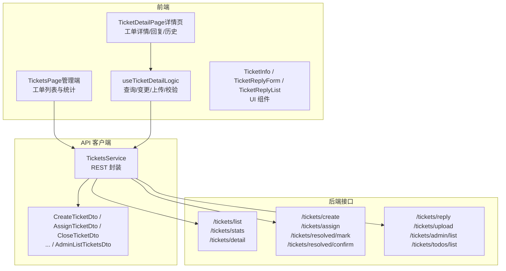
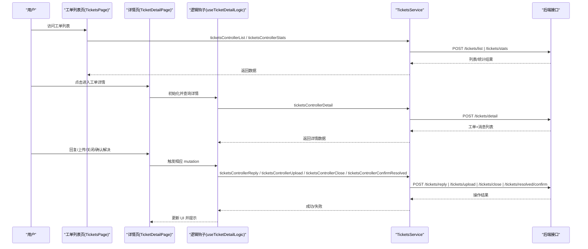
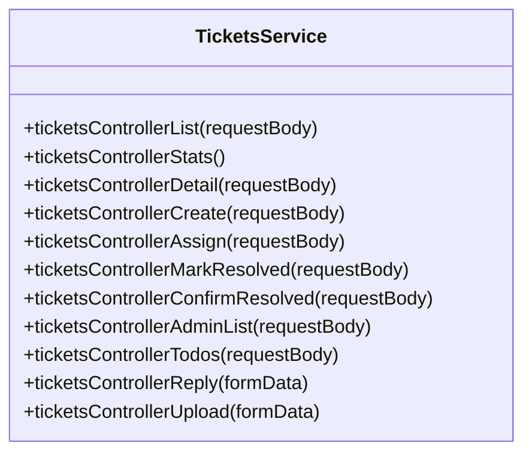
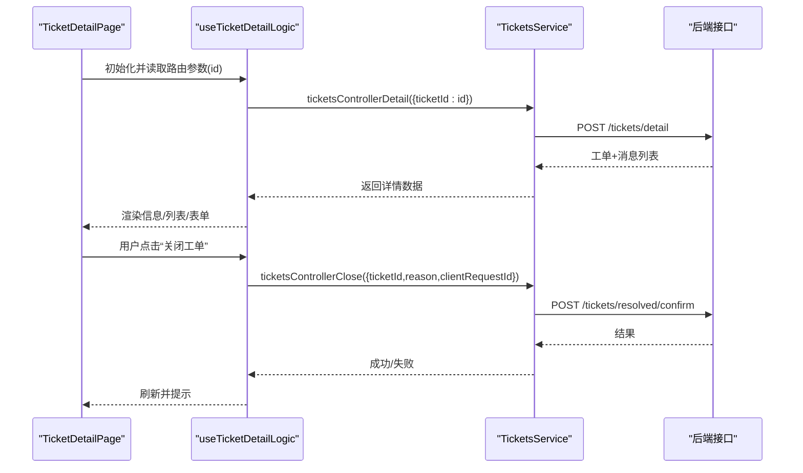
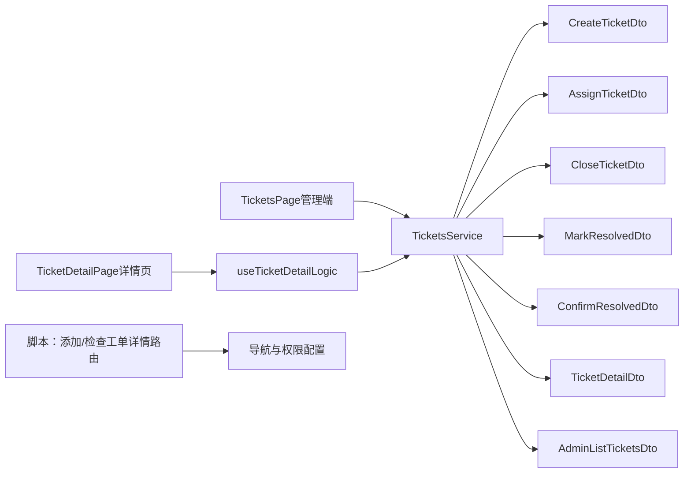

# 工单管理系统

<cite>
**本文引用的文件**
- [TicketsService.ts](file://src/api/services/TicketsService.ts)
- [CreateTicketDto.ts](file://src/api/models/CreateTicketDto.ts)
- [AssignTicketDto.ts](file://src/api/models/AssignTicketDto.ts)
- [CloseTicketDto.ts](file://src/api/models/CloseTicketDto.ts)
- [MarkResolvedDto.ts](file://src/api/models/MarkResolvedDto.ts)
- [ConfirmResolvedDto.ts](file://src/api/models/ConfirmResolvedDto.ts)
- [TicketDetailDto.ts](file://src/api/models/TicketDetailDto.ts)
- [AdminListTicketsDto.ts](file://src/api/models/AdminListTicketsDto.ts)
- [TicketsPage（管理端）.tsx](file://src/modules/admin/pages/operations/interaction/TicketsPage/index.tsx)
- [TicketDetailPage（详情页）.tsx](file://src/modules/admin/pages/operations/interaction/TicketDetailPage/index.tsx)
- [useTicketDetailLogic.ts](file://src/modules/admin/pages/operations/interaction/TicketDetailPage/hooks/useTicketDetailLogic.ts)
- [TicketInfo.tsx](file://src/modules/admin/pages/operations/interaction/TicketDetailPage/components/TicketInfo.tsx)
- [TicketReplyForm.tsx](file://src/modules/admin/pages/operations/interaction/TicketDetailPage/components/TicketReplyForm.tsx)
- [TicketReplyList.tsx](file://src/modules/admin/pages/operations/interaction/TicketDetailPage/components/TicketReplyList.tsx)
- [add-ticket-detail-route.mjs](file://scripts/add-ticket-detail-route.mjs)
- [check-ticket-detail-route.mjs](file://scripts/check-ticket-detail-route.mjs)
- [import-routes.ts](file://scripts/import-routes.ts)
- [seed-navigation.ts](file://scripts/seed-navigation.ts)
- [verify-endpoint-methods.ts](file://scripts/verify-endpoint-methods.ts)
</cite>

## 目录
1. [简介](#简介)
2. [项目结构](#项目结构)
3. [核心组件](#核心组件)
4. [架构总览](#架构总览)
5. [详细组件分析](#详细组件分析)
6. [依赖关系分析](#依赖关系分析)
7. [性能考量](#性能考量)
8. [故障排除指南](#故障排除指南)
9. [结论](#结论)
10. [附录](#附录)

## 简介
本文件面向“工单管理系统”的使用者与维护者，系统性梳理工单从创建、分配、处理、回复到关闭的全生命周期；说明工单模板配置、优先级与类别设置、自动分配规则等；解释工单详情页的信息展示、回复表单与历史回复列表管理；并提供统计分析、响应时效监控与处理效率评估建议，以及最佳实践、自动化处理规则与团队协作配置方案。

## 项目结构
围绕工单功能的关键目录与文件如下：
- API 层：服务接口与数据模型定义，统一暴露工单相关 REST 接口
- 管理端页面：工单列表、详情页、回复表单与历史回复列表
- 脚本：路由注入、校验与权限配置脚本
- 前端逻辑：基于 React Query 的查询与变更、表单校验与文件上传

图表来源
- [TicketsPage（管理端）.tsx](file://src/modules/admin/pages/operations/interaction/TicketsPage/index.tsx#L1-L48)
- [TicketDetailPage（详情页）.tsx](file://src/modules/admin/pages/operations/interaction/TicketDetailPage/index.tsx#L1-L53)
- [useTicketDetailLogic.ts](file://src/modules/admin/pages/operations/interaction/TicketDetailPage/hooks/useTicketDetailLogic.ts#L1-L185)
- [TicketsService.ts](file://src/api/services/TicketsService.ts#L1-L195)
- [CreateTicketDto.ts](file://src/api/models/CreateTicketDto.ts#L1-L30)
- [AdminListTicketsDto.ts](file://src/api/models/AdminListTicketsDto.ts#L1-L29)

章节来源
- [TicketsPage（管理端）.tsx](file://src/modules/admin/pages/operations/interaction/TicketsPage/index.tsx#L1-L48)
- [TicketDetailPage（详情页）.tsx](file://src/modules/admin/pages/operations/interaction/TicketDetailPage/index.tsx#L1-L53)
- [TicketsService.ts](file://src/api/services/TicketsService.ts#L1-L195)

## 核心组件
- 工单服务封装（TicketsService）
  - 列表查询、统计、详情、创建、分配、标记解决、确认解决、管理员列表、我的待办、回复、上传附件等接口
- 工单数据模型
  - 创建、分配、关闭、标记解决、确认解决、详情、管理员列表等 DTO
- 管理端工单列表页
  - 支持筛选、分页、统计指标展示、批量操作入口
- 工单详情页
  - 工单基础信息展示、状态/优先级/类别的标签化呈现、关闭与确认解决按钮、历史回复列表、回复表单与附件上传

章节来源
- [TicketsService.ts](file://src/api/services/TicketsService.ts#L1-L195)
- [CreateTicketDto.ts](file://src/api/models/CreateTicketDto.ts#L1-L30)
- [AssignTicketDto.ts](file://src/api/models/AssignTicketDto.ts#L1-L10)
- [CloseTicketDto.ts](file://src/api/models/CloseTicketDto.ts#L1-L10)
- [MarkResolvedDto.ts](file://src/api/models/MarkResolvedDto.ts#L1-L9)
- [ConfirmResolvedDto.ts](file://src/api/models/ConfirmResolvedDto.ts#L1-L8)
- [TicketDetailDto.ts](file://src/api/models/TicketDetailDto.ts#L1-L8)
- [AdminListTicketsDto.ts](file://src/api/models/AdminListTicketsDto.ts#L1-L29)
- [TicketsPage（管理端）.tsx](file://src/modules/admin/pages/operations/interaction/TicketsPage/index.tsx#L1-L48)
- [TicketDetailPage（详情页）.tsx](file://src/modules/admin/pages/operations/interaction/TicketDetailPage/index.tsx#L1-L53)

## 架构总览
下图展示从前端页面到 API 客户端再到后端接口的调用链路与职责分工。

图表来源
- [TicketsPage（管理端）.tsx](file://src/modules/admin/pages/operations/interaction/TicketsPage/index.tsx#L1-L48)
- [TicketDetailPage（详情页）.tsx](file://src/modules/admin/pages/operations/interaction/TicketDetailPage/index.tsx#L1-L53)
- [useTicketDetailLogic.ts](file://src/modules/admin/pages/operations/interaction/TicketDetailPage/hooks/useTicketDetailLogic.ts#L1-L185)
- [TicketsService.ts](file://src/api/services/TicketsService.ts#L1-L195)
- [verify-endpoint-methods.ts](file://scripts/verify-endpoint-methods.ts#L18-L20)

## 详细组件分析

### 工单服务封装（TicketsService）
- 职责
  - 对后端工单接口进行统一封装，提供类型安全的调用方法
  - 暴露列表、统计、详情、创建、分配、标记/确认解决、管理员列表、我的待办、回复、上传等方法
- 关键点
  - 使用统一的 OpenAPI 请求适配器，支持 JSON 与表单提交
  - 方法命名与后端路径一一对应，便于定位问题

图表来源
- [TicketsService.ts](file://src/api/services/TicketsService.ts#L1-L195)

章节来源
- [TicketsService.ts](file://src/api/services/TicketsService.ts#L1-L195)

### 工单数据模型
- 创建工单 CreateTicketDto
  - 字段：标题、类别、优先级、内容、附件、客户端请求标识
  - 类别枚举：技术、账户、资源、举报、其他
  - 优先级枚举：低、一般、高、紧急
- 分配工单 AssignTicketDto
  - 字段：工单号、承接人（可为空）
- 关闭工单 CloseTicketDto
  - 字段：工单号、原因
- 标记/确认解决
  - MarkResolvedDto：仅含工单号
  - ConfirmResolvedDto：仅含工单号
- 详情与管理员列表
  - TicketDetailDto：包含工单号
  - AdminListTicketsDto：分页、状态、类别、关键词、承接人过滤

章节来源
- [CreateTicketDto.ts](file://src/api/models/CreateTicketDto.ts#L1-L30)
- [AssignTicketDto.ts](file://src/api/models/AssignTicketDto.ts#L1-L10)
- [CloseTicketDto.ts](file://src/api/models/CloseTicketDto.ts#L1-L10)
- [MarkResolvedDto.ts](file://src/api/models/MarkResolvedDto.ts#L1-L9)
- [ConfirmResolvedDto.ts](file://src/api/models/ConfirmResolvedDto.ts#L1-L8)
- [TicketDetailDto.ts](file://src/api/models/TicketDetailDto.ts#L1-L8)
- [AdminListTicketsDto.ts](file://src/api/models/AdminListTicketsDto.ts#L1-L29)

### 工单详情页（TicketDetailPage）
- 页面组成
  - 工单信息卡片（状态/优先级/类别/创建人/时间等）
  - 历史回复列表
  - 回复工单表单（文本 + 附件）
- 交互逻辑
  - 查询详情、关闭、确认解决、回复、上传附件
  - 表单校验、文件上传预览与移除、提交后刷新与提示

图表来源
- [TicketDetailPage（详情页）.tsx](file://src/modules/admin/pages/operations/interaction/TicketDetailPage/index.tsx#L1-L53)
- [useTicketDetailLogic.ts](file://src/modules/admin/pages/operations/interaction/TicketDetailPage/hooks/useTicketDetailLogic.ts#L1-L185)
- [TicketsService.ts](file://src/api/services/TicketsService.ts#L1-L195)

章节来源
- [TicketDetailPage（详情页）.tsx](file://src/modules/admin/pages/operations/interaction/TicketDetailPage/index.tsx#L1-L53)
- [useTicketDetailLogic.ts](file://src/modules/admin/pages/operations/interaction/TicketDetailPage/hooks/useTicketDetailLogic.ts#L1-L185)
- [TicketInfo.tsx](file://src/modules/admin/pages/operations/interaction/TicketDetailPage/components/TicketInfo.tsx#L1-L128)
- [TicketReplyForm.tsx](file://src/modules/admin/pages/operations/interaction/TicketDetailPage/components/TicketReplyForm.tsx#L1-L129)
- [TicketReplyList.tsx](file://src/modules/admin/pages/operations/interaction/TicketDetailPage/components/TicketReplyList.tsx#L1-L53)

### 工单详情页组件拆解
- 工单信息卡片（TicketInfo）
  - 展示标题、状态、优先级、类别、创建人、创建时间
  - 提供“返回”“关闭工单”“确认已解决”按钮
- 历史回复列表（TicketReplyList）
  - 展示作者、时间、内容与附件链接
- 回复工单表单（TicketReplyForm）
  - 文本域校验、附件选择/上传/移除、提交与清空

章节来源
- [TicketInfo.tsx](file://src/modules/admin/pages/operations/interaction/TicketDetailPage/components/TicketInfo.tsx#L1-L128)
- [TicketReplyList.tsx](file://src/modules/admin/pages/operations/interaction/TicketDetailPage/components/TicketReplyList.tsx#L1-L53)
- [TicketReplyForm.tsx](file://src/modules/admin/pages/operations/interaction/TicketDetailPage/components/TicketReplyForm.tsx#L1-L129)

### 工单创建与模板配置
- 创建入口
  - 管理端工单列表页提供创建弹窗，填写标题、类别、优先级、内容与附件
- 模板配置建议
  - 预设常用模板字段（如“问题分类”“影响范围”“截图/日志”），在前端表单中以可选组合形式提供
  - 通过“客户端请求标识”避免重复提交
- 优先级与类别
  - 依据业务 SLA 设置优先级阈值与处理时限
  - 类别用于归档与统计分析，便于后续优化资源配置

章节来源
- [TicketsPage（管理端）.tsx](file://src/modules/admin/pages/operations/interaction/TicketsPage/index.tsx#L1-L48)
- [CreateTicketDto.ts](file://src/api/models/CreateTicketDto.ts#L1-L30)

### 工单分配与自动分配规则
- 分配方式
  - 管理员可在详情页将工单指派给具体处理人
- 自动分配建议
  - 基于“类别 + 优先级 + 处理人负载”进行轮询或权重分配
  - 为不同类别配置默认处理人组，减少人工干预
  - 结合“我的待办”接口实现个人任务池可视化

章节来源
- [AssignTicketDto.ts](file://src/api/models/AssignTicketDto.ts#L1-L10)
- [TicketsService.ts](file://src/api/services/TicketsService.ts#L140-L149)
- [verify-endpoint-methods.ts](file://scripts/verify-endpoint-methods.ts#L18-L20)

### 工单处理与关闭流程
- 处理流程
  - 标记“处理中” → 回复沟通 → 确认解决 → 关闭
- 关闭策略
  - 支持管理员强制关闭与用户自助关闭两种场景
  - 关闭时记录原因，便于审计与复盘

章节来源
- [MarkResolvedDto.ts](file://src/api/models/MarkResolvedDto.ts#L1-L9)
- [ConfirmResolvedDto.ts](file://src/api/models/ConfirmResolvedDto.ts#L1-L8)
- [CloseTicketDto.ts](file://src/api/models/CloseTicketDto.ts#L1-L10)
- [TicketInfo.tsx](file://src/modules/admin/pages/operations/interaction/TicketDetailPage/components/TicketInfo.tsx#L43-L59)

### 工单详情页功能详解
- 工单信息展示
  - 标签化渲染状态/优先级/类别，提升可读性
- 回复表单
  - 支持多附件上传与预览，提交后自动刷新列表
- 历史回复管理
  - 按时间倒序展示，支持附件下载

章节来源
- [TicketDetailPage（详情页）.tsx](file://src/modules/admin/pages/operations/interaction/TicketDetailPage/index.tsx#L1-L53)
- [TicketReplyForm.tsx](file://src/modules/admin/pages/operations/interaction/TicketDetailPage/components/TicketReplyForm.tsx#L1-L129)
- [TicketReplyList.tsx](file://src/modules/admin/pages/operations/interaction/TicketDetailPage/components/TicketReplyList.tsx#L1-L53)

### 工单统计分析、响应时效与处理效率
- 统计指标
  - 待处理、处理中、已解决、已关闭数量，结合类别/优先级维度聚合
- 响应时效
  - 记录首次响应时间（创建时间到第一次回复时间）、平均解决时间、超时工单占比
- 处理效率
  - 按处理人/类别/时间段计算解决率、重开率、满意度（可扩展）

章节来源
- [TicketsPage（管理端）.tsx](file://src/modules/admin/pages/operations/interaction/TicketsPage/index.tsx#L45-L60)
- [TicketsService.ts](file://src/api/services/TicketsService.ts#L39-L44)

## 依赖关系分析
- 前端耦合
  - 详情页逻辑钩子集中管理查询、变更与上传，降低页面复杂度
  - 组件职责清晰：信息展示、表单、列表分离
- API 层
  - TicketsService 作为单一事实源，避免分散的网络请求
- 路由与权限
  - 工单详情路由通过脚本注入，父级路由指向管理端布局
  - 导航与权限在脚本中统一维护

图表来源
- [TicketsPage（管理端）.tsx](file://src/modules/admin/pages/operations/interaction/TicketsPage/index.tsx#L1-L48)
- [TicketDetailPage（详情页）.tsx](file://src/modules/admin/pages/operations/interaction/TicketDetailPage/index.tsx#L1-L53)
- [useTicketDetailLogic.ts](file://src/modules/admin/pages/operations/interaction/TicketDetailPage/hooks/useTicketDetailLogic.ts#L1-L185)
- [TicketsService.ts](file://src/api/services/TicketsService.ts#L1-L195)
- [CreateTicketDto.ts](file://src/api/models/CreateTicketDto.ts#L1-L30)
- [AssignTicketDto.ts](file://src/api/models/AssignTicketDto.ts#L1-L10)
- [CloseTicketDto.ts](file://src/api/models/CloseTicketDto.ts#L1-L10)
- [MarkResolvedDto.ts](file://src/api/models/MarkResolvedDto.ts#L1-L9)
- [ConfirmResolvedDto.ts](file://src/api/models/ConfirmResolvedDto.ts#L1-L8)
- [TicketDetailDto.ts](file://src/api/models/TicketDetailDto.ts#L1-L8)
- [AdminListTicketsDto.ts](file://src/api/models/AdminListTicketsDto.ts#L1-L29)
- [add-ticket-detail-route.mjs](file://scripts/add-ticket-detail-route.mjs#L1-L76)
- [check-ticket-detail-route.mjs](file://scripts/check-ticket-detail-route.mjs#L1-L45)
- [import-routes.ts](file://scripts/import-routes.ts#L964-L978)
- [seed-navigation.ts](file://scripts/seed-navigation.ts#L85-L89)
- [seed-navigation.ts](file://scripts/seed-navigation.ts#L180-L184)

章节来源
- [import-routes.ts](file://scripts/import-routes.ts#L964-L978)
- [seed-navigation.ts](file://scripts/seed-navigation.ts#L85-L89)
- [seed-navigation.ts](file://scripts/seed-navigation.ts#L180-L184)
- [add-ticket-detail-route.mjs](file://scripts/add-ticket-detail-route.mjs#L1-L76)
- [check-ticket-detail-route.mjs](file://scripts/check-ticket-detail-route.mjs#L1-L45)

## 性能考量
- 前端缓存与刷新
  - 使用 React Query 缓存工单详情与列表，关键操作后主动失效并刷新
- 网络请求
  - 合理分页与筛选，避免一次性加载过多数据
- 附件上传
  - 采用分批上传与预览，避免阻塞主线程
- 统计计算
  - 在前端做轻量聚合，复杂统计下沉至后端接口

## 故障排除指南
- 工单详情无法加载
  - 检查路由参数与后端 /tickets/detail 是否可达
  - 查看 TicketsService 调用与返回结构
- 回复/上传失败
  - 确认 /tickets/reply 与 /tickets/upload 接口可用
  - 校验表单必填项与附件格式
- 关闭/确认解决异常
  - 核对 /tickets/resolved/confirm 与 /tickets/resolved/mark 的权限与参数
- 路由缺失
  - 使用脚本检查工单详情路由是否存在，必要时执行注入脚本

章节来源
- [useTicketDetailLogic.ts](file://src/modules/admin/pages/operations/interaction/TicketDetailPage/hooks/useTicketDetailLogic.ts#L53-L111)
- [verify-endpoint-methods.ts](file://scripts/verify-endpoint-methods.ts#L18-L20)
- [check-ticket-detail-route.mjs](file://scripts/check-ticket-detail-route.mjs#L1-L45)

## 结论
本系统以 TicketsService 为核心，围绕工单全生命周期提供了清晰的前端页面与组件实现。通过标准化的数据模型与接口，配合路由与权限脚本，能够快速落地工单创建、分配、处理、回复与关闭流程。建议在现有基础上完善模板配置、自动分配规则与统计分析能力，持续优化响应时效与处理效率。

## 附录
- 最佳实践
  - 明确工单类别与优先级映射，建立 SLA 与升级机制
  - 使用“我的待办”与“管理员列表”双视角管理任务流
  - 附件上传采用分批策略，保障用户体验
- 自动化处理规则
  - 基于类别与优先级自动分配处理人
  - 超时预警与自动升级通知
- 团队协作配置
  - 为不同角色配置相应权限（如“tickets”“manage-tickets”）
  - 在导航中合理组织菜单层级，确保易用性