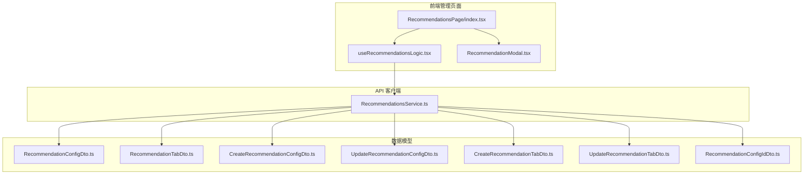
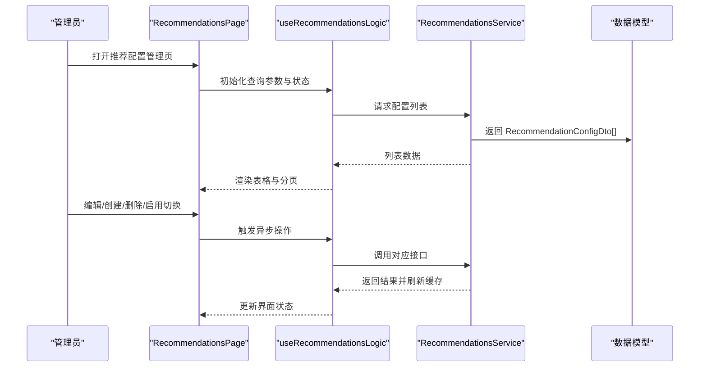
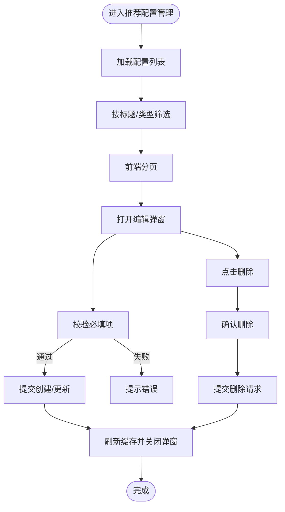
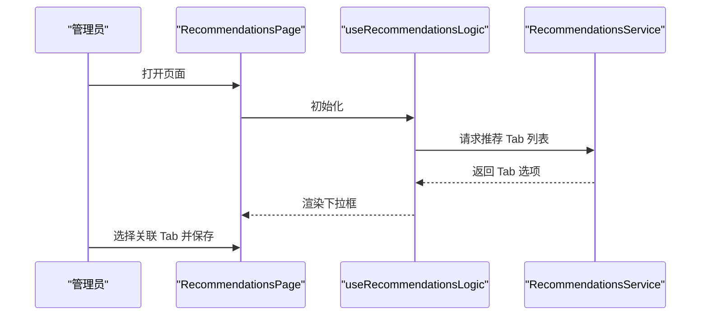
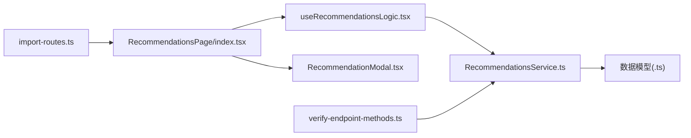

# 推荐系统管理

<cite>
**本文引用的文件**
- [RecommendationsService.ts](file://src/api/services/RecommendationsService.ts)
- [RecommendationConfigDto.ts](file://src/api/models/RecommendationConfigDto.ts)
- [CreateRecommendationConfigDto.ts](file://src/api/models/CreateRecommendationConfigDto.ts)
- [UpdateRecommendationConfigDto.ts](file://src/api/models/UpdateRecommendationConfigDto.ts)
- [RecommendationConfigIdDto.ts](file://src/api/models/RecommendationConfigIdDto.ts)
- [RecommendationTabDto.ts](file://src/api/models/RecommendationTabDto.ts)
- [CreateRecommendationTabDto.ts](file://src/api/models/CreateRecommendationTabDto.ts)
- [UpdateRecommendationTabDto.ts](file://src/api/models/UpdateRecommendationTabDto.ts)
- [useRecommendationsLogic.tsx](file://src/modules/admin/pages/operations/interaction/RecommendationsPage/useRecommendationsLogic.tsx)
- [RecommendationsPage/index.tsx](file://src/modules/admin/pages/operations/interaction/RecommendationsPage/index.tsx)
- [RecommendationModal.tsx](file://src/modules/admin/pages/operations/interaction/RecommendationsPage/components/RecommendationModal.tsx)
- [RecommendationsPage/types.ts](file://src/modules/admin/pages/operations/interaction/RecommendationsPage/types.ts)
- [import-routes.ts](file://scripts/import-routes.ts)
- [verify-endpoint-methods.ts](file://scripts/verify-endpoint-methods.ts)
</cite>

## 目录
1. [简介](#简介)
2. [项目结构](#项目结构)
3. [核心组件](#核心组件)
4. [架构总览](#架构总览)
5. [详细组件分析](#详细组件分析)
6. [依赖关系分析](#依赖关系分析)
7. [性能考虑](#性能考虑)
8. [故障排查指南](#故障排查指南)
9. [结论](#结论)
10. [附录](#附录)

## 简介
本文件面向推荐系统管理功能，覆盖推荐算法配置、个性化推荐策略设置、推荐内容管理、规则与权重调整、算法参数优化、内容创建/编辑/删除/批量管理、效果监控与评估、A/B 测试策略以及性能优化建议。文档基于仓库中已实现的“推荐配置”与“推荐 Tab”管理能力，结合前端管理页面与后端接口进行系统化说明，并提供可落地的最佳实践。

## 项目结构
推荐系统管理功能由以下层次构成：
- 后端接口层：通过 RecommendationsService 提供推荐配置与推荐 Tab 的增删改查、列表查询、用户端内容获取等接口。
- 数据模型层：定义推荐配置与推荐 Tab 的数据结构及枚举类型。
- 前端管理页面：提供推荐配置的列表、筛选、分页、弹窗编辑、启用/禁用切换、删除确认等交互。
- 路由与权限：脚本导入管理路由与校验接口方法，确保推荐管理入口与权限控制。

图表来源
- [RecommendationsPage/index.tsx](file://src/modules/admin/pages/operations/interaction/RecommendationsPage/index.tsx#L1-L49)
- [useRecommendationsLogic.tsx](file://src/modules/admin/pages/operations/interaction/RecommendationsPage/useRecommendationsLogic.tsx#L1-L105)
- [RecommendationModal.tsx](file://src/modules/admin/pages/operations/interaction/RecommendationsPage/components/RecommendationModal.tsx#L1-L181)
- [RecommendationsService.ts](file://src/api/services/RecommendationsService.ts#L1-L284)
- [RecommendationConfigDto.ts](file://src/api/models/RecommendationConfigDto.ts#L1-L28)
- [RecommendationTabDto.ts](file://src/api/models/RecommendationTabDto.ts#L1-L16)
- [CreateRecommendationConfigDto.ts](file://src/api/models/CreateRecommendationConfigDto.ts#L1-L52)
- [UpdateRecommendationConfigDto.ts](file://src/api/models/UpdateRecommendationConfigDto.ts#L1-L52)
- [CreateRecommendationTabDto.ts](file://src/api/models/CreateRecommendationTabDto.ts#L1-L28)
- [UpdateRecommendationTabDto.ts](file://src/api/models/UpdateRecommendationTabDto.ts#L1-L28)
- [RecommendationConfigIdDto.ts](file://src/api/models/RecommendationConfigIdDto.ts#L1-L11)

章节来源
- [RecommendationsPage/index.tsx](file://src/modules/admin/pages/operations/interaction/RecommendationsPage/index.tsx#L1-L49)
- [useRecommendationsLogic.tsx](file://src/modules/admin/pages/operations/interaction/RecommendationsPage/useRecommendationsLogic.tsx#L1-L105)
- [RecommendationModal.tsx](file://src/modules/admin/pages/operations/interaction/RecommendationsPage/components/RecommendationModal.tsx#L1-L181)
- [RecommendationsService.ts](file://src/api/services/RecommendationsService.ts#L1-L284)

## 核心组件
- 推荐配置（RecommendationConfig）
  - 字段：id、title、categoryKey、type、timeRange、limit、sort、enabled、style、createdAt、updatedAt
  - 类型枚举：latest、hot_downloads、hot_views、most_seeded、recent_active
- 推荐 Tab（RecommendationTab）
  - 字段：id、categoryKey、label、sort、enabled、icon、createdAt、updatedAt
- 接口服务（RecommendationsService）
  - 配置：创建、更新、删除、管理后台列表、用户端默认推荐、用户端按配置获取内容
  - Tab：创建、更新、删除、管理后台列表、用户端活动 Tab 列表
- 前端页面与逻辑
  - 列表、筛选、分页、弹窗编辑、启用/禁用切换、删除确认、异步操作封装

章节来源
- [RecommendationConfigDto.ts](file://src/api/models/RecommendationConfigDto.ts#L1-L28)
- [RecommendationTabDto.ts](file://src/api/models/RecommendationTabDto.ts#L1-L16)
- [RecommendationsService.ts](file://src/api/services/RecommendationsService.ts#L16-L283)
- [RecommendationsPage/types.ts](file://src/modules/admin/pages/operations/interaction/RecommendationsPage/types.ts#L1-L23)

## 架构总览
推荐系统管理采用“前端页面 + API 客户端 + 数据模型”的分层设计。前端使用 TanStack Query 管理服务端状态，调用 RecommendationsService 发起请求；后端提供 REST 风格接口，支持管理端与用户端两类场景。

图表来源
- [RecommendationsPage/index.tsx](file://src/modules/admin/pages/operations/interaction/RecommendationsPage/index.tsx#L1-L49)
- [useRecommendationsLogic.tsx](file://src/modules/admin/pages/operations/interaction/RecommendationsPage/useRecommendationsLogic.tsx#L66-L105)
- [RecommendationsService.ts](file://src/api/services/RecommendationsService.ts#L109-L154)

## 详细组件分析

### 推荐配置管理（创建/编辑/删除/启用切换）
- 功能点
  - 列表：支持按标题与类型筛选、前端分页展示
  - 编辑：标题、关联 Tab、推荐策略、时间范围、展示样式、展示数量、排序权重、启用状态
  - 删除：删除确认弹窗，成功后刷新列表
  - 启用切换：通过开关快速变更 enabled 状态
- 关键流程
  - 表单字段映射到 CreateRecommendationConfigDto 或 UpdateRecommendationConfigDto
  - 通过 RecommendationsService 调用对应接口
  - 使用 TanStack Query 缓存与失效，保证 UI 与服务端一致

图表来源
- [useRecommendationsLogic.tsx](file://src/modules/admin/pages/operations/interaction/RecommendationsPage/useRecommendationsLogic.tsx#L18-L105)
- [RecommendationModal.tsx](file://src/modules/admin/pages/operations/interaction/RecommendationsPage/components/RecommendationModal.tsx#L24-L181)
- [RecommendationsService.ts](file://src/api/services/RecommendationsService.ts#L23-L103)

章节来源
- [useRecommendationsLogic.tsx](file://src/modules/admin/pages/operations/interaction/RecommendationsPage/useRecommendationsLogic.tsx#L18-L105)
- [RecommendationModal.tsx](file://src/modules/admin/pages/operations/interaction/RecommendationsPage/components/RecommendationModal.tsx#L24-L181)
- [RecommendationsService.ts](file://src/api/services/RecommendationsService.ts#L23-L103)

### 推荐 Tab 管理（创建/编辑/删除/启用切换）
- 功能点
  - 管理后台列表：用于选择“关联 Tab”
  - 用户端活动 Tab：仅返回 enabled=true 的 Tab
  - 支持创建、更新、删除与启用切换
- 关键流程
  - 通过 RecommendationsService.recommendationsControllerListTabs 获取下拉选项
  - 通过 RecommendationsService.recommendationsControllerGetActiveTabs 获取用户端 Tab 列表

图表来源
- [useRecommendationsLogic.tsx](file://src/modules/admin/pages/operations/interaction/RecommendationsPage/useRecommendationsLogic.tsx#L95-L105)
- [RecommendationsService.ts](file://src/api/services/RecommendationsService.ts#L247-L282)

章节来源
- [useRecommendationsLogic.tsx](file://src/modules/admin/pages/operations/interaction/RecommendationsPage/useRecommendationsLogic.tsx#L95-L105)
- [RecommendationsService.ts](file://src/api/services/RecommendationsService.ts#L247-L282)

### 推荐内容获取（用户端）
- 默认推荐：RecommendationsService.recommendationsControllerGetIndex
- 按配置获取内容：RecommendationsService.recommendationsControllerGetContent
- 用途：前端首页或板块页根据配置动态渲染推荐内容

章节来源
- [RecommendationsService.ts](file://src/api/services/RecommendationsService.ts#L129-L154)

### 数据模型与类型定义
- 推荐配置（RecommendationConfigDto）
  - 关键字段：title、type（枚举）、timeRange、limit、sort、enabled、style
  - 枚举值：latest、hot_downloads、hot_views、most_seeded、recent_active
- 推荐 Tab（RecommendationTabDto）
  - 关键字段：label、sort、enabled、icon、categoryKey
- 请求体类型
  - CreateRecommendationConfigDto / UpdateRecommendationConfigDto
  - CreateRecommendationTabDto / UpdateRecommendationTabDto
  - RecommendationConfigIdDto（删除/获取内容时使用）

章节来源
- [RecommendationConfigDto.ts](file://src/api/models/RecommendationConfigDto.ts#L1-L28)
- [CreateRecommendationConfigDto.ts](file://src/api/models/CreateRecommendationConfigDto.ts#L1-L52)
- [UpdateRecommendationConfigDto.ts](file://src/api/models/UpdateRecommendationConfigDto.ts#L1-L52)
- [RecommendationTabDto.ts](file://src/api/models/RecommendationTabDto.ts#L1-L16)
- [CreateRecommendationTabDto.ts](file://src/api/models/CreateRecommendationTabDto.ts#L1-L28)
- [UpdateRecommendationTabDto.ts](file://src/api/models/UpdateRecommendationTabDto.ts#L1-L28)
- [RecommendationConfigIdDto.ts](file://src/api/models/RecommendationConfigIdDto.ts#L1-L11)

## 依赖关系分析
- 前端对后端的依赖
  - RecommendationsService 封装了所有推荐相关接口，前端页面与逻辑通过该服务发起请求
- 数据模型依赖
  - 页面逻辑与弹窗组件依赖数据模型定义的字段与枚举
- 路由与权限
  - 管理路由通过脚本导入，接口方法通过脚本校验，确保推荐管理入口与权限一致

图表来源
- [import-routes.ts](file://scripts/import-routes.ts#L497-L502)
- [verify-endpoint-methods.ts](file://scripts/verify-endpoint-methods.ts#L30-L40)
- [RecommendationsPage/index.tsx](file://src/modules/admin/pages/operations/interaction/RecommendationsPage/index.tsx#L1-L49)
- [useRecommendationsLogic.tsx](file://src/modules/admin/pages/operations/interaction/RecommendationsPage/useRecommendationsLogic.tsx#L1-L105)
- [RecommendationModal.tsx](file://src/modules/admin/pages/operations/interaction/RecommendationsPage/components/RecommendationModal.tsx#L1-L181)
- [RecommendationsService.ts](file://src/api/services/RecommendationsService.ts#L1-L284)

章节来源
- [import-routes.ts](file://scripts/import-routes.ts#L497-L502)
- [verify-endpoint-methods.ts](file://scripts/verify-endpoint-methods.ts#L30-L40)

## 性能考虑
- 前端分页与筛选
  - 当前实现为前端分页与筛选，适用于中小规模数据。若配置数量增长，建议后端支持分页与筛选参数，减少传输与渲染压力。
- 缓存与失效
  - 使用 TanStack Query 缓存列表数据，编辑/删除/启用切换后主动失效查询，避免陈旧数据。
- 请求合并与节流
  - 对频繁触发的筛选与搜索，可在前端增加防抖，降低请求频率。
- 图片与内容懒加载
  - 推荐内容卡片建议使用懒加载，提升首屏性能。
- 服务端分页迁移
  - 将筛选与分页迁移到后端接口，以减轻前端负担并提升稳定性。

## 故障排查指南
- 常见错误码
  - 参数错误、未认证、禁止访问/账号禁用、资源不存在、服务器错误
- 排查步骤
  - 确认登录态与权限是否满足管理入口要求
  - 检查必填字段（标题、关联 Tab、推荐策略、展示数量）是否填写完整
  - 查看网络面板，确认接口返回状态码与错误信息
  - 若启用切换无效，检查 enabled 字段是否正确提交
- 建议的日志与监控
  - 记录关键操作（创建/更新/删除/启用切换）的时间与结果
  - 监控接口成功率与响应时间，异常时告警

章节来源
- [RecommendationsService.ts](file://src/api/services/RecommendationsService.ts#L37-L101)
- [RecommendationsService.ts](file://src/api/services/RecommendationsService.ts#L175-L240)

## 结论
本推荐系统管理功能已具备完整的配置与 Tab 管理能力，前端通过统一的服务层与数据模型实现高效开发与维护。建议后续在后端完善分页与筛选、引入更丰富的推荐策略与权重配置、建立效果监控与 A/B 测试体系，持续优化用户体验与平台收益。

## 附录

### 推荐算法配置与策略设置
- 推荐策略类型
  - 最新（latest）
  - 热门下载（hot_downloads）
  - 热门浏览（hot_views）
  - 最多做种（most_seeded）
  - 近期活跃（recent_active）
- 策略参数
  - 时间范围（day）：0 表示不限
  - 展示数量（limit）：1~100
  - 排序权重（sort）：数值越大越靠前
  - 展示样式（style）：前端样式标识
  - 启用状态（enabled）：true/false

章节来源
- [CreateRecommendationConfigDto.ts](file://src/api/models/CreateRecommendationConfigDto.ts#L17-L38)
- [UpdateRecommendationConfigDto.ts](file://src/api/models/UpdateRecommendationConfigDto.ts#L17-L38)
- [RecommendationConfigDto.ts](file://src/api/models/RecommendationConfigDto.ts#L19-L25)

### 推荐内容管理操作
- 创建
  - 填写标题、选择关联 Tab、选择策略、设置时间范围/展示数量/排序权重/样式、启用状态
- 编辑
  - 修改任一字段并提交更新
- 删除
  - 打开删除确认弹窗，确认后提交删除请求
- 批量管理
  - 当前实现为逐条操作。建议在后端扩展批量接口，前端提供全选与批量启用/禁用/删除

章节来源
- [RecommendationModal.tsx](file://src/modules/admin/pages/operations/interaction/RecommendationsPage/components/RecommendationModal.tsx#L24-L181)
- [useRecommendationsLogic.tsx](file://src/modules/admin/pages/operations/interaction/RecommendationsPage/useRecommendationsLogic.tsx#L42-L63)

### 推荐效果监控与评估
- 指标建议
  - 点击率（CTR）、转化率、平均停留时长、跳出率、用户留存
- 数据采集
  - 在推荐内容卡片埋点上报曝光与点击事件
- 评估方式
  - A/B 测试对比不同策略/权重下的指标差异，择优上线

[本节为通用实践建议，不直接分析具体文件]

### A/B 测试策略
- 分组方式
  - 基于用户 ID 哈希分组，确保随机性与稳定性
- 实验周期
  - 至少 1~2 个完整自然周，避免节假日影响
- 统计显著性
  - 使用统计学工具计算样本量与显著性阈值

[本节为通用实践建议，不直接分析具体文件]

### 性能优化方案
- 接口优化
  - 后端支持分页、筛选、排序参数，前端仅请求必要字段
- 前端优化
  - 图片懒加载、虚拟列表、缓存策略、防抖与节流
- 监控与告警
  - 接口耗时与错误率监控，异常自动告警

[本节为通用实践建议，不直接分析具体文件]