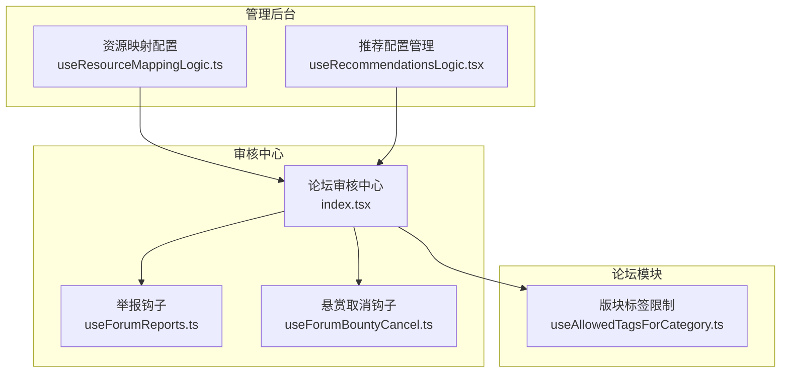
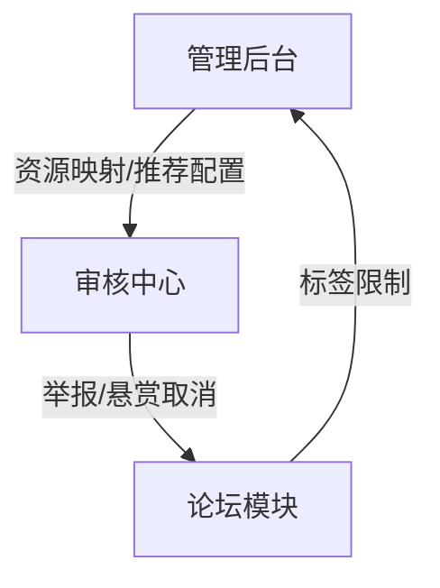
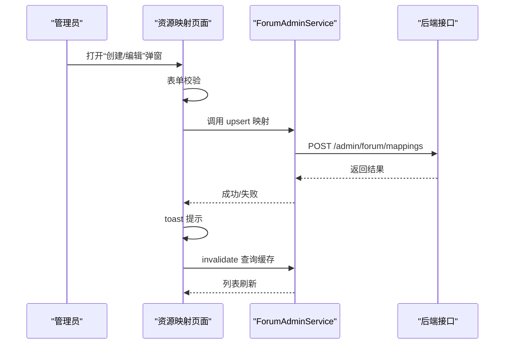
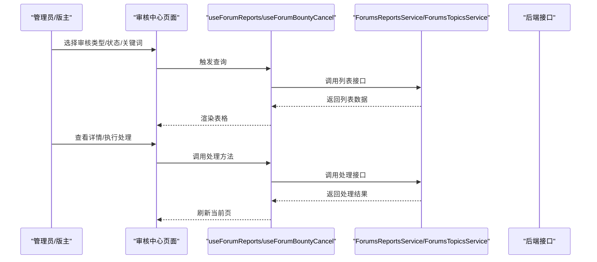
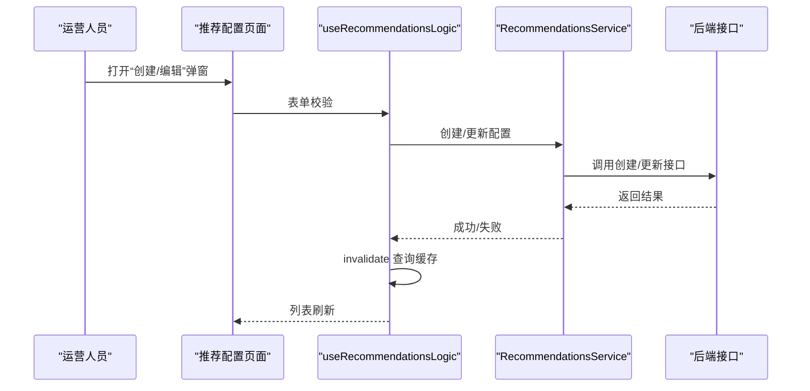
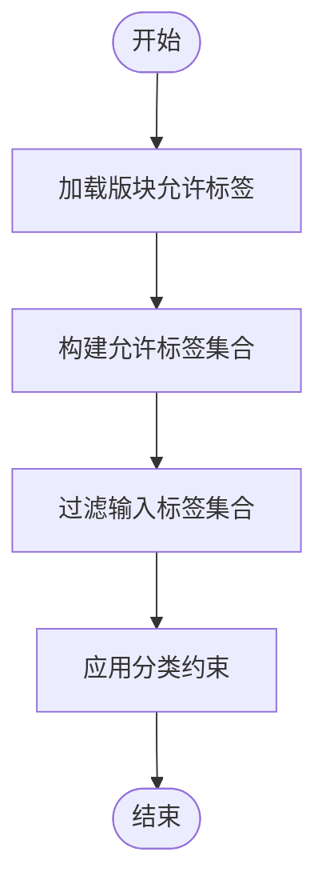
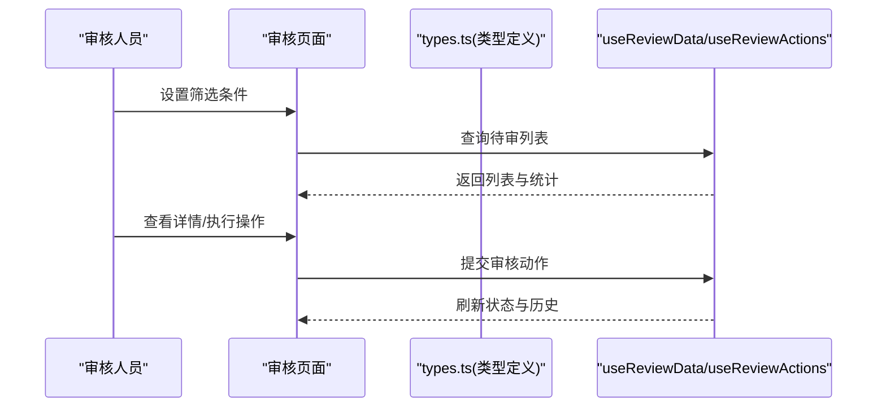
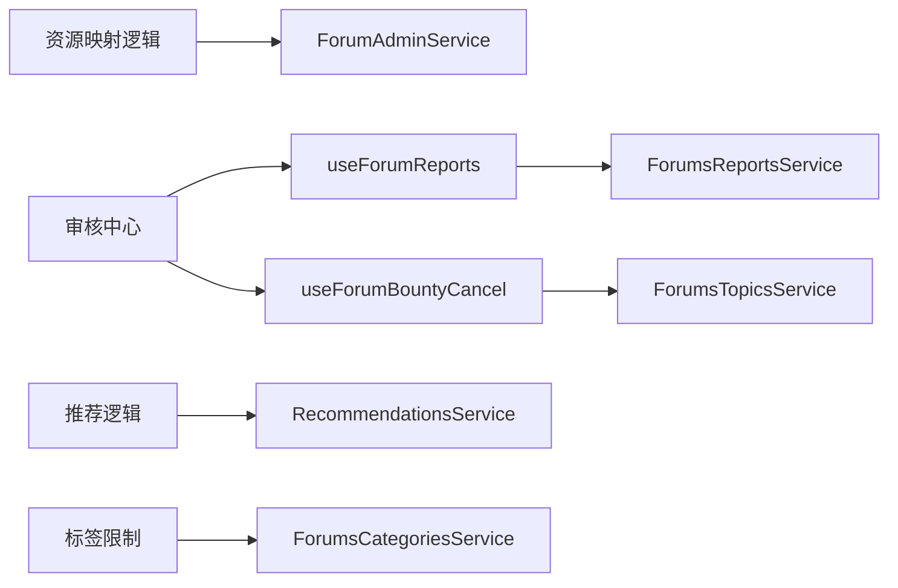

# 社区资源管理

<cite>
**本文引用的文件**
- [useResourceMappingLogic.ts](file://src/modules/admin/pages/community/forum/ResourceMappingPage/useResourceMappingLogic.ts)
- [ForumAdminService.ts](file://src/api/services/ForumAdminService.ts)
- [ForumResourceCategoryMapping.ts](file://src/api/models/ForumResourceCategoryMapping.ts)
- [index.tsx（论坛审核中心）](file://src/modules/forum/pages/Admin/ForumAuditCenter/index.tsx)
- [useForumReports.ts](file://src/modules/forum/pages/Admin/ForumAuditCenter/hooks/useForumReports.ts)
- [useForumBountyCancel.ts](file://src/modules/forum/pages/Admin/ForumAuditCenter/hooks/useForumBountyCancel.ts)
- [ForumsReportsService.ts](file://src/api/services/ForumsReportsService.ts)
- [ForumsTopicsService.ts](file://src/api/services/ForumsTopicsService.ts)
- [useRecommendationsLogic.tsx（推荐配置）](file://src/modules/admin/pages/operations/interaction/RecommendationsPage/useRecommendationsLogic.tsx)
- [RecommendationsPage/index.tsx](file://src/modules/admin/pages/operations/interaction/RecommendationsPage/index.tsx)
- [RecommendationModal.tsx](file://src/modules/admin/pages/operations/interaction/RecommendationsPage/components/RecommendationModal.tsx)
- [types.ts（审核统计与类型）](file://src/modules/app/pages/Review/types.ts)
- [index.tsx（审核页面）](file://src/modules/app/pages/Review/index.tsx)
- [useAllowedTagsForCategory.ts](file://src/modules/forum/hooks/useAllowedTagsForCategory.ts)
- [README.md（论坛审核中心）](file://src/modules/forum/pages/Admin/ForumAuditCenter/README.md)
</cite>

## 目录
1. [简介](#简介)
2. [项目结构](#项目结构)
3. [核心组件](#核心组件)
4. [架构总览](#架构总览)
5. [组件详解](#组件详解)
6. [依赖关系分析](#依赖关系分析)
7. [性能考量](#性能考量)
8. [故障排查指南](#故障排查指南)
9. [结论](#结论)
10. [附录](#附录)

## 简介
本文件面向社区资源管理功能，围绕以下主题进行系统化说明：
- 论坛资源映射管理：资源类型到论坛版块的映射配置与维护。
- 内容分类配置：基于版块标签限制与允许集合的分类约束。
- 社区资源审核机制：举报审核与悬赏取消申请审核的流程与接口。
- 自动分类与人工审核协同：结合标签白名单与审核流程保障内容质量。
- 违规内容检测与处理：举报与审核联动，支持删除内容与锁定话题等处置。
- 用户举报处理：统一入口、状态流转与驳回理由收集。
- 内容推荐优化：推荐配置的创建、编辑、启用/禁用与分页展示。
- 社区活跃度管理：通过推荐位与审核中心提升治理效率。

## 项目结构
社区资源管理涉及三类关键模块：
- 管理后台：资源映射配置、推荐配置管理。
- 审核中心：举报与悬赏取消申请的统一审核界面。
- 论坛模块：版块标签限制、分类约束与内容展示。

图表来源
- [useResourceMappingLogic.ts](file://src/modules/admin/pages/community/forum/ResourceMappingPage/useResourceMappingLogic.ts#L1-L103)
- [useRecommendationsLogic.tsx（推荐配置）](file://src/modules/admin/pages/operations/interaction/RecommendationsPage/useRecommendationsLogic.tsx#L1-L321)
- [index.tsx（论坛审核中心）](file://src/modules/forum/pages/Admin/ForumAuditCenter/index.tsx#L1-L408)
- [useForumReports.ts](file://src/modules/forum/pages/Admin/ForumAuditCenter/hooks/useForumReports.ts#L1-L63)
- [useForumBountyCancel.ts](file://src/modules/forum/pages/Admin/ForumAuditCenter/hooks/useForumBountyCancel.ts#L1-L58)
- [useAllowedTagsForCategory.ts](file://src/modules/forum/hooks/useAllowedTagsForCategory.ts#L1-L47)

章节来源
- [useResourceMappingLogic.ts](file://src/modules/admin/pages/community/forum/ResourceMappingPage/useResourceMappingLogic.ts#L1-L103)
- [useRecommendationsLogic.tsx（推荐配置）](file://src/modules/admin/pages/operations/interaction/RecommendationsPage/useRecommendationsLogic.tsx#L1-L321)
- [index.tsx（论坛审核中心）](file://src/modules/forum/pages/Admin/ForumAuditCenter/index.tsx#L1-L408)

## 核心组件
- 资源映射配置：提供资源类型到论坛版块的映射维护能力，支持增删改查与表单校验。
- 审核中心：统一承载举报审核与悬赏取消申请审核，支持筛选、分页与详情抽屉。
- 推荐配置：支持创建/编辑推荐位，设置时间范围、展示数量、排序权重与启用状态。
- 版块标签限制：根据版块允许的标签集合对内容进行分类约束。

章节来源
- [useResourceMappingLogic.ts](file://src/modules/admin/pages/community/forum/ResourceMappingPage/useResourceMappingLogic.ts#L10-L103)
- [index.tsx（论坛审核中心）](file://src/modules/forum/pages/Admin/ForumAuditCenter/index.tsx#L38-L408)
- [useRecommendationsLogic.tsx（推荐配置）](file://src/modules/admin/pages/operations/interaction/RecommendationsPage/useRecommendationsLogic.tsx#L18-L321)
- [useAllowedTagsForCategory.ts](file://src/modules/forum/hooks/useAllowedTagsForCategory.ts#L1-L47)

## 架构总览
社区资源管理采用“管理后台 + 审核中心 + 论坛模块”的分层架构：
- 管理后台负责配置与运营：资源映射、推荐配置。
- 审核中心负责治理：举报与悬赏取消申请的审核。
- 论坛模块负责内容与分类：标签限制与内容展示。

图表来源
- [useResourceMappingLogic.ts](file://src/modules/admin/pages/community/forum/ResourceMappingPage/useResourceMappingLogic.ts#L37-L61)
- [index.tsx（论坛审核中心）](file://src/modules/forum/pages/Admin/ForumAuditCenter/index.tsx#L50-L59)
- [useAllowedTagsForCategory.ts](file://src/modules/forum/hooks/useAllowedTagsForCategory.ts#L1-L47)

## 组件详解

### 资源映射管理
- 功能概述：维护“资源类型 → 论坛版块ID”的映射关系，用于自动分类与路由绑定。
- 关键实现：
  - 表单校验：使用 Zod 对资源类型与版块ID进行必填校验。
  - 数据查询：通过管理端服务获取现有映射列表。
  - 数据变更：通过“创建/更新”接口提交映射配置。
  - 状态管理：使用 TanStack Query 管理查询与缓存，提交成功后刷新列表。
- 交互流程：打开弹窗 → 填写表单 → 提交 → 成功提示 → 刷新列表。

图表来源
- [useResourceMappingLogic.ts](file://src/modules/admin/pages/community/forum/ResourceMappingPage/useResourceMappingLogic.ts#L23-L101)
- [ForumAdminService.ts](file://src/api/services/ForumAdminService.ts#L34-L49)

章节来源
- [useResourceMappingLogic.ts](file://src/modules/admin/pages/community/forum/ResourceMappingPage/useResourceMappingLogic.ts#L1-L103)
- [ForumAdminService.ts](file://src/api/services/ForumAdminService.ts#L1-L50)
- [ForumResourceCategoryMapping.ts](file://src/api/models/ForumResourceCategoryMapping.ts#L1-L7)

### 审核中心（举报与悬赏取消）
- 功能概述：统一承载“举报审核”和“悬赏取消申请审核”，支持筛选、分页、详情抽屉与批量操作。
- 关键实现：
  - 举报审核：查询列表、标记处理、驳回、删除内容、锁定话题等。
  - 悬赏取消：查询列表、同意/拒绝、记录备注。
  - 状态本地化：中文标签转换（待处理/已处理/已驳回等）。
  - 权限控制：仅管理员与版主可见。
- 流程图：选择审核类型 → 设置筛选 → 加载列表 → 查看详情 → 执行处理 → 刷新分页。

图表来源
- [index.tsx（论坛审核中心）](file://src/modules/forum/pages/Admin/ForumAuditCenter/index.tsx#L43-L99)
- [useForumReports.ts](file://src/modules/forum/pages/Admin/ForumAuditCenter/hooks/useForumReports.ts#L8-L61)
- [useForumBountyCancel.ts](file://src/modules/forum/pages/Admin/ForumAuditCenter/hooks/useForumBountyCancel.ts#L8-L56)

章节来源
- [index.tsx（论坛审核中心）](file://src/modules/forum/pages/Admin/ForumAuditCenter/index.tsx#L1-L408)
- [useForumReports.ts](file://src/modules/forum/pages/Admin/ForumAuditCenter/hooks/useForumReports.ts#L1-L63)
- [useForumBountyCancel.ts](file://src/modules/forum/pages/Admin/ForumAuditCenter/hooks/useForumBountyCancel.ts#L1-L58)
- [README.md（论坛审核中心）](file://src/modules/forum/pages/Admin/ForumAuditCenter/README.md#L1-L42)

### 推荐配置管理
- 功能概述：创建/编辑推荐位，设置时间范围、展示数量、排序权重与启用状态，并支持分页与筛选。
- 关键实现：
  - 列表查询：使用 TanStack Query 获取推荐配置列表。
  - Tab 关联：多选关联 Tab，支持全站或特定分类。
  - 表单校验：必填字段校验，提交成功后刷新缓存。
  - 状态切换：启用/禁用推荐配置。
- 流程图：打开弹窗 → 填写表单 → 提交 → 成功提示 → 刷新列表。

图表来源
- [useRecommendationsLogic.tsx（推荐配置）](file://src/modules/admin/pages/operations/interaction/RecommendationsPage/useRecommendationsLogic.tsx#L170-L186)
- [RecommendationsPage/index.tsx](file://src/modules/admin/pages/operations/interaction/RecommendationsPage/index.tsx#L1-L49)
- [RecommendationModal.tsx](file://src/modules/admin/pages/operations/interaction/RecommendationsPage/components/RecommendationModal.tsx#L28-L181)

章节来源
- [useRecommendationsLogic.tsx（推荐配置）](file://src/modules/admin/pages/operations/interaction/RecommendationsPage/useRecommendationsLogic.tsx#L1-L321)
- [RecommendationsPage/index.tsx](file://src/modules/admin/pages/operations/interaction/RecommendationsPage/index.tsx#L1-L49)
- [RecommendationModal.tsx](file://src/modules/admin/pages/operations/interaction/RecommendationsPage/components/RecommendationModal.tsx#L1-L181)

### 版块标签限制与自动分类
- 功能概述：根据版块允许的标签集合对内容进行分类约束，避免违规标签进入对应版块。
- 关键实现：
  - 加载允许标签：通过分类服务获取分组与未分组标签。
  - 过滤逻辑：将输入标签集合与允许集合取交集，仅保留允许标签。
  - 约束生效：在内容提交或编辑时应用过滤逻辑。
- 流程图：加载标签 → 生成允许集合 → 过滤输入标签 → 应用约束。

图表来源
- [useAllowedTagsForCategory.ts](file://src/modules/forum/hooks/useAllowedTagsForCategory.ts#L1-L47)

章节来源
- [useAllowedTagsForCategory.ts](file://src/modules/forum/hooks/useAllowedTagsForCategory.ts#L1-L47)

### 内容审核与质量控制
- 功能概述：对提交内容进行人工审核，支持状态切换与历史记录查看。
- 关键实现：
  - 审核类型与状态：电影/剧集/歌单/种子等类型与待审/通过/驳回状态。
  - 审核操作：批准/驳回，支持备注与历史查看。
  - 统计信息：今日通过/驳回数量与各类待审数量。
- 流程图：筛选 → 列表 → 查看详情 → 执行操作 → 记录历史。

图表来源
- [types.ts（审核统计与类型）](file://src/modules/app/pages/Review/types.ts#L1-L45)
- [index.tsx（审核页面）](file://src/modules/app/pages/Review/index.tsx#L13-L79)

章节来源
- [types.ts（审核统计与类型）](file://src/modules/app/pages/Review/types.ts#L1-L45)
- [index.tsx（审核页面）](file://src/modules/app/pages/Review/index.tsx#L1-L79)

## 依赖关系分析
- 资源映射依赖管理端服务与模型，使用 Zod 校验与 TanStack Query 管理状态。
- 审核中心依赖举报与悬赏取消的钩子，钩子再依赖对应的 API 服务。
- 推荐配置依赖推荐服务与 Tab 选项查询，使用受控表单与异步操作封装。
- 版块标签限制依赖分类服务，动态构建允许集合并过滤输入。

图表来源
- [useResourceMappingLogic.ts](file://src/modules/admin/pages/community/forum/ResourceMappingPage/useResourceMappingLogic.ts#L1-L103)
- [index.tsx（论坛审核中心）](file://src/modules/forum/pages/Admin/ForumAuditCenter/index.tsx#L1-L408)
- [useForumReports.ts](file://src/modules/forum/pages/Admin/ForumAuditCenter/hooks/useForumReports.ts#L1-L63)
- [useForumBountyCancel.ts](file://src/modules/forum/pages/Admin/ForumAuditCenter/hooks/useForumBountyCancel.ts#L1-L58)
- [useRecommendationsLogic.tsx（推荐配置）](file://src/modules/admin/pages/operations/interaction/RecommendationsPage/useRecommendationsLogic.tsx#L1-L321)
- [useAllowedTagsForCategory.ts](file://src/modules/forum/hooks/useAllowedTagsForCategory.ts#L1-L47)

章节来源
- [useResourceMappingLogic.ts](file://src/modules/admin/pages/community/forum/ResourceMappingPage/useResourceMappingLogic.ts#L1-L103)
- [index.tsx（论坛审核中心）](file://src/modules/forum/pages/Admin/ForumAuditCenter/index.tsx#L1-L408)
- [useRecommendationsLogic.tsx（推荐配置）](file://src/modules/admin/pages/operations/interaction/RecommendationsPage/useRecommendationsLogic.tsx#L1-L321)
- [useAllowedTagsForCategory.ts](file://src/modules/forum/hooks/useAllowedTagsForCategory.ts#L1-L47)

## 性能考量
- 列表分页与虚拟滚动：审核中心与推荐配置均采用分页与本地筛选，减少一次性渲染压力。
- 查询缓存与失效：使用 TanStack Query 的缓存与失效策略，避免重复请求。
- 本地状态转换：中文标签转换在前端完成，降低后端负担。
- 异步操作封装：统一的异步操作封装减少重复逻辑与错误处理成本。

## 故障排查指南
- 资源映射保存失败：检查表单校验与网络请求，查看 toast 错误提示并重试。
- 审核中心无数据：确认筛选条件与权限，检查接口返回结构是否符合预期。
- 推荐配置无法更新：检查必填字段与 Tab 关联，确认服务端响应状态。
- 标签过滤异常：确认分类服务返回格式与允许集合构建逻辑。

章节来源
- [useResourceMappingLogic.ts](file://src/modules/admin/pages/community/forum/ResourceMappingPage/useResourceMappingLogic.ts#L58-L61)
- [index.tsx（论坛审核中心）](file://src/modules/forum/pages/Admin/ForumAuditCenter/index.tsx#L125-L127)
- [useRecommendationsLogic.tsx（推荐配置）](file://src/modules/admin/pages/operations/interaction/RecommendationsPage/useRecommendationsLogic.tsx#L57-L63)
- [useAllowedTagsForCategory.ts](file://src/modules/forum/hooks/useAllowedTagsForCategory.ts#L32-L34)

## 结论
本方案通过“资源映射 + 审核中心 + 推荐配置 + 标签限制”的组合，实现了社区资源的自动化与人工治理协同。资源映射确保内容归类准确，审核中心保障内容质量，推荐配置提升用户活跃度，标签限制从源头防止违规内容进入。建议持续完善自动化规则与审核策略，结合数据分析优化推荐与治理效果。

## 附录
- 最佳实践
  - 资源映射：定期校验映射有效性，避免资源类型与版块ID不一致。
  - 审核流程：建立标准化处理模板与驳回理由库，提高一致性。
  - 推荐策略：基于用户行为与内容热度动态调整时间范围与排序权重。
  - 标签管理：定期更新允许标签集合，结合版块特性制定差异化策略。
- 自动化工具
  - 使用 TanStack Query 管理状态与缓存，减少重复请求。
  - 使用 Zod 进行表单校验，统一错误提示。
  - 使用受控表单与异步操作封装，简化复杂交互。
- 社区治理策略
  - 建立举报分级与快速处理通道，缩短处理周期。
  - 引入内容敏感词检测与标签白名单机制，降低人工成本。
  - 通过推荐位引导优质内容，提升社区整体质量。