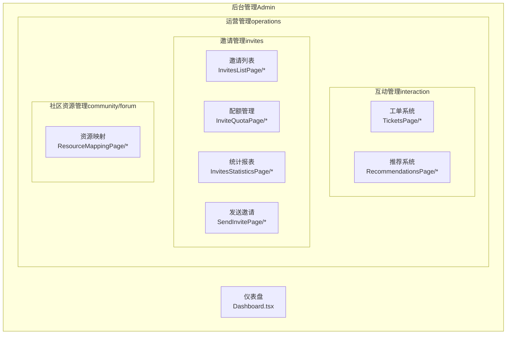
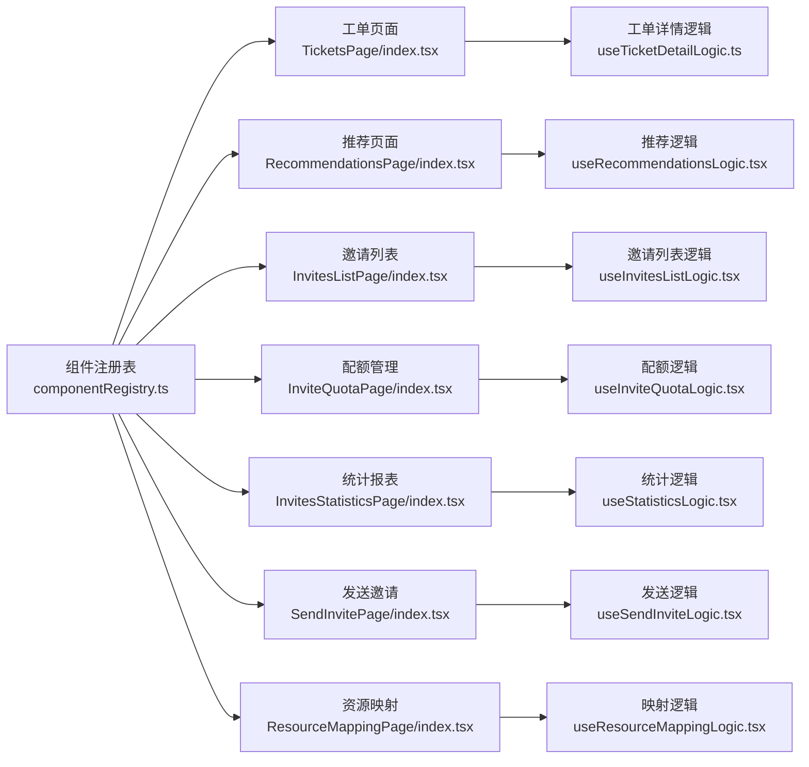
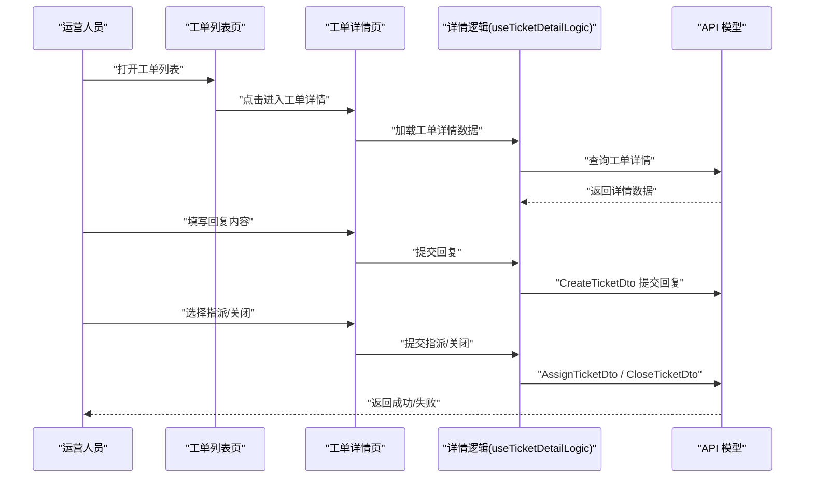
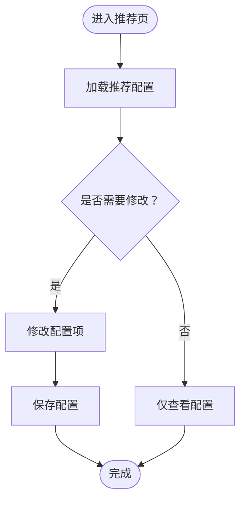
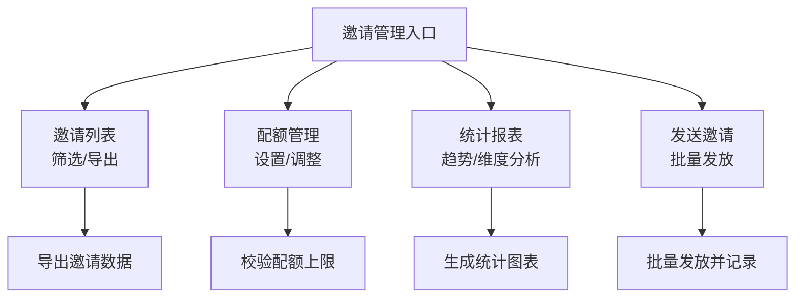
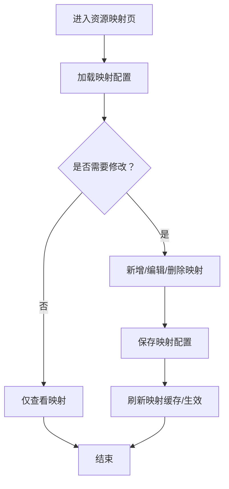
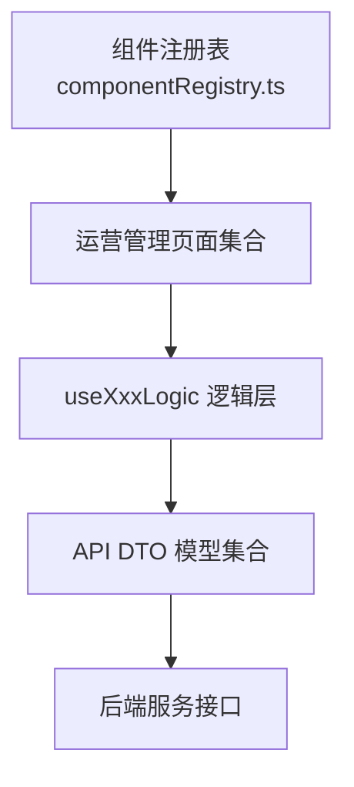

# 运营管理

<cite>
**本文引用的文件**
- [README.md](file://README.md)
- [componentRegistry.ts](file://src/routes/componentRegistry.ts)
- [db-routes-result.txt](file://scripts/db-routes-result.txt)
- [Dashboard.tsx](file://src/modules/admin/pages/Dashboard.tsx)
- [RecommendationsPage/index.tsx](file://src/modules/admin/pages/operations/interaction/RecommendationsPage/index.tsx)
- [RecommendationsPage/useRecommendationsLogic.tsx](file://src/modules/admin/pages/operations/interaction/RecommendationsPage/useRecommendationsLogic.tsx)
- [TicketDetailPage/index.tsx](file://src/modules/admin/pages/operations/interaction/TicketDetailPage/index.tsx)
- [TicketDetailPage/hooks/useTicketDetailLogic.ts](file://src/modules/admin/pages/operations/interaction/TicketDetailPage/hooks/useTicketDetailLogic.ts)
- [TicketsPage/index.tsx](file://src/modules/admin/pages/operations/interaction/TicketsPage/index.tsx)
- [TicketsPage/useTicketsLogic.tsx](file://src/modules/admin/pages/operations/interaction/TicketsPage/useTicketsLogic.tsx)
- [InvitesListPage/index.tsx](file://src/modules/admin/pages/operations/invites/InvitesListPage/index.tsx)
- [InvitesListPage/useInvitesListLogic.tsx](file://src/modules/admin/pages/operations/invites/InvitesListPage/useInvitesListLogic.tsx)
- [InviteQuotaPage/index.tsx](file://src/modules/admin/pages/operations/invites/InviteQuotaPage/index.tsx)
- [InviteQuotaPage/useInviteQuotaLogic.tsx](file://src/modules/admin/pages/operations/invites/InviteQuotaPage/useInviteQuotaLogic.tsx)
- [InvitesStatisticsPage/index.tsx](file://src/modules/admin/pages/operations/invites/InvitesStatisticsPage/index.tsx)
- [InvitesStatisticsPage/useStatisticsLogic.tsx](file://src/modules/admin/pages/operations/invites/InvitesStatisticsPage/useStatisticsLogic.tsx)
- [SendInvitePage/index.tsx](file://src/modules/admin/pages/operations/invites/SendInvitePage/index.tsx)
- [SendInvitePage/useSendInviteLogic.tsx](file://src/modules/admin/pages/operations/invites/SendInvitePage/useSendInviteLogic.tsx)
- [ResourceMappingPage/index.tsx](file://src/modules/admin/pages/community/forum/ResourceMappingPage/index.tsx)
- [ResourceMappingPage/useResourceMappingLogic.tsx](file://src/modules/admin/pages/community/forum/ResourceMappingPage/useResourceMappingLogic.tsx)
- [ForumTopic.ts](file://src/api/models/ForumTopic.ts)
- [CreateTicketDto.ts](file://src/api/models/CreateTicketDto.ts)
- [CloseTicketDto.ts](file://src/api/models/CloseTicketDto.ts)
- [AssignTicketDto.ts](file://src/api/models/AssignTicketDto.ts)
- [CreateRecommendationConfigDto.ts](file://src/api/models/CreateRecommendationConfigDto.ts)
- [UpdateRecommendationConfigDto.ts](file://src/api/models/UpdateRecommendationConfigDto.ts)
- [ListInvitesDto.ts](file://src/api/models/ListInvitesDto.ts)
- [ListInviteQuotaDto.ts](file://src/api/models/ListInviteQuotaDto.ts)
- [ListInviteRecordsDto.ts](file://src/api/models/ListInviteRecordsDto.ts)
- [ListAnnouncementsDto.ts](file://src/api/models/ListAnnouncementsDto.ts)
- [ListUsersDto.ts](file://src/api/models/ListUsersDto.ts)
- [ListTorrentsDto.ts](file://src/api/models/ListTorrentsDto.ts)
- [ListPromotionsDto.ts](file://src/api/models/ListPromotionsDto.ts)
- [ListStickiesDto.ts](file://src/api/models/ListStickiesDto.ts)
- [ListSubscriptionsDto.ts](file://src/api/models/ListSubscriptionsDto.ts)
- [ListFeedsRequestDto.ts](file://src/api/models/ListFeedsRequestDto.ts)
- [ListBountyTopicsDto.ts](file://src/api/models/ListBountyTopicsDto.ts)
- [ListRequestsDto.ts](file://src/api/models/ListRequestsDto.ts)
- [ListLevelsDto.ts](file://src/api/models/ListLevelsDto.ts)
- [ListPermissionsDto.ts](file://src/api/models/ListPermissionsDto.ts)
- [ListRolesDto.ts](file://src/api/models/ListRolesDto.ts)
- [ListCategoriesDto.ts](file://src/api/models/ListCategoriesDto.ts)
- [ListEpisodesDto.ts](file://src/api/models/ListEpisodesDto.ts)
- [ListMoviesDto.ts](file://src/api/models/ListMoviesDto.ts)
- [ListSeriesDto.ts](file://src/api/models/ListSeriesDto.ts)
- [ListPlaylistsDto.ts](file://src/api/models/ListPlaylistsDto.ts)
- [ListTorrentCommentsDto.ts](file://src/api/models/ListTorrentCommentsDto.ts)
- [ListUserThanksDto.ts](file://src/api/models/ListUserThanksDto.ts)
- [ListBookmarksDto.ts](file://src/api/models/ListBookmarksDto.ts)
- [ListFavoritesDto.ts](file://src/api/models/ListFavoritesDto.ts)
- [ListInboxDto.ts](file://src/api/models/ListInboxDto.ts)
- [ListOutboxDto.ts](file://src/api/models/ListOutboxDto.ts)
- [ListMessagesDto.ts](file://src/api/models/ListMessagesDto.ts)
- [ListStoreItemsDto.ts](file://src/api/models/ListStoreItemsDto.ts)
- [ListStoreOrdersDto.ts](file://src/api/models/ListStoreOrdersDto.ts)
- [ListSubtitlesDto.ts](file://src/api/models/ListSubtitlesDto.ts)
- [ListSubscriptionsDto.ts](file://src/api/models/ListSubscriptionsDto.ts)
- [ListFeedsRequestDto.ts](file://src/api/models/ListFeedsRequestDto.ts)
- [ListPendingCoversDto.ts](file://src/api/models/ListPendingCoversDto.ts)
- [ListPendingEpisodesDto.ts](file://src/api/models/ListPendingEpisodesDto.ts)
- [ListPendingPlaylistsDto.ts](file://src/api/models/ListPendingPlaylistsDto.ts)
- [ListPendingSeriesDto.ts](file://src/api/models/ListPendingSeriesDto.ts)
- [ListPendingTorrentsDto.ts](file://src/api/models/ListPendingTorrentsDto.ts)
- [ListRejectedCoversDto.ts](file://src/api/models/ListRejectedCoversDto.ts)
- [ListRejectedEpisodesDto.ts](file://src/api/models/ListRejectedEpisodesDto.ts)
- [ListRejectedPlaylistsDto.ts](file://src/api/models/ListRejectedPlaylistsDto.ts)
- [ListRejectedSeriesDto.ts](file://src/api/models/ListRejectedSeriesDto.ts)
- [ListRejectedTorrentsDto.ts](file://src/api/models/ListRejectedTorrentsDto.ts)
- [ListApprovedCoversDto.ts](file://src/api/models/ListApprovedCoversDto.ts)
- [ListApprovedEpisodesDto.ts](file://src/api/models/ListApprovedEpisodesDto.ts)
- [ListApprovedPlaylistsDto.ts](file://src/api/models/ListApprovedPlaylistsDto.ts)
- [ListApprovedSeriesDto.ts](file://src/api/models/ListApprovedSeriesDto.ts)
- [ListApprovedTorrentsDto.ts](file://src/api/models/ListApprovedTorrentsDto.ts)
- [ListTorrentPromotionsDto.ts](file://src/api/models/ListTorrentPromotionsDto.ts)
- [ListTorrentStickiesDto.ts](file://src/api/models/ListTorrentStickiesDto.ts)
- [ListTorrentThanksDto.ts](file://src/api/models/ListTorrentThanksDto.ts)
- [ListUserTorrentsDto.ts](file://src/api/models/ListUserTorrentsDto.ts)
- [ListUserThanksDto.ts](file://src/api/models/ListUserThanksDto.ts)
- [ListUserTorrentsDto.ts](file://src/api/models/ListUserTorrentsDto.ts)
- [ListUserTorrentsDto.ts](file://src/api/models/ListUserTorrentsDto.ts)
- [ListUserTorrentsDto.ts](file://src/api/models/ListUserTorrentsDto.ts)
- [ListUserTorrentsDto.ts](file://src/api/models/ListUserTorrentsDto.ts)
- [ListUserTorrentsDto.ts](file://src/api/models/ListUserTorrentsDto.ts)
- [ListUserTorrentsDto.ts](file://src/api/models/ListUserTorrentsDto.ts)
- [ListUserTorrentsDto.ts](file://src/api/models/ListUserTorrentsDto.ts)
- [ListUserTorrentsDto.ts](file://src/api/models/ListUserTorrentsDto.ts)
- [ListUserTorrentsDto.ts](file://src/api/models/ListUserTorrentsDto.ts)
- [ListUserTorrentsDto.ts](file://src/api/models/ListUserTorrentsDto.ts)
- [ListUserTorrentsDto.ts](file://src/api/models/ListUserTorrentsDto.ts)
- [ListUserTorrentsDto.ts](file://src/api/models/ListUserTorrentsDto.ts)
- [ListUserTorrentsDto.ts](file://src/api/models/ListUserTorrentsDto.ts)
- [ListUserTorrentsDto.ts](file://src/api/models/ListUserTorrentsDto.ts)
- [ListUserTorrentsDto.ts](file://src/api/models/ListUserTorrentsDto.ts)
- [ListUserTorrentsDto.ts](file://src/api/models/ListUserTorrentsDto.ts)
- [ListUserTorrentsDto.ts](file://src/api/models/ListUserTorrentsDto.ts)
- [ListUserTorrentsDto.ts](file://src/api/models/ListUserTorrentsDto.ts)
- [ListUserTorrentsDto.ts](file://src/api/models/ListUserTorrentsDto.ts)
- [ListUserTorrentsDto.ts](file://src/api/models/ListUserTorrentsDto.ts)
- [ListUserTorrentsDto.ts](file://src/api/models/ListUserTorrentsDto.ts)
- [ListUserTorrentsDto.ts](file://src/api/models/ListUserTorrentsDto.ts)
- [ListUserTorrentsDto.ts](file://src/api/models/ListUserTorrentsDto.ts)
- [ListUserTorrentsDto.ts](file://src/api/models/ListUserTorrentsDto......)
</cite>

## 目录
1. [简介](#简介)
2. [项目结构](#项目结构)
3. [核心组件](#核心组件)
4. [架构总览](#架构总览)
5. [详细组件分析](#详细组件分析)
6. [依赖关系分析](#依赖关系分析)
7. [性能考虑](#性能考虑)
8. [故障排查指南](#故障排查指南)
9. [结论](#结论)
10. [附录](#附录)

## 简介
本文件面向运营管理场景，系统化梳理后台“运营管理”模块的功能边界与实现要点，覆盖以下主题：
- 互动管理：工单系统（列表、详情、回复、指派、关闭）与推荐系统配置（配置创建/更新、展示页逻辑）
- 邀请管理：邀请列表、配额管理、统计报表、批量发送邀请
- 社区资源管理：论坛资源映射（分类/标签/内容的映射关系维护）
- 数据分析与业务指标：仪表盘概览、运营数据可视化入口
- 最佳实践与效率提升：自动化脚本、路由与权限同步、统一模型与查询参数

该文档以仓库现有代码为依据，结合路由注册与页面组件，给出可操作的架构视图、流程图与时序图，帮助运营与开发协同高效推进。

## 项目结构
后台运营管理位于 admin 模块，采用按功能域划分的目录组织方式：
- 仪表盘：全局概览卡片
- 运营管理（operations）：
  - 互动管理（interaction）：工单系统、推荐系统
  - 邀请管理（invites）：邀请列表、配额、统计、发送
  - 社区资源管理（community/forum）：资源映射
- 其他系统域：经济系统、内容系统、用户与安全等（不在本次目标范围内）

图表来源
- [Dashboard.tsx](file://src/modules/admin/pages/Dashboard.tsx#L1-L56)
- [TicketsPage/index.tsx](file://src/modules/admin/pages/operations/interaction/TicketsPage/index.tsx)
- [RecommendationsPage/index.tsx](file://src/modules/admin/pages/operations/interaction/RecommendationsPage/index.tsx)
- [InvitesListPage/index.tsx](file://src/modules/admin/pages/operations/invites/InvitesListPage/index.tsx)
- [InviteQuotaPage/index.tsx](file://src/modules/admin/pages/operations/invites/InviteQuotaPage/index.tsx)
- [InvitesStatisticsPage/index.tsx](file://src/modules/admin/pages/operations/invites/InvitesStatisticsPage/index.tsx)
- [SendInvitePage/index.tsx](file://src/modules/admin/pages/operations/invites/SendInvitePage/index.tsx)
- [ResourceMappingPage/index.tsx](file://src/modules/admin/pages/community/forum/ResourceMappingPage/index.tsx)

章节来源
- [README.md](file://README.md#L1-L11)
- [componentRegistry.ts](file://src/routes/componentRegistry.ts#L196-L211)
- [db-routes-result.txt](file://scripts/db-routes-result.txt#L132-L145)

## 核心组件
- 仪表盘概览：提供在线人数、日访问量、待处理任务等关键指标卡片，便于快速掌握运营态势。
- 工单系统：支持列表检索、详情查看、回复、指派、关闭等全生命周期管理。
- 推荐系统：支持推荐配置的创建与更新，以及推荐位展示页的逻辑封装。
- 邀请管理：涵盖邀请列表、配额管理、统计报表与批量发送邀请。
- 社区资源映射：围绕论坛资源（话题、分类、标签、内容）建立映射关系，支撑内容治理与审核。

章节来源
- [Dashboard.tsx](file://src/modules/admin/pages/Dashboard.tsx#L1-L56)
- [TicketsPage/index.tsx](file://src/modules/admin/pages/operations/interaction/TicketsPage/index.tsx)
- [RecommendationsPage/index.tsx](file://src/modules/admin/pages/operations/interaction/RecommendationsPage/index.tsx)
- [InvitesListPage/index.tsx](file://src/modules/admin/pages/operations/invites/InvitesListPage/index.tsx)
- [InviteQuotaPage/index.tsx](file://src/modules/admin/pages/operations/invites/InviteQuotaPage/index.tsx)
- [InvitesStatisticsPage/index.tsx](file://src/modules/admin/pages/operations/invites/InvitesStatisticsPage/index.tsx)
- [SendInvitePage/index.tsx](file://src/modules/admin/pages/operations/invites/SendInvitePage/index.tsx)
- [ResourceMappingPage/index.tsx](file://src/modules/admin/pages/community/forum/ResourceMappingPage/index.tsx)

## 架构总览
后台运营管理通过路由注册与页面组件解耦，形成清晰的职责边界：
- 路由层：在组件注册表中声明各运营页面的懒加载路径与父级关系
- 页面层：每个功能域页面封装自身逻辑（如 useXxxLogic），并与 API 模型交互
- 数据层：通过统一的 DTO 列表/查询参数模型支撑筛选、分页与排序

图表来源
- [componentRegistry.ts](file://src/routes/componentRegistry.ts#L196-L211)
- [TicketsPage/index.tsx](file://src/modules/admin/pages/operations/interaction/TicketsPage/index.tsx)
- [TicketDetailPage/hooks/useTicketDetailLogic.ts](file://src/modules/admin/pages/operations/interaction/TicketDetailPage/hooks/useTicketDetailLogic.ts)
- [RecommendationsPage/useRecommendationsLogic.tsx](file://src/modules/admin/pages/operations/interaction/RecommendationsPage/useRecommendationsLogic.tsx)
- [InvitesListPage/useInvitesListLogic.tsx](file://src/modules/admin/pages/operations/invites/InvitesListPage/useInvitesListLogic.tsx)
- [InviteQuotaPage/useInviteQuotaLogic.tsx](file://src/modules/admin/pages/operations/invites/InviteQuotaPage/useInviteQuotaLogic.tsx)
- [InvitesStatisticsPage/useStatisticsLogic.tsx](file://src/modules/admin/pages/operations/invites/InvitesStatisticsPage/useStatisticsLogic.tsx)
- [SendInvitePage/useSendInviteLogic.tsx](file://src/modules/admin/pages/operations/invites/SendInvitePage/useSendInviteLogic.tsx)
- [ResourceMappingPage/useResourceMappingLogic.tsx](file://src/modules/admin/pages/community/forum/ResourceMappingPage/useResourceMappingLogic.tsx)

## 详细组件分析

### 工单系统（Tickets）
- 功能范围：列表、详情、回复、指派、关闭
- 关键流程：从列表进入详情，查看历史回复与工单信息；在详情页进行回复、指派与关闭操作
- 数据模型：使用 CreateTicketDto、CloseTicketDto、AssignTicketDto 等 DTO 完成提交与变更

图表来源
- [TicketsPage/index.tsx](file://src/modules/admin/pages/operations/interaction/TicketsPage/index.tsx)
- [TicketDetailPage/index.tsx](file://src/modules/admin/pages/operations/interaction/TicketDetailPage/index.tsx)
- [TicketDetailPage/hooks/useTicketDetailLogic.ts](file://src/modules/admin/pages/operations/interaction/TicketDetailPage/hooks/useTicketDetailLogic.ts)
- [CreateTicketDto.ts](file://src/api/models/CreateTicketDto.ts)
- [CloseTicketDto.ts](file://src/api/models/CloseTicketDto.ts)
- [AssignTicketDto.ts](file://src/api/models/AssignTicketDto.ts)

章节来源
- [TicketsPage/index.tsx](file://src/modules/admin/pages/operations/interaction/TicketsPage/index.tsx)
- [TicketsPage/useTicketsLogic.tsx](file://src/modules/admin/pages/operations/interaction/TicketsPage/useTicketsLogic.tsx)
- [TicketDetailPage/index.tsx](file://src/modules/admin/pages/operations/interaction/TicketDetailPage/index.tsx)
- [TicketDetailPage/hooks/useTicketDetailLogic.ts](file://src/modules/admin/pages/operations/interaction/TicketDetailPage/hooks/useTicketDetailLogic.ts)
- [CreateTicketDto.ts](file://src/api/models/CreateTicketDto.ts)
- [CloseTicketDto.ts](file://src/api/models/CloseTicketDto.ts)
- [AssignTicketDto.ts](file://src/api/models/AssignTicketDto.ts)

### 推荐系统配置（Recommendations）
- 功能范围：推荐配置的创建与更新，推荐位展示页的逻辑封装
- 关键流程：进入推荐页，读取/编辑推荐配置，保存后生效
- 数据模型：CreateRecommendationConfigDto、UpdateRecommendationConfigDto

图表来源
- [RecommendationsPage/index.tsx](file://src/modules/admin/pages/operations/interaction/RecommendationsPage/index.tsx)
- [RecommendationsPage/useRecommendationsLogic.tsx](file://src/modules/admin/pages/operations/interaction/RecommendationsPage/useRecommendationsLogic.tsx)
- [CreateRecommendationConfigDto.ts](file://src/api/models/CreateRecommendationConfigDto.ts)
- [UpdateRecommendationConfigDto.ts](file://src/api/models/UpdateRecommendationConfigDto.ts)

章节来源
- [RecommendationsPage/index.tsx](file://src/modules/admin/pages/operations/interaction/RecommendationsPage/index.tsx)
- [RecommendationsPage/useRecommendationsLogic.tsx](file://src/modules/admin/pages/operations/interaction/RecommendationsPage/useRecommendationsLogic.tsx)
- [CreateRecommendationConfigDto.ts](file://src/api/models/CreateRecommendationConfigDto.ts)
- [UpdateRecommendationConfigDto.ts](file://src/api/models/UpdateRecommendationConfigDto.ts)

### 邀请管理（Invites）
- 功能范围：邀请列表、配额管理、统计报表、批量发送邀请
- 关键流程：在邀请列表中筛选与导出；在配额页设置/调整配额；在统计页查看趋势；在发送页批量发放
- 数据模型：ListInvitesDto、ListInviteQuotaDto、ListInviteRecordsDto 等

图表来源
- [InvitesListPage/index.tsx](file://src/modules/admin/pages/operations/invites/InvitesListPage/index.tsx)
- [InvitesListPage/useInvitesListLogic.tsx](file://src/modules/admin/pages/operations/invites/InvitesListPage/useInvitesListLogic.tsx)
- [InviteQuotaPage/index.tsx](file://src/modules/admin/pages/operations/invites/InviteQuotaPage/index.tsx)
- [InviteQuotaPage/useInviteQuotaLogic.tsx](file://src/modules/admin/pages/operations/invites/InviteQuotaPage/useInviteQuotaLogic.tsx)
- [InvitesStatisticsPage/index.tsx](file://src/modules/admin/pages/operations/invites/InvitesStatisticsPage/index.tsx)
- [InvitesStatisticsPage/useStatisticsLogic.tsx](file://src/modules/admin/pages/operations/invites/InvitesStatisticsPage/useStatisticsLogic.tsx)
- [SendInvitePage/index.tsx](file://src/modules/admin/pages/operations/invites/SendInvitePage/index.tsx)
- [SendInvitePage/useSendInviteLogic.tsx](file://src/modules/admin/pages/operations/invites/SendInvitePage/useSendInviteLogic.tsx)
- [ListInvitesDto.ts](file://src/api/models/ListInvitesDto.ts)
- [ListInviteQuotaDto.ts](file://src/api/models/ListInviteQuotaDto.ts)
- [ListInviteRecordsDto.ts](file://src/api/models/ListInviteRecordsDto.ts)

章节来源
- [InvitesListPage/index.tsx](file://src/modules/admin/pages/operations/invites/InvitesListPage/index.tsx)
- [InvitesListPage/useInvitesListLogic.tsx](file://src/modules/admin/pages/operations/invites/InvitesListPage/useInvitesListLogic.tsx)
- [InviteQuotaPage/index.tsx](file://src/modules/admin/pages/operations/invites/InviteQuotaPage/index.tsx)
- [InviteQuotaPage/useInviteQuotaLogic.tsx](file://src/modules/admin/pages/operations/invites/InviteQuotaPage/useInviteQuotaLogic.tsx)
- [InvitesStatisticsPage/index.tsx](file://src/modules/admin/pages/operations/invites/InvitesStatisticsPage/index.tsx)
- [InvitesStatisticsPage/useStatisticsLogic.tsx](file://src/modules/admin/pages/operations/invites/InvitesStatisticsPage/useStatisticsLogic.tsx)
- [SendInvitePage/index.tsx](file://src/modules/admin/pages/operations/invites/SendInvitePage/index.tsx)
- [SendInvitePage/useSendInviteLogic.tsx](file://src/modules/admin/pages/operations/invites/SendInvitePage/useSendInviteLogic.tsx)
- [ListInvitesDto.ts](file://src/api/models/ListInvitesDto.ts)
- [ListInviteQuotaDto.ts](file://src/api/models/ListInviteQuotaDto.ts)
- [ListInviteRecordsDto.ts](file://src/api/models/ListInviteRecordsDto.ts)

### 社区资源管理（Resource Mapping）
- 功能范围：维护论坛资源（话题、分类、标签、内容）之间的映射关系，支撑内容审核与治理
- 关键流程：进入资源映射页，读取映射配置，进行新增/编辑/删除与保存
- 数据模型：涉及 ForumTopic、ForumCategory、ForumTag 等模型（用于映射与审核）

图表来源
- [ResourceMappingPage/index.tsx](file://src/modules/admin/pages/community/forum/ResourceMappingPage/index.tsx)
- [ResourceMappingPage/useResourceMappingLogic.tsx](file://src/modules/admin/pages/community/forum/ResourceMappingPage/useResourceMappingLogic.tsx)
- [ForumTopic.ts](file://src/api/models/ForumTopic.ts)

章节来源
- [ResourceMappingPage/index.tsx](file://src/modules/admin/pages/community/forum/ResourceMappingPage/index.tsx)
- [ResourceMappingPage/useResourceMappingLogic.tsx](file://src/modules/admin/pages/community/forum/ResourceMappingPage/useResourceMappingLogic.tsx)
- [ForumTopic.ts](file://src/api/models/ForumTopic.ts)

## 依赖关系分析
- 路由与页面：componentRegistry.ts 声明了运营相关页面的懒加载与父级关系，db-routes-result.txt 显示了数据库侧的路由元数据
- 页面与逻辑：各页面均配套 useXxxLogic 文件，封装查询、筛选、提交等业务逻辑
- 数据模型：统一使用 src/api/models 下的 DTO，确保请求/响应格式一致

图表来源
- [componentRegistry.ts](file://src/routes/componentRegistry.ts#L196-L211)
- [db-routes-result.txt](file://scripts/db-routes-result.txt#L132-L145)

章节来源
- [componentRegistry.ts](file://src/routes/componentRegistry.ts#L196-L211)
- [db-routes-result.txt](file://scripts/db-routes-result.txt#L132-L145)

## 性能考虑
- 列表查询优化：建议在查询参数中加入分页、排序与过滤字段，避免一次性拉取大量数据
- 缓存策略：对静态配置（如推荐配置、邀请配额）启用本地缓存，减少重复请求
- 批量操作：批量发送邀请、批量调整配额时，应采用分批提交与进度反馈，避免阻塞 UI
- 图表渲染：统计报表中的图表应按需渲染，避免在切换标签页时重复计算

## 故障排查指南
- 路由异常：若导航缺失或页面无法加载，检查 componentRegistry.ts 中的路由注册与父级关系，参考 db-routes-result.txt 的数据库路由元数据核对
- 数据不一致：当推荐配置或邀请配额未生效时，确认 useXxxLogic 是否正确调用对应 DTO 并处理返回结果
- 权限问题：若页面不可见，请检查权限同步脚本与路由权限绑定情况
- 自动化脚本：可参考 scripts 目录下的路由导入与修复脚本，确保后台导航树正确

章节来源
- [componentRegistry.ts](file://src/routes/componentRegistry.ts#L196-L211)
- [db-routes-result.txt](file://scripts/db-routes-result.txt#L132-L145)

## 结论
运营管理模块以“功能域+页面+逻辑+模型”的分层设计实现了清晰的职责划分。通过统一的 DTO 与路由注册机制，既能满足运营高频操作（工单、邀请、推荐、资源映射），又能保证前后端协作的一致性与可维护性。建议在后续迭代中进一步完善自动化脚本与数据埋点，持续优化运营效率与用户体验。

## 附录
- 运营仪表盘：提供关键指标卡片，便于快速掌握运营态势
- 统一查询参数：建议在各列表页复用 ListUsersDto、ListTorrentsDto、ListCategoriesDto 等通用模型，保持查询体验一致

章节来源
- [Dashboard.tsx](file://src/modules/admin/pages/Dashboard.tsx#L1-L56)
- [ListUsersDto.ts](file://src/api/models/ListUsersDto.ts)
- [ListTorrentsDto.ts](file://src/api/models/ListTorrentsDto.ts)
- [ListCategoriesDto.ts](file://src/api/models/ListCategoriesDto.ts)