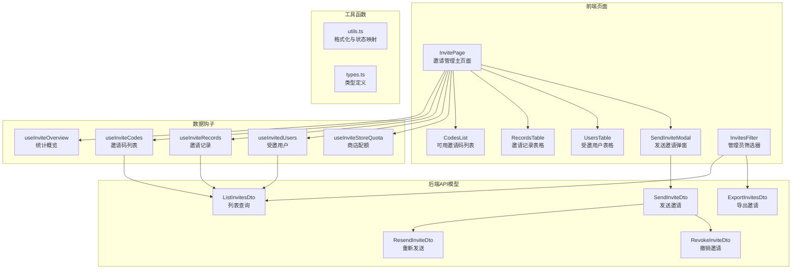
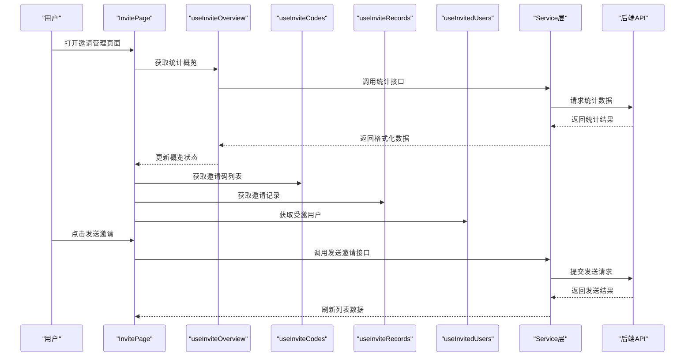
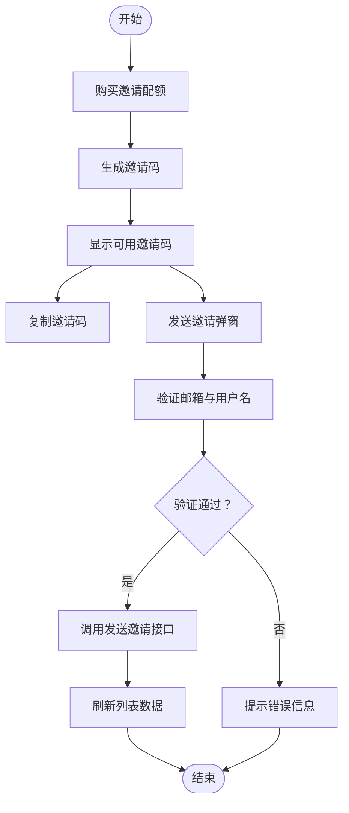
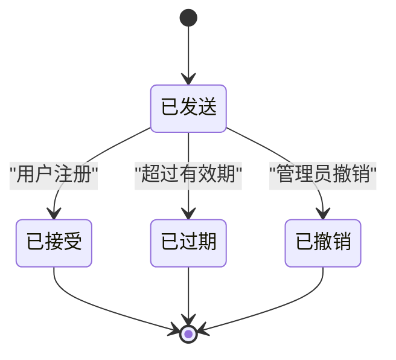
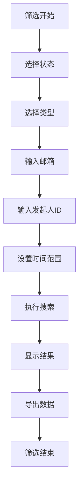
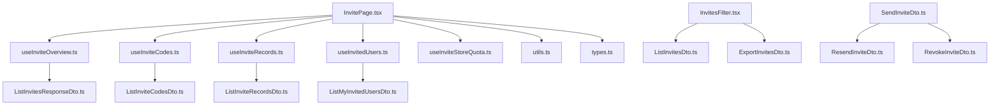

# 邀请列表管理

<cite>
**本文引用的文件**
- [InvitePage.tsx](file://src/modules/app/pages/Invite/InvitePage.tsx)
- [types.ts](file://src/modules/app/pages/Invite/types.ts)
- [utils.ts](file://src/modules/app/pages/Invite/utils.ts)
- [useInviteOverview.ts](file://src/modules/app/pages/Invite/hooks/useInviteOverview.ts)
- [useInviteCodes.ts](file://src/modules/app/pages/Invite/hooks/useInviteCodes.ts)
- [useInviteRecords.ts](file://src/modules/app/pages/Invite/hooks/useInviteRecords.ts)
- [useInvitedUsers.ts](file://src/modules/app/pages/Invite/hooks/useInvitedUsers.ts)
- [useInviteStoreQuota.ts](file://src/modules/app/pages/Invite/hooks/useInviteStoreQuota.ts)
- [InvitesFilter.tsx](file://src/modules/admin/pages/operations/invites/InvitesListPage/components/InvitesFilter.tsx)
- [constants.ts](file://src/modules/admin/pages/operations/invites/InvitesListPage/constants.ts)
- [types.ts](file://src/modules/admin/pages/operations/invites/InvitesListPage/types.ts)
- [ListInvitesDto.ts](file://src/api/models/ListInvitesDto.ts)
- [ListInvitesResponseDto.ts](file://src/api/models/ListInvitesResponseDto.ts)
- [SendInviteDto.ts](file://src/api/models/SendInviteDto.ts)
- [ResendInviteDto.ts](file://src/api/models/ResendInviteDto.ts)
- [RevokeInviteDto.ts](file://src/api/models/RevokeInviteDto.ts)
- [RevokeInviteResponseDto.ts](file://src/api/models/RevokeInviteResponseDto.ts)
- [VipMonthlyInvitesResponseDto.ts](file://src/api/models/VipMonthlyInvitesResponseDto.ts)
- [InviteStatusDto.ts](file://src/api/models/InviteStatusDto.ts)
- [ListInviteCodesDto.ts](file://src/api/models/ListInviteCodesDto.ts)
- [ListInviteCodesResponseDto.ts](file://src/api/models/ListInviteCodesResponseDto.ts)
- [ListInviteQuotaDto.ts](file://src/api/models/ListInviteQuotaDto.ts)
- [ListInviteQuotaResponseDto.ts](file://src/api/models/ListInviteQuotaResponseDto.ts)
- [ListInviteRecordsDto.ts](file://src/api/models/ListInviteRecordsDto.ts)
- [ListInviteRecordsResponseDto.ts](file://src/api/models/ListInviteRecordsResponseDto.ts)
- [ListMyInvitedUsersDto.ts](file://src/api/models/ListMyInvitedUsersDto.ts)
- [ListMyInvitedUsersResponseDto.ts](file://src/api/models/ListMyInvitedUsersResponseDto.ts)
- [OverviewInvitesDto.ts](file://src/api/models/OverviewInvitesDto.ts)
- [OverviewInvitesResponseDto.ts](file://src/api/models/OverviewInvitesResponseDto.ts)
- [ExportInvitesDto.ts](file://src/api/models/ExportInvitesDto.ts)
- [ExportInvitesResponseDto.ts](file://src/api/models/ExportInvitesResponseDto.ts)
</cite>

## 目录
1. [简介](#简介)
2. [项目结构](#项目结构)
3. [核心组件](#核心组件)
4. [架构概览](#架构概览)
5. [详细组件分析](#详细组件分析)
6. [依赖关系分析](#依赖关系分析)
7. [性能考虑](#性能考虑)
8. [故障排除指南](#故障排除指南)
9. [结论](#结论)
10. [附录](#附录)

## 简介
本文件详细介绍了邀请列表管理功能，涵盖邀请码的生成、分发与使用追踪机制，邀请列表的数据展示、搜索过滤与排序功能，邀请状态管理、过期处理与失效验证，以及邀请详情查看、批量操作与导出功能。文档还提供了邀请管理的工作流程、异常处理策略与数据安全措施，帮助开发者与运营人员更好地理解和维护该功能模块。

## 项目结构
邀请列表管理功能主要由前端页面组件、数据钩子、工具函数以及后端API模型构成。前端采用React Hooks模式进行数据获取与状态管理，后端通过OpenAPI模型定义请求与响应格式。

**图表来源**
- [InvitePage.tsx](file://src/modules/app/pages/Invite/InvitePage.tsx#L23-L252)
- [useInviteOverview.ts](file://src/modules/app/pages/Invite/hooks/useInviteOverview.ts#L14-L56)
- [useInviteCodes.ts](file://src/modules/app/pages/Invite/hooks/useInviteCodes.ts#L6-L44)
- [useInviteRecords.ts](file://src/modules/app/pages/Invite/hooks/useInviteRecords.ts#L6-L41)
- [useInvitedUsers.ts](file://src/modules/app/pages/Invite/hooks/useInvitedUsers.ts#L6-L43)
- [useInviteStoreQuota.ts](file://src/modules/app/pages/Invite/hooks/useInviteStoreQuota.ts#L5-L34)
- [InvitesFilter.tsx](file://src/modules/admin/pages/operations/invites/InvitesListPage/components/InvitesFilter.tsx#L30-L123)
- [ListInvitesDto.ts](file://src/api/models/ListInvitesDto.ts#L5-L39)
- [SendInviteDto.ts](file://src/api/models/SendInviteDto.ts#L5-L17)
- [ResendInviteDto.ts](file://src/api/models/ResendInviteDto.ts#L5-L16)
- [RevokeInviteDto.ts](file://src/api/models/RevokeInviteDto.ts#L5-L13)
- [ExportInvitesDto.ts](file://src/api/models/ExportInvitesDto.ts)

**章节来源**
- [InvitePage.tsx](file://src/modules/app/pages/Invite/InvitePage.tsx#L23-L252)
- [InvitesFilter.tsx](file://src/modules/admin/pages/operations/invites/InvitesListPage/components/InvitesFilter.tsx#L30-L123)

## 核心组件
本节概述邀请列表管理的核心组件及其职责：
- 统计概览：提供总邀请数、已使用邀请数、剩余邀请数、受邀用户数与魔力值等信息。
- 邀请码列表：展示可用邀请码，支持复制、显示/隐藏与发送邀请。
- 邀请记录：展示已发送的邀请记录，包括状态、发送时间、注册时间与过期时间。
- 受邀用户：展示受邀用户的统计数据，包括上传量、下载量、分享率与状态。
- 发送邀请弹窗：用于向指定邮箱发送邀请码，并可选择预生成的邀请码ID。
- 管理员筛选器：支持按状态、类型、邮箱、发起人ID与时间范围筛选，并提供导出功能。

**章节来源**
- [useInviteOverview.ts](file://src/modules/app/pages/Invite/hooks/useInviteOverview.ts#L14-L56)
- [useInviteCodes.ts](file://src/modules/app/pages/Invite/hooks/useInviteCodes.ts#L6-L44)
- [useInviteRecords.ts](file://src/modules/app/pages/Invite/hooks/useInviteRecords.ts#L6-L41)
- [useInvitedUsers.ts](file://src/modules/app/pages/Invite/hooks/useInvitedUsers.ts#L6-L43)
- [InvitePage.tsx](file://src/modules/app/pages/Invite/InvitePage.tsx#L106-L181)
- [InvitesFilter.tsx](file://src/modules/admin/pages/operations/invites/InvitesListPage/components/InvitesFilter.tsx#L30-L123)

## 架构概览
邀请列表管理采用前后端分离架构，前端负责UI渲染与交互逻辑，后端提供REST API接口。前端通过Service层调用后端接口，使用React Hooks进行数据获取与状态管理，工具函数负责数据格式化与状态映射。

**图表来源**
- [InvitePage.tsx](file://src/modules/app/pages/Invite/InvitePage.tsx#L32-L86)
- [useInviteOverview.ts](file://src/modules/app/pages/Invite/hooks/useInviteOverview.ts#L25-L48)
- [useInviteCodes.ts](file://src/modules/app/pages/Invite/hooks/useInviteCodes.ts#L11-L36)
- [useInviteRecords.ts](file://src/modules/app/pages/Invite/hooks/useInviteRecords.ts#L11-L33)
- [useInvitedUsers.ts](file://src/modules/app/pages/Invite/hooks/useInvitedUsers.ts#L11-L34)
- [SendInviteDto.ts](file://src/api/models/SendInviteDto.ts#L5-L17)

## 详细组件分析

### 邀请码生成与分发
- 邀请码生成：用户可通过商店购买永久或临时邀请配额，购买成功后生成相应邀请码。
- 邀请码分发：用户可选择复制邀请码或直接通过发送邀请弹窗向指定邮箱发送邀请码。
- 邀请码状态：邀请码分为未使用、已使用、已过期三种状态，过期时间由系统配置决定。

**图表来源**
- [InvitePage.tsx](file://src/modules/app/pages/Invite/InvitePage.tsx#L123-L139)
- [InvitePage.tsx](file://src/modules/app/pages/Invite/InvitePage.tsx#L73-L86)
- [useInviteStoreQuota.ts](file://src/modules/app/pages/Invite/hooks/useInviteStoreQuota.ts#L10-L25)
- [SendInviteDto.ts](file://src/api/models/SendInviteDto.ts#L5-L17)

**章节来源**
- [InvitePage.tsx](file://src/modules/app/pages/Invite/InvitePage.tsx#L123-L139)
- [InvitePage.tsx](file://src/modules/app/pages/Invite/InvitePage.tsx#L73-L86)
- [useInviteStoreQuota.ts](file://src/modules/app/pages/Invite/hooks/useInviteStoreQuota.ts#L10-L25)
- [SendInviteDto.ts](file://src/api/models/SendInviteDto.ts#L5-L17)

### 邀请记录追踪与状态管理
- 邀请记录：展示已发送的邀请记录，包括接收者姓名、邮箱、状态、发送时间、注册时间与过期时间。
- 状态管理：邀请状态包括已发送、已接受、已过期、已撤销四种，系统根据时间与用户行为自动更新状态。
- 过期处理：当邀请超过有效期时，状态自动变为已过期；管理员可手动撤销邀请。

**图表来源**
- [types.ts](file://src/modules/admin/shared/invites/types.ts#L1-L33)
- [constants.ts](file://src/modules/admin/pages/operations/invites/InvitesListPage/constants.ts#L6-L29)

**章节来源**
- [useInviteRecords.ts](file://src/modules/app/pages/Invite/hooks/useInviteRecords.ts#L11-L33)
- [InvitesFilter.tsx](file://src/modules/admin/pages/operations/invites/InvitesListPage/components/InvitesFilter.tsx#L42-L61)
- [ListInvitesDto.ts](file://src/api/models/ListInvitesDto.ts#L18-L36)

### 数据展示、搜索过滤与排序
- 数据展示：使用表格组件展示邀请记录与受邀用户，支持分页与状态标识。
- 搜索过滤：管理员可按状态、类型、邮箱、发起人ID与时间范围进行筛选，并支持导出功能。
- 排序功能：支持按创建时间、过期时间与接受时间升序或降序排列。

**图表来源**
- [InvitesFilter.tsx](file://src/modules/admin/pages/operations/invites/InvitesListPage/components/InvitesFilter.tsx#L42-L61)
- [ListInvitesDto.ts](file://src/api/models/ListInvitesDto.ts#L28-L36)
- [constants.ts](file://src/modules/admin/pages/operations/invites/InvitesListPage/constants.ts#L24-L37)

**章节来源**
- [InvitesFilter.tsx](file://src/modules/admin/pages/operations/invites/InvitesListPage/components/InvitesFilter.tsx#L30-L123)
- [ListInvitesDto.ts](file://src/api/models/ListInvitesDto.ts#L5-L39)
- [constants.ts](file://src/modules/admin/pages/operations/invites/InvitesListPage/constants.ts#L1-L38)

### 邀请详情查看与批量操作
- 邀请详情：每条邀请记录包含详细信息，如发送时间、过期时间、状态与相关操作按钮。
- 批量操作：管理员可对多条邀请记录进行批量撤销或重新发送操作（具体实现以实际API为准）。
- 导出功能：支持将筛选后的邀请数据导出为文件，便于离线分析与存档。

**章节来源**
- [InvitesFilter.tsx](file://src/modules/admin/pages/operations/invites/InvitesListPage/components/InvitesFilter.tsx#L21-L25)
- [ExportInvitesDto.ts](file://src/api/models/ExportInvitesDto.ts)
- [ExportInvitesResponseDto.ts](file://src/api/models/ExportInvitesResponseDto.ts)

### 工作流程与异常处理
- 工作流程：用户购买邀请配额 → 生成邀请码 → 复制或发送邀请 → 系统更新状态 → 管理员筛选与导出。
- 异常处理：前端在请求失败时显示错误信息并允许重试；后端返回错误码与错误消息，前端根据状态码进行相应处理。
- 数据安全：发送邀请时需验证邮箱与用户名，避免重复发送；撤销邀请时可记录原因，确保操作可追溯。

**章节来源**
- [InvitePage.tsx](file://src/modules/app/pages/Invite/InvitePage.tsx#L73-L86)
- [ResendInviteDto.ts](file://src/api/models/ResendInviteDto.ts#L5-L16)
- [RevokeInviteDto.ts](file://src/api/models/RevokeInviteDto.ts#L5-L13)
- [RevokeInviteResponseDto.ts](file://src/api/models/RevokeInviteResponseDto.ts#L5-L9)

## 依赖关系分析
邀请列表管理功能涉及多个模块之间的协作，包括页面组件、数据钩子、工具函数与后端API模型。各模块之间通过清晰的接口进行通信，确保系统的可维护性与扩展性。

**图表来源**
- [InvitePage.tsx](file://src/modules/app/pages/Invite/InvitePage.tsx#L14-L21)
- [useInviteOverview.ts](file://src/modules/app/pages/Invite/hooks/useInviteOverview.ts#L29-L31)
- [useInviteCodes.ts](file://src/modules/app/pages/Invite/hooks/useInviteCodes.ts#L15-L19)
- [useInviteRecords.ts](file://src/modules/app/pages/Invite/hooks/useInviteRecords.ts#L15-L16)
- [useInvitedUsers.ts](file://src/modules/app/pages/Invite/hooks/useInvitedUsers.ts#L15-L16)
- [InvitesFilter.tsx](file://src/modules/admin/pages/operations/invites/InvitesListPage/components/InvitesFilter.tsx#L42-L51)
- [ListInvitesDto.ts](file://src/api/models/ListInvitesDto.ts#L5-L39)
- [SendInviteDto.ts](file://src/api/models/SendInviteDto.ts#L5-L17)
- [ResendInviteDto.ts](file://src/api/models/ResendInviteDto.ts#L5-L16)
- [RevokeInviteDto.ts](file://src/api/models/RevokeInviteDto.ts#L5-L13)
- [ExportInvitesDto.ts](file://src/api/models/ExportInvitesDto.ts)

**章节来源**
- [InvitePage.tsx](file://src/modules/app/pages/Invite/InvitePage.tsx#L14-L21)
- [InvitesFilter.tsx](file://src/modules/admin/pages/operations/invites/InvitesListPage/components/InvitesFilter.tsx#L42-L51)

## 性能考虑
- 分页加载：列表数据采用分页加载方式，减少单次请求的数据量，提升页面响应速度。
- 缓存策略：对于不频繁变化的数据（如商店配额），可采用本地缓存减少重复请求。
- 异步处理：使用异步请求与状态管理，避免阻塞UI线程，提升用户体验。
- 数据格式化：在前端进行必要的数据格式化与转换，减少后端负担。

## 故障排除指南
- 发送邀请失败：检查邮箱格式与用户名是否重复，确认邀请码ID是否存在且未过期。
- 列表数据为空：确认分页参数与筛选条件是否正确，检查网络连接与后端服务状态。
- 状态更新异常：检查系统时间是否正确，确认数据库中状态字段的更新逻辑。
- 导出功能异常：确认筛选条件是否过于严格导致无数据可导出，检查浏览器下载权限。

**章节来源**
- [InvitePage.tsx](file://src/modules/app/pages/Invite/InvitePage.tsx#L73-L86)
- [utils.ts](file://src/modules/app/pages/Invite/utils.ts#L15-L24)

## 结论
邀请列表管理功能通过清晰的前端组件与后端API模型实现了邀请码的生成、分发与追踪，提供了完善的搜索过滤、排序与导出能力。系统采用状态管理与异步处理机制，确保了良好的用户体验与数据安全性。建议在实际部署中结合业务需求进一步优化性能与扩展功能。

## 附录
- 类型定义：包含邀请码、邀请记录、受邀用户等核心数据结构。
- 工具函数：提供日期格式化、字节转换、状态映射与图标选择等辅助功能。
- API模型：定义了邀请列表查询、发送邀请、重新发送与撤销邀请等接口的请求与响应格式。

**章节来源**
- [types.ts](file://src/modules/app/pages/Invite/types.ts#L1-L33)
- [utils.ts](file://src/modules/app/pages/Invite/utils.ts#L1-L56)
- [ListInvitesDto.ts](file://src/api/models/ListInvitesDto.ts#L5-L39)
- [SendInviteDto.ts](file://src/api/models/SendInviteDto.ts#L5-L17)
- [ResendInviteDto.ts](file://src/api/models/ResendInviteDto.ts#L5-L16)
- [RevokeInviteDto.ts](file://src/api/models/RevokeInviteDto.ts#L5-L13)
- [ExportInvitesDto.ts](file://src/api/models/ExportInvitesDto.ts)