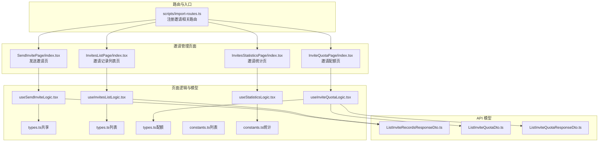
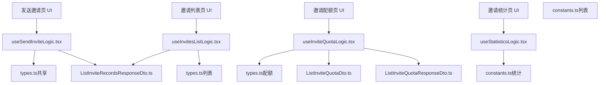
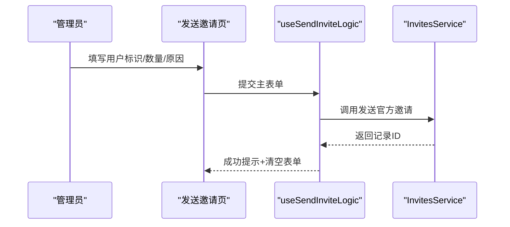
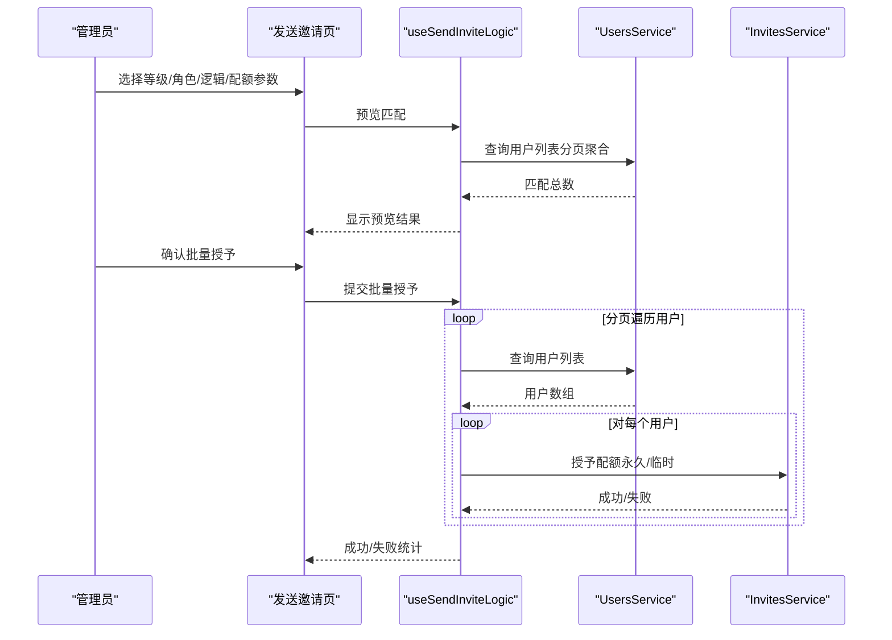
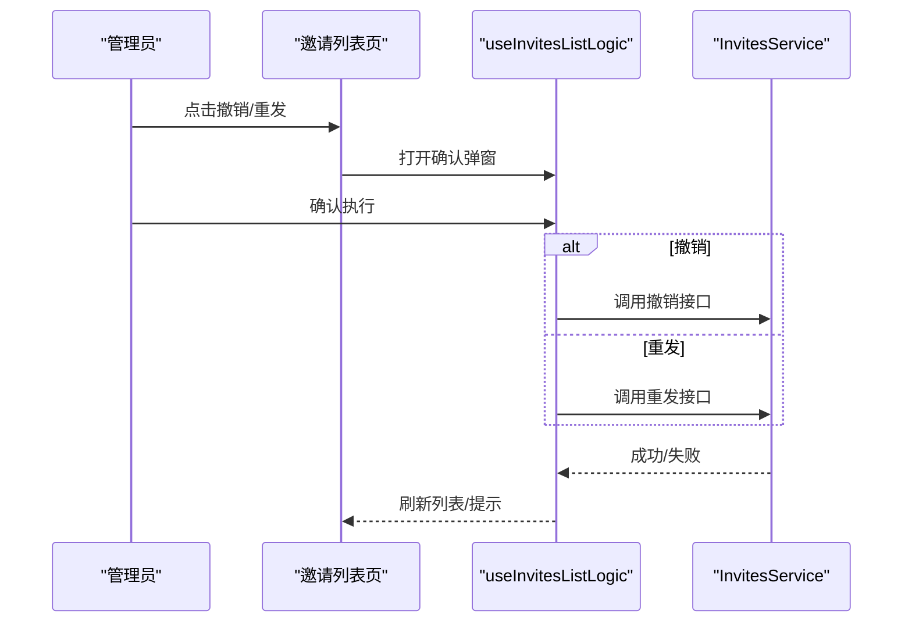
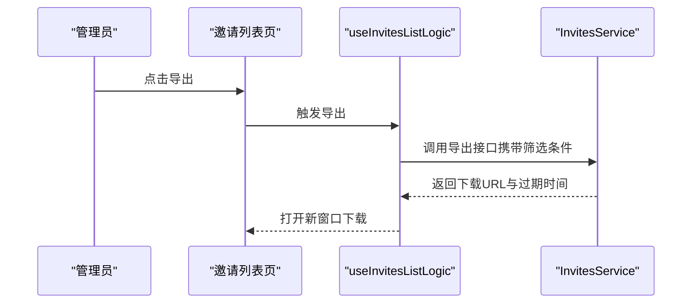
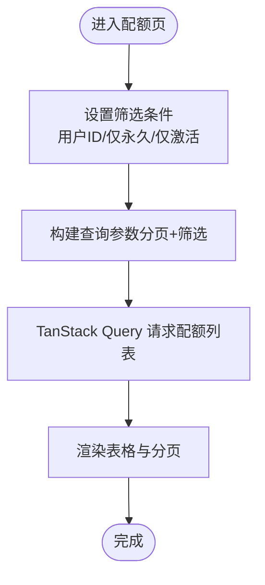
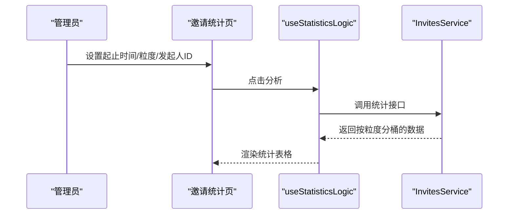
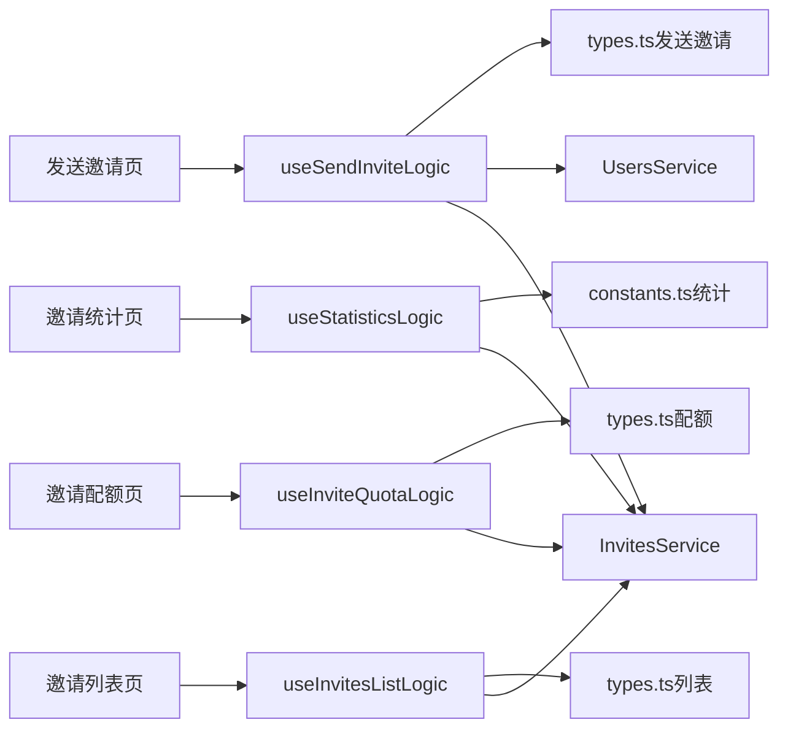

# 邀请管理

<cite>
**本文档引用的文件**
- [types.ts](file://src/modules/admin/shared/invites/types.ts)
- [index.tsx（发送邀请页）](file://src/modules/admin/pages/operations/invites/SendInvitePage/index.tsx)
- [useSendInviteLogic.tsx](file://src/modules/admin/pages/operations/invites/SendInvitePage/useSendInviteLogic.tsx)
- [index.tsx（邀请列表页）](file://src/modules/admin/pages/operations/invites/InvitesListPage/index.tsx)
- [useInvitesListLogic.tsx](file://src/modules/admin/pages/operations/invites/InvitesListPage/useInvitesListLogic.tsx)
- [constants.ts（邀请列表）](file://src/modules/admin/pages/operations/invites/InvitesListPage/constants.ts)
- [types.ts（邀请列表）](file://src/modules/admin/pages/operations/invites/InvitesListPage/types.ts)
- [index.tsx（邀请配额页）](file://src/modules/admin/pages/operations/invites/InviteQuotaPage/index.tsx)
- [useInviteQuotaLogic.tsx](file://src/modules/admin/pages/operations/invites/InviteQuotaPage/useInviteQuotaLogic.tsx)
- [types.ts（邀请配额）](file://src/modules/admin/pages/operations/invites/InviteQuotaPage/types.ts)
- [index.tsx（邀请统计页）](file://src/modules/admin/pages/operations/invites/InvitesStatisticsPage/index.tsx)
- [useStatisticsLogic.tsx](file://src/modules/admin/pages/operations/invites/InvitesStatisticsPage/useStatisticsLogic.tsx)
- [constants.ts（邀请统计）](file://src/modules/admin/pages/operations/invites/InvitesStatisticsPage/constants.ts)
- [ListInviteRecordsResponseDto.ts](file://src/api/models/ListInviteRecordsResponseDto.ts)
- [ListInviteQuotaDto.ts](file://src/api/models/ListInviteQuotaDto.ts)
- [ListInviteQuotaResponseDto.ts](file://src/api/models/ListInviteQuotaResponseDto.ts)
- [useInviteStoreQuota.ts](file://src/modules/app/pages/Invite/hooks/useInviteStoreQuota.ts)
- [import-routes.ts](file://scripts/import-routes.ts)
</cite>

## 目录
1. [简介](#简介)
2. [项目结构](#项目结构)
3. [核心组件](#核心组件)
4. [架构总览](#架构总览)
5. [详细组件分析](#详细组件分析)
6. [依赖关系分析](#依赖关系分析)
7. [性能考量](#性能考量)
8. [故障排查指南](#故障排查指南)
9. [结论](#结论)
10. [附录](#附录)

## 简介
本文件系统性梳理并说明邀请管理功能的实现与使用，覆盖以下方面：
- 邀请配额管理：永久/临时配额的查询、筛选与可视化
- 邀请码生成与分发：官方邀请发送、批量授予配额、重发与撤销
- 邀请记录追踪与统计：列表展示、导出、按时间粒度统计
- 配额规则与批量发放：基于等级/角色的批量匹配与发放
- 邀请有效性验证与状态流转：发送、接受、过期、撤销
- 自动化流程与安全机制：权限控制、批量处理、导出时效
- 最佳实践与营销策略：配额配置、活动设计、效果评估

## 项目结构
邀请管理功能由前端页面与逻辑模块组成，并通过 API 模型与服务进行数据交互。路由在脚本中注册，页面通过 TanStack Query 管理数据流。

**图表来源**
- [import-routes.ts](file://scripts/import-routes.ts#L214-L216)
- [import-routes.ts](file://scripts/import-routes.ts#L917-L956)
- [index.tsx（发送邀请页）](file://src/modules/admin/pages/operations/invites/SendInvitePage/index.tsx#L1-L149)
- [index.tsx（邀请列表页）](file://src/modules/admin/pages/operations/invites/InvitesListPage/index.tsx#L1-L93)
- [index.tsx（邀请配额页）](file://src/modules/admin/pages/operations/invites/InviteQuotaPage/index.tsx#L1-L56)
- [index.tsx（邀请统计页）](file://src/modules/admin/pages/operations/invites/InvitesStatisticsPage/index.tsx#L1-L125)
- [useSendInviteLogic.tsx](file://src/modules/admin/pages/operations/invites/SendInvitePage/useSendInviteLogic.tsx#L1-L248)
- [useInvitesListLogic.tsx](file://src/modules/admin/pages/operations/invites/InvitesListPage/useInvitesListLogic.tsx#L1-L276)
- [useInviteQuotaLogic.tsx](file://src/modules/admin/pages/operations/invites/InviteQuotaPage/useInviteQuotaLogic.tsx#L1-L120)
- [useStatisticsLogic.tsx](file://src/modules/admin/pages/operations/invites/InvitesStatisticsPage/useStatisticsLogic.tsx#L1-L69)
- [types.ts（共享）](file://src/modules/admin/shared/invites/types.ts#L1-L34)
- [types.ts（列表）](file://src/modules/admin/pages/operations/invites/InvitesListPage/types.ts#L1-L39)
- [types.ts（配额）](file://src/modules/admin/pages/operations/invites/InviteQuotaPage/types.ts#L1-L23)
- [constants.ts（列表）](file://src/modules/admin/pages/operations/invites/InvitesListPage/constants.ts#L1-L38)
- [constants.ts（统计）](file://src/modules/admin/pages/operations/invites/InvitesStatisticsPage/constants.ts#L1-L24)
- [ListInviteRecordsResponseDto.ts](file://src/api/models/ListInviteRecordsResponseDto.ts#L1-L12)
- [ListInviteQuotaDto.ts](file://src/api/models/ListInviteQuotaDto.ts#L1-L12)
- [ListInviteQuotaResponseDto.ts](file://src/api/models/ListInviteQuotaResponseDto.ts#L1-L11)

**章节来源**
- [import-routes.ts](file://scripts/import-routes.ts#L214-L216)
- [import-routes.ts](file://scripts/import-routes.ts#L917-L956)

## 核心组件
- 邀请记录模型与配额模型：定义邀请状态、类型、配额生命周期与统计行结构
- 发送邀请页：支持单个官方邀请发送、批量授予配额、用户筛选预览与批量执行
- 邀请列表页：分页查询、筛选、撤销/重发、导出
- 邀请配额页：分页查询、筛选（永久/激活）、查看配额详情
- 邀请统计页：按日/周/月粒度统计邀请分布

**章节来源**
- [types.ts（共享）](file://src/modules/admin/shared/invites/types.ts#L1-L34)
- [types.ts（列表）](file://src/modules/admin/pages/operations/invites/InvitesListPage/types.ts#L1-L39)
- [types.ts（配额）](file://src/modules/admin/pages/operations/invites/InviteQuotaPage/types.ts#L1-L23)
- [index.tsx（发送邀请页）](file://src/modules/admin/pages/operations/invites/SendInvitePage/index.tsx#L1-L149)
- [index.tsx（邀请列表页）](file://src/modules/admin/pages/operations/invites/InvitesListPage/index.tsx#L1-L93)
- [index.tsx（邀请配额页）](file://src/modules/admin/pages/operations/invites/InviteQuotaPage/index.tsx#L1-L56)
- [index.tsx（邀请统计页）](file://src/modules/admin/pages/operations/invites/InvitesStatisticsPage/index.tsx#L1-L125)

## 架构总览
邀请管理采用“页面 + Hook 逻辑 + API 模型”的分层架构，页面负责 UI 与交互，Hook 负责数据拉取、缓存与副作用，API 模型描述接口契约。

**图表来源**
- [index.tsx（发送邀请页）](file://src/modules/admin/pages/operations/invites/SendInvitePage/index.tsx#L1-L149)
- [index.tsx（邀请列表页）](file://src/modules/admin/pages/operations/invites/InvitesListPage/index.tsx#L1-L93)
- [index.tsx（邀请配额页）](file://src/modules/admin/pages/operations/invites/InviteQuotaPage/index.tsx#L1-L56)
- [index.tsx（邀请统计页）](file://src/modules/admin/pages/operations/invites/InvitesStatisticsPage/index.tsx#L1-L125)
- [useSendInviteLogic.tsx](file://src/modules/admin/pages/operations/invites/SendInvitePage/useSendInviteLogic.tsx#L1-L248)
- [useInvitesListLogic.tsx](file://src/modules/admin/pages/operations/invites/InvitesListPage/useInvitesListLogic.tsx#L1-L276)
- [useInviteQuotaLogic.tsx](file://src/modules/admin/pages/operations/invites/InviteQuotaPage/useInviteQuotaLogic.tsx#L1-L120)
- [useStatisticsLogic.tsx](file://src/modules/admin/pages/operations/invites/InvitesStatisticsPage/useStatisticsLogic.tsx#L1-L69)
- [types.ts（共享）](file://src/modules/admin/shared/invites/types.ts#L1-L34)
- [types.ts（列表）](file://src/modules/admin/pages/operations/invites/InvitesListPage/types.ts#L1-L39)
- [types.ts（配额）](file://src/modules/admin/pages/operations/invites/InviteQuotaPage/types.ts#L1-L23)
- [constants.ts（列表）](file://src/modules/admin/pages/operations/invites/InvitesListPage/constants.ts#L1-L38)
- [constants.ts（统计）](file://src/modules/admin/pages/operations/invites/InvitesStatisticsPage/constants.ts#L1-L24)
- [ListInviteRecordsResponseDto.ts](file://src/api/models/ListInviteRecordsResponseDto.ts#L1-L12)
- [ListInviteQuotaDto.ts](file://src/api/models/ListInviteQuotaDto.ts#L1-L12)
- [ListInviteQuotaResponseDto.ts](file://src/api/models/ListInviteQuotaResponseDto.ts#L1-L11)

## 详细组件分析

### 发送邀请与批量配额
- 功能要点
  - 官方邀请发送：校验用户标识、数量与原因，调用发送接口
  - 批量授予配额：支持 AND/OR 的等级/角色组合筛选，预览匹配用户数，批量调用配额授予接口
  - 权限控制：区分“发送官方邀请”和“管理邀请”权限
- 关键流程（发送邀请）

**图表来源**
- [index.tsx（发送邀请页）](file://src/modules/admin/pages/operations/invites/SendInvitePage/index.tsx#L63-L124)
- [useSendInviteLogic.tsx](file://src/modules/admin/pages/operations/invites/SendInvitePage/useSendInviteLogic.tsx#L82-L100)

- 关键流程（批量授予）

**图表来源**
- [useSendInviteLogic.tsx](file://src/modules/admin/pages/operations/invites/SendInvitePage/useSendInviteLogic.tsx#L122-L211)

- 表单与权限
  - 主表单字段：用户标识、数量、原因
  - 批量表单字段：等级集合、角色集合、逻辑（AND/OR）、永久配额数、临时配额数、临时过期时间
  - 权限：发送官方邀请、管理邀请

**章节来源**
- [index.tsx（发送邀请页）](file://src/modules/admin/pages/operations/invites/SendInvitePage/index.tsx#L1-L149)
- [useSendInviteLogic.tsx](file://src/modules/admin/pages/operations/invites/SendInvitePage/useSendInviteLogic.tsx#L1-L248)
- [types.ts（发送邀请）](file://src/modules/admin/pages/operations/invites/SendInvitePage/types.ts#L1-L28)

### 邀请记录列表与导出
- 功能要点
  - 列表查询：按状态、类型、邮箱、发起人、时间范围分页查询
  - 操作：撤销（仅未接受且未过期）、重发（已发送或已过期）
  - 导出：触发导出任务，返回下载链接与有效期
- 关键流程（撤销/重发）

**图表来源**
- [index.tsx（邀请列表页）](file://src/modules/admin/pages/operations/invites/InvitesListPage/index.tsx#L72-L90)
- [useInvitesListLogic.tsx](file://src/modules/admin/pages/operations/invites/InvitesListPage/useInvitesListLogic.tsx#L80-L137)

- 关键流程（导出）

**图表来源**
- [useInvitesListLogic.tsx](file://src/modules/admin/pages/operations/invites/InvitesListPage/useInvitesListLogic.tsx#L139-L154)

**章节来源**
- [index.tsx（邀请列表页）](file://src/modules/admin/pages/operations/invites/InvitesListPage/index.tsx#L1-L93)
- [useInvitesListLogic.tsx](file://src/modules/admin/pages/operations/invites/InvitesListPage/useInvitesListLogic.tsx#L1-L276)
- [constants.ts（邀请列表）](file://src/modules/admin/pages/operations/invites/InvitesListPage/constants.ts#L1-L38)
- [types.ts（邀请列表）](file://src/modules/admin/pages/operations/invites/InvitesListPage/types.ts#L1-L39)
- [ListInviteRecordsResponseDto.ts](file://src/api/models/ListInviteRecordsResponseDto.ts#L1-L12)

### 邀请配额管理
- 功能要点
  - 查询配额：支持按用户ID、仅永久、仅激活筛选
  - 展示字段：配额ID、用户ID、类型（永久/临时）、过期时间、消耗时间、消耗记录ID
- 关键流程（查询与筛选）

**图表来源**
- [index.tsx（邀请配额页）](file://src/modules/admin/pages/operations/invites/InviteQuotaPage/index.tsx#L18-L52)
- [useInviteQuotaLogic.tsx](file://src/modules/admin/pages/operations/invites/InviteQuotaPage/useInviteQuotaLogic.tsx#L21-L60)

**章节来源**
- [index.tsx（邀请配额页）](file://src/modules/admin/pages/operations/invites/InviteQuotaPage/index.tsx#L1-L56)
- [useInviteQuotaLogic.tsx](file://src/modules/admin/pages/operations/invites/InviteQuotaPage/useInviteQuotaLogic.tsx#L1-L120)
- [types.ts（邀请配额）](file://src/modules/admin/pages/operations/invites/InviteQuotaPage/types.ts#L1-L23)
- [ListInviteQuotaDto.ts](file://src/api/models/ListInviteQuotaDto.ts#L1-L12)
- [ListInviteQuotaResponseDto.ts](file://src/api/models/ListInviteQuotaResponseDto.ts#L1-L11)

### 邀请统计分析
- 功能要点
  - 时间范围与粒度：按日/周/月聚合统计
  - 维度：总量、未使用、已接受、已过期、已撤销
  - 可选维度：发起人ID过滤
- 关键流程（统计）

**图表来源**
- [index.tsx（邀请统计页）](file://src/modules/admin/pages/operations/invites/InvitesStatisticsPage/index.tsx#L31-L121)
- [useStatisticsLogic.tsx](file://src/modules/admin/pages/operations/invites/InvitesStatisticsPage/useStatisticsLogic.tsx#L19-L43)
- [constants.ts（邀请统计）](file://src/modules/admin/pages/operations/invites/InvitesStatisticsPage/constants.ts#L1-L24)

**章节来源**
- [index.tsx（邀请统计页）](file://src/modules/admin/pages/operations/invites/InvitesStatisticsPage/index.tsx#L1-L125)
- [useStatisticsLogic.tsx](file://src/modules/admin/pages/operations/invites/InvitesStatisticsPage/useStatisticsLogic.tsx#L1-L69)
- [constants.ts（邀请统计）](file://src/modules/admin/pages/operations/invites/InvitesStatisticsPage/constants.ts#L1-L24)

### 邀请有效性与状态流转
- 状态与类型
  - 状态：已发送、已接受、已过期、已撤销
  - 类型：私人邀请、官方邀请
- 状态流转与限制
  - 撤销：仅限“已发送且未接受且未过期”
  - 重发：已发送或已过期可重发，过期重发将重置过期时间并置为已发送
  - 导出：支持导出历史邀请记录，返回下载链接与有效期

**章节来源**
- [types.ts（共享）](file://src/modules/admin/shared/invites/types.ts#L1-L34)
- [constants.ts（邀请列表）](file://src/modules/admin/pages/operations/invites/InvitesListPage/constants.ts#L1-L38)
- [useInvitesListLogic.tsx](file://src/modules/admin/pages/operations/invites/InvitesListPage/useInvitesListLogic.tsx#L108-L137)

### 用户增长与营销配置
- 配额来源与购买
  - 前端可通过商店项“邀请配额/临时邀请配额”进行购买与查询
- 营销建议
  - 将邀请作为新用户获取与留存的抓手，结合等级/角色定向发放
  - 使用统计页观察不同发起人的邀请效果，优化投放策略

**章节来源**
- [useInviteStoreQuota.ts](file://src/modules/app/pages/Invite/hooks/useInviteStoreQuota.ts#L1-L33)

## 依赖关系分析
- 组件耦合
  - 页面与 Hook：高内聚、低耦合，页面仅负责 UI，逻辑集中于 Hook
  - Hook 与服务：通过 InvitesService/UsersService 等服务进行数据交互
  - 模型与服务：API 模型定义数据契约，确保前后端一致
- 外部依赖
  - TanStack Query：统一数据获取、缓存与刷新
  - React Hook Form + Zod：表单校验与类型约束
  - 本地存储：权限与超级管理员判断

**图表来源**
- [useSendInviteLogic.tsx](file://src/modules/admin/pages/operations/invites/SendInvitePage/useSendInviteLogic.tsx#L1-L248)
- [useInvitesListLogic.tsx](file://src/modules/admin/pages/operations/invites/InvitesListPage/useInvitesListLogic.tsx#L1-L276)
- [useInviteQuotaLogic.tsx](file://src/modules/admin/pages/operations/invites/InviteQuotaPage/useInviteQuotaLogic.tsx#L1-L120)
- [useStatisticsLogic.tsx](file://src/modules/admin/pages/operations/invites/InvitesStatisticsPage/useStatisticsLogic.tsx#L1-L69)
- [types.ts（发送邀请）](file://src/modules/admin/pages/operations/invites/SendInvitePage/types.ts#L1-L28)
- [types.ts（列表）](file://src/modules/admin/pages/operations/invites/InvitesListPage/types.ts#L1-L39)
- [types.ts（配额）](file://src/modules/admin/pages/operations/invites/InviteQuotaPage/types.ts#L1-L23)
- [constants.ts（统计）](file://src/modules/admin/pages/operations/invites/InvitesStatisticsPage/constants.ts#L1-L24)

**章节来源**
- [useSendInviteLogic.tsx](file://src/modules/admin/pages/operations/invites/SendInvitePage/useSendInviteLogic.tsx#L1-L248)
- [useInvitesListLogic.tsx](file://src/modules/admin/pages/operations/invites/InvitesListPage/useInvitesListLogic.tsx#L1-L276)
- [useInviteQuotaLogic.tsx](file://src/modules/admin/pages/operations/invites/InviteQuotaPage/useInviteQuotaLogic.tsx#L1-L120)
- [useStatisticsLogic.tsx](file://src/modules/admin/pages/operations/invites/InvitesStatisticsPage/useStatisticsLogic.tsx#L1-L69)

## 性能考量
- 数据获取与缓存
  - 使用 TanStack Query 管理查询键、缓存与失效，避免重复请求
- 分页与筛选
  - 列表与配额均采用分页与筛选，减少一次性传输数据量
- 表单与渲染
  - 使用 useMemo/useCallback 缓存计算结果与回调，降低渲染成本
- 批量操作
  - 批量授予采用分页遍历用户，避免一次性处理过多用户导致阻塞

[本节为通用指导，无需列出具体文件来源]

## 故障排查指南
- 发送邀请失败
  - 检查权限是否具备“发送官方邀请”，确认用户标识与数量校验
  - 查看网络请求与服务端返回的错误信息
- 撤销/重发异常
  - 确认邀请状态满足撤销/重发前提条件
  - 查看提示消息与服务端响应体
- 导出失败
  - 确认筛选条件有效，检查返回的下载链接与有效期
- 批量授予不生效
  - 检查筛选条件与预览匹配数，确认分页遍历是否完整执行

**章节来源**
- [useSendInviteLogic.tsx](file://src/modules/admin/pages/operations/invites/SendInvitePage/useSendInviteLogic.tsx#L82-L100)
- [useInvitesListLogic.tsx](file://src/modules/admin/pages/operations/invites/InvitesListPage/useInvitesListLogic.tsx#L80-L106)
- [useInvitesListLogic.tsx](file://src/modules/admin/pages/operations/invites/InvitesListPage/useInvitesListLogic.tsx#L139-L154)

## 结论
邀请管理功能通过清晰的页面与逻辑分层、完善的权限控制与数据模型，实现了从配额管理、邀请发送、记录追踪到统计分析的全链路能力。配合批量发放与导出能力，能够支撑精细化的用户增长与营销活动。

[本节为总结性内容，无需列出具体文件来源]

## 附录
- 路由注册
  - 邀请相关路由已在脚本中注册，包括邀请页、邀请列表、配额列表、统计页与发送邀请页
- API 模型
  - 列表响应模型与配额查询模型用于前后端契约定义

**章节来源**
- [import-routes.ts](file://scripts/import-routes.ts#L214-L216)
- [import-routes.ts](file://scripts/import-routes.ts#L917-L956)
- [ListInviteRecordsResponseDto.ts](file://src/api/models/ListInviteRecordsResponseDto.ts#L1-L12)
- [ListInviteQuotaDto.ts](file://src/api/models/ListInviteQuotaDto.ts#L1-L12)
- [ListInviteQuotaResponseDto.ts](file://src/api/models/ListInviteQuotaResponseDto.ts#L1-L11)