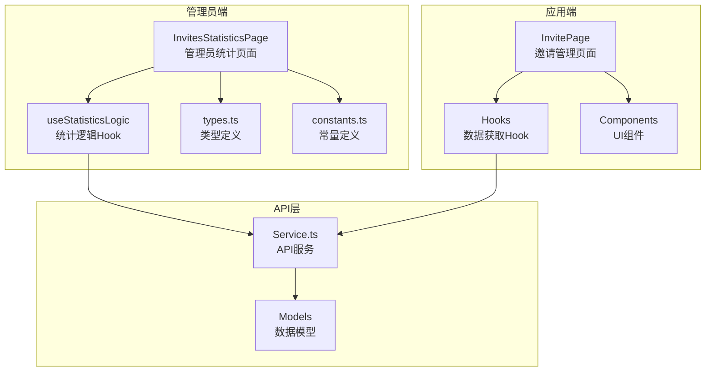
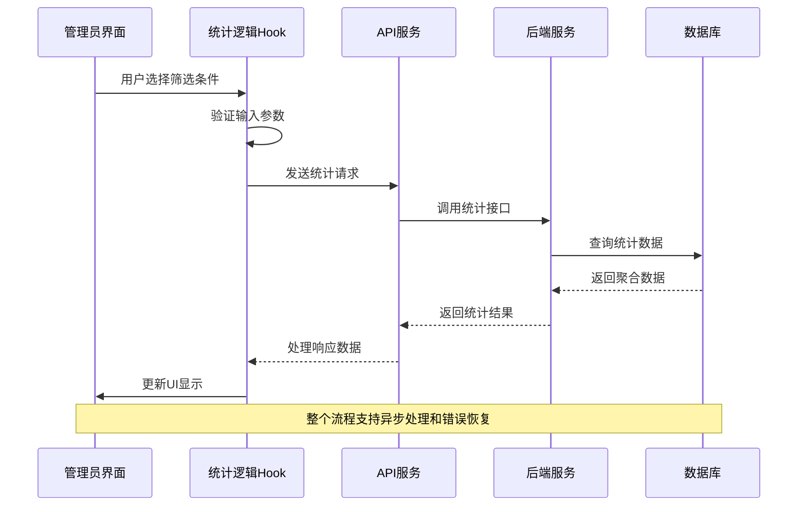
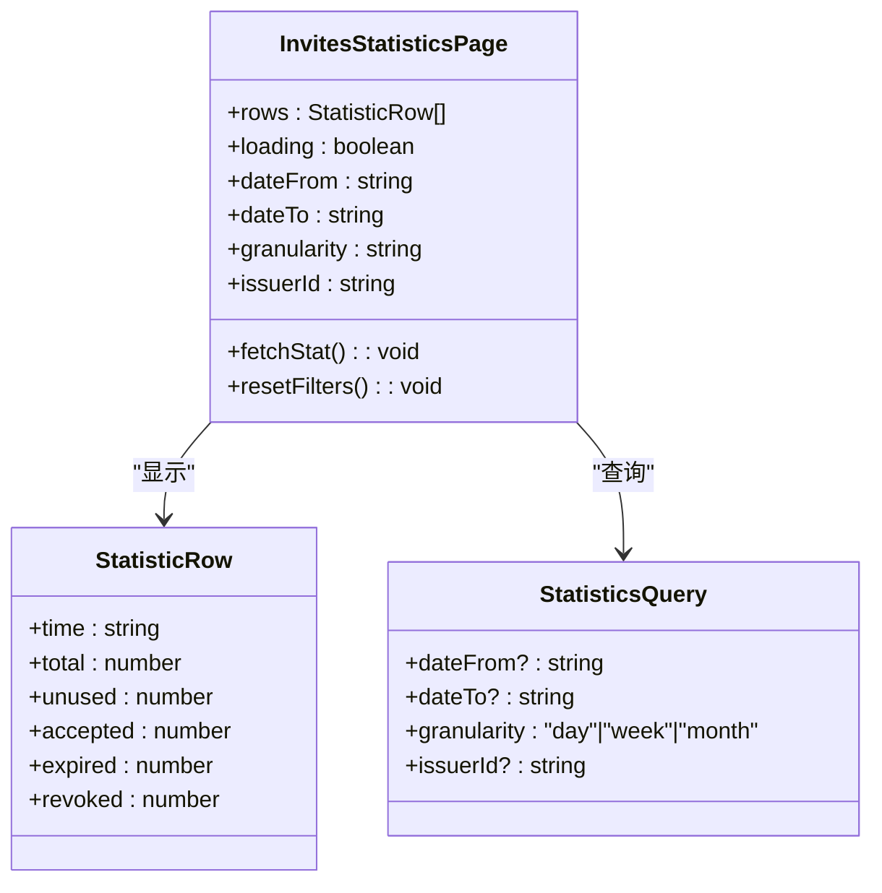
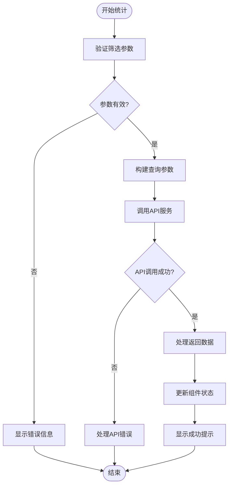
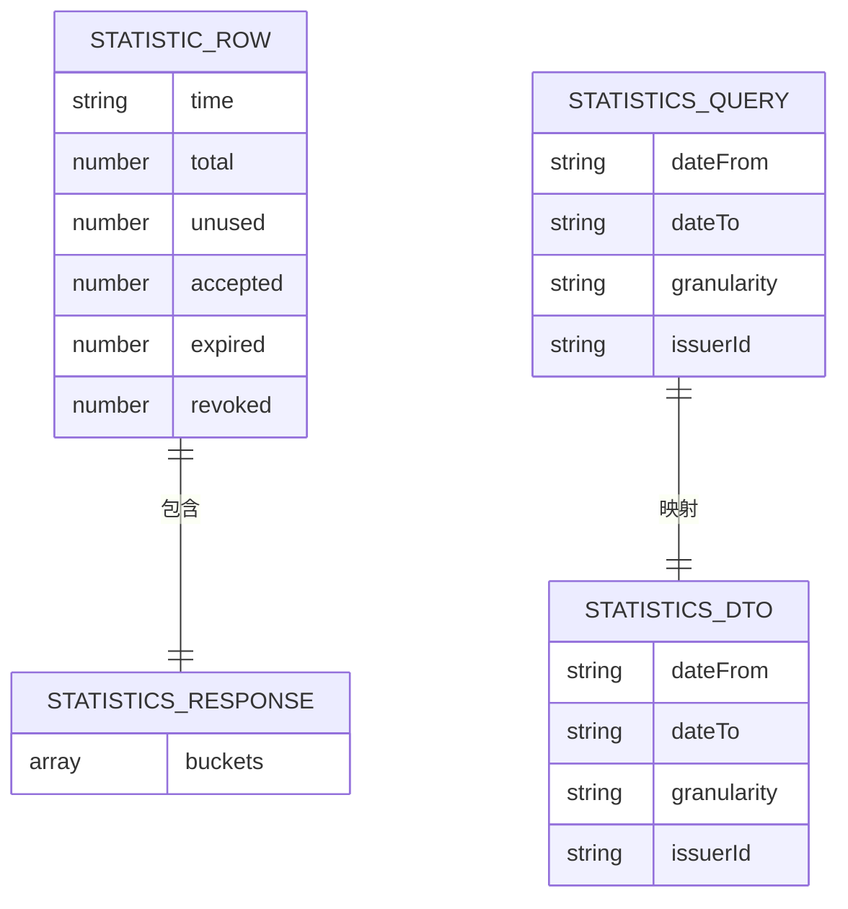
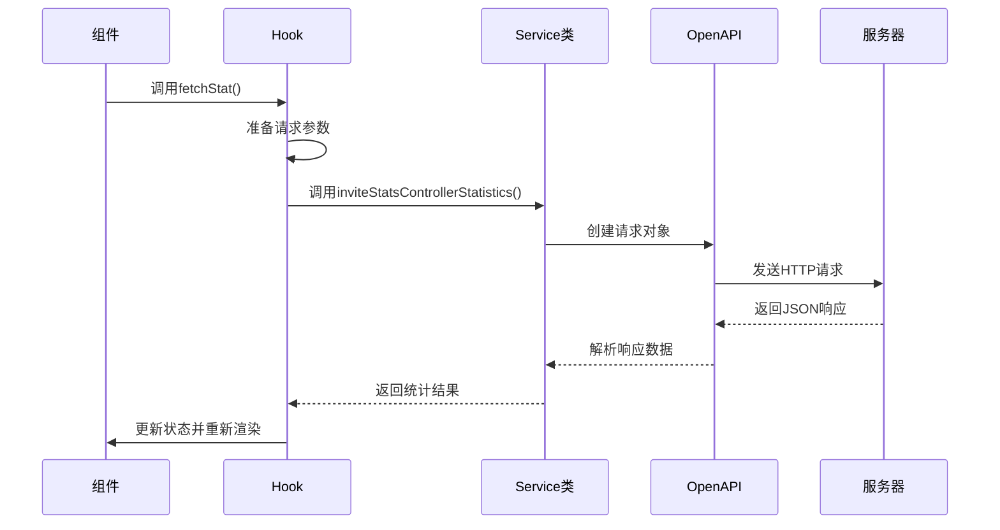
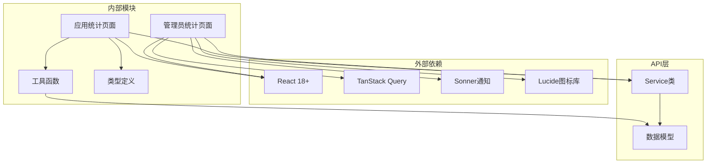

# 邀请统计分析

<cite>
**本文档引用的文件**
- [InvitesStatisticsPage/index.tsx](file://src/modules/admin/pages/operations/invites/InvitesStatisticsPage/index.tsx)
- [InvitesStatisticsPage/useStatisticsLogic.tsx](file://src/modules/admin/pages/operations/invites/InvitesStatisticsPage/useStatisticsLogic.tsx)
- [InvitesStatisticsPage/constants.ts](file://src/modules/admin/pages/operations/invites/InvitesStatisticsPage/constants.ts)
- [InvitesStatisticsPage/types.ts](file://src/modules/admin/pages/operations/invites/InvitesStatisticsPage/types.ts)
- [Service.ts](file://src/api/services/Service.ts)
- [StatisticsDto.ts](file://src/api/models/StatisticsDto.ts)
- [StatisticsResponseDto.ts](file://src/api/models/StatisticsResponseDto.ts)
- [InvitePage.tsx](file://src/modules/app/pages/Invite/InvitePage.tsx)
- [useInviteOverview.ts](file://src/modules/app/pages/Invite/hooks/useInviteOverview.ts)
- [useInviteRecords.ts](file://src/modules/app/pages/Invite/hooks/useInviteRecords.ts)
- [useInvitedUsers.ts](file://src/modules/app/pages/Invite/hooks/useInvitedUsers.ts)
- [StatsCards.tsx](file://src/modules/app/pages/Invite/components/StatsCards.tsx)
- [InvitePage/utils.ts](file://src/modules/app/pages/Invite/utils.ts)
- [ExportInvitesDto.ts](file://src/api/models/ExportInvitesDto.ts)
- [ExportInvitesResponseDto.ts](file://src/api/models/ExportInvitesResponseDto.ts)
</cite>

## 目录
1. [简介](#简介)
2. [项目结构](#项目结构)
3. [核心组件](#核心组件)
4. [架构概览](#架构概览)
5. [详细组件分析](#详细组件分析)
6. [依赖关系分析](#依赖关系分析)
7. [性能考虑](#性能考虑)
8. [故障排除指南](#故障排除指南)
9. [结论](#结论)
10. [附录](#附录)

## 简介

邀请统计分析功能是 zTorrent 社区管理系统中的重要组成部分，专门用于跟踪和分析用户邀请活动的数据表现。该功能提供了全面的统计数据收集、计算和展示机制，支持多种时间维度分析和对比分析，帮助管理员深入了解邀请活动的效果和用户行为模式。

该系统的核心目标包括：
- 收集邀请使用的统计数据，包括邀请发送、接受、过期和撤销等状态
- 计算关键指标如邀请转化率、用户活跃度等
- 展示直观的统计图表和数据仪表板
- 提供时间维度分析和趋势预测能力
- 支持邀请来源统计和用户分布分析

## 项目结构

邀请统计分析功能在项目中采用模块化设计，主要分布在以下目录结构中：

**图表来源**
- [InvitesStatisticsPage/index.tsx](file://src/modules/admin/pages/operations/invites/InvitesStatisticsPage/index.tsx#L1-L124)
- [Service.ts](file://src/api/services/Service.ts#L356-L378)

**章节来源**
- [InvitesStatisticsPage/index.tsx](file://src/modules/admin/pages/operations/invites/InvitesStatisticsPage/index.tsx#L1-L124)
- [Service.ts](file://src/api/services/Service.ts#L21-L378)

## 核心组件

### 管理员统计页面

管理员端的邀请统计页面是整个功能的核心界面，提供了完整的统计分析能力：

- **时间范围筛选器**：支持自定义开始和结束日期的选择
- **统计粒度控制**：支持按天、周、月三种时间粒度进行统计
- **数据表格展示**：以表格形式展示详细的统计结果
- **实时数据刷新**：支持重新计算和更新统计数据

### 统计逻辑Hook

`useStatisticsLogic` Hook 负责处理所有统计相关的业务逻辑：

- **状态管理**：维护筛选条件和统计结果的状态
- **API调用**：封装统计请求的API调用逻辑
- **错误处理**：统一处理统计过程中的各种异常情况
- **数据转换**：将API返回的数据转换为前端可用的格式

### 数据模型定义

系统定义了完整的数据模型来支持统计分析：

- **StatisticRow**：单个时间点的统计记录
- **StatisticsQuery**：统计查询参数模型
- **统计响应模型**：包含时间序列数据的响应结构

**章节来源**
- [InvitesStatisticsPage/useStatisticsLogic.tsx](file://src/modules/admin/pages/operations/invites/InvitesStatisticsPage/useStatisticsLogic.tsx#L1-L69)
- [InvitesStatisticsPage/types.ts](file://src/modules/admin/pages/operations/invites/InvitesStatisticsPage/types.ts#L1-L22)

## 架构概览

邀请统计分析系统的整体架构采用分层设计，确保了良好的可维护性和扩展性：

**图表来源**
- [InvitesStatisticsPage/useStatisticsLogic.tsx](file://src/modules/admin/pages/operations/invites/InvitesStatisticsPage/useStatisticsLogic.tsx#L19-L43)
- [Service.ts](file://src/api/services/Service.ts#L356-L378)

系统架构的关键特点包括：

1. **响应式设计**：使用 React Hooks 实现状态管理和数据流控制
2. **异步处理**：通过 TanStack Query 实现缓存和并发处理
3. **类型安全**：完整的 TypeScript 类型定义确保数据完整性
4. **错误处理**：统一的错误处理机制提升用户体验

## 详细组件分析

### 统计页面组件

统计页面组件负责渲染用户界面并处理用户交互：

**图表来源**
- [InvitesStatisticsPage/index.tsx](file://src/modules/admin/pages/operations/invites/InvitesStatisticsPage/index.tsx#L15-L29)
- [InvitesStatisticsPage/types.ts](file://src/modules/admin/pages/operations/invites/InvitesStatisticsPage/types.ts#L4-L21)

### 统计逻辑实现

统计逻辑Hook实现了复杂的业务逻辑处理：

**图表来源**
- [InvitesStatisticsPage/useStatisticsLogic.tsx](file://src/modules/admin/pages/operations/invites/InvitesStatisticsPage/useStatisticsLogic.tsx#L19-L43)

### 数据模型结构

系统定义了完整的数据模型来支持统计分析：

**图表来源**
- [InvitesStatisticsPage/types.ts](file://src/modules/admin/pages/operations/invites/InvitesStatisticsPage/types.ts#L4-L21)
- [StatisticsDto.ts](file://src/api/models/StatisticsDto.ts#L5-L19)
- [StatisticsResponseDto.ts](file://src/api/models/StatisticsResponseDto.ts#L5-L7)

**章节来源**
- [InvitesStatisticsPage/index.tsx](file://src/modules/admin/pages/operations/invites/InvitesStatisticsPage/index.tsx#L15-L124)
- [InvitesStatisticsPage/useStatisticsLogic.tsx](file://src/modules/admin/pages/operations/invites/InvitesStatisticsPage/useStatisticsLogic.tsx#L1-L69)

### API集成机制

系统通过Service类集成API服务，实现数据的远程调用：

**图表来源**
- [Service.ts](file://src/api/services/Service.ts#L356-L378)
- [StatisticsDto.ts](file://src/api/models/StatisticsDto.ts#L5-L19)

**章节来源**
- [Service.ts](file://src/api/services/Service.ts#L356-L378)
- [StatisticsDto.ts](file://src/api/models/StatisticsDto.ts#L1-L19)

## 依赖关系分析

邀请统计分析功能涉及多个层面的依赖关系：

**图表来源**
- [InvitesStatisticsPage/index.tsx](file://src/modules/admin/pages/operations/invites/InvitesStatisticsPage/index.tsx#L1-L10)
- [Service.ts](file://src/api/services/Service.ts#L21-L39)

### 核心依赖特性

1. **状态管理依赖**：使用 TanStack Query 进行数据缓存和状态同步
2. **UI组件依赖**：基于 Lucide 图标库和自定义UI组件
3. **类型系统依赖**：完整的 TypeScript 类型定义确保类型安全
4. **通知系统依赖**：使用 Sonner 提供用户友好的反馈

**章节来源**
- [InvitesStatisticsPage/index.tsx](file://src/modules/admin/pages/operations/invites/InvitesStatisticsPage/index.tsx#L1-L10)
- [Service.ts](file://src/api/services/Service.ts#L21-L39)

## 性能考虑

邀请统计分析功能在设计时充分考虑了性能优化：

### 数据缓存策略
- 使用 TanStack Query 实现智能缓存机制
- 支持数据预取和后台更新
- 自动处理缓存失效和数据同步

### 渲染优化
- 使用 React.memo 优化组件渲染
- 懒加载大型数据表格组件
- 实现虚拟滚动处理大量数据

### 网络请求优化
- 防抖处理频繁的筛选操作
- 并发请求优化用户体验
- 错误重试机制提升稳定性

## 故障排除指南

### 常见问题及解决方案

**统计数据显示为空**
- 检查时间范围设置是否合理
- 验证筛选条件是否过于严格
- 确认API服务是否正常运行

**数据更新延迟**
- 检查网络连接状态
- 验证缓存配置是否正确
- 查看浏览器开发者工具中的网络请求

**界面渲染异常**
- 检查React版本兼容性
- 验证TypeScript编译配置
- 确认依赖包版本匹配

### 调试工具和方法

1. **浏览器开发者工具**：监控网络请求和JavaScript错误
2. **React DevTools**：检查组件状态和props传递
3. **API测试工具**：直接调用后端接口验证数据准确性

**章节来源**
- [InvitesStatisticsPage/useStatisticsLogic.tsx](file://src/modules/admin/pages/operations/invites/InvitesStatisticsPage/useStatisticsLogic.tsx#L29-L31)

## 结论

邀请统计分析功能通过精心设计的架构和完善的实现，为zTorrent社区提供了强大的数据分析能力。该系统不仅满足了当前的统计需求，还具备良好的扩展性和维护性。

### 主要优势
- **完整的功能覆盖**：从数据收集到结果展示的全流程支持
- **灵活的时间维度**：支持日、周、月等多种统计粒度
- **直观的用户界面**：简洁明了的操作界面和清晰的数据展示
- **强大的API集成**：稳定的后端服务集成和数据处理能力

### 技术亮点
- **现代化的前端架构**：基于React和TypeScript的类型安全开发
- **高效的异步处理**：使用TanStack Query实现高性能的数据管理
- **优秀的用户体验**：流畅的交互体验和及时的反馈机制

## 附录

### 数据分析报告模板

系统支持生成标准化的数据分析报告，包含以下关键要素：

1. **基本信息**：统计时间范围、数据来源、计算方法
2. **核心指标**：邀请总数、使用率、转化率、趋势变化
3. **详细分析**：按时间维度的详细数据和图表
4. **结论建议**：基于数据分析的洞察和改进建议

### 可视化配置选项

- **图表类型**：支持柱状图、折线图、饼图等多种可视化形式
- **颜色主题**：提供深色和浅色两种主题模式
- **交互功能**：支持缩放、筛选、导出等交互操作

### 报表导出功能

系统提供完整的报表导出能力：
- **格式支持**：CSV、Excel、PDF等多种格式
- **内容定制**：可选择导出特定时间段和指标的数据
- **自动化导出**：支持定时自动导出和邮件发送

**章节来源**
- [ExportInvitesDto.ts](file://src/api/models/ExportInvitesDto.ts#L5-L28)
- [ExportInvitesResponseDto.ts](file://src/api/models/ExportInvitesResponseDto.ts#L5-L8)