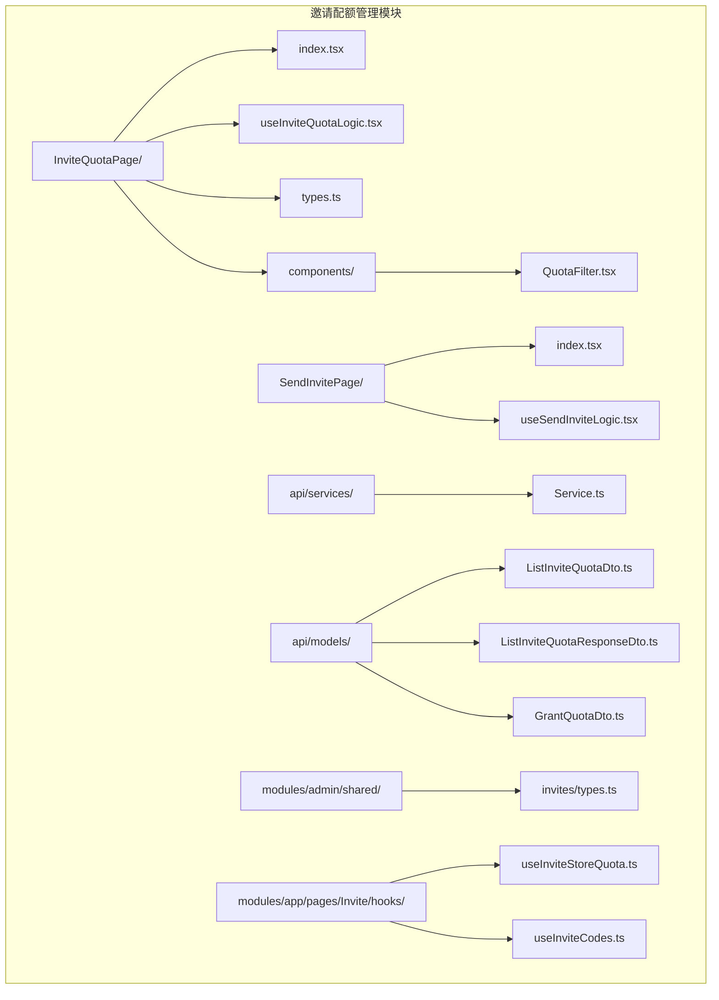
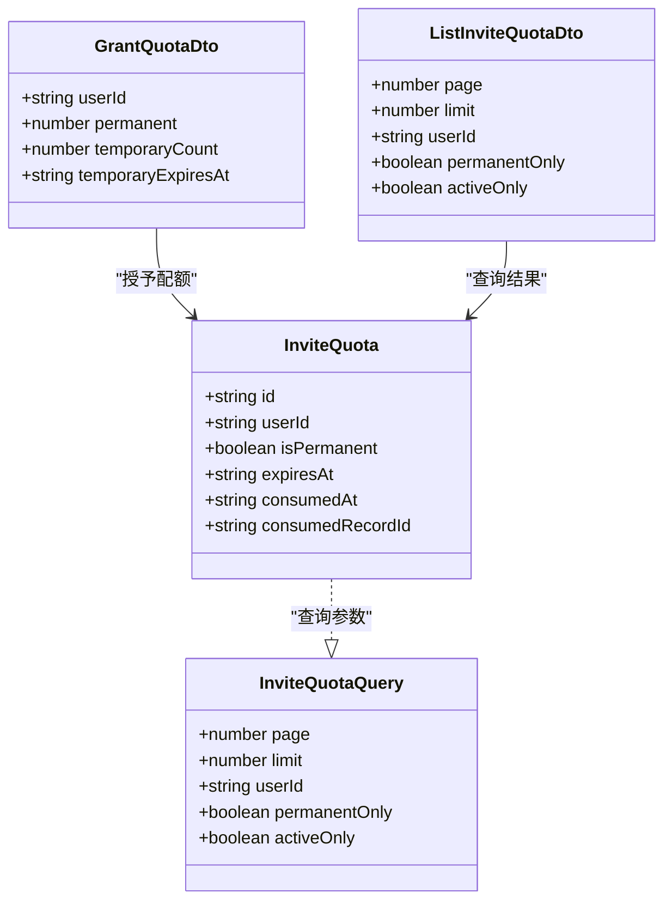
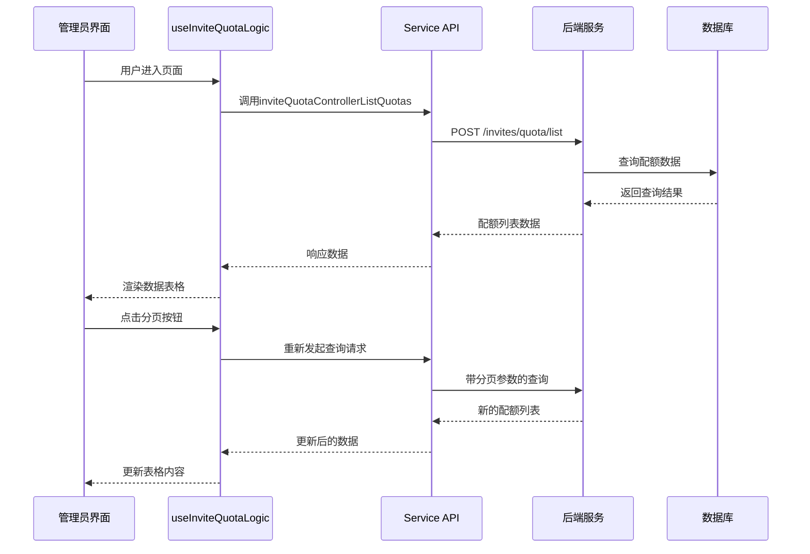
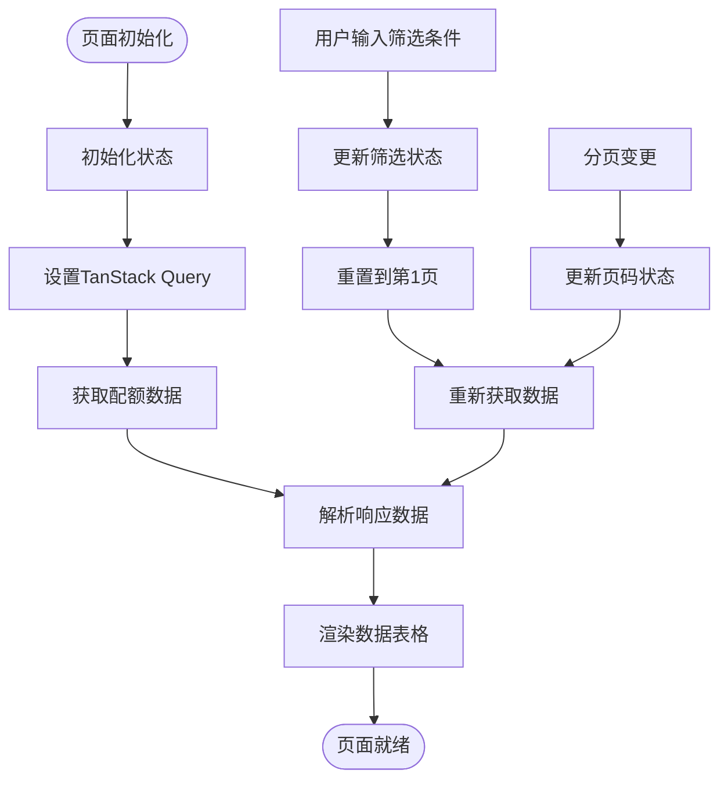
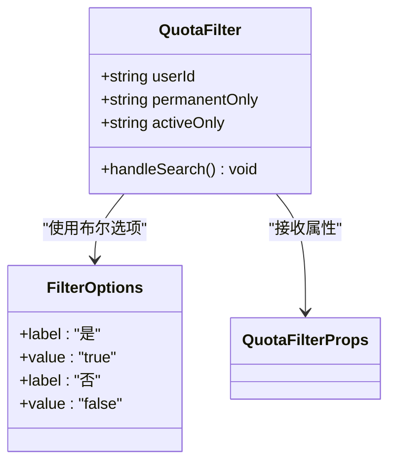
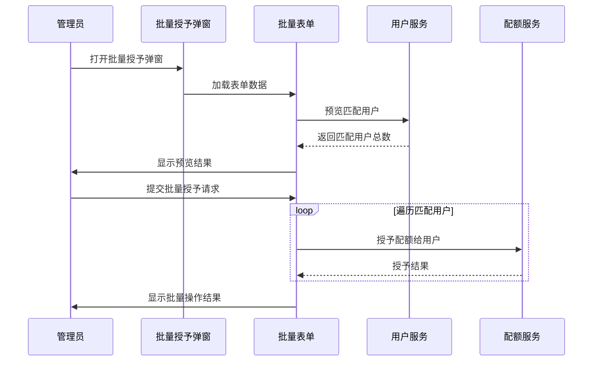
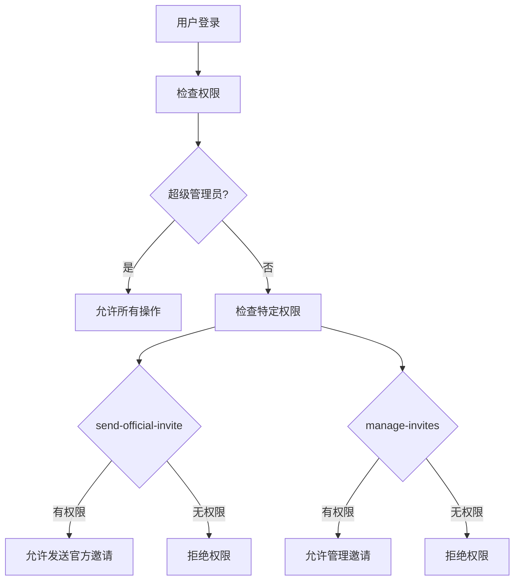
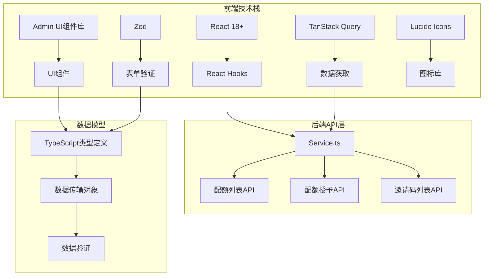
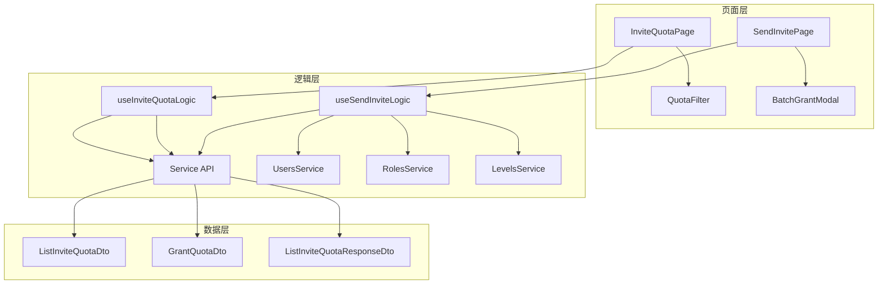
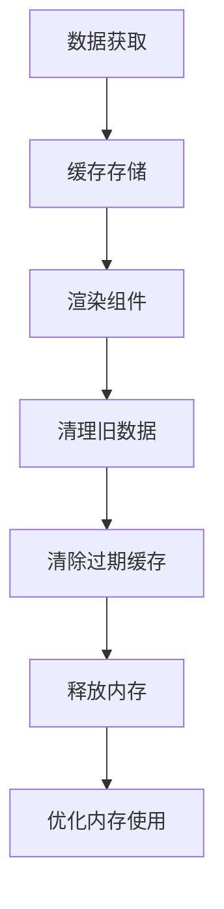

# 邀请配额管理

<cite>
**本文档引用的文件**
- [InviteQuotaPage/index.tsx](file://src/modules/admin/pages/operations/invites/InviteQuotaPage/index.tsx)
- [InviteQuotaPage/useInviteQuotaLogic.tsx](file://src/modules/admin/pages/operations/invites/InviteQuotaPage/useInviteQuotaLogic.tsx)
- [InviteQuotaPage/types.ts](file://src/modules/admin/pages/operations/invites/InviteQuotaPage/types.ts)
- [InviteQuotaPage/components/QuotaFilter.tsx](file://src/modules/admin/pages/operations/invites/InviteQuotaPage/components/QuotaFilter.tsx)
- [SendInvitePage/useSendInviteLogic.tsx](file://src/modules/admin/pages/operations/invites/SendInvitePage/useSendInviteLogic.tsx)
- [SendInvitePage/index.tsx](file://src/modules/admin/pages/operations/invites/SendInvitePage/index.tsx)
- [Service.ts](file://src/api/services/Service.ts)
- [ListInviteQuotaDto.ts](file://src/api/models/ListInviteQuotaDto.ts)
- [ListInviteQuotaResponseDto.ts](file://src/api/models/ListInviteQuotaResponseDto.ts)
- [GrantQuotaDto.ts](file://src/api/models/GrantQuotaDto.ts)
- [invites/types.ts](file://src/modules/admin/shared/invites/types.ts)
- [useInviteStoreQuota.ts](file://src/modules/app/pages/Invite/hooks/useInviteStoreQuota.ts)
- [useInviteCodes.ts](file://src/modules/app/pages/Invite/hooks/useInviteCodes.ts)
</cite>

## 目录
1. [简介](#简介)
2. [项目结构](#项目结构)
3. [核心组件](#核心组件)
4. [架构概览](#架构概览)
5. [详细组件分析](#详细组件分析)
6. [依赖关系分析](#依赖关系分析)
7. [性能考虑](#性能考虑)
8. [故障排除指南](#故障排除指南)
9. [结论](#结论)

## 简介

邀请配额管理系统是站点运营的核心功能之一，负责管理用户邀请名额的发放、查询、统计和有效期管理。该系统提供了完整的配额生命周期管理，包括配额分配、使用追踪、状态监控和批量操作等功能。

系统采用现代化的技术栈构建，基于React Hooks和TanStack Query实现高效的数据管理，配合Admin UI组件库提供直观的用户界面。通过严格的权限控制和安全策略，确保配额管理的安全性和可靠性。

## 项目结构

邀请配额管理功能主要分布在以下目录结构中：

**图表来源**
- [InviteQuotaPage/index.tsx](file://src/modules/admin/pages/operations/invites/InviteQuotaPage/index.tsx#L1-L55)
- [SendInvitePage/index.tsx](file://src/modules/admin/pages/operations/invites/SendInvitePage/index.tsx#L1-L149)
- [Service.ts](file://src/api/services/Service.ts#L188-L211)

**章节来源**
- [InviteQuotaPage/index.tsx](file://src/modules/admin/pages/operations/invites/InviteQuotaPage/index.tsx#L1-L55)
- [SendInvitePage/index.tsx](file://src/modules/admin/pages/operations/invites/SendInvitePage/index.tsx#L1-L149)

## 核心组件

### 邀请配额数据模型

系统定义了完整的邀请配额数据结构，支持永久和临时两种类型的配额管理：

**图表来源**
- [InviteQuotaPage/types.ts](file://src/modules/admin/pages/operations/invites/InviteQuotaPage/types.ts#L4-L22)
- [GrantQuotaDto.ts](file://src/api/models/GrantQuotaDto.ts#L5-L22)
- [ListInviteQuotaDto.ts](file://src/api/models/ListInviteQuotaDto.ts#L5-L12)

### 配额查询参数

系统支持灵活的配额查询过滤机制：

| 参数名称 | 类型 | 描述 | 必填 |
|---------|------|------|------|
| page | number | 页码，从1开始 | 是 |
| limit | number | 每页条数 | 是 |
| userId | string | 用户ID过滤 | 否 |
| permanentOnly | boolean | 仅显示永久配额 | 否 |
| activeOnly | boolean | 仅显示活跃配额 | 否 |

**章节来源**
- [InviteQuotaPage/types.ts](file://src/modules/admin/pages/operations/invites/InviteQuotaPage/types.ts#L16-L22)
- [ListInviteQuotaDto.ts](file://src/api/models/ListInviteQuotaDto.ts#L5-L12)

## 架构概览

邀请配额管理采用分层架构设计，实现了逻辑与视图的完全分离：

**图表来源**
- [InviteQuotaPage/useInviteQuotaLogic.tsx](file://src/modules/admin/pages/operations/invites/InviteQuotaPage/useInviteQuotaLogic.tsx#L32-L35)
- [Service.ts](file://src/api/services/Service.ts#L188-L210)

**章节来源**
- [InviteQuotaPage/useInviteQuotaLogic.tsx](file://src/modules/admin/pages/operations/invites/InviteQuotaPage/useInviteQuotaLogic.tsx#L1-L120)

## 详细组件分析

### 邀请配额查询页面

#### 页面架构设计

页面采用现代化的React Hooks架构，实现了完整的数据管理流程：

**图表来源**
- [InviteQuotaPage/index.tsx](file://src/modules/admin/pages/operations/invites/InviteQuotaPage/index.tsx#L18-L55)
- [InviteQuotaPage/useInviteQuotaLogic.tsx](file://src/modules/admin/pages/operations/invites/InviteQuotaPage/useInviteQuotaLogic.tsx#L13-L119)

#### 数据表格配置

系统提供了完整的配额数据展示功能：

| 列名 | 字段名 | 宽度 | 渲染方式 | 功能描述 |
|------|--------|------|----------|----------|
| 名额ID | id | 160px | 文本 | 显示配额唯一标识 |
| 用户ID | userId | 140px | 文本 | 显示拥有者用户ID |
| 类型 | isPermanent | 100px | 标签组件 | 显示永久/临时配额标识 |
| 过期时间 | expiresAt | 180px | 日期格式化 | 显示配额有效期 |
| 消耗时间 | consumedAt | 180px | 日期格式化 | 显示配额使用时间 |
| 消耗记录ID | consumedRecordId | 180px | 文本 | 显示关联的邀请记录ID |

**章节来源**
- [InviteQuotaPage/useInviteQuotaLogic.tsx](file://src/modules/admin/pages/operations/invites/InviteQuotaPage/useInviteQuotaLogic.tsx#L62-L106)

### 邀请配额筛选器

#### 筛选器组件设计

筛选器组件提供了灵活的查询过滤功能：

**图表来源**
- [InviteQuotaPage/components/QuotaFilter.tsx](file://src/modules/admin/pages/operations/invites/InviteQuotaPage/components/QuotaFilter.tsx#L22-L66)

#### 筛选功能说明

| 筛选类型 | 参数名 | 选项值 | 功能说明 |
|----------|--------|--------|----------|
| 用户ID搜索 | userId | 字符串 | 支持精确匹配用户ID |
| 仅永久配额 | permanentOnly | true/false | 仅显示永久性配额 |
| 仅活跃配额 | activeOnly | true/false | 仅显示未过期且未使用的配额 |

**章节来源**
- [InviteQuotaPage/components/QuotaFilter.tsx](file://src/modules/admin/pages/operations/invites/InviteQuotaPage/components/QuotaFilter.tsx#L1-L66)

### 批量配额授予功能

#### 批量操作架构

系统支持批量配额授予，通过智能的用户匹配算法实现精准的批量操作：

**图表来源**
- [SendInvitePage/useSendInviteLogic.tsx](file://src/modules/admin/pages/operations/invites/SendInvitePage/useSendInviteLogic.tsx#L167-L206)

#### 批量授予参数

| 参数名称 | 类型 | 默认值 | 描述 |
|----------|------|--------|------|
| logic | "AND"\|"OR" | "AND" | 用户匹配逻辑运算符 |
| levels | string[] | [] | 等级筛选条件 |
| roles | string[] | [] | 角色筛选条件 |
| permanent | number | 0 | 授予永久配额数量 |
| temporaryCount | number | 0 | 授予临时配额数量 |
| temporaryExpiresAt | string | undefined | 临时配额过期时间 |

**章节来源**
- [SendInvitePage/useSendInviteLogic.tsx](file://src/modules/admin/pages/operations/invites/SendInvitePage/useSendInviteLogic.tsx#L24-L31)

### 权限控制系统

#### 权限检查机制

系统实现了多层次的权限控制，确保只有授权用户才能执行敏感操作：

**图表来源**
- [SendInvitePage/useSendInviteLogic.tsx](file://src/modules/admin/pages/operations/invites/SendInvitePage/useSendInviteLogic.tsx#L64-L79)

**章节来源**
- [SendInvitePage/useSendInviteLogic.tsx](file://src/modules/admin/pages/operations/invites/SendInvitePage/useSendInviteLogic.tsx#L64-L79)

## 依赖关系分析

### 技术栈依赖

邀请配额管理系统采用了现代化的技术栈，确保系统的可维护性和扩展性：

**图表来源**
- [Service.ts](file://src/api/services/Service.ts#L188-L293)
- [ListInviteQuotaDto.ts](file://src/api/models/ListInviteQuotaDto.ts#L5-L12)

### 组件间依赖关系

系统中的组件遵循清晰的依赖层次结构：

**图表来源**
- [InviteQuotaPage/index.tsx](file://src/modules/admin/pages/operations/invites/InviteQuotaPage/index.tsx#L1-L55)
- [SendInvitePage/index.tsx](file://src/modules/admin/pages/operations/invites/SendInvitePage/index.tsx#L1-L149)

**章节来源**
- [InviteQuotaPage/index.tsx](file://src/modules/admin/pages/operations/invites/InviteQuotaPage/index.tsx#L1-L55)
- [SendInvitePage/index.tsx](file://src/modules/admin/pages/operations/invites/SendInvitePage/index.tsx#L1-L149)

## 性能考虑

### 数据缓存策略

系统采用多层缓存机制来优化性能：

1. **TanStack Query缓存**：自动管理查询结果缓存，支持缓存失效和重新验证
2. **本地状态缓存**：使用React状态管理组件状态，避免不必要的重渲染
3. **组件记忆化**：通过useMemo和useCallback优化组件渲染性能

### 分页加载优化

系统实现了高效的分页加载机制：

- **懒加载**：仅在需要时加载下一页数据
- **虚拟滚动**：对于大量数据场景，可考虑实现虚拟滚动优化
- **防抖处理**：对频繁的查询操作进行防抖处理，减少API调用频率

### 内存管理

## 故障排除指南

### 常见问题及解决方案

#### 配额查询异常

**问题现象**：配额列表无法加载或显示空白

**可能原因**：
1. API接口返回格式异常
2. 网络连接问题
3. 用户权限不足

**解决步骤**：
1. 检查浏览器开发者工具中的网络请求
2. 验证API响应格式是否符合预期
3. 确认用户具有相应的管理权限

#### 批量操作失败

**问题现象**：批量授予配额时部分用户操作失败

**可能原因**：
1. 用户状态异常
2. 配额授予参数错误
3. 系统并发限制

**解决步骤**：
1. 检查失败用户的账户状态
2. 验证批量操作参数的有效性
3. 查看系统日志中的错误信息

#### 性能问题

**问题现象**：页面加载缓慢或响应迟钝

**优化建议**：
1. 实现数据分页和虚拟滚动
2. 减少不必要的组件重渲染
3. 优化API查询条件

**章节来源**
- [InviteQuotaPage/useInviteQuotaLogic.tsx](file://src/modules/admin/pages/operations/invites/InviteQuotaPage/useInviteQuotaLogic.tsx#L32-L35)
- [SendInvitePage/useSendInviteLogic.tsx](file://src/modules/admin/pages/operations/invites/SendInvitePage/useSendInviteLogic.tsx#L167-L206)

## 结论

邀请配额管理系统是一个功能完整、架构清晰的现代化管理平台。系统通过合理的分层设计、完善的权限控制和高效的性能优化，为站点运营提供了强大的配额管理能力。

### 主要优势

1. **架构清晰**：采用分层架构，职责分离明确
2. **性能优秀**：多层缓存和优化策略确保系统响应速度
3. **功能完善**：支持配额查询、筛选、批量操作等核心功能
4. **安全可靠**：严格的权限控制和数据验证机制
5. **易于扩展**：模块化设计便于功能扩展和维护

### 发展建议

1. **增强监控**：添加更详细的配额使用统计和预警机制
2. **优化体验**：实现配额调整的日志追踪和审计功能
3. **扩展功能**：支持配额到期提醒和自动续期功能
4. **性能优化**：进一步优化大数据量场景下的查询性能

该系统为站点的邀请配额管理提供了坚实的技术基础，能够满足当前和未来的业务发展需求。