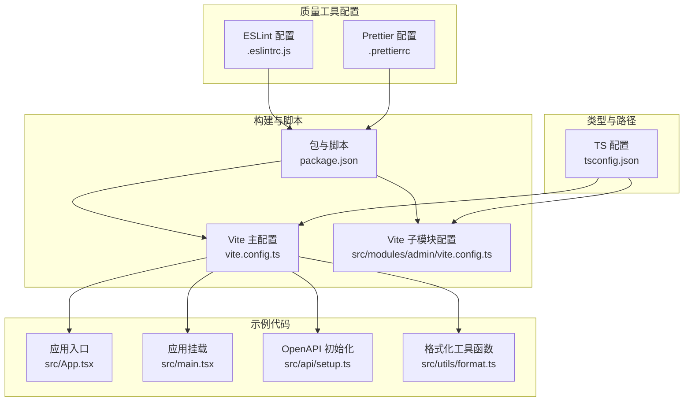
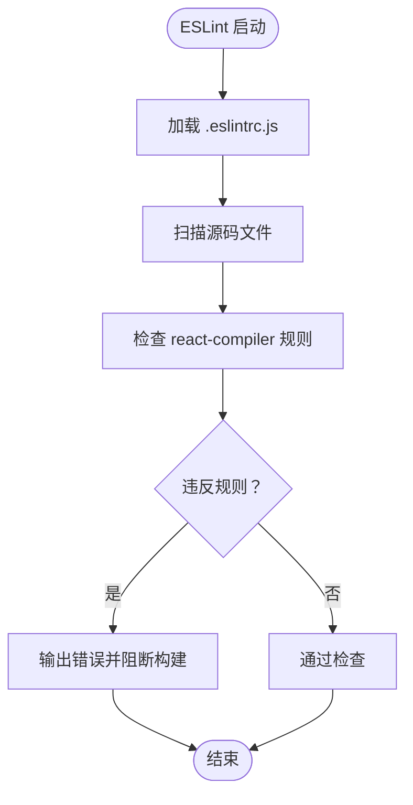
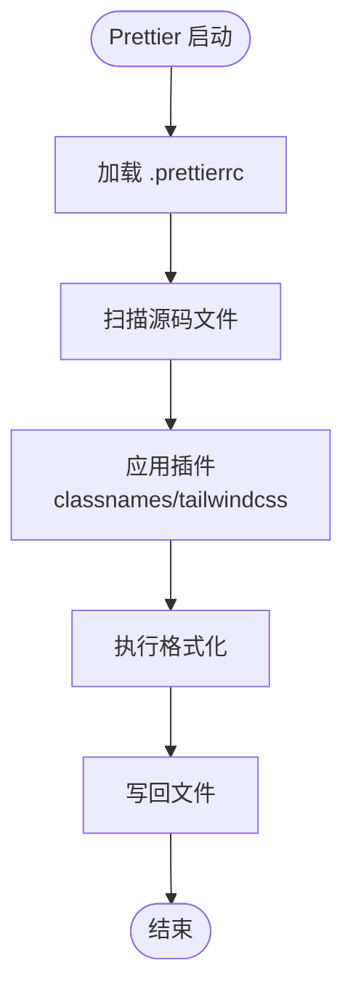
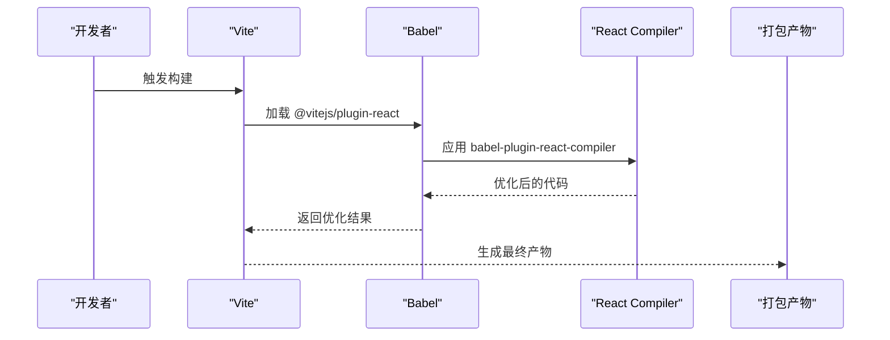
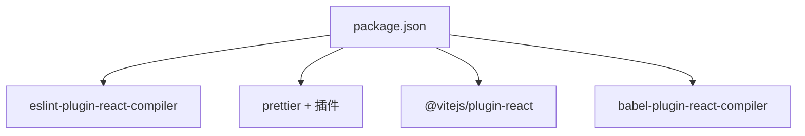

# 代码质量工具

<cite>
**本文引用的文件**
- [.eslintrc.js](file://.eslintrc.js)
- [.prettierrc](file://.prettierrc)
- [package.json](file://package.json)
- [tsconfig.json](file://tsconfig.json)
- [vite.config.ts](file://vite.config.ts)
- [src/modules/admin/vite.config.ts](file://src/modules/admin/vite.config.ts)
- [src/App.tsx](file://src/App.tsx)
- [src/main.tsx](file://src/main.tsx)
- [src/api/setup.ts](file://src/api/setup.ts)
- [src/utils/format.ts](file://src/utils/format.ts)
- [README.md](file://README.md)
</cite>

## 目录
1. [简介](#简介)
2. [项目结构](#项目结构)
3. [核心组件](#核心组件)
4. [架构总览](#架构总览)
5. [详细组件分析](#详细组件分析)
6. [依赖分析](#依赖分析)
7. [性能考虑](#性能考虑)
8. [故障排查指南](#故障排查指南)
9. [结论](#结论)
10. [附录](#附录)

## 简介
本指南面向 zTorrent-site 前端工程，系统性介绍代码质量工具链的配置与使用，包括：
- ESLint 代码检查规则与插件
- Prettier 代码格式化配置与 Tailwind/ClassName 插件
- 项目代码规范与命名约定
- 开发环境集成与 CI/CD 自动化检查与修复
- 规则冲突处理、性能优化与团队协作最佳实践

本项目采用 React 19 + Vite + TypeScript 技术栈，并通过 React Compiler 与 Babel 配置进行编译期优化。

## 项目结构
围绕代码质量工具的相关文件分布如下：
- 质量工具配置：.eslintrc.js、.prettierrc
- 构建与脚本：package.json、vite.config.ts、src/modules/admin/vite.config.ts
- 类型与路径别名：tsconfig.json
- 示例业务代码：src/App.tsx、src/main.tsx、src/api/setup.ts、src/utils/format.ts
- 项目说明：README.md

图表来源
- [.eslintrc.js](file://.eslintrc.js#L1-L9)
- [.prettierrc](file://.prettierrc#L1-L13)
- [package.json](file://package.json#L126-L139)
- [vite.config.ts](file://vite.config.ts#L1-L86)
- [src/modules/admin/vite.config.ts](file://src/modules/admin/vite.config.ts#L1-L47)
- [tsconfig.json](file://tsconfig.json#L1-L44)
- [src/App.tsx](file://src/App.tsx#L1-L52)
- [src/main.tsx](file://src/main.tsx#L1-L18)
- [src/api/setup.ts](file://src/api/setup.ts#L1-L35)
- [src/utils/format.ts](file://src/utils/format.ts#L1-L37)

章节来源
- [README.md](file://README.md#L1-L11)
- [package.json](file://package.json#L126-L139)

## 核心组件
- ESLint 配置
  - 插件：eslint-plugin-react-compiler
  - 规则：启用 react-compiler/react-compiler 为错误级别
  - 作用：强制使用 React Compiler 进行编译期优化，提升运行时性能
- Prettier 配置
  - 插件：prettier-plugin-classnames、prettier-plugin-tailwindcss
  - 自定义属性/函数：className、class；cn、cva、clsx
  - 格式化选项：分号开启、双引号、2 空格缩进、尾随逗号、行长 100
  - 作用：统一代码风格，支持 Tailwind 与 className 工具函数的智能排序与去重

章节来源
- [.eslintrc.js](file://.eslintrc.js#L1-L9)
- [.prettierrc](file://.prettierrc#L1-L13)

## 架构总览
下图展示了代码质量工具在开发与构建流程中的位置与交互：

图表来源
- [.eslintrc.js](file://.eslintrc.js#L1-L9)
- [.prettierrc](file://.prettierrc#L1-L13)
- [vite.config.ts](file://vite.config.ts#L10-L21)
- [tsconfig.json](file://tsconfig.json#L1-L44)

## 详细组件分析

### ESLint 组件分析
- 插件与规则
  - 插件：eslint-plugin-react-compiler
  - 规则：react-compiler/react-compiler 设为错误级别
- 作用与收益
  - 强制启用 React Compiler，减少运行时开销，提升渲染性能
  - 通过规则约束，确保新代码遵循 React Compiler 的最佳实践
- 冲突与规避
  - 若存在第三方库未适配 React Compiler，可在规则中临时放宽或忽略特定文件/目录
  - 建议在 CI 中保持严格，本地可按需放宽以保证开发体验

图表来源
- [.eslintrc.js](file://.eslintrc.js#L6-L8)

章节来源
- [.eslintrc.js](file://.eslintrc.js#L1-L9)

### Prettier 组件分析
- 插件与自定义
  - 插件：prettier-plugin-classnames、prettier-plugin-tailwindcss
  - 自定义属性：className、class
  - 自定义函数：cn、cva、clsx
- 格式化选项
  - semi=true、singleQuote=false、tabWidth=2、trailingComma="all"、printWidth=100
- 作用与收益
  - 统一团队代码风格，减少审阅分歧
  - 支持 Tailwind 与 className 工具函数，自动排序与去重类名，降低样式冲突风险
- 冲突与规避
  - 当与 ESLint 的格式化规则冲突时，优先以 Prettier 为准（通过 eslint-config-prettier 解除冲突）
  - 若 Tailwind 类名顺序影响样式，建议在 CI 中强制格式化并校验

图表来源
- [.prettierrc](file://.prettierrc#L1-L13)

章节来源
- [.prettierrc](file://.prettierrc#L1-L13)

### Vite 与 React Compiler 集成
- 配置要点
  - Vite 通过 @vitejs/plugin-react 注入 Babel，启用 babel-plugin-react-compiler 并指定目标版本
  - 子模块 vite.config.ts 复用相同配置，确保一致性
- 作用与收益
  - 在构建阶段进行 React 优化，减少运行时开销
  - 与 ESLint 的 react-compiler 规则形成闭环，从开发到构建全程约束

图表来源
- [vite.config.ts](file://vite.config.ts#L10-L21)
- [src/modules/admin/vite.config.ts](file://src/modules/admin/vite.config.ts#L16-L21)

章节来源
- [vite.config.ts](file://vite.config.ts#L1-L86)
- [src/modules/admin/vite.config.ts](file://src/modules/admin/vite.config.ts#L1-L47)

### TypeScript 与路径别名
- 关键点
  - tsconfig.json 指定 JSX、模块解析、路径别名 @/* 指向 src
  - 与 Vite 的路径别名保持一致，避免导入路径差异导致的检查问题
- 作用与收益
  - 统一路径解析，减少相对路径带来的维护成本
  - 便于 ESLint/Prettier 正确识别模块关系

章节来源
- [tsconfig.json](file://tsconfig.json#L1-L44)
- [vite.config.ts](file://vite.config.ts#L29-L34)

### 示例业务代码与质量工具联动
- src/App.tsx：应用根组件，演示上下文 Provider 与路由组织，适合用于验证 ESLint 规则与 Prettier 格式化的一致性
- src/main.tsx：应用挂载入口，引入全局样式与 OpenAPI 初始化，便于在 CI 中进行最小化构建检查
- src/api/setup.ts：OpenAPI 初始化逻辑，集中处理 Base URL 与 Token，建议在格式化与类型检查下保持稳定
- src/utils/format.ts：通用格式化函数，体现命名约定与注释规范

章节来源
- [src/App.tsx](file://src/App.tsx#L1-L52)
- [src/main.tsx](file://src/main.tsx#L1-L18)
- [src/api/setup.ts](file://src/api/setup.ts#L1-L35)
- [src/utils/format.ts](file://src/utils/format.ts#L1-L37)

## 依赖分析
- 质量工具相关依赖
  - ESLint 插件：eslint-plugin-react-compiler
  - Prettier 插件：prettier、prettier-plugin-classnames、prettier-plugin-tailwindcss
  - 构建插件：@vitejs/plugin-react、babel-plugin-react-compiler
- 脚本与命令
  - package.json 提供开发、构建、类型检查等脚本，建议在 CI 中复用

图表来源
- [package.json](file://package.json#L93-L124)

章节来源
- [package.json](file://package.json#L93-L124)

## 性能考虑
- React Compiler
  - 在 Vite 中启用 babel-plugin-react-compiler，目标版本与 React 版本匹配，有助于减少运行时开销
  - 建议在大型组件中优先使用 React Compiler 支持的模式，避免不被优化的动态访问
- 构建优化
  - Vite 默认使用 esbuild，结合手动分块策略，减少首屏体积
  - 可视化分析插件已预留，便于定位大体积依赖
- 类名与样式
  - Prettier Tailwind 插件可自动排序与去重类名，减少重复样式与打包体积

章节来源
- [vite.config.ts](file://vite.config.ts#L60-L79)
- [.prettierrc](file://.prettierrc#L1-L13)

## 故障排查指南
- ESLint 报错
  - 症状：构建或提交被阻止
  - 排查：确认 .eslintrc.js 中 react-compiler 规则是否误报；必要时在规则中放宽特定文件
  - 参考：[ESLint 配置](file://.eslintrc.js#L6-L8)
- Prettier 格式化异常
  - 症状：Tailwind 类名顺序或 className 工具函数未正确格式化
  - 排查：确认 .prettierrc 中 tailwindAttributes/functions 与 customAttributes/functions 是否覆盖到实际使用
  - 参考：[Prettier 配置](file://.prettierrc#L3-L6)
- 路径别名不生效
  - 症状：导入路径报错或类型检查失败
  - 排查：确保 tsconfig.json 与 vite.config.ts 的 @/* 别名一致
  - 参考：[TS 配置](file://tsconfig.json#L20-L24)、[Vite 配置](file://vite.config.ts#L31-L34)
- 子模块构建差异
  - 症状：主模块与 admin 子模块构建行为不一致
  - 排查：确认子模块 vite.config.ts 是否复用相同的 React Compiler 配置
  - 参考：[主模块配置](file://vite.config.ts#L16-L21)、[子模块配置](file://src/modules/admin/vite.config.ts#L16-L21)

章节来源
- [.eslintrc.js](file://.eslintrc.js#L6-L8)
- [.prettierrc](file://.prettierrc#L3-L6)
- [tsconfig.json](file://tsconfig.json#L20-L24)
- [vite.config.ts](file://vite.config.ts#L31-L34)
- [src/modules/admin/vite.config.ts](file://src/modules/admin/vite.config.ts#L16-L21)

## 结论
本项目已建立完善的代码质量工具链：ESLint 与 Prettier 负责静态检查与格式化，Vite + React Compiler 负责构建期优化。通过统一的配置与脚本，团队可以在开发与 CI 中获得一致的代码质量保障。建议持续关注 React Compiler 的演进，适时更新插件与规则，以获得更好的性能与稳定性。

## 附录
- 开发与运行
  - 安装依赖与启动开发服务器：参考 [README](file://README.md#L8-L10)
  - 类型检查：通过 package.json 中的 typecheck 脚本执行
- CI/CD 建议
  - 在流水线中执行：安装依赖 → 类型检查 → ESLint 检查 → Prettier 格式化校验 → 构建
  - 对于格式化，建议在 CI 中使用“仅检查不修复”，确保提交的代码符合规范

章节来源
- [README.md](file://README.md#L6-L10)
- [package.json](file://package.json#L126-L139)