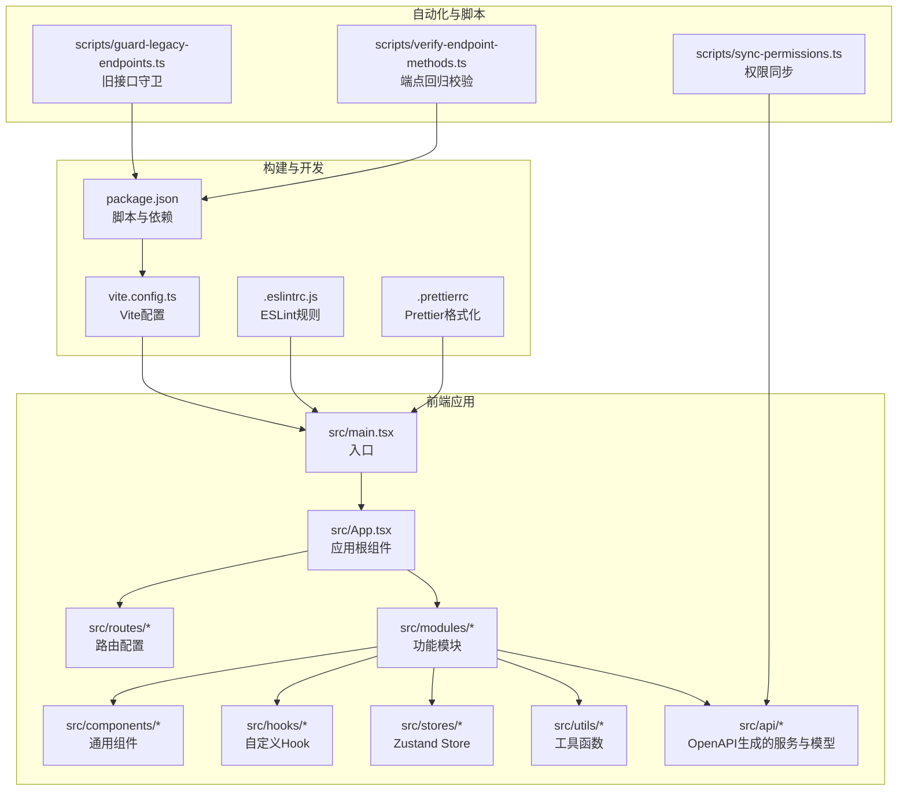
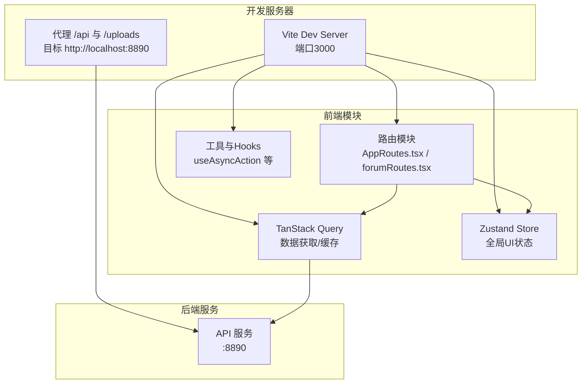
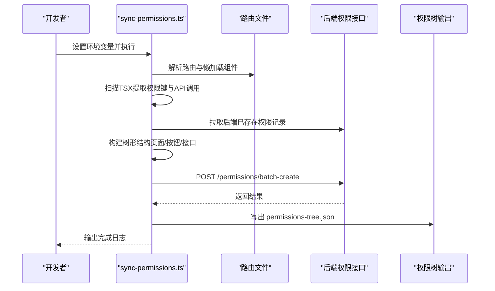
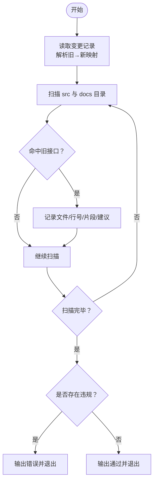
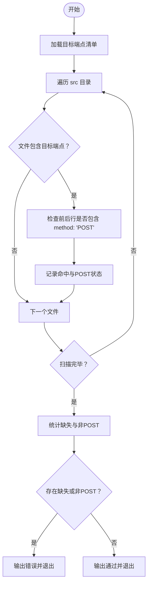
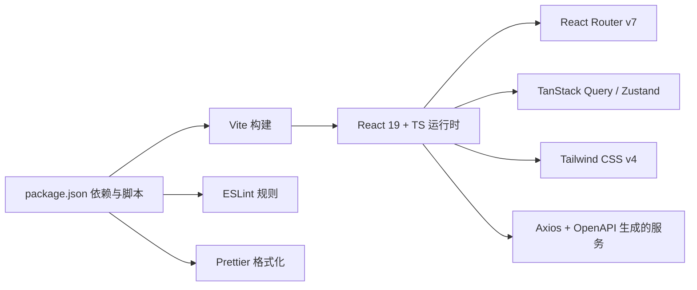

# 开发工作流程

<cite>
**本文引用的文件**
- [README.md](file://README.md)
- [package.json](file://package.json)
- [vite.config.ts](file://vite.config.ts)
- [.eslintrc.js](file://.eslintrc.js)
- [.prettierrc](file://.prettierrc)
- [src/guidelines/Guidelines.md](file://src/guidelines/Guidelines.md)
- [src/modules/admin/guidelines/UI_STANDARDS.md](file://src/modules/admin/guidelines/UI_STANDARDS.md)
- [src/modules/admin/guidelines/antd-tailwind-integration.md](file://src/modules/admin/guidelines/antd-tailwind-integration.md)
- [scripts/sync-permissions.ts](file://scripts/sync-permissions.ts)
- [scripts/guard-legacy-endpoints.ts](file://scripts/guard-legacy-endpoints.ts)
- [scripts/verify-endpoint-methods.ts](file://scripts/verify-endpoint-methods.ts)
- [task.md](file://task.md)
- [implementation_plan.md](file://implementation_plan.md)
</cite>

## 目录
1. [引言](#引言)
2. [项目结构](#项目结构)
3. [核心组件](#核心组件)
4. [架构总览](#架构总览)
5. [详细组件分析](#详细组件分析)
6. [依赖分析](#依赖分析)
7. [性能考虑](#性能考虑)
8. [故障排查指南](#故障排查指南)
9. [结论](#结论)
10. [附录](#附录)

## 引言
本指南面向开发团队，系统化梳理本项目的开发工作流程、任务管理与协作规范，涵盖开发环境搭建、代码提交规范、分支与版本控制策略、测试流程、代码审查标准、持续集成配置、日常开发任务、功能开发流程以及问题排查方法。同时提供团队协作最佳实践、文档维护规范与知识分享机制，帮助新成员快速上手并维持高质量交付。

## 项目结构
项目采用现代化前端技术栈，前端基于 React 19 + TypeScript，构建工具为 Vite 6，样式方案为 Tailwind CSS v4 + Radix UI，路由为 React Router v7，状态管理采用 TanStack Query（服务端状态/缓存）与 Zustand（全局 UI 状态）。脚本与自动化工具位于 scripts 目录，文档与规范位于 docs 与 src/guidelines 目录。

**图表来源**
- [vite.config.ts](file://vite.config.ts#L1-L86)
- [package.json](file://package.json#L126-L139)
- [src/guidelines/Guidelines.md](file://src/guidelines/Guidelines.md#L22-L36)

**章节来源**
- [README.md](file://README.md#L1-L11)
- [package.json](file://package.json#L126-L139)
- [vite.config.ts](file://vite.config.ts#L1-L86)
- [src/guidelines/Guidelines.md](file://src/guidelines/Guidelines.md#L22-L36)

## 核心组件
- 开发环境与脚本
  - 依赖安装与启动：使用包管理器安装依赖并启动开发服务器。
  - 构建与打包：Vite 生产构建，启用 Source Map 与 ESBuild 压缩。
  - 类型检查：通过脚本执行 TypeScript 类型检查。
- 代码质量
  - ESLint：启用 React Compiler 插件，强制编译优化。
  - Prettier：统一代码风格，支持 Tailwind 与类名合并函数。
- 自动化脚本
  - 权限同步：扫描前端源码提取页面与按钮权限键，批量创建/更新权限树。
  - 旧接口守卫：从变更记录提取“旧→新”映射，扫描代码与文档，阻止旧接口残留。
  - 端点回归校验：静态扫描关键新端点是否出现并以 POST 方法声明。
- 规范与设计
  - 前端规范：目录结构、组件开发、样式与 UI、状态管理、异步操作与用户反馈、类型安全、性能优化。
  - 管理后台规范：表格、页面工具栏、文字排版、颜色规范、布局与间距。
  - Antd 与 Tailwind 融合：Token 映射、配置、组件实现范例与最佳实践。

**章节来源**
- [package.json](file://package.json#L126-L139)
- [.eslintrc.js](file://.eslintrc.js#L1-L9)
- [.prettierrc](file://.prettierrc#L1-L13)
- [scripts/sync-permissions.ts](file://scripts/sync-permissions.ts#L1-L718)
- [scripts/guard-legacy-endpoints.ts](file://scripts/guard-legacy-endpoints.ts#L1-L116)
- [scripts/verify-endpoint-methods.ts](file://scripts/verify-endpoint-methods.ts#L1-L104)
- [src/guidelines/Guidelines.md](file://src/guidelines/Guidelines.md#L38-L148)
- [src/modules/admin/guidelines/UI_STANDARDS.md](file://src/modules/admin/guidelines/UI_STANDARDS.md#L1-L119)
- [src/modules/admin/guidelines/antd-tailwind-integration.md](file://src/modules/admin/guidelines/antd-tailwind-integration.md#L1-L232)

## 架构总览
前端采用模块化组织，路由驱动页面级组件，服务端数据通过 TanStack Query 管理，全局 UI 状态通过 Zustand 管理。构建阶段通过 Vite 与 React Compiler 优化，代理后端接口，生产构建按依赖拆分代码块。

**图表来源**
- [vite.config.ts](file://vite.config.ts#L39-L58)
- [src/guidelines/Guidelines.md](file://src/guidelines/Guidelines.md#L55-L61)

**章节来源**
- [vite.config.ts](file://vite.config.ts#L39-L58)
- [src/guidelines/Guidelines.md](file://src/guidelines/Guidelines.md#L55-L61)

## 详细组件分析

### 权限同步脚本（permissions-sync）
职责：扫描前端源码提取页面与按钮权限键，结合路由与服务索引，构建树形权限结构并批量创建/更新后端权限。

**图表来源**
- [scripts/sync-permissions.ts](file://scripts/sync-permissions.ts#L62-L99)
- [scripts/sync-permissions.ts](file://scripts/sync-permissions.ts#L266-L372)
- [scripts/sync-permissions.ts](file://scripts/sync-permissions.ts#L429-L454)
- [scripts/sync-permissions.ts](file://scripts/sync-permissions.ts#L574-L598)

**章节来源**
- [scripts/sync-permissions.ts](file://scripts/sync-permissions.ts#L1-L718)

### 旧接口守卫脚本（guard-legacy-endpoints）
职责：从变更记录解析“旧→新”映射，扫描 src 与 docs，若发现旧接口残留则报错并给出替换建议。

**图表来源**
- [scripts/guard-legacy-endpoints.ts](file://scripts/guard-legacy-endpoints.ts#L10-L115)

**章节来源**
- [scripts/guard-legacy-endpoints.ts](file://scripts/guard-legacy-endpoints.ts#L1-L116)

### 端点回归校验脚本（verify-endpoint-methods）
职责：静态扫描关键新端点是否出现并以 POST 方法声明，用于最小回归校验。

**图表来源**
- [scripts/verify-endpoint-methods.ts](file://scripts/verify-endpoint-methods.ts#L9-L103)

**章节来源**
- [scripts/verify-endpoint-methods.ts](file://scripts/verify-endpoint-methods.ts#L1-L104)

### 开发规范与设计标准
- 目录结构与职责边界清晰，API 自动生成部分严禁手动修改。
- 组件开发遵循函数式组件、单一职责与原子化原则，样式优先使用 Tailwind。
- 服务端数据统一使用 TanStack Query，一次性操作使用自定义 Hook 管理异步与反馈。
- 类型安全严格，禁止 any；性能优化包括按需加载与重渲染控制。
- 管理后台表格、工具栏、文字排版、颜色与布局有明确规范；Antd 与 Tailwind 融合通过 Token 映射与配置实现。

**章节来源**
- [src/guidelines/Guidelines.md](file://src/guidelines/Guidelines.md#L22-L148)
- [src/modules/admin/guidelines/UI_STANDARDS.md](file://src/modules/admin/guidelines/UI_STANDARDS.md#L1-L119)
- [src/modules/admin/guidelines/antd-tailwind-integration.md](file://src/modules/admin/guidelines/antd-tailwind-integration.md#L1-L232)

## 依赖分析
- 构建与开发工具：Vite、React Compiler、ESLint、Prettier。
- 前端核心：React 19、React Router v7、TanStack Query、Zustand、Axios、Tailwind CSS v4。
- 管理后台与设计体系：Radix UI、Antd 集成规范与 Tailwind 映射。

**图表来源**
- [package.json](file://package.json#L5-L91)
- [package.json](file://package.json#L126-L139)
- [vite.config.ts](file://vite.config.ts#L1-L86)
- [.eslintrc.js](file://.eslintrc.js#L1-L9)
- [.prettierrc](file://.prettierrc#L1-L13)

**章节来源**
- [package.json](file://package.json#L5-L91)
- [package.json](file://package.json#L126-L139)
- [vite.config.ts](file://vite.config.ts#L1-L86)

## 性能考虑
- 代码分割：生产构建按依赖拆分 vendor 与业务代码块，降低首屏体积。
- 依赖去重与预优化：Vite 优化依赖与别名，减少重复打包。
- React Compiler：在开发阶段启用编译优化，提升渲染性能。
- 按需加载与重渲染控制：路由组件与复杂组件使用懒加载与 useMemo/useCallback。

**章节来源**
- [vite.config.ts](file://vite.config.ts#L60-L79)
- [vite.config.ts](file://vite.config.ts#L35-L38)
- [vite.config.ts](file://vite.config.ts#L11-L13)
- [src/guidelines/Guidelines.md](file://src/guidelines/Guidelines.md#L131-L135)

## 故障排查指南
- 开发服务器无法访问后端接口
  - 检查代理配置与目标地址是否正确。
  - 确认后端服务已启动并监听相应端口。
- 权限同步失败
  - 确认环境变量 API_BASE_URL 与 ACCESS_TOKEN 是否设置。
  - 检查后端权限接口可用性与返回格式。
- 旧接口残留导致校验失败
  - 根据守卫脚本输出定位文件与行号，替换为新接口路径。
- 端点未按 POST 声明
  - 在目标端点附近添加或修正 method: 'POST'。
- 类型检查失败
  - 执行类型检查脚本，逐项修复类型错误。
- 代码风格不一致
  - 运行格式化与 ESLint 修复，确保符合项目规范。

**章节来源**
- [vite.config.ts](file://vite.config.ts#L46-L58)
- [scripts/sync-permissions.ts](file://scripts/sync-permissions.ts#L62-L72)
- [scripts/guard-legacy-endpoints.ts](file://scripts/guard-legacy-endpoints.ts#L104-L115)
- [scripts/verify-endpoint-methods.ts](file://scripts/verify-endpoint-methods.ts#L86-L102)
- [package.json](file://package.json#L133-L133)
- [.eslintrc.js](file://.eslintrc.js#L6-L8)
- [.prettierrc](file://.prettierrc#L1-L13)

## 结论
本指南提供了从开发环境搭建到日常任务与问题排查的完整工作流程，结合规范与自动化脚本，确保团队协作高效、代码质量稳定、交付节奏可控。建议在每次迭代中严格执行权限同步、旧接口守卫与端点回归校验，持续优化性能与可维护性。

## 附录
- 日常开发任务
  - 功能开发：遵循目录结构与组件规范，使用 TanStack Query 管理数据，Zustand 管理 UI 状态。
  - 代码提交：遵循 Conventional Commits 规范，提交信息清晰描述变更类型与范围。
  - 测试与校验：运行类型检查、格式化与 ESLint，执行权限同步与端点校验脚本。
- 团队协作最佳实践
  - 任务拆分与跟踪：使用任务卡片与实施计划文档，明确阶段目标与验收标准。
  - 文档维护：变更记录、设计规范与脚本说明及时更新，确保知识可传承。
  - 知识分享：定期回顾与复盘，沉淀最佳实践与常见问题解决方案。

**章节来源**
- [task.md](file://task.md#L1-L24)
- [implementation_plan.md](file://implementation_plan.md#L1-L45)
- [src/guidelines/Guidelines.md](file://src/guidelines/Guidelines.md#L136-L148)