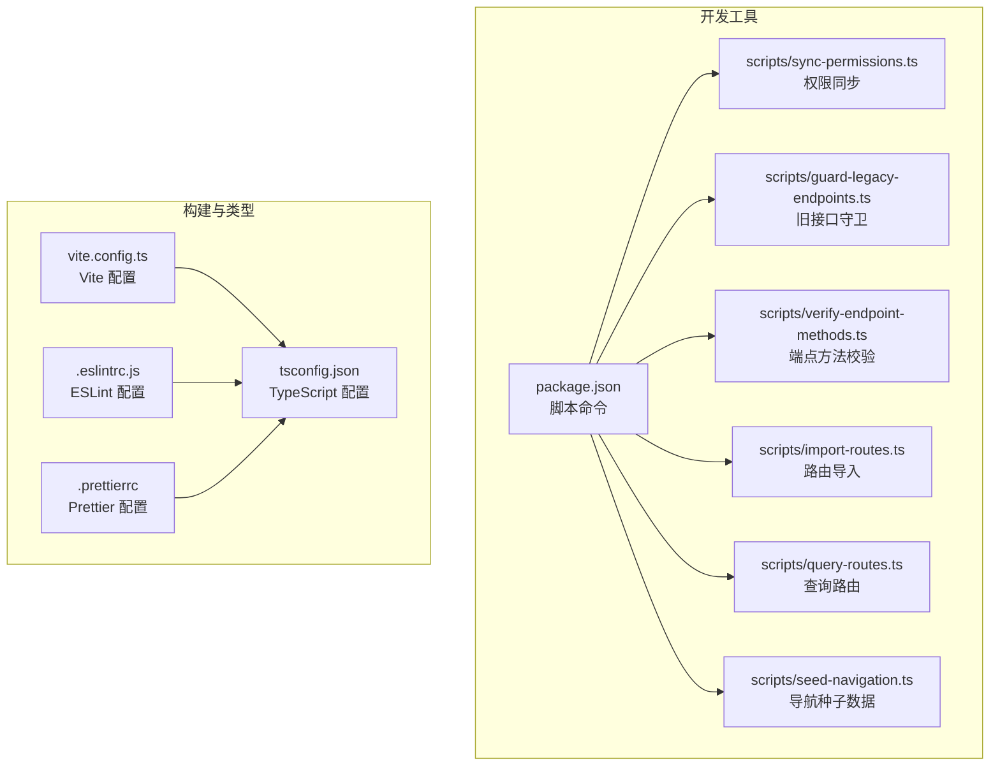
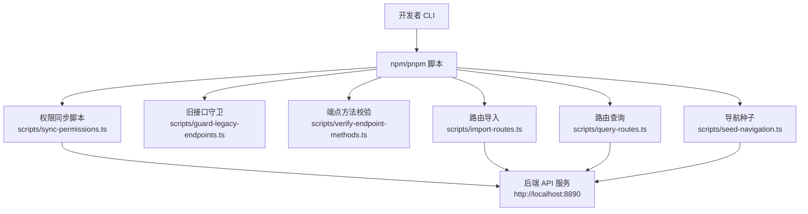
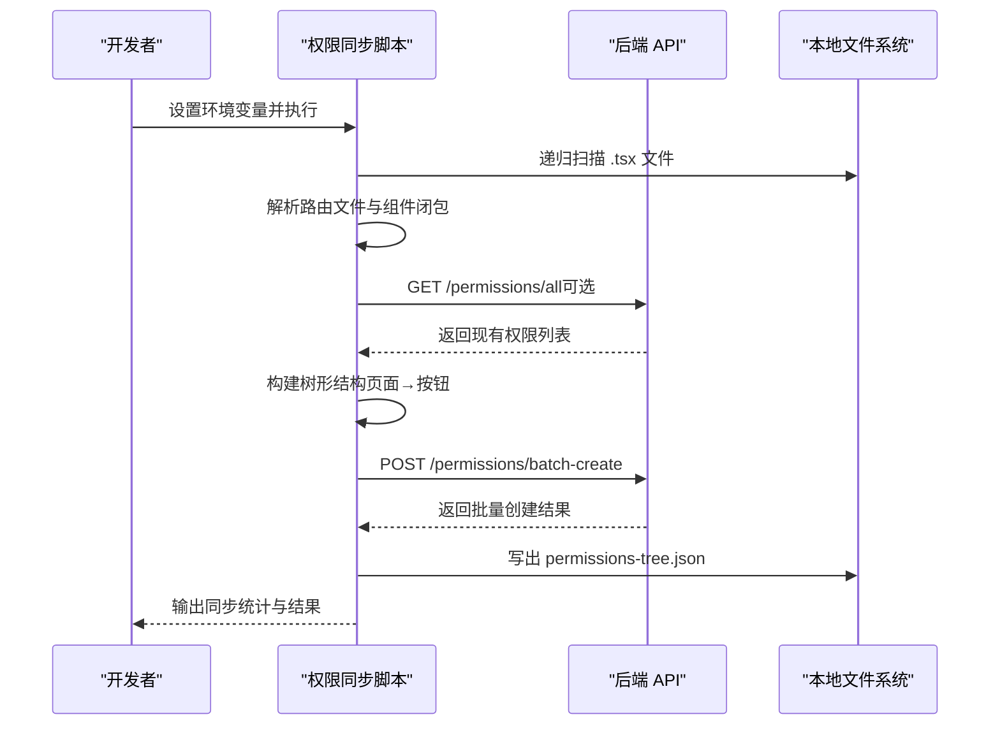
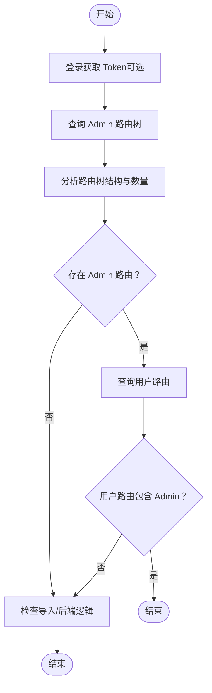
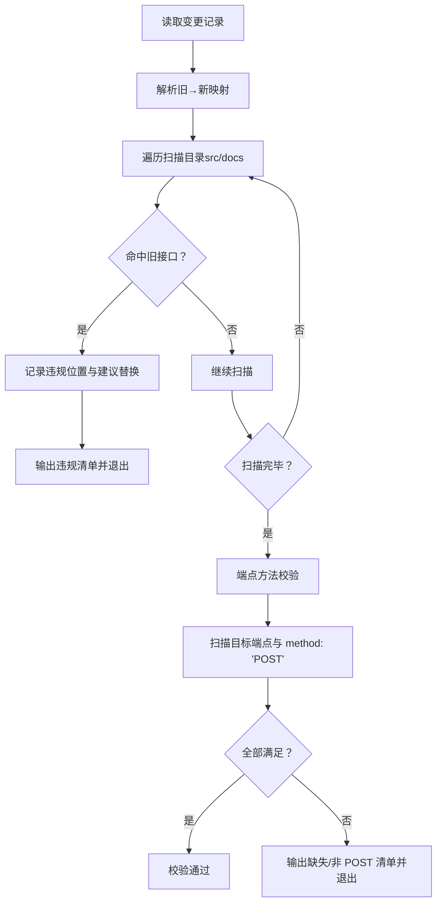
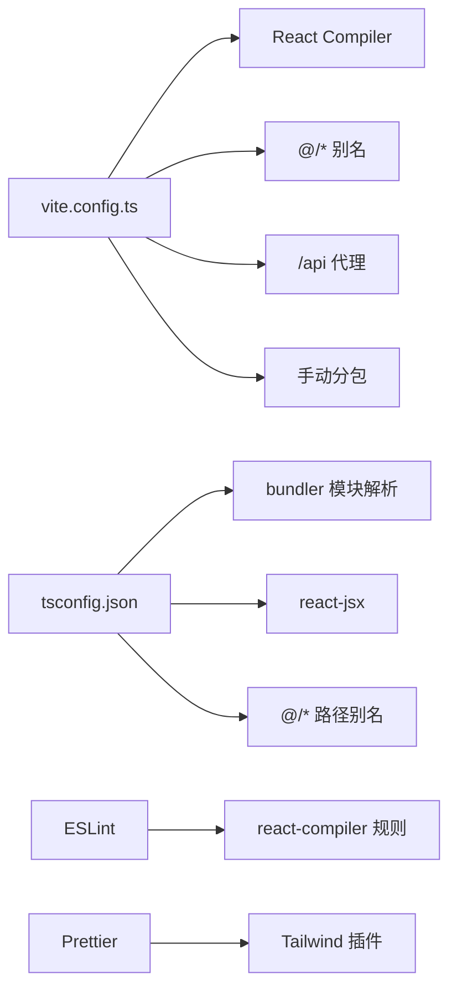

# 开发工具

<cite>
**本文引用的文件**
- [package.json](file://package.json)
- [vite.config.ts](file://vite.config.ts)
- [tsconfig.json](file://tsconfig.json)
- [.eslintrc.js](file://.eslintrc.js)
- [.prettierrc](file://.prettierrc)
- [scripts/sync-permissions.ts](file://scripts/sync-permissions.ts)
- [scripts/check-routes.ts](file://scripts/check-routes.ts)
- [scripts/import-routes.ts](file://scripts/import-routes.ts)
- [scripts/sync-routes.ts](file://scripts/sync-routes.ts)
- [scripts/check-routes-schema.mjs](file://scripts/check-routes-schema.mjs)
- [scripts/guard-legacy-endpoints.ts](file://scripts/guard-legacy-endpoints.ts)
- [scripts/verify-endpoint-methods.ts](file://scripts/verify-endpoint-methods.ts)
- [scripts/query-routes.ts](file://scripts/query-routes.ts)
- [scripts/query-db-routes.ts](file://scripts/query-db-routes.ts)
- [scripts/test-bounty-topics.ts](file://scripts/test-bounty-topics.ts)
- [scripts/fix-admin-route.ts](file://scripts/fix-admin-route.ts)
- [scripts/update-routes-components.mjs](file://scripts/update-routes-components.mjs)
- [scripts/seed-navigation.ts](file://scripts/seed-navigation.ts)
- [scripts/verify-login-error-message.ts](file://scripts/verify-login-error-message.ts)
</cite>

## 目录
1. [简介](#简介)
2. [项目结构](#项目结构)
3. [核心组件](#核心组件)
4. [架构总览](#架构总览)
5. [详细组件分析](#详细组件分析)
6. [依赖关系分析](#依赖关系分析)
7. [性能考虑](#性能考虑)
8. [故障排查指南](#故障排查指南)
9. [结论](#结论)
10. [附录](#附录)

## 简介
本指南面向开发团队，系统性介绍 zTorrent-site 项目的开发工具链与自动化脚本，涵盖权限同步、路由校验、API 生成、Vite 构建配置、TypeScript 类型检查、代码质量工具等。文档同时提供开发工作流程、代码规范与最佳实践，并附带常见问题排查方法，帮助开发者高效协作与交付。

## 项目结构
项目采用前端单页应用与后端 API 分离的典型结构，开发工具集中在 scripts 目录，配合 package.json 的脚本命令实现一键式开发与运维任务。

图表来源
- [package.json](file://package.json#L126-L139)
- [vite.config.ts](file://vite.config.ts#L1-L86)
- [tsconfig.json](file://tsconfig.json#L1-L44)
- [.eslintrc.js](file://.eslintrc.js#L1-L9)
- [.prettierrc](file://.prettierrc#L1-L13)

章节来源
- [package.json](file://package.json#L126-L139)
- [vite.config.ts](file://vite.config.ts#L1-L86)
- [tsconfig.json](file://tsconfig.json#L1-L44)
- [.eslintrc.js](file://.eslintrc.js#L1-L9)
- [.prettierrc](file://.prettierrc#L1-L13)

## 核心组件
- 权限同步脚本：自动扫描前端源码，提取页面与按钮权限键，结合后端接口权限，批量创建/更新权限树，并输出权限树 JSON。
- 路由校验与导入：提供路由导入、查询、数据库结构检查、导航种子数据注入等工具，保障路由与导航的一致性与完整性。
- 旧接口守卫与端点方法校验：从变更记录中提取旧→新映射，扫描代码与文档，确保关键端点以 POST 方法声明，避免回归。
- API 生成：通过本地 OpenAPI JSON 源生成前端 API 客户端代码，保持前后端契约一致。
- 构建与类型：Vite 配置启用 React Compiler、依赖预优化与分包策略；TypeScript 配置启用 bundler 模块解析与路径别名；ESLint 与 Prettier 统一风格与质量基线。

章节来源
- [scripts/sync-permissions.ts](file://scripts/sync-permissions.ts#L1-L718)
- [scripts/import-routes.ts](file://scripts/import-routes.ts#L1-L800)
- [scripts/query-routes.ts](file://scripts/query-routes.ts#L1-L112)
- [scripts/check-routes-schema.mjs](file://scripts/check-routes-schema.mjs#L1-L39)
- [scripts/seed-navigation.ts](file://scripts/seed-navigation.ts#L1-L259)
- [scripts/guard-legacy-endpoints.ts](file://scripts/guard-legacy-endpoints.ts#L1-L116)
- [scripts/verify-endpoint-methods.ts](file://scripts/verify-endpoint-methods.ts#L1-L104)
- [package.json](file://package.json#L130-L131)
- [vite.config.ts](file://vite.config.ts#L1-L86)
- [tsconfig.json](file://tsconfig.json#L1-L44)
- [.eslintrc.js](file://.eslintrc.js#L1-L9)
- [.prettierrc](file://.prettierrc#L1-L13)

## 架构总览
下图展示开发工具与后端 API 的交互关系，以及关键脚本的职责分工。

图表来源
- [package.json](file://package.json#L126-L139)
- [scripts/sync-permissions.ts](file://scripts/sync-permissions.ts#L1-L718)
- [scripts/guard-legacy-endpoints.ts](file://scripts/guard-legacy-endpoints.ts#L1-L116)
- [scripts/verify-endpoint-methods.ts](file://scripts/verify-endpoint-methods.ts#L1-L104)
- [scripts/import-routes.ts](file://scripts/import-routes.ts#L1-L800)
- [scripts/query-routes.ts](file://scripts/query-routes.ts#L1-L112)
- [scripts/seed-navigation.ts](file://scripts/seed-navigation.ts#L1-L259)

## 详细组件分析

### 权限同步脚本（权限树生成与上传）
- 功能概述
  - 扫描 src 下所有 .tsx 文件，提取页面与按钮权限键。
  - 从路由文件解析受保护页面路径与组件闭包。
  - 从后端拉取现有 API 权限记录，合并到注册表。
  - 构建树形结构（页面包含按钮子节点），批量上传至后端。
  - 输出 permissions-tree.json 便于审计与二次加工。
- 关键流程（序列图）

图表来源
- [scripts/sync-permissions.ts](file://scripts/sync-permissions.ts#L62-L99)
- [scripts/sync-permissions.ts](file://scripts/sync-permissions.ts#L218-L260)
- [scripts/sync-permissions.ts](file://scripts/sync-permissions.ts#L574-L598)
- [scripts/sync-permissions.ts](file://scripts/sync-permissions.ts#L459-L495)

- 使用步骤
  - 准备环境变量：API_BASE_URL、ACCESS_TOKEN。
  - 在项目根目录执行 npm run permissions:sync。
  - 检查 scripts/out/permissions-tree.json 与后端返回结果。
- 注意事项
  - 仅受 PermissionRoute 保护的页面会进入权限树。
  - 公开页面（如 /login、/register 等）不会被同步。
  - 如后端返回 /permissions/all 失败，脚本会降级处理并提示。

章节来源
- [scripts/sync-permissions.ts](file://scripts/sync-permissions.ts#L1-L718)

### 路由校验与导入工具
- 路由导入脚本（import-routes.ts）
  - 提供完整的路由配置数据（App/Forum/Admin 布局、排序、权限、可见性等）。
  - 作为后端导入的基准数据，确保路由树结构与权限一致。
- 路由查询脚本（query-routes.ts）
  - 登录获取 token（可从环境变量传入）。
  - 查询 Admin 路由树与用户可见路由，验证导入结果与权限过滤。
- 路由数据库结构检查（check-routes-schema.mjs）
  - 连接数据库，打印 routes 表字段与示例数据，辅助确认导入脚本的数据结构。
- 导航种子脚本（seed-navigation.ts）
  - 构造桌面/移动端导航树，尝试两种端点前缀策略，向后端导入导航数据。

图表来源
- [scripts/query-routes.ts](file://scripts/query-routes.ts#L14-L98)

章节来源
- [scripts/import-routes.ts](file://scripts/import-routes.ts#L1-L800)
- [scripts/query-routes.ts](file://scripts/query-routes.ts#L1-L112)
- [scripts/check-routes-schema.mjs](file://scripts/check-routes-schema.mjs#L1-L39)
- [scripts/seed-navigation.ts](file://scripts/seed-navigation.ts#L1-L259)

### 旧接口守卫与端点方法校验
- 旧接口守卫（guard-legacy-endpoints.ts）
  - 从变更记录中解析“旧 → 新”映射。
  - 扫描 src 与 docs，定位残留旧接口字符串，阻止引入。
- 端点方法校验（verify-endpoint-methods.ts）
  - 静态扫描关键新端点是否出现在代码中，并要求以 POST 方法声明。
  - 输出缺失与非 POST 声明的端点清单，便于快速回归。

图表来源
- [scripts/guard-legacy-endpoints.ts](file://scripts/guard-legacy-endpoints.ts#L10-L115)
- [scripts/verify-endpoint-methods.ts](file://scripts/verify-endpoint-methods.ts#L9-L103)

章节来源
- [scripts/guard-legacy-endpoints.ts](file://scripts/guard-legacy-endpoints.ts#L1-L116)
- [scripts/verify-endpoint-methods.ts](file://scripts/verify-endpoint-methods.ts#L1-L104)

### API 生成脚本
- 通过本地 OpenAPI JSON 源生成前端 API 客户端代码，确保类型安全与契约一致。
- 命令：npm run api:generate
- 步骤
  - 从本地后端导出 OpenAPI JSON。
  - 使用 openapi-typescript-codegen 生成客户端代码到 src/api。
  - 生成后可直接在前端通过 OpenAPI.ts 与各 Service 调用后端接口。

章节来源
- [package.json](file://package.json#L130-L131)

### Vite 构建配置与优化
- 插件与编译
  - 启用 @vitejs/plugin-react，并集成 babel-plugin-react-compiler，针对 React 19 进行优化。
  - 依赖预优化与去重（react、react-dom），提升冷启动与热更新性能。
- 代理与开发体验
  - /api 与 /uploads 代理到后端服务，支持本地联调。
  - 文件监听使用轮询，适配部分开发环境的文件系统行为。
- 构建优化
  - 启用 esbuild 压缩与 Source Map。
  - 手动分包策略：react-vendor、ui-vendor、data-vendor、chart-vendor、utils-vendor。
  - 定义全局环境变量（如 VITE_BASE_URL）。
- 性能可视化
  - 可选开启 rollup-plugin-visualizer 生成打包分析报告。

章节来源
- [vite.config.ts](file://vite.config.ts#L1-L86)

### TypeScript 配置与类型检查
- 编译目标与模块解析
  - 目标 ES2020，模块解析采用 bundler，JSX 使用 react-jsx。
  - 启用 isolatedModules 与 noEmit，结合 tsc --noEmit 实现类型检查。
- 路径别名与类型声明
  - baseUrl 与 paths 配置 @/* → src/*。
  - types 显式声明 node、express、react、react-dom、vite/client。
- 包含与排除
  - include 覆盖 src、api、vite.config.ts。
  - 排除 dist、node_modules 与特定备份文件。

章节来源
- [tsconfig.json](file://tsconfig.json#L1-L44)

### 代码质量工具（ESLint 与 Prettier）
- ESLint
  - 启用 eslint-plugin-react-compiler，强制使用 React Compiler 规则。
- Prettier
  - 集成 prettier-plugin-classnames 与 prettier-plugin-tailwindcss。
  - 配置 Tailwind 属性与函数识别，统一 className/类名格式化。

章节来源
- [.eslintrc.js](file://.eslintrc.js#L1-L9)
- [.prettierrc](file://.prettierrc#L1-L13)

## 依赖关系分析
- 脚本与后端 API 的耦合
  - 权限同步、路由导入、导航种子、路由查询均依赖后端接口。
  - 旧接口守卫与端点方法校验为纯静态扫描，不依赖后端。
- 构建与类型工具链
  - Vite 与 React Compiler 协同优化前端构建。
  - TypeScript 与 ESLint/Prettier 共同约束代码风格与类型安全。

图表来源
- [vite.config.ts](file://vite.config.ts#L1-L86)
- [tsconfig.json](file://tsconfig.json#L1-L44)
- [.eslintrc.js](file://.eslintrc.js#L1-L9)
- [.prettierrc](file://.prettierrc#L1-L13)

章节来源
- [vite.config.ts](file://vite.config.ts#L1-L86)
- [tsconfig.json](file://tsconfig.json#L1-L44)
- [.eslintrc.js](file://.eslintrc.js#L1-L9)
- [.prettierrc](file://.prettierrc#L1-L13)

## 性能考虑
- 构建阶段
  - 使用 esbuild 压缩与 Source Map，平衡体积与调试体验。
  - 手动分包策略减少重复依赖，提升缓存命中率。
- 开发阶段
  - 依赖预优化与去重，缩短首次启动时间。
  - 代理与轮询监听提升跨平台开发稳定性。
- 建议
  - 定期使用 visualizer 分析包体构成，识别超大依赖。
  - 控制第三方库体积，优先选择 Tree-shaking 友好的包。

## 故障排查指南
- 权限同步失败
  - 确认 API_BASE_URL 与 ACCESS_TOKEN 设置正确。
  - 检查后端 /permissions/all 是否可用，关注网络与鉴权错误。
  - 查看 scripts/out/permissions-tree.json 与后端返回数据比对。
- 路由导入后 Admin 不显示
  - 使用 scripts/fix-admin-route.ts 将 Admin 根路由 parent_id 设为 null。
  - 使用 scripts/query-routes.ts 验证用户路由是否包含 Admin。
- 导航种子导入 404
  - 使用 scripts/seed-navigation.ts 的双前缀策略（带/不带 /api）。
  - 确认后端端点实际路径与版本。
- 旧接口残留或非 POST 端点
  - 运行 npm run endpoints:guard 与 npm run endpoints:test，按提示修正。
- API 生成失败
  - 确保本地后端可访问并导出 OpenAPI JSON。
  - 检查 openapi-typescript-codegen 输出目录权限。

章节来源
- [scripts/sync-permissions.ts](file://scripts/sync-permissions.ts#L62-L99)
- [scripts/fix-admin-route.ts](file://scripts/fix-admin-route.ts#L1-L93)
- [scripts/query-routes.ts](file://scripts/query-routes.ts#L1-L112)
- [scripts/seed-navigation.ts](file://scripts/seed-navigation.ts#L206-L259)
- [scripts/guard-legacy-endpoints.ts](file://scripts/guard-legacy-endpoints.ts#L1-L116)
- [scripts/verify-endpoint-methods.ts](file://scripts/verify-endpoint-methods.ts#L1-L104)
- [package.json](file://package.json#L130-L131)

## 结论
本项目通过完善的开发工具链实现了权限、路由、导航与 API 的自动化与一致性保障。借助 Vite 与 TypeScript 的现代化配置，配合 ESLint/Prettier 的质量基线，团队可以高效迭代并维持高质量交付。建议在日常开发中：
- 严格遵循端点方法校验与旧接口守卫流程。
- 使用权限同步与路由查询工具定期核对后端状态。
- 通过 API 生成脚本保持前后端契约一致。
- 持续优化分包与依赖，关注构建体积与加载性能。

## 附录
- 常用脚本命令
  - 开发：npm run dev
  - 权限同步：npm run permissions:sync
  - 旧接口守卫：npm run endpoints:guard
  - 端点方法校验：npm run endpoints:test
  - API 生成：npm run api:generate
  - 类型检查：npm run typecheck
- 环境变量
  - API_BASE_URL：后端基础地址
  - ACCESS_TOKEN：管理员 JWT
  - ADMIN_USER/ADMIN_PASS：登录凭据（用于查询脚本）
- 路由与导航
  - 使用 scripts/import-routes.ts 作为导入基准。
  - 使用 scripts/seed-navigation.ts 注入导航数据。
  - 使用 scripts/query-db-routes.ts 与 scripts/check-routes-schema.mjs 检查数据库结构。

章节来源
- [package.json](file://package.json#L126-L139)
- [scripts/query-db-routes.ts](file://scripts/query-db-routes.ts#L1-L90)
- [scripts/check-routes-schema.mjs](file://scripts/check-routes-schema.mjs#L1-L39)
- [scripts/seed-navigation.ts](file://scripts/seed-navigation.ts#L1-L259)
- [scripts/import-routes.ts](file://scripts/import-routes.ts#L1-L800)
- [scripts/query-routes.ts](file://scripts/query-routes.ts#L1-L112)