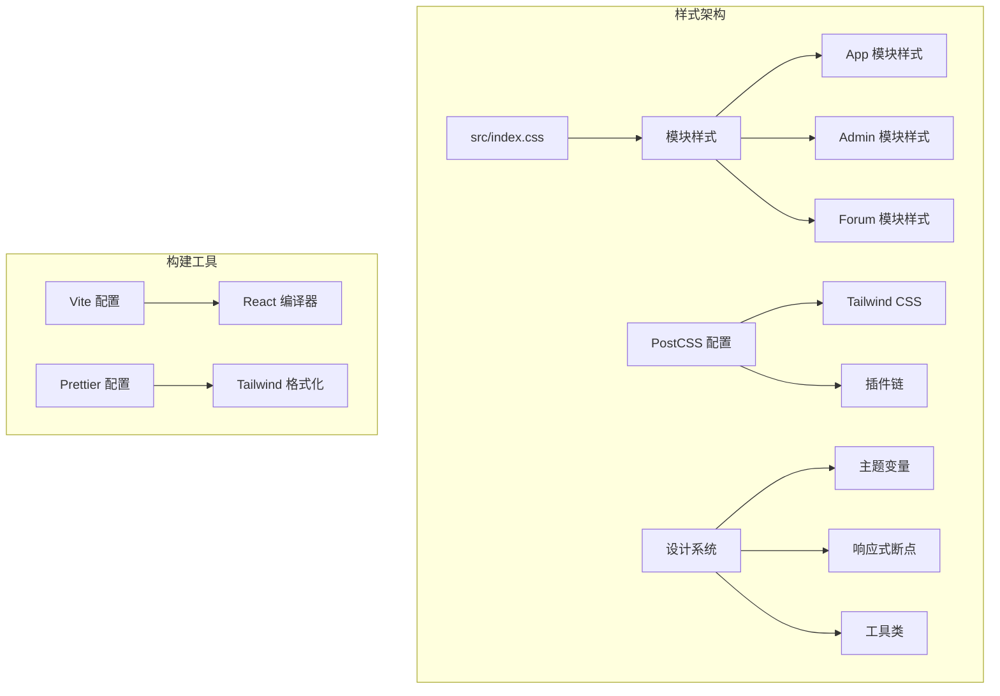
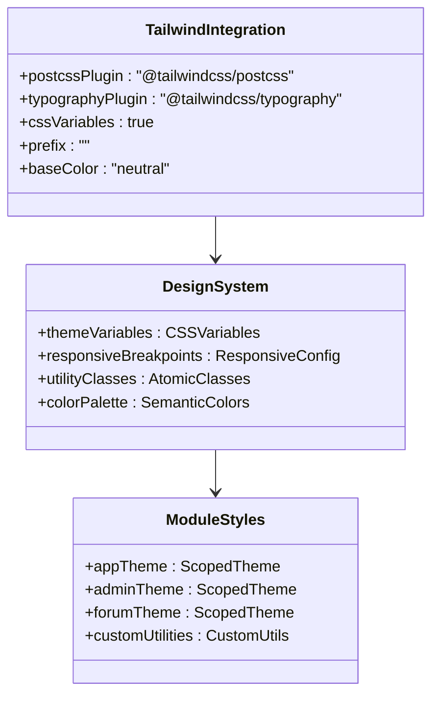
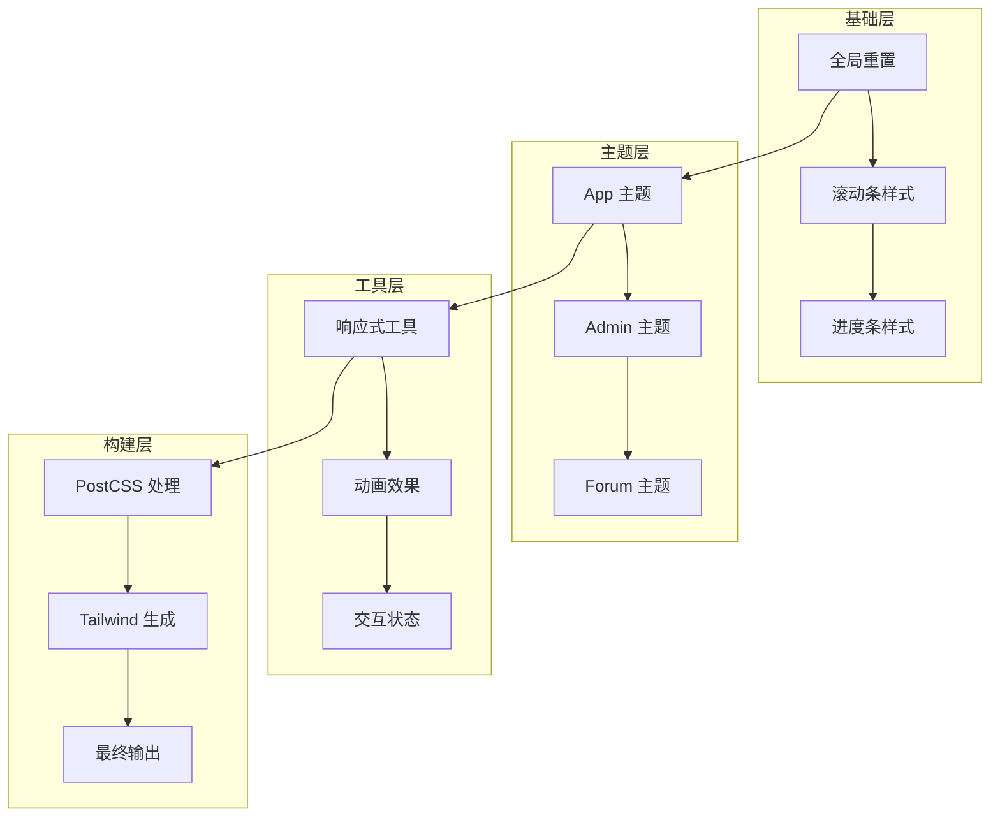
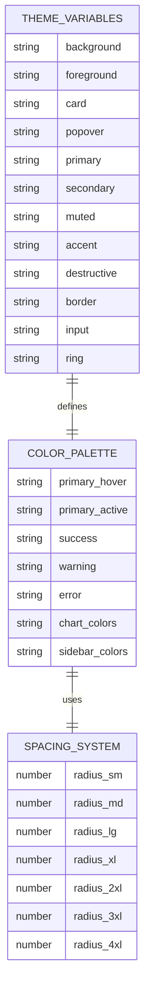
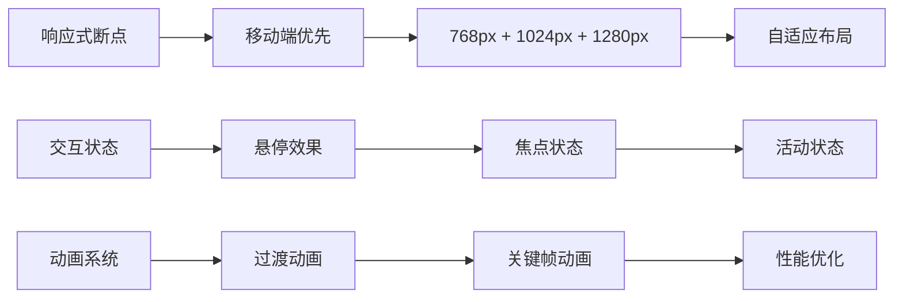
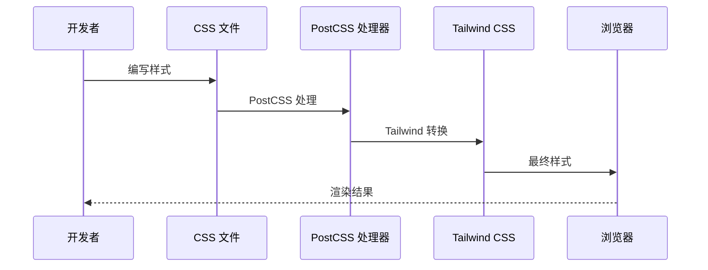
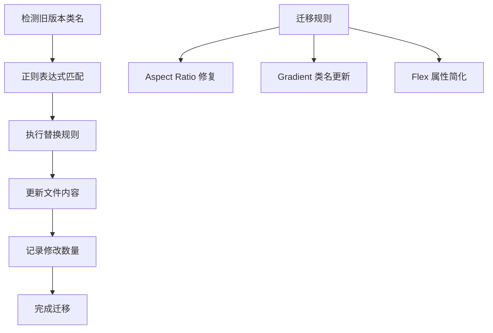

# PostCSS 配置

<cite>
**本文档引用的文件**
- [postcss.config.mjs](file://postcss.config.mjs)
- [package.json](file://package.json)
- [src/index.css](file://src/index.css)
- [components.json](file://components.json)
- [.prettierrc](file://.prettierrc)
- [vite.config.ts](file://vite.config.ts)
- [migrate-tw.mjs](file://migrate-tw.mjs)
- [src/modules/app/app.css](file://src/modules/app/app.css)
- [src/modules/admin/admin.css](file://src/modules/admin/admin.css)
- [src/modules/forum/forum.css](file://src/modules/forum/forum.css)
</cite>

## 目录
1. [简介](#简介)
2. [项目结构](#项目结构)
3. [核心组件](#核心组件)
4. [架构概览](#架构概览)
5. [详细组件分析](#详细组件分析)
6. [依赖关系分析](#依赖关系分析)
7. [性能考虑](#性能考虑)
8. [故障排除指南](#故障排除指南)
9. [结论](#结论)
10. [附录](#附录)

## 简介

本项目采用 PostCSS 作为 CSS 处理管道的核心工具，结合 Tailwind CSS 实现原子化样式开发，并通过预处理器增强样式功能。项目实现了模块化的样式架构，支持多主题设计系统、响应式设计和跨浏览器兼容性。

该配置文档详细说明了 PostCSS 插件链配置、Tailwind CSS 集成、CSS 预处理器设置，以及样式工具链的工作原理。同时提供了自定义属性配置、响应式设计支持、样式优化策略、性能调优技巧和跨浏览器兼容性解决方案。

## 项目结构

项目采用模块化架构，每个功能模块都有独立的样式文件和主题配置：



**图表来源**
- [src/index.css](file://src/index.css#L1-L76)
- [postcss.config.mjs](file://postcss.config.mjs#L1-L6)
- [components.json](file://components.json#L1-L23)

**章节来源**
- [src/index.css](file://src/index.css#L1-L76)
- [postcss.config.mjs](file://postcss.config.mjs#L1-L6)
- [components.json](file://components.json#L1-L23)

## 核心组件

### PostCSS 插件链配置

项目使用最小化的 PostCSS 配置，专注于 Tailwind CSS 集成：

```mermaid
flowchart TD
A[PostCSS 配置] --> B[@tailwindcss/postcss]
B --> C[Tailwind CSS 处理]
C --> D[原子化类生成]
D --> E[样式输出]
F[插件配置] --> G[无其他插件]
G --> H[保持简洁]
```

**图表来源**
- [postcss.config.mjs](file://postcss.config.mjs#L1-L6)

### Tailwind CSS 集成

Tailwind CSS 通过专用插件进行集成，支持最新的 v4 特性：



**图表来源**
- [postcss.config.mjs](file://postcss.config.mjs#L1-L6)
- [components.json](file://components.json#L6-L12)

**章节来源**
- [postcss.config.mjs](file://postcss.config.mjs#L1-L6)
- [components.json](file://components.json#L6-L12)

## 架构概览

项目采用分层架构，从基础样式到模块化主题的完整样式体系：



**图表来源**
- [src/index.css](file://src/index.css#L16-L76)
- [src/modules/app/app.css](file://src/modules/app/app.css#L1-L278)
- [src/modules/admin/admin.css](file://src/modules/admin/admin.css#L1-L393)
- [src/modules/forum/forum.css](file://src/modules/forum/forum.css#L1-L195)

## 详细组件分析

### 设计系统架构

项目实现了完整的 CSS 变量驱动设计系统：



**图表来源**
- [src/modules/app/app.css](file://src/modules/app/app.css#L1-L156)
- [src/modules/admin/admin.css](file://src/modules/admin/admin.css#L1-L107)
- [src/modules/forum/forum.css](file://src/modules/forum/forum.css#L1-L57)

#### App 模块主题配置

App 模块采用深色主题设计，具有完整的变量映射：

| 变量类别 | 变量名称 | 值类型 | 用途 |
|---------|----------|--------|------|
| 基础颜色 | --background, --foreground | OKLCH 颜色 | 页面背景和前景色 |
| 主要颜色 | --primary, --primary-foreground | 橙色系 | 品牌强调色 |
| 辅助颜色 | --success, --warning, --error | 状态颜色 | 信息反馈 |
| 圆角系统 | --radius-sm 到 --radius-4xl | 尺寸变量 | 组件圆角控制 |

**章节来源**
- [src/modules/app/app.css](file://src/modules/app/app.css#L62-L156)

#### Admin 模块主题配置

Admin 模块采用 Ant Design 风格的亮色主题：

| 颜色类别 | 变量名称 | 颜色值 | 用途 |
|---------|----------|--------|------|
| 品牌色 | --primary, --primary-hover, --primary-active | 蓝色系渐变 | 主要操作按钮 |
| 成功色 | --success, --success-hover, --success-active | 绿色系 | 成功状态 |
| 警告色 | --warning, --warning-hover, --warning-active | 黄色系 | 警告状态 |
| 错误色 | --error, --error-hover, --error-active | 红色系 | 错误状态 |

**章节来源**
- [src/modules/admin/admin.css](file://src/modules/admin/admin.css#L28-L107)

#### Forum 模块主题配置

Forum 模块采用 Indigo 色彩方案，支持深色模式：

| 配置项 | 变量名称 | 值 | 说明 |
|-------|----------|----|------|
| 基础色 | --forum-primary | #6366f1 | 论坛主色调 |
| 圆角系统 | --radius 到 --radius-4xl | 0.5rem 基准 | 组件圆角 |
| 深色模式 | --primary-bg | #312e81 | 深色背景色 |

**章节来源**
- [src/modules/forum/forum.css](file://src/modules/forum/forum.css#L13-L73)

### 响应式设计系统

项目实现了灵活的响应式设计系统，支持多种断点和交互模式：



**图表来源**
- [src/modules/app/app.css](file://src/modules/app/app.css#L178-L187)

### 样式工具链

项目采用多层样式处理机制：



**图表来源**
- [src/index.css](file://src/index.css#L1-L10)
- [postcss.config.mjs](file://postcss.config.mjs#L1-L6)

**章节来源**
- [src/index.css](file://src/index.css#L1-L10)
- [postcss.config.mjs](file://postcss.config.mjs#L1-L6)

## 依赖关系分析

项目依赖关系清晰，主要依赖包括：

```mermaid
graph TB
subgraph "核心依赖"
A[tailwindcss ^4.1.18] --> B[PostCSS 处理器]
C[@tailwindcss/postcss latest] --> D[插件集成]
E[@tailwindcss/typography ^0.5.19] --> F[排版增强]
end
subgraph "开发依赖"
G[postcss ^8.5.6] --> H[基础处理]
I[vite ^6.3.5] --> J[构建工具]
K[prettier-plugin-tailwindcss ^0.7.2] --> L[代码格式化]
end
subgraph "运行时依赖"
M[framer-motion] --> N[动画库]
O[react-router-dom] --> P[路由支持]
Q[sonner] --> R[通知系统]
end
```

**图表来源**
- [package.json](file://package.json#L93-L125)

**章节来源**
- [package.json](file://package.json#L93-L125)

## 性能考虑

### 样式优化策略

项目采用了多项性能优化措施：

1. **按需加载**: 通过模块化组织，只加载必要的样式
2. **CSS 变量缓存**: 利用 CSS 变量减少重复计算
3. **动画优化**: 使用 transform 和 opacity 属性触发硬件加速
4. **滚动条优化**: 自定义滚动条样式，减少重绘

### 构建优化

Vite 配置中的性能优化包括：

- **代码分割**: 将第三方库分离到独立 chunk
- **压缩优化**: 启用生产环境压缩
- **缓存策略**: 利用浏览器缓存机制
- **源码映射**: 生产环境启用 sourcemap

**章节来源**
- [vite.config.ts](file://vite.config.ts#L60-L79)

## 故障排除指南

### 常见问题及解决方案

#### Tailwind CSS v4 迁移问题

项目提供了专门的迁移脚本处理版本升级：



**图表来源**
- [migrate-tw.mjs](file://migrate-tw.mjs#L8-L69)

#### 样式冲突解决

当不同模块样式发生冲突时，可以采用以下策略：

1. **作用域隔离**: 使用 `:root[data-theme="module"]` 限定作用域
2. **变量覆盖**: 在模块级别重新定义 CSS 变量
3. **优先级控制**: 使用特定选择器提高样式优先级
4. **层叠管理**: 合理使用 `@layer` 指令

**章节来源**
- [migrate-tw.mjs](file://migrate-tw.mjs#L85-L112)
- [src/modules/admin/admin.css](file://src/modules/admin/admin.css#L316-L393)

## 结论

本项目的 PostCSS 配置展现了现代前端样式的最佳实践：

1. **简洁高效**: 最小化的插件配置确保了高效的构建流程
2. **模块化设计**: 清晰的模块化样式架构支持团队协作
3. **设计系统**: 完整的 CSS 变量设计系统提供了良好的可维护性
4. **性能优化**: 多层次的性能优化策略确保了优秀的用户体验
5. **工具链完善**: 从开发到生产的完整工具链支持

该配置为大型项目的样式管理提供了可靠的基础设施，支持团队协作和长期维护。

## 附录

### 配置参考

#### PostCSS 配置参数

| 参数 | 类型 | 默认值 | 说明 |
|------|------|--------|------|
| plugins | Object | {} | 插件配置对象 |
| @tailwindcss/postcss | String | "" | Tailwind CSS 插件 |
| @tailwindcss/typography | String | "" | 排版增强插件 |

#### Tailwind CSS 配置参数

| 参数 | 类型 | 默认值 | 说明 |
|------|------|--------|------|
| css | String | "" | CSS 文件路径 |
| config | String | "" | 配置文件路径 |
| baseColor | String | "slate" | 基础颜色主题 |
| cssVariables | Boolean | false | 是否使用 CSS 变量 |
| prefix | String | "" | 类名前缀 |

**章节来源**
- [components.json](file://components.json#L6-L12)
- [postcss.config.mjs](file://postcss.config.mjs#L1-L6)