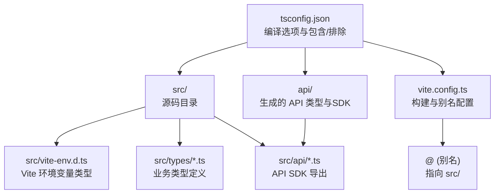
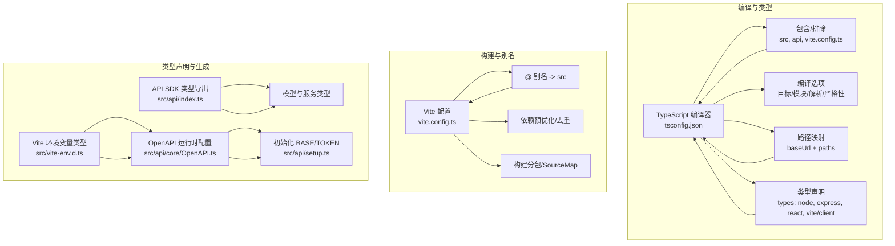
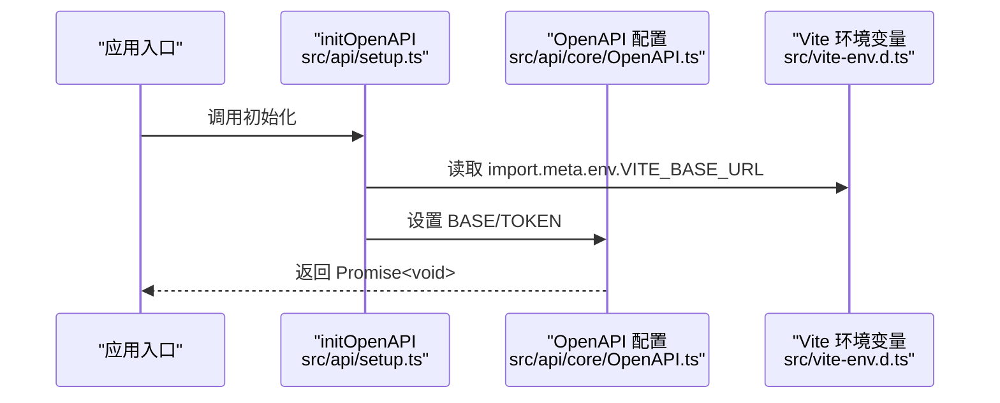
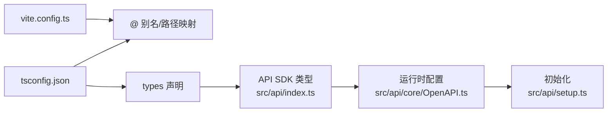

# TypeScript 配置

<cite>
**本文引用的文件**
- [tsconfig.json](file://tsconfig.json)
- [package.json](file://package.json)
- [vite.config.ts](file://vite.config.ts)
- [src/vite-env.d.ts](file://src/vite-env.d.ts)
- [src/types/routeConfig.ts](file://src/types/routeConfig.ts)
- [src/api/index.ts](file://src/api/index.ts)
- [src/api/setup.ts](file://src/api/setup.ts)
- [src/api/core/OpenAPI.ts](file://src/api/core/OpenAPI.ts)
- [src/api/core/ApiResult.ts](file://src/api/core/ApiResult.ts)
- [src/modules/admin/types/navigation.ts](file://src/modules/admin/types/navigation.ts)
- [src/modules/admin/types/store.ts](file://src/modules/admin/types/store.ts)
</cite>

## 目录
1. [简介](#简介)
2. [项目结构](#项目结构)
3. [核心组件](#核心组件)
4. [架构总览](#架构总览)
5. [详细组件分析](#详细组件分析)
6. [依赖关系分析](#依赖关系分析)
7. [性能考量](#性能考量)
8. [故障排查指南](#故障排查指南)
9. [结论](#结论)
10. [附录](#附录)

## 简介
本指南围绕项目中的 TypeScript 编译配置进行系统化说明，重点覆盖以下方面：
- 编译选项详解：目标环境、模块系统、模块解析、JSX、JSON 模块、隔离模块、输出控制、路径映射与类型声明注入等
- 类型声明组织：全局类型、第三方库类型、Vite 环境变量类型声明
- 严格性与输出：如何在开发与生产构建中平衡严格性与性能
- 类型安全最佳实践：接口设计、开放属性、工具类型使用、运行时校验
- 性能优化：增量检查、排除目录、别名与路径映射、打包与分包策略
- 常见问题与解决方案：类型缺失、路径解析失败、环境变量类型报错、生成 SDK 的类型一致性
- 实际项目示例与重构建议：动态路由配置、API SDK 类型导出、模块内类型定义

## 项目结构
本项目采用前端工程化与模块化结合的结构，TypeScript 配置位于仓库根目录，配合 Vite 构建工具与大量自动生成的 API 类型文件，形成“配置驱动 + 代码生成”的类型体系。

图表来源
- [tsconfig.json](file://tsconfig.json#L1-L44)
- [vite.config.ts](file://vite.config.ts#L29-L34)
- [src/vite-env.d.ts](file://src/vite-env.d.ts#L1-L10)

章节来源
- [tsconfig.json](file://tsconfig.json#L1-L44)
- [vite.config.ts](file://vite.config.ts#L1-L86)

## 核心组件
- 编译器选项与包含/排除
  - 目标与库：ES2020 与 DOM/DOM.Iterable
  - 模块与解析：ESNext 与 bundler
  - JSX：react-jsx
  - JSON 模块：允许导入 .json
  - 隔离模块：noEmit + isolatedModules
  - 路径映射：baseUrl 与 paths
  - 类型声明：types 注入 node、express、react、react-dom、vite/client
  - 包含/排除：src、api、vite.config.ts 及部分脚本
- Vite 配置与别名
  - 别名 @ 指向 src
  - 依赖预优化与去重
  - 开发服务器代理与端口
  - 构建分包策略与 SourceMap
- 环境变量类型声明
  - Vite 环境变量接口与只读约束
- 自动生成的 API 类型与运行时配置
  - OpenAPI 配置对象与运行时初始化
  - API SDK 导出的模型与服务类型

章节来源
- [tsconfig.json](file://tsconfig.json#L2-L31)
- [vite.config.ts](file://vite.config.ts#L29-L84)
- [src/vite-env.d.ts](file://src/vite-env.d.ts#L1-L10)
- [src/api/core/OpenAPI.ts](file://src/api/core/OpenAPI.ts#L1-L33)
- [src/api/index.ts](file://src/api/index.ts#L1-L642)

## 架构总览
TypeScript 配置与构建工具协同工作，形成“类型检查 → 代码生成 → 构建优化”的闭环。

图表来源
- [tsconfig.json](file://tsconfig.json#L1-L44)
- [vite.config.ts](file://vite.config.ts#L1-L86)
- [src/vite-env.d.ts](file://src/vite-env.d.ts#L1-L10)
- [src/api/core/OpenAPI.ts](file://src/api/core/OpenAPI.ts#L1-L33)
- [src/api/index.ts](file://src/api/index.ts#L1-L642)
- [src/api/setup.ts](file://src/api/setup.ts#L1-L35)

## 详细组件分析

### 编译选项与路径映射
- 目标与库
  - 目标版本与内置库的选择影响可用 API 与 polyfill 需求
- 模块与解析
  - ESNext + bundler 解析适配现代打包器，减少运行时模块转换开销
- JSX 与 JSON
  - JSX 选择 react-jsx，JSON 模块允许直接导入 JSON
- 隔离模块与输出
  - noEmit + isolatedModules 适合仅做类型检查的场景（如 ESLint 插件）
- 路径映射与 baseUrl
  - 通过 baseUrl 与 paths 将 @ 映射到 src，提升导入可读性与维护性
- 类型声明注入
  - types 注入 node、express、react、react-dom、vite/client，确保全局类型可用

章节来源
- [tsconfig.json](file://tsconfig.json#L2-L31)

### Vite 别名与开发体验
- 别名配置
  - @ 指向 src，与 tsconfig 的 paths 对应，保证编辑器与编译器一致
- 依赖预优化与去重
  - optimizeDeps.include 与 dedupe 避免重复打包与运行时冲突
- 开发服务器
  - 端口、轮询监听、代理规则，便于前后端联调
- 构建分包与 SourceMap
  - 手动分包策略将常用库拆分为独立 chunk，提升缓存命中率；开启 SourceMap 便于调试

章节来源
- [vite.config.ts](file://vite.config.ts#L29-L84)

### 环境变量类型声明
- Vite 环境变量接口
  - ImportMetaEnv 定义 VITE_BASE_URL 等只读字段，避免硬编码字符串
- 使用建议
  - 通过 define 配置在构建期注入，运行时通过 import.meta.env 访问

章节来源
- [src/vite-env.d.ts](file://src/vite-env.d.ts#L1-L10)
- [vite.config.ts](file://vite.config.ts#L81-L84)

### 自动生成的 API 类型与运行时配置
- SDK 导出
  - src/api/index.ts 汇总导出模型与服务类型，便于上层组件直接引用
- 运行时配置
  - OpenAPI 配置对象提供 BASE、TOKEN 等运行时参数
  - initOpenAPI 负责初始化 BASE 与 TOKEN，并保证幂等
- 类型一致性
  - 通过 OpenAPIConfig 接口约束配置项，避免运行时类型不一致

图表来源
- [src/api/setup.ts](file://src/api/setup.ts#L18-L34)
- [src/api/core/OpenAPI.ts](file://src/api/core/OpenAPI.ts#L22-L32)
- [src/vite-env.d.ts](file://src/vite-env.d.ts#L3-L8)

章节来源
- [src/api/index.ts](file://src/api/index.ts#L1-L642)
- [src/api/core/OpenAPI.ts](file://src/api/core/OpenAPI.ts#L1-L33)
- [src/api/setup.ts](file://src/api/setup.ts#L1-L35)

### 类型声明组织与模块类型扩展
- 全局类型
  - 通过 tsconfig 的 types 字段引入 node、express、react、react-dom、vite/client
- 业务类型
  - src/types 下存放通用类型（如路由配置）
  - 模块内 types 存放模块专用类型（如 admin/store、admin/navigation）
- 类型扩展
  - 可通过模块声明或合并接口的方式扩展第三方库类型（例如在 src/types 下新增声明文件）

章节来源
- [tsconfig.json](file://tsconfig.json#L25-L31)
- [src/types/routeConfig.ts](file://src/types/routeConfig.ts#L1-L49)
- [src/modules/admin/types/navigation.ts](file://src/modules/admin/types/navigation.ts#L1-L13)
- [src/modules/admin/types/store.ts](file://src/modules/admin/types/store.ts#L1-L91)

### 动态路由配置类型
- 设计要点
  - 使用联合类型约束布局类型
  - 使用可选字段表达可选行为（权限、图标、可见性等）
  - 支持嵌套子路由，便于构建复杂导航树
- 最佳实践
  - 为每个字段添加注释，明确用途
  - 使用布尔字段区分启用状态与可见性
  - 保持字段命名一致性，便于序列化/反序列化

章节来源
- [src/types/routeConfig.ts](file://src/types/routeConfig.ts#L1-L49)

### 模块内类型定义示例
- 导航类型
  - 平台、排序、父子关系、权限等字段清晰表达导航结构
- 商店类型
  - 商品与订单的状态枚举、价格点、数量等字段约束数据形态
- 最佳实践
  - 使用字面量联合类型表达状态机
  - 对可选字段使用可空类型，避免隐式 undefined
  - 通过 DTO 类型约束 API 请求/响应结构

章节来源
- [src/modules/admin/types/navigation.ts](file://src/modules/admin/types/navigation.ts#L1-L13)
- [src/modules/admin/types/store.ts](file://src/modules/admin/types/store.ts#L1-L91)

## 依赖关系分析
- TypeScript 配置与 Vite 的耦合
  - tsconfig 的 paths 与 baseUrl 必须与 vite.config.ts 的 alias 保持一致
- 类型声明与第三方库
  - types 字段确保 Node/Express/React/Vite 等类型可用
- 生成 SDK 与运行时
  - OpenAPI 配置与 initOpenAPI 形成运行时契约，确保 BASE/TOKEN 一致

图表来源
- [tsconfig.json](file://tsconfig.json#L19-L31)
- [vite.config.ts](file://vite.config.ts#L29-L34)
- [src/api/index.ts](file://src/api/index.ts#L1-L642)
- [src/api/core/OpenAPI.ts](file://src/api/core/OpenAPI.ts#L1-L33)
- [src/api/setup.ts](file://src/api/setup.ts#L1-L35)

章节来源
- [tsconfig.json](file://tsconfig.json#L1-L44)
- [vite.config.ts](file://vite.config.ts#L1-L86)

## 性能考量
- 类型检查性能
  - 使用 include/exclude 精准限定检查范围，避免不必要的扫描
  - skipLibCheck 可降低第三方库类型检查成本（谨慎使用）
- 构建性能
  - optimizeDeps.include 与 dedupe 减少重复依赖
  - 手动分包策略将大体积库拆分，提升缓存复用
  - SourceMap 在开发阶段开启，生产按需开启
- 编译器选项
  - isolatedModules + noEmit 适合仅做类型检查的流水线
  - moduleResolution: bundler 与现代打包器更契合

章节来源
- [tsconfig.json](file://tsconfig.json#L18-L19)
- [vite.config.ts](file://vite.config.ts#L35-L79)

## 故障排查指南
- 路径解析失败
  - 确认 tsconfig 的 baseUrl 与 paths 与 vite.config.ts 的 alias 一致
- 环境变量类型报错
  - 在 src/vite-env.d.ts 中补充缺失的 VITE_* 变量类型
- 生成 SDK 类型不一致
  - 确保 OpenAPI.BASE 与 initOpenAPI 的初始化逻辑一致
- 第三方类型缺失
  - 在 tsconfig 的 types 中添加所需类型包，或通过 @types 安装
- 类型检查过慢
  - 检查 include/exclude 是否过于宽泛，必要时缩小范围

章节来源
- [tsconfig.json](file://tsconfig.json#L19-L31)
- [vite.config.ts](file://vite.config.ts#L29-L34)
- [src/vite-env.d.ts](file://src/vite-env.d.ts#L1-L10)
- [src/api/core/OpenAPI.ts](file://src/api/core/OpenAPI.ts#L1-L33)
- [src/api/setup.ts](file://src/api/setup.ts#L18-L34)

## 结论
本项目的 TypeScript 配置以“明确的编译选项 + Vite 别名 + 自动生成的 API 类型”为核心，既保证了开发体验，又确保了类型安全与构建性能。遵循本文档的组织方式与最佳实践，可在大型前端项目中实现可维护、可扩展的类型体系。

## 附录
- 常用编译选项速查
  - target/lib/module/moduleResolution/jsx/resolveJsonModule/isolatedModules/noEmit/esModuleInterop/allowSyntheticDefaultImports/skipLibCheck/baseUrl/paths/types/include/exclude
- 关键文件清单
  - tsconfig.json、vite.config.ts、src/vite-env.d.ts、src/api/index.ts、src/api/core/OpenAPI.ts、src/api/setup.ts、src/types/routeConfig.ts、src/modules/admin/types/navigation.ts、src/modules/admin/types/store.ts