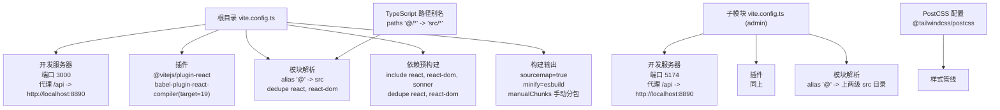
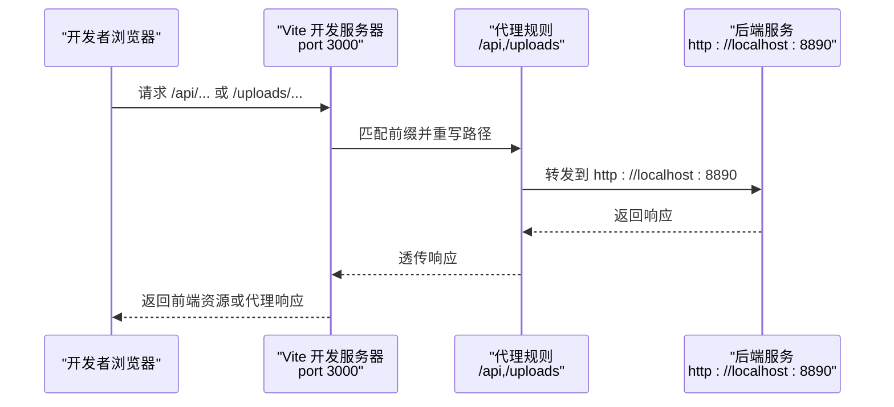
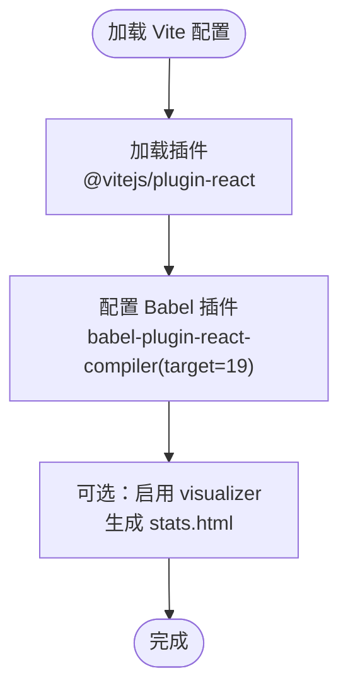
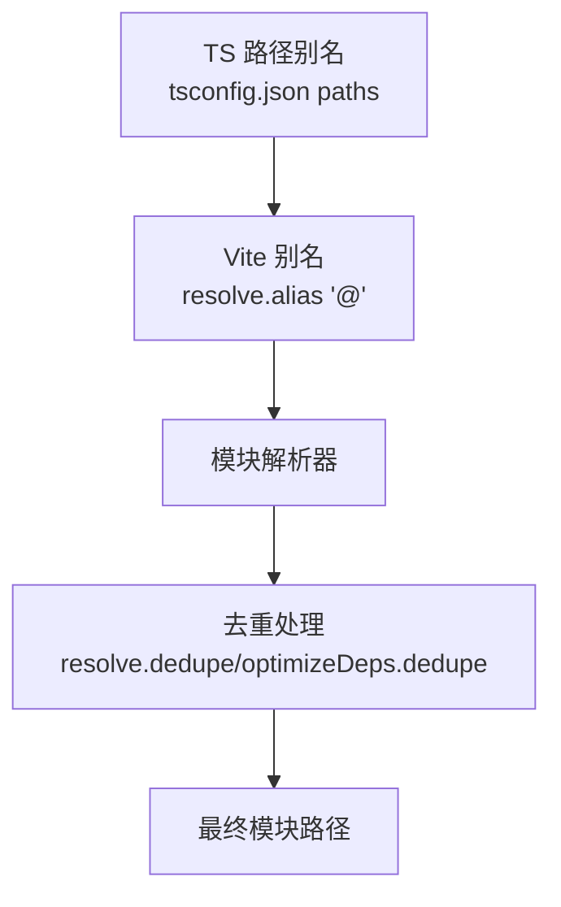
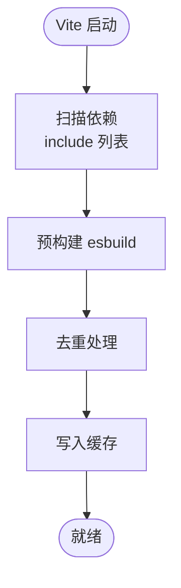
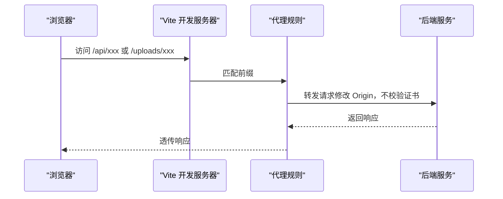
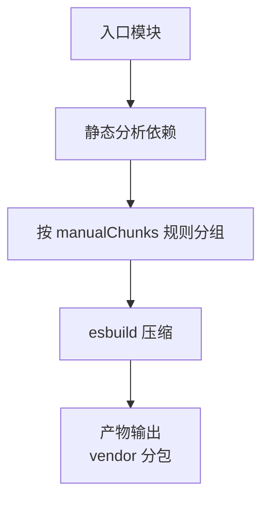
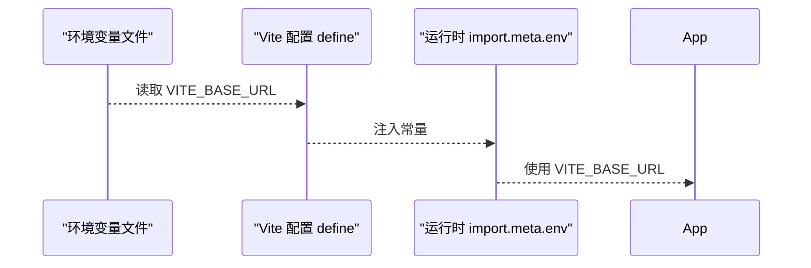
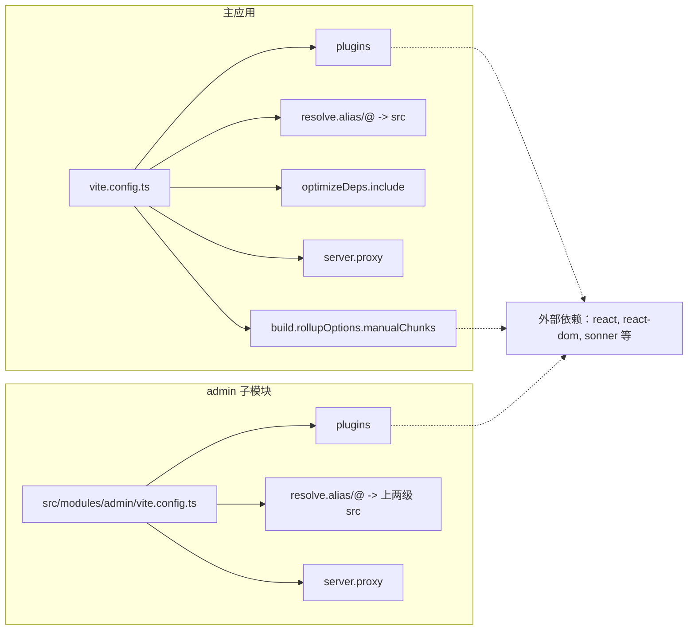

# Vite 构建配置

<cite>
**本文引用的文件**
- [vite.config.ts](file://vite.config.ts)
- [package.json](file://package.json)
- [.env.development](file://.env.development)
- [.env.production](file://.env.production)
- [postcss.config.mjs](file://postcss.config.mjs)
- [tsconfig.json](file://tsconfig.json)
- [src/main.tsx](file://src/main.tsx)
- [index.html](file://index.html)
- [src/modules/admin/vite.config.ts](file://src/modules/admin/vite.config.ts)
- [.eslintrc.js](file://.eslintrc.js)
</cite>

## 目录
1. [简介](#简介)
2. [项目结构](#项目结构)
3. [核心组件](#核心组件)
4. [架构总览](#架构总览)
5. [详细组件分析](#详细组件分析)
6. [依赖关系分析](#依赖关系分析)
7. [性能考量](#性能考量)
8. [故障排查指南](#故障排查指南)
9. [结论](#结论)
10. [附录](#附录)

## 简介
本文件面向 Vite 构建配置的深入技术说明，围绕以下主题展开：
- 插件配置：React Compiler 与可视化分析插件（visualizer）的启用与参数
- 模块解析别名与去重策略
- 依赖预构建优化（optimizeDeps）
- 开发服务器配置与代理设置
- 代码分割策略、手动分包与构建优化
- 性能优化建议与常见问题排查
- 实际配置示例与最佳实践

本项目采用 Vite 6.3.5，React 19，配合 TailwindCSS PostCSS 工具链与 TypeScript 路径别名体系。

## 项目结构
本仓库包含主应用与子模块（admin）两个独立的 Vite 配置，分别服务于不同功能域。主配置集中于根目录的 vite.config.ts，子模块配置位于 src/modules/admin/vite.config.ts。

图表来源
- [vite.config.ts](file://vite.config.ts#L15-L84)
- [src/modules/admin/vite.config.ts](file://src/modules/admin/vite.config.ts#L10-L45)
- [tsconfig.json](file://tsconfig.json#L20-L24)
- [postcss.config.mjs](file://postcss.config.mjs#L1-L6)

章节来源
- [vite.config.ts](file://vite.config.ts#L1-L86)
- [src/modules/admin/vite.config.ts](file://src/modules/admin/vite.config.ts#L1-L47)
- [tsconfig.json](file://tsconfig.json#L1-L44)
- [postcss.config.mjs](file://postcss.config.mjs#L1-L6)

## 核心组件
- 插件体系
  - @vitejs/plugin-react：启用 JSX 转换与 React Fast Refresh
  - babel-plugin-react-compiler：针对 React 19 进行编译期优化
  - rollup-plugin-visualizer（可选）：打包产物可视化分析
- 模块解析与去重
  - alias：将 @ 映射到 src，提升导入可读性
  - dedupe：避免重复打包 react 与 react-dom
- 依赖预构建
  - include：显式声明需预构建的依赖（如 sonner）
  - dedupe：与 resolve.dedupe 协同
- 开发服务器与代理
  - 端口：3000（主应用），5174（admin 子模块）
  - 代理：/api 与 /uploads 前缀转发至后端服务
- 构建优化
  - sourcemap：开启便于调试
  - minify：使用 esbuild 提升压缩速度
  - manualChunks：按功能域拆分 vendor 包
- 环境注入
  - define：向运行时注入 VITE_BASE_URL

章节来源
- [vite.config.ts](file://vite.config.ts#L15-L84)
- [package.json](file://package.json#L93-L125)
- [.env.development](file://.env.development#L1-L5)
- [.env.production](file://.env.production#L1-L5)

## 架构总览
下图展示开发阶段请求在前端与后端之间的流转，以及构建阶段的代码分割与产物组织。

图表来源
- [vite.config.ts](file://vite.config.ts#L39-L59)
- [src/modules/admin/vite.config.ts](file://src/modules/admin/vite.config.ts#L29-L40)

## 详细组件分析

### 插件配置：React Compiler 与可视化分析
- React Compiler
  - 通过 @vitejs/plugin-react 的 babel 插件启用
  - 目标版本：React 19，用于编译期优化
  - 在主配置与 admin 子模块中一致启用
- 可视化分析（visualizer）
  - 默认注释掉，可按需启用以生成 stats.html 并显示 gzip/brotli 体积
  - 适合在 CI 或本地分析打包体积构成

图表来源
- [vite.config.ts](file://vite.config.ts#L16-L28)
- [src/modules/admin/vite.config.ts](file://src/modules/admin/vite.config.ts#L16-L22)

章节来源
- [vite.config.ts](file://vite.config.ts#L10-L28)
- [src/modules/admin/vite.config.ts](file://src/modules/admin/vite.config.ts#L16-L22)
- [package.json](file://package.json#L108-L120)
- [.eslintrc.js](file://.eslintrc.js#L1-L9)

### 模块解析别名与去重
- 别名配置
  - alias["@"]：指向 src 目录，便于统一导入
  - TypeScript 路径别名 paths["@/*"]："src/*"，与 Vite alias 保持一致
- 去重策略
  - resolve.dedupe 与 optimizeDeps.dedupe：避免 react 与 react-dom 重复打包
- 子模块别名差异
  - admin 子模块将 alias["@"] 指向上两级 src，适配其目录结构

图表来源
- [tsconfig.json](file://tsconfig.json#L20-L24)
- [vite.config.ts](file://vite.config.ts#L29-L38)
- [src/modules/admin/vite.config.ts](file://src/modules/admin/vite.config.ts#L23-L28)

章节来源
- [tsconfig.json](file://tsconfig.json#L20-L24)
- [vite.config.ts](file://vite.config.ts#L29-L38)
- [src/modules/admin/vite.config.ts](file://src/modules/admin/vite.config.ts#L23-L28)

### 依赖预构建优化（optimizeDeps）
- include 列表
  - react、react-dom、sonner：确保这些库在开发时被预构建，减少冷启动时间
- dedupe 策略
  - 与 resolve.dedupe 协同，避免重复打包
- 生效范围
  - 主应用与 admin 子模块各自独立生效

图表来源
- [vite.config.ts](file://vite.config.ts#L35-L38)
- [src/modules/admin/vite.config.ts](file://src/modules/admin/vite.config.ts#L1-L47)

章节来源
- [vite.config.ts](file://vite.config.ts#L35-L38)
- [src/modules/admin/vite.config.ts](file://src/modules/admin/vite.config.ts#L1-L47)

### 开发服务器配置与代理设置
- 主应用
  - 端口：3000
  - 文件监听：轮询模式，间隔 300ms，忽略 node_modules
  - 代理：
    - /api -> http://localhost:8890（changeOrigin=true，secure=false，路径重写）
    - /uploads -> http://localhost:8890（同上）
- 子模块（admin）
  - 端口：5174，避免与主应用冲突
  - 代理：/api -> http://localhost:8890（路径重写）

图表来源
- [vite.config.ts](file://vite.config.ts#L39-L59)
- [src/modules/admin/vite.config.ts](file://src/modules/admin/vite.config.ts#L29-L40)

章节来源
- [vite.config.ts](file://vite.config.ts#L39-L59)
- [src/modules/admin/vite.config.ts](file://src/modules/admin/vite.config.ts#L29-L40)

### 代码分割策略、手动分包与构建优化
- 手动分包（manualChunks）
  - react-vendor：react、react-dom、react-router-dom
  - ui-vendor：framer-motion、@radix-ui 系列对话框/弹层组件
  - data-vendor：@tanstack/react-query、axios、zustand
  - chart-vendor：recharts
  - utils-vendor：crypto-js、es-toolkit
- 构建优化选项
  - sourcemap：true，便于生产调试
  - minify：esbuild，兼顾速度与体积
  - chunkSizeWarningLimit：1024（KB），控制大包告警阈值
- Rollup 输出配置
  - 通过 rollupOptions.output.manualChunks 实现按功能域拆分

图表来源
- [vite.config.ts](file://vite.config.ts#L60-L80)

章节来源
- [vite.config.ts](file://vite.config.ts#L60-L80)

### 环境变量注入与使用
- 注入方式
  - define：向运行时注入 VITE_BASE_URL，值来自 .env.development/.env.production
- 使用位置
  - 应用入口通过 import.meta.env.VITE_BASE_URL 获取基础路径
- 子模块
  - admin 子模块同样注入 VITE_BASE_URL，便于跨模块一致性

图表来源
- [vite.config.ts](file://vite.config.ts#L81-L83)
- [.env.development](file://.env.development#L1-L2)
- [.env.production](file://.env.production#L1-L2)
- [src/main.tsx](file://src/main.tsx#L1-L18)
- [src/modules/admin/vite.config.ts](file://src/modules/admin/vite.config.ts#L41-L44)

章节来源
- [vite.config.ts](file://vite.config.ts#L81-L83)
- [.env.development](file://.env.development#L1-L2)
- [.env.production](file://.env.production#L1-L2)
- [src/main.tsx](file://src/main.tsx#L1-L18)
- [src/modules/admin/vite.config.ts](file://src/modules/admin/vite.config.ts#L41-L44)

### 样式与工具链集成
- PostCSS
  - 使用 @tailwindcss/postcss 插件，配合 TailwindCSS v4
- TypeScript 路径别名
  - tsconfig.json 的 paths 与 Vite alias 保持一致，确保编辑器与构建工具协同

章节来源
- [postcss.config.mjs](file://postcss.config.mjs#L1-L6)
- [tsconfig.json](file://tsconfig.json#L20-L24)

## 依赖关系分析
- 组件耦合
  - 主应用与 admin 子模块各自拥有独立的 Vite 配置，降低耦合度
  - 共享依赖（react、react-dom）通过 dedupe 与 include 机制统一管理
- 外部依赖
  - axios、@tanstack/react-query、zustand、recharts、crypto-js 等通过 manualChunks 独立打包，利于缓存与更新粒度控制
- 环境变量
  - VITE_BASE_URL 在主应用与 admin 子模块中均被注入，确保前后端交互路径一致

图表来源
- [vite.config.ts](file://vite.config.ts#L15-L84)
- [src/modules/admin/vite.config.ts](file://src/modules/admin/vite.config.ts#L10-L45)

章节来源
- [vite.config.ts](file://vite.config.ts#L15-L84)
- [src/modules/admin/vite.config.ts](file://src/modules/admin/vite.config.ts#L10-L45)

## 性能考量
- 编译与打包
  - 使用 esbuild 作为 minifier，显著提升压缩速度
  - React Compiler 针对 React 19 进行编译期优化，减少运行时开销
- 依赖预构建
  - 将常用库纳入 optimizeDeps.include，缩短首次启动等待时间
- 代码分割
  - manualChunks 按功能域拆分 vendor 包，提升缓存命中率
  - 合理设置 chunkSizeWarningLimit，避免大包影响加载体验
- 开发体验
  - 文件监听使用轮询模式，解决部分容器/WSL 下的监听问题
  - 代理关闭证书校验（secure=false）便于本地联调，生产请谨慎开启

章节来源
- [vite.config.ts](file://vite.config.ts#L60-L80)
- [package.json](file://package.json#L108-L120)

## 故障排查指南
- 代理 404 或路径错误
  - 检查代理前缀是否与请求路径匹配（/api、/uploads）
  - 确认 rewrite 规则是否正确移除前缀
- 端口占用
  - 主应用默认 3000；admin 子模块使用 5174，避免冲突
- 环境变量未生效
  - 确认 .env.development/.env.production 中存在 VITE_BASE_URL
  - 检查 define 注入是否正确
- 大包体积告警
  - 调整 chunkSizeWarningLimit 或优化 manualChunks 分组
- React Compiler 报错
  - 确保 babel-plugin-react-compiler 与 @vitejs/plugin-react 版本兼容
  - 如需临时禁用，注释 visualizer 插件相关配置

章节来源
- [vite.config.ts](file://vite.config.ts#L39-L59)
- [vite.config.ts](file://vite.config.ts#L81-L83)
- [vite.config.ts](file://vite.config.ts#L60-L80)
- [package.json](file://package.json#L108-L120)

## 结论
本配置以 React 19 为核心，结合 React Compiler、esbuild 与合理的 manualChunks 策略，在开发体验与构建性能之间取得平衡。通过别名、去重与预构建等手段，进一步提升模块解析效率与缓存利用率。建议在团队内统一 ESLint 规则与 React Compiler 使用规范，持续监控打包体积与加载性能。

## 附录
- 实际配置示例（路径）
  - 主应用 Vite 配置：[vite.config.ts](file://vite.config.ts#L1-L86)
  - 子模块 Vite 配置：[src/modules/admin/vite.config.ts](file://src/modules/admin/vite.config.ts#L1-L47)
  - 环境变量（开发）：[.env.development](file://.env.development#L1-L5)
  - 环境变量（生产）：[.env.production](file://.env.production#L1-L5)
  - TypeScript 路径别名：[tsconfig.json](file://tsconfig.json#L20-L24)
  - PostCSS 配置：[postcss.config.mjs](file://postcss.config.mjs#L1-L6)
  - 应用入口使用环境变量：[src/main.tsx](file://src/main.tsx#L1-L18)
  - HTML 入口：[index.html](file://index.html#L1-L31)
  - ESLint React Compiler 规则：[.eslintrc.js](file://.eslintrc.js#L1-L9)