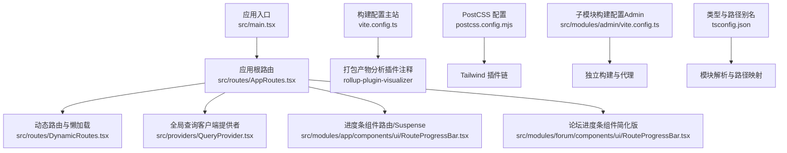
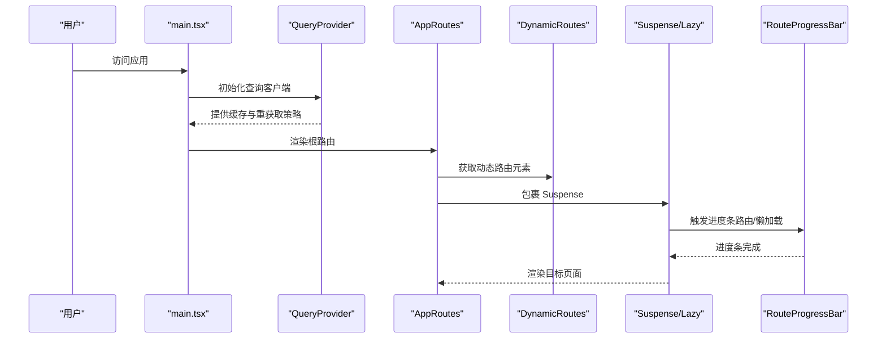
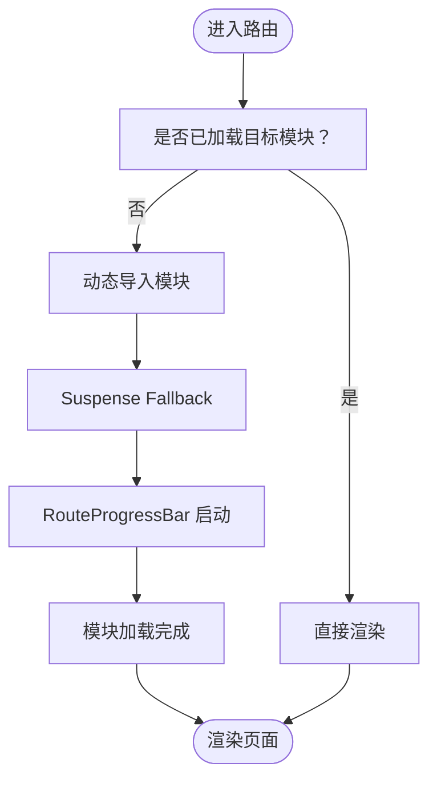
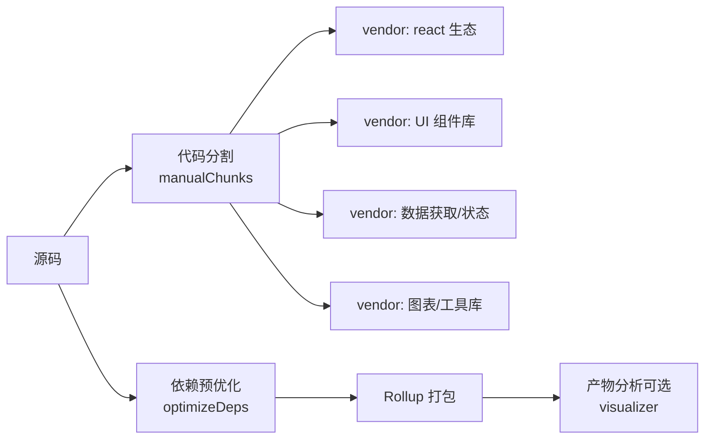
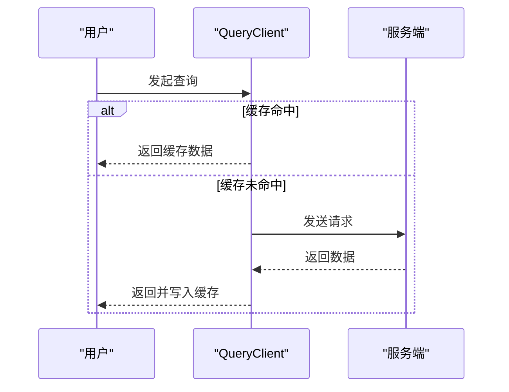
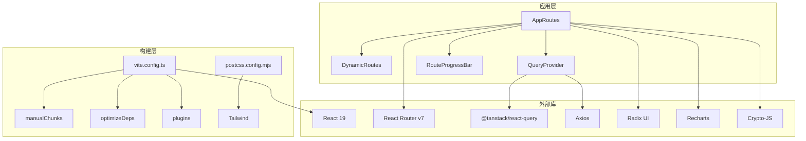

# 构建优化策略

<cite>
**本文档引用的文件**
- [vite.config.ts](file://vite.config.ts)
- [package.json](file://package.json)
- [postcss.config.mjs](file://postcss.config.mjs)
- [src/main.tsx](file://src/main.tsx)
- [src/providers/QueryProvider.tsx](file://src/providers/QueryProvider.tsx)
- [src/routes/AppRoutes.tsx](file://src/routes/AppRoutes.tsx)
- [src/routes/DynamicRoutes.tsx](file://src/routes/DynamicRoutes.tsx)
- [src/modules/app/components/ui/RouteProgressBar.tsx](file://src/modules/app/components/ui/RouteProgressBar.tsx)
- [src/modules/forum/components/ui/RouteProgressBar.tsx](file://src/modules/forum/components/ui/RouteProgressBar.tsx)
- [src/modules/admin/vite.config.ts](file://src/modules/admin/vite.config.ts)
- [tsconfig.json](file://tsconfig.json)
</cite>

## 目录
1. [引言](#引言)
2. [项目结构](#项目结构)
3. [核心组件](#核心组件)
4. [架构总览](#架构总览)
5. [详细组件分析](#详细组件分析)
6. [依赖关系分析](#依赖关系分析)
7. [性能考虑](#性能考虑)
8. [故障排查指南](#故障排查指南)
9. [结论](#结论)
10. [附录](#附录)

## 引言
本指南面向构建与性能优化工程师，围绕代码分割策略、懒加载实现、资源压缩与产物分析、Bundle 大小优化、加载性能提升、缓存策略与 CDN 集成、静态资源处理以及性能监控与持续改进等方面，结合本仓库现有配置与实现进行系统化梳理与落地建议。目标是帮助团队在不牺牲开发体验的前提下，显著降低首屏与交互延迟，提升可维护性与可扩展性。

## 项目结构
本项目采用 Vite 作为构建工具，React 19 作为前端框架，并通过 React Router v7 实现动态路由与懒加载。整体结构清晰，按功能域划分模块（如 app、admin、forum），便于独立构建与优化。

图表来源
- [src/main.tsx](file://src/main.tsx#L1-L18)
- [src/routes/AppRoutes.tsx](file://src/routes/AppRoutes.tsx#L1-L115)
- [src/providers/QueryProvider.tsx](file://src/providers/QueryProvider.tsx#L1-L30)
- [src/modules/app/components/ui/RouteProgressBar.tsx](file://src/modules/app/components/ui/RouteProgressBar.tsx#L1-L101)
- [src/modules/forum/components/ui/RouteProgressBar.tsx](file://src/modules/forum/components/ui/RouteProgressBar.tsx#L1-L21)
- [vite.config.ts](file://vite.config.ts#L1-L86)
- [postcss.config.mjs](file://postcss.config.mjs#L1-L6)
- [src/modules/admin/vite.config.ts](file://src/modules/admin/vite.config.ts#L1-L47)
- [tsconfig.json](file://tsconfig.json#L1-L44)

章节来源
- [vite.config.ts](file://vite.config.ts#L1-L86)
- [package.json](file://package.json#L1-L148)
- [postcss.config.mjs](file://postcss.config.mjs#L1-L6)
- [src/main.tsx](file://src/main.tsx#L1-L18)
- [src/providers/QueryProvider.tsx](file://src/providers/QueryProvider.tsx#L1-L30)
- [src/routes/AppRoutes.tsx](file://src/routes/AppRoutes.tsx#L1-L115)
- [src/routes/DynamicRoutes.tsx](file://src/routes/DynamicRoutes.tsx#L254-L307)
- [src/modules/app/components/ui/RouteProgressBar.tsx](file://src/modules/app/components/ui/RouteProgressBar.tsx#L1-L101)
- [src/modules/forum/components/ui/RouteProgressBar.tsx](file://src/modules/forum/components/ui/RouteProgressBar.tsx#L1-L21)
- [src/modules/admin/vite.config.ts](file://src/modules/admin/vite.config.ts#L1-L47)
- [tsconfig.json](file://tsconfig.json#L1-L44)

## 核心组件
- 构建与打包配置：主站与子模块分别拥有独立的 Vite 配置，支持 React Compiler、依赖预优化、别名与代理等能力。
- 路由与懒加载：基于 React Router 的动态导入与 Suspense，配合全局进度条组件，提供良好的加载体验。
- 查询缓存与网络层：基于 TanStack React Query 的缓存策略，减少重复请求，提升交互响应速度。
- 样式与工具链：PostCSS + Tailwind，配合 esbuild 压缩与 Rollup 输出控制，形成完整的前端构建链路。

章节来源
- [vite.config.ts](file://vite.config.ts#L1-L86)
- [src/modules/admin/vite.config.ts](file://src/modules/admin/vite.config.ts#L1-L47)
- [src/routes/AppRoutes.tsx](file://src/routes/AppRoutes.tsx#L1-L115)
- [src/providers/QueryProvider.tsx](file://src/providers/QueryProvider.tsx#L1-L30)
- [postcss.config.mjs](file://postcss.config.mjs#L1-L6)

## 架构总览
下图展示从入口到路由、懒加载、查询缓存与构建配置的整体流程：

图表来源
- [src/main.tsx](file://src/main.tsx#L1-L18)
- [src/providers/QueryProvider.tsx](file://src/providers/QueryProvider.tsx#L1-L30)
- [src/routes/AppRoutes.tsx](file://src/routes/AppRoutes.tsx#L1-L115)
- [src/routes/DynamicRoutes.tsx](file://src/routes/DynamicRoutes.tsx#L254-L307)
- [src/modules/app/components/ui/RouteProgressBar.tsx](file://src/modules/app/components/ui/RouteProgressBar.tsx#L1-L101)

## 详细组件分析

### 代码分割与懒加载实现
- 动态导入与 Suspense：公开路由与 404 页面均使用动态导入与 Suspense 包裹，确保仅在访问时加载对应代码块。
- 动态路由系统：通过动态路由配置生成路由树，结合 Suspense 提升复杂页面的加载体验。
- 进度条联动：在懒加载期间显示进度条，避免空白等待带来的感知延迟。

图表来源
- [src/routes/AppRoutes.tsx](file://src/routes/AppRoutes.tsx#L1-L115)
- [src/routes/DynamicRoutes.tsx](file://src/routes/DynamicRoutes.tsx#L254-L307)
- [src/modules/app/components/ui/RouteProgressBar.tsx](file://src/modules/app/components/ui/RouteProgressBar.tsx#L1-L101)

章节来源
- [src/routes/AppRoutes.tsx](file://src/routes/AppRoutes.tsx#L1-L115)
- [src/routes/DynamicRoutes.tsx](file://src/routes/DynamicRoutes.tsx#L254-L307)
- [src/modules/app/components/ui/RouteProgressBar.tsx](file://src/modules/app/components/ui/RouteProgressBar.tsx#L1-L101)

### 构建产物分析与 Bundle 大小优化
- 代码分割策略：通过 Rollup 的 manualChunks 将第三方库按功能域拆分为独立 chunk，降低重复依赖与缓存失效范围。
- 依赖预优化：optimizeDeps.include 与 dedupe 避免重复打包与运行时差异。
- 压缩与 Sourcemap：生产构建启用 esbuild 压缩与 sourcemap，兼顾调试与体积。
- 可视化分析：保留 visualizer 插件配置，便于定期审查产物构成与体积分布。

图表来源
- [vite.config.ts](file://vite.config.ts#L60-L80)
- [vite.config.ts](file://vite.config.ts#L35-L38)
- [vite.config.ts](file://vite.config.ts#L16-L28)

章节来源
- [vite.config.ts](file://vite.config.ts#L60-L80)
- [vite.config.ts](file://vite.config.ts#L35-L38)

### 缓存策略与 CDN 集成
- 查询缓存：QueryClient 默认选项将数据缓存 10 分钟，窗口聚焦与挂载时静默刷新，兼顾实时性与性能。
- 构建缓存：Vite 内置依赖预构建缓存，结合 manualChunks 与稳定版本号，提升二次构建速度。
- CDN 集成建议：对 vendor chunk 与静态资源启用长期缓存与版本化命名；对 API 资源使用边缘缓存与压缩传输。

图表来源
- [src/providers/QueryProvider.tsx](file://src/providers/QueryProvider.tsx#L5-L22)

章节来源
- [src/providers/QueryProvider.tsx](file://src/providers/QueryProvider.tsx#L1-L30)

### 静态资源处理与样式优化
- PostCSS/Tailwind：通过 PostCSS 插件链处理样式，结合 Tailwind 工具类减少冗余样式体积。
- 路径别名：tsconfig 中配置路径别名，统一模块解析，减少相对路径复杂度。
- 子模块独立配置：Admin 子模块拥有独立 vite 配置，便于隔离构建与代理设置。

章节来源
- [postcss.config.mjs](file://postcss.config.mjs#L1-L6)
- [tsconfig.json](file://tsconfig.json#L20-L24)
- [src/modules/admin/vite.config.ts](file://src/modules/admin/vite.config.ts#L1-L47)

## 依赖关系分析
- 模块耦合：路由层通过动态导入解耦页面模块；查询层通过 Provider 注入，避免跨模块重复初始化。
- 外部依赖：React 19、React Router v7、TanStack React Query、Axios、Radix UI、Recharts、Crypto-JS 等。
- 构建依赖：Vite、@vitejs/plugin-react、babel-plugin-react-compiler、rollup-plugin-visualizer、terser 等。

图表来源
- [src/routes/AppRoutes.tsx](file://src/routes/AppRoutes.tsx#L1-L115)
- [src/providers/QueryProvider.tsx](file://src/providers/QueryProvider.tsx#L1-L30)
- [src/modules/app/components/ui/RouteProgressBar.tsx](file://src/modules/app/components/ui/RouteProgressBar.tsx#L1-L101)
- [vite.config.ts](file://vite.config.ts#L1-L86)
- [postcss.config.mjs](file://postcss.config.mjs#L1-L6)

章节来源
- [package.json](file://package.json#L5-L91)
- [vite.config.ts](file://vite.config.ts#L1-L86)

## 性能考虑
- 代码分割优先：继续细化 vendor chunk，确保高频更新的业务代码与稳定第三方库分离，最大化长效缓存命中率。
- 懒加载策略：对非首屏关键页面进一步拆分，利用 Suspense 的 fallback 提升感知性能。
- 查询缓存：根据业务场景调整 staleTime 与 gcTime，减少不必要的网络往返。
- 构建优化：开启 visualizer 定期分析产物，识别超大依赖与重复模块；结合 Terser/ESBuild 参数进一步压缩。
- 样式与资源：Tailwind 工具类应结合 Purge 配置移除未使用样式；图片与媒体资源采用现代格式与懒加载。
- CDN 与缓存：对静态资源启用强缓存与版本化；对 API 响应使用合适的 Cache-Control 与 ETag。

## 故障排查指南
- 构建体积异常增大
  - 使用 visualizer 生成分析报告，定位超大模块与重复依赖。
  - 检查 manualChunks 是否合理，避免将小模块单独拆分导致缓存碎片化。
  - 参考：[vite.config.ts](file://vite.config.ts#L64-L78)
- 懒加载白屏或闪烁
  - 确认 Suspense fallback 正常渲染，RouteProgressBar 在加载期间正确启动与结束。
  - 参考：[src/modules/app/components/ui/RouteProgressBar.tsx](file://src/modules/app/components/ui/RouteProgressBar.tsx#L1-L101)
- 查询缓存未生效
  - 检查 QueryClient 默认选项与页面内查询配置，确认 staleTime、gcTime、refetchOnMount 设置符合预期。
  - 参考：[src/providers/QueryProvider.tsx](file://src/providers/QueryProvider.tsx#L5-L22)
- 子模块构建冲突
  - 确认子模块 vite 配置中的 root、envDir、alias 与主站隔离，避免路径解析冲突。
  - 参考：[src/modules/admin/vite.config.ts](file://src/modules/admin/vite.config.ts#L10-L28)

章节来源
- [vite.config.ts](file://vite.config.ts#L64-L78)
- [src/modules/app/components/ui/RouteProgressBar.tsx](file://src/modules/app/components/ui/RouteProgressBar.tsx#L1-L101)
- [src/providers/QueryProvider.tsx](file://src/providers/QueryProvider.tsx#L5-L22)
- [src/modules/admin/vite.config.ts](file://src/modules/admin/vite.config.ts#L10-L28)

## 结论
本项目已在代码分割、懒加载与查询缓存方面具备良好基础。建议后续重点推进：可视化分析常态化、vendor chunk 精细化拆分、样式与资源进一步压缩、CDN 与缓存策略落地，以及建立性能基线与回归测试机制，确保持续优化闭环。

## 附录
- 关键配置参考
  - 构建与代码分割：[vite.config.ts](file://vite.config.ts#L60-L80)
  - 依赖预优化：[vite.config.ts](file://vite.config.ts#L35-L38)
  - 查询缓存策略：[src/providers/QueryProvider.tsx](file://src/providers/QueryProvider.tsx#L5-L22)
  - 路由与懒加载：[src/routes/AppRoutes.tsx](file://src/routes/AppRoutes.tsx#L1-L115)
  - 进度条组件：[src/modules/app/components/ui/RouteProgressBar.tsx](file://src/modules/app/components/ui/RouteProgressBar.tsx#L1-L101)
  - 子模块构建：[src/modules/admin/vite.config.ts](file://src/modules/admin/vite.config.ts#L1-L47)
  - 样式工具链：[postcss.config.mjs](file://postcss.config.mjs#L1-L6)
  - 路径别名与类型：[tsconfig.json](file://tsconfig.json#L20-L24)