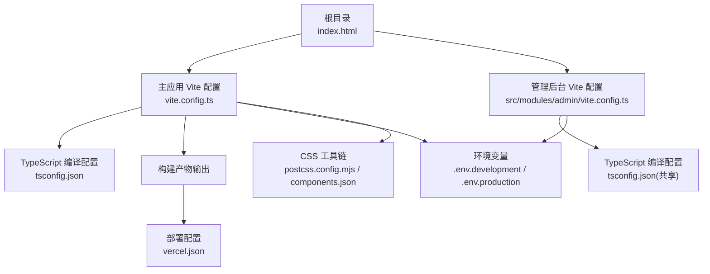
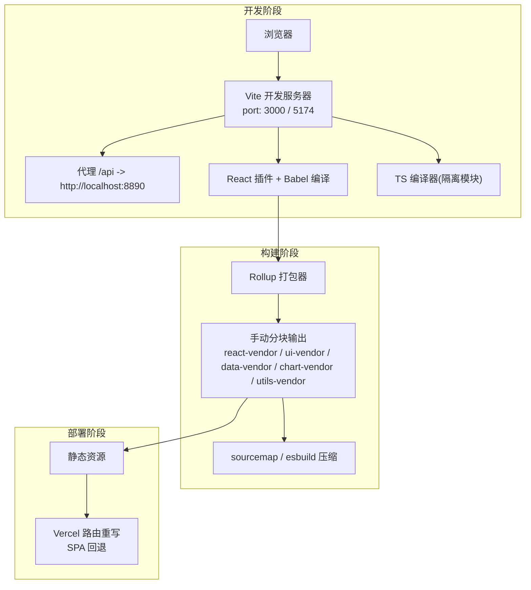
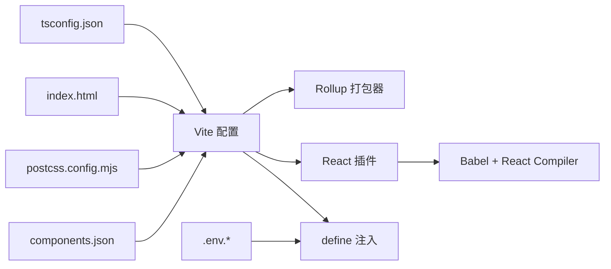

# 构建配置

<cite>
**本文引用的文件**
- [vite.config.ts](file://vite.config.ts)
- [src/modules/admin/vite.config.ts](file://src/modules/admin/vite.config.ts)
- [tsconfig.json](file://tsconfig.json)
- [package.json](file://package.json)
- [index.html](file://index.html)
- [.env.development](file://.env.development)
- [.env.production](file://.env.production)
- [postcss.config.mjs](file://postcss.config.mjs)
- [components.json](file://components.json)
- [vercel.json](file://vercel.json)
</cite>

## 目录
1. [简介](#简介)
2. [项目结构](#项目结构)
3. [核心组件](#核心组件)
4. [架构总览](#架构总览)
5. [详细组件分析](#详细组件分析)
6. [依赖关系分析](#依赖关系分析)
7. [性能考量](#性能考量)
8. [故障排查指南](#故障排查指南)
9. [结论](#结论)
10. [附录](#附录)

## 简介
本指南面向使用 Vite 作为构建工具的前端工程，围绕本项目的 Vite 配置、TypeScript 编译配置与构建流程展开，系统讲解开发与生产环境差异、环境变量管理、模块解析与别名、插件体系、代码分割策略、性能优化与资源处理、以及部署相关设置。同时提供最佳实践与常见问题的解决方案，帮助团队高效、稳定地进行本地开发与线上发布。

## 项目结构
本项目采用单仓库多入口模式：
- 主应用：根目录下的 Vite 配置与前端资源
- 管理后台子应用：位于 src/modules/admin，拥有独立的 Vite 配置，便于隔离开发与部署

图表来源
- [vite.config.ts](file://vite.config.ts#L1-L86)
- [src/modules/admin/vite.config.ts](file://src/modules/admin/vite.config.ts#L1-L47)
- [tsconfig.json](file://tsconfig.json#L1-L44)
- [index.html](file://index.html#L1-L31)
- [.env.development](file://.env.development#L1-L5)
- [.env.production](file://.env.production#L1-L5)
- [postcss.config.mjs](file://postcss.config.mjs#L1-L6)
- [components.json](file://components.json#L1-L23)
- [vercel.json](file://vercel.json#L1-L12)

章节来源
- [vite.config.ts](file://vite.config.ts#L1-L86)
- [src/modules/admin/vite.config.ts](file://src/modules/admin/vite.config.ts#L1-L47)
- [tsconfig.json](file://tsconfig.json#L1-L44)
- [index.html](file://index.html#L1-L31)
- [.env.development](file://.env.development#L1-L5)
- [.env.production](file://.env.production#L1-L5)
- [postcss.config.mjs](file://postcss.config.mjs#L1-L6)
- [components.json](file://components.json#L1-L23)
- [vercel.json](file://vercel.json#L1-L12)

## 核心组件
- Vite 主配置：定义插件、模块解析、依赖预优化、开发服务器、构建输出与全局常量注入
- 管理后台子应用配置：独立端口、代理、别名与环境变量注入
- TypeScript 编译配置：目标语言、模块系统、路径映射、类型声明与编译选项
- 环境变量：开发与生产环境变量加载与注入
- CSS 工具链：Tailwind PostCSS 集成与组件库别名
- 部署重写：Vercel 路由重写以支持 SPA

章节来源
- [vite.config.ts](file://vite.config.ts#L15-L84)
- [src/modules/admin/vite.config.ts](file://src/modules/admin/vite.config.ts#L10-L45)
- [tsconfig.json](file://tsconfig.json#L2-L32)
- [.env.development](file://.env.development#L1-L5)
- [.env.production](file://.env.production#L1-L5)
- [postcss.config.mjs](file://postcss.config.mjs#L1-L6)
- [components.json](file://components.json#L14-L20)
- [vercel.json](file://vercel.json#L2-L11)

## 架构总览
下图展示了从请求到构建产物的关键路径，包括开发服务器代理、构建打包与部署重写：

图表来源
- [vite.config.ts](file://vite.config.ts#L39-L84)
- [src/modules/admin/vite.config.ts](file://src/modules/admin/vite.config.ts#L29-L45)
- [vercel.json](file://vercel.json#L2-L11)

## 详细组件分析

### Vite 主配置（主应用）
- 插件与编译
  - React 插件集成 Babel 与 React Compiler，目标版本适配 React 19
  - 可选的打包可视化插件（注释状态）
- 模块解析与去重
  - 别名 @ 指向 src
  - 依赖去重：react、react-dom
- 依赖预优化
  - 预包含 react、react-dom、sonner，并去重
- 开发服务器
  - 端口 3000，文件监控轮询与忽略 node_modules
  - 代理 /api 与 /uploads 到后端服务，路径重写
- 构建输出
  - 启用 sourcemap，使用 esbuild 压缩
  - 自定义分块策略：将常用第三方库拆分为独立包
- 全局常量注入
  - 将 VITE_BASE_URL 注入到 import.meta.env

章节来源
- [vite.config.ts](file://vite.config.ts#L15-L84)

### 管理后台子应用配置
- 独立根目录与环境变量目录，指向根目录
- 别名 @ 指向上两级 src
- 独立端口 5174，避免与主应用冲突
- 代理 /api 到后端服务
- 注入 VITE_BASE_URL

章节来源
- [src/modules/admin/vite.config.ts](file://src/modules/admin/vite.config.ts#L1-L47)

### TypeScript 编译配置
- 目标与库：ES2020、DOM、DOM.Iterable
- 模块系统：ESNext，解析器为 bundler
- JSX：react-jsx
- 路径映射：@/* -> src/*
- 类型声明：node、express、react、react-dom、vite/client
- 编译行为：noEmit、isolatedModules、跳过库检查
- 包含范围：src、api、vite.config.ts 与部分脚本

章节来源
- [tsconfig.json](file://tsconfig.json#L2-L32)

### 环境变量与注入
- 环境文件：.env.development 与 .env.production
- 注入方式：通过 define 将 VITE_BASE_URL 注入到客户端代码
- 使用场景：API 基础路径、敏感密钥（示例：下载器密钥）

章节来源
- [.env.development](file://.env.development#L1-L5)
- [.env.production](file://.env.production#L1-L5)
- [vite.config.ts](file://vite.config.ts#L81-L83)
- [src/modules/admin/vite.config.ts](file://src/modules/admin/vite.config.ts#L41-L44)

### 模块解析、别名与路径映射
- Vite 别名：@ -> src
- TypeScript 路径映射：@/* -> src/*
- 组件库别名：components.json 定义 ui、lib、hooks 等别名，统一组件导入风格
- 子应用别名：管理后台 @ 指向上两级 src

章节来源
- [vite.config.ts](file://vite.config.ts#L29-L34)
- [tsconfig.json](file://tsconfig.json#L20-L24)
- [components.json](file://components.json#L14-L20)
- [src/modules/admin/vite.config.ts](file://src/modules/admin/vite.config.ts#L23-L27)

### 插件系统与编译优化
- React 插件：启用 React Compiler，目标版本 19
- Babel 插件：babel-plugin-react-compiler
- 可选可视化：rollup-plugin-visualizer（注释状态）
- 依赖预优化：optimizeDeps.include 与 dedupe

章节来源
- [vite.config.ts](file://vite.config.ts#L16-L28)
- [vite.config.ts](file://vite.config.ts#L35-L38)
- [package.json](file://package.json#L108-L124)

### 代码分割策略
- 手动分块：按功能域拆分 vendor 包
  - react-vendor：react、react-dom、react-router-dom
  - ui-vendor：动画与 UI 组件库
  - data-vendor：数据获取与状态管理
  - chart-vendor：图表库
  - utils-vendor：加密与工具库
- 体积警告阈值：chunkSizeWarningLimit 提升至 1024KB

章节来源
- [vite.config.ts](file://vite.config.ts#L60-L80)

### 构建流程与产物
- 开发：vite --mode development
- 生产：vite build --mode production
- 产物：基于 Rollup 输出，启用 sourcemap 与 esbuild 压缩
- HTML：index.html 作为入口模板，动态注入主题偏好

章节来源
- [package.json](file://package.json#L126-L139)
- [index.html](file://index.html#L1-L31)

### 部署与路由重写
- Vercel 重写：将 /api/* 转发到后端，其他路径回退到 index.html，支持 SPA
- 基础路径：主应用与子应用均注入 VITE_BASE_URL，确保静态资源与 API 请求正确

章节来源
- [vercel.json](file://vercel.json#L2-L11)
- [vite.config.ts](file://vite.config.ts#L81-L83)
- [src/modules/admin/vite.config.ts](file://src/modules/admin/vite.config.ts#L41-L44)

## 依赖关系分析
- Vite 与 Rollup：Vite 基于 Rollup 进行打包，构建配置通过 rollupOptions 控制输出
- TypeScript 与 Vite：tsconfig.json 与 Vite 协同工作，确保类型检查与打包一致性
- CSS 工具链：postcss.config.mjs 引入 Tailwind 插件；components.json 提供组件库别名
- 环境变量：通过 define 注入 import.meta.env，实现运行时配置

图表来源
- [vite.config.ts](file://vite.config.ts#L15-L84)
- [tsconfig.json](file://tsconfig.json#L1-L44)
- [postcss.config.mjs](file://postcss.config.mjs#L1-L6)
- [components.json](file://components.json#L1-L23)
- [index.html](file://index.html#L1-L31)
- [.env.development](file://.env.development#L1-L5)
- [.env.production](file://.env.production#L1-L5)

章节来源
- [vite.config.ts](file://vite.config.ts#L15-L84)
- [tsconfig.json](file://tsconfig.json#L1-L44)
- [postcss.config.mjs](file://postcss.config.mjs#L1-L6)
- [components.json](file://components.json#L1-L23)
- [index.html](file://index.html#L1-L31)
- [.env.development](file://.env.development#L1-L5)
- [.env.production](file://.env.production#L1-L5)

## 性能考量
- 代码分割
  - 按功能域拆分 vendor 包，降低首屏依赖
  - 通过 manualChunks 控制分块粒度，减少重复依赖
- 依赖预优化
  - optimizeDeps.include 与 dedupe 提升冷启动与热更新速度
- 压缩与 Source Map
  - esbuild 压缩速度快，适合生产构建
  - sourcemap 保留便于调试与追踪
- 监控与可视化
  - 可选的打包可视化插件可用于分析体积构成
- CSS 与资源
  - Tailwind PostCSS 与组件库别名减少冗余样式与导入复杂度
- 开发体验
  - 文件监控轮询与忽略 node_modules，提升大项目监听稳定性

章节来源
- [vite.config.ts](file://vite.config.ts#L35-L80)
- [postcss.config.mjs](file://postcss.config.mjs#L1-L6)
- [components.json](file://components.json#L14-L20)

## 故障排查指南
- 代理无效或 404
  - 检查 /api 与 /uploads 代理配置与后端地址
  - 确认 changeOrigin、secure 与路径重写规则
- 环境变量未生效
  - 确认 .env.* 文件存在且命名规范
  - 检查 define 注入是否正确，访问 import.meta.env.VITE_BASE_URL
- 别名解析错误
  - 确认 Vite 与 TS 路径映射一致（@/* -> src/*）
  - 子应用别名需指向正确目录层级
- 依赖重复或内存占用高
  - 使用 optimizeDeps.dedupe 与 include
  - 检查第三方库是否被重复打包
- 构建体积过大
  - 使用 manualChunks 拆分 vendor 包
  - 关注 chunkSizeWarningLimit 阈值
- SPA 路由 404
  - 检查 vercel.json 重写规则，确保回退到 index.html

章节来源
- [vite.config.ts](file://vite.config.ts#L46-L58)
- [vite.config.ts](file://vite.config.ts#L81-L83)
- [vite.config.ts](file://vite.config.ts#L29-L34)
- [tsconfig.json](file://tsconfig.json#L20-L24)
- [src/modules/admin/vite.config.ts](file://src/modules/admin/vite.config.ts#L29-L45)
- [vercel.json](file://vercel.json#L2-L11)

## 结论
本项目的构建配置以 Vite 为核心，结合 React Compiler、手动分块与依赖预优化，在开发与生产环境中实现了良好的性能与可维护性。通过明确的环境变量注入、模块解析与别名策略、以及 Vercel 路由重写，满足了多入口与多子应用的复杂场景。建议在后续迭代中持续关注打包可视化与体积分析，配合严格的类型检查与路径映射，进一步提升构建质量与交付稳定性。

## 附录

### 开发与生产环境差异速览
- 开发环境
  - 端口：3000（主应用）、5174（管理后台）
  - 代理：/api 与 /uploads 指向后端
  - 监控：轮询监听，忽略 node_modules
- 生产环境
  - 构建：vite build，启用 sourcemap 与 esbuild 压缩
  - 分块：manualChunks 拆分 vendor 包
  - 部署：Vercel 重写，SPA 回退

章节来源
- [vite.config.ts](file://vite.config.ts#L39-L84)
- [src/modules/admin/vite.config.ts](file://src/modules/admin/vite.config.ts#L29-L45)
- [vercel.json](file://vercel.json#L2-L11)