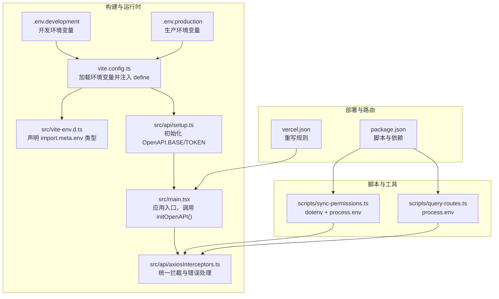
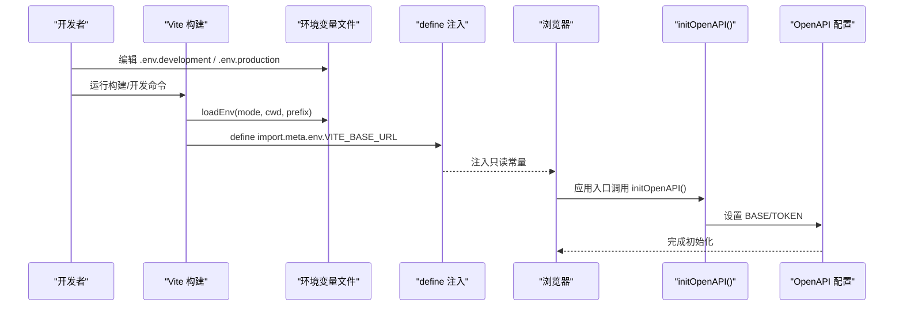
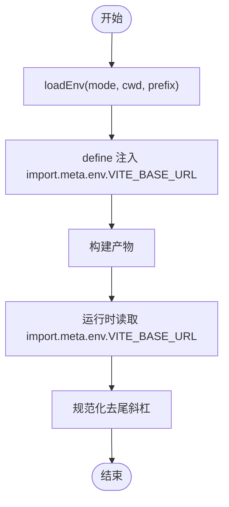
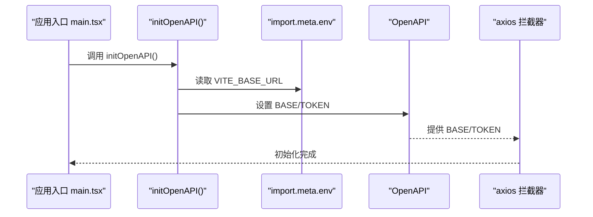
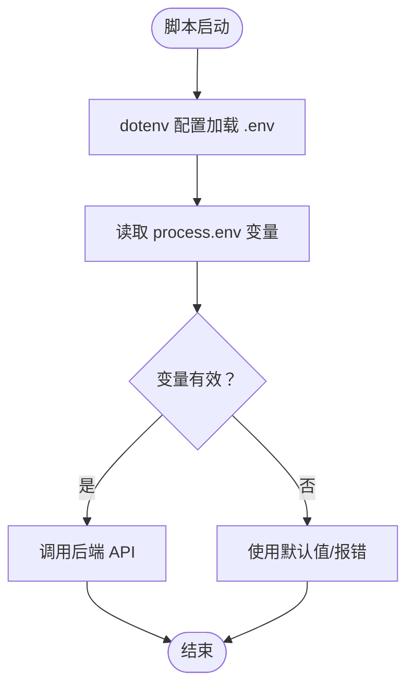
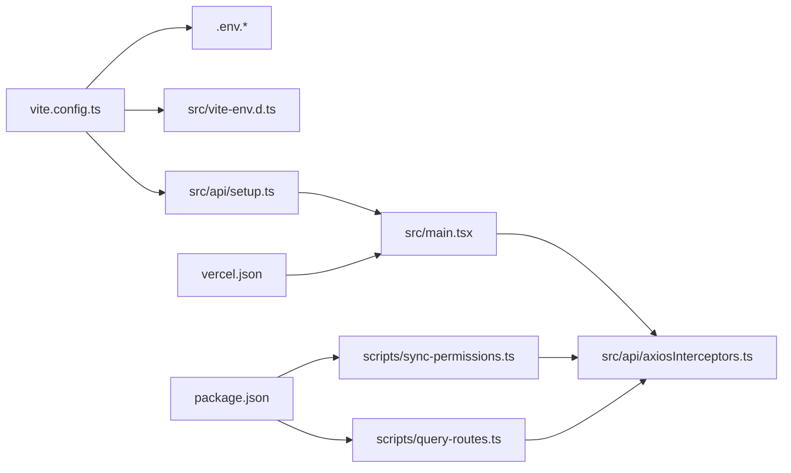

# 环境变量配置

<cite>
**本文引用的文件**
- [.env.development](file://.env.development)
- [.env.production](file://.env.production)
- [vite.config.ts](file://vite.config.ts)
- [src/vite-env.d.ts](file://src/vite-env.d.ts)
- [src/api/setup.ts](file://src/api/setup.ts)
- [src/main.tsx](file://src/main.tsx)
- [src/api/axiosInterceptors.ts](file://src/api/axiosInterceptors.ts)
- [scripts/sync-permissions.ts](file://scripts/sync-permissions.ts)
- [scripts/query-routes.ts](file://scripts/query-routes.ts)
- [src/modules/admin/vite.config.ts](file://src/modules/admin/vite.config.ts)
- [vercel.json](file://vercel.json)
- [package.json](file://package.json)
</cite>

## 目录
1. [简介](#简介)
2. [项目结构](#项目结构)
3. [核心组件](#核心组件)
4. [架构总览](#架构总览)
5. [详细组件分析](#详细组件分析)
6. [依赖关系分析](#依赖关系分析)
7. [性能考量](#性能考量)
8. [故障排查指南](#故障排查指南)
9. [结论](#结论)
10. [附录](#附录)

## 简介
本指南面向 zTorrent-site 项目的前端与脚本环境变量管理，系统性阐述开发与生产环境的配置差异、Vite 环境变量前缀规则、敏感信息保护与配置验证方法，并提供多部署场景的配置示例、CI/CD 集成思路与安全最佳实践。读者将学会如何在不同环境中正确加载与使用环境变量，如何在构建阶段注入只读常量，以及如何在脚本与运行时中安全地读取与使用这些变量。

## 项目结构
本项目采用 Vite 作为构建工具，前端通过 Vite 的 define 机制将环境变量注入到打包产物中，同时在运行时通过 import.meta.env 读取。脚本工具（如权限同步脚本）使用 dotenv 与 process.env 读取环境变量。此外，项目还包含独立的 .env.development 与 .env.production 文件，用于本地开发与生产构建时的变量注入。

图表来源
- [vite.config.ts](file://vite.config.ts#L1-L86)
- [.env.development](file://.env.development#L1-L5)
- [.env.production](file://.env.production#L1-L5)
- [src/vite-env.d.ts](file://src/vite-env.d.ts#L1-L10)
- [src/api/setup.ts](file://src/api/setup.ts#L1-L35)
- [src/main.tsx](file://src/main.tsx#L1-L18)
- [src/api/axiosInterceptors.ts](file://src/api/axiosInterceptors.ts#L1-L294)
- [scripts/sync-permissions.ts](file://scripts/sync-permissions.ts#L1-L718)
- [scripts/query-routes.ts](file://scripts/query-routes.ts#L1-L112)
- [vercel.json](file://vercel.json#L1-L12)
- [package.json](file://package.json#L1-L148)

章节来源
- [vite.config.ts](file://vite.config.ts#L1-L86)
- [.env.development](file://.env.development#L1-L5)
- [.env.production](file://.env.production#L1-L5)
- [src/vite-env.d.ts](file://src/vite-env.d.ts#L1-L10)
- [src/api/setup.ts](file://src/api/setup.ts#L1-L35)
- [src/main.tsx](file://src/main.tsx#L1-L18)
- [src/api/axiosInterceptors.ts](file://src/api/axiosInterceptors.ts#L1-L294)
- [scripts/sync-permissions.ts](file://scripts/sync-permissions.ts#L1-L718)
- [scripts/query-routes.ts](file://scripts/query-routes.ts#L1-L112)
- [vercel.json](file://vercel.json#L1-L12)
- [package.json](file://package.json#L1-L148)

## 核心组件
- Vite 环境变量加载与注入
  - 通过 loadEnv(mode, cwd, prefix) 读取 .env.{mode} 文件中的变量，并通过 define 将其注入到 import.meta.env，构建期只读常量。
  - 仅以 VITE_ 前缀的变量会被 Vite 暴露给客户端代码，非 VITE_ 前缀变量不会被注入。
- 运行时读取与初始化
  - 在 src/vite-env.d.ts 中声明 import.meta.env 的类型，确保类型安全。
  - 在 src/api/setup.ts 中读取 import.meta.env.VITE_BASE_URL，规范化后赋给 OpenAPI.BASE，并统一从 localStorage 读取访问令牌。
- 脚本工具的环境变量
  - 脚本通过 dotenv 配置加载 .env 文件，process.env 读取变量，用于权限同步与路由查询等离线任务。
- 部署与路由
  - vercel.json 提供重写规则，保证 SPA 路由与 API 路由的正确转发。

章节来源
- [vite.config.ts](file://vite.config.ts#L1-L86)
- [src/vite-env.d.ts](file://src/vite-env.d.ts#L1-L10)
- [src/api/setup.ts](file://src/api/setup.ts#L1-L35)
- [scripts/sync-permissions.ts](file://scripts/sync-permissions.ts#L1-L718)
- [scripts/query-routes.ts](file://scripts/query-routes.ts#L1-L112)
- [vercel.json](file://vercel.json#L1-L12)

## 架构总览
下图展示了从环境变量加载到运行时使用的整体流程，包括 Vite 构建期注入、运行时初始化与脚本工具读取。

图表来源
- [vite.config.ts](file://vite.config.ts#L1-L86)
- [.env.development](file://.env.development#L1-L5)
- [.env.production](file://.env.production#L1-L5)
- [src/api/setup.ts](file://src/api/setup.ts#L1-L35)
- [src/main.tsx](file://src/main.tsx#L1-L18)

## 详细组件分析

### Vite 环境变量加载与注入机制
- 加载位置与范围
  - vite.config.ts 使用 loadEnv 读取当前 mode 对应的 .env 文件，并将结果传入 define。
- 注入策略
  - 通过 define 将 import.meta.env.VITE_BASE_URL 注入为构建期常量，确保在运行时以只读形式可用。
- 类型声明
  - src/vite-env.d.ts 声明 import.meta.env 的类型，限定 VITE_BASE_URL 为只读字符串，提升类型安全。
- 作用域与可见性
  - 仅 VITE_ 前缀变量会暴露给客户端代码；非 VITE_ 前缀变量不会被注入，避免泄露。

图表来源
- [vite.config.ts](file://vite.config.ts#L1-L86)
- [src/vite-env.d.ts](file://src/vite-env.d.ts#L1-L10)

章节来源
- [vite.config.ts](file://vite.config.ts#L1-L86)
- [src/vite-env.d.ts](file://src/vite-env.d.ts#L1-L10)

### 运行时初始化与 OpenAPI 配置
- 初始化流程
  - 应用入口在渲染前调用 initOpenAPI()，读取 import.meta.env.VITE_BASE_URL 并去除尾部斜杠，设置为 OpenAPI.BASE。
  - 统一从 localStorage 读取访问令牌，作为 OpenAPI.TOKEN。
- 防重复初始化
  - 通过 window 全局标记确保仅初始化一次，避免热更新或重复导入导致的配置污染。
- 与拦截器协作
  - axios 拦截器基于 OpenAPI.BASE 与响应结构进行统一错误处理与提示。

图表来源
- [src/main.tsx](file://src/main.tsx#L1-L18)
- [src/api/setup.ts](file://src/api/setup.ts#L1-L35)
- [src/api/axiosInterceptors.ts](file://src/api/axiosInterceptors.ts#L1-L294)

章节来源
- [src/main.tsx](file://src/main.tsx#L1-L18)
- [src/api/setup.ts](file://src/api/setup.ts#L1-L35)
- [src/api/axiosInterceptors.ts](file://src/api/axiosInterceptors.ts#L1-L294)

### 脚本工具的环境变量使用
- dotenv 配置
  - 脚本通过 dotenv 配置加载 .env 文件，使 process.env 可用。
- 常见变量
  - API_BASE_URL：后端基础地址，默认回退到本地端口。
  - ACCESS_TOKEN：管理员访问令牌，用于权限同步与路由查询。
  - ADMIN_USER / ADMIN_PASS：登录凭据，当 ACCESS_TOKEN 未提供时使用。
- 安全注意
  - 脚本中读取的 ACCESS_TOKEN 等敏感信息不应提交到版本库，建议通过 CI/CD 的密钥管理注入。

图表来源
- [scripts/sync-permissions.ts](file://scripts/sync-permissions.ts#L1-L718)
- [scripts/query-routes.ts](file://scripts/query-routes.ts#L1-L112)

章节来源
- [scripts/sync-permissions.ts](file://scripts/sync-permissions.ts#L1-L718)
- [scripts/query-routes.ts](file://scripts/query-routes.ts#L1-L112)

### 独立模块（admin 子应用）的环境变量
- 独立配置
  - 子模块 vite.config.ts 通过 loadEnv 从根目录加载 .env 文件，确保与主应用共享同一套变量。
- 注入与别名
  - define 注入 import.meta.env.VITE_BASE_URL，resolve.alias 指向 src 目录，便于模块内引用。

章节来源
- [src/modules/admin/vite.config.ts](file://src/modules/admin/vite.config.ts#L1-L46)

### 部署与路由重写
- Vercel 重写
  - vercel.json 提供 API 与 SPA 路由的重写规则，确保静态资源与后端接口正确转发。
- 与前端配置的关系
  - 前端通过 VITE_BASE_URL 指定 /api 前缀，配合代理与重写，实现开发与生产的路由一致性。

章节来源
- [vercel.json](file://vercel.json#L1-L12)
- [vite.config.ts](file://vite.config.ts#L1-L86)

## 依赖关系分析
- 构建期依赖
  - vite.config.ts 依赖 dotenv（通过 loadEnv）、Vite 插件生态与 define 注入。
- 运行时依赖
  - src/api/setup.ts 依赖 import.meta.env 与 OpenAPI；src/main.tsx 依赖 initOpenAPI；axios 拦截器依赖 OpenAPI 与响应结构。
- 脚本依赖
  - scripts/*.ts 依赖 dotenv 与 axios；package.json 的 scripts 定义了执行入口。

图表来源
- [vite.config.ts](file://vite.config.ts#L1-L86)
- [src/vite-env.d.ts](file://src/vite-env.d.ts#L1-L10)
- [src/api/setup.ts](file://src/api/setup.ts#L1-L35)
- [src/main.tsx](file://src/main.tsx#L1-L18)
- [src/api/axiosInterceptors.ts](file://src/api/axiosInterceptors.ts#L1-L294)
- [scripts/sync-permissions.ts](file://scripts/sync-permissions.ts#L1-L718)
- [scripts/query-routes.ts](file://scripts/query-routes.ts#L1-L112)
- [vercel.json](file://vercel.json#L1-L12)
- [package.json](file://package.json#L1-L148)

章节来源
- [vite.config.ts](file://vite.config.ts#L1-L86)
- [src/api/setup.ts](file://src/api/setup.ts#L1-L35)
- [src/main.tsx](file://src/main.tsx#L1-L18)
- [src/api/axiosInterceptors.ts](file://src/api/axiosInterceptors.ts#L1-L294)
- [scripts/sync-permissions.ts](file://scripts/sync-permissions.ts#L1-L718)
- [scripts/query-routes.ts](file://scripts/query-routes.ts#L1-L112)
- [vercel.json](file://vercel.json#L1-L12)
- [package.json](file://package.json#L1-L148)

## 性能考量
- 构建期注入的优势
  - 通过 define 将 VITE_* 变量注入为常量，减少运行时读取开销，提升首屏渲染效率。
- 代理与重写
  - 开发环境的 /api 代理与生产环境的 vercel 重写共同降低跨域与路由复杂度，减少额外的网络往返。
- 体积与分包
  - vite.config.ts 的手动分包策略有助于缓存命中与按需加载，间接影响资源加载性能。

章节来源
- [vite.config.ts](file://vite.config.ts#L1-L86)
- [vercel.json](file://vercel.json#L1-L12)

## 故障排查指南
- 症状：运行时报错找不到 import.meta.env.VITE_BASE_URL
  - 排查：确认 .env.development/.env.production 是否存在且包含 VITE_BASE_URL；确认 vite.config.ts 的 define 是否正确注入。
  - 参考
    - [vite.config.ts](file://vite.config.ts#L81-L83)
    - [.env.development](file://.env.development#L1-L5)
    - [.env.production](file://.env.production#L1-L5)
- 症状：BASE 地址末尾出现多余斜杠导致路径拼接异常
  - 排查：确认 src/api/setup.ts 是否对 VITE_BASE_URL 去除尾斜杠。
  - 参考
    - [src/api/setup.ts](file://src/api/setup.ts#L24-L25)
- 症状：脚本报错无法获取 ACCESS_TOKEN
  - 排查：确认 .env 中是否设置了 ACCESS_TOKEN；若未设置，脚本会尝试使用 ADMIN_USER/ADMIN_PASS 登录获取 token。
  - 参考
    - [scripts/sync-permissions.ts](file://scripts/sync-permissions.ts#L62-L71)
    - [scripts/query-routes.ts](file://scripts/query-routes.ts#L15-L35)
- 症状：生产环境路由 404 或刷新后丢失
  - 排查：确认 vercel.json 的重写规则是否生效；确认前端 VITE_BASE_URL 与后端接口前缀一致。
  - 参考
    - [vercel.json](file://vercel.json#L1-L12)
    - [vite.config.ts](file://vite.config.ts#L46-L58)

章节来源
- [vite.config.ts](file://vite.config.ts#L81-L83)
- [.env.development](file://.env.development#L1-L5)
- [.env.production](file://.env.production#L1-L5)
- [src/api/setup.ts](file://src/api/setup.ts#L24-L25)
- [scripts/sync-permissions.ts](file://scripts/sync-permissions.ts#L62-L71)
- [scripts/query-routes.ts](file://scripts/query-routes.ts#L15-L35)
- [vercel.json](file://vercel.json#L1-L12)

## 结论
本项目通过 Vite 的 define 注入机制与 import.meta.env 的类型声明，实现了开发与生产环境的统一变量管理；通过 src/api/setup.ts 的初始化流程，确保 OpenAPI 的基础地址与令牌读取一致；脚本工具通过 dotenv 与 process.env 实现离线任务的可配置化。结合 vercel.json 的路由重写，项目在多环境下具备良好的可维护性与安全性。

## 附录

### 开发环境与生产环境配置差异
- 开发环境
  - 通过 .env.development 注入 VITE_BASE_URL 与敏感信息（如 DOWNLOADER_SECRET），并启用本地代理 /api。
  - 参考
    - [.env.development](file://.env.development#L1-L5)
    - [vite.config.ts](file://vite.config.ts#L39-L58)
- 生产环境
  - 通过 .env.production 注入 VITE_BASE_URL 与敏感信息；构建时通过 define 注入只读常量。
  - 参考
    - [.env.production](file://.env.production#L1-L5)
    - [vite.config.ts](file://vite.config.ts#L81-L83)

### Vite 环境变量前缀规则与安全
- 前缀规则
  - 仅 VITE_* 前缀变量会暴露给客户端代码；非 VITE_* 前缀变量不会被注入。
- 安全建议
  - 不要在 .env 文件中存放生产密钥；敏感信息通过 CI/CD 密钥管理注入。
  - 使用只读 define 常量替代动态 process.env，避免在客户端暴露敏感数据。
- 参考
  - [vite.config.ts](file://vite.config.ts#L81-L83)
  - [src/vite-env.d.ts](file://src/vite-env.d.ts#L3-L5)

### 配置验证清单
- 构建期
  - [ ] .env.development/.env.production 是否包含 VITE_BASE_URL
  - [ ] vite.config.ts 的 define 是否注入 VITE_BASE_URL
  - [ ] src/vite-env.d.ts 是否声明 VITE_BASE_URL 类型
- 运行时
  - [ ] src/api/setup.ts 是否正确读取并规范化 VITE_BASE_URL
  - [ ] initOpenAPI 是否在应用入口被调用
- 脚本工具
  - [ ] scripts/*.ts 是否正确读取 ACCESS_TOKEN/API_BASE_URL
  - [ ] .env 是否包含必要变量（如 ACCESS_TOKEN/ADMIN_USER/ADMIN_PASS）
- 部署
  - [ ] vercel.json 的重写规则是否与前端 /api 前缀一致

### CI/CD 集成与安全最佳实践
- CI/CD 注入
  - 在 CI 环境中通过密钥管理服务注入敏感变量，避免硬编码在仓库中。
- 最佳实践
  - 严格区分 VITE_* 与非 VITE_* 变量的作用域。
  - 对于脚本工具，仅在离线任务中使用 process.env，不在客户端暴露。
  - 定期轮换 ACCESS_TOKEN 等短期凭证，避免长期有效密钥泄露风险。
- 参考
  - [scripts/sync-permissions.ts](file://scripts/sync-permissions.ts#L62-L71)
  - [scripts/query-routes.ts](file://scripts/query-routes.ts#L15-L35)
  - [package.json](file://package.json#L126-L138)