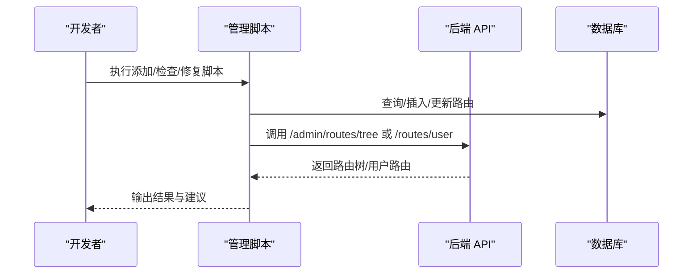
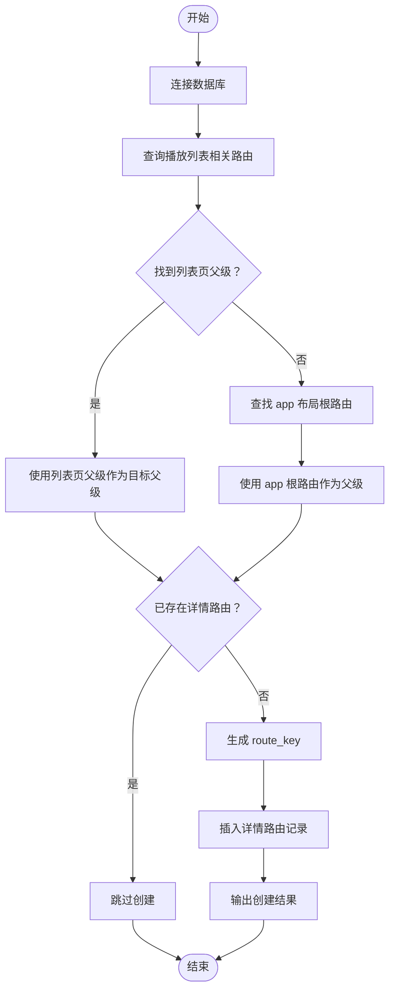
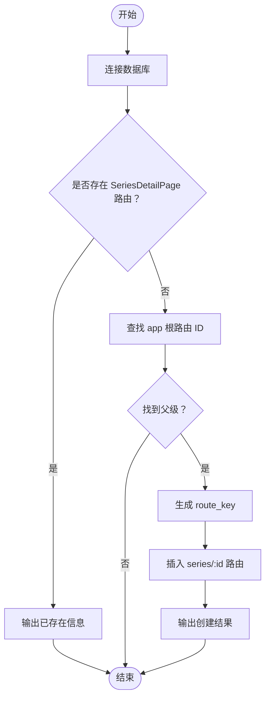
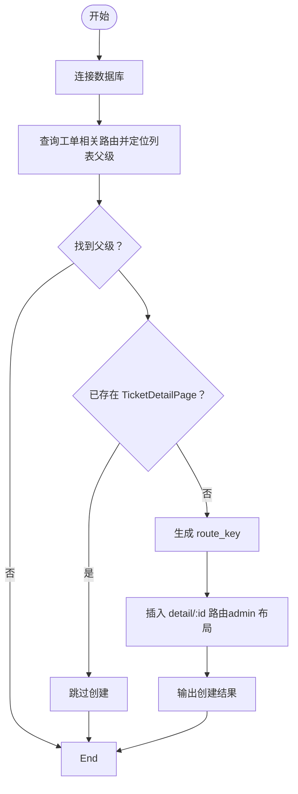
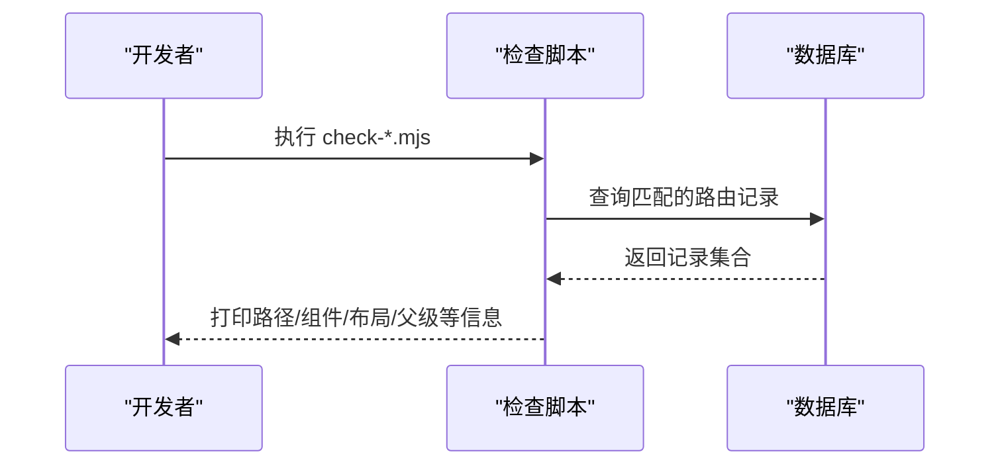
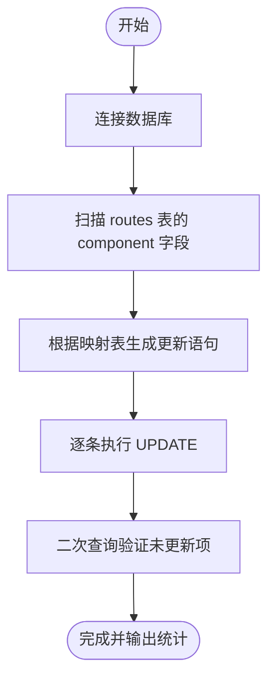
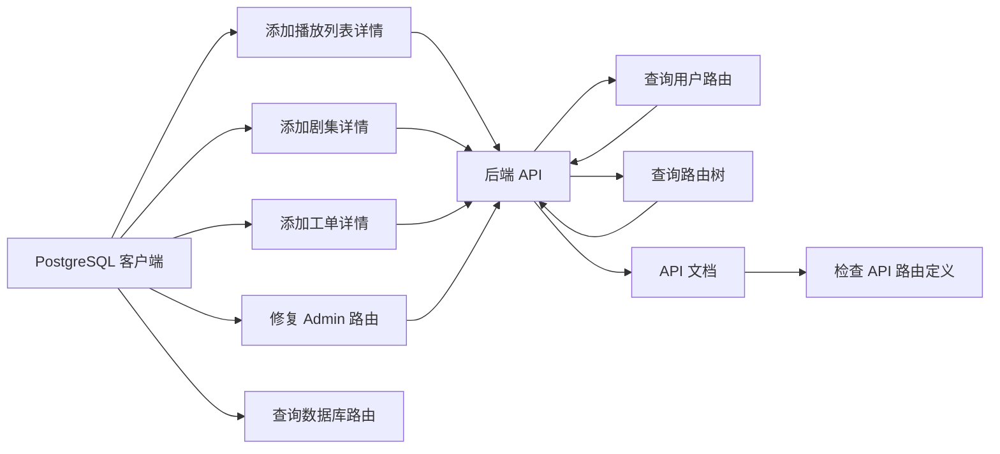

# 内容管理脚本

<cite>
**本文引用的文件**
- [scripts/add-playlist-detail-route.mjs](file://scripts/add-playlist-detail-route.mjs)
- [scripts/add-series-detail-route.mjs](file://scripts/add-series-detail-route.mjs)
- [scripts/add-ticket-detail-route.mjs](file://scripts/add-ticket-detail-route.mjs)
- [scripts/check-movie-route.mjs](file://scripts/check-movie-route.mjs)
- [scripts/check-playlist-route.mjs](file://scripts/check-playlist-route.mjs)
- [scripts/check-routes-schema.mjs](file://scripts/check-routes-schema.mjs)
- [scripts/check-routes.ts](file://scripts/check-routes.ts)
- [scripts/check-series-route.mjs](file://scripts/check-series-route.mjs)
- [scripts/check-ticket-detail-route.mjs](file://scripts/check-ticket-detail-route.mjs)
- [scripts/check-torrent-route.mjs](file://scripts/check-torrent-route.mjs)
- [scripts/update-routes-components.mjs](file://scripts/update-routes-components.mjs)
- [scripts/import-routes.ts](file://scripts/import-routes.ts)
- [scripts/query-routes.ts](file://scripts/query-routes.ts)
- [scripts/query-db-routes.ts](file://scripts/query-db-routes.ts)
- [scripts/fix-admin-route.ts](file://scripts/fix-admin-route.ts)
- [scripts/sync-routes.ts](file://scripts/sync-routes.ts)
</cite>

## 目录
1. [简介](#简介)
2. [项目结构](#项目结构)
3. [核心组件](#核心组件)
4. [架构总览](#架构总览)
5. [详细组件分析](#详细组件分析)
6. [依赖关系分析](#依赖关系分析)
7. [性能考量](#性能考量)
8. [故障排查指南](#故障排查指南)
9. [结论](#结论)
10. [附录](#附录)

## 简介
本指南围绕内容管理脚本，系统讲解三类内容详情页路由的添加流程（播放列表详情、剧集详情、工单详情），路由检查脚本的功能与验证机制（电影、播放列表、剧集、工单、种子），以及路由组件更新脚本的作用与使用方法。同时提供配置参数、执行流程与结果验证方法，并总结实践经验与常见问题处理方案。

## 项目结构
内容管理脚本位于 scripts 目录，按功能划分为“添加详情路由”“检查路由”“更新组件命名”“导入/查询/修复路由”等子任务，配合后端 API 实现对路由树的增删改查与一致性校验。

```mermaid
graph TB
subgraph "脚本层"
A["添加播放列表详情路由<br/>add-playlist-detail-route.mjs"]
B["添加剧集详情路由<br/>add-series-detail-route.mjs"]
C["添加工单详情路由<br/>add-ticket-detail-route.mjs"]
D["检查电影路由<br/>check-movie-route.mjs"]
E["检查播放列表路由<br/>check-playlist-route.mjs"]
F["检查剧集路由<br/>check-series-route.mjs"]
G["检查工单详情路由<br/>check-ticket-detail-route.mjs"]
H["检查种子路由<br/>check-torrent-route.mjs"]
I["检查路由表结构<br/>check-routes-schema.mjs"]
J["检查 API 路由定义<br/>check-routes.ts"]
K["更新组件命名<br/>update-routes-components.mjs"]
L["导入路由配置<br/>import-routes.ts"]
M["查询用户路由<br/>query-routes.ts"]
N["查询数据库路由<br/>query-db-routes.ts"]
O["修复 Admin 路由父级<br/>fix-admin-route.ts"]
end
subgraph "后端 API"
S1["POST /admin/routes/tree"]
S2["POST /routes/user"]
S3["GET /api-docs-json"]
end
A --> S1
B --> S1
C --> S1
D --> S1
E --> S1
F --> S1
G --> S1
H --> S1
I --> S1
J --> S3
K --> S1
L --> S1
M --> S1
M --> S2
N --> S1
O --> S1
```

图表来源
- [scripts/add-playlist-detail-route.mjs](file://scripts/add-playlist-detail-route.mjs#L1-L91)
- [scripts/add-series-detail-route.mjs](file://scripts/add-series-detail-route.mjs#L1-L54)
- [scripts/add-ticket-detail-route.mjs](file://scripts/add-ticket-detail-route.mjs#L1-L76)
- [scripts/check-routes.ts](file://scripts/check-routes.ts#L1-L29)
- [scripts/query-routes.ts](file://scripts/query-routes.ts#L1-L112)

章节来源
- [scripts/add-playlist-detail-route.mjs](file://scripts/add-playlist-detail-route.mjs#L1-L91)
- [scripts/add-series-detail-route.mjs](file://scripts/add-series-detail-route.mjs#L1-L54)
- [scripts/add-ticket-detail-route.mjs](file://scripts/add-ticket-detail-route.mjs#L1-L76)
- [scripts/check-routes.ts](file://scripts/check-routes.ts#L1-L29)
- [scripts/query-routes.ts](file://scripts/query-routes.ts#L1-L112)

## 核心组件
- 添加详情路由脚本：自动定位父级路由、去重检查、插入详情路由并输出关键信息。
- 路由检查脚本：查询并打印路由配置，辅助定位布局与层级问题。
- 组件命名更新脚本：批量将旧的 AdminXxx 组件名统一为 XxxPage，提升一致性。
- 导入/查询/修复脚本：从 JSON 配置导入路由树，查询后端路由树与用户可见路由，修复 Admin 根路由父级。

章节来源
- [scripts/add-playlist-detail-route.mjs](file://scripts/add-playlist-detail-route.mjs#L1-L91)
- [scripts/add-series-detail-route.mjs](file://scripts/add-series-detail-route.mjs#L1-L54)
- [scripts/add-ticket-detail-route.mjs](file://scripts/add-ticket-detail-route.mjs#L1-L76)
- [scripts/check-playlist-route.mjs](file://scripts/check-playlist-route.mjs#L1-L68)
- [scripts/check-series-route.mjs](file://scripts/check-series-route.mjs#L1-L46)
- [scripts/check-ticket-detail-route.mjs](file://scripts/check-ticket-detail-route.mjs#L1-L45)
- [scripts/check-movie-route.mjs](file://scripts/check-movie-route.mjs#L1-L32)
- [scripts/check-torrent-route.mjs](file://scripts/check-torrent-route.mjs#L1-L32)
- [scripts/update-routes-components.mjs](file://scripts/update-routes-components.mjs#L1-L142)
- [scripts/import-routes.ts](file://scripts/import-routes.ts#L1-L800)
- [scripts/query-routes.ts](file://scripts/query-routes.ts#L1-L112)
- [scripts/query-db-routes.ts](file://scripts/query-db-routes.ts#L1-L90)
- [scripts/fix-admin-route.ts](file://scripts/fix-admin-route.ts#L1-L93)

## 架构总览
内容路由管理涉及三层协作：
- 前端路由配置：以 JSON 结构描述路由树，包含路径、组件、布局、排序、可见性等元数据。
- 后端存储与接口：提供路由树查询、用户可见路由查询、导入/更新接口。
- 管理脚本：负责自动化添加、检查、修复与迁移，确保前后端一致。

图表来源
- [scripts/query-routes.ts](file://scripts/query-routes.ts#L37-L97)
- [scripts/import-routes.ts](file://scripts/import-routes.ts#L1-L800)
- [scripts/fix-admin-route.ts](file://scripts/fix-admin-route.ts#L16-L83)

## 详细组件分析

### 添加播放列表详情路由脚本
用途：为播放列表详情页创建路由，自动选择父级（优先使用列表页父级，否则回退到 app 布局根），避免重复创建，插入后输出关键信息。

图表来源
- [scripts/add-playlist-detail-route.mjs](file://scripts/add-playlist-detail-route.mjs#L13-L88)

章节来源
- [scripts/add-playlist-detail-route.mjs](file://scripts/add-playlist-detail-route.mjs#L1-L91)

### 添加剧集详情路由脚本
用途：检查并创建剧集详情路由，优先使用 app 布局根作为父级，避免重复。

图表来源
- [scripts/add-series-detail-route.mjs](file://scripts/add-series-detail-route.mjs#L13-L51)

章节来源
- [scripts/add-series-detail-route.mjs](file://scripts/add-series-detail-route.mjs#L1-L54)

### 添加工单详情路由脚本
用途：基于工单列表父级创建工单详情路由，插入后输出关键信息。

图表来源
- [scripts/add-ticket-detail-route.mjs](file://scripts/add-ticket-detail-route.mjs#L13-L75)

章节来源
- [scripts/add-ticket-detail-route.mjs](file://scripts/add-ticket-detail-route.mjs#L1-L76)

### 路由检查脚本（电影/播放列表/剧集/工单/种子）
用途：查询并打印对应类型路由，辅助定位布局、父级与层级问题。

图表来源
- [scripts/check-movie-route.mjs](file://scripts/check-movie-route.mjs#L13-L29)
- [scripts/check-playlist-route.mjs](file://scripts/check-playlist-route.mjs#L13-L67)
- [scripts/check-series-route.mjs](file://scripts/check-series-route.mjs#L13-L45)
- [scripts/check-ticket-detail-route.mjs](file://scripts/check-ticket-detail-route.mjs#L13-L44)
- [scripts/check-torrent-route.mjs](file://scripts/check-torrent-route.mjs#L13-L31)

章节来源
- [scripts/check-movie-route.mjs](file://scripts/check-movie-route.mjs#L1-L32)
- [scripts/check-playlist-route.mjs](file://scripts/check-playlist-route.mjs#L1-L68)
- [scripts/check-series-route.mjs](file://scripts/check-series-route.mjs#L1-L46)
- [scripts/check-ticket-detail-route.mjs](file://scripts/check-ticket-detail-route.mjs#L1-L45)
- [scripts/check-torrent-route.mjs](file://scripts/check-torrent-route.mjs#L1-L32)

### 路由表结构检查脚本
用途：查看 routes 表字段与示例数据，帮助理解字段约束与取值范围。

章节来源
- [scripts/check-routes-schema.mjs](file://scripts/check-routes-schema.mjs#L1-L39)

### API 路由定义检查脚本
用途：抓取后端 API 文档，列出包含 navigation 的路径及其方法，辅助核对导航相关接口。

章节来源
- [scripts/check-routes.ts](file://scripts/check-routes.ts#L1-L29)

### 路由组件更新脚本
用途：将旧的 AdminXxx 组件名统一为 XxxPage，批量更新并验证结果。

图表来源
- [scripts/update-routes-components.mjs](file://scripts/update-routes-components.mjs#L84-L142)

章节来源
- [scripts/update-routes-components.mjs](file://scripts/update-routes-components.mjs#L1-L142)

### 导入/查询/修复路由脚本
- 导入路由配置：从 JSON 配置导入路由树，支持多级嵌套与权限键。
- 查询用户路由：模拟前端请求，获取用户可见路由树。
- 查询数据库路由：直接查询数据库，输出字段、根节点、admin 相关路由与前 200 条路由摘要。
- 修复 Admin 路由父级：将 Admin 根路由的父级设为 null，确保其为真正根节点。

章节来源
- [scripts/import-routes.ts](file://scripts/import-routes.ts#L1-L800)
- [scripts/query-routes.ts](file://scripts/query-routes.ts#L1-L112)
- [scripts/query-db-routes.ts](file://scripts/query-db-routes.ts#L1-L90)
- [scripts/fix-admin-route.ts](file://scripts/fix-admin-route.ts#L1-L93)

## 依赖关系分析
- 脚本依赖 PostgreSQL 客户端进行数据库操作，部分脚本依赖后端 API（如 /admin/routes/tree、/routes/user、/api-docs-json）。
- 路由导入脚本与后端存储逻辑耦合度高，需保证 JSON 配置与后端字段一致。
- 权限同步脚本与前端源码耦合，需扫描 .tsx 文件提取权限键与页面路径。

图表来源
- [scripts/add-playlist-detail-route.mjs](file://scripts/add-playlist-detail-route.mjs#L1-L11)
- [scripts/add-series-detail-route.mjs](file://scripts/add-series-detail-route.mjs#L1-L11)
- [scripts/add-ticket-detail-route.mjs](file://scripts/add-ticket-detail-route.mjs#L1-L11)
- [scripts/query-routes.ts](file://scripts/query-routes.ts#L7-L43)
- [scripts/check-routes.ts](file://scripts/check-routes.ts#L5-L8)
- [scripts/fix-admin-route.ts](file://scripts/fix-admin-route.ts#L7-L14)

## 性能考量
- 批量更新组件名脚本逐条执行 UPDATE，建议在低峰期运行并关注事务日志。
- 查询数据库路由脚本限制输出条数（前 200 条），避免大表全量导出造成内存压力。
- 导入路由配置脚本涉及大量 JSON 解析与后端请求，建议分批导入并监控后端响应时间。

## 故障排查指南
- 未找到合适的父路由
  - 检查父级路由是否存在且布局正确；必要时先执行修复 Admin 路由父级脚本。
  - 参考：[scripts/fix-admin-route.ts](file://scripts/fix-admin-route.ts#L16-L83)
- 已存在详情路由
  - 脚本会跳过创建；如需重建，需先清理历史记录或调整去重条件。
  - 参考：[scripts/add-playlist-detail-route.mjs](file://scripts/add-playlist-detail-route.mjs#L49-L58)、[scripts/add-series-detail-route.mjs](file://scripts/add-series-detail-route.mjs#L23-L28)、[scripts/add-ticket-detail-route.mjs](file://scripts/add-ticket-detail-route.mjs#L38-L47)
- 布局与路径不一致导致访问异常
  - 检查父级/祖父级路由的布局与路径组合，确认最终完整路径。
  - 参考：[scripts/check-playlist-route.mjs](file://scripts/check-playlist-route.mjs#L60-L62)
- 组件命名不规范
  - 使用组件命名更新脚本批量修正，完成后再次扫描验证。
  - 参考：[scripts/update-routes-components.mjs](file://scripts/update-routes-components.mjs#L84-L142)
- 权限同步失败或缺失
  - 确认环境变量 API_BASE_URL 与 ACCESS_TOKEN 设置正确；检查 .tsx 文件中权限键提取是否符合预期。
  - 参考：[scripts/sync-routes.ts](file://scripts/sync-routes.ts#L62-L99)

章节来源
- [scripts/fix-admin-route.ts](file://scripts/fix-admin-route.ts#L16-L83)
- [scripts/add-playlist-detail-route.mjs](file://scripts/add-playlist-detail-route.mjs#L49-L58)
- [scripts/add-series-detail-route.mjs](file://scripts/add-series-detail-route.mjs#L23-L28)
- [scripts/add-ticket-detail-route.mjs](file://scripts/add-ticket-detail-route.mjs#L38-L47)
- [scripts/check-playlist-route.mjs](file://scripts/check-playlist-route.mjs#L60-L62)
- [scripts/update-routes-components.mjs](file://scripts/update-routes-components.mjs#L84-L142)
- [scripts/sync-routes.ts](file://scripts/sync-routes.ts#L62-L99)

## 结论
通过上述脚本体系，可实现内容详情页路由的自动化添加、规范化命名与一致性校验。建议在变更前先执行检查与查询脚本，确认现有状态；变更后使用查询脚本与数据库直连查询交叉验证；对 Admin 根路由与权限键进行定期巡检，确保导航与访问控制稳定可靠。

## 附录

### 配置参数与执行流程

- 数据库连接参数（适用于多数脚本）
  - 主机：192.168.50.2
  - 端口：5432
  - 用户：ztorrent
  - 密码：TMYBKC47Jm8w4SB7
  - 数据库：ztorrent
  - 参考：[scripts/add-playlist-detail-route.mjs](file://scripts/add-playlist-detail-route.mjs#L5-L11)、[scripts/add-series-detail-route.mjs](file://scripts/add-series-detail-route.mjs#L5-L11)、[scripts/add-ticket-detail-route.mjs](file://scripts/add-ticket-detail-route.mjs#L5-L11)

- 后端 API 基础地址与令牌
  - API_BASE_URL：http://localhost:8890
  - ACCESS_TOKEN：管理员 JWT
  - 参考：[scripts/query-routes.ts](file://scripts/query-routes.ts#L63-L71)、[scripts/sync-routes.ts](file://scripts/sync-routes.ts#L62-L71)

- 执行流程建议
  1) 先执行检查脚本（电影/播放列表/剧集/工单/种子）核对现状。
  2) 如需新增详情路由，执行相应“添加详情路由”脚本。
  3) 使用“查询用户路由/查询数据库路由”交叉验证。
  4) 如需批量更新组件命名，执行“更新组件命名”脚本。
  5) 如 Admin 导航异常，执行“修复 Admin 路由父级”脚本。

章节来源
- [scripts/add-playlist-detail-route.mjs](file://scripts/add-playlist-detail-route.mjs#L5-L11)
- [scripts/add-series-detail-route.mjs](file://scripts/add-series-detail-route.mjs#L5-L11)
- [scripts/add-ticket-detail-route.mjs](file://scripts/add-ticket-detail-route.mjs#L5-L11)
- [scripts/query-routes.ts](file://scripts/query-routes.ts#L62-L71)
- [scripts/sync-routes.ts](file://scripts/sync-routes.ts#L62-L71)