# 剧集详情路由脚本

<cite>
**本文档引用的文件**
- [add-series-detail-route.mjs](file://scripts/add-series-detail-route.mjs)
- [check-series-route.mjs](file://scripts/check-series-route.mjs)
- [query-routes.ts](file://scripts/query-routes.ts)
- [import-routes.ts](file://scripts/import-routes.ts)
- [query-db-routes.ts](file://scripts/query-db-routes.ts)
- [fix-admin-route.ts](file://scripts/fix-admin-route.ts)
- [update-routes-components.mjs](file://scripts/update-routes-components.mjs)
- [dynamic-routes-api.md](file://docs/dev/dynamic-routes-api.md)
- [2025-12-18_剧集分集与种子管理_需求文档.md](file://docs/api-requirements/2025-12-18_剧集分集与种子管理_需求文档.md)
- [AppRoutes.tsx](file://src/routes/AppRoutes.tsx)
- [SeriesDetail/index.tsx](file://src/modules/app/pages/SeriesDetail/index.tsx)
- [EpisodeDetail/index.tsx](file://src/modules/app/pages/EpisodeDetail/index.tsx)
- [package.json](file://package.json)
</cite>

## 目录
1. [简介](#简介)
2. [项目结构](#项目结构)
3. [核心组件](#核心组件)
4. [架构概览](#架构概览)
5. [详细组件分析](#详细组件分析)
6. [依赖分析](#依赖分析)
7. [性能考虑](#性能考虑)
8. [故障排除指南](#故障排除指南)
9. [结论](#结论)
10. [附录](#附录)

## 简介

本文档详细介绍 zTorrent 站点中"剧集详情路由"脚本的创建和使用方法。该脚本用于自动化管理剧集详情路由的生命周期，包括路由检测、父级路由查找、重复检查以及数据库创建操作。

zTorrent 是一个视频流媒体站点，采用动态路由系统，支持多布局架构（app、admin、forum）。剧集详情路由作为核心功能之一，需要精确的路由配置和权限管理。

## 项目结构

项目采用模块化的前端架构，主要包含以下关键目录：

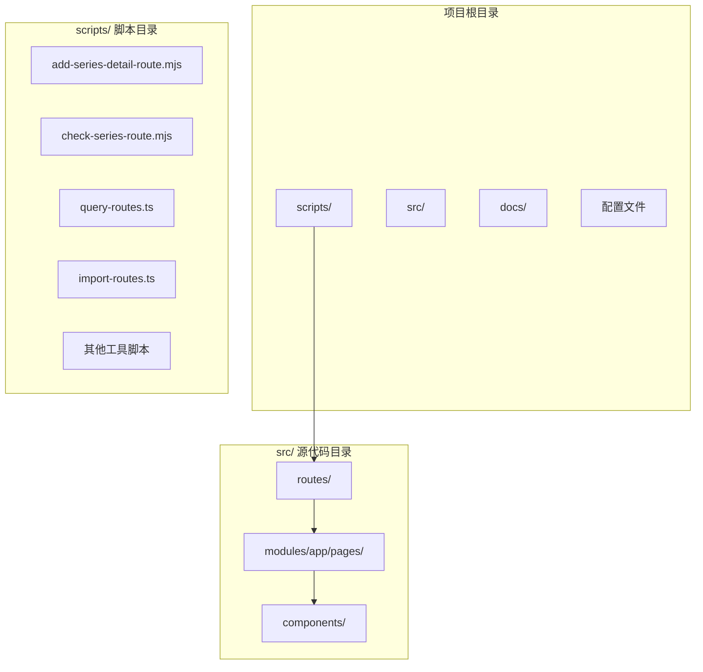

**图表来源**
- [add-series-detail-route.mjs](file://scripts/add-series-detail-route.mjs#L1-L54)
- [import-routes.ts](file://scripts/import-routes.ts#L1-L100)

**章节来源**
- [add-series-detail-route.mjs](file://scripts/add-series-detail-route.mjs#L1-L54)
- [package.json](file://package.json#L126-L139)

## 核心组件

### 剧集详情路由脚本架构

剧集详情路由脚本系统由多个相互协作的组件组成：

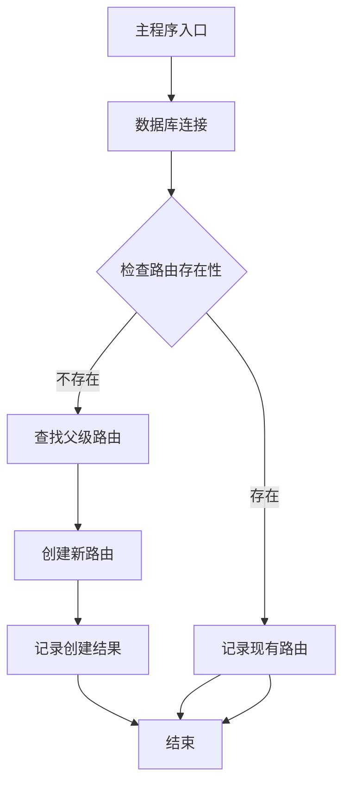

**图表来源**
- [add-series-detail-route.mjs](file://scripts/add-series-detail-route.mjs#L13-L51)

### 数据库连接配置

脚本使用 PostgreSQL 客户端进行数据库操作，配置参数如下：

| 参数 | 默认值 | 说明 |
|------|--------|------|
| host | 192.168.50.2 | 数据库服务器地址 |
| port | 5432 | PostgreSQL 端口 |
| user | ztorrent | 数据库用户名 |
| password | TMYBKC47Jm8w4SB7 | 数据库密码 |
| database | ztorrent | 数据库名称 |

**章节来源**
- [add-series-detail-route.mjs](file://scripts/add-series-detail-route.mjs#L5-L11)

## 架构概览

### 动态路由系统架构

zTorrent 采用动态路由系统，路由配置存储在数据库中，通过 API 接口动态加载：

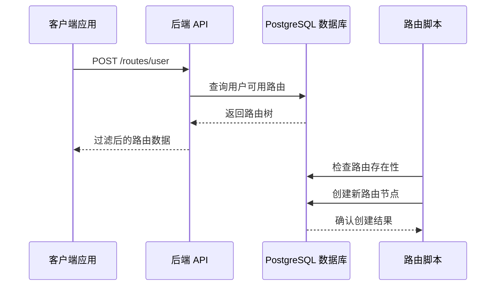

**图表来源**
- [dynamic-routes-api.md](file://docs/dev/dynamic-routes-api.md#L16-L75)
- [add-series-detail-route.mjs](file://scripts/add-series-detail-route.mjs#L13-L51)

### 路由层次结构

系统采用三层布局架构：

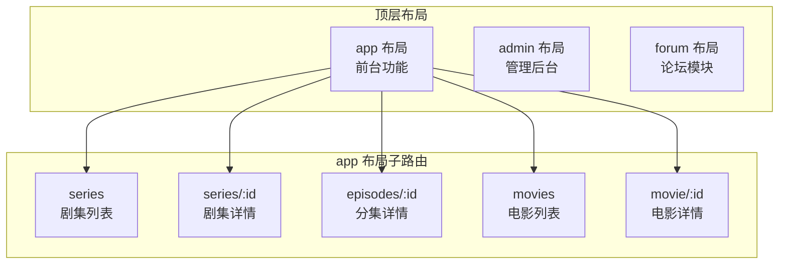

**图表来源**
- [import-routes.ts](file://scripts/import-routes.ts#L75-L89)
- [dynamic-routes-api.md](file://docs/dev/dynamic-routes-api.md#L7-L11)

## 详细组件分析

### 主要脚本组件

#### add-series-detail-route.mjs - 主要执行脚本

该脚本负责剧集详情路由的自动化创建：

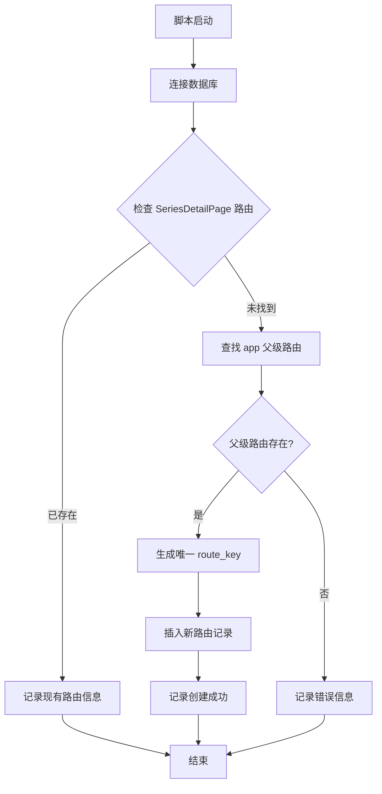

**图表来源**
- [add-series-detail-route.mjs](file://scripts/add-series-detail-route.mjs#L13-L51)

#### check-series-route.mjs - 路由检查脚本

该脚本提供路由状态的诊断和验证功能：

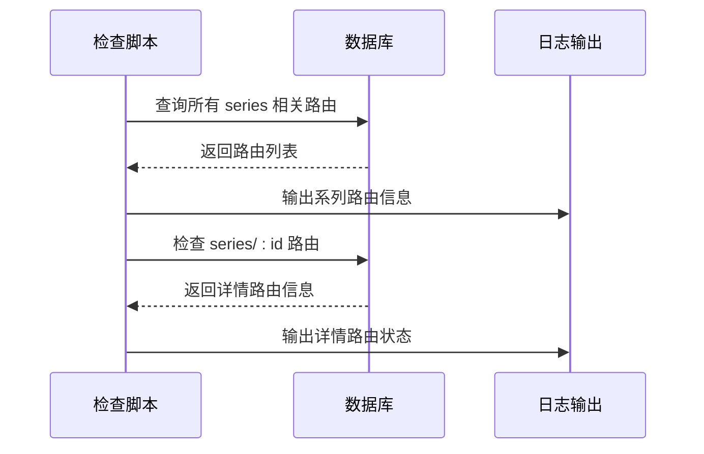

**图表来源**
- [check-series-route.mjs](file://scripts/check-series-route.mjs#L13-L45)

#### query-routes.ts - 路由查询工具

该工具提供完整的路由系统查询和验证功能：

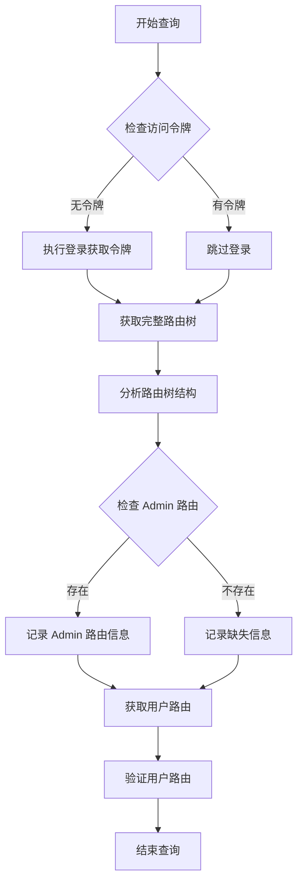

**图表来源**
- [query-routes.ts](file://scripts/query-routes.ts#L7-L111)

**章节来源**
- [add-series-detail-route.mjs](file://scripts/add-series-detail-route.mjs#L1-L54)
- [check-series-route.mjs](file://scripts/check-series-route.mjs#L1-L46)
- [query-routes.ts](file://scripts/query-routes.ts#L1-L112)

### 数据库操作流程

#### 路由创建流程

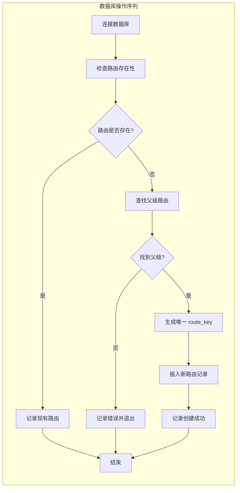

**图表来源**
- [add-series-detail-route.mjs](file://scripts/add-series-detail-route.mjs#L17-L43)

#### 路由配置参数详解

| 参数名称 | 类型 | 必填 | 默认值 | 说明 |
|----------|------|------|--------|------|
| route_key | string | 否 | 自动生成 | 全局唯一标识符 |
| path | string | 是 | - | 路由路径，如 "series/:id" |
| component | string | 是 | - | 前端组件名称，如 "SeriesDetailPage" |
| layout | string | 是 | - | 布局类型，如 "app" |
| name | string | 否 | "剧集详情" | 显示名称 |
| parent_id | number | 是 | - | 父级路由 ID |
| sort_order | number | 否 | 99 | 排序权重 |
| is_visible | boolean | 否 | false | 是否在菜单中显示 |
| is_enabled | boolean | 否 | true | 是否启用 |
| is_index | boolean | 否 | false | 是否为索引路由 |
| open_in_new_tab | boolean | 否 | false | 是否在新标签页打开 |

**章节来源**
- [add-series-detail-route.mjs](file://scripts/add-series-detail-route.mjs#L32-L42)

### 错误处理机制

脚本实现了多层次的错误处理和验证机制：

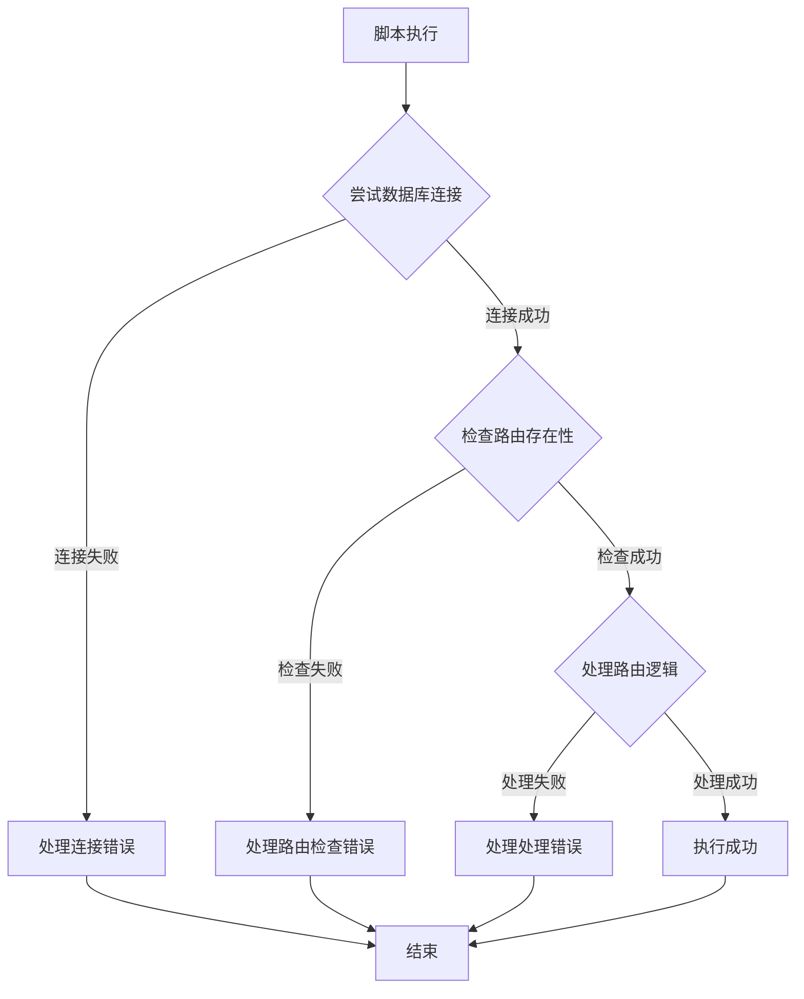

**图表来源**
- [add-series-detail-route.mjs](file://scripts/add-series-detail-route.mjs#L13-L51)

**章节来源**
- [add-series-detail-route.mjs](file://scripts/add-series-detail-route.mjs#L23-L48)

## 依赖分析

### 外部依赖关系

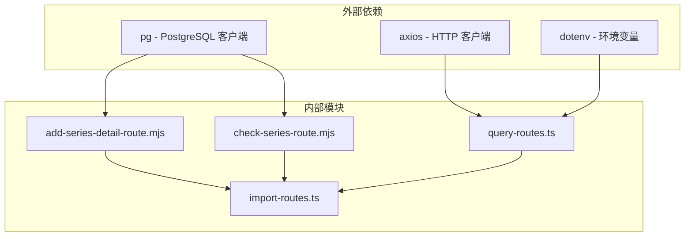

**图表来源**
- [add-series-detail-route.mjs](file://scripts/add-series-detail-route.mjs#L1-L3)
- [query-routes.ts](file://scripts/query-routes.ts#L5-L6)
- [package.json](file://package.json#L114-L124)

### 内部模块耦合

脚本之间存在明确的职责分工和依赖关系：

| 脚本文件 | 主要职责 | 依赖脚本 | 被依赖脚本 |
|----------|----------|----------|------------|
| add-series-detail-route.mjs | 剧集详情路由创建 | - | check-series-route.mjs |
| check-series-route.mjs | 路由状态检查 | - | - |
| query-routes.ts | 路由系统查询 | - | - |
| import-routes.ts | 路由配置导入 | - | - |

**章节来源**
- [package.json](file://package.json#L114-L124)

## 性能考虑

### 数据库连接优化

脚本采用连接池和及时关闭策略，确保资源的有效利用：

- **连接复用**: 使用单个客户端实例进行多次查询
- **及时关闭**: 操作完成后立即关闭数据库连接
- **错误恢复**: 异常情况下确保连接正确释放

### 查询性能优化

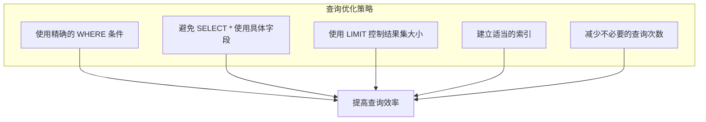

## 故障排除指南

### 常见问题及解决方案

#### 数据库连接问题

| 问题症状 | 可能原因 | 解决方案 |
|----------|----------|----------|
| 连接超时 | 网络配置错误 | 检查主机和端口配置 |
| 认证失败 | 用户名密码错误 | 验证数据库凭据 |
| 数据库不可达 | 服务未启动 | 启动 PostgreSQL 服务 |

#### 路由创建失败

| 问题症状 | 可能原因 | 解决方案 |
|----------|----------|----------|
| 父级路由不存在 | app 父级未创建 | 先创建 app 父级路由 |
| 重复路由键 | route_key 冲突 | 使用时间戳生成唯一键 |
| 权限不足 | 数据库权限限制 | 检查用户权限设置 |

#### 路由状态异常

| 问题症状 | 可能原因 | 解决方案 |
|----------|----------|----------|
| 路由不显示 | is_visible 设置为 false | 修改为 true |
| 路由不可访问 | is_enabled 设置为 false | 修改为 true |
| 路由顺序错误 | sort_order 值不当 | 调整排序权重 |

**章节来源**
- [add-series-detail-route.mjs](file://scripts/add-series-detail-route.mjs#L23-L48)
- [check-series-route.mjs](file://scripts/check-series-route.mjs#L13-L45)

## 结论

剧集详情路由脚本系统为 zTorrent 站点提供了完善的自动化路由管理能力。通过精心设计的架构和严格的错误处理机制，该系统能够可靠地维护剧集详情路由的生命周期。

主要优势包括：
- **自动化程度高**: 减少手动数据库操作
- **错误处理完善**: 提供多层验证和保护
- **易于维护**: 清晰的代码结构和文档
- **扩展性强**: 支持未来路由功能的扩展

建议在生产环境中使用前，先在测试环境中验证脚本的正确性和安全性。

## 附录

### 实际使用示例

#### 执行剧集详情路由创建

```bash
# 在项目根目录执行
node scripts/add-series-detail-route.mjs
```

#### 验证路由状态

```bash
# 检查路由状态
node scripts/check-series-route.mjs

# 查询完整路由树
node scripts/query-routes.ts
```

#### 环境配置

在项目根目录创建 `.env` 文件：

```env
# 数据库连接配置
DB_HOST=192.168.50.2
DB_PORT=5432
DB_USER=ztorrent
DB_PASSWORD=TMYBKC47Jm8w4SB7
DB_NAME=ztorrent

# API 访问配置
ACCESS_TOKEN=your_jwt_token_here
ADMIN_USER=admin
ADMIN_PASS=admin123
```

**章节来源**
- [add-series-detail-route.mjs](file://scripts/add-series-detail-route.mjs#L5-L11)
- [query-routes.ts](file://scripts/query-routes.ts#L15-L35)