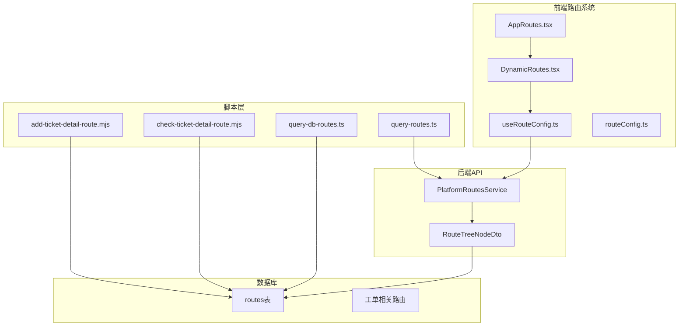
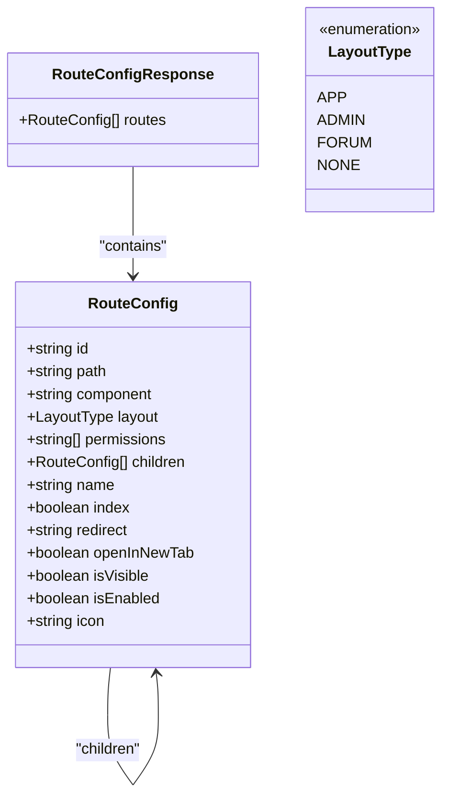
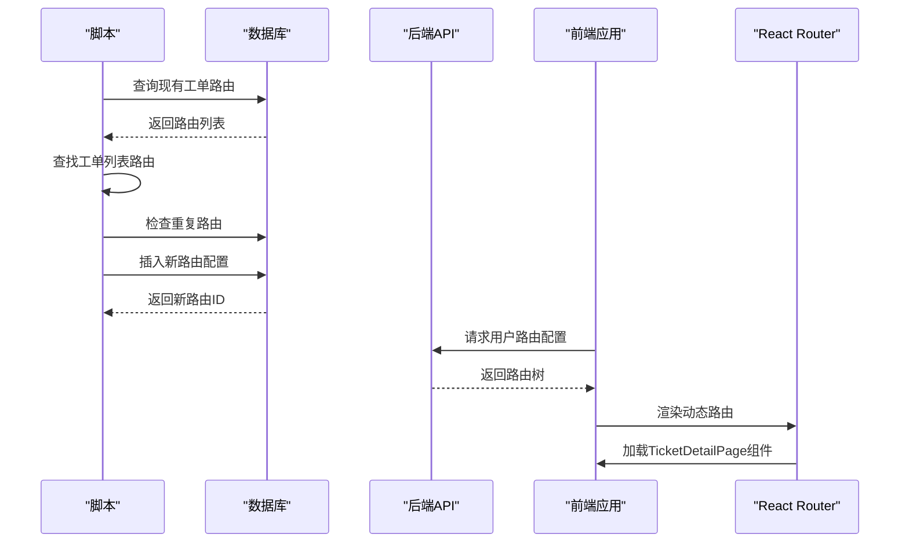
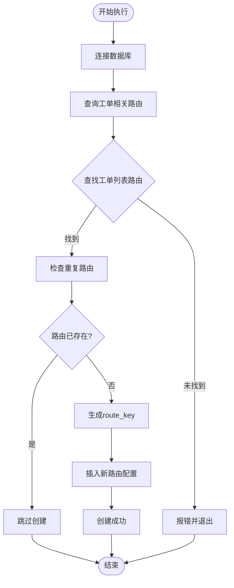
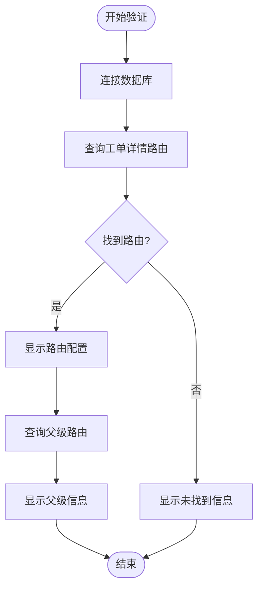
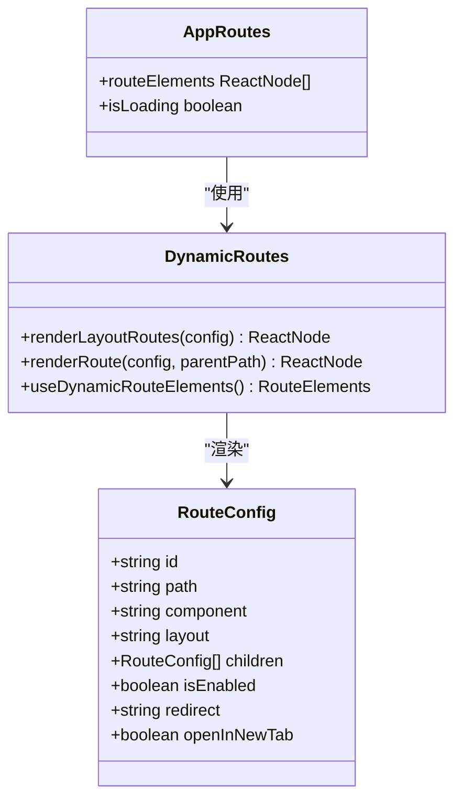
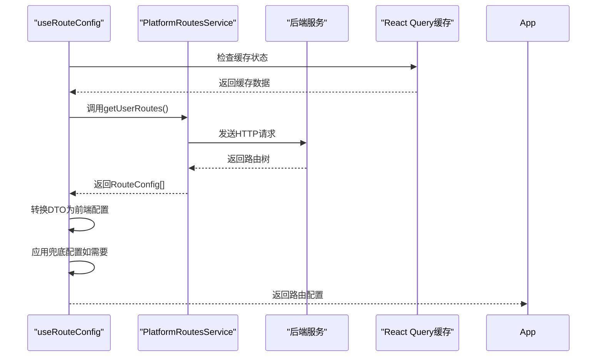
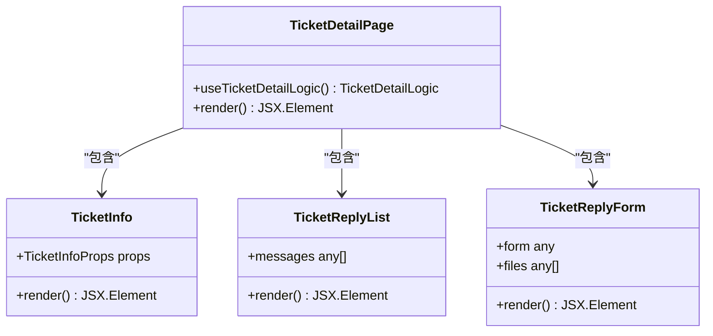
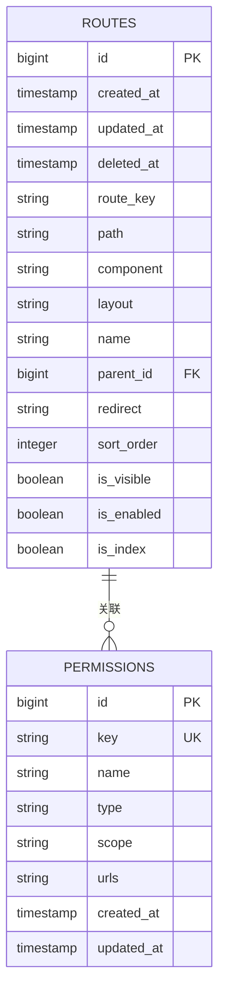
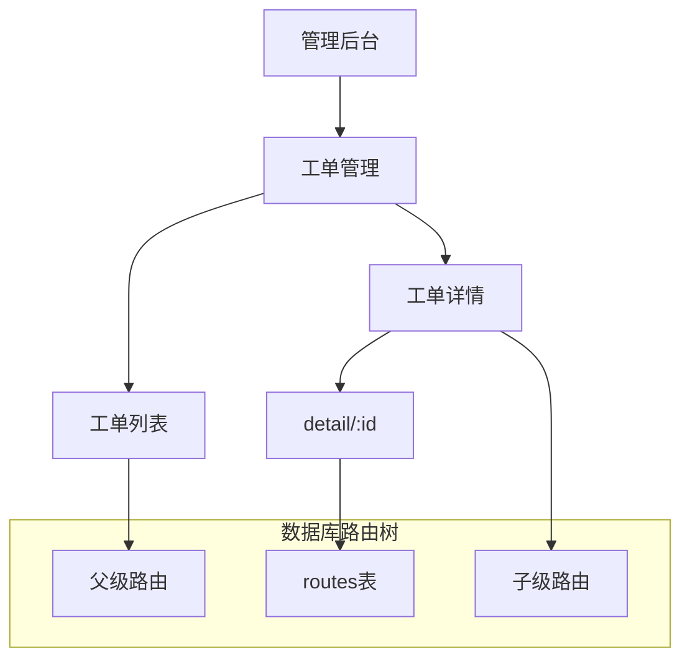

# 工单详情路由脚本

<cite>
**本文档引用的文件**
- [add-ticket-detail-route.mjs](file://scripts/add-ticket-detail-route.mjs)
- [check-ticket-detail-route.mjs](file://scripts/check-ticket-detail-route.mjs)
- [query-routes.ts](file://scripts/query-routes.ts)
- [query-db-routes.ts](file://scripts/query-db-routes.ts)
- [db-routes-result.txt](file://scripts/db-routes-result.txt)
- [admin-parent-result.txt](file://scripts/admin-parent-result.txt)
- [AppRoutes.tsx](file://src/routes/AppRoutes.tsx)
- [DynamicRoutes.tsx](file://src/routes/DynamicRoutes.tsx)
- [useRouteConfig.ts](file://src/hooks/useRouteConfig.ts)
- [routeConfig.ts](file://src/types/routeConfig.ts)
- [TicketDetailPage/index.tsx](file://src/modules/admin/pages/operations/interaction/TicketDetailPage/index.tsx)
- [TicketDetailPage/TicketInfo.tsx](file://src/modules/admin/pages/operations/interaction/TicketDetailPage/components/TicketInfo.tsx)
- [TicketsPage/index.tsx](file://src/modules/admin/pages/operations/interaction/TicketsPage/index.tsx)
</cite>

## 目录
1. [简介](#简介)
2. [项目结构](#项目结构)
3. [核心组件](#核心组件)
4. [架构概览](#架构概览)
5. [详细组件分析](#详细组件分析)
6. [依赖关系分析](#依赖关系分析)
7. [性能考虑](#性能考虑)
8. [故障排除指南](#故障排除指南)
9. [结论](#结论)

## 简介

本文档详细介绍了工单详情路由脚本的设计目的和实现原理。该脚本用于为工单管理系统添加详情路由配置，确保系统能够正确处理工单详情页面的路由需求。

工单详情路由脚本的核心功能包括：
- 自动查找工单列表路由作为父级路由
- 检查重复路由配置，避免重复创建
- 创建新的工单详情路由配置
- 与数据库进行交互，存储路由配置信息
- 确保路由参数正确设置和生效

## 项目结构

该项目采用前后端分离的架构，路由系统由多个组件协同工作：

**图表来源**
- [add-ticket-detail-route.mjs](file://scripts/add-ticket-detail-route.mjs#L1-L76)
- [AppRoutes.tsx](file://src/routes/AppRoutes.tsx#L1-L115)
- [DynamicRoutes.tsx](file://src/routes/DynamicRoutes.tsx#L1-L308)

**章节来源**
- [add-ticket-detail-route.mjs](file://scripts/add-ticket-detail-route.mjs#L1-L76)
- [AppRoutes.tsx](file://src/routes/AppRoutes.tsx#L1-L115)
- [DynamicRoutes.tsx](file://src/routes/DynamicRoutes.tsx#L1-L308)

## 核心组件

### 路由配置数据结构

系统使用统一的路由配置数据结构来描述所有路由信息：

**图表来源**
- [routeConfig.ts](file://src/types/routeConfig.ts#L1-L49)

### 工单详情路由配置

工单详情路由具有以下特征：
- 路径模式：`detail/:id`
- 组件：`TicketDetailPage`
- 布局：`admin`
- 可见性：`false`（不在菜单中显示）
- 父级路由：工单列表路由

**章节来源**
- [add-ticket-detail-route.mjs](file://scripts/add-ticket-detail-route.mjs#L53-L63)
- [db-routes-result.txt](file://scripts/db-routes-result.txt#L141-L142)

## 架构概览

工单详情路由系统采用动态路由架构，通过后端API提供路由配置：

**图表来源**
- [add-ticket-detail-route.mjs](file://scripts/add-ticket-detail-route.mjs#L13-L73)
- [useRouteConfig.ts](file://src/hooks/useRouteConfig.ts#L38-L100)

## 详细组件分析

### 工单详情路由创建脚本

#### 设计目的
该脚本的主要目的是自动化创建工单详情路由配置，确保系统具备完整的工单管理功能。

#### 实现原理

**图表来源**
- [add-ticket-detail-route.mjs](file://scripts/add-ticket-detail-route.mjs#L13-L73)

#### 关键实现步骤

1. **数据库连接**：使用PostgreSQL客户端连接到数据库
2. **路由查询**：查找所有包含"工单"或"ticket"的路由
3. **父级路由查找**：通过组件名为`AdminTicketsPage`的路由确定父级
4. **重复检查**：确保不会创建重复的工单详情路由
5. **路由创建**：插入新的工单详情路由配置
6. **结果验证**：输出创建的路由信息

**章节来源**
- [add-ticket-detail-route.mjs](file://scripts/add-ticket-detail-route.mjs#L13-L73)

### 路由验证脚本

#### 功能特性
验证脚本用于检查工单详情路由的配置状态和父级关系：

**图表来源**
- [check-ticket-detail-route.mjs](file://scripts/check-ticket-detail-route.mjs#L13-L42)

**章节来源**
- [check-ticket-detail-route.mjs](file://scripts/check-ticket-detail-route.mjs#L13-L42)

### 前端路由渲染系统

#### 动态路由渲染机制

**图表来源**
- [DynamicRoutes.tsx](file://src/routes/DynamicRoutes.tsx#L130-L249)
- [AppRoutes.tsx](file://src/routes/AppRoutes.tsx#L73-L98)

#### 路由配置获取流程

**图表来源**
- [useRouteConfig.ts](file://src/hooks/useRouteConfig.ts#L63-L100)

**章节来源**
- [DynamicRoutes.tsx](file://src/routes/DynamicRoutes.tsx#L1-L308)
- [useRouteConfig.ts](file://src/hooks/useRouteConfig.ts#L1-L109)

### 工单详情页面组件

#### 组件结构

**图表来源**
- [TicketDetailPage/index.tsx](file://src/modules/admin/pages/operations/interaction/TicketDetailPage/index.tsx#L1-L52)
- [TicketDetailPage/TicketInfo.tsx](file://src/modules/admin/pages/operations/interaction/TicketDetailPage/components/TicketInfo.tsx#L1-L43)

**章节来源**
- [TicketDetailPage/index.tsx](file://src/modules/admin/pages/operations/interaction/TicketDetailPage/index.tsx#L1-L52)
- [TicketDetailPage/TicketInfo.tsx](file://src/modules/admin/pages/operations/interaction/TicketDetailPage/components/TicketInfo.tsx#L1-L43)

## 依赖关系分析

### 数据库表结构

系统使用统一的`routes`表存储所有路由配置信息：

**图表来源**
- [db-routes-result.txt](file://scripts/db-routes-result.txt#L3-L19)

### 路由层次关系

**图表来源**
- [db-routes-result.txt](file://scripts/db-routes-result.txt#L141-L142)
- [admin-parent-result.txt](file://scripts/admin-parent-result.txt#L20-L22)

**章节来源**
- [query-db-routes.ts](file://scripts/query-db-routes.ts#L1-L90)
- [db-routes-result.txt](file://scripts/db-routes-result.txt#L1-L145)

## 性能考虑

### 路由配置缓存策略

前端路由系统采用了智能缓存机制来优化性能：

- **缓存时间**：5分钟（300秒）
- **缓存失效**：基于认证状态变化自动刷新
- **条件加载**：仅在用户已认证时才加载路由配置
- **错误重试**：最多重试1次

### 数据库查询优化

脚本执行过程中采用了高效的查询策略：
- 使用精确的WHERE条件过滤工单相关路由
- 通过ORDER BY确保查询结果的稳定性
- 使用参数化查询防止SQL注入攻击

## 故障排除指南

### 常见问题及解决方案

#### 1. 数据库连接失败
**症状**：脚本报错无法连接数据库
**解决方案**：
- 检查数据库连接参数（主机、端口、用户名、密码）
- 确认数据库服务正常运行
- 验证网络连接和防火墙设置

#### 2. 工单列表路由未找到
**症状**：脚本报错未找到工单列表路由
**解决方案**：
- 确认数据库中存在`AdminTicketsPage`组件的路由
- 检查路由名称是否包含"工单"关键词
- 验证路由的`layout`字段是否为`admin`

#### 3. 重复路由创建失败
**症状**：脚本提示工单详情路由已存在
**解决方案**：
- 使用验证脚本检查现有路由配置
- 如需重新创建，先删除现有路由再执行脚本
- 检查路由的`component`字段是否正确

#### 4. 前端路由不生效
**症状**：浏览器无法访问工单详情页面
**解决方案**：
- 使用查询脚本验证后端路由配置
- 检查前端路由渲染日志
- 确认用户具有相应的权限

**章节来源**
- [check-ticket-detail-route.mjs](file://scripts/check-ticket-detail-route.mjs#L13-L42)
- [query-routes.ts](file://scripts/query-routes.ts#L98-L108)

## 结论

工单详情路由脚本为工单管理系统提供了完整的路由配置自动化解决方案。通过该脚本，系统能够：

1. **自动化路由管理**：减少手动配置的工作量和错误率
2. **确保路由一致性**：通过重复检查避免配置冲突
3. **提供验证机制**：通过验证脚本确保配置正确性
4. **集成完整生态**：与前端动态路由系统无缝集成

该脚本的设计充分考虑了系统的可维护性和扩展性，为后续的路由管理提供了良好的基础。通过合理的错误处理和验证机制，确保了系统的稳定运行。