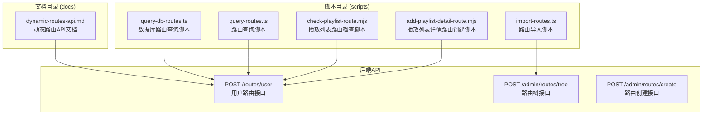
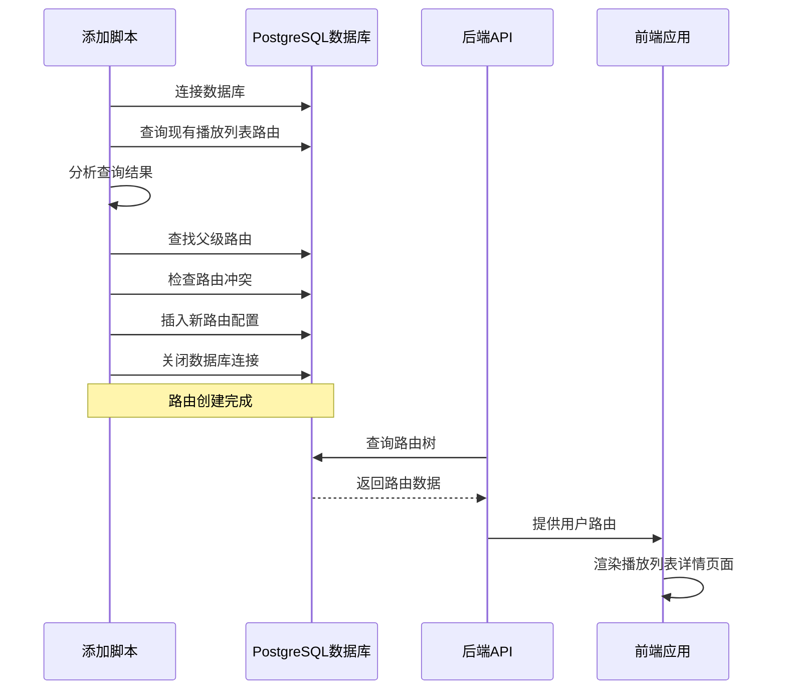
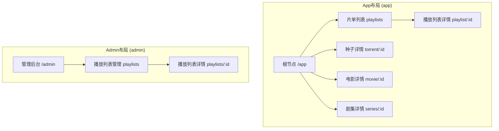
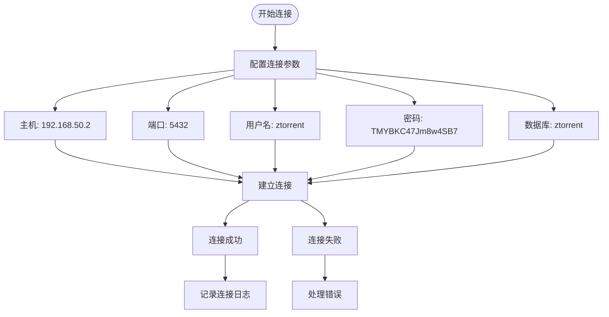
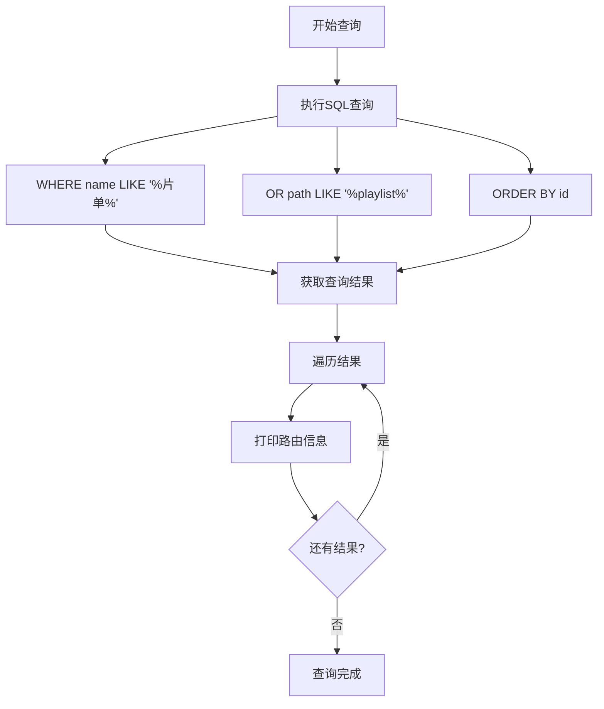
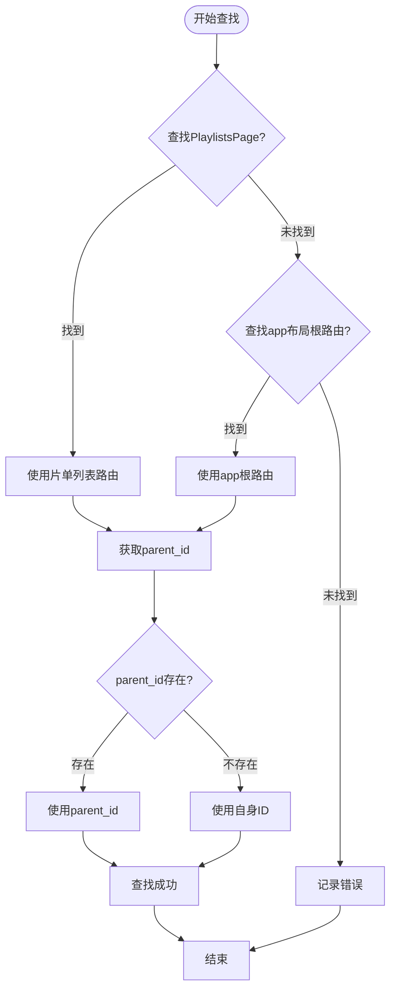
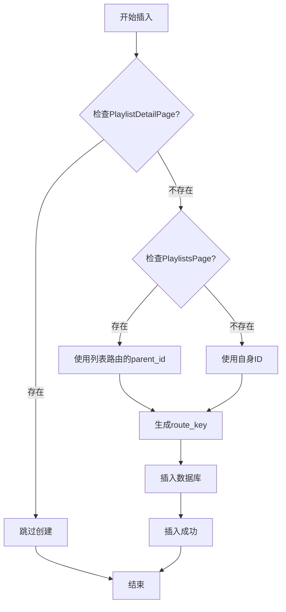
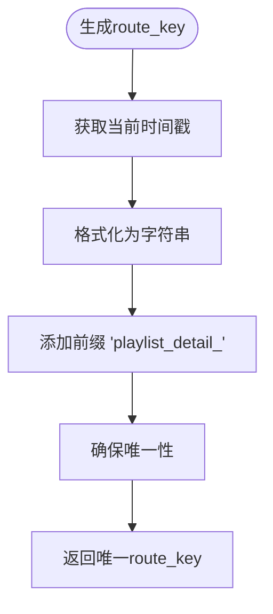
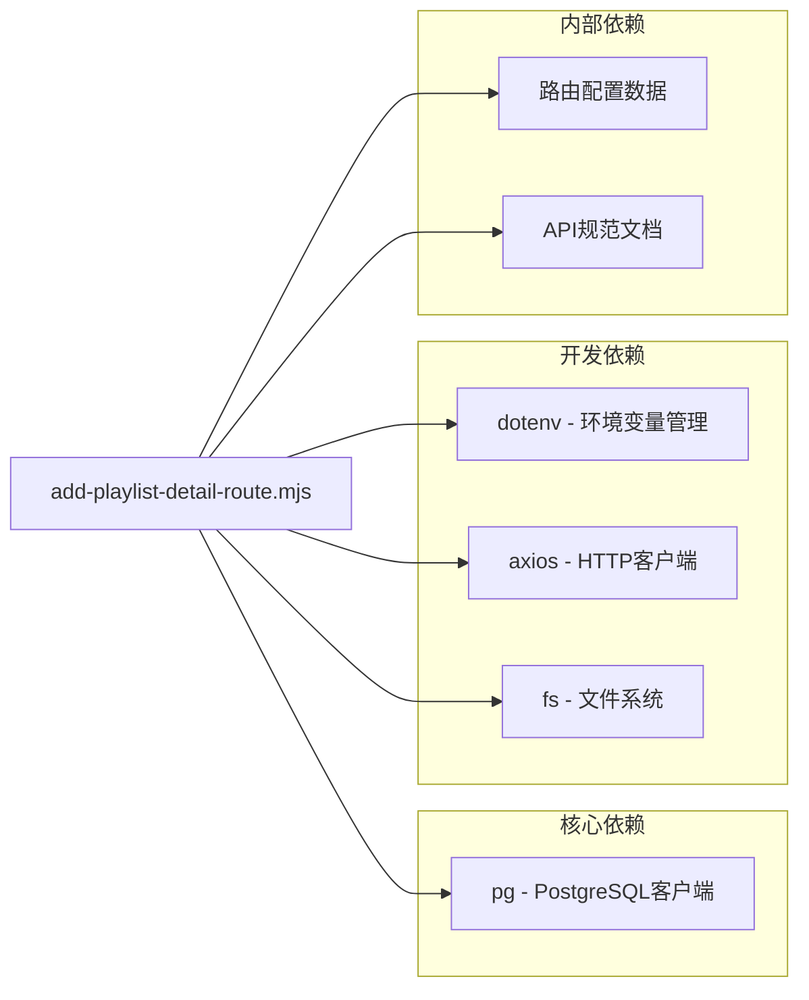
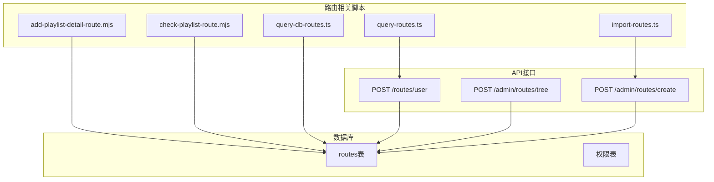

# 播放列表详情路由脚本

<cite>
**本文档引用的文件**
- [add-playlist-detail-route.mjs](file://scripts/add-playlist-detail-route.mjs)
- [check-playlist-route.mjs](file://scripts/check-playlist-route.mjs)
- [query-routes.ts](file://scripts/query-routes.ts)
- [query-db-routes.ts](file://scripts/query-db-routes.ts)
- [import-routes.ts](file://scripts/import-routes.ts)
- [dynamic-routes-api.md](file://docs/dev/dynamic-routes-api.md)
</cite>

## 目录
1. [简介](#简介)
2. [项目结构](#项目结构)
3. [核心组件](#核心组件)
4. [架构概览](#架构概览)
5. [详细组件分析](#详细组件分析)
6. [依赖关系分析](#依赖关系分析)
7. [性能考虑](#性能考虑)
8. [故障排除指南](#故障排除指南)
9. [结论](#结论)

## 简介

本文档详细介绍了为播放列表详情页添加路由配置的完整操作指南。该脚本位于 `scripts/add-playlist-detail-route.mjs`，专门用于在数据库中创建播放列表详情路由配置。该脚本实现了完整的数据库连接、路由查询、父级路由查找和新路由插入流程。

播放列表详情路由是动态路由系统的重要组成部分，它允许用户通过 `playlist/:id` 路径访问特定的播放列表详情页面。该脚本确保了路由配置的一致性和完整性，同时提供了完善的错误处理和调试功能。

## 项目结构

该项目采用前后端分离的架构，路由配置主要通过数据库进行管理。关键的脚本文件分布如下：



**图表来源**
- [add-playlist-detail-route.mjs](file://scripts/add-playlist-detail-route.mjs#L1-L91)
- [dynamic-routes-api.md](file://docs/dev/dynamic-routes-api.md#L1-L127)

**章节来源**
- [add-playlist-detail-route.mjs](file://scripts/add-playlist-detail-route.mjs#L1-L91)
- [dynamic-routes-api.md](file://docs/dev/dynamic-routes-api.md#L1-L127)

## 核心组件

### 主要功能模块

该脚本包含以下核心功能模块：

1. **数据库连接管理** - 使用 PostgreSQL 客户端连接数据库
2. **路由查询模块** - 搜索现有的播放列表相关路由
3. **父级路由查找** - 自动识别合适的父级路由节点
4. **路由冲突检测** - 防止重复创建相同的路由配置
5. **新路由创建** - 插入播放列表详情路由配置
6. **结果输出** - 提供详细的执行日志和调试信息

### 数据库连接配置

脚本使用以下数据库连接参数：

| 参数 | 值 | 说明 |
|------|-----|------|
| host | 192.168.50.2 | 数据库服务器地址 |
| port | 5432 | PostgreSQL 默认端口 |
| user | ztorrent | 数据库用户名 |
| password | TMYBKC47Jm8w4SB7 | 数据库密码 |
| database | ztorrent | 数据库名称 |

### 路由配置参数

新创建的播放列表详情路由具有以下配置：

| 参数 | 值 | 说明 |
|------|-----|------|
| route_key | playlist_detail_{timestamp} | 唯一标识符 |
| path | playlist/:id | 路由路径模式 |
| component | PlaylistDetailPage | 前端组件名称 |
| layout | app | 应用布局类型 |
| name | 片单详情 | 显示名称 |
| is_visible | false | 不在菜单中显示 |
| is_enabled | true | 路由启用状态 |
| sort_order | 99 | 排序权重 |

**章节来源**
- [add-playlist-detail-route.mjs](file://scripts/add-playlist-detail-route.mjs#L5-L11)
- [add-playlist-detail-route.mjs](file://scripts/add-playlist-detail-route.mjs#L67-L77)

## 架构概览

### 整体架构流程



**图表来源**
- [add-playlist-detail-route.mjs](file://scripts/add-playlist-detail-route.mjs#L13-L88)
- [dynamic-routes-api.md](file://docs/dev/dynamic-routes-api.md#L16-L58)

### 路由层次结构



**图表来源**
- [import-routes.ts](file://scripts/import-routes.ts#L99-L113)
- [import-routes.ts](file://scripts/import-routes.ts#L699-L715)

## 详细组件分析

### 数据库连接管理

#### 连接参数配置

脚本使用 PostgreSQL 客户端库建立数据库连接，连接参数在文件顶部定义：



**图表来源**
- [add-playlist-detail-route.mjs](file://scripts/add-playlist-detail-route.mjs#L5-L11)

#### 连接生命周期管理

数据库连接遵循严格的生命周期管理：

1. **连接建立** - 在脚本启动时建立连接
2. **查询执行** - 执行各种路由查询操作
3. **连接关闭** - 在脚本结束时关闭连接

**章节来源**
- [add-playlist-detail-route.mjs](file://scripts/add-playlist-detail-route.mjs#L13-L15)

### 路由查询逻辑

#### 播放列表路由搜索

脚本首先查询所有与播放列表相关的现有路由：



**图表来源**
- [add-playlist-detail-route.mjs](file://scripts/add-playlist-detail-route.mjs#L18-L25)

#### 查询结果格式化

查询结果以表格形式展示，包含以下关键信息：

| 字段 | 描述 | 示例值 |
|------|------|--------|
| id | 数据库唯一标识符 | 797039193250467840 |
| name | 路由显示名称 | 片单列表 |
| path | 路由路径 | playlists |
| component | 前端组件 | PlaylistsPage |
| layout | 布局类型 | app |
| parent_id | 父级路由ID | 795987674820382720 |

**章节来源**
- [add-playlist-detail-route.mjs](file://scripts/add-playlist-detail-route.mjs#L22-L25)

### 父级路由查找机制

#### 查找策略

脚本采用智能的父级路由查找策略：



**图表来源**
- [add-playlist-detail-route.mjs](file://scripts/add-playlist-detail-route.mjs#L27-L41)

#### 父级路由选择逻辑

1. **优先级1**: 查找 `PlaylistsPage` 组件的路由
2. **优先级2**: 查找 `app` 布局的根路由 (`/app`)
3. **回退机制**: 如果都找不到，脚本终止执行

**章节来源**
- [add-playlist-detail-route.mjs](file://scripts/add-playlist-detail-route.mjs#L27-L41)

### 新路由插入流程

#### 冲突检测机制

在插入新路由之前，脚本执行双重冲突检测：



**图表来源**
- [add-playlist-detail-route.mjs](file://scripts/add-playlist-detail-route.mjs#L49-L77)

#### 路由键生成策略

使用时间戳生成唯一的 `route_key`：



**图表来源**
- [add-playlist-detail-route.mjs](file://scripts/add-playlist-detail-route.mjs#L60-L61)

**章节来源**
- [add-playlist-detail-route.mjs](file://scripts/add-playlist-detail-route.mjs#L49-L77)

## 依赖关系分析

### 外部依赖

该脚本依赖于以下外部库：



**图表来源**
- [add-playlist-detail-route.mjs](file://scripts/add-playlist-detail-route.mjs#L1-L3)
- [query-routes.ts](file://scripts/query-routes.ts#L5-L6)

### 内部依赖关系



**图表来源**
- [dynamic-routes-api.md](file://docs/dev/dynamic-routes-api.md#L16-L75)

**章节来源**
- [dynamic-routes-api.md](file://docs/dev/dynamic-routes-api.md#L1-L127)

## 性能考虑

### 数据库查询优化

1. **索引利用**: 查询语句使用了适当的 WHERE 条件，可以有效利用数据库索引
2. **结果限制**: 查询结果按 ID 排序，便于后续处理
3. **连接池**: 使用单次连接完成所有操作，避免频繁连接开销

### 内存使用优化

1. **流式处理**: 查询结果以流式方式处理，避免大量内存占用
2. **及时释放**: 脚本结束后立即关闭数据库连接
3. **最小化数据传输**: 只查询必要的字段信息

### 执行效率

1. **顺序执行**: 脚本按顺序执行各个步骤，避免不必要的并发操作
2. **早停机制**: 在找到合适父级路由后立即停止进一步查询
3. **缓存友好**: 适合定期运行，不会对数据库造成过大压力

## 故障排除指南

### 常见问题及解决方案

#### 数据库连接问题

**问题症状**:
- 脚本启动时立即报错
- 显示连接超时或认证失败

**解决步骤**:
1. 验证数据库服务器可达性
2. 检查网络连接和防火墙设置
3. 确认数据库凭据正确性
4. 验证数据库服务状态

**章节来源**
- [add-playlist-detail-route.mjs](file://scripts/add-playlist-detail-route.mjs#L13-L15)

#### 路由查找失败

**问题症状**:
- 输出 "未找到合适的父路由"
- 脚本提前结束

**解决步骤**:
1. 使用 `check-playlist-route.mjs` 脚本检查现有路由
2. 确认 `PlaylistsPage` 组件路由存在
3. 验证 `app` 布局根路由配置正确
4. 检查路由层级关系是否正确

**章节来源**
- [add-playlist-detail-route.mjs](file://scripts/add-playlist-detail-route.mjs#L43-L47)

#### 路由冲突检测

**问题症状**:
- 输出 "片单详情路由已存在，跳过创建"

**解决步骤**:
1. 验证是否确实需要创建新路由
2. 检查现有路由配置是否满足需求
3. 如需修改现有路由，使用更新接口而非重新创建

**章节来源**
- [add-playlist-detail-route.mjs](file://scripts/add-playlist-detail-route.mjs#L54-L58)

### 调试工具使用

#### 路由查询脚本

使用 `query-routes.ts` 脚本获取完整的路由树信息：

```bash
node scripts/query-routes.ts
```

该脚本提供以下功能：
- 登录获取访问令牌
- 查询完整路由树
- 分析路由结构
- 检查用户可见路由

#### 数据库直接查询

使用 `query-db-routes.ts` 脚本直接查询数据库：

```bash
node scripts/query-db-routes.ts
```

该脚本输出：
- 数据库表结构信息
- 根节点路由列表
- 管理相关路由
- 路由总数统计
- 路由详细信息

**章节来源**
- [query-routes.ts](file://scripts/query-routes.ts#L7-L112)
- [query-db-routes.ts](file://scripts/query-db-routes.ts#L7-L90)

### 日志分析

脚本提供了详细的执行日志，包括：

1. **连接状态**: ✅ 已连接到数据库
2. **查询结果**: 📋 现有片单相关路由
3. **父级选择**: 📌 使用app布局根路由作为父级
4. **创建结果**: ✅ 已创建片单详情路由
5. **连接关闭**: 🔌 数据库连接已关闭

这些日志有助于快速定位问题所在。

## 结论

播放列表详情路由脚本为动态路由系统提供了完整的自动化解决方案。该脚本具有以下优势：

1. **自动化程度高**: 从数据库连接到路由创建完全自动化
2. **错误处理完善**: 提供多种错误检测和处理机制
3. **调试友好**: 详细的日志输出便于问题诊断
4. **安全性保证**: 防止重复创建相同路由配置
5. **灵活性强**: 支持多种父级路由查找策略

通过合理使用该脚本，可以确保播放列表详情路由的正确配置，为用户提供一致的导航体验。建议在生产环境中定期运行该脚本，确保路由配置的准确性和完整性。