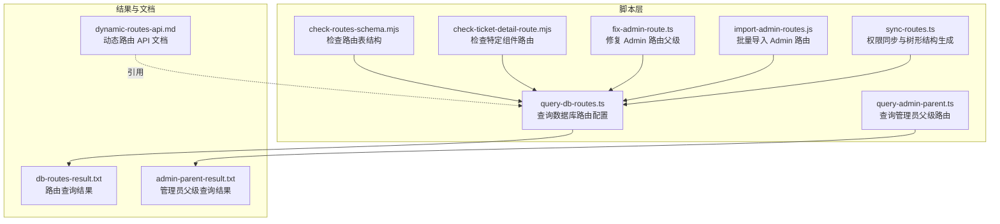
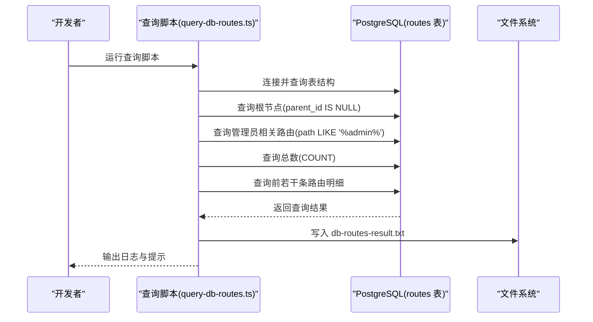
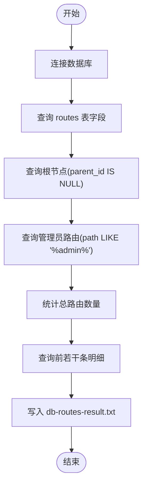
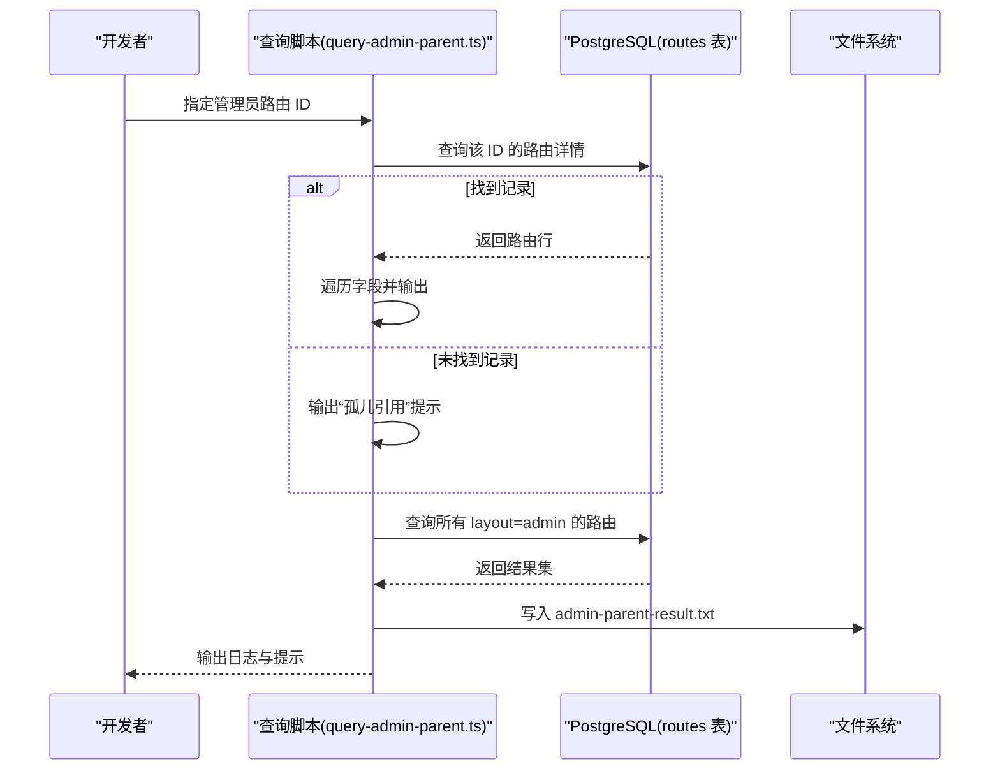
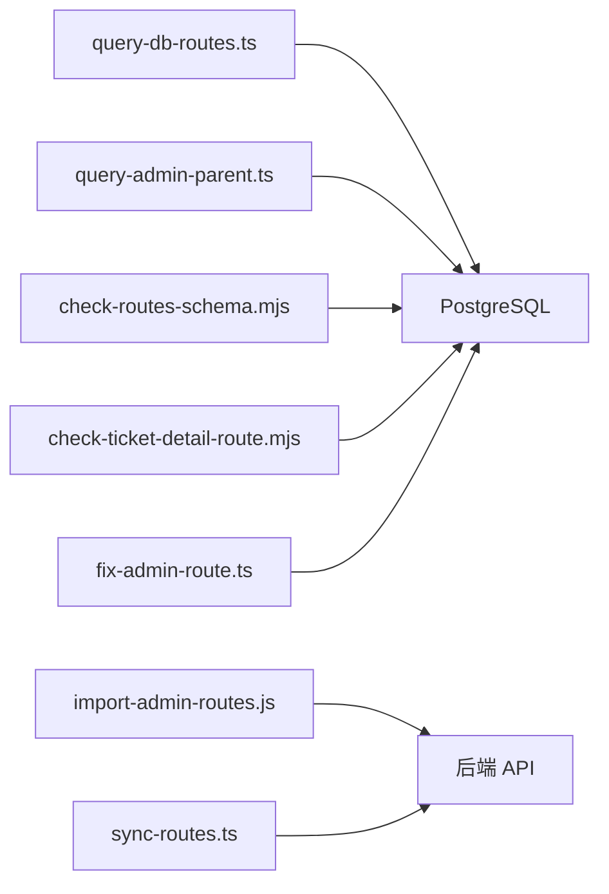

# 数据库查询脚本

<cite>
**本文档引用的文件**
- [scripts/query-db-routes.ts](file://scripts/query-db-routes.ts)
- [scripts/query-admin-parent.ts](file://scripts/query-admin-parent.ts)
- [scripts/check-routes-schema.mjs](file://scripts/check-routes-schema.mjs)
- [scripts/check-ticket-detail-route.mjs](file://scripts/check-ticket-detail-route.mjs)
- [scripts/fix-admin-route.ts](file://scripts/fix-admin-route.ts)
- [scripts/import-admin-routes.js](file://scripts/import-admin-routes.js)
- [scripts/sync-routes.ts](file://scripts/sync-routes.ts)
- [scripts/db-routes-result.txt](file://scripts/db-routes-result.txt)
- [scripts/admin-parent-result.txt](file://scripts/admin-parent-result.txt)
- [docs/dev/dynamic-routes-api.md](file://docs/dev/dynamic-routes-api.md)
- [README.md](file://README.md)
</cite>

## 目录
1. [简介](#简介)
2. [项目结构](#项目结构)
3. [核心组件](#核心组件)
4. [架构总览](#架构总览)
5. [详细组件分析](#详细组件分析)
6. [依赖分析](#依赖分析)
7. [性能考量](#性能考量)
8. [故障排除指南](#故障排除指南)
9. [结论](#结论)
10. [附录](#附录)

## 简介
本文件面向数据库查询脚本的技术文档，聚焦以下目标：
- 介绍如何从数据库获取路由配置数据，并说明查询结果的格式与处理方式
- 深入解释“管理员父级查询脚本”的实现原理，包括父子路由关系的查询逻辑与结果分析
- 说明查询结果文件的格式与解读方法
- 提供数据库查询的最佳实践、性能优化建议与故障排除指南
- 展示查询脚本在系统维护与调试中的应用场景

## 项目结构
与数据库查询脚本相关的文件主要位于 scripts 目录，配合文档目录下的动态路由 API 文档，形成前后端协同的查询与治理闭环。

图表来源
- [scripts/query-db-routes.ts](file://scripts/query-db-routes.ts#L1-L90)
- [scripts/query-admin-parent.ts](file://scripts/query-admin-parent.ts#L1-L75)
- [scripts/check-routes-schema.mjs](file://scripts/check-routes-schema.mjs#L1-L39)
- [scripts/check-ticket-detail-route.mjs](file://scripts/check-ticket-detail-route.mjs#L1-L45)
- [scripts/fix-admin-route.ts](file://scripts/fix-admin-route.ts#L1-L93)
- [scripts/import-admin-routes.js](file://scripts/import-admin-routes.js#L1-L101)
- [scripts/sync-routes.ts](file://scripts/sync-routes.ts#L1-L718)
- [scripts/db-routes-result.txt](file://scripts/db-routes-result.txt#L1-L145)
- [scripts/admin-parent-result.txt](file://scripts/admin-parent-result.txt#L1-L22)
- [docs/dev/dynamic-routes-api.md](file://docs/dev/dynamic-routes-api.md#L1-L127)

章节来源
- [scripts/query-db-routes.ts](file://scripts/query-db-routes.ts#L1-L90)
- [scripts/query-admin-parent.ts](file://scripts/query-admin-parent.ts#L1-L75)
- [scripts/check-routes-schema.mjs](file://scripts/check-routes-schema.mjs#L1-L39)
- [scripts/check-ticket-detail-route.mjs](file://scripts/check-ticket-detail-route.mjs#L1-L45)
- [scripts/fix-admin-route.ts](file://scripts/fix-admin-route.ts#L1-L93)
- [scripts/import-admin-routes.js](file://scripts/import-admin-routes.js#L1-L101)
- [scripts/sync-routes.ts](file://scripts/sync-routes.ts#L1-L718)
- [scripts/db-routes-result.txt](file://scripts/db-routes-result.txt#L1-L145)
- [scripts/admin-parent-result.txt](file://scripts/admin-parent-result.txt#L1-L22)
- [docs/dev/dynamic-routes-api.md](file://docs/dev/dynamic-routes-api.md#L1-L127)

## 核心组件
- 数据库路由查询脚本：负责连接 PostgreSQL，查询 routes 表的结构、根节点、管理员相关路由、总数以及部分路由明细，输出到文本文件，便于人工审阅与自动化处理。
- 管理员父级查询脚本：针对特定管理员路由 ID 查询其自身信息，并列出所有 layout 为 admin 的路由，辅助定位父子关系与异常引用。
- 路由表结构检查脚本：输出 routes 表的列定义与示例数据，帮助确认字段约束与数据类型。
- 特定组件路由检查脚本：按组件名反查路由及其父级，便于定位页面级路由与其父节点。
- Admin 路由修复脚本：将 Admin 根路由的父级修正为 null，确保其作为真正根节点显示。
- Admin 路由批量导入脚本：通过 API 批量导入路由配置，常与数据库查询结果配合进行治理。
- 权限同步脚本：扫描前端源码提取权限键与页面/按钮关联，结合后端接口生成权限树并批量创建/更新。

章节来源
- [scripts/query-db-routes.ts](file://scripts/query-db-routes.ts#L1-L90)
- [scripts/query-admin-parent.ts](file://scripts/query-admin-parent.ts#L1-L75)
- [scripts/check-routes-schema.mjs](file://scripts/check-routes-schema.mjs#L1-L39)
- [scripts/check-ticket-detail-route.mjs](file://scripts/check-ticket-detail-route.mjs#L1-L45)
- [scripts/fix-admin-route.ts](file://scripts/fix-admin-route.ts#L1-L93)
- [scripts/import-admin-routes.js](file://scripts/import-admin-routes.js#L1-L101)
- [scripts/sync-routes.ts](file://scripts/sync-routes.ts#L1-L718)

## 架构总览
数据库查询脚本围绕 routes 表执行多维度查询，形成“结构—根节点—管理员—总量—明细”的信息链路，最终落盘为文本文件，供后续导入、修复与审计使用。

图表来源
- [scripts/query-db-routes.ts](file://scripts/query-db-routes.ts#L7-L86)
- [scripts/db-routes-result.txt](file://scripts/db-routes-result.txt#L1-L145)

章节来源
- [scripts/query-db-routes.ts](file://scripts/query-db-routes.ts#L1-L90)
- [scripts/db-routes-result.txt](file://scripts/db-routes-result.txt#L1-L145)

## 详细组件分析

### 数据库路由查询脚本（query-db-routes.ts）
- 功能概述
  - 连接 PostgreSQL 数据库，查询 routes 表的字段清单、根节点、管理员相关路由、总数量与部分路由明细
  - 将结果输出到控制台并汇总写入 scripts/db-routes-result.txt
- 关键查询逻辑
  - 表结构：通过 information_schema 查询列名并按序排列
  - 根节点：parent_id 为空的路由即为根节点
  - 管理员路由：path 包含 admin 的路由集合
  - 总量：COUNT(*) 统计
  - 明细：LIMIT 200 展示关键字段（id/path/name/parent_id/component/layout）
- 结果文件解读
  - 字段清单：确认各字段是否存在、是否可空
  - 根节点数量与路径：用于判断应用/论坛/管理后台三分支的顶层节点
  - 管理员路由分布：辅助定位后台功能入口与父子关系
  - 路由总数：评估路由规模与变更影响范围
  - 明细：观察 component 与 layout 的对应关系，识别占位节点与实际页面

图表来源
- [scripts/query-db-routes.ts](file://scripts/query-db-routes.ts#L26-L86)
- [scripts/db-routes-result.txt](file://scripts/db-routes-result.txt#L1-L145)

章节来源
- [scripts/query-db-routes.ts](file://scripts/query-db-routes.ts#L1-L90)
- [scripts/db-routes-result.txt](file://scripts/db-routes-result.txt#L1-L145)

### 管理员父级查询脚本（query-admin-parent.ts）
- 功能概述
  - 针对指定管理员路由 ID 查询其自身信息
  - 列出所有 layout 为 admin 的路由，辅助分析父子关系与异常引用
- 实现要点
  - 使用参数化查询防止注入
  - 若未找到记录，提示“孤儿引用”风险
  - 输出到 scripts/admin-parent-result.txt，便于人工核验
- 结果文件解读
  - 自身信息：确认 id、path、name、parent_id 等字段
  - 管理员路由清单：核对父级是否正确、是否存在重复或遗漏

图表来源
- [scripts/query-admin-parent.ts](file://scripts/query-admin-parent.ts#L19-L71)
- [scripts/admin-parent-result.txt](file://scripts/admin-parent-result.txt#L1-L22)

章节来源
- [scripts/query-admin-parent.ts](file://scripts/query-admin-parent.ts#L1-L75)
- [scripts/admin-parent-result.txt](file://scripts/admin-parent-result.txt#L1-L22)

### 路由表结构检查脚本（check-routes-schema.mjs）
- 功能概述
  - 输出 routes 表的列名、数据类型与是否可空
  - 展示一条示例数据，辅助理解字段含义与取值范围
- 应用场景
  - 在执行其他查询前，先确认表结构变化
  - 与 query-db-routes.ts 协同，确保字段顺序与命名一致

章节来源
- [scripts/check-routes-schema.mjs](file://scripts/check-routes-schema.mjs#L1-L39)

### 特定组件路由检查脚本（check-ticket-detail-route.mjs）
- 功能概述
  - 按组件名反查路由，并查询其父级路由
  - 便于定位页面级路由与其父节点，核对父子关系
- 适用场景
  - 新增页面组件后，快速验证路由挂载位置
  - 排查页面无法访问或菜单不显示的问题

章节来源
- [scripts/check-ticket-detail-route.mjs](file://scripts/check-ticket-detail-route.mjs#L1-L45)

### Admin 路由修复脚本（fix-admin-route.ts）
- 功能概述
  - 将 Admin 根路由的 parent_id 设为 null，确保其作为根节点显示
  - 修复前后分别输出状态，最后列出全部根节点
- 适用场景
  - 管理后台导航异常、Admin 路由被错误挂载到其他父节点时

章节来源
- [scripts/fix-admin-route.ts](file://scripts/fix-admin-route.ts#L1-L93)

### Admin 路由批量导入脚本（import-admin-routes.js）
- 功能概述
  - 通过 API 批量导入路由配置，常与数据库查询结果配合
  - 需要设置 API_BASE_URL 与 ACCESS_TOKEN 环境变量
- 适用场景
  - 初始化或大规模迁移路由配置时

章节来源
- [scripts/import-admin-routes.js](file://scripts/import-admin-routes.js#L1-L101)

### 权限同步脚本（sync-routes.ts）
- 功能概述
  - 扫描前端源码提取页面与按钮权限键，构建权限树并批量创建/更新
  - 与后端 /permissions 接口协作，确保权限与路由一致
- 适用场景
  - 新增/修改页面或按钮权限时，统一同步至后端

章节来源
- [scripts/sync-routes.ts](file://scripts/sync-routes.ts#L1-L718)

## 依赖分析
- 外部依赖
  - PostgreSQL 客户端：用于连接数据库并执行查询
  - 文件系统：用于写入查询结果文本文件
  - HTTP 客户端：用于批量导入脚本调用后端 API
- 内部依赖
  - query-db-routes.ts 与 query-admin-parent.ts 依赖 routes 表结构
  - fix-admin-route.ts 依赖 routes 表的父级字段
  - import-admin-routes.js 依赖后端 /routes/import 接口
  - sync-routes.ts 依赖后端 /permissions 接口与前端源码结构

图表来源
- [scripts/query-db-routes.ts](file://scripts/query-db-routes.ts#L4-L14)
- [scripts/query-admin-parent.ts](file://scripts/query-admin-parent.ts#L1-L11)
- [scripts/check-routes-schema.mjs](file://scripts/check-routes-schema.mjs#L1-L11)
- [scripts/check-ticket-detail-route.mjs](file://scripts/check-ticket-detail-route.mjs#L1-L11)
- [scripts/fix-admin-route.ts](file://scripts/fix-admin-route.ts#L5-L14)
- [scripts/import-admin-routes.js](file://scripts/import-admin-routes.js#L1-L16)
- [scripts/sync-routes.ts](file://scripts/sync-routes.ts#L22-L28)

章节来源
- [scripts/query-db-routes.ts](file://scripts/query-db-routes.ts#L1-L90)
- [scripts/query-admin-parent.ts](file://scripts/query-admin-parent.ts#L1-L75)
- [scripts/check-routes-schema.mjs](file://scripts/check-routes-schema.mjs#L1-L39)
- [scripts/check-ticket-detail-route.mjs](file://scripts/check-ticket-detail-route.mjs#L1-L45)
- [scripts/fix-admin-route.ts](file://scripts/fix-admin-route.ts#L1-L93)
- [scripts/import-admin-routes.js](file://scripts/import-admin-routes.js#L1-L101)
- [scripts/sync-routes.ts](file://scripts/sync-routes.ts#L1-L718)

## 性能考量
- 连接与事务
  - 查询脚本使用短连接模式，避免长时间占用连接池
  - 建议在高并发环境下增加连接池配置或限制并发查询数量
- 查询优化
  - 使用 LIMIT 控制明细查询规模（当前脚本已限制前 200 条）
  - 对高频查询字段（如 parent_id、path、layout）建立合适索引
- IO 与落盘
  - 将结果写入文件时注意磁盘空间与权限
  - 大量日志输出可能影响性能，建议在生产环境减少冗余日志
- 缓存策略
  - 前端路由树在 Redis 中缓存 10 分钟，后台修改后自动清理
  - 批量导入后可调用清理缓存接口加速生效

章节来源
- [docs/dev/dynamic-routes-api.md](file://docs/dev/dynamic-routes-api.md#L1-L127)

## 故障排除指南
- 数据库连接失败
  - 检查主机、端口、用户名、密码与数据库名是否正确
  - 确认网络连通性与防火墙策略
- 查询结果为空或异常
  - 使用 check-routes-schema.mjs 确认表结构是否发生变化
  - 使用 check-ticket-detail-route.mjs 验证特定组件路由是否存在
- 管理员路由显示异常
  - 使用 fix-admin-route.ts 修复 Admin 根路由的父级为 null
  - 使用 query-admin-parent.ts 核对父级引用是否正确
- 批量导入失败
  - 确认 ACCESS_TOKEN 与 API_BASE_URL 环境变量已设置
  - 检查导入数据格式与后端接口规范
- 权限不同步
  - 使用 sync-routes.ts 扫描前端源码并批量创建/更新权限树

章节来源
- [scripts/query-db-routes.ts](file://scripts/query-db-routes.ts#L77-L86)
- [scripts/query-admin-parent.ts](file://scripts/query-admin-parent.ts#L67-L71)
- [scripts/check-routes-schema.mjs](file://scripts/check-routes-schema.mjs#L13-L38)
- [scripts/check-ticket-detail-route.mjs](file://scripts/check-ticket-detail-route.mjs#L13-L44)
- [scripts/fix-admin-route.ts](file://scripts/fix-admin-route.ts#L84-L93)
- [scripts/import-admin-routes.js](file://scripts/import-admin-routes.js#L70-L98)
- [scripts/sync-routes.ts](file://scripts/sync-routes.ts#L62-L99)

## 结论
数据库查询脚本为动态路由系统的维护与调试提供了强有力的支持。通过结构化查询、父子关系核验与批量导入/修复能力，能够有效保障路由配置的准确性与一致性。建议在日常运维中结合这些脚本与后端 API 文档，形成“查询—核验—修复—导入”的闭环流程。

## 附录
- 快速上手
  - 运行数据库路由查询：node scripts/query-db-routes.ts
  - 运行管理员父级查询：node scripts/query-admin-parent.ts
  - 检查表结构：node scripts/check-routes-schema.mjs
  - 检查特定组件路由：node scripts/check-ticket-detail-route.mjs
  - 修复 Admin 路由父级：node scripts/fix-admin-route.ts
  - 批量导入 Admin 路由：$env:ACCESS_TOKEN='your-token'; node scripts/import-admin-routes.js
  - 权限同步：npm run permissions:sync
- 参考文档
  - 动态路由 API 文档：docs/dev/dynamic-routes-api.md

章节来源
- [README.md](file://README.md#L6-L11)
- [docs/dev/dynamic-routes-api.md](file://docs/dev/dynamic-routes-api.md#L1-L127)