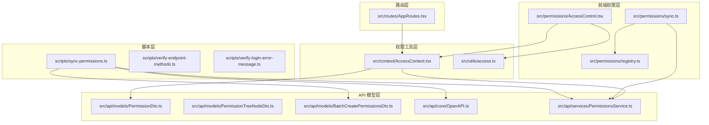
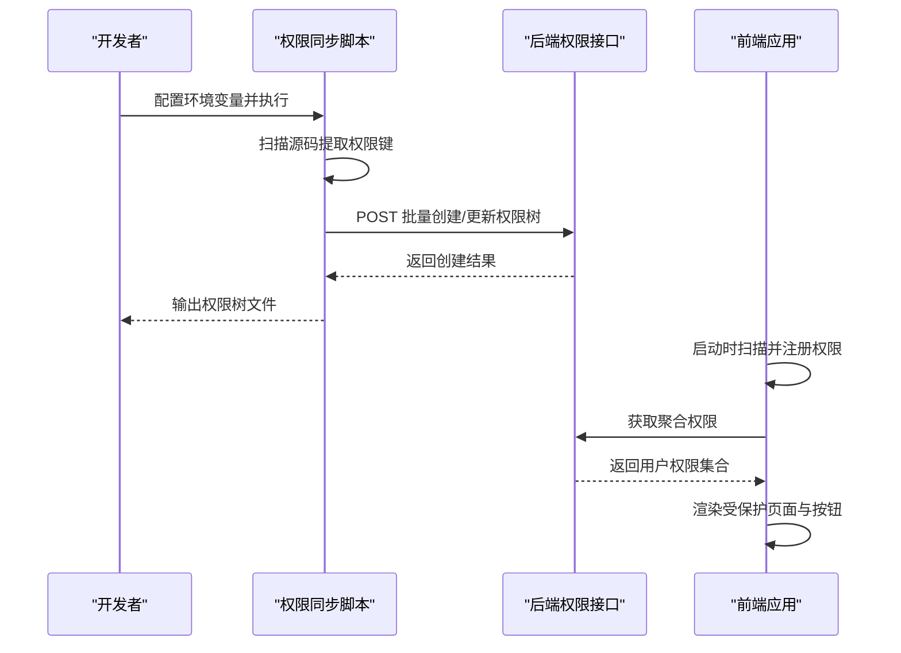
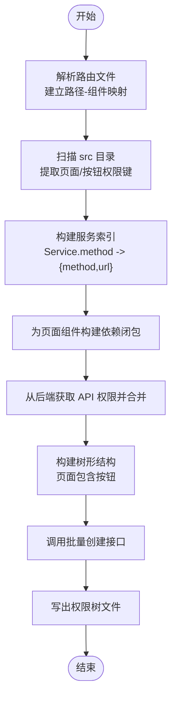
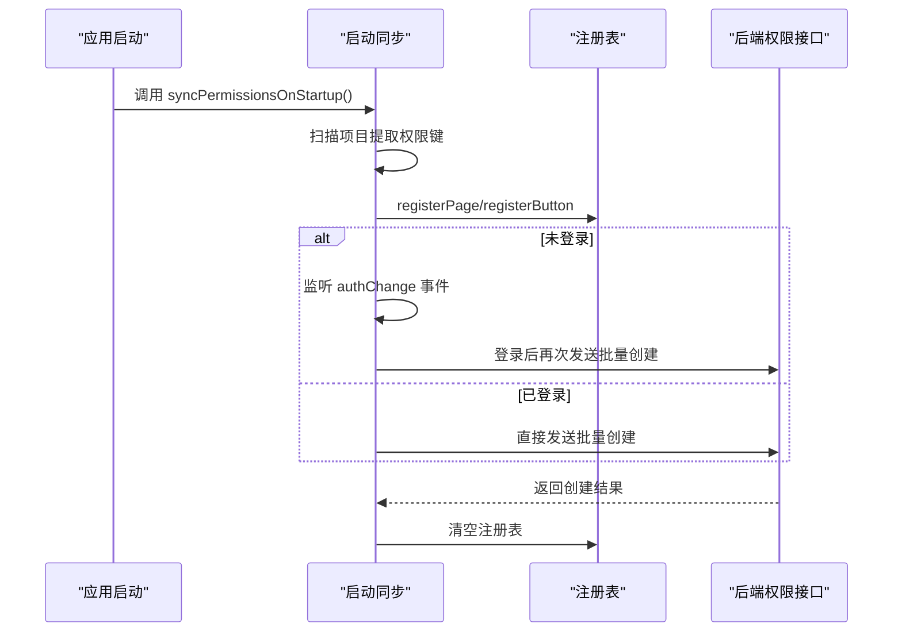
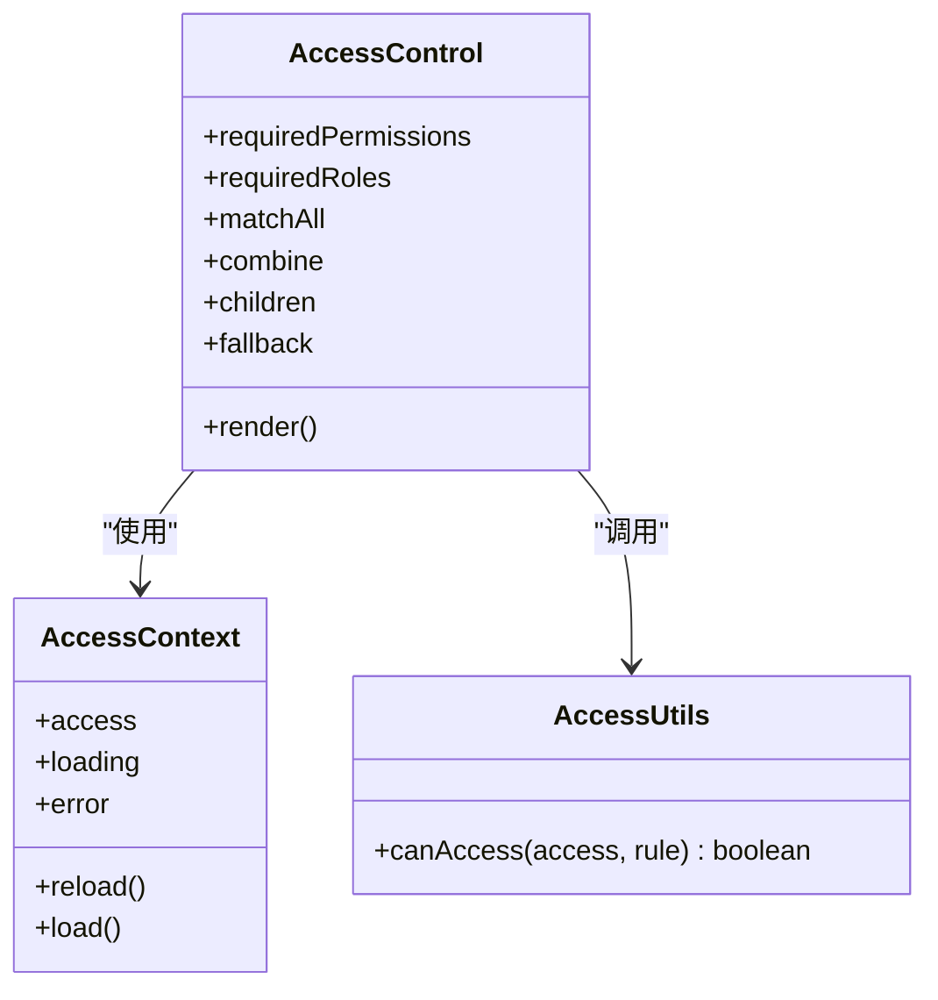
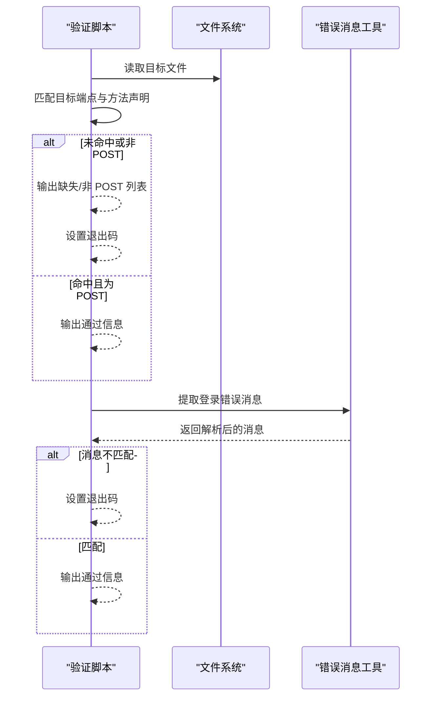
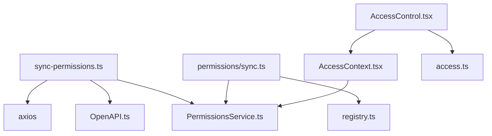

# 权限管理脚本

<cite>
**本文档引用的文件**
- [scripts/sync-permissions.ts](file://scripts/sync-permissions.ts)
- [scripts/verify-endpoint-methods.ts](file://scripts/verify-endpoint-methods.ts)
- [scripts/verify-login-error-message.ts](file://scripts/verify-login-error-message.ts)
- [src/permissions/sync.ts](file://src/permissions/sync.ts)
- [src/permissions/registry.ts](file://src/permissions/registry.ts)
- [src/permissions/AccessControl.tsx](file://src/permissions/AccessControl.tsx)
- [src/context/AccessContext.tsx](file://src/context/AccessContext.tsx)
- [src/utils/access.ts](file://src/utils/access.ts)
- [src/api/models/PermissionDto.ts](file://src/api/models/PermissionDto.ts)
- [src/api/models/PermissionTreeNodeDto.ts](file://src/api/models/PermissionTreeNodeDto.ts)
- [src/api/models/BatchCreatePermissionsDto.ts](file://src/api/models/BatchCreatePermissionsDto.ts)
- [src/api/core/OpenAPI.ts](file://src/api/core/OpenAPI.ts)
- [src/api/services/PermissionsService.ts](file://src/api/services/PermissionsService.ts)
- [src/routes/AppRoutes.tsx](file://src/routes/AppRoutes.tsx)
</cite>

## 目录
1. [简介](#简介)
2. [项目结构](#项目结构)
3. [核心组件](#核心组件)
4. [架构总览](#架构总览)
5. [详细组件分析](#详细组件分析)
6. [依赖分析](#依赖分析)
7. [性能考虑](#性能考虑)
8. [故障排除指南](#故障排除指南)
9. [结论](#结论)
10. [附录](#附录)

## 简介
本技术文档围绕权限管理脚本体系，系统阐述以下内容：
- 权限同步脚本的工作原理：如何从源代码中抽取权限键、如何与后端权限系统对接、以及如何构建权限树并批量创建/更新。
- 权限验证脚本的功能：端点方法验证与登录错误信息验证的具体实现与使用场景。
- 配置选项、执行参数与输出格式：帮助开发者正确配置与运行脚本。
- 调试方法与故障排除：定位常见问题与优化建议。
- 整体系统架构中的作用：权限脚本与前端权限系统、后端接口、路由系统之间的交互关系。

## 项目结构
权限相关能力分布在以下层次：
- 脚本层：提供离线扫描与验证能力，生成权限树并调用后端批量创建接口。
- 前端权限层：在应用启动时扫描并注册权限，随后与后端聚合接口交互。
- 权限工具层：统一的权限判断逻辑与上下文，支撑前端渲染与路由守卫。
- API 模型层：定义权限数据结构与批量创建输入模型。

**图表来源**
- [scripts/sync-permissions.ts](file://scripts/sync-permissions.ts#L62-L99)
- [src/permissions/sync.ts](file://src/permissions/sync.ts#L17-L64)
- [src/permissions/registry.ts](file://src/permissions/registry.ts#L27-L101)
- [src/permissions/AccessControl.tsx](file://src/permissions/AccessControl.tsx#L17-L42)
- [src/context/AccessContext.tsx](file://src/context/AccessContext.tsx#L64-L172)
- [src/utils/access.ts](file://src/utils/access.ts#L16-L63)
- [src/api/models/BatchCreatePermissionsDto.ts](file://src/api/models/BatchCreatePermissionsDto.ts#L5-L11)
- [src/api/core/OpenAPI.ts](file://src/api/core/OpenAPI.ts)
- [src/api/services/PermissionsService.ts](file://src/api/services/PermissionsService.ts)
- [src/routes/AppRoutes.tsx](file://src/routes/AppRoutes.tsx#L73-L98)

**章节来源**
- [scripts/sync-permissions.ts](file://scripts/sync-permissions.ts#L1-L718)
- [src/permissions/sync.ts](file://src/permissions/sync.ts#L1-L159)
- [src/permissions/registry.ts](file://src/permissions/registry.ts#L1-L129)
- [src/permissions/AccessControl.tsx](file://src/permissions/AccessControl.tsx#L1-L43)
- [src/context/AccessContext.tsx](file://src/context/AccessContext.tsx#L1-L181)
- [src/utils/access.ts](file://src/utils/access.ts#L1-L65)
- [src/api/models/BatchCreatePermissionsDto.ts](file://src/api/models/BatchCreatePermissionsDto.ts#L1-L13)
- [src/api/core/OpenAPI.ts](file://src/api/core/OpenAPI.ts)
- [src/api/services/PermissionsService.ts](file://src/api/services/PermissionsService.ts)
- [src/routes/AppRoutes.tsx](file://src/routes/AppRoutes.tsx#L1-L115)

## 核心组件
- 权限同步脚本（离线版）：递归扫描前端源码，提取页面与按钮权限键，构建树形结构并通过批量创建接口同步至后端。
- 前端启动同步：应用启动时扫描并注册权限，若未登录则监听登录事件后再提交。
- 权限注册表：统一收集与去重权限项，导出批量创建 DTO。
- 权限控制组件：基于用户权限与角色决定 UI 组件的显示/隐藏。
- 权限上下文：拉取用户资料与聚合权限，提供全局访问状态。
- 权限验证脚本：端点方法验证与登录错误信息验证，保障关键接口一致性与错误提示准确性。

**章节来源**
- [scripts/sync-permissions.ts](file://scripts/sync-permissions.ts#L62-L99)
- [src/permissions/sync.ts](file://src/permissions/sync.ts#L17-L64)
- [src/permissions/registry.ts](file://src/permissions/registry.ts#L27-L101)
- [src/permissions/AccessControl.tsx](file://src/permissions/AccessControl.tsx#L17-L42)
- [src/context/AccessContext.tsx](file://src/context/AccessContext.tsx#L64-L172)
- [scripts/verify-endpoint-methods.ts](file://scripts/verify-endpoint-methods.ts#L1-L104)
- [scripts/verify-login-error-message.ts](file://scripts/verify-login-error-message.ts#L1-L24)

## 架构总览
权限系统在整体架构中的职责与交互如下：
- 前端启动阶段：扫描权限并注册，若已登录则直接批量创建；否则等待登录事件后重试。
- 后端接口：提供批量创建/更新权限接口与聚合用户权限接口。
- 权限控制：在路由守卫与 UI 组件中使用统一的权限判断逻辑。
- 脚本辅助：离线扫描与验证，确保权限树完整与关键端点方法正确。

**图表来源**
- [scripts/sync-permissions.ts](file://scripts/sync-permissions.ts#L62-L99)
- [src/permissions/sync.ts](file://src/permissions/sync.ts#L17-L64)
- [src/context/AccessContext.tsx](file://src/context/AccessContext.tsx#L83-L155)

**章节来源**
- [scripts/sync-permissions.ts](file://scripts/sync-permissions.ts#L62-L99)
- [src/permissions/sync.ts](file://src/permissions/sync.ts#L17-L64)
- [src/context/AccessContext.tsx](file://src/context/AccessContext.tsx#L83-L155)

## 详细组件分析

### 权限同步脚本（离线版）
- 功能概述
  - 递归扫描前端源码，提取页面与按钮权限键。
  - 解析路由文件，建立路径与组件的映射，推导页面权限键。
  - 构建树形结构（页面项包含按钮项），调用后端批量创建接口。
  - 从后端获取 API 权限记录并合并到注册表。
  - 输出权限树文件，便于审计与可视化。
- 关键流程
  - 扫描与解析：正则匹配 JSX 片段，提取 requiredPermissions。
  - 服务索引：解析 API 服务类与静态方法，映射到具体 URL 与方法。
  - 依赖闭包：根据页面组件文件，递归收集 TSX 依赖，确定按钮归属。
  - 树构建与上传：生成树形结构并调用批量创建接口。
  - 输出：写出权限树 JSON 文件。
- 配置与执行
  - 环境变量：API_BASE_URL、ACCESS_TOKEN。
  - 执行方式：通过 npm 脚本或直接运行。
- 输出
  - 控制台日志：进度与结果。
  - 文件：scripts/out/permissions-tree.json。

**图表来源**
- [scripts/sync-permissions.ts](file://scripts/sync-permissions.ts#L266-L280)
- [scripts/sync-permissions.ts](file://scripts/sync-permissions.ts#L101-L116)
- [scripts/sync-permissions.ts](file://scripts/sync-permissions.ts#L397-L428)
- [scripts/sync-permissions.ts](file://scripts/sync-permissions.ts#L499-L533)
- [scripts/sync-permissions.ts](file://scripts/sync-permissions.ts#L218-L260)
- [scripts/sync-permissions.ts](file://scripts/sync-permissions.ts#L574-L598)
- [scripts/sync-permissions.ts](file://scripts/sync-permissions.ts#L91-L98)

**章节来源**
- [scripts/sync-permissions.ts](file://scripts/sync-permissions.ts#L1-L718)

### 前端启动同步
- 功能概述
  - 应用启动时扫描权限并注册到注册表。
  - 若未登录，监听 authChange 事件后重试。
  - 已登录则直接调用批量创建接口。
- 关键流程
  - 扫描：基于 Vite 的 import.meta.glob 读取 TSX 源码。
  - 注册：将页面/按钮权限键写入注册表。
  - 发送：构造批量创建 DTO 并调用后端接口。
  - 清理：完成后清空注册表，避免重复触发。

**图表来源**
- [src/permissions/sync.ts](file://src/permissions/sync.ts#L17-L38)
- [src/permissions/sync.ts](file://src/permissions/sync.ts#L43-L64)
- [src/permissions/registry.ts](file://src/permissions/registry.ts#L27-L101)

**章节来源**
- [src/permissions/sync.ts](file://src/permissions/sync.ts#L1-L159)
- [src/permissions/registry.ts](file://src/permissions/registry.ts#L1-L129)

### 权限注册表
- 功能概述
  - 统一收集页面与按钮权限键，去重并整形为批量创建 DTO。
  - 支持为页面权限追加路由路径，便于溯源。
- 数据结构
  - 注册项包含 key、name、type、scope、description、urls。
  - urls 字段使用逗号分隔，避免重复。
- 导出
  - toBatchDto() 导出 BatchCreatePermissionsDto 格式。

**章节来源**
- [src/permissions/registry.ts](file://src/permissions/registry.ts#L18-L101)

### 权限控制组件与上下文
- 权限控制组件
  - AccessControl 根据用户权限与角色决定是否渲染子组件。
  - 支持 fallback，权限不足时显示后备元素。
- 权限上下文
  - AccessContext 提供用户角色与权限集合，并在登录/登出时自动刷新。
  - 并行获取用户资料与聚合权限，优先使用聚合权限。
- 权限判断工具
  - canAccess 支持 matchAll 与 combine 两种策略，与路由守卫保持一致。

**图表来源**
- [src/permissions/AccessControl.tsx](file://src/permissions/AccessControl.tsx#L5-L42)
- [src/context/AccessContext.tsx](file://src/context/AccessContext.tsx#L30-L172)
- [src/utils/access.ts](file://src/utils/access.ts#L16-L63)

**章节来源**
- [src/permissions/AccessControl.tsx](file://src/permissions/AccessControl.tsx#L1-L43)
- [src/context/AccessContext.tsx](file://src/context/AccessContext.tsx#L1-L181)
- [src/utils/access.ts](file://src/utils/access.ts#L1-L65)

### 权限验证脚本
- 端点方法验证
  - 目的：验证关键新端点是否已在代码中出现且声明为 POST。
  - 方法：静态扫描 src 目录，匹配目标端点并在其附近检查 method: 'POST'。
  - 输出：未命中或非 POST 的端点列表，失败时退出码非零。
- 登录错误信息验证
  - 目的：验证登录错误消息提取逻辑是否能正确识别业务错误码。
  - 方法：模拟错误对象，调用错误消息提取工具，比对期望与实际结果。
  - 输出：日志与退出码。

**图表来源**
- [scripts/verify-endpoint-methods.ts](file://scripts/verify-endpoint-methods.ts#L49-L77)
- [scripts/verify-login-error-message.ts](file://scripts/verify-login-error-message.ts#L1-L24)

**章节来源**
- [scripts/verify-endpoint-methods.ts](file://scripts/verify-endpoint-methods.ts#L1-L104)
- [scripts/verify-login-error-message.ts](file://scripts/verify-login-error-message.ts#L1-L24)

## 依赖分析
- 组件耦合
  - 权限同步脚本依赖 OpenAPI 与 PermissionsService 进行后端通信。
  - 前端启动同步依赖注册表与权限服务。
  - 权限控制组件依赖上下文与权限工具。
- 外部依赖
  - axios 用于脚本侧拉取后端 API 权限记录。
  - dotenv 用于读取环境变量。
- 潜在风险
  - 正则匹配可能受复杂 JSX 结构影响，需定期校验。
  - 服务索引依赖 API 服务类的静态签名，若变更需同步更新解析逻辑。

**图表来源**
- [scripts/sync-permissions.ts](file://scripts/sync-permissions.ts#L22-L28)
- [src/permissions/sync.ts](file://src/permissions/sync.ts#L11-L12)
- [src/permissions/AccessControl.tsx](file://src/permissions/AccessControl.tsx#L2-L3)
- [src/context/AccessContext.tsx](file://src/context/AccessContext.tsx#L1-L2)

**章节来源**
- [scripts/sync-permissions.ts](file://scripts/sync-permissions.ts#L22-L28)
- [src/permissions/sync.ts](file://src/permissions/sync.ts#L11-L12)
- [src/permissions/AccessControl.tsx](file://src/permissions/AccessControl.tsx#L2-L3)
- [src/context/AccessContext.tsx](file://src/context/AccessContext.tsx#L1-L2)

## 性能考虑
- 扫描范围
  - 仅扫描 .tsx 文件，减少 IO 压力。
  - 依赖闭包递归解析组件导入，建议控制页面组件规模。
- 正则匹配
  - 使用预编译正则与一次性扫描，避免重复编译。
- 并行处理
  - 前端启动阶段并行获取用户资料与聚合权限，提升加载速度。
- 缓存与去重
  - 注册表与服务索引均使用 Map/Set 去重，降低重复计算。

[本节为通用指导，无需特定文件来源]

## 故障排除指南
- 权限同步脚本无法连接后端
  - 检查 API_BASE_URL 与 ACCESS_TOKEN 是否正确设置。
  - 确认后端权限接口可达且返回标准结构。
- 未发现需要同步的权限树节点
  - 确认源码中存在 <PermissionRoute>、<AccessControl> 或 canAccess(...)。
  - 检查路由文件解析是否正确，特别是嵌套路由与别名路径。
- 权限树文件未生成
  - 检查 scripts/out 目录写权限。
  - 确认脚本执行成功，关注控制台输出。
- 前端启动同步未生效
  - 确认已调用 syncPermissionsOnStartup()。
  - 检查本地是否存在 accessToken，未登录时需等待 authChange 事件。
- 权限控制组件未按预期显示/隐藏
  - 检查用户权限集合是否正确加载（AccessContext）。
  - 确认 requiredPermissions 与 requiredRoles 配置是否符合 canAccess 策略。
- 端点方法验证失败
  - 检查目标端点是否存在于代码中，且方法声明为 POST。
  - 关注输出的缺失与非 POST 列表，逐项修复。
- 登录错误信息验证失败
  - 检查错误对象结构与业务错误码字段是否匹配。
  - 确认错误消息提取工具的解析逻辑与后端一致。

**章节来源**
- [scripts/sync-permissions.ts](file://scripts/sync-permissions.ts#L62-L99)
- [src/permissions/sync.ts](file://src/permissions/sync.ts#L17-L38)
- [src/context/AccessContext.tsx](file://src/context/AccessContext.tsx#L83-L155)
- [scripts/verify-endpoint-methods.ts](file://scripts/verify-endpoint-methods.ts#L86-L102)
- [scripts/verify-login-error-message.ts](file://scripts/verify-login-error-message.ts#L19-L23)

## 结论
权限管理脚本体系通过“离线扫描 + 启动同步 + 权限控制”的组合，实现了从前端源码到后端权限树的自动化管理。配合验证脚本，能够持续保证关键端点与错误提示的一致性。建议在团队协作中规范权限键命名与路由设计，以提升脚本扫描的准确性和可维护性。

[本节为总结，无需特定文件来源]

## 附录

### 配置选项与执行参数
- 环境变量
  - API_BASE_URL：后端基础地址（如 http://localhost:8890）。
  - ACCESS_TOKEN：管理员 JWT，用于鉴权调用后端接口。
- 执行方式
  - Windows PowerShell 示例：设置环境变量后执行 npm run permissions:sync。
  - 或在项目根目录创建 .env 文件，直接执行 npm run permissions:sync。
- 输出
  - 控制台日志：进度与结果。
  - 文件：scripts/out/permissions-tree.json。

**章节来源**
- [scripts/sync-permissions.ts](file://scripts/sync-permissions.ts#L4-L14)
- [scripts/sync-permissions.ts](file://scripts/sync-permissions.ts#L91-L98)

### 数据模型概览
- 权限数据模型
  - 权限键、名称、类型（API/PAGE/BUTTON）、范围（WEB/ADMIN）、描述、父 ID、排序链、关联 URL 等。
- 权限树节点模型
  - key、name、type、scope、children（可选）。
- 批量创建输入模型
  - items：数组，元素为权限树节点输入。

**章节来源**
- [src/api/models/PermissionDto.ts](file://src/api/models/PermissionDto.ts#L5-L66)
- [src/api/models/PermissionTreeNodeDto.ts](file://src/api/models/PermissionTreeNodeDto.ts#L5-L12)
- [src/api/models/BatchCreatePermissionsDto.ts](file://src/api/models/BatchCreatePermissionsDto.ts#L5-L11)

### 与路由系统的交互
- 公开路由：登录、注册、忘记密码等无需权限。
- 受保护路由：通过动态路由系统加载，结合权限控制组件与上下文进行渲染。
- 404 回退：未登录访问受保护路由时重定向至登录页。

**章节来源**
- [src/routes/AppRoutes.tsx](file://src/routes/AppRoutes.tsx#L84-L95)
- [src/routes/AppRoutes.tsx](file://src/routes/AppRoutes.tsx#L103-L114)