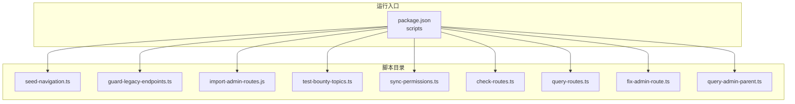
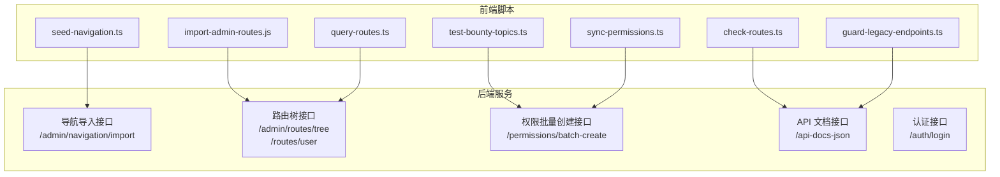
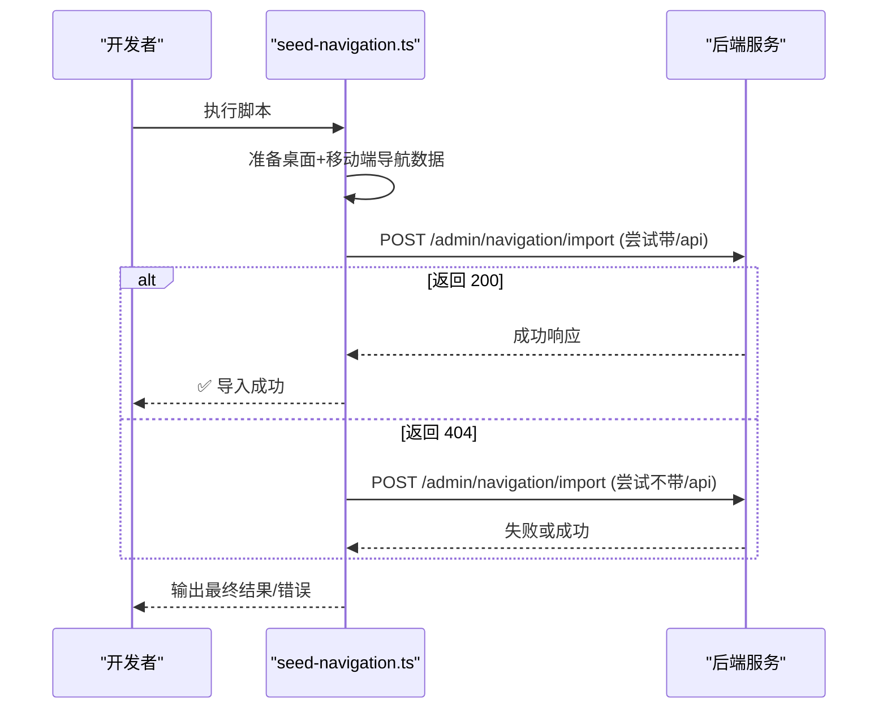
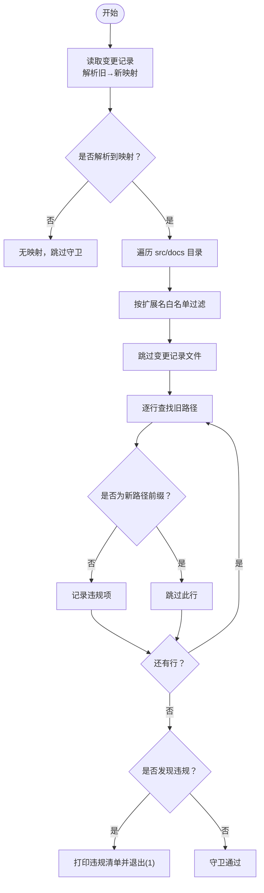
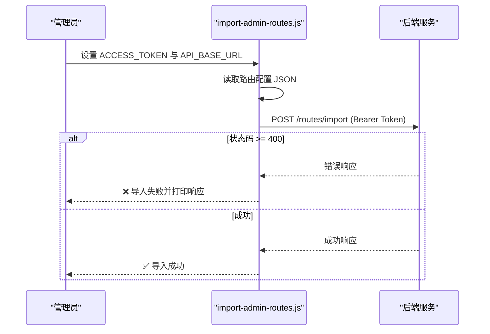
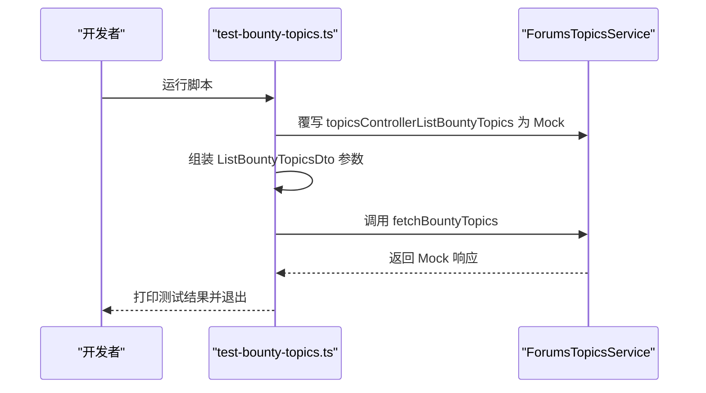
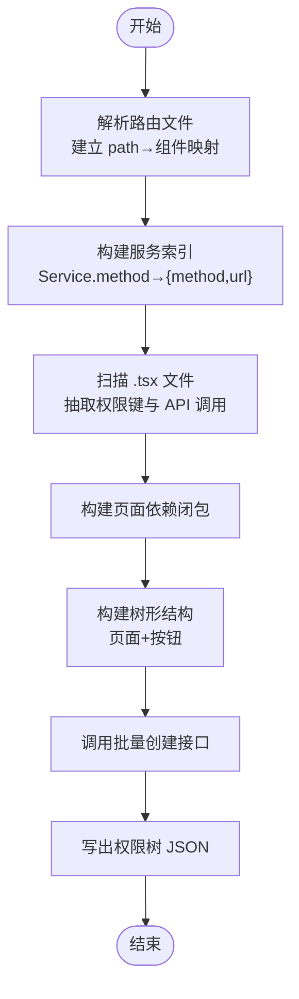
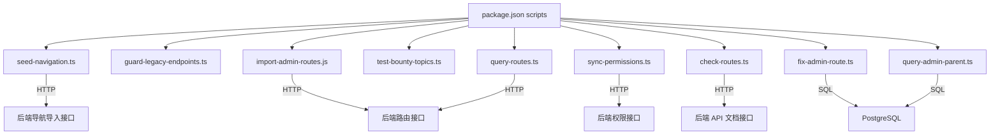

# 系统管理脚本

<cite>
**本文档引用的文件**
- [seed-navigation.ts](file://scripts/seed-navigation.ts)
- [guard-legacy-endpoints.ts](file://scripts/guard-legacy-endpoints.ts)
- [import-admin-routes.js](file://scripts/import-admin-routes.js)
- [test-bounty-topics.ts](file://scripts/test-bounty-topics.ts)
- [sync-permissions.ts](file://scripts/sync-permissions.ts)
- [check-routes.ts](file://scripts/check-routes.ts)
- [query-routes.ts](file://scripts/query-routes.ts)
- [fix-admin-route.ts](file://scripts/fix-admin-route.ts)
- [query-admin-parent.ts](file://scripts/query-admin-parent.ts)
- [package.json](file://package.json)
- [README.md](file://README.md)
</cite>

## 目录
1. [简介](#简介)
2. [项目结构](#项目结构)
3. [核心组件](#核心组件)
4. [架构总览](#架构总览)
5. [详细组件分析](#详细组件分析)
6. [依赖关系分析](#依赖关系分析)
7. [性能考虑](#性能考虑)
8. [故障排查指南](#故障排查指南)
9. [结论](#结论)
10. [附录](#附录)

## 简介
本操作手册面向系统管理员与运维工程师，系统性梳理并实操以下脚本能力：
- 导航种子脚本：初始化与维护导航数据结构，确保桌面端与移动端导航树一致并可导入后端。
- 遗留端点保护脚本：从变更记录中提取“旧 → 新”接口映射，扫描源码与文档，阻断旧路径残留。
- 管理员路由导入脚本：通过批量导入 API 将管理员路由配置写入后端，并进行鉴权与错误处理。
- 赏金主题测试脚本：对前端赏金主题列表的参数映射与响应处理进行快速开发测试。
- 权限同步脚本：从前端代码中抽取页面与按钮权限键，构建树形结构并批量创建/更新权限。
- 路由查询与校验脚本：查询数据库路由树、用户可见路由，辅助验证导入与权限过滤逻辑。
- 数据库修复脚本：修复 Admin 路由的父节点引用，确保其成为真正的根节点。

## 项目结构
脚本集中于 scripts 目录，配合 package.json 的脚本入口统一调度。核心脚本职责如下：
- 导航与路由：seed-navigation.ts、import-admin-routes.js、query-routes.ts、check-routes.ts、fix-admin-route.ts、query-admin-parent.ts
- 权限与测试：sync-permissions.ts、test-bounty-topics.ts、guard-legacy-endpoints.ts

**图表来源**
- [package.json](file://package.json#L126-L139)

**章节来源**
- [package.json](file://package.json#L126-L139)
- [README.md](file://README.md#L1-L11)

## 核心组件
- 导航种子脚本：准备桌面与移动端导航树，自动探测后端导入接口，支持带/不带 /api 前缀两种路径，失败时输出明确提示。
- 遗留端点保护脚本：从变更记录中提取映射，扫描 src 与 docs 目录，严格过滤“旧路径 + '/'”的前缀误判，输出违规清单并终止 CI。
- 管理员路由导入脚本：读取本地 JSON 配置，调用批量导入 API，携带 Bearer Token，失败时打印响应体便于定位。
- 赏金主题测试脚本：覆写服务调用为 Mock，验证参数映射与响应结构，输出关键字段以确认集成正确。
- 权限同步脚本：递归扫描 .tsx 文件，抽取页面与按钮权限键，构建服务索引与依赖闭包，生成树形结构并批量创建/更新。
- 路由查询脚本：登录获取 Token 后，查询完整路由树与用户路由，统计 Admin 路由与可见性，辅助导入验证。
- 数据库修复脚本：连接 PostgreSQL，查询并修复 Admin 路由的 parent_id，确保其成为根节点，并列出当前所有根节点。

**章节来源**
- [seed-navigation.ts](file://scripts/seed-navigation.ts#L1-L259)
- [guard-legacy-endpoints.ts](file://scripts/guard-legacy-endpoints.ts#L1-L116)
- [import-admin-routes.js](file://scripts/import-admin-routes.js#L1-L101)
- [test-bounty-topics.ts](file://scripts/test-bounty-topics.ts#L1-L54)
- [sync-permissions.ts](file://scripts/sync-permissions.ts#L1-L718)
- [check-routes.ts](file://scripts/check-routes.ts#L1-L29)
- [query-routes.ts](file://scripts/query-routes.ts#L1-L112)
- [fix-admin-route.ts](file://scripts/fix-admin-route.ts#L1-L93)
- [query-admin-parent.ts](file://scripts/query-admin-parent.ts#L1-L75)

## 架构总览
下图展示脚本与后端 API 的交互关系与数据流：

**图表来源**
- [seed-navigation.ts](file://scripts/seed-navigation.ts#L206-L259)
- [import-admin-routes.js](file://scripts/import-admin-routes.js#L76-L98)
- [query-routes.ts](file://scripts/query-routes.ts#L37-L98)
- [check-routes.ts](file://scripts/check-routes.ts#L4-L28)
- [sync-permissions.ts](file://scripts/sync-permissions.ts#L91-L98)
- [guard-legacy-endpoints.ts](file://scripts/guard-legacy-endpoints.ts#L22-L36)

## 详细组件分析

### 导航种子脚本（seed-navigation.ts）
- 功能要点
  - 定义桌面与移动端导航树结构，支持排序、可见性、权限标识与嵌套子节点。
  - 自动探测后端导入接口，尝试带/不带 /api 前缀两种路径，失败时输出 404 或具体错误。
  - 成功后输出结果对象，便于人工核验。
- 关键流程

**图表来源**
- [seed-navigation.ts](file://scripts/seed-navigation.ts#L206-L259)

**章节来源**
- [seed-navigation.ts](file://scripts/seed-navigation.ts#L1-L259)

### 遗留端点保护脚本（guard-legacy-endpoints.ts）
- 功能要点
  - 从变更记录中解析“旧 → 新”映射，支持多行匹配。
  - 递归扫描 src 与 docs，过滤二进制/非文本文件，跳过变更记录自身。
  - 严格避免“旧路径 + '/'”的前缀误报，仅当旧路径不是新路径前缀时才判定为残留。
  - 发现残留时输出文件、行号、片段与替换建议，并以非零退出码阻止 CI。
- 关键流程

**图表来源**
- [guard-legacy-endpoints.ts](file://scripts/guard-legacy-endpoints.ts#L10-L116)

**章节来源**
- [guard-legacy-endpoints.ts](file://scripts/guard-legacy-endpoints.ts#L1-L116)

### 管理员路由导入脚本（import-admin-routes.js）
- 功能要点
  - 从本地 JSON 读取路由配置，调用批量导入接口。
  - 通过环境变量注入 API 地址与 Bearer Token，失败时打印响应体并退出。
  - 支持 HTTP/HTTPS 自动识别，统一请求封装。
- 关键流程

**图表来源**
- [import-admin-routes.js](file://scripts/import-admin-routes.js#L62-L98)

**章节来源**
- [import-admin-routes.js](file://scripts/import-admin-routes.js#L1-L101)

### 赏金主题测试脚本（test-bounty-topics.ts）
- 功能要点
  - 在开发脚本作用域内覆写服务调用为 Mock，构造符合响应结构的数据。
  - 调用业务函数，输出关键字段（条目数、标题、悬赏金额、总数/页码/限制）。
  - 任一异常即失败并退出，便于快速回归验证。
- 关键流程

**图表来源**
- [test-bounty-topics.ts](file://scripts/test-bounty-topics.ts#L36-L47)

**章节来源**
- [test-bounty-topics.ts](file://scripts/test-bounty-topics.ts#L1-L54)

### 权限同步脚本（sync-permissions.ts）
- 功能要点
  - 递归扫描 .tsx 文件，抽取页面与按钮权限键，支持多种语法模式。
  - 构建服务索引与组件依赖闭包，生成树形结构（页面项含按钮子节点）。
  - 调用后端批量创建接口，写出权限树 JSON 文件，便于审计与二次处理。
- 关键流程

**图表来源**
- [sync-permissions.ts](file://scripts/sync-permissions.ts#L62-L99)

**章节来源**
- [sync-permissions.ts](file://scripts/sync-permissions.ts#L1-L718)

### 路由查询与校验脚本
- 查询数据库路由树（query-routes.ts）
  - 支持使用环境变量 Token 或登录获取 Token。
  - 查询完整路由树与用户路由，统计 Admin 路由与可见性，辅助导入验证。
- 检查 API 文档中的路由（check-routes.ts）
  - 获取 API 文档 JSON，筛选包含 navigation 的路由，输出方法与路径。

**章节来源**
- [query-routes.ts](file://scripts/query-routes.ts#L1-L112)
- [check-routes.ts](file://scripts/check-routes.ts#L1-L29)

### 数据库修复脚本（fix-admin-route.ts 与 query-admin-parent.ts）
- 修复 Admin 路由父节点（fix-admin-route.ts）
  - 连接 PostgreSQL，查询 Admin 路由，若 parent_id 非空则设为 null，使其成为根节点。
  - 验证修复结果并列出当前所有根节点。
- 查询 Admin 路由父节点（query-admin-parent.ts）
  - 查询指定 ID 的路由详情，列出所有 layout=admin 的路由及其父节点信息，并输出到文件。

**章节来源**
- [fix-admin-route.ts](file://scripts/fix-admin-route.ts#L1-L93)
- [query-admin-parent.ts](file://scripts/query-admin-parent.ts#L1-L75)

## 依赖关系分析
- 脚本入口与任务
  - package.json 提供统一入口，便于在 CI/本地一键执行各脚本。
- 外部依赖
  - seed-navigation.ts 使用 undici 发起 HTTP 请求。
  - import-admin-routes.js 使用原生 http/https 模块与 fs。
  - guard-legacy-endpoints.ts 使用 fs 与 path。
  - sync-permissions.ts 使用 dotenv、axios、OpenAPI 与 TypeScript 编译器工具。
  - fix-admin-route.ts 与 query-admin-parent.ts 使用 pg。
  - test-bounty-topics.ts 使用本地模块与 API 服务模型。
- 脚本间耦合
  - query-routes.ts 与 import-admin-routes.js 共同验证路由导入结果。
  - guard-legacy-endpoints.ts 与 check-routes.ts 协作保障接口一致性。

**图表来源**
- [package.json](file://package.json#L126-L139)
- [seed-navigation.ts](file://scripts/seed-navigation.ts#L206-L259)
- [import-admin-routes.js](file://scripts/import-admin-routes.js#L76-L98)
- [query-routes.ts](file://scripts/query-routes.ts#L37-L98)
- [check-routes.ts](file://scripts/check-routes.ts#L4-L28)
- [sync-permissions.ts](file://scripts/sync-permissions.ts#L91-L98)
- [fix-admin-route.ts](file://scripts/fix-admin-route.ts#L7-L93)
- [query-admin-parent.ts](file://scripts/query-admin-parent.ts#L4-L75)

**章节来源**
- [package.json](file://package.json#L126-L139)

## 性能考虑
- 导航种子脚本
  - 仅进行一次/两次端点探测，避免重复请求。
  - 建议在本地开发阶段使用较小导航树进行验证，减少网络往返。
- 遗留端点保护脚本
  - 仅扫描文本文件，扩展名白名单过滤，避免大体积二进制文件。
  - 正则匹配与字符串查找为线性复杂度，适合中等规模仓库。
- 管理员路由导入脚本
  - 一次性批量导入，避免多次往返。
  - 建议在导入前先通过 query-routes.ts 校验目标配置。
- 权限同步脚本
  - .tsx 文件扫描与正则匹配为线性复杂度，建议在 CI 中限制扫描范围或启用缓存。
  - 生成的权限树 JSON 便于离线审计与二次处理。
- 路由查询脚本
  - 登录获取 Token 后再查询，避免重复认证开销。
- 数据库修复脚本
  - 仅执行少量 SQL 查询与更新，注意在低峰期执行以降低锁竞争。

## 故障排查指南
- 导航种子脚本
  - 症状：始终返回 404
    - 排查：确认后端接口是否为 /admin/navigation/import，或尝试带 /api 前缀。
    - 参考：[seed-navigation.ts](file://scripts/seed-navigation.ts#L239-L245)
  - 症状：导入成功但导航未显示
    - 排查：确认 payload 中 desktop/mobile 数据是否包含必要字段；检查后端导入逻辑。
- 遗留端点保护脚本
  - 症状：未解析到任何映射
    - 处理：检查变更记录格式是否符合期望，确保包含“旧 → 新”的映射行。
    - 参考：[guard-legacy-endpoints.ts](file://scripts/guard-legacy-endpoints.ts#L33-L36)
  - 症状：误报“旧路径残留”
    - 处理：确认旧路径不是新路径的前缀（如 /downloaders/categories/list），脚本已内置前缀过滤。
- 管理员路由导入脚本
  - 症状：ACCESS_TOKEN 未设置
    - 处理：设置环境变量 ACCESS_TOKEN，或参考脚本中的示例。
    - 参考：[import-admin-routes.js](file://scripts/import-admin-routes.js#L70-L74)
  - 症状：导入失败
    - 处理：查看响应体中的 message 字段，修正配置后再试。
    - 参考：[import-admin-routes.js](file://scripts/import-admin-routes.js#L82-L86)
- 权限同步脚本
  - 症状：未发现需要同步的权限树节点
    - 处理：确认 .tsx 文件中存在 requiredPermissions 或按钮权限声明。
    - 参考：[sync-permissions.ts](file://scripts/sync-permissions.ts#L86-L89)
- 路由查询脚本
  - 症状：无法获取 Token
    - 处理：设置 ACCESS_TOKEN 或提供正确的管理员凭据；或使用登录接口获取。
    - 参考：[query-routes.ts](file://scripts/query-routes.ts#L15-L35)
  - 症状：未找到 Admin 路由
    - 处理：检查导入是否成功，或使用 query-admin-parent.ts 定位父节点问题。
    - 参考：[query-routes.ts](file://scripts/query-routes.ts#L62-L75)
- 数据库修复脚本
  - 症状：连接失败
    - 处理：检查数据库连接参数（host/port/user/password/database）。
    - 参考：[fix-admin-route.ts](file://scripts/fix-admin-route.ts#L8-L14)
  - 症状：未找到 Admin 路由
    - 处理：使用 query-admin-parent.ts 查询并确认路由状态。
    - 参考：[fix-admin-route.ts](file://scripts/fix-admin-route.ts#L28-L31)

**章节来源**
- [seed-navigation.ts](file://scripts/seed-navigation.ts#L239-L245)
- [guard-legacy-endpoints.ts](file://scripts/guard-legacy-endpoints.ts#L33-L36)
- [import-admin-routes.js](file://scripts/import-admin-routes.js#L70-L86)
- [sync-permissions.ts](file://scripts/sync-permissions.ts#L86-L89)
- [query-routes.ts](file://scripts/query-routes.ts#L15-L75)
- [fix-admin-route.ts](file://scripts/fix-admin-route.ts#L8-L31)

## 结论
以上脚本覆盖了导航初始化、接口一致性保护、管理员路由导入、权限同步、路由校验与数据库修复等关键运维场景。通过统一的 package.json 入口与清晰的错误处理，可在本地与 CI 环境稳定运行。建议在每次重大接口变更后，先运行遗留端点保护脚本与路由查询脚本，再执行导入与权限同步，最后通过导航种子脚本进行最终核验。

## 附录
- 部署与执行
  - 安装依赖：使用项目提供的安装命令启动开发环境。
  - 执行脚本：通过 package.json 的 scripts 字段统一执行，或直接使用 tsx/node 运行对应脚本。
- 执行权限
  - 管理员路由导入脚本需要 ACCESS_TOKEN；数据库修复脚本需要数据库连接参数。
- 监控方法
  - 导入后使用 query-routes.ts 校验 Admin 路由与用户路由可见性。
  - 权限同步后检查 scripts/out/permissions-tree.json，确保树结构与预期一致。
- 标准化流程与应急处理
  - 标准化流程
    - 接口变更 → 更新变更记录 → 运行遗留端点保护脚本 → 修改前端代码 → 运行权限同步脚本 → 导入管理员路由 → 查询路由树 → 导航种子脚本核验。
  - 应急处理
    - 导入失败：回滚配置，检查响应体；必要时使用 query-admin-parent.ts 定位父节点问题。
    - 权限缺失：补充 .tsx 中的 requiredPermissions，重新运行权限同步脚本。
    - 导航异常：检查 seed-navigation.ts 的 payload 与后端接口，确认端点可用性。

**章节来源**
- [package.json](file://package.json#L126-L139)
- [query-routes.ts](file://scripts/query-routes.ts#L37-L98)
- [sync-permissions.ts](file://scripts/sync-permissions.ts#L91-L98)
- [fix-admin-route.ts](file://scripts/fix-admin-route.ts#L7-L93)
- [query-admin-parent.ts](file://scripts/query-admin-parent.ts#L4-L75)