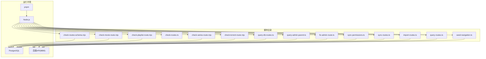
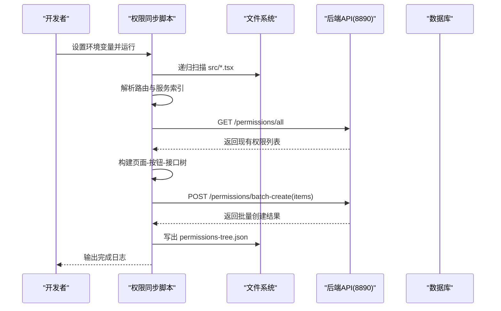
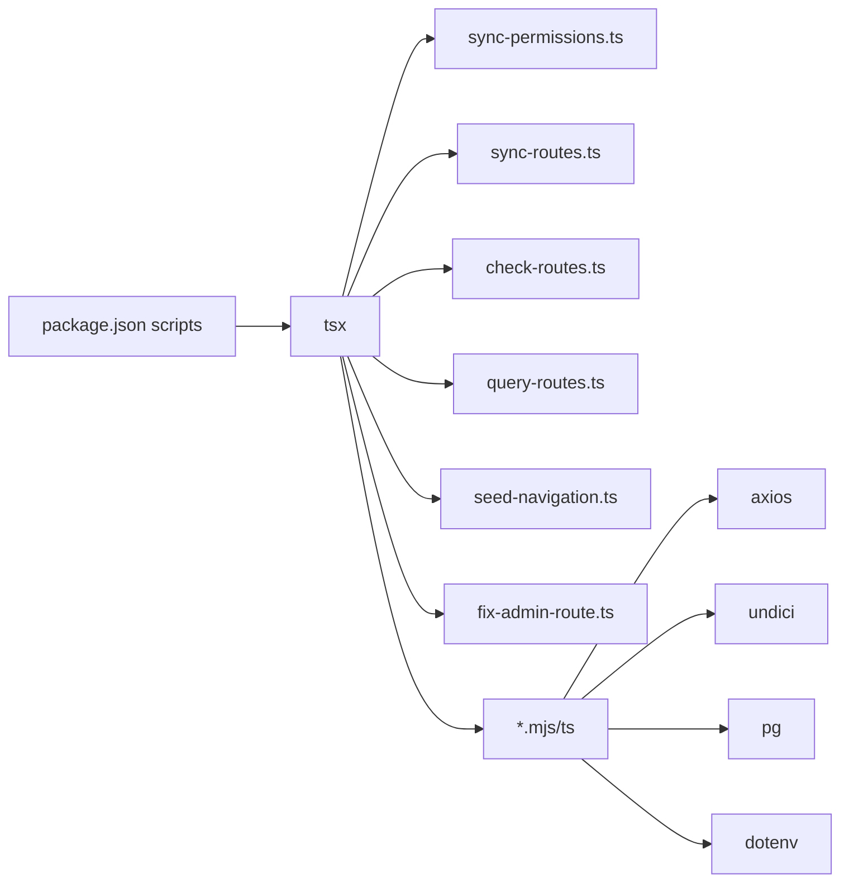

# 自动化脚本

<cite>
**本文档引用的文件**
- [package.json](file://package.json)
- [scripts/sync-permissions.ts](file://scripts/sync-permissions.ts)
- [scripts/sync-routes.ts](file://scripts/sync-routes.ts)
- [scripts/check-routes.ts](file://scripts/check-routes.ts)
- [scripts/query-routes.ts](file://scripts/query-routes.ts)
- [scripts/import-routes.ts](file://scripts/import-routes.ts)
- [scripts/check-routes-schema.mjs](file://scripts/check-routes-schema.mjs)
- [scripts/check-movie-route.mjs](file://scripts/check-movie-route.mjs)
- [scripts/check-playlist-route.mjs](file://scripts/check-playlist-route.mjs)
- [scripts/check-series-route.mjs](file://scripts/check-series-route.mjs)
- [scripts/check-torrent-route.mjs](file://scripts/check-torrent-route.mjs)
- [scripts/query-db-routes.ts](file://scripts/query-db-routes.ts)
- [scripts/query-admin-parent.ts](file://scripts/query-admin-parent.ts)
- [scripts/seed-navigation.ts](file://scripts/seed-navigation.ts)
- [scripts/fix-admin-route.ts](file://scripts/fix-admin-route.ts)
</cite>

## 目录
1. [简介](#简介)
2. [项目结构](#项目结构)
3. [核心组件](#核心组件)
4. [架构总览](#架构总览)
5. [详细组件分析](#详细组件分析)
6. [依赖分析](#依赖分析)
7. [性能考虑](#性能考虑)
8. [故障排查指南](#故障排查指南)
9. [结论](#结论)
10. [附录](#附录)

## 简介
本指南面向自动化脚本使用者与维护者，系统性介绍项目中的各类自动化脚本工具，包括权限同步脚本、路由验证工具、数据库查询脚本、导航种子脚本以及路由修复脚本。内容涵盖功能说明、参数配置、使用方法、工作原理、执行流程、输出结果、安装依赖、运行环境、实际示例、常见问题与调试优化建议。

## 项目结构
脚本集中位于 scripts 目录，按功能划分为：
- 权限与路由同步：sync-permissions.ts、sync-routes.ts、import-routes.ts
- 路由校验与查询：check-routes.ts、check-routes-schema.mjs、query-routes.ts
- 数据库查询与诊断：check-movie-route.mjs、check-playlist-route.mjs、check-series-route.mjs、check-torrent-route.mjs、query-db-routes.ts、query-admin-parent.ts
- 导航种子与修复：seed-navigation.ts、fix-admin-route.ts

图表来源
- [package.json](file://package.json#L126-L139)
- [scripts/sync-permissions.ts](file://scripts/sync-permissions.ts#L1-L28)
- [scripts/sync-routes.ts](file://scripts/sync-routes.ts#L1-L28)
- [scripts/import-routes.ts](file://scripts/import-routes.ts#L1-L10)
- [scripts/check-routes.ts](file://scripts/check-routes.ts#L1-L29)
- [scripts/query-routes.ts](file://scripts/query-routes.ts#L1-L112)
- [scripts/check-routes-schema.mjs](file://scripts/check-routes-schema.mjs#L1-L39)
- [scripts/check-movie-route.mjs](file://scripts/check-movie-route.mjs#L1-L32)
- [scripts/check-playlist-route.mjs](file://scripts/check-playlist-route.mjs#L1-L68)
- [scripts/check-series-route.mjs](file://scripts/check-series-route.mjs#L1-L46)
- [scripts/check-torrent-route.mjs](file://scripts/check-torrent-route.mjs#L1-L32)
- [scripts/query-db-routes.ts](file://scripts/query-db-routes.ts#L1-L90)
- [scripts/query-admin-parent.ts](file://scripts/query-admin-parent.ts#L1-L75)
- [scripts/seed-navigation.ts](file://scripts/seed-navigation.ts#L1-L259)
- [scripts/fix-admin-route.ts](file://scripts/fix-admin-route.ts#L1-L93)

章节来源
- [package.json](file://package.json#L126-L139)

## 核心组件
- 权限同步脚本：扫描前端源码，提取页面与按钮权限键，构建树形结构并批量创建/更新权限。
- 路由同步脚本：扫描前端路由与服务索引，结合后端权限记录，生成权限树并上传。
- 路由导入脚本：将静态路由配置导入后端，支持多级嵌套与排序。
- 路由校验脚本：从后端 OpenAPI 获取路由定义，筛选导航相关路由并打印方法与路径。
- 数据库查询脚本：直接查询 routes 表结构与数据，辅助定位路由层级与父子关系。
- 导航种子脚本：向后端导入桌面/移动端导航树，支持两种 URL 前缀探测。
- 管理路由修复脚本：将 Admin 根路由的父级设为 null，确保其作为真正根节点显示。

章节来源
- [scripts/sync-permissions.ts](file://scripts/sync-permissions.ts#L1-L99)
- [scripts/sync-routes.ts](file://scripts/sync-routes.ts#L1-L99)
- [scripts/import-routes.ts](file://scripts/import-routes.ts#L1-L1109)
- [scripts/check-routes.ts](file://scripts/check-routes.ts#L1-L29)
- [scripts/query-routes.ts](file://scripts/query-routes.ts#L1-L112)
- [scripts/check-routes-schema.mjs](file://scripts/check-routes-schema.mjs#L1-L39)
- [scripts/seed-navigation.ts](file://scripts/seed-navigation.ts#L1-L259)
- [scripts/fix-admin-route.ts](file://scripts/fix-admin-route.ts#L1-L93)

## 架构总览
以下序列图展示“权限同步”脚本的典型执行流程：扫描前端、解析路由与服务、拉取后端权限、构建树并上传。

图表来源
- [scripts/sync-permissions.ts](file://scripts/sync-permissions.ts#L62-L99)
- [scripts/sync-permissions.ts](file://scripts/sync-permissions.ts#L218-L260)
- [scripts/sync-permissions.ts](file://scripts/sync-permissions.ts#L574-L598)
- [scripts/sync-permissions.ts](file://scripts/sync-permissions.ts#L459-L495)

## 详细组件分析

### 权限同步脚本（sync-permissions.ts）
- 功能概述
  - 扫描 src 下所有 .tsx 文件，提取页面与按钮权限键。
  - 页面权限来源：PermissionRoute 的 requiredPermissions。
  - 按钮权限来源：AccessControl 的 requiredPermissions 与 canAccess(...)。
  - 构建树形结构（页面包含按钮子节点），调用后端批量创建接口。
  - 写出权限树文件 permissions-tree.json，便于审计与复核。
- 关键步骤
  - 初始化 OpenAPI 基础地址与可选 Token。
  - 解析应用路由与服务索引，建立 Service.method → {method,url} 映射。
  - 扫描前端代码，匹配 JSX 标签与函数调用，收集权限键与关联 API。
  - 从后端拉取 /permissions/all 并合并到注册表。
  - 构建树形 items 并调用批量创建接口。
  - 写出权限树 JSON 文件。
- 参数与环境变量
  - API_BASE_URL：后端基础地址，默认 http://localhost:8890。
  - ACCESS_TOKEN：管理员 JWT，可选，用于鉴权。
  - 运行方式：通过 package.json 中的 permissions:sync 脚本启动。
- 典型输出
  - 控制台输出扫描进度、树节点数量、批量创建结果。
  - scripts/out/permissions-tree.json：页面-按钮-接口树。
- 使用示例
  - Windows PowerShell：
    - 设置环境变量后运行 npm run permissions:sync。
  - 或在项目根目录创建 .env 文件写入上述变量后直接运行。
- 常见问题
  - 未设置 ACCESS_TOKEN：若后端需要鉴权，需提供有效 Token。
  - 路由文件未被识别：确认路由文件路径与名称符合解析规则。
  - 权限键重复：脚本内部去重，最终以注册表为准。
- 调试与优化
  - 在本地开发环境运行，确保 API 地址可达。
  - 如需查看中间结果，可在写出树之前临时打印中间数据。
  - 批量创建接口幂等性：重复运行不会产生重复权限项。

章节来源
- [scripts/sync-permissions.ts](file://scripts/sync-permissions.ts#L1-L99)
- [scripts/sync-permissions.ts](file://scripts/sync-permissions.ts#L218-L260)
- [scripts/sync-permissions.ts](file://scripts/sync-permissions.ts#L459-L495)
- [scripts/sync-permissions.ts](file://scripts/sync-permissions.ts#L574-L598)
- [package.json](file://package.json#L134-L134)

### 路由同步脚本（sync-routes.ts）
- 功能概述
  - 与权限同步脚本类似，但侧重于路由层面的权限树构建与上传。
  - 解析路由文件，建立 path → 组件映射，支持嵌套路由与父级路径拼接。
  - 通过服务索引识别组件内调用的 API，形成页面-按钮-接口三层关系。
- 关键步骤
  - 解析 AppRoutes.tsx 与 forumRoutes.tsx。
  - 建立组件 import 映射与懒加载组件解析。
  - 从 PermissionRoute 提取 requiredPermissions 与显示名称。
  - 为页面构建依赖闭包，确定按钮归属。
  - 构建树并上传。
- 参数与环境变量
  - 同上（API_BASE_URL、ACCESS_TOKEN）。
- 使用示例
  - 通过 npm run permissions:sync（同权限同步脚本）。
- 注意事项
  - 路由文件变更后需重新运行以保持权限树一致。

章节来源
- [scripts/sync-routes.ts](file://scripts/sync-routes.ts#L1-L99)
- [scripts/sync-routes.ts](file://scripts/sync-routes.ts#L266-L372)
- [scripts/sync-routes.ts](file://scripts/sync-routes.ts#L397-L428)
- [scripts/sync-routes.ts](file://scripts/sync-routes.ts#L433-L454)
- [scripts/sync-routes.ts](file://scripts/sync-routes.ts#L497-L533)
- [scripts/sync-routes.ts](file://scripts/sync-routes.ts#L574-L598)

### 路由导入脚本（import-routes.ts）
- 功能概述
  - 将静态路由配置导入后端，支持多级嵌套、排序、权限标记与可见性控制。
  - 路由数据以 JSON 结构组织，子路由使用相对路径自动拼接。
- 关键步骤
  - 定义各布局（app、forum、admin）下的路由树。
  - 子路由包含 routeKey、path、component、layout、name、sortOrder、permissions、isVisible 等字段。
  - 通过后端接口批量导入，实现路由结构的快速落地。
- 使用场景
  - 新增页面或调整路由层级时，统一在前端维护路由配置，再导入后端。
- 注意事项
  - 路由路径与组件名需与前端实际一致。
  - 权限字段需与后端权限体系匹配。

章节来源
- [scripts/import-routes.ts](file://scripts/import-routes.ts#L1-L1109)

### 路由校验脚本（check-routes.ts）
- 功能概述
  - 从后端 OpenAPI 文档中提取路径，筛选包含 navigation 的路由，打印方法与路径。
- 使用场景
  - 快速确认后端是否暴露导航相关接口及其方法。
- 运行方式
  - 直接运行脚本，目标地址默认 http://localhost:8890/api-docs-json。

章节来源
- [scripts/check-routes.ts](file://scripts/check-routes.ts#L1-L29)

### 路由查询脚本（query-routes.ts）
- 功能概述
  - 查询后端完整路由树与用户可见路由，辅助验证导入结果与权限过滤。
- 关键步骤
  - 尝试从环境变量获取 ACCESS_TOKEN，否则使用管理员账户登录获取。
  - 调用 /admin/routes/tree 获取完整路由树并统计根节点与子节点数量。
  - 调用 /routes/user 获取用户可见路由，检查是否存在 admin 路由。
- 输出
  - 完整路由树 JSON、统计信息、用户路由 JSON、Admin 路由存在性判断。
- 使用示例
  - 设置 ACCESS_TOKEN 或 ADMIN_USER/ADMIN_PASS 后运行。

章节来源
- [scripts/query-routes.ts](file://scripts/query-routes.ts#L1-L112)

### 数据库查询脚本
- check-routes-schema.mjs
  - 连接 PostgreSQL，查询 routes 表结构与示例数据，帮助理解字段含义。
- check-movie-route.mjs
  - 查询电影详情路由及其布局，辅助定位路径与组件对应关系。
- check-playlist-route.mjs
  - 查询片单详情与其父级/祖父级路由，辅助判断层级拼接是否正确。
- check-series-route.mjs
  - 查询系列相关 App 路由与详情路由，辅助确认路由启用状态。
- check-torrent-route.mjs
  - 查询种子详情路由及其布局，辅助确认访问路径。
- query-db-routes.ts
  - 连接数据库，输出表结构、根节点、admin 相关路由、总数与前 200 条路由摘要。
- query-admin-parent.ts
  - 查询指定 ID 的路由及其父节点，辅助定位孤儿引用与层级异常。

章节来源
- [scripts/check-routes-schema.mjs](file://scripts/check-routes-schema.mjs#L1-L39)
- [scripts/check-movie-route.mjs](file://scripts/check-movie-route.mjs#L1-L32)
- [scripts/check-playlist-route.mjs](file://scripts/check-playlist-route.mjs#L1-L68)
- [scripts/check-series-route.mjs](file://scripts/check-series-route.mjs#L1-L46)
- [scripts/check-torrent-route.mjs](file://scripts/check-torrent-route.mjs#L1-L32)
- [scripts/query-db-routes.ts](file://scripts/query-db-routes.ts#L1-L90)
- [scripts/query-admin-parent.ts](file://scripts/query-admin-parent.ts#L1-L75)

### 导航种子脚本（seed-navigation.ts）
- 功能概述
  - 向后端导入桌面与移动端导航树，支持两种 URL 前缀探测（带/与不带/api）。
- 关键步骤
  - 准备 DESKTOP_DATA 与 MOBILE_DATA，包含 label、path、platform、sortOrder、isVisible、children、permissions 等。
  - 尝试两个常见端点，POST 导航导入接口。
  - 成功后输出结果，失败时输出错误信息。
- 使用场景
  - 首次部署或迁移时快速填充导航结构。

章节来源
- [scripts/seed-navigation.ts](file://scripts/seed-navigation.ts#L1-L259)

### 管理路由修复脚本（fix-admin-route.ts）
- 功能概述
  - 将 Admin 根路由的 parent_id 设为 null，确保其作为真正根节点显示。
- 关键步骤
  - 查询当前 Admin 路由的 parent_id。
  - 若非 null，则更新为 null 并验证。
  - 输出当前所有根节点，便于核对。
- 使用场景
  - Admin 导航不显示或层级异常时修复。

章节来源
- [scripts/fix-admin-route.ts](file://scripts/fix-admin-route.ts#L1-L93)

## 依赖分析
- 运行时依赖
  - Node.js：脚本运行环境。
  - pnpm：包管理器，统一版本与依赖锁定。
  - dotenv：读取 .env 文件中的环境变量。
  - axios：HTTP 客户端，用于调用后端 API。
  - undici：内置 fetch 实现，用于 OpenAPI 文档与导航导入。
  - pg：PostgreSQL 客户端，用于数据库查询脚本。
- 开发依赖
  - tsx：TS/JS 脚本运行器，支持直接运行 .ts/.mjs。
  - @types/pg：PostgreSQL 类型定义。
  - tailwindcss、vite 等：前端构建工具链，与脚本运行解耦。
- 脚本入口
  - package.json 中的 scripts 字段定义了常用命令，如 permissions:sync、endpoints:guard、endpoints:test 等。

图表来源
- [package.json](file://package.json#L126-L139)
- [scripts/sync-permissions.ts](file://scripts/sync-permissions.ts#L22-L28)
- [scripts/check-routes.ts](file://scripts/check-routes.ts#L2-L2)
- [scripts/query-routes.ts](file://scripts/query-routes.ts#L5-L5)
- [scripts/seed-navigation.ts](file://scripts/seed-navigation.ts#L1-L1)
- [scripts/fix-admin-route.ts](file://scripts/fix-admin-route.ts#L5-L5)

章节来源
- [package.json](file://package.json#L126-L139)

## 性能考虑
- 扫描范围控制
  - 仅扫描 src 下的 .tsx 文件，避免无关目录影响性能。
- 正则与字符串处理
  - 使用预编译正则与一次性 stripComments，减少重复开销。
- I/O 优化
  - 批量读取文件与一次性写出权限树，降低磁盘 IO 次数。
- 网络请求
  - 后端批量创建接口一次提交多个节点，减少往返次数。
- 数据库查询
  - 限制查询条数（如前 200 条），避免大结果集带来的内存压力。
- 并发与异步
  - 文件扫描与 API 请求均为异步，注意错误处理与超时控制。

## 故障排查指南
- 权限同步失败
  - 确认 API_BASE_URL 与 ACCESS_TOKEN 设置正确。
  - 检查后端 /permissions/all 接口是否可用，网络连通性。
  - 查看控制台输出的批量创建结果，定位具体失败项。
- 路由导入后导航不显示
  - 使用 query-routes.ts 检查 /admin/routes/tree 与 /routes/user 的返回。
  - 使用 fix-admin-route.ts 修复 Admin 根路由的 parent_id。
- 数据库层级异常
  - 使用 check-playlist-route.mjs 与 query-admin-parent.ts 检查父子关系。
  - 使用 query-db-routes.ts 输出根节点与 admin 相关路由，辅助定位。
- 导航导入 404
  - seed-navigation.ts 会尝试两种 URL 前缀，若仍失败，检查后端实际端点。
- OpenAPI 文档不可用
  - check-routes.ts 依赖 http://localhost:8890/api-docs-json，确认后端已启动。

章节来源
- [scripts/query-routes.ts](file://scripts/query-routes.ts#L98-L109)
- [scripts/fix-admin-route.ts](file://scripts/fix-admin-route.ts#L84-L90)
- [scripts/seed-navigation.ts](file://scripts/seed-navigation.ts#L239-L256)
- [scripts/check-routes.ts](file://scripts/check-routes.ts#L7-L25)

## 结论
本项目提供了完善的自动化脚本体系，覆盖权限同步、路由导入与校验、数据库诊断、导航种子与修复等关键环节。通过合理的参数配置与运行流程，可以高效地维护前端路由与权限树的一致性，保障系统稳定运行。建议在 CI/CD 中集成这些脚本，以实现自动化验证与修复。

## 附录
- 安装与运行
  - 使用 pnpm 安装依赖后，通过 npm scripts 运行各脚本。
- 环境变量
  - API_BASE_URL：后端基础地址。
  - ACCESS_TOKEN：管理员 JWT（可选）。
  - ADMIN_USER/ADMIN_PASS：登录凭据（当 ACCESS_TOKEN 缺失时使用）。
- 输出文件
  - scripts/out/permissions-tree.json：权限树文件。
  - scripts/db-routes-result.txt、scripts/admin-parent-result.txt：数据库查询结果文件。