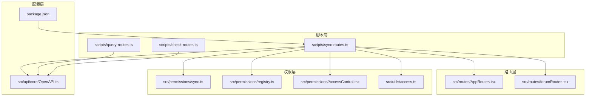
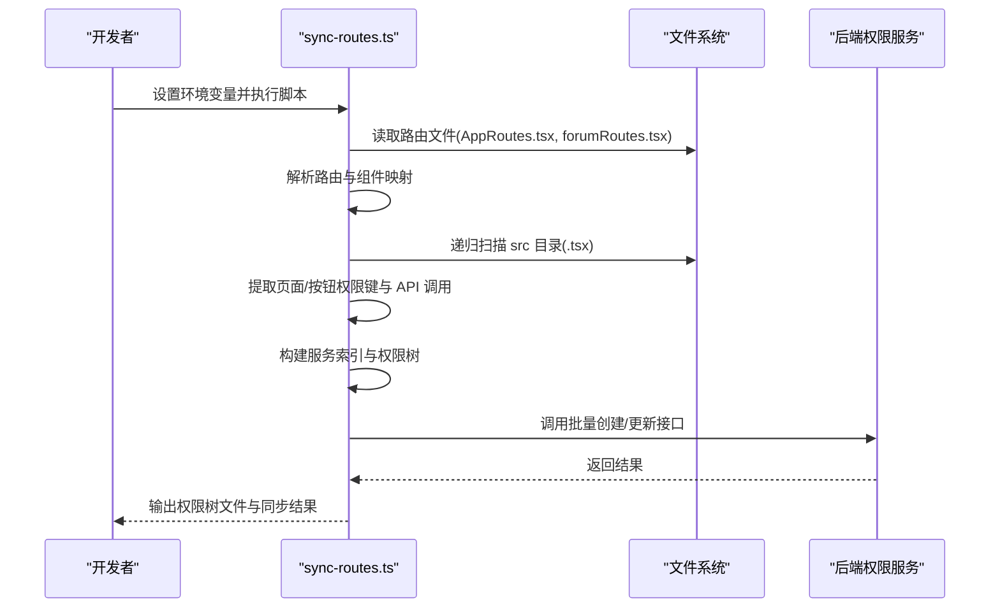
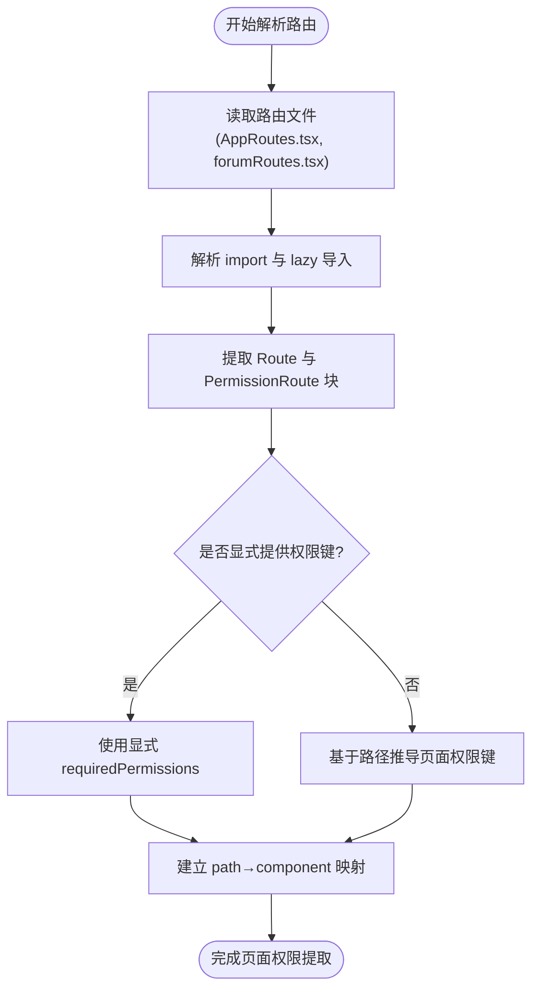
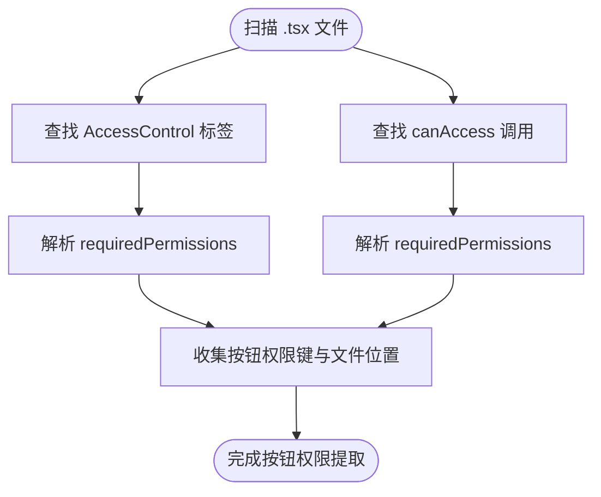
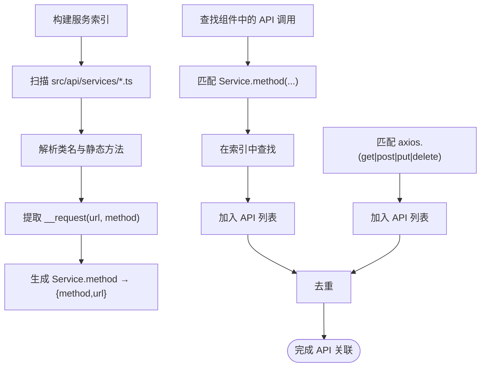
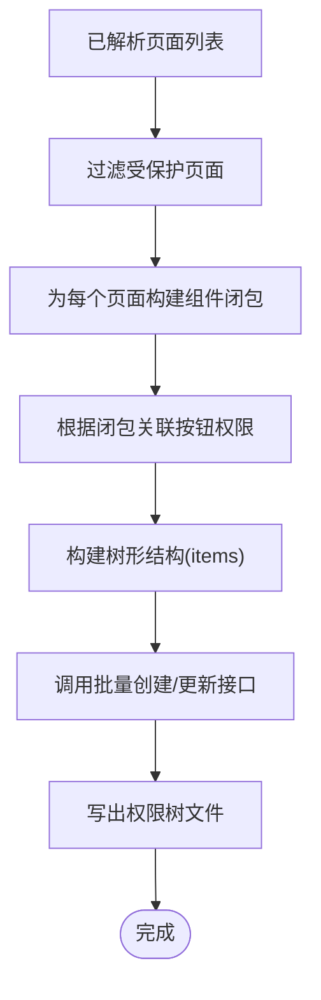
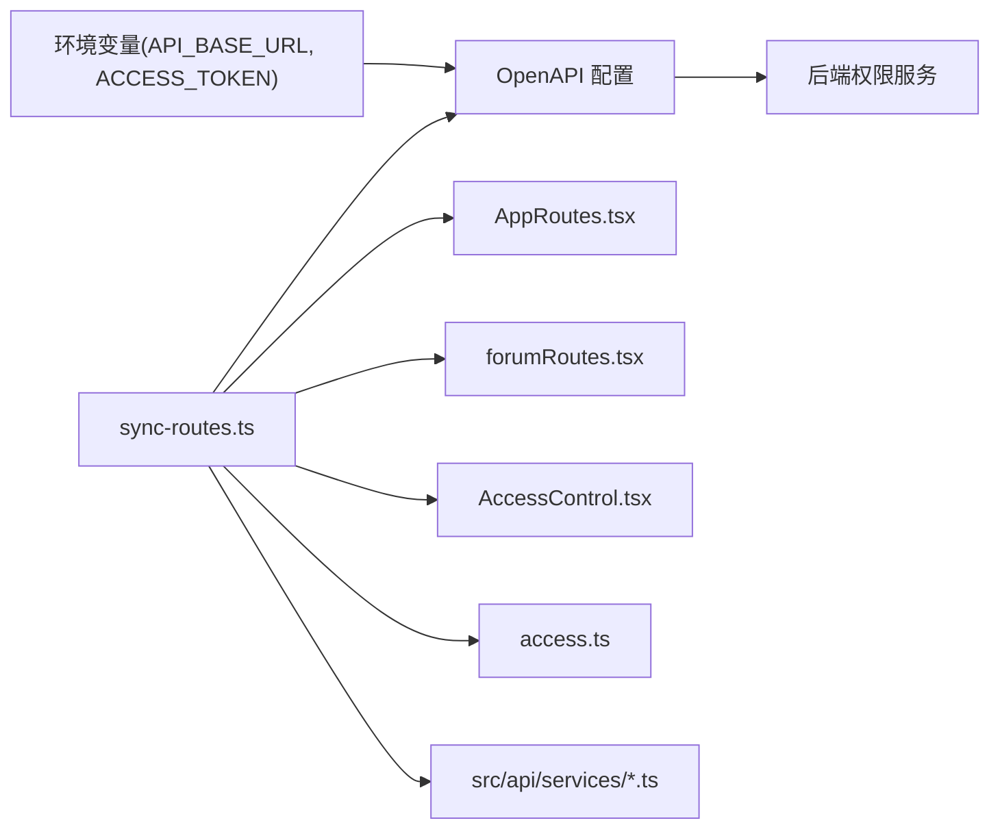

# 路由同步脚本

<cite>
**本文档引用的文件**
- [sync-routes.ts](file://scripts/sync-routes.ts)
- [AppRoutes.tsx](file://src/routes/AppRoutes.tsx)
- [forumRoutes.tsx](file://src/routes/forumRoutes.tsx)
- [OpenAPI.ts](file://src/api/core/OpenAPI.ts)
- [sync.ts](file://src/permissions/sync.ts)
- [registry.ts](file://src/permissions/registry.ts)
- [AccessControl.tsx](file://src/permissions/AccessControl.tsx)
- [access.ts](file://src/utils/access.ts)
- [package.json](file://package.json)
- [query-routes.ts](file://scripts/query-routes.ts)
- [check-routes.ts](file://scripts/check-routes.ts)
</cite>

## 目录
1. [简介](#简介)
2. [项目结构](#项目结构)
3. [核心组件](#核心组件)
4. [架构总览](#架构总览)
5. [详细组件分析](#详细组件分析)
6. [依赖分析](#依赖分析)
7. [性能考虑](#性能考虑)
8. [故障排查指南](#故障排查指南)
9. [结论](#结论)
10. [附录](#附录)

## 简介
本文件面向前端开发与运维工程师，系统性阐述路由同步脚本的工作原理与使用方法。该脚本能够自动扫描前端代码中的路由与权限信息，解析 React 路由配置，提取页面权限键、按钮权限与 API 调用关系，构建权限树并批量创建/更新后端权限数据。文档涵盖：
- 从路由文件解析到权限键提取的完整工作流
- 服务索引构建与 API 关联机制
- 环境变量配置与 API 基础地址、JWT 令牌设置
- 使用示例与常见问题排查

## 项目结构
与路由同步相关的关键文件分布如下：
- 脚本层：scripts/sync-routes.ts（主流程）、scripts/query-routes.ts（查询后端路由）、scripts/check-routes.ts（校验 API 文档）
- 路由层：src/routes/AppRoutes.tsx、src/routes/forumRoutes.tsx
- 权限层：src/permissions/sync.ts、src/permissions/registry.ts、src/permissions/AccessControl.tsx
- 工具层：src/utils/access.ts
- 配置层：src/api/core/OpenAPI.ts、package.json（脚本命令）

**图表来源**
- [sync-routes.ts](file://scripts/sync-routes.ts#L62-L99)
- [AppRoutes.tsx](file://src/routes/AppRoutes.tsx#L73-L98)
- [forumRoutes.tsx](file://src/routes/forumRoutes.tsx#L57-L105)
- [OpenAPI.ts](file://src/api/core/OpenAPI.ts#L22-L32)
- [sync.ts](file://src/permissions/sync.ts#L17-L38)
- [registry.ts](file://src/permissions/registry.ts#L27-L83)
- [AccessControl.tsx](file://src/permissions/AccessControl.tsx#L17-L42)
- [access.ts](file://src/utils/access.ts#L16-L63)
- [package.json](file://package.json#L126-L139)

**章节来源**
- [sync-routes.ts](file://scripts/sync-routes.ts#L62-L99)
- [AppRoutes.tsx](file://src/routes/AppRoutes.tsx#L73-L98)
- [forumRoutes.tsx](file://src/routes/forumRoutes.tsx#L57-L105)
- [OpenAPI.ts](file://src/api/core/OpenAPI.ts#L22-L32)
- [sync.ts](file://src/permissions/sync.ts#L17-L38)
- [registry.ts](file://src/permissions/registry.ts#L27-L83)
- [AccessControl.tsx](file://src/permissions/AccessControl.tsx#L17-L42)
- [access.ts](file://src/utils/access.ts#L16-L63)
- [package.json](file://package.json#L126-L139)

## 核心组件
- 路由扫描与解析：递归扫描 src 目录下 .tsx 文件，解析 <Route> 与 <PermissionRoute> 块，提取页面权限键与路由路径。
- 权限键提取：支持 AccessControl 组件与 canAccess 函数的 requiredPermissions，识别按钮权限。
- 服务索引构建：扫描 src/api/services 下的服务类，提取静态方法签名与对应 API 请求的 method/url，建立 Service.method → {method,url} 索引。
- API 调用识别：在组件文件中查找 Service.method(...) 与 axios.(get|post|put|delete)(...) 调用，结合服务索引生成 API 列表。
- 权限树构建：根据页面路径与按钮闭包关系，构建树形结构（页面项包含按钮项），并上传至后端批量创建/更新接口。
- 后端同步：通过 OpenAPI 配置设置基础地址与 JWT 令牌，调用后端权限批量创建接口。

**章节来源**
- [sync-routes.ts](file://scripts/sync-routes.ts#L101-L212)
- [sync-routes.ts](file://scripts/sync-routes.ts#L397-L428)
- [sync-routes.ts](file://scripts/sync-routes.ts#L433-L454)
- [sync-routes.ts](file://scripts/sync-routes.ts#L574-L598)
- [OpenAPI.ts](file://src/api/core/OpenAPI.ts#L22-L32)

## 架构总览
下图展示从前端代码扫描到后端权限树创建的端到端流程：

**图表来源**
- [sync-routes.ts](file://scripts/sync-routes.ts#L62-L99)
- [sync-routes.ts](file://scripts/sync-routes.ts#L266-L372)
- [sync-routes.ts](file://scripts/sync-routes.ts#L101-L212)
- [sync-routes.ts](file://scripts/sync-routes.ts#L397-L428)
- [sync-routes.ts](file://scripts/sync-routes.ts#L574-L598)

## 详细组件分析

### 路由解析与页面权限提取
- 扫描范围：脚本会递归扫描 src 目录下的 .tsx 文件，解析其中的 <Route> 与 <PermissionRoute> 结构。
- 页面权限来源：
  - <PermissionRoute requiredPermissions={['page:*']}> 块包裹的路由
  - 独立的 <PermissionRoute requiredPermissions={...}> 标签
- 路径推导：若未显式提供 requiredPermissions，脚本会基于路由路径推导页面权限键（如 /movie/:id → page:movie）。
- 组件映射：解析路由文件中的 import 与 lazy 导入，建立 path → component 文件映射，并支持嵌套路由父路径拼接。

**图表来源**
- [sync-routes.ts](file://scripts/sync-routes.ts#L266-L372)
- [sync-routes.ts](file://scripts/sync-routes.ts#L384-L392)

**章节来源**
- [sync-routes.ts](file://scripts/sync-routes.ts#L266-L372)
- [sync-routes.ts](file://scripts/sync-routes.ts#L384-L392)
- [AppRoutes.tsx](file://src/routes/AppRoutes.tsx#L73-L98)
- [forumRoutes.tsx](file://src/routes/forumRoutes.tsx#L57-L105)

### 权限键提取与按钮权限识别
- 页面权限：从 <PermissionRoute> 提取 requiredPermissions 数组，作为页面权限键。
- 按钮权限：
  - AccessControl 组件：解析其 requiredPermissions 属性，支持复杂 JSX 结构（平衡括号逻辑）。
  - canAccess 函数：解析调用参数中的 requiredPermissions。
- 位置追踪：按钮权限记录所在文件路径，便于后续权限树构建时的闭包关联。

**图表来源**
- [sync-routes.ts](file://scripts/sync-routes.ts#L147-L212)

**章节来源**
- [sync-routes.ts](file://scripts/sync-routes.ts#L147-L212)
- [AccessControl.tsx](file://src/permissions/AccessControl.tsx#L17-L42)
- [access.ts](file://src/utils/access.ts#L16-L63)

### 服务索引构建与 API 调用识别
- 服务索引：遍历 src/api/services 下的 TypeScript 文件，解析类名与静态方法签名，提取 __request(url, method) 中的 method 与 url，形成 Service.method → {method,url} 映射。
- API 调用识别：在组件文件中查找 Service.method(...) 与 axios.(get|post|put|delete)(...) 调用，结合服务索引生成 API 列表，去重后作为按钮权限关联的 API 关系。

**图表来源**
- [sync-routes.ts](file://scripts/sync-routes.ts#L397-L428)
- [sync-routes.ts](file://scripts/sync-routes.ts#L433-L454)

**章节来源**
- [sync-routes.ts](file://scripts/sync-routes.ts#L397-L428)
- [sync-routes.ts](file://scripts/sync-routes.ts#L433-L454)

### 权限树构建与批量创建/更新
- 页面树构建：遍历已解析的页面，过滤受保护路径（排除公开路径），为每个页面构建按钮子节点。
- 闭包关联：通过页面根组件的依赖闭包（递归解析 import，收集 TSX 文件路径），将按钮权限与页面进行关联。
- 批量创建：将树形结构转换为后端期望的批量创建 DTO，调用后端接口完成创建/更新。

**图表来源**
- [sync-routes.ts](file://scripts/sync-routes.ts#L497-L495)
- [sync-routes.ts](file://scripts/sync-routes.ts#L574-L598)

**章节来源**
- [sync-routes.ts](file://scripts/sync-routes.ts#L497-L495)
- [sync-routes.ts](file://scripts/sync-routes.ts#L574-L598)

### 前端启动时的权限同步（对比参考）
虽然本节讨论的是脚本版同步，但前端也提供了启动时同步能力，便于理解权限同步的整体设计思路：
- 启动扫描：应用启动时扫描项目内 TSX 文件，提取页面/按钮权限键。
- 批量创建：若已登录则直接发送批量创建请求；若未登录则监听登录事件后再同步。
- 注册表：统一去重与整形为批量创建接口所需的 DTO。

**章节来源**
- [sync.ts](file://src/permissions/sync.ts#L17-L38)
- [sync.ts](file://src/permissions/sync.ts#L74-L115)
- [registry.ts](file://src/permissions/registry.ts#L27-L101)

## 依赖分析
- 环境变量依赖：API_BASE_URL（后端基础地址）、ACCESS_TOKEN（JWT 令牌）。
- OpenAPI 配置：通过 OpenAPI.BASE 与 OpenAPI.TOKEN 设置后端地址与认证。
- 路由文件依赖：AppRoutes.tsx 与 forumRoutes.tsx 作为路由解析入口。
- 权限组件依赖：AccessControl 与 canAccess 用于按钮权限判断。
- API 服务依赖：src/api/services 下的服务类用于构建服务索引。

**图表来源**
- [sync-routes.ts](file://scripts/sync-routes.ts#L62-L71)
- [OpenAPI.ts](file://src/api/core/OpenAPI.ts#L22-L32)
- [AppRoutes.tsx](file://src/routes/AppRoutes.tsx#L73-L98)
- [forumRoutes.tsx](file://src/routes/forumRoutes.tsx#L57-L105)
- [AccessControl.tsx](file://src/permissions/AccessControl.tsx#L17-L42)
- [access.ts](file://src/utils/access.ts#L16-L63)

**章节来源**
- [sync-routes.ts](file://scripts/sync-routes.ts#L62-L71)
- [OpenAPI.ts](file://src/api/core/OpenAPI.ts#L22-L32)
- [AppRoutes.tsx](file://src/routes/AppRoutes.tsx#L73-L98)
- [forumRoutes.tsx](file://src/routes/forumRoutes.tsx#L57-L105)
- [AccessControl.tsx](file://src/permissions/AccessControl.tsx#L17-L42)
- [access.ts](file://src/utils/access.ts#L16-L63)

## 性能考虑
- 文件扫描：递归扫描 src 目录下的 .tsx 文件，建议在大型项目中限制扫描范围或使用增量扫描策略。
- 正则解析：对 JSX 结构的正则匹配需注意复杂度，建议在不影响准确性的前提下优化正则表达式。
- 服务索引：仅扫描 src/api/services 下的 TypeScript 文件，避免第三方库影响。
- 去重与合并：权限键与 URL 的去重逻辑确保批量创建 DTO 的简洁性，减少网络传输与后端处理压力。

## 故障排查指南
- 环境变量未设置
  - 现象：脚本无法连接后端或鉴权失败。
  - 处理：在项目根目录创建 .env 文件或通过命令行设置 API_BASE_URL 与 ACCESS_TOKEN。
- 路由文件未被解析
  - 现象：页面权限未被识别。
  - 处理：确认路由文件路径与名称与脚本中定义的一致；检查 <Route> 与 <PermissionRoute> 的嵌套关系。
- 权限键未提取
  - 现象：按钮权限缺失。
  - 处理：检查 AccessControl 组件与 canAccess 函数的 requiredPermissions 使用方式；确保 JSX 结构正确。
- API 调用未识别
  - 现象：按钮权限未关联到任何 API。
  - 处理：确认组件中使用了 Service.method(...) 或 axios.(get|post|put|delete)；检查服务索引是否正确生成。
- 后端接口调用失败
  - 现象：批量创建/更新接口返回错误。
  - 处理：使用 query-routes.ts 查询后端路由树，核对返回结构；检查 ACCESS_TOKEN 是否有效。
- API 文档校验
  - 现象：需要验证后端 API 路由。
  - 处理：使用 check-routes.ts 获取后端 API 文档并检查包含 navigation 的路由。

**章节来源**
- [sync-routes.ts](file://scripts/sync-routes.ts#L62-L71)
- [query-routes.ts](file://scripts/query-routes.ts#L7-L112)
- [check-routes.ts](file://scripts/check-routes.ts#L4-L28)

## 结论
路由同步脚本通过自动化扫描前端代码中的路由与权限信息，实现了从页面权限键、按钮权限到 API 调用关系的全链路提取与同步。配合服务索引构建与权限树生成，最终以批量创建/更新的方式将权限数据落库，提升了权限治理的效率与一致性。建议在团队中规范权限键命名与使用方式，并定期运行脚本以保持前后端权限数据同步。

## 附录

### 使用示例
- 设置环境变量
  - Windows PowerShell 示例：设置 API_BASE_URL 与 ACCESS_TOKEN 后执行 npm run permissions:sync。
  - 或在项目根目录创建 .env 文件写入上述变量，直接执行 npm run permissions:sync。
- 运行脚本
  - 执行 npm run permissions:sync（脚本命令在 package.json 中定义）。
- 校验结果
  - 使用 query-routes.ts 查询后端路由树，确认 Admin 路由与用户路由是否正确。
  - 使用 check-routes.ts 检查后端 API 文档中的路由定义。

**章节来源**
- [package.json](file://package.json#L126-L139)
- [query-routes.ts](file://scripts/query-routes.ts#L7-L112)
- [check-routes.ts](file://scripts/check-routes.ts#L4-L28)