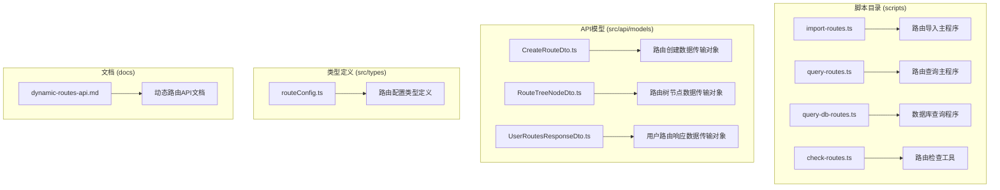
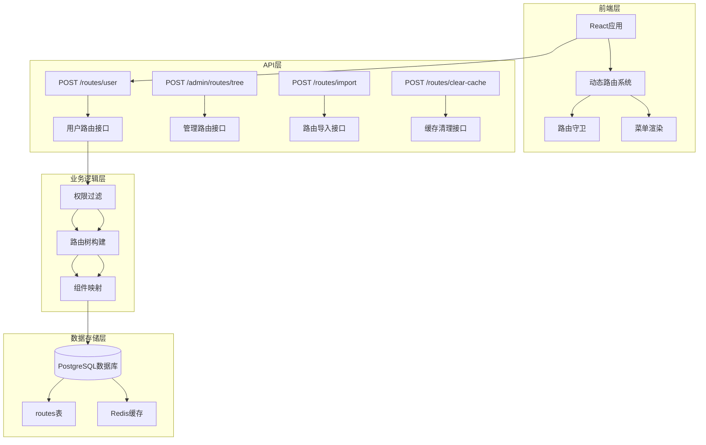
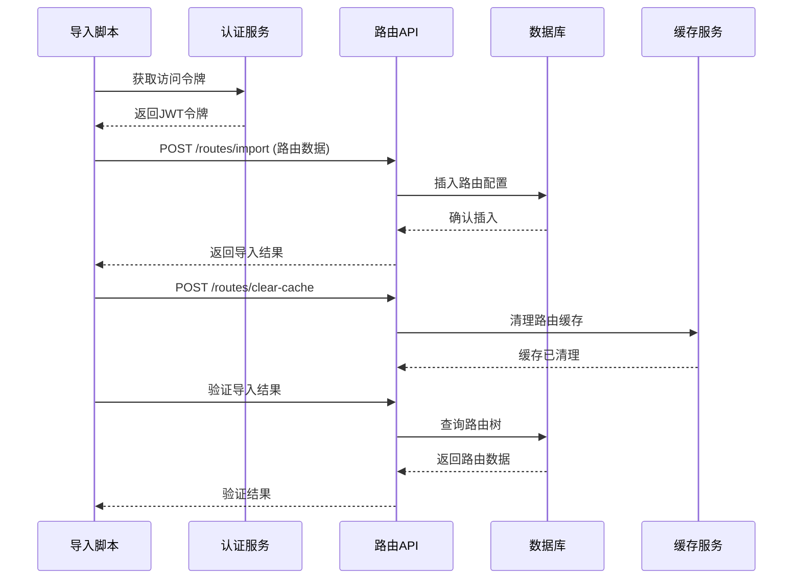
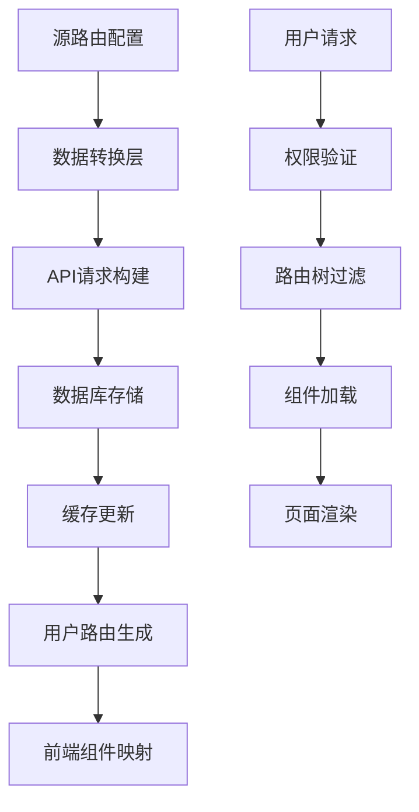
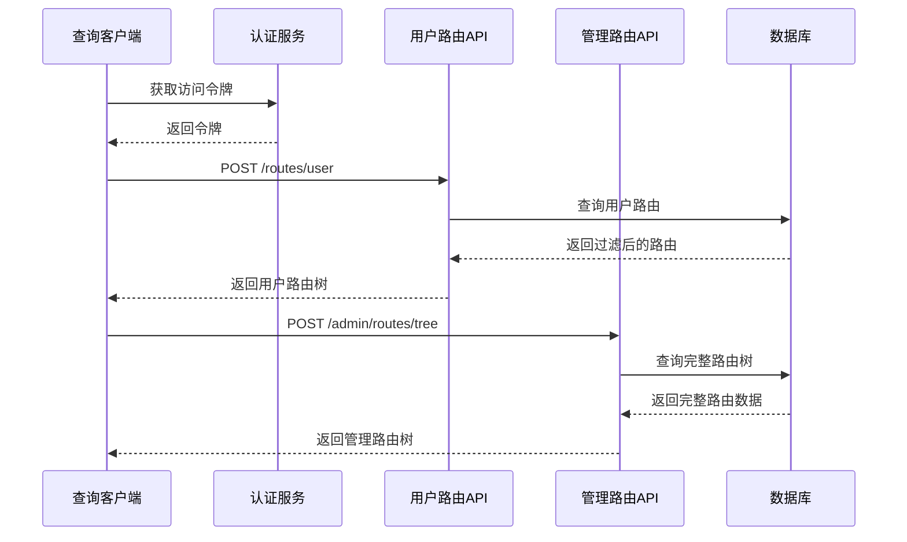
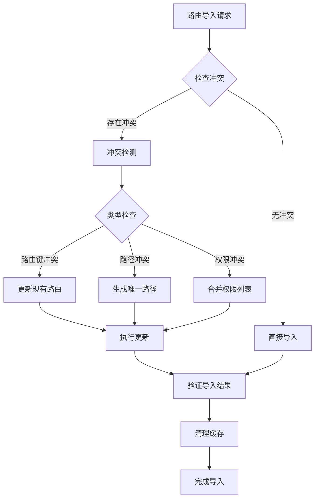
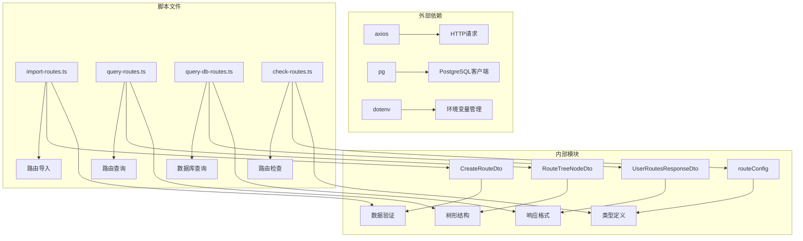

# 路由导入查询脚本

<cite>
**本文档引用的文件**
- [import-routes.ts](file://scripts/import-routes.ts)
- [query-routes.ts](file://scripts/query-routes.ts)
- [query-db-routes.ts](file://scripts/query-db-routes.ts)
- [dynamic-routes-api.md](file://docs/dev/dynamic-routes-api.md)
- [CreateRouteDto.ts](file://src/api/models/CreateRouteDto.ts)
- [RouteTreeNodeDto.ts](file://src/api/models/RouteTreeNodeDto.ts)
- [UserRoutesResponseDto.ts](file://src/api/models/UserRoutesResponseDto.ts)
- [routeConfig.ts](file://src/types/routeConfig.ts)
- [check-routes.ts](file://scripts/check-routes.ts)
</cite>

## 目录
1. [简介](#简介)
2. [项目结构](#项目结构)
3. [核心组件](#核心组件)
4. [架构概览](#架构概览)
5. [详细组件分析](#详细组件分析)
6. [依赖分析](#依赖分析)
7. [性能考虑](#性能考虑)
8. [故障排除指南](#故障排除指南)
9. [结论](#结论)

## 简介

本文档为路由导入查询脚本提供了详细的操作指南，深入解释了 import-routes.ts 如何从数据库或其他数据源导入路由配置，包括数据格式转换、路由映射关系建立、冲突处理机制等。同时详细说明了 query-routes.ts 的查询功能，包括路由数据检索、过滤条件设置、结果格式化等。

该系统实现了动态路由管理功能，支持多分支结构（app、admin、forum），具备权限过滤机制和缓存管理。前端需要根据用户权限动态加载路由树，后端提供完整的路由管理接口。

## 项目结构

路由导入查询脚本位于项目的 scripts 目录中，主要包含以下关键文件：

**图表来源**
- [import-routes.ts](file://scripts/import-routes.ts#L1-L1109)
- [query-routes.ts](file://scripts/query-routes.ts#L1-L112)
- [query-db-routes.ts](file://scripts/query-db-routes.ts#L1-L90)

**章节来源**
- [import-routes.ts](file://scripts/import-routes.ts#L1-L1109)
- [query-routes.ts](file://scripts/query-routes.ts#L1-L112)
- [query-db-routes.ts](file://scripts/query-db-routes.ts#L1-L90)

## 核心组件

### 路由导入组件 (import-routes.ts)

路由导入组件是整个系统的核心，负责将预定义的路由配置导入到数据库中。该组件具有以下关键特性：

- **多分支结构支持**: 支持 app、admin、forum 三种布局类型的路由
- **层次化路由管理**: 支持嵌套的子路由结构
- **权限集成**: 内置权限控制机制
- **自动验证**: 导入后自动验证数据库存储结果
- **缓存清理**: 导入完成后自动清理路由缓存

### 路由查询组件 (query-routes.ts)

路由查询组件提供了完整的路由数据查询功能：

- **完整路由树查询**: 获取数据库中的完整路由树结构
- **用户路由过滤**: 根据用户权限过滤路由节点
- **Admin路由检查**: 验证管理后台路由的完整性
- **响应格式化**: 提供清晰的查询结果格式化输出

### 数据库查询组件 (query-db-routes.ts)

数据库查询组件直接操作 PostgreSQL 数据库：

- **表结构查询**: 获取 routes 表的完整结构信息
- **根节点查询**: 获取所有顶级路由节点
- **权限路由查询**: 搜索包含特定关键词的路由
- **数据导出**: 将查询结果保存到文件

**章节来源**
- [import-routes.ts](file://scripts/import-routes.ts#L1021-L1109)
- [query-routes.ts](file://scripts/query-routes.ts#L7-L112)
- [query-db-routes.ts](file://scripts/query-db-routes.ts#L7-L90)

## 架构概览

系统采用前后端分离的架构设计，路由管理功能分为多个层次：

**图表来源**
- [dynamic-routes-api.md](file://docs/dev/dynamic-routes-api.md#L14-L75)
- [import-routes.ts](file://scripts/import-routes.ts#L1021-L1109)

## 详细组件分析

### 路由导入流程分析

路由导入流程是一个完整的端到端过程，包含数据准备、导入执行、验证反馈等步骤：

**图表来源**
- [import-routes.ts](file://scripts/import-routes.ts#L1021-L1109)

#### 数据格式转换机制

路由导入过程中涉及多种数据格式的转换：

1. **源数据格式**: TypeScript 数组定义的路由配置
2. **API请求格式**: CreateRouteDto 结构的数据传输对象
3. **数据库存储格式**: 关系型数据库的表结构
4. **响应格式**: RouteTreeNodeDto 的树形结构

#### 路由映射关系建立

系统建立了多层次的路由映射关系：

**图表来源**
- [CreateRouteDto.ts](file://src/api/models/CreateRouteDto.ts#L5-L62)
- [RouteTreeNodeDto.ts](file://src/api/models/RouteTreeNodeDto.ts#L5-L61)

**章节来源**
- [import-routes.ts](file://scripts/import-routes.ts#L1021-L1109)
- [CreateRouteDto.ts](file://src/api/models/CreateRouteDto.ts#L1-L75)
- [RouteTreeNodeDto.ts](file://src/api/models/RouteTreeNodeDto.ts#L1-L75)

### 路由查询功能分析

路由查询功能提供了灵活的数据检索能力：

**图表来源**
- [query-routes.ts](file://scripts/query-routes.ts#L7-L112)

#### 查询性能优化策略

查询组件采用了多项性能优化措施：

1. **条件查询**: 使用精确的 SQL 查询条件减少数据量
2. **字段选择**: 仅查询必要的字段，避免全表扫描
3. **结果缓存**: 利用数据库连接池提高查询效率
4. **分页处理**: 对大量数据进行分页查询

**章节来源**
- [query-routes.ts](file://scripts/query-routes.ts#L1-L112)
- [query-db-routes.ts](file://scripts/query-db-routes.ts#L1-L90)

### 冲突处理机制

系统内置了完善的冲突处理机制：

**图表来源**
- [import-routes.ts](file://scripts/import-routes.ts#L1021-L1109)

## 依赖分析

系统各组件之间的依赖关系如下：

**图表来源**
- [import-routes.ts](file://scripts/import-routes.ts#L1-L10)
- [query-routes.ts](file://scripts/query-routes.ts#L5-L5)
- [query-db-routes.ts](file://scripts/query-db-routes.ts#L4-L5)

**章节来源**
- [import-routes.ts](file://scripts/import-routes.ts#L1-L10)
- [query-routes.ts](file://scripts/query-routes.ts#L1-L10)
- [query-db-routes.ts](file://scripts/query-db-routes.ts#L1-L10)

## 性能考虑

### 缓存策略

系统采用了多层缓存策略来提升性能：

1. **Redis缓存**: 用户路由树缓存10分钟
2. **数据库连接池**: 复用数据库连接减少开销
3. **请求去重**: 避免重复的相同查询

### 查询优化

查询组件实现了多项优化措施：

1. **索引利用**: 在关键字段上建立适当的数据库索引
2. **查询限制**: 对查询结果进行数量限制
3. **懒加载**: 按需加载子路由节点

### 导入优化

导入组件采用了批量处理策略：

1. **批量插入**: 减少数据库往返次数
2. **事务处理**: 确保数据一致性
3. **并发控制**: 控制同时进行的导入任务数量

## 故障排除指南

### 常见问题及解决方案

#### 登录认证问题

**问题**: 无法获取访问令牌
**解决方案**:
1. 检查环境变量 ACCESS_TOKEN 是否正确设置
2. 验证管理员账户凭据
3. 确认后端认证服务正常运行

#### 数据导入失败

**问题**: 路由导入过程中出现错误
**解决方案**:
1. 检查路由配置的语法正确性
2. 验证数据库连接参数
3. 查看详细的错误日志信息

#### 路由查询异常

**问题**: 路由查询返回空结果
**解决方案**:
1. 确认路由已经成功导入数据库
2. 检查用户权限配置
3. 验证缓存是否需要清理

#### 数据库连接问题

**问题**: 直接数据库查询失败
**解决方案**:
1. 检查数据库服务器连接参数
2. 验证网络连通性
3. 确认数据库用户权限

### 调试工具使用

系统提供了多种调试工具：

1. **路由检查工具**: 检查API定义和路由配置
2. **数据库查询工具**: 直接查询数据库获取原始数据
3. **权限验证工具**: 验证权限配置的正确性

**章节来源**
- [query-routes.ts](file://scripts/query-routes.ts#L98-L108)
- [query-db-routes.ts](file://scripts/query-db-routes.ts#L77-L86)
- [check-routes.ts](file://scripts/check-routes.ts#L4-L28)

## 结论

路由导入查询脚本系统提供了一个完整、高效的动态路由管理解决方案。通过合理的架构设计和完善的错误处理机制，系统能够满足复杂的路由管理需求。

### 主要优势

1. **灵活性**: 支持多分支结构和灵活的路由配置
2. **安全性**: 内置权限过滤和访问控制机制
3. **可维护性**: 清晰的代码结构和完善的文档
4. **性能**: 优化的查询和缓存策略

### 最佳实践建议

1. **定期备份**: 定期备份路由配置和数据库
2. **版本控制**: 使用版本控制系统管理路由配置变更
3. **监控告警**: 建立监控机制及时发现异常
4. **测试验证**: 在生产环境部署前进行充分测试

该系统为动态路由管理提供了一个可靠的基础设施，可以根据具体需求进行扩展和定制。