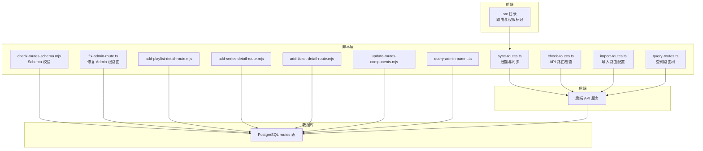
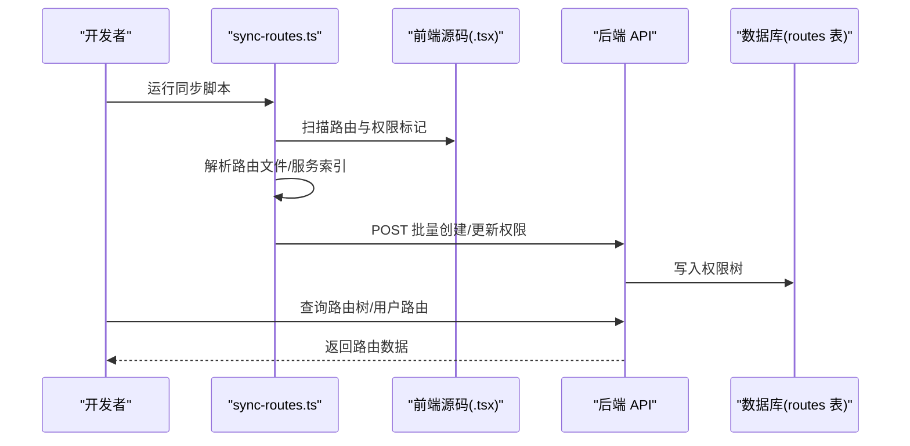
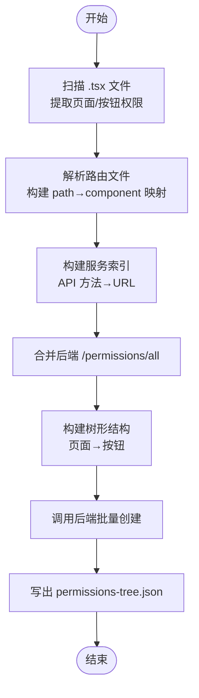
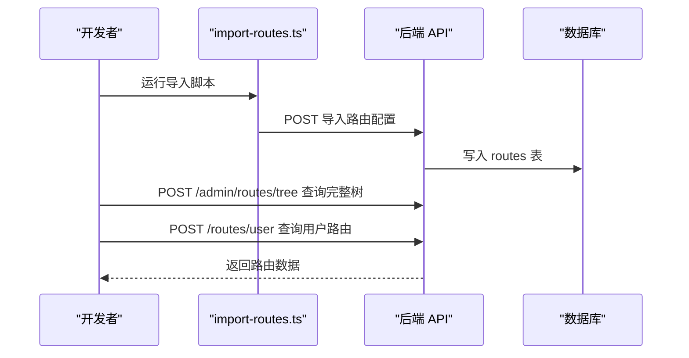
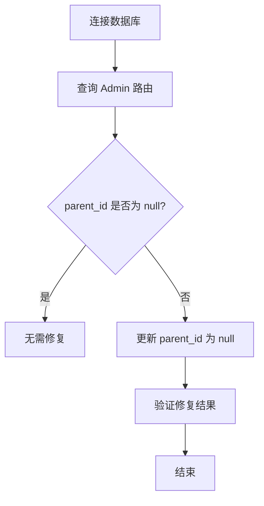
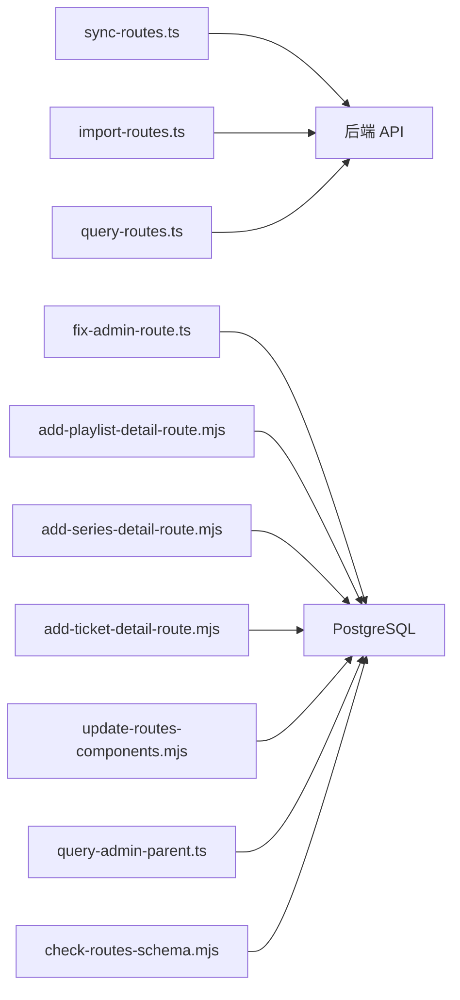

# 路由管理脚本

<cite>
**本文档引用的文件**   
- [scripts/sync-routes.ts](file://scripts/sync-routes.ts)
- [scripts/check-routes.ts](file://scripts/check-routes.ts)
- [scripts/import-routes.ts](file://scripts/import-routes.ts)
- [scripts/query-routes.ts](file://scripts/query-routes.ts)
- [scripts/fix-admin-route.ts](file://scripts/fix-admin-route.ts)
- [scripts/check-routes-schema.mjs](file://scripts/check-routes-schema.mjs)
- [scripts/check-movie-route.mjs](file://scripts/check-movie-route.mjs)
- [scripts/check-playlist-route.mjs](file://scripts/check-playlist-route.mjs)
- [scripts/check-series-route.mjs](file://scripts/check-series-route.mjs)
- [scripts/check-ticket-detail-route.mjs](file://scripts/check-ticket-detail-route.mjs)
- [scripts/add-playlist-detail-route.mjs](file://scripts/add-playlist-detail-route.mjs)
- [scripts/add-series-detail-route.mjs](file://scripts/add-series-detail-route.mjs)
- [scripts/add-ticket-detail-route.mjs](file://scripts/add-ticket-detail-route.mjs)
- [scripts/update-routes-components.mjs](file://scripts/update-routes-components.mjs)
- [scripts/query-admin-parent.ts](file://scripts/query-admin-parent.ts)
</cite>

## 目录
1. [简介](#简介)
2. [项目结构](#项目结构)
3. [核心组件](#核心组件)
4. [架构总览](#架构总览)
5. [详细组件分析](#详细组件分析)
6. [依赖关系分析](#依赖关系分析)
7. [性能考量](#性能考量)
8. [故障排查指南](#故障排查指南)
9. [结论](#结论)
10. [附录](#附录)

## 简介
本技术指南围绕路由管理脚本体系，系统讲解如何通过脚本实现“前后端路由一致性”的维护、路由结构与 Schema 的验证、数据库路由的导入与查询、以及针对具体路由问题的修复流程。内容涵盖：
- 路由同步脚本：从前端源码提取路由与权限信息，与后端进行比对与更新
- 路由验证脚本：校验数据库路由结构、特定路由组件与层级关系
- 路由导入与查询脚本：将静态路由配置导入数据库，并查询后端返回的路由树
- 路由修复脚本：修正 Admin 根路由的父级关系等典型问题
- 最佳实践与常见问题解决方案

## 项目结构
路由管理脚本位于 scripts 目录，按功能划分为：
- 同步与验证：sync-routes.ts、check-routes.ts、check-routes-schema.mjs
- 导入与查询：import-routes.ts、query-routes.ts
- 修复与诊断：fix-admin-route.ts、query-admin-parent.ts
- 具体路由修复：add-playlist-detail-route.mjs、add-series-detail-route.mjs、add-ticket-detail-route.mjs
- 组件命名修复：update-routes-components.mjs
- 片单/剧集/电影/工单详情路由诊断：check-playlist-route.mjs、check-series-route.mjs、check-movie-route.mjs、check-ticket-detail-route.mjs

**图表来源**
- [scripts/sync-routes.ts](file://scripts/sync-routes.ts#L62-L99)
- [scripts/check-routes.ts](file://scripts/check-routes.ts#L4-L28)
- [scripts/check-routes-schema.mjs](file://scripts/check-routes-schema.mjs#L13-L36)
- [scripts/import-routes.ts](file://scripts/import-routes.ts#L1-L120)
- [scripts/query-routes.ts](file://scripts/query-routes.ts#L7-L112)
- [scripts/fix-admin-route.ts](file://scripts/fix-admin-route.ts#L7-L93)
- [scripts/add-playlist-detail-route.mjs](file://scripts/add-playlist-detail-route.mjs#L13-L91)
- [scripts/add-series-detail-route.mjs](file://scripts/add-series-detail-route.mjs#L13-L54)
- [scripts/add-ticket-detail-route.mjs](file://scripts/add-ticket-detail-route.mjs#L13-L76)
- [scripts/update-routes-components.mjs](file://scripts/update-routes-components.mjs#L84-L142)
- [scripts/query-admin-parent.ts](file://scripts/query-admin-parent.ts#L4-L75)

**章节来源**
- [scripts/sync-routes.ts](file://scripts/sync-routes.ts#L62-L99)
- [scripts/check-routes.ts](file://scripts/check-routes.ts#L4-L28)
- [scripts/check-routes-schema.mjs](file://scripts/check-routes-schema.mjs#L13-L36)
- [scripts/import-routes.ts](file://scripts/import-routes.ts#L1-L120)
- [scripts/query-routes.ts](file://scripts/query-routes.ts#L7-L112)
- [scripts/fix-admin-route.ts](file://scripts/fix-admin-route.ts#L7-L93)
- [scripts/add-playlist-detail-route.mjs](file://scripts/add-playlist-detail-route.mjs#L13-L91)
- [scripts/add-series-detail-route.mjs](file://scripts/add-series-detail-route.mjs#L13-L54)
- [scripts/add-ticket-detail-route.mjs](file://scripts/add-ticket-detail-route.mjs#L13-L76)
- [scripts/update-routes-components.mjs](file://scripts/update-routes-components.mjs#L84-L142)
- [scripts/query-admin-parent.ts](file://scripts/query-admin-parent.ts#L4-L75)

## 核心组件
- 路由同步脚本（sync-routes.ts）
  - 功能：扫描前端 .tsx 文件，提取页面与按钮权限键，结合路由文件与服务索引，构建树形权限结构并批量创建/更新后端权限
  - 关键流程：扫描源码 → 解析路由 → 构建服务索引 → 合并 API 权限 → 生成树形结构 → 调用后端批量创建
- 路由验证脚本（check-routes.ts）
  - 功能：拉取后端 API 文档，列出包含 navigation 的路由，辅助识别导航相关接口
- 路由导入与查询脚本（import-routes.ts、query-routes.ts）
  - 导入：将静态路由配置写入数据库（通过后端 API）
  - 查询：获取完整路由树与用户可见路由，核对 Admin 根节点与可见性
- 路由修复脚本（fix-admin-route.ts）
  - 功能：将 Admin 根路由的 parent_id 设为 null，确保其作为真正根节点
- Schema 与组件修复脚本
  - check-routes-schema.mjs：查看 routes 表结构与示例数据
  - update-routes-components.mjs：统一组件命名，避免 Admin 前缀冗余
- 具体路由修复脚本
  - add-playlist-detail-route.mjs、add-series-detail-route.mjs、add-ticket-detail-route.mjs：为缺失的详情路由创建父级关系
- 父级查询脚本（query-admin-parent.ts）
  - 查询指定 ID 的路由及其父节点，辅助定位异常父子关系

**章节来源**
- [scripts/sync-routes.ts](file://scripts/sync-routes.ts#L62-L99)
- [scripts/check-routes.ts](file://scripts/check-routes.ts#L4-L28)
- [scripts/import-routes.ts](file://scripts/import-routes.ts#L1-L120)
- [scripts/query-routes.ts](file://scripts/query-routes.ts#L7-L112)
- [scripts/fix-admin-route.ts](file://scripts/fix-admin-route.ts#L7-L93)
- [scripts/check-routes-schema.mjs](file://scripts/check-routes-schema.mjs#L13-L36)
- [scripts/update-routes-components.mjs](file://scripts/update-routes-components.mjs#L84-L142)
- [scripts/add-playlist-detail-route.mjs](file://scripts/add-playlist-detail-route.mjs#L13-L91)
- [scripts/add-series-detail-route.mjs](file://scripts/add-series-detail-route.mjs#L13-L54)
- [scripts/add-ticket-detail-route.mjs](file://scripts/add-ticket-detail-route.mjs#L13-L76)
- [scripts/query-admin-parent.ts](file://scripts/query-admin-parent.ts#L4-L75)

## 架构总览
下图展示“前端扫描 → 后端比对/导入 → 数据库持久化 → 前端查询验证”的闭环流程。

**图表来源**
- [scripts/sync-routes.ts](file://scripts/sync-routes.ts#L62-L99)
- [scripts/query-routes.ts](file://scripts/query-routes.ts#L37-L97)

**章节来源**
- [scripts/sync-routes.ts](file://scripts/sync-routes.ts#L62-L99)
- [scripts/query-routes.ts](file://scripts/query-routes.ts#L37-L97)

## 详细组件分析

### 路由同步脚本（sync-routes.ts）
- 数据采集
  - 扫描 src 下 .tsx 文件，匹配 PermissionRoute、AccessControl、canAccess 等权限标记
  - 解析路由文件，建立 path → component 的映射，支持嵌套路由与父级路径拼接
  - 构建服务索引，解析 API 服务方法与 URL，汇总按钮调用的接口清单
- 结构构建
  - 从路由路径派生页面权限键，作为缺失时的回退策略
  - 为每个页面构建组件依赖闭包，确定按钮权限归属
  - 合并后端 /permissions/all 返回的 API 权限记录
- 上载与输出
  - 生成树形结构（页面为父节点，按钮为子节点），调用后端批量创建接口
  - 输出 permissions-tree.json，便于人工核对

**图表来源**
- [scripts/sync-routes.ts](file://scripts/sync-routes.ts#L101-L116)
- [scripts/sync-routes.ts](file://scripts/sync-routes.ts#L266-L372)
- [scripts/sync-routes.ts](file://scripts/sync-routes.ts#L397-L428)
- [scripts/sync-routes.ts](file://scripts/sync-routes.ts#L574-L598)
- [scripts/sync-routes.ts](file://scripts/sync-routes.ts#L459-L495)

**章节来源**
- [scripts/sync-routes.ts](file://scripts/sync-routes.ts#L101-L116)
- [scripts/sync-routes.ts](file://scripts/sync-routes.ts#L266-L372)
- [scripts/sync-routes.ts](file://scripts/sync-routes.ts#L397-L428)
- [scripts/sync-routes.ts](file://scripts/sync-routes.ts#L574-L598)
- [scripts/sync-routes.ts](file://scripts/sync-routes.ts#L459-L495)

### 路由验证脚本（check-routes.ts）
- 作用：从后端获取 API 文档，筛选包含 navigation 的路由，打印方法与路径，辅助识别导航相关接口
- 适用场景：确认后端是否暴露导航相关接口，或排查接口变更导致的前端导航缺失

**章节来源**
- [scripts/check-routes.ts](file://scripts/check-routes.ts#L4-L28)

### 路由导入与查询脚本（import-routes.ts、query-routes.ts）
- 导入（import-routes.ts）
  - 提供完整的静态路由配置（含布局、排序、权限、可见性等），通过后端 API 写入数据库
  - 适合首次初始化或大规模迁移
- 查询（query-routes.ts）
  - 获取完整路由树（POST /admin/routes/tree）与用户可见路由（POST /routes/user）
  - 核对 Admin 根节点是否存在、用户路由是否包含 Admin 等

**图表来源**
- [scripts/import-routes.ts](file://scripts/import-routes.ts#L1-L120)
- [scripts/query-routes.ts](file://scripts/query-routes.ts#L37-L97)

**章节来源**
- [scripts/import-routes.ts](file://scripts/import-routes.ts#L1-L120)
- [scripts/query-routes.ts](file://scripts/query-routes.ts#L37-L97)

### 路由修复脚本（fix-admin-route.ts）
- 问题：Admin 根路由 parent_id 非空，导致其不是真正的根节点
- 修复：将 parent_id 设为 null，确保 Admin 根路由成为根节点
- 验证：查询所有根节点，确认修复生效

**图表来源**
- [scripts/fix-admin-route.ts](file://scripts/fix-admin-route.ts#L20-L70)

**章节来源**
- [scripts/fix-admin-route.ts](file://scripts/fix-admin-route.ts#L20-L70)

### Schema 与组件修复脚本
- check-routes-schema.mjs：查看 routes 表字段定义与示例数据，辅助理解表结构
- update-routes-components.mjs：统一组件命名，避免 Admin 前缀冗余，提升一致性

**章节来源**
- [scripts/check-routes-schema.mjs](file://scripts/check-routes-schema.mjs#L13-L36)
- [scripts/update-routes-components.mjs](file://scripts/update-routes-components.mjs#L84-L142)

### 具体路由修复脚本
- add-playlist-detail-route.mjs：为缺失的片单详情路由创建父级关系，插入新记录
- add-series-detail-route.mjs：为缺失的剧集详情路由创建父级关系
- add-ticket-detail-route.mjs：为缺失的工单详情路由创建父级关系

**章节来源**
- [scripts/add-playlist-detail-route.mjs](file://scripts/add-playlist-detail-route.mjs#L13-L91)
- [scripts/add-series-detail-route.mjs](file://scripts/add-series-detail-route.mjs#L13-L54)
- [scripts/add-ticket-detail-route.mjs](file://scripts/add-ticket-detail-route.mjs#L13-L76)

### 父级查询脚本（query-admin-parent.ts）
- 查询指定 ID 的路由及其父节点，辅助定位异常父子关系
- 将结果写入文件，便于离线分析

**章节来源**
- [scripts/query-admin-parent.ts](file://scripts/query-admin-parent.ts#L4-L75)

## 依赖关系分析
- 脚本间耦合
  - sync-routes.ts 依赖前端源码与后端 API；与 import-routes.ts 在“路由配置”层面互补
  - query-routes.ts 依赖后端 API；可与 sync-routes.ts 的输出进行对比
  - 修复脚本直接操作数据库，需谨慎执行
- 外部依赖
  - 后端 API：权限批量创建、路由树查询、用户路由查询
  - 数据库：PostgreSQL routes 表
  - 环境变量：ACCESS_TOKEN、API_BASE_URL 等

**图表来源**
- [scripts/sync-routes.ts](file://scripts/sync-routes.ts#L62-L99)
- [scripts/import-routes.ts](file://scripts/import-routes.ts#L1-L120)
- [scripts/query-routes.ts](file://scripts/query-routes.ts#L37-L97)
- [scripts/fix-admin-route.ts](file://scripts/fix-admin-route.ts#L7-L93)
- [scripts/add-playlist-detail-route.mjs](file://scripts/add-playlist-detail-route.mjs#L13-L91)
- [scripts/add-series-detail-route.mjs](file://scripts/add-series-detail-route.mjs#L13-L54)
- [scripts/add-ticket-detail-route.mjs](file://scripts/add-ticket-detail-route.mjs#L13-L76)
- [scripts/update-routes-components.mjs](file://scripts/update-routes-components.mjs#L84-L142)
- [scripts/query-admin-parent.ts](file://scripts/query-admin-parent.ts#L4-L75)
- [scripts/check-routes-schema.mjs](file://scripts/check-routes-schema.mjs#L13-L36)

**章节来源**
- [scripts/sync-routes.ts](file://scripts/sync-routes.ts#L62-L99)
- [scripts/import-routes.ts](file://scripts/import-routes.ts#L1-L120)
- [scripts/query-routes.ts](file://scripts/query-routes.ts#L37-L97)
- [scripts/fix-admin-route.ts](file://scripts/fix-admin-route.ts#L7-L93)
- [scripts/add-playlist-detail-route.mjs](file://scripts/add-playlist-detail-route.mjs#L13-L91)
- [scripts/add-series-detail-route.mjs](file://scripts/add-series-detail-route.mjs#L13-L54)
- [scripts/add-ticket-detail-route.mjs](file://scripts/add-ticket-detail-route.mjs#L13-L76)
- [scripts/update-routes-components.mjs](file://scripts/update-routes-components.mjs#L84-L142)
- [scripts/query-admin-parent.ts](file://scripts/query-admin-parent.ts#L4-L75)
- [scripts/check-routes-schema.mjs](file://scripts/check-routes-schema.mjs#L13-L36)

## 性能考量
- 扫描与解析
  - 同步脚本递归扫描 src 下 .tsx 文件，建议在 CI 环境限制扫描范围或缓存中间结果
- API 调用
  - 批量创建权限时尽量减少请求次数，确保一次性提交树形结构
- 数据库操作
  - 修复与导入脚本应使用事务或批量写入，降低锁竞争与 IO 压力
- 缓存与日志
  - 输出 permissions-tree.json 便于离线分析，减少重复网络请求

## 故障排查指南
- Admin 根路由不显示
  - 使用 fix-admin-route.ts 将 parent_id 设为 null，并通过 query-routes.ts 验证用户路由是否包含 Admin
- 片单/剧集/工单详情路由缺失
  - 使用对应 add-*.mjs 脚本创建详情路由，并通过 check-*.mjs 脚本验证层级关系
- 路由组件命名不一致
  - 使用 update-routes-components.mjs 统一组件命名，避免 Admin 前缀冗余
- 路由 Schema 异常
  - 使用 check-routes-schema.mjs 查看表结构与示例数据，确认字段类型与约束
- 父级关系异常
  - 使用 query-admin-parent.ts 查询指定 ID 的路由与其父节点，定位孤儿引用或错误父级

**章节来源**
- [scripts/fix-admin-route.ts](file://scripts/fix-admin-route.ts#L20-L70)
- [scripts/add-playlist-detail-route.mjs](file://scripts/add-playlist-detail-route.mjs#L13-L91)
- [scripts/add-series-detail-route.mjs](file://scripts/add-series-detail-route.mjs#L13-L54)
- [scripts/add-ticket-detail-route.mjs](file://scripts/add-ticket-detail-route.mjs#L13-L76)
- [scripts/update-routes-components.mjs](file://scripts/update-routes-components.mjs#L84-L142)
- [scripts/check-routes-schema.mjs](file://scripts/check-routes-schema.mjs#L13-L36)
- [scripts/query-admin-parent.ts](file://scripts/query-admin-parent.ts#L4-L75)

## 结论
通过上述脚本体系，可以实现从前端源码到后端数据库的“路由一致性闭环”：同步采集、结构构建、批量导入、查询验证与针对性修复。配合 Schema 校验与组件命名统一，能够显著降低路由配置错误率，提升维护效率。

## 附录
- 最佳实践
  - 在 CI 中定期运行 sync-routes.ts 与 check-routes.ts，确保前后端路由一致
  - 导入新路由时先在本地运行 query-routes.ts 核对 Admin 根节点与用户可见性
  - 修改路由结构前先备份数据库，再执行修复脚本
  - 统一组件命名，避免 Admin 前缀冗余影响前端渲染
- 常见问题
  - Admin 根路由非根节点：使用 fix-admin-route.ts 修复
  - 详情路由缺失：使用 add-*.mjs 创建
  - 父级关系异常：使用 query-admin-parent.ts 定位
  - Schema 不一致：使用 check-routes-schema.mjs 校验