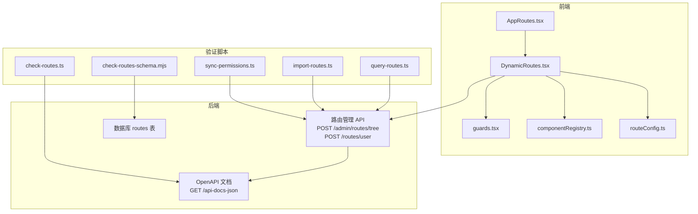
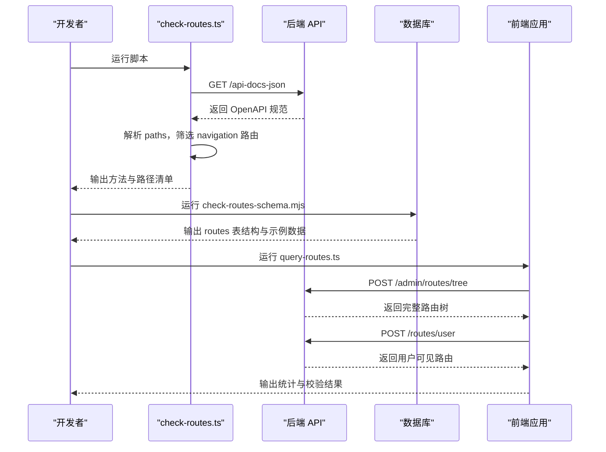
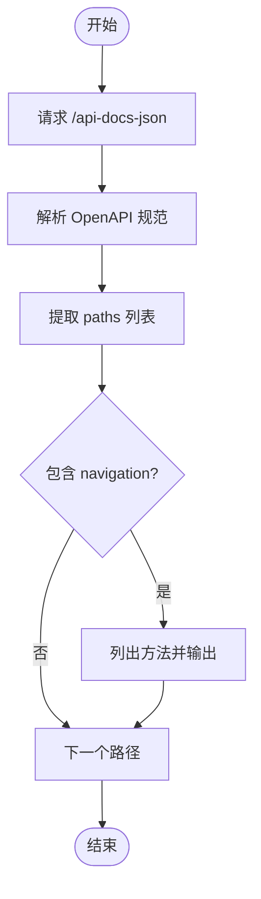
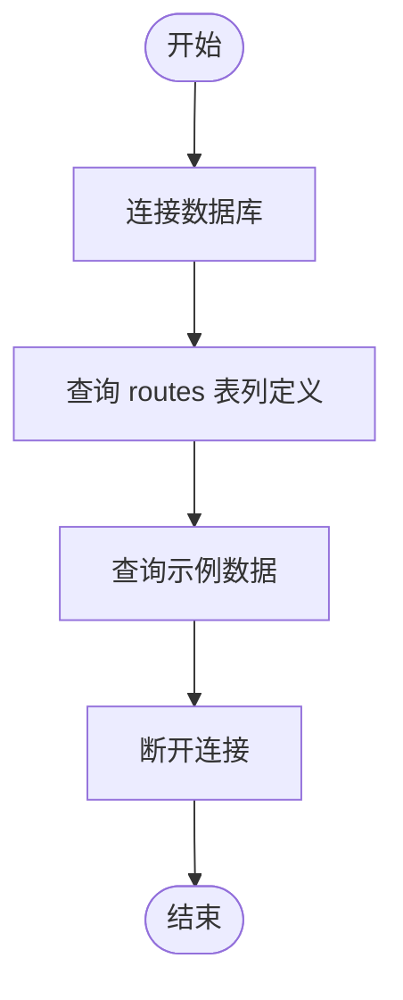
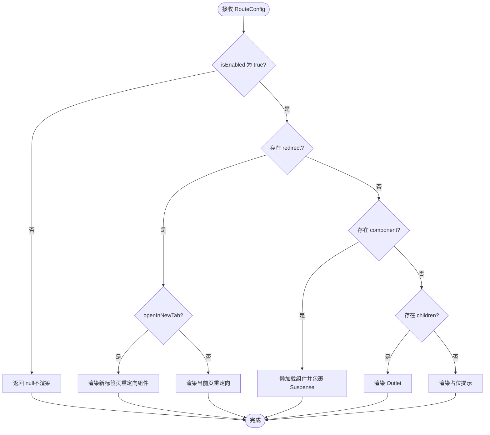
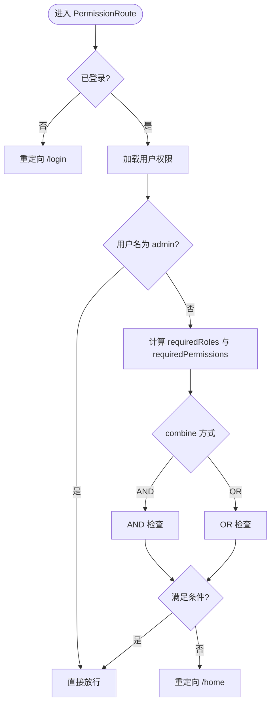
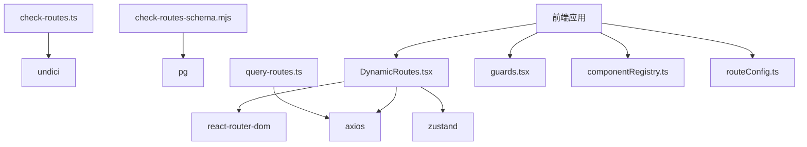

# 路由验证脚本

<cite>
**本文档引用的文件**
- [check-routes.ts](file://scripts/check-routes.ts)
- [check-routes-schema.mjs](file://scripts/check-routes-schema.mjs)
- [routeConfig.ts](file://src/types/routeConfig.ts)
- [import-routes.ts](file://scripts/import-routes.ts)
- [DynamicRoutes.tsx](file://src/routes/DynamicRoutes.tsx)
- [guards.tsx](file://src/routes/guards.tsx)
- [componentRegistry.ts](file://src/routes/componentRegistry.ts)
- [AppRoutes.tsx](file://src/routes/AppRoutes.tsx)
- [query-routes.ts](file://scripts/query-routes.ts)
- [sync-permissions.ts](file://scripts/sync-permissions.ts)
- [dynamic-routes-api.md](file://docs/dev/dynamic-routes-api.md)
- [route-icon-frontend-guide.md](file://src/modules/admin/pages/system/routes/route-icon-frontend-guide.md)
- [package.json](file://package.json)
</cite>

## 目录
1. [简介](#简介)
2. [项目结构](#项目结构)
3. [核心组件](#核心组件)
4. [架构总览](#架构总览)
5. [详细组件分析](#详细组件分析)
6. [依赖关系分析](#依赖关系分析)
7. [性能考量](#性能考量)
8. [故障排查指南](#故障排查指南)
9. [结论](#结论)
10. [附录](#附录)

## 简介
本技术指南围绕路由验证脚本展开，重点解析两个关键脚本：check-routes.ts 与 check-routes-schema.mjs，以及它们如何协同验证路由配置的完整性与正确性。文档将深入解释路由结构验证机制，包括路由路径格式检查、组件引用验证、权限配置校验等，并说明 Schema 校验的具体规则与验证逻辑。最后提供最佳实践与错误处理策略，帮助开发者快速定位并修复常见验证错误。

## 项目结构
路由验证涉及前后端协作：前端通过动态路由系统渲染后端下发的路由配置，后端提供路由树与用户路由接口；验证脚本负责拉取后端 API 文档与数据库结构，辅助确认路由配置的正确性。

图表来源
- [AppRoutes.tsx](file://src/routes/AppRoutes.tsx#L73-L98)
- [DynamicRoutes.tsx](file://src/routes/DynamicRoutes.tsx#L255-L264)
- [guards.tsx](file://src/routes/guards.tsx#L11-L15)
- [componentRegistry.ts](file://src/routes/componentRegistry.ts#L248-L250)
- [routeConfig.ts](file://src/types/routeConfig.ts#L14-L41)
- [check-routes.ts](file://scripts/check-routes.ts#L4-L26)
- [check-routes-schema.mjs](file://scripts/check-routes-schema.mjs#L13-L36)
- [query-routes.ts](file://scripts/query-routes.ts#L7-L112)
- [import-routes.ts](file://scripts/import-routes.ts#L1-L1109)
- [sync-permissions.ts](file://scripts/sync-permissions.ts#L62-L99)

章节来源
- [AppRoutes.tsx](file://src/routes/AppRoutes.tsx#L73-L98)
- [DynamicRoutes.tsx](file://src/routes/DynamicRoutes.tsx#L255-L264)
- [guards.tsx](file://src/routes/guards.tsx#L11-L15)
- [componentRegistry.ts](file://src/routes/componentRegistry.ts#L248-L250)
- [routeConfig.ts](file://src/types/routeConfig.ts#L14-L41)
- [check-routes.ts](file://scripts/check-routes.ts#L4-L26)
- [check-routes-schema.mjs](file://scripts/check-routes-schema.mjs#L13-L36)
- [query-routes.ts](file://scripts/query-routes.ts#L7-L112)
- [import-routes.ts](file://scripts/import-routes.ts#L1-L1109)
- [sync-permissions.ts](file://scripts/sync-permissions.ts#L62-L99)

## 核心组件
- 路由配置类型定义：routeConfig.ts 提供 RouteConfig 与 RouteConfigResponse 的类型约束，明确路由字段、布局、权限、子路由等结构。
- 动态路由渲染：DynamicRoutes.tsx 根据后端返回的路由配置，动态生成 React Router 路由树，支持布局包装、索引路由、重定向与新标签页打开。
- 路由守卫：guards.tsx 提供基于登录态与权限的守卫，结合后端权限进行访问控制。
- 组件注册表：componentRegistry.ts 将 componentKey 与懒加载组件绑定，确保动态路由可按需加载。
- 验证脚本：
  - check-routes.ts：拉取后端 OpenAPI 文档，筛选包含 navigation 的路径，输出方法与路径清单。
  - check-routes-schema.mjs：连接数据库，查询 routes 表结构与示例数据，辅助 Schema 校验。
  - query-routes.ts：调用后端路由树与用户路由接口，输出结构与统计，辅助验证导入结果。
  - import-routes.ts：提供完整的路由配置数据，用于导入与比对。
  - sync-permissions.ts：扫描前端源码提取权限键，构建权限树并批量同步至后端。

章节来源
- [routeConfig.ts](file://src/types/routeConfig.ts#L14-L41)
- [DynamicRoutes.tsx](file://src/routes/DynamicRoutes.tsx#L56-L125)
- [guards.tsx](file://src/routes/guards.tsx#L20-L102)
- [componentRegistry.ts](file://src/routes/componentRegistry.ts#L15-L241)
- [check-routes.ts](file://scripts/check-routes.ts#L4-L26)
- [check-routes-schema.mjs](file://scripts/check-routes-schema.mjs#L13-L36)
- [query-routes.ts](file://scripts/query-routes.ts#L7-L112)
- [import-routes.ts](file://scripts/import-routes.ts#L1-L1109)
- [sync-permissions.ts](file://scripts/sync-permissions.ts#L62-L99)

## 架构总览
前端通过动态路由系统消费后端提供的路由树，渲染时依据配置进行组件加载、布局包装与权限校验。验证脚本从不同维度对路由配置进行交叉验证：API 文档、数据库 Schema、运行时行为与权限树。

图表来源
- [check-routes.ts](file://scripts/check-routes.ts#L4-L26)
- [check-routes-schema.mjs](file://scripts/check-routes-schema.mjs#L13-L36)
- [query-routes.ts](file://scripts/query-routes.ts#L37-L97)

章节来源
- [check-routes.ts](file://scripts/check-routes.ts#L4-L26)
- [check-routes-schema.mjs](file://scripts/check-routes-schema.mjs#L13-L36)
- [query-routes.ts](file://scripts/query-routes.ts#L37-L97)

## 详细组件分析

### check-routes.ts：API 文档路由验证
- 功能概述
  - 从后端拉取 OpenAPI 文档，解析 servers 与 paths。
  - 筛选包含 navigation 的路径，输出方法与路径清单，便于核对导航相关接口。
- 关键流程
  - 发起 HTTP 请求获取 /api-docs-json。
  - 从 spec.paths 中提取路径集合，过滤包含 navigation 的条目。
  - 遍历每个路径，输出其支持的方法（大写）与路径本身。
- 错误处理
  - 捕获网络异常与 JSON 解析错误，统一打印错误信息。
- 最佳实践
  - 在 CI 中定期运行，确保导航相关接口未遗漏或变更。
  - 结合 query-routes.ts 的输出，对比后端路由树与前端渲染结果。

图表来源
- [check-routes.ts](file://scripts/check-routes.ts#L4-L26)

章节来源
- [check-routes.ts](file://scripts/check-routes.ts#L4-L26)

### check-routes-schema.mjs：数据库 Schema 校验
- 功能概述
  - 连接 PostgreSQL 数据库，查询 routes 表的列定义（列名、数据类型、是否可空）。
  - 输出示例数据，辅助确认字段取值与约束。
- 关键流程
  - 初始化客户端并连接数据库。
  - 查询 information_schema.columns 获取列元数据。
  - 查询 routes 表 LIMIT 1 获取示例记录。
  - 断开连接。
- 最佳实践
  - 在修改 routes 表结构或字段约束时，先运行此脚本核对当前 Schema。
  - 将输出结果与后端模型定义进行比对，确保一致。

图表来源
- [check-routes-schema.mjs](file://scripts/check-routes-schema.mjs#L13-L36)

章节来源
- [check-routes-schema.mjs](file://scripts/check-routes-schema.mjs#L13-L36)

### 路由配置类型与结构验证（routeConfig.ts）
- 关键字段说明
  - id：路由唯一标识。
  - path：路由路径，支持绝对路径与相对路径（相对路径会与父路径拼接）。
  - component：组件注册表中的 key，用于动态加载。
  - layout：布局类型（app/admin/forum/none）。
  - permissions：所需权限列表。
  - children：子路由数组。
  - name/index/redirect/openInNewTab/isVisible/isEnabled/icon：其他展示与行为控制字段。
- 验证要点
  - 路径格式：必须为非空字符串，相对路径需与父路径正确拼接。
  - 组件引用：component 必须存在于 componentRegistry。
  - 布局类型：layout 必须为预定义枚举之一。
  - 权限配置：permissions 为字符串数组，建议与后端权限树一致。
  - 子路由：children 为 RouteConfig 数组，需逐项验证。
  - 启用状态：isEnabled 控制是否渲染，未启用的路由不应出现在最终渲染树中。
- Schema 规则建议
  - 必填字段：id、path、component（或 children）。
  - 数据类型：id/path/name/icon 为字符串；permissions 为字符串数组；children 为数组；isEnabled/index/openInNewTab/isVisible 为布尔。
  - 格式约束：path 不能包含非法字符；component 必须在注册表中存在；layout 限定枚举值。

章节来源
- [routeConfig.ts](file://src/types/routeConfig.ts#L14-L41)

### 动态路由渲染与组件引用验证（DynamicRoutes.tsx）
- 关键逻辑
  - renderRoute：根据 RouteConfig 渲染单个路由，处理 index、redirect、openInNewTab、isEnabled 等字段。
  - renderLayoutRoutes：根据 layout 包装布局组件，处理重定向与 404 页面。
  - getComponent：从 componentRegistry 获取懒加载组件，若不存在则渲染占位提示。
- 验证要点
  - 路由拼接：相对路径与父路径拼接，确保最终路径正确。
  - 重定向优先级：redirect 优先于 children，openInNewTab 时使用新标签页组件。
  - 布局包装：layout 为 app/admin/forum/none 时分别包装对应布局。
  - 组件加载：component 不存在时输出“页面开发中”提示，便于定位缺失组件。
- 最佳实践
  - 在导入路由配置后，先运行 query-routes.ts 核对后端返回的路由树。
  - 使用 componentRegistry.hasComponent 辅助检查组件是否存在。

图表来源
- [DynamicRoutes.tsx](file://src/routes/DynamicRoutes.tsx#L56-L125)

章节来源
- [DynamicRoutes.tsx](file://src/routes/DynamicRoutes.tsx#L56-L125)
- [componentRegistry.ts](file://src/routes/componentRegistry.ts#L248-L250)

### 路由守卫与权限校验（guards.tsx）
- 关键逻辑
  - AuthRoute：检查本地是否存在 accessToken，未登录则重定向至 /login。
  - PermissionRoute：结合 requiredPermissions 与 requiredRoles，支持 AND/OR 与 matchAll 组合。
  - 管理员放行：用户名为 admin 时直接放行。
- 验证要点
  - requiredPermissions 与 requiredRoles 的组合策略需与后端一致。
  - 加载状态与权限不足时的处理（显示加载提示或重定向首页）。
- 最佳实践
  - 在路由配置中明确 permissions 字段，确保与后端权限树一致。
  - 使用 sync-permissions.ts 生成权限树并与后端同步，减少权限不一致导致的验证失败。

图表来源
- [guards.tsx](file://src/routes/guards.tsx#L20-L102)

章节来源
- [guards.tsx](file://src/routes/guards.tsx#L20-L102)

### 后端路由树与用户路由验证（query-routes.ts）
- 关键流程
  - 登录获取 token（可从环境变量读取）。
  - 调用 POST /admin/routes/tree 获取完整路由树，输出统计与结构。
  - 调用 POST /routes/user 获取用户可见路由，检查是否包含 admin 路由。
- 验证要点
  - 路由树结构：根节点数量、各节点的 layout、path、children 数量。
  - 用户路由：确保用户可见路由包含必要的后台路由（如 admin）。
- 最佳实践
  - 在导入路由配置后运行此脚本，确认后端返回的路由树与期望一致。
  - 若用户路由缺少 admin，检查权限过滤逻辑或后端返回逻辑。

章节来源
- [query-routes.ts](file://scripts/query-routes.ts#L7-L112)

### 权限同步与路由配置导入（sync-permissions.ts 与 import-routes.ts）
- sync-permissions.ts
  - 扫描前端源码，提取页面与按钮权限键，构建权限树并批量创建/更新。
  - 与后端 /permissions/all 对齐，补充 API 权限记录。
- import-routes.ts
  - 提供完整的路由配置数据，包含多级子路由、布局、权限、排序等字段。
  - 用于导入与比对，确保前端路由与后端存储一致。
- 验证要点
  - 权限键命名规范：page:*、edit:*、admin/* 等，与后端权限树一致。
  - 路由配置字段：id、path、component、layout、permissions、children、sortOrder 等。
- 最佳实践
  - 在修改路由或权限前，先运行 sync-permissions.ts 生成权限树，再导入路由配置。
  - 使用 query-routes.ts 核对导入结果，确保用户路由包含必要后台路由。

章节来源
- [sync-permissions.ts](file://scripts/sync-permissions.ts#L62-L99)
- [import-routes.ts](file://scripts/import-routes.ts#L1-L1109)

## 依赖关系分析
- 前端依赖
  - react-router-dom：路由渲染与导航。
  - axios：调用后端 API。
  - zustand：全局加载状态管理。
- 后端依赖
  - OpenAPI 文档：提供接口契约，供前端与验证脚本使用。
  - PostgreSQL：存储路由配置，供 check-routes-schema.mjs 校验。
- 脚本依赖
  - undici：HTTP 客户端，用于拉取 OpenAPI 文档。
  - pg：PostgreSQL 客户端，用于查询 routes 表结构。

图表来源
- [check-routes.ts](file://scripts/check-routes.ts#L2-L2)
- [check-routes-schema.mjs](file://scripts/check-routes-schema.mjs#L1-L3)
- [query-routes.ts](file://scripts/query-routes.ts#L5-L5)
- [DynamicRoutes.tsx](file://src/routes/DynamicRoutes.tsx#L6-L13)
- [guards.tsx](file://src/routes/guards.tsx#L6-L6)
- [componentRegistry.ts](file://src/routes/componentRegistry.ts#L6-L6)
- [routeConfig.ts](file://src/types/routeConfig.ts#L1-L4)

章节来源
- [package.json](file://package.json#L126-L139)

## 性能考量
- 动态路由渲染
  - 使用 React.lazy 与 Suspense 按需加载组件，减少初始包体积。
  - 在 DynamicRoutes.tsx 中过滤未启用的子路由，避免不必要的渲染。
- API 调用
  - query-routes.ts 与 check-routes.ts 仅在验证阶段运行，不影响生产性能。
- 数据库查询
  - check-routes-schema.mjs 仅查询表结构与示例数据，避免对生产数据造成压力。

## 故障排查指南
- OpenAPI 文档拉取失败
  - 检查后端服务是否启动，端口是否正确。
  - 确认网络连通性与代理设置。
  - 参考路径：[check-routes.ts](file://scripts/check-routes.ts#L4-L26)
- 数据库连接失败
  - 检查数据库连接参数（host、port、user、password、database）。
  - 确认数据库服务可用与防火墙设置。
  - 参考路径：[check-routes-schema.mjs](file://scripts/check-routes-schema.mjs#L5-L11)
- 路由组件缺失
  - 检查 componentRegistry 中是否存在对应的 key。
  - 确认 import-routes.ts 中的 component 字段与注册表一致。
  - 参考路径：[componentRegistry.ts](file://src/routes/componentRegistry.ts#L15-L241)
- 权限不足导致路由不可见
  - 检查 guards.tsx 中的 requiredPermissions 与 requiredRoles。
  - 使用 sync-permissions.ts 生成权限树并与后端同步。
  - 参考路径：[guards.tsx](file://src/routes/guards.tsx#L20-L102)
- 用户路由缺少 admin
  - 使用 query-routes.ts 检查 /routes/user 返回结果。
  - 核对后端权限过滤逻辑与路由树结构。
  - 参考路径：[query-routes.ts](file://scripts/query-routes.ts#L77-L97)

章节来源
- [check-routes.ts](file://scripts/check-routes.ts#L4-L26)
- [check-routes-schema.mjs](file://scripts/check-routes-schema.mjs#L5-L11)
- [componentRegistry.ts](file://src/routes/componentRegistry.ts#L15-L241)
- [guards.tsx](file://src/routes/guards.tsx#L20-L102)
- [query-routes.ts](file://scripts/query-routes.ts#L77-L97)

## 结论
通过 check-routes.ts 与 check-routes-schema.mjs 的配合，可以从前端 API 文档与数据库 Schema 两个维度验证路由配置的完整性与正确性。结合 DynamicRoutes.tsx 的渲染逻辑、guards.tsx 的权限校验、以及 query-routes.ts 的后端验证，能够形成一套闭环的路由验证体系。建议在开发与上线流程中定期运行这些脚本，确保路由配置与权限体系的一致性与稳定性。

## 附录
- 前端使用建议与调试工具
  - 参考文档：[dynamic-routes-api.md](file://docs/dev/dynamic-routes-api.md#L99-L127)
- 后台管理说明（图标格式）
  - 参考文档：[route-icon-frontend-guide.md](file://src/modules/admin/pages/system/routes/route-icon-frontend-guide.md#L57-L61)