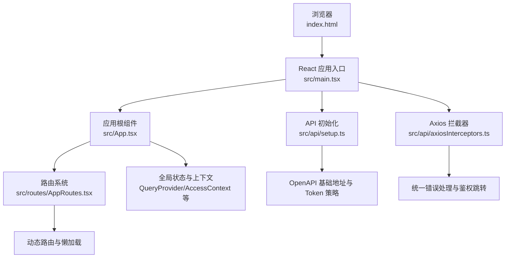
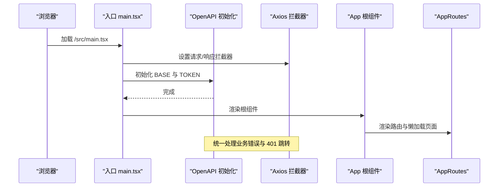
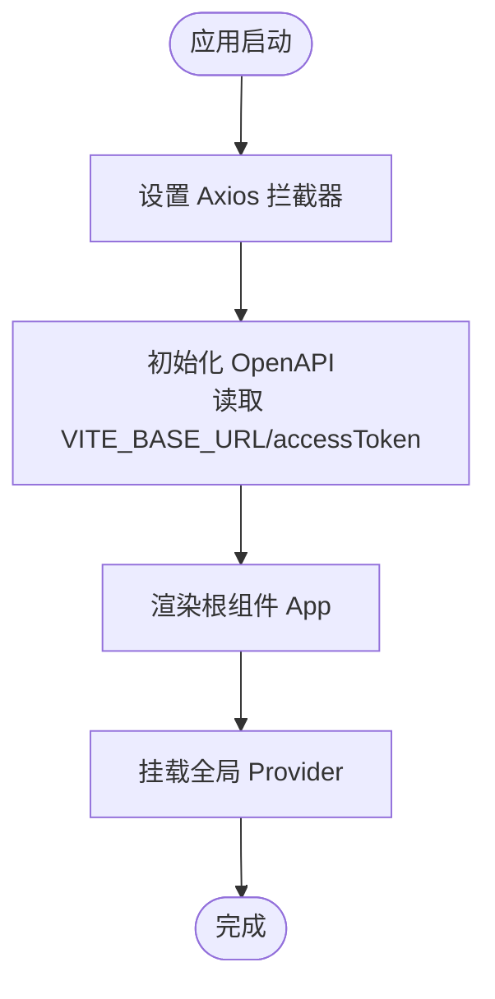
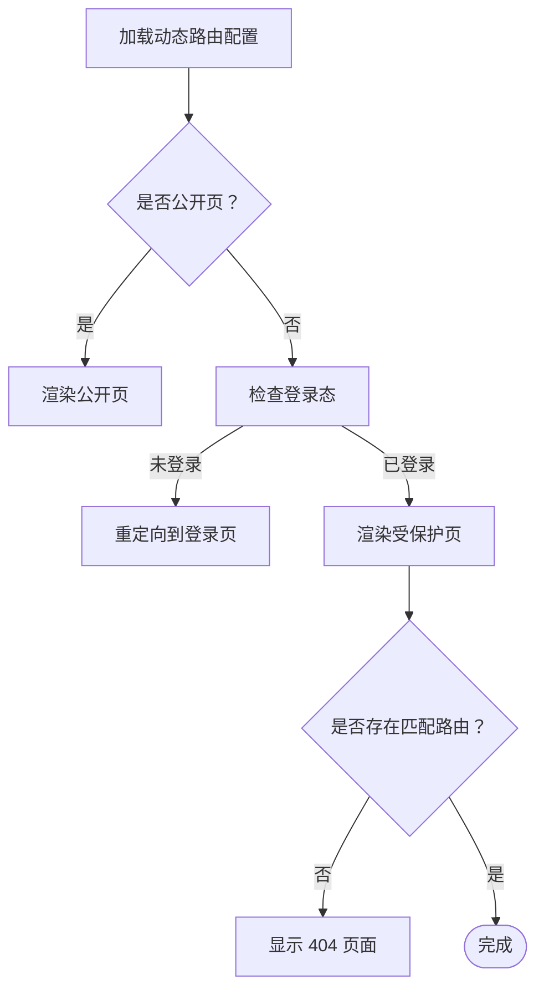
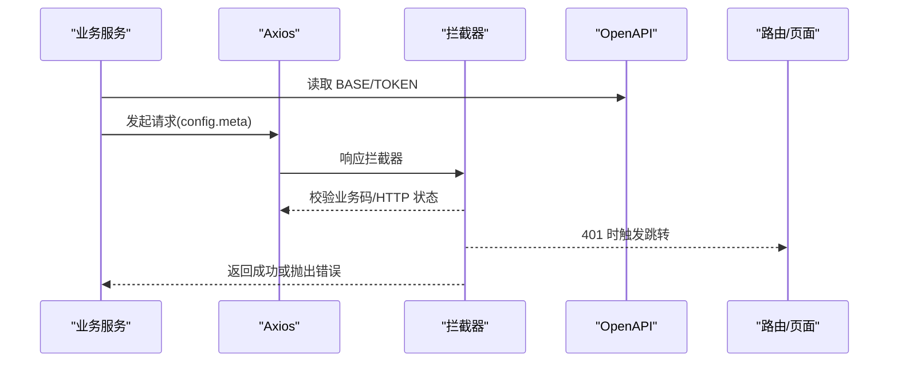

# 快速开始

<cite>
**本文引用的文件**
- [README.md](file://README.md)
- [package.json](file://package.json)
- [vite.config.ts](file://vite.config.ts)
- [.env.development](file://.env.development)
- [.env.production](file://.env.production)
- [src/main.tsx](file://src/main.tsx)
- [index.html](file://index.html)
- [tsconfig.json](file://tsconfig.json)
- [postcss.config.mjs](file://postcss.config.mjs)
- [components.json](file://components.json)
- [src/api/setup.ts](file://src/api/setup.ts)
- [src/App.tsx](file://src/App.tsx)
- [src/routes/AppRoutes.tsx](file://src/routes/AppRoutes.tsx)
- [src/api/axiosInterceptors.ts](file://src/api/axiosInterceptors.ts)
- [implementation_plan.md](file://implementation_plan.md)
- [scripts/sync-permissions.ts](file://scripts/sync-permissions.ts)
- [src/modules/admin/vite.config.ts](file://src/modules/admin/vite.config.ts)
</cite>

## 目录
1. [简介](#简介)
2. [项目结构](#项目结构)
3. [核心组件](#核心组件)
4. [架构总览](#架构总览)
5. [详细组件分析](#详细组件分析)
6. [依赖分析](#依赖分析)
7. [性能考虑](#性能考虑)
8. [故障排查指南](#故障排查指南)
9. [结论](#结论)
10. [附录](#附录)

## 简介
本指南面向新手开发者，帮助你在本地快速搭建并运行 zTorrent-site 前端项目。内容涵盖环境准备、依赖安装、环境变量配置、开发服务器启动以及生产构建流程，并提供常见问题排查与解决方案，确保你能顺利进入开发。

## 项目结构
该项目基于 Vite + React 19 构建，采用模块化组织与动态路由体系，配合权限与 API SDK 自动生成机制，形成前后端分离的开发体验。

图表来源
- [index.html](file://index.html#L1-L31)
- [src/main.tsx](file://src/main.tsx#L1-L18)
- [src/App.tsx](file://src/App.tsx#L1-L52)
- [src/routes/AppRoutes.tsx](file://src/routes/AppRoutes.tsx#L1-L115)
- [src/api/setup.ts](file://src/api/setup.ts#L1-L35)
- [src/api/axiosInterceptors.ts](file://src/api/axiosInterceptors.ts#L1-L294)

章节来源
- [README.md](file://README.md#L1-L11)
- [package.json](file://package.json#L126-L139)
- [vite.config.ts](file://vite.config.ts#L1-L86)
- [tsconfig.json](file://tsconfig.json#L1-L44)

## 核心组件
- 应用入口与初始化
  - 入口文件负责初始化 API 基础地址与令牌策略、设置 Axios 拦截器、挂载全局 Provider 与根组件。
  - 关键路径参考：[src/main.tsx](file://src/main.tsx#L1-L18)、[src/api/setup.ts](file://src/api/setup.ts#L1-L35)、[src/api/axiosInterceptors.ts](file://src/api/axiosInterceptors.ts#L1-L294)、[src/App.tsx](file://src/App.tsx#L1-L52)。
- 路由系统
  - 使用 React Router 与动态路由加载，支持公开页与受保护页分流，内置 404 回退与登录态判定。
  - 关键路径参考：[src/routes/AppRoutes.tsx](file://src/routes/AppRoutes.tsx#L1-L115)。
- 构建与开发配置
  - Vite 提供热更新、代理转发、别名解析与打包优化；TypeScript、TailwindCSS、PostCSS 配置完善。
  - 关键路径参考：[vite.config.ts](file://vite.config.ts#L1-L86)、[tsconfig.json](file://tsconfig.json#L1-L44)、[postcss.config.mjs](file://postcss.config.mjs#L1-L6)、[components.json](file://components.json#L1-L23)。

章节来源
- [src/main.tsx](file://src/main.tsx#L1-L18)
- [src/App.tsx](file://src/App.tsx#L1-L52)
- [src/routes/AppRoutes.tsx](file://src/routes/AppRoutes.tsx#L1-L115)
- [src/api/setup.ts](file://src/api/setup.ts#L1-L35)
- [src/api/axiosInterceptors.ts](file://src/api/axiosInterceptors.ts#L1-L294)
- [vite.config.ts](file://vite.config.ts#L1-L86)
- [tsconfig.json](file://tsconfig.json#L1-L44)
- [postcss.config.mjs](file://postcss.config.mjs#L1-L6)
- [components.json](file://components.json#L1-L23)

## 架构总览
前端采用“入口初始化 → 路由系统 → 动态模块加载”的结构，API 通过 OpenAPI 统一基地址与令牌注入，Axios 拦截器统一处理业务错误与鉴权失效跳转。

图表来源
- [src/main.tsx](file://src/main.tsx#L1-L18)
- [src/api/setup.ts](file://src/api/setup.ts#L1-L35)
- [src/api/axiosInterceptors.ts](file://src/api/axiosInterceptors.ts#L1-L294)
- [src/App.tsx](file://src/App.tsx#L1-L52)
- [src/routes/AppRoutes.tsx](file://src/routes/AppRoutes.tsx#L1-L115)

## 详细组件分析

### 组件 A：入口与初始化链路
- 初始化顺序
  - 设置 Axios 拦截器，统一错误提示与 401 跳转。
  - 初始化 OpenAPI，读取 Vite 环境变量作为基础地址，注入访问令牌。
  - 渲染根组件，挂载全局 Provider（查询、权限、下载器等）。
- 关键要点
  - OpenAPI 基础地址去尾斜杠，避免路径拼接重复斜杠。
  - 令牌从 localStorage 读取，便于跨页面复用。
  - 仅初始化一次，避免热更或重复导入导致的配置污染。

图表来源
- [src/main.tsx](file://src/main.tsx#L1-L18)
- [src/api/setup.ts](file://src/api/setup.ts#L1-L35)
- [src/api/axiosInterceptors.ts](file://src/api/axiosInterceptors.ts#L1-L294)

章节来源
- [src/main.tsx](file://src/main.tsx#L1-L18)
- [src/api/setup.ts](file://src/api/setup.ts#L1-L35)
- [src/api/axiosInterceptors.ts](file://src/api/axiosInterceptors.ts#L1-L294)

### 组件 B：路由与权限控制
- 路由策略
  - 公开页：登录、注册、忘记密码，无需登录即可访问。
  - 受保护页：通过动态路由加载，结合权限路由组件进行访问控制。
  - 404 回退：未登录时重定向至登录页，已登录时展示 404 页面。
- 权限同步脚本
  - 支持扫描前端页面与按钮权限键，生成权限树并批量创建/更新后端权限记录。
  - 可通过环境变量配置后端地址与管理员令牌。

图表来源
- [src/routes/AppRoutes.tsx](file://src/routes/AppRoutes.tsx#L1-L115)
- [scripts/sync-permissions.ts](file://scripts/sync-permissions.ts#L1-L718)

章节来源
- [src/routes/AppRoutes.tsx](file://src/routes/AppRoutes.tsx#L1-L115)
- [scripts/sync-permissions.ts](file://scripts/sync-permissions.ts#L1-L718)

### 组件 C：API SDK 与拦截器
- OpenAPI 初始化
  - 从 Vite 环境变量读取基础地址，标准化去除尾斜杠。
  - 注入令牌读取策略，供 SDK 请求时携带认证信息。
- Axios 拦截器
  - 统一响应结构与业务错误码映射。
  - 自动处理 401 未授权：清除本地令牌、触发全局事件、跳转登录页。
  - 支持静默模式、跳过特定错误码、自定义错误消息等元数据配置。

图表来源
- [src/api/setup.ts](file://src/api/setup.ts#L1-L35)
- [src/api/axiosInterceptors.ts](file://src/api/axiosInterceptors.ts#L1-L294)

章节来源
- [src/api/setup.ts](file://src/api/setup.ts#L1-L35)
- [src/api/axiosInterceptors.ts](file://src/api/axiosInterceptors.ts#L1-L294)

## 依赖分析
- 运行时依赖
  - React 19、React Router、TanStack React Query、Axios、Zustand、TailwindCSS 生态等。
- 开发依赖
  - Vite、@vitejs/plugin-react、TypeScript、TailwindCSS、Prettier、ESLint、Rollup 可视化等。
- 脚本命令
  - dev/build：分别启动开发服务器与生产构建。
  - client:dev/server:dev：分别启动前端与后端开发（需后端已在本地 8890 端口运行）。
  - api:generate：拉取后端 OpenAPI 并生成前端 SDK。
  - permissions:sync：扫描前端权限并同步至后端。

章节来源
- [package.json](file://package.json#L5-L91)
- [package.json](file://package.json#L93-L125)
- [package.json](file://package.json#L126-L139)

## 性能考虑
- 代码分割与懒加载
  - 路由与页面均采用懒加载，减少首屏体积。
- 分包策略
  - 通过 Rollup 手动分包，将 React/Vendor、UI 组件、数据层、图表与工具库拆分，提升缓存命中率。
- 依赖预优化
  - Vite 优化依赖，避免重复打包。
- Source Map 与可视化
  - 构建开启 Source Map，可选开启打包可视化分析，便于定位体积瓶颈。

章节来源
- [vite.config.ts](file://vite.config.ts#L60-L80)

## 故障排查指南
- 无法访问后端接口
  - 确认后端已在本地 8890 端口运行。
  - 检查 Vite 代理配置是否正确转发 /api 与 /uploads。
  - 确认环境变量 VITE_BASE_URL 与代理目标一致。
  - 参考：[vite.config.ts](file://vite.config.ts#L46-L58)、[.env.development](file://.env.development#L1-L5)、[.env.production](file://.env.production#L1-L5)
- 登录后仍被重定向到登录页
  - 检查本地存储中是否存在 accessToken。
  - 确认拦截器未因 401 被强制跳转。
  - 参考：[src/api/axiosInterceptors.ts](file://src/api/axiosInterceptors.ts#L166-L192)
- 构建产物异常或体积过大
  - 检查手动分包配置与 chunkSizeWarningLimit。
  - 参考：[vite.config.ts](file://vite.config.ts#L60-L80)
- TypeScript 类型检查报错
  - 确认 tsconfig.json 的 include/exclude 与 types 配置。
  - 参考：[tsconfig.json](file://tsconfig.json#L1-L44)
- Tailwind/CSS 未生效
  - 确认 PostCSS 插件与 Tailwind 配置正确。
  - 参考：[postcss.config.mjs](file://postcss.config.mjs#L1-L6)、[components.json](file://components.json#L1-L23)

## 结论
按照本指南完成依赖安装、环境变量配置与开发服务器启动后，你将拥有一个可热更新、可代理转发、具备统一 API 策略与错误处理的前端开发环境。随后可根据需要执行生产构建或使用权限同步脚本对接后端权限体系。

## 附录

### 快速开始步骤
- 环境要求
  - Node.js 与包管理器（推荐 pnpm）。
  - 确保后端服务在本地 8890 端口可用。
- 安装依赖
  - 在项目根目录执行依赖安装命令。
  - 参考：[README.md](file://README.md#L8)
- 启动开发服务器
  - 运行开发命令，浏览器访问本地端口。
  - 参考：[README.md](file://README.md#L10)、[package.json](file://package.json#L126-L139)
- 环境变量配置
  - 开发与生产环境变量文件中包含基础地址与密钥示例，按需调整。
  - 参考：[.env.development](file://.env.development#L1-L5)、[.env.production](file://.env.production#L1-L5)
- 生成 API SDK
  - 在后端运行状态下，执行 SDK 生成脚本。
  - 参考：[package.json](file://package.json#L130)
- 权限同步（可选）
  - 配置后端地址与管理员令牌后运行权限同步脚本。
  - 参考：[scripts/sync-permissions.ts](file://scripts/sync-permissions.ts#L1-L718)
- 生产构建
  - 执行构建命令生成静态产物。
  - 参考：[package.json](file://package.json#L129)、[vite.config.ts](file://vite.config.ts#L60-L80)

### 开发与构建细节
- Vite 配置要点
  - 别名 @ 指向 src，端口 3000，代理 /api 与 /uploads 指向后端。
  - React Compiler 优化目标版本 19。
  - 参考：[vite.config.ts](file://vite.config.ts#L1-L86)
- Admin 子项目（可选）
  - 独立的 Vite 配置，端口 5174，代理 /api 指向同一后端。
  - 参考：[src/modules/admin/vite.config.ts](file://src/modules/admin/vite.config.ts#L1-L46)
- TypeScript 与样式
  - tsconfig.json 启用 bundler 模块解析与 JSX；Tailwind 与 PostCSS 配置完善。
  - 参考：[tsconfig.json](file://tsconfig.json#L1-L44)、[postcss.config.mjs](file://postcss.config.mjs#L1-L6)、[components.json](file://components.json#L1-L23)