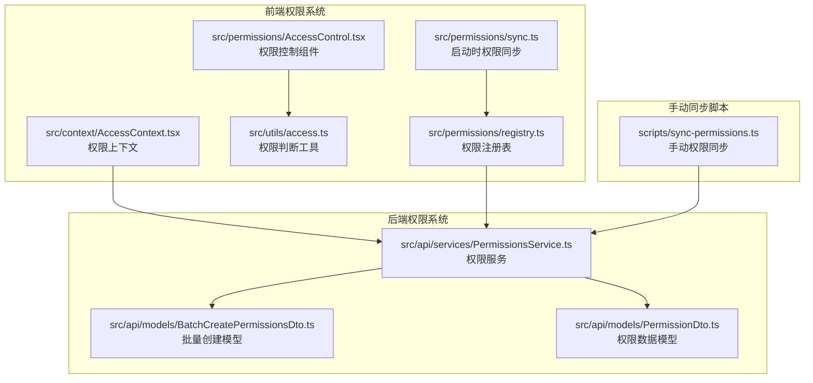
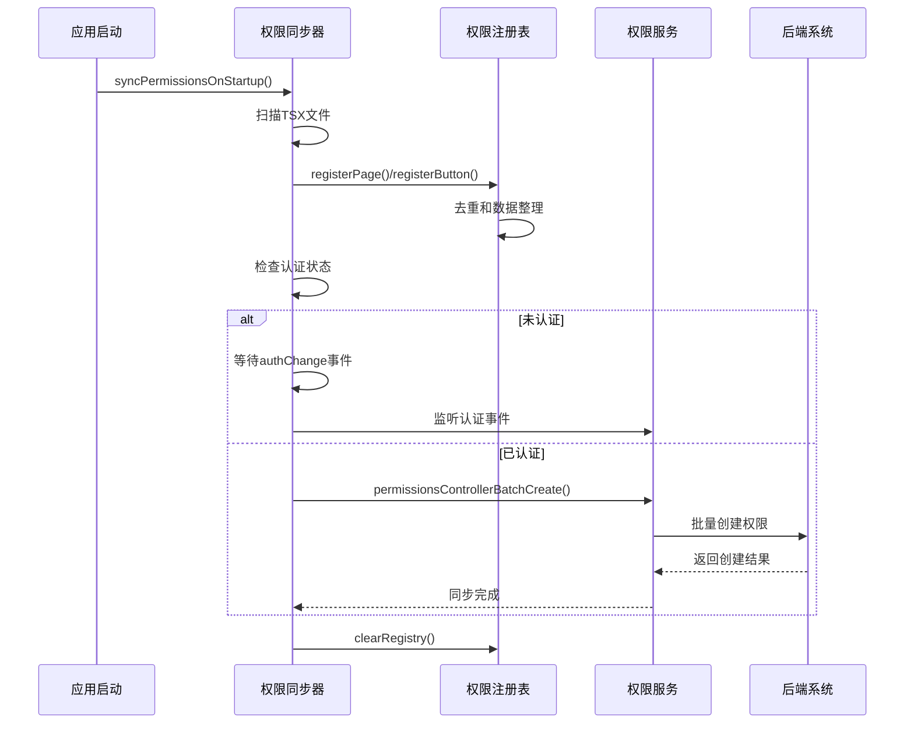
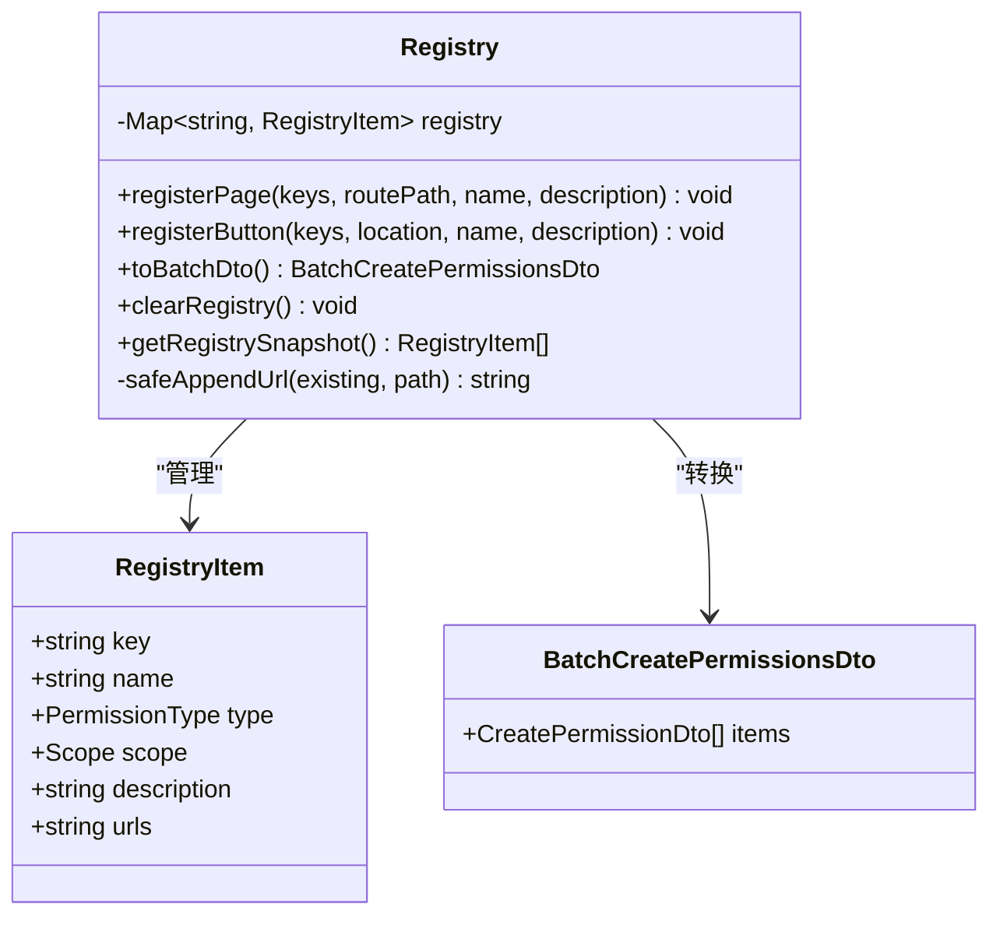
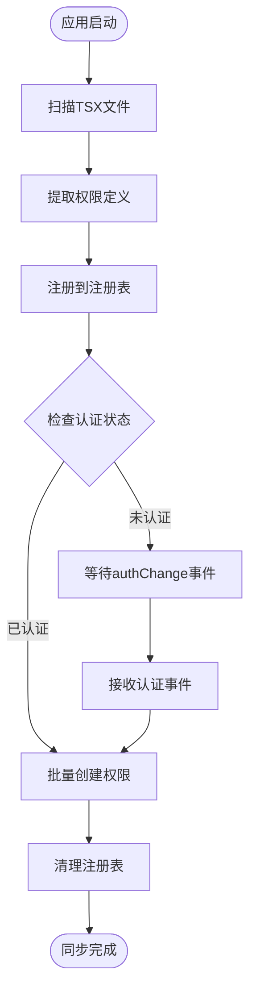
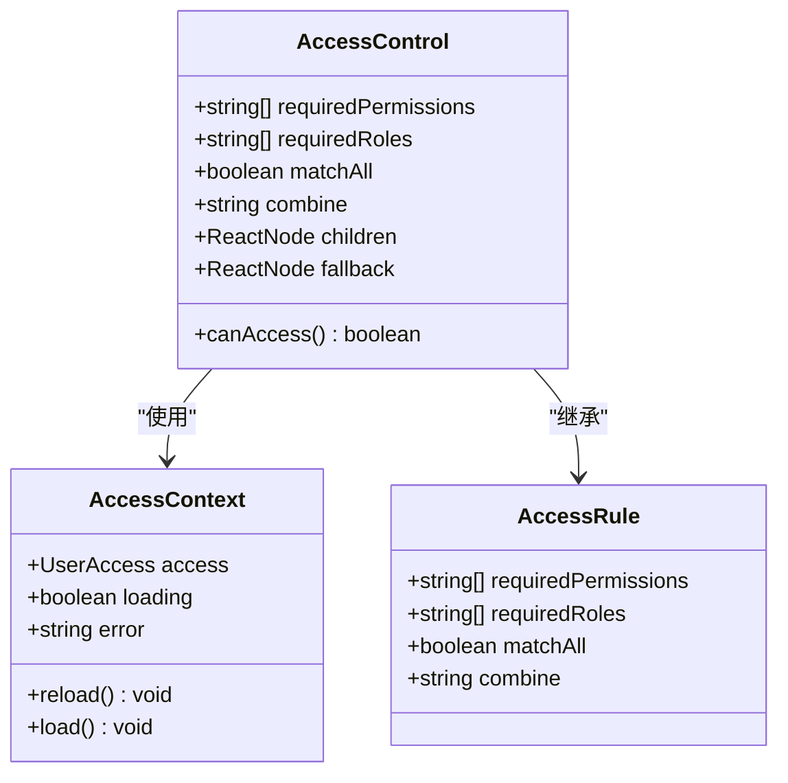
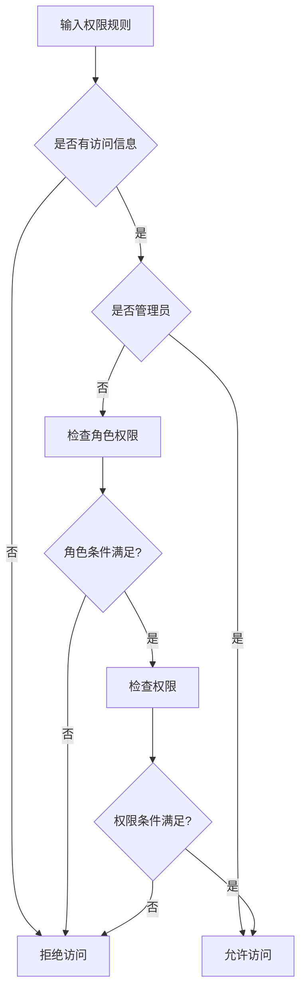
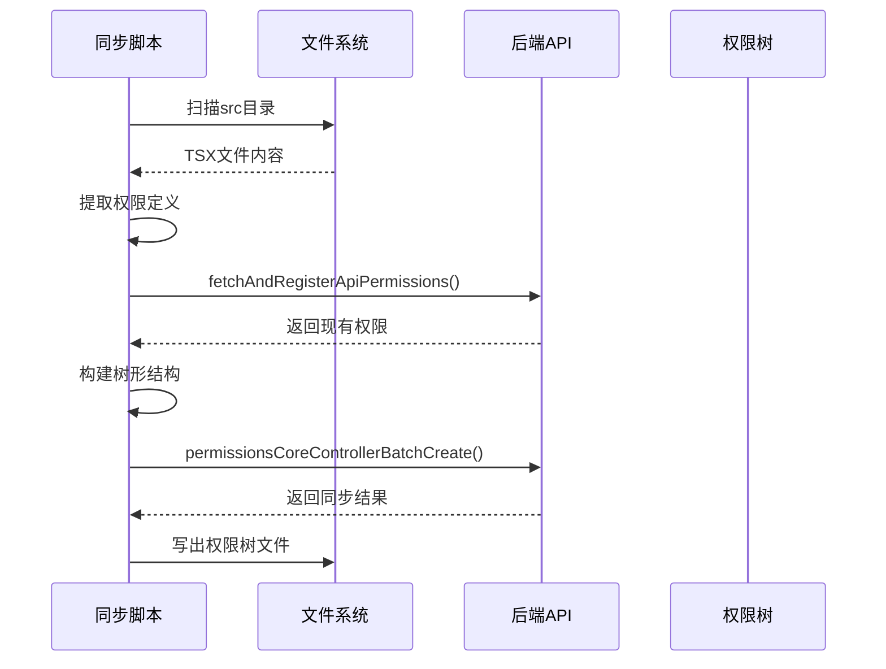
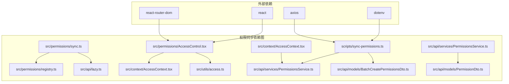
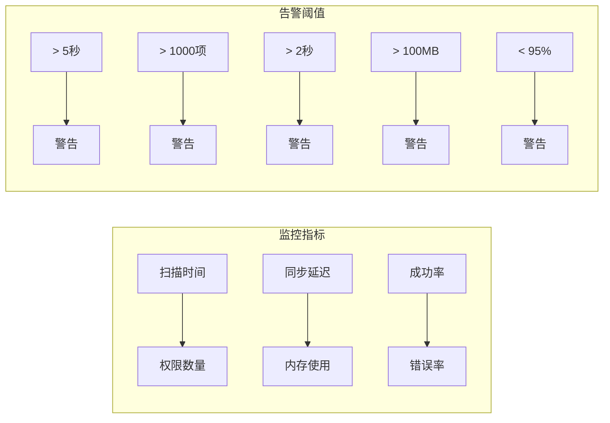

# 权限同步机制

<cite>
**本文档引用的文件**
- [src/permissions/sync.ts](file://src/permissions/sync.ts)
- [src/permissions/registry.ts](file://src/permissions/registry.ts)
- [src/permissions/AccessControl.tsx](file://src/permissions/AccessControl.tsx)
- [src/utils/access.ts](file://src/utils/access.ts)
- [src/context/AccessContext.tsx](file://src/context/AccessContext.tsx)
- [scripts/sync-permissions.ts](file://scripts/sync-permissions.ts)
- [src/api/services/PermissionsService.ts](file://src/api/services/PermissionsService.ts)
- [src/api/models/BatchCreatePermissionsDto.ts](file://src/api/models/BatchCreatePermissionsDto.ts)
- [src/api/models/PermissionDto.ts](file://src/api/models/PermissionDto.ts)
- [package.json](file://package.json)
</cite>

## 目录
1. [简介](#简介)
2. [项目结构](#项目结构)
3. [核心组件](#核心组件)
4. [架构概览](#架构概览)
5. [详细组件分析](#详细组件分析)
6. [依赖关系分析](#依赖关系分析)
7. [性能考虑](#性能考虑)
8. [故障排除指南](#故障排除指南)
9. [结论](#结论)

## 简介

权限同步机制是 zTorrent 站点中一个关键的安全基础设施，负责确保前端权限定义与后端权限系统保持一致。该机制通过自动化扫描、批量创建和实时更新来维护权限数据的完整性和准确性。

该系统主要包含两个层面的权限管理：
- **前端权限注册表**：在应用启动时扫描所有 TSX 文件，提取权限定义并进行去重管理
- **后端权限同步**：通过批量 API 将前端收集的权限信息同步到后端数据库

## 项目结构

权限同步相关的文件分布如下：



**图表来源**
- [src/permissions/sync.ts](file://src/permissions/sync.ts#L1-L159)
- [src/permissions/registry.ts](file://src/permissions/registry.ts#L1-L129)
- [src/permissions/AccessControl.tsx](file://src/permissions/AccessControl.tsx#L1-L43)
- [src/utils/access.ts](file://src/utils/access.ts#L1-L65)
- [src/context/AccessContext.tsx](file://src/context/AccessContext.tsx#L1-L181)
- [scripts/sync-permissions.ts](file://scripts/sync-permissions.ts#L1-L718)

**章节来源**
- [src/permissions/sync.ts](file://src/permissions/sync.ts#L1-L159)
- [src/permissions/registry.ts](file://src/permissions/registry.ts#L1-L129)
- [src/permissions/AccessControl.tsx](file://src/permissions/AccessControl.tsx#L1-L43)
- [src/utils/access.ts](file://src/utils/access.ts#L1-L65)
- [src/context/AccessContext.tsx](file://src/context/AccessContext.tsx#L1-L181)
- [scripts/sync-permissions.ts](file://scripts/sync-permissions.ts#L1-L718)

## 核心组件

### 权限注册表 (Registry)
权限注册表是整个权限同步系统的核心数据结构，负责收集、去重和管理所有权限定义。

**主要功能**：
- 收集页面权限和按钮权限
- 自动去重机制
- 批量创建数据结构转换
- 权限来源追踪

**数据结构**：
```typescript
type RegistryItem = {
  key: string;           // 权限唯一键
  name: string;          // 显示名称
  type: PermissionType;  // 权限类型 (PAGE/BUTTON/API)
  scope: Scope;          // 作用范围 (WEB/ADMIN)
  description?: string;  // 描述信息
  urls?: string;         // 关联URL（逗号分隔）
};
```

### 权限同步器 (Sync Manager)
负责在应用启动时执行权限扫描和同步操作。

**工作流程**：
1. 扫描所有 TSX 文件提取权限定义
2. 检查用户认证状态
3. 根据状态决定立即同步或等待认证
4. 调用后端批量创建接口

### 权限控制组件 (AccessControl)
提供基于权限的组件级访问控制。

**核心特性**：
- 支持角色权限和普通权限的组合判断
- 支持多种匹配策略（AND/OR、matchAll）
- 提供回退机制（fallback）

**章节来源**
- [src/permissions/registry.ts](file://src/permissions/registry.ts#L1-L129)
- [src/permissions/sync.ts](file://src/permissions/sync.ts#L1-L159)
- [src/permissions/AccessControl.tsx](file://src/permissions/AccessControl.tsx#L1-L43)

## 架构概览



**图表来源**
- [src/permissions/sync.ts](file://src/permissions/sync.ts#L17-L38)
- [src/permissions/registry.ts](file://src/permissions/registry.ts#L89-L101)
- [src/api/services/PermissionsService.ts](file://src/api/services/PermissionsService.ts#L83-L102)

## 详细组件分析

### 权限注册表组件分析



**图表来源**
- [src/permissions/registry.ts](file://src/permissions/registry.ts#L18-L25)
- [src/permissions/registry.ts](file://src/permissions/registry.ts#L89-L101)

**注册表工作原理**：
1. **去重机制**：使用 Map 以权限 key 为唯一索引
2. **数据合并**：相同 key 的多次注册会合并属性
3. **URL 追踪**：支持为同一权限添加多个关联 URL
4. **批量转换**：将内部结构转换为后端 API 所需格式

### 权限同步器组件分析



**图表来源**
- [src/permissions/sync.ts](file://src/permissions/sync.ts#L74-L115)
- [src/permissions/sync.ts](file://src/permissions/sync.ts#L43-L64)

**同步流程细节**：
1. **文件扫描**：使用 Vite 的 import.meta.glob 进行静态扫描
2. **权限提取**：通过正则表达式提取 PermissionRoute、AccessControl、canAccess 的 requiredPermissions
3. **路由关联**：尽量就近匹配 Route path 作为页面权限的 urls 字段
4. **认证检查**：检查 localStorage 中的 accessToken
5. **事件监听**：未认证时监听 window.authChange 事件

### 权限控制组件分析



**图表来源**
- [src/permissions/AccessControl.tsx](file://src/permissions/AccessControl.tsx#L5-L11)
- [src/context/AccessContext.tsx](file://src/context/AccessContext.tsx#L44-L49)
- [src/utils/access.ts](file://src/utils/access.ts#L9-L14)

**权限判断算法**：


**图表来源**
- [src/utils/access.ts](file://src/utils/access.ts#L16-L63)

### 手动同步脚本分析



**图表来源**
- [scripts/sync-permissions.ts](file://scripts/sync-permissions.ts#L62-L99)
- [scripts/sync-permissions.ts](file://scripts/sync-permissions.ts#L218-L260)

**手动同步特性**：
1. **环境配置**：支持 API_BASE_URL 和 ACCESS_TOKEN 环境变量
2. **路由解析**：解析 AppRoutes.tsx 和 forumRoutes.tsx
3. **服务索引**：自动构建 API 服务方法索引
4. **权限树生成**：输出 permissions-tree.json 文件
5. **错误处理**：完善的异常捕获和日志记录

**章节来源**
- [src/permissions/registry.ts](file://src/permissions/registry.ts#L36-L83)
- [src/permissions/sync.ts](file://src/permissions/sync.ts#L17-L64)
- [src/permissions/AccessControl.tsx](file://src/permissions/AccessControl.tsx#L17-L42)
- [src/utils/access.ts](file://src/utils/access.ts#L16-L63)
- [scripts/sync-permissions.ts](file://scripts/sync-permissions.ts#L62-L260)

## 依赖关系分析



**图表来源**
- [src/permissions/sync.ts](file://src/permissions/sync.ts#L11-L12)
- [src/permissions/AccessControl.tsx](file://src/permissions/AccessControl.tsx#L1-L3)
- [scripts/sync-permissions.ts](file://scripts/sync-permissions.ts#L22-L28)
- [src/context/AccessContext.tsx](file://src/context/AccessContext.tsx#L1-L2)

**依赖特点**：
- **低耦合设计**：各组件职责明确，依赖关系清晰
- **懒加载机制**：使用动态 import 避免循环依赖
- **类型安全**：完整的 TypeScript 类型定义
- **模块化架构**：支持独立的功能模块开发

**章节来源**
- [src/permissions/sync.ts](file://src/permissions/sync.ts#L11-L12)
- [src/permissions/AccessControl.tsx](file://src/permissions/AccessControl.tsx#L1-L3)
- [scripts/sync-permissions.ts](file://scripts/sync-permissions.ts#L22-L28)
- [src/context/AccessContext.tsx](file://src/context/AccessContext.tsx#L1-L2)

## 性能考虑

### 扫描优化策略

1. **静态扫描**：使用 Vite 的 import.meta.glob 进行编译时静态分析
2. **文件过滤**：只扫描 .tsx 文件，避免不必要的文件处理
3. **正则优化**：使用高效的正则表达式模式匹配
4. **内存管理**：及时清理注册表，避免内存泄漏

### 同步性能指标

| 指标类型 | 目标值 | 测量方法 |
|---------|--------|----------|
| 扫描时间 | < 5秒 | 记录文件扫描开始和结束时间 |
| 权限数量 | < 1000项 | 统计注册表中的权限条目数 |
| 同步延迟 | < 2秒 | 记录批量创建接口响应时间 |
| 内存使用 | < 100MB | 监控进程内存使用情况 |

### 缓存策略

当前实现采用以下缓存策略：
- **注册表缓存**：内存中的 Map 结构存储权限定义
- **查询缓存**：AccessContext 中的权限数据缓存
- **配置缓存**：环境变量和配置信息的缓存

## 故障排除指南

### 常见问题及解决方案

**问题1：权限同步失败**
- **症状**：控制台出现 "[permissions-sync] 批量创建接口调用失败"
- **原因**：网络连接问题或后端服务不可用
- **解决方案**：检查 API 地址配置，确认网络连接正常

**问题2：权限未生效**
- **症状**：界面权限控制不正确
- **原因**：权限数据未正确加载或缓存问题
- **解决方案**：刷新页面，检查 AccessContext 的加载状态

**问题3：手动同步脚本报错**
- **症状**：运行 npm run permissions:sync 报错
- **原因**：缺少必要的环境变量或文件权限问题
- **解决方案**：检查 .env 文件配置，确认文件读取权限

### 调试方法

1. **启用详细日志**：在控制台中查看详细的同步过程日志
2. **检查注册表快照**：使用 `getRegistrySnapshot()` 方法查看当前权限状态
3. **验证 API 响应**：检查后端接口的响应数据格式
4. **网络监控**：使用浏览器开发者工具监控网络请求

### 性能监控指标



**章节来源**
- [src/permissions/sync.ts](file://src/permissions/sync.ts#L35-L37)
- [src/permissions/registry.ts](file://src/permissions/registry.ts#L113-L115)
- [src/context/AccessContext.tsx](file://src/context/AccessContext.tsx#L157-L165)

## 结论

权限同步机制通过精心设计的架构实现了前端权限数据与后端系统的高效同步。该系统具有以下优势：

1. **自动化程度高**：通过文件扫描和批量创建减少人工干预
2. **实时性强**：支持认证事件驱动的权限更新
3. **扩展性好**：模块化设计支持功能扩展和维护
4. **可靠性高**：完善的错误处理和日志记录机制

未来可以考虑的改进方向：
- 实现增量更新机制，减少不必要的全量同步
- 添加权限版本管理，支持权限变更追踪
- 优化性能监控，提供更详细的性能指标
- 增强缓存管理，提高系统响应速度

该权限同步机制为 zTorrent 站点提供了坚实的安全基础，确保了权限管理的准确性和一致性。