# 权限控制系统

<cite>
**本文档引用的文件**
- [src/permissions/AccessControl.tsx](file://src/permissions/AccessControl.tsx)
- [src/permissions/registry.ts](file://src/permissions/registry.ts)
- [src/permissions/sync.ts](file://src/permissions/sync.ts)
- [src/context/AccessContext.tsx](file://src/context/AccessContext.tsx)
- [src/utils/access.ts](file://src/utils/access.ts)
- [src/routes/guards.tsx](file://src/routes/guards.tsx)
- [src/routes/DynamicRoutes.tsx](file://src/routes/DynamicRoutes.tsx)
- [src/types/routeConfig.ts](file://src/types/routeConfig.ts)
- [scripts/sync-permissions.ts](file://scripts/sync-permissions.ts)
- [docs/dev/dynamic-routes-api.md](file://docs/dev/dynamic-routes-api.md)
- [package.json](file://package.json)
</cite>

## 目录
1. [简介](#简介)
2. [项目结构](#项目结构)
3. [核心组件](#核心组件)
4. [架构总览](#架构总览)
5. [详细组件分析](#详细组件分析)
6. [依赖关系分析](#依赖关系分析)
7. [性能考量](#性能考量)
8. [故障排查指南](#故障排查指南)
9. [结论](#结论)
10. [附录](#附录)

## 简介
本权限控制系统采用前端驱动的权限模型，结合基于角色的访问控制（RBAC）与动态权限配置，实现页面级与按钮级的细粒度权限控制。系统通过权限注册表收集应用中的权限键，利用启动时扫描与手动同步脚本将权限同步至后端，形成统一的权限树。运行时通过路由守卫与访问控制组件实现权限校验与界面元素的显示/隐藏控制。

## 项目结构
权限系统主要分布在以下模块：
- 权限注册与同步：src/permissions/*
- 权限上下文与访问控制：src/context/*, src/utils/access.ts
- 路由与守卫：src/routes/*
- 类型定义：src/types/routeConfig.ts
- 动态路由与后端对接：docs/dev/dynamic-routes-api.md
- 同步脚本：scripts/sync-permissions.ts
- 项目脚本：package.json

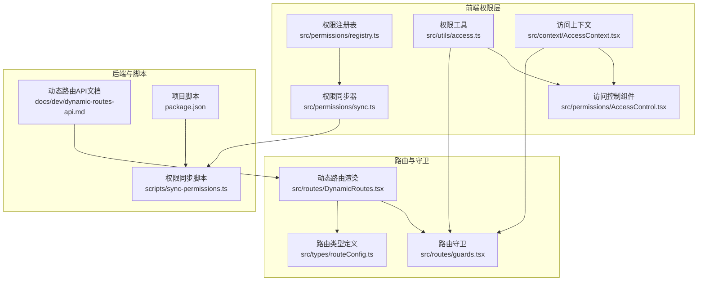

**图表来源**
- [src/permissions/registry.ts](file://src/permissions/registry.ts#L1-L129)
- [src/permissions/sync.ts](file://src/permissions/sync.ts#L1-L159)
- [src/permissions/AccessControl.tsx](file://src/permissions/AccessControl.tsx#L1-L43)
- [src/utils/access.ts](file://src/utils/access.ts#L1-L65)
- [src/context/AccessContext.tsx](file://src/context/AccessContext.tsx#L1-L181)
- [src/routes/guards.tsx](file://src/routes/guards.tsx#L1-L103)
- [src/routes/DynamicRoutes.tsx](file://src/routes/DynamicRoutes.tsx#L1-L308)
- [src/types/routeConfig.ts](file://src/types/routeConfig.ts#L1-L49)
- [scripts/sync-permissions.ts](file://scripts/sync-permissions.ts#L1-L718)
- [docs/dev/dynamic-routes-api.md](file://docs/dev/dynamic-routes-api.md#L1-L127)
- [package.json](file://package.json#L126-L139)

**章节来源**
- [src/permissions/registry.ts](file://src/permissions/registry.ts#L1-L129)
- [src/permissions/sync.ts](file://src/permissions/sync.ts#L1-L159)
- [src/permissions/AccessControl.tsx](file://src/permissions/AccessControl.tsx#L1-L43)
- [src/utils/access.ts](file://src/utils/access.ts#L1-L65)
- [src/context/AccessContext.tsx](file://src/context/AccessContext.tsx#L1-L181)
- [src/routes/guards.tsx](file://src/routes/guards.tsx#L1-L103)
- [src/routes/DynamicRoutes.tsx](file://src/routes/DynamicRoutes.tsx#L1-L308)
- [src/types/routeConfig.ts](file://src/types/routeConfig.ts#L1-L49)
- [scripts/sync-permissions.ts](file://scripts/sync-permissions.ts#L1-L718)
- [docs/dev/dynamic-routes-api.md](file://docs/dev/dynamic-routes-api.md#L1-L127)
- [package.json](file://package.json#L126-L139)

## 核心组件
- 权限注册表：收集页面与按钮权限键，去重并导出批量创建参数。
- 权限同步器：启动时扫描TSX文件提取权限键并批量创建/更新后端权限树。
- 访问上下文：拉取用户资料与聚合权限，提供全局权限状态与重载能力。
- 权限工具：提供通用canAccess判断逻辑，支持角色与权限的组合策略。
- 路由守卫：基于后端权限字符的高级守卫，支持AND/OR组合与管理员放行。
- 访问控制组件：在UI层面根据权限决定渲染子组件或回退元素。
- 动态路由：根据后端返回的路由树动态渲染，支持布局包装与重定向。

**章节来源**
- [src/permissions/registry.ts](file://src/permissions/registry.ts#L1-L129)
- [src/permissions/sync.ts](file://src/permissions/sync.ts#L1-L159)
- [src/context/AccessContext.tsx](file://src/context/AccessContext.tsx#L1-L181)
- [src/utils/access.ts](file://src/utils/access.ts#L1-L65)
- [src/routes/guards.tsx](file://src/routes/guards.tsx#L1-L103)
- [src/permissions/AccessControl.tsx](file://src/permissions/AccessControl.tsx#L1-L43)
- [src/routes/DynamicRoutes.tsx](file://src/routes/DynamicRoutes.tsx#L1-L308)

## 架构总览
权限系统采用“前端注册 + 后端聚合”的双轨模式：
- 前端侧：通过注册表与同步器在启动时扫描并批量创建权限，形成统一的权限树。
- 运行时侧：通过访问上下文获取聚合权限，配合路由守卫与访问控制组件实现权限校验与UI控制。

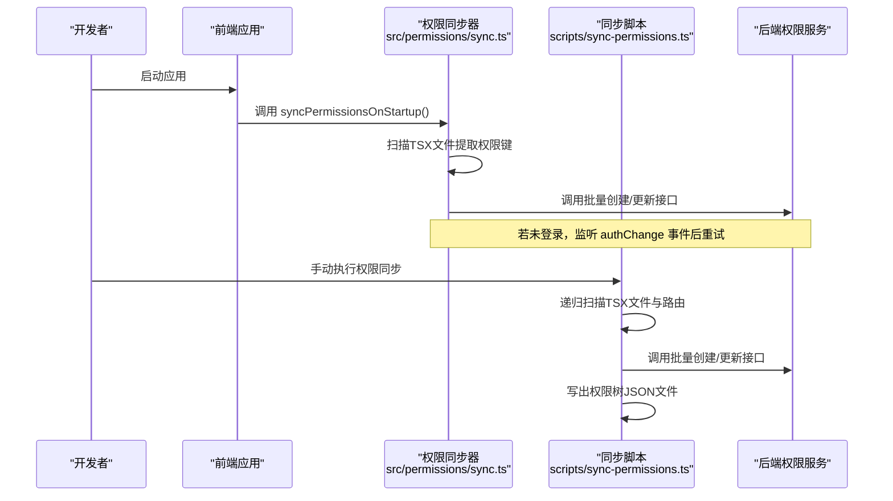

**图表来源**
- [src/permissions/sync.ts](file://src/permissions/sync.ts#L17-L64)
- [scripts/sync-permissions.ts](file://scripts/sync-permissions.ts#L62-L99)

**章节来源**
- [src/permissions/sync.ts](file://src/permissions/sync.ts#L1-L159)
- [scripts/sync-permissions.ts](file://scripts/sync-permissions.ts#L1-L718)

## 详细组件分析

### 权限注册表（registry）
- 职责：在应用启动或扫描阶段收集页面/按钮权限键，统一去重与整形为批量创建接口所需的参数。
- 关键特性：
  - 使用Map以权限key为唯一索引，避免重复插入。
  - 支持页面类型记录路由path，便于后端构建权限树或反查来源。
  - 提供toBatchDto导出批量创建参数，clearRegistry清空注册表，getRegistrySnapshot用于调试。
- 数据结构：RegistryItem包含key、name、type、scope、description、urls字段。

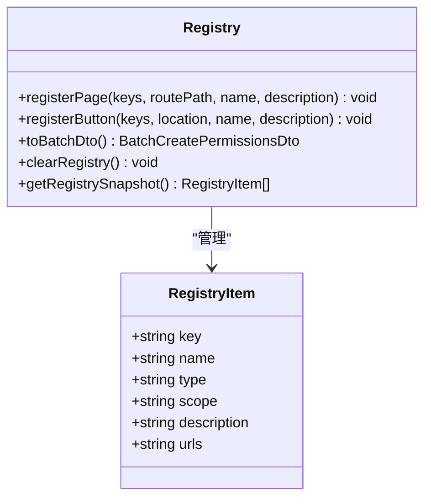

**图表来源**
- [src/permissions/registry.ts](file://src/permissions/registry.ts#L18-L101)

**章节来源**
- [src/permissions/registry.ts](file://src/permissions/registry.ts#L1-L129)

### 权限同步器（sync）
- 职责：启动时扫描TSX文件提取权限键，构造批量创建DTO并调用后端接口；若未登录则监听authChange事件后重试。
- 关键算法：
  - 使用import.meta.glob以原始文本方式读取TSX文件。
  - 正则匹配PermissionRoute、AccessControl、canAccess调用，提取requiredPermissions数组。
  - 路由path尽量就近匹配<Route path="...">，用于页面权限的urls字段。
  - 去重后构造BatchCreatePermissionsDto，调用后端接口。
- 异常处理：捕获扫描与网络异常，最终清空注册表避免重复触发。

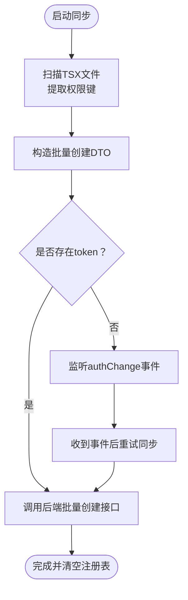

**图表来源**
- [src/permissions/sync.ts](file://src/permissions/sync.ts#L17-L64)

**章节来源**
- [src/permissions/sync.ts](file://src/permissions/sync.ts#L1-L159)

### 访问上下文（AccessContext）
- 职责：全局管理用户认证状态、角色与权限信息，提供load/reload能力与useAccess Hook。
- 关键流程：
  - 并行请求用户资料与聚合权限，优先使用聚合接口返回的权限，失败时回退到资料接口。
  - 监听自定义authChange事件，在登录/登出时自动重新加载。
  - 解析JWT token中的用户名用于显示（仅显示用途）。
- 状态：access（roles、permissions、username、avatar）、loading、error、reload。

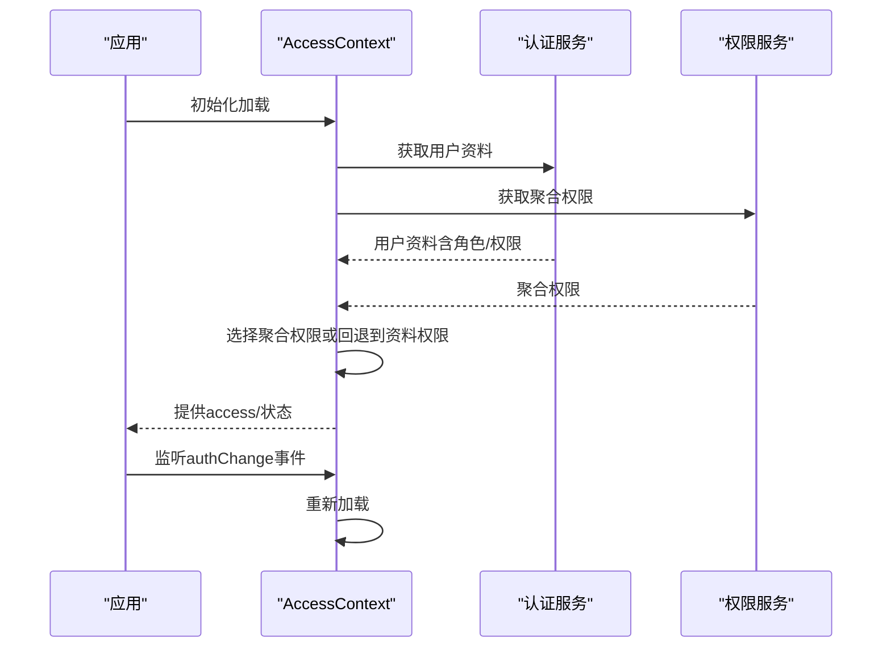

**图表来源**
- [src/context/AccessContext.tsx](file://src/context/AccessContext.tsx#L83-L155)

**章节来源**
- [src/context/AccessContext.tsx](file://src/context/AccessContext.tsx#L1-L181)

### 权限工具（access）
- 职责：提供通用canAccess判断逻辑，支持角色与权限的matchAll与combine策略。
- 策略说明：
  - matchAll：组内是否需要全部匹配（默认true）。
  - combine：角色组与权限组之间的关系（默认AND，支持OR）。
  - 超级放行：当username为admin时直接通过。
- 适用场景：导航、按钮等UI层面的显示/隐藏控制。

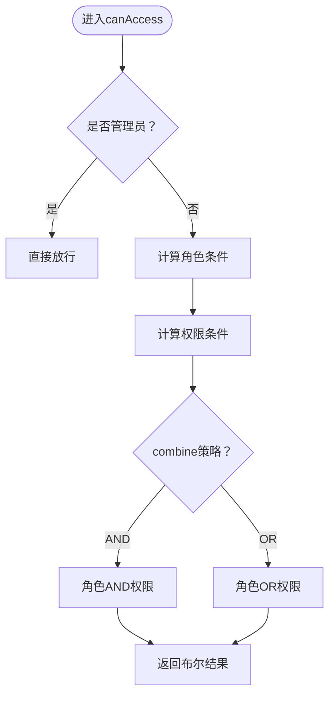

**图表来源**
- [src/utils/access.ts](file://src/utils/access.ts#L16-L63)

**章节来源**
- [src/utils/access.ts](file://src/utils/access.ts#L1-L65)

### 路由守卫（guards）
- 职责：提供AuthRoute与PermissionRoute，前者仅判断登录态，后者基于后端权限字符进行高级守卫。
- 关键逻辑：
  - 登录态检查：未登录重定向至/login。
  - 权限检查：支持requiredPermissions、requiredRoles、matchAll、combine。
  - 管理员放行：username为admin时直接通过。
  - 加载态处理：权限加载中显示加载提示。
  - 日志输出：便于调试与审计。

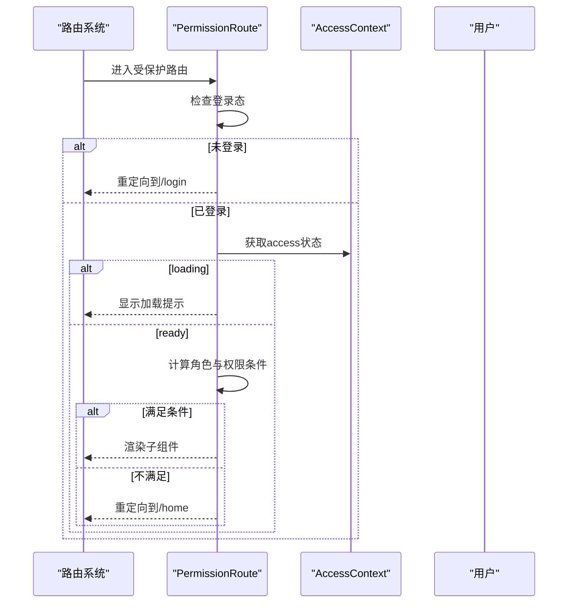

**图表来源**
- [src/routes/guards.tsx](file://src/routes/guards.tsx#L20-L102)

**章节来源**
- [src/routes/guards.tsx](file://src/routes/guards.tsx#L1-L103)

### 访问控制组件（AccessControl）
- 职责：在UI层面根据用户权限与角色决定是否渲染子组件，支持fallback与name标识。
- 关键行为：
  - 读取AccessContext中的access与loading状态。
  - 调用canAccess进行权限判断。
  - 权限不足时渲染fallback，满足条件时渲染children。

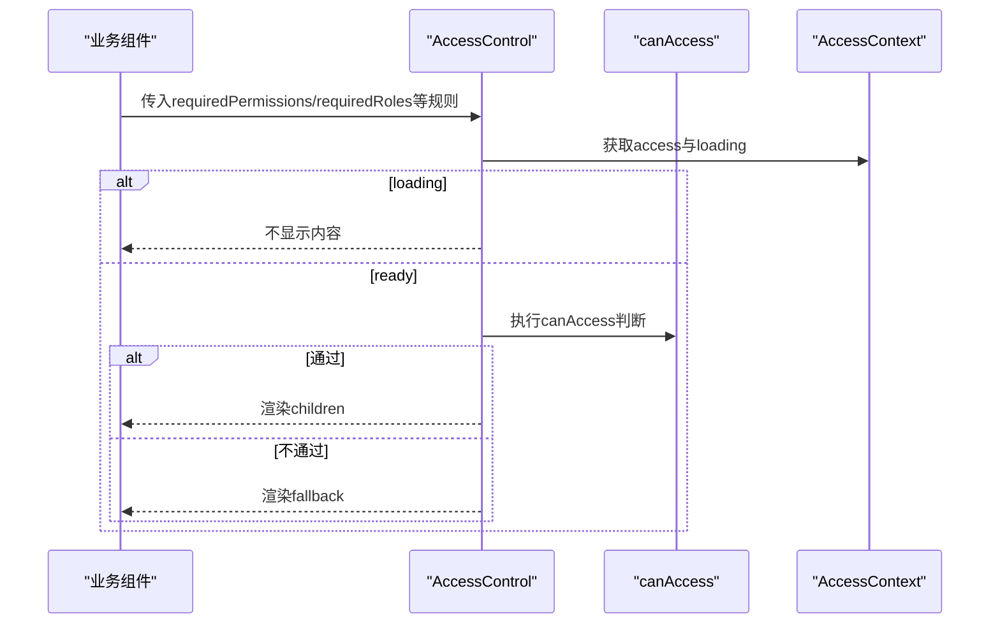

**图表来源**
- [src/permissions/AccessControl.tsx](file://src/permissions/AccessControl.tsx#L17-L42)
- [src/utils/access.ts](file://src/utils/access.ts#L16-L63)
- [src/context/AccessContext.tsx](file://src/context/AccessContext.tsx#L25-L28)

**章节来源**
- [src/permissions/AccessControl.tsx](file://src/permissions/AccessControl.tsx#L1-L43)
- [src/utils/access.ts](file://src/utils/access.ts#L1-L65)
- [src/context/AccessContext.tsx](file://src/context/AccessContext.tsx#L1-L181)

### 动态路由与后端集成
- 动态路由：根据后端返回的路由树动态渲染，支持布局包装、索引路由、重定向与404处理。
- 后端对接：遵循动态路由API文档，用户路由接口返回过滤后的路由树，管理员可见所有启用路由。
- 类型定义：RouteConfig包含id、path、component、layout、permissions、children等字段。

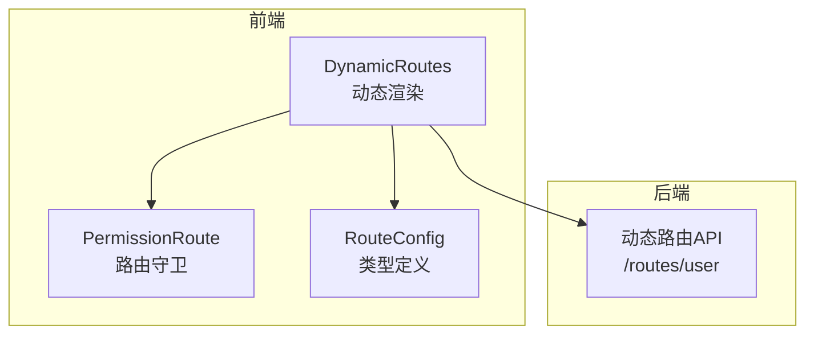

**图表来源**
- [src/routes/DynamicRoutes.tsx](file://src/routes/DynamicRoutes.tsx#L53-L249)
- [docs/dev/dynamic-routes-api.md](file://docs/dev/dynamic-routes-api.md#L16-L58)
- [src/types/routeConfig.ts](file://src/types/routeConfig.ts#L14-L41)

**章节来源**
- [src/routes/DynamicRoutes.tsx](file://src/routes/DynamicRoutes.tsx#L1-L308)
- [docs/dev/dynamic-routes-api.md](file://docs/dev/dynamic-routes-api.md#L1-L127)
- [src/types/routeConfig.ts](file://src/types/routeConfig.ts#L1-L49)

### 手动同步脚本（sync-permissions）
- 职责：在开发环境中手动执行权限同步，递归扫描src目录下的TSX文件，提取页面与按钮权限键，构造树形结构并批量创建/更新后端权限树。
- 关键功能：
  - 扫描TSX文件与路由，提取PermissionRoute、AccessControl、canAccess中的requiredPermissions。
  - 构建页面-按钮-接口权限树，写出permissions-tree.json。
  - 从后端拉取API权限记录并合并到注册表。
  - 通过OpenAPI配置BASE与TOKEN，调用后端批量创建接口。

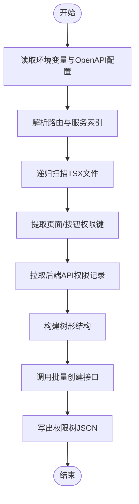

**图表来源**
- [scripts/sync-permissions.ts](file://scripts/sync-permissions.ts#L62-L99)
- [scripts/sync-permissions.ts](file://scripts/sync-permissions.ts#L574-L598)

**章节来源**
- [scripts/sync-permissions.ts](file://scripts/sync-permissions.ts#L1-L718)

## 依赖关系分析
- 组件耦合：
  - AccessControl依赖useAccess与canAccess，耦合度低，便于复用。
  - PermissionRoute依赖AccessContext与canAccess，提供路由级权限控制。
  - AccessContext并行加载用户资料与聚合权限，降低延迟。
- 外部依赖：
  - 后端动态路由API与权限服务接口。
  - OpenAPI客户端与axios用于HTTP通信。
- 循环依赖规避：
  - 通过懒加载getAuthService/getPermissionsService避免循环依赖。

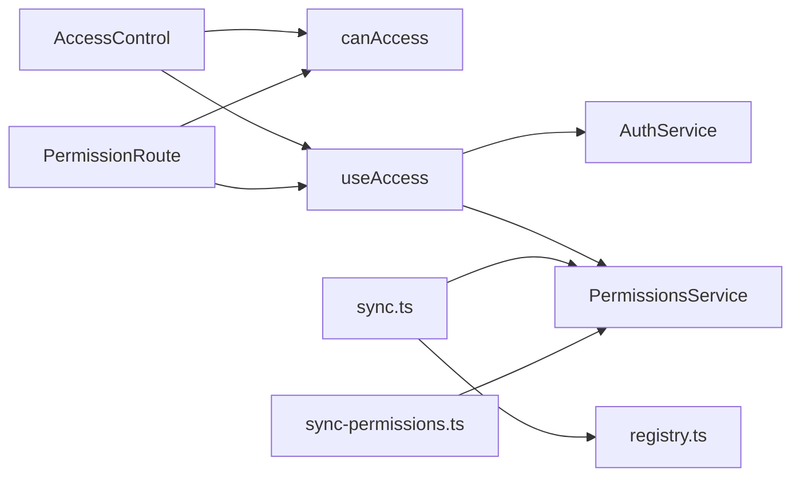

**图表来源**
- [src/permissions/AccessControl.tsx](file://src/permissions/AccessControl.tsx#L2-L3)
- [src/utils/access.ts](file://src/utils/access.ts#L16-L63)
- [src/context/AccessContext.tsx](file://src/context/AccessContext.tsx#L96-L99)
- [src/routes/guards.tsx](file://src/routes/guards.tsx#L38-L39)
- [src/permissions/sync.ts](file://src/permissions/sync.ts#L11-L12)
- [scripts/sync-permissions.ts](file://scripts/sync-permissions.ts#L25-L28)

**章节来源**
- [src/permissions/AccessControl.tsx](file://src/permissions/AccessControl.tsx#L1-L43)
- [src/utils/access.ts](file://src/utils/access.ts#L1-L65)
- [src/context/AccessContext.tsx](file://src/context/AccessContext.tsx#L1-L181)
- [src/routes/guards.tsx](file://src/routes/guards.tsx#L1-L103)
- [src/permissions/sync.ts](file://src/permissions/sync.ts#L1-L159)
- [scripts/sync-permissions.ts](file://scripts/sync-permissions.ts#L1-L718)

## 性能考量
- 并行加载：AccessContext中用户资料与聚合权限并行请求，减少首屏等待时间。
- 懒加载：权限服务与认证服务懒加载，避免初始包体积过大与循环依赖。
- 缓存策略：动态路由API文档指出用户路由树在Redis中缓存10分钟，后台修改后自动清理，降低频繁请求压力。
- 扫描优化：启动时使用import.meta.glob静态展开，减少运行时IO开销；手动同步脚本递归扫描，建议在CI中按需执行。

**章节来源**
- [src/context/AccessContext.tsx](file://src/context/AccessContext.tsx#L96-L105)
- [docs/dev/dynamic-routes-api.md](file://docs/dev/dynamic-routes-api.md#L8-L10)

## 故障排查指南
- 启动同步异常：
  - 现象：控制台打印“启动同步异常”警告。
  - 排查：检查localStorage中是否存在accessToken；若无，确认authChange事件是否正确触发；检查网络请求与后端接口状态。
- 批量创建接口失败：
  - 现象：控制台打印“批量创建接口调用失败”警告。
  - 排查：确认API_BASE_URL与ACCESS_TOKEN配置；检查OpenAPI.TOKEN设置；查看后端返回的响应结构。
- 权限不足重定向：
  - 现象：PermissionRoute在权限不足时重定向到/home。
  - 排查：检查requiredPermissions与requiredRoles配置；确认AccessContext中权限是否正确加载；查看日志输出。
- UI元素不显示：
  - 现象：AccessControl组件不渲染子元素。
  - 排查：确认canAccess规则与用户权限；检查loading状态；确认fallback配置。
- 路由未生效：
  - 现象：动态路由不显示或404。
  - 排查：确认后端返回的路由树中permissions字段与前端权限键一致；检查layout与component映射；确认isEnabled与isVisible配置。

**章节来源**
- [src/permissions/sync.ts](file://src/permissions/sync.ts#L35-L37)
- [src/permissions/sync.ts](file://src/permissions/sync.ts#L58-L60)
- [src/routes/guards.tsx](file://src/routes/guards.tsx#L95-L98)
- [src/permissions/AccessControl.tsx](file://src/permissions/AccessControl.tsx#L28-L29)
- [src/routes/DynamicRoutes.tsx](file://src/routes/DynamicRoutes.tsx#L289-L301)

## 结论
该权限控制系统通过前端注册与后端聚合相结合的方式，实现了灵活、可扩展的权限管理机制。权限注册表与同步器确保权限键的一致性与完整性，访问上下文与权限工具提供稳定的运行时权限判断，路由守卫与访问控制组件在界面层实现细粒度的权限控制。配合动态路由与后端API，系统能够高效地支持页面级与按钮级的权限管理，并具备良好的可维护性与可观测性。

## 附录

### 权限模型设计
- 权限类型：PAGE（页面）、BUTTON（按钮）、API（接口）。
- 权限范围：WEB（前端）、ADMIN（后台）。
- 权限键命名：页面权限通常以page:开头，按钮权限以具体资源与动作组合命名。
- 权限继承：通过权限树的父子关系实现继承，子节点自动继承父节点的权限。

**章节来源**
- [src/permissions/registry.ts](file://src/permissions/registry.ts#L18-L25)
- [scripts/sync-permissions.ts](file://scripts/sync-permissions.ts#L600-L638)

### 权限数据同步机制
- 启动同步：应用启动时扫描TSX文件，提取权限键并批量创建/更新后端权限树。
- 手动同步：开发环境下通过脚本递归扫描，构建树形结构并批量创建，同时写出权限树JSON文件。
- 后端拉取：脚本可从后端拉取现有API权限记录并合并到注册表。

**章节来源**
- [src/permissions/sync.ts](file://src/permissions/sync.ts#L17-L64)
- [scripts/sync-permissions.ts](file://scripts/sync-permissions.ts#L62-L99)
- [scripts/sync-permissions.ts](file://scripts/sync-permissions.ts#L218-L260)

### 实时权限更新流程
- 认证事件：监听window上的authChange事件，收到事件后重新加载权限。
- 权限刷新：AccessContext提供reload方法，可在登录/登出后主动刷新。
- 路由守卫：PermissionRoute在权限加载完成后重新评估访问权限。

**章节来源**
- [src/context/AccessContext.tsx](file://src/context/AccessContext.tsx#L157-L165)
- [src/context/AccessContext.tsx](file://src/context/AccessContext.tsx#L167-L171)
- [src/routes/guards.tsx](file://src/routes/guards.tsx#L157-L165)

### 权限注册系统使用方法
- 页面权限注册：在路由文件中使用PermissionRoute的requiredPermissions属性，系统会自动提取并注册。
- 按钮权限注册：在组件中使用AccessControl或canAccess的requiredPermissions属性，系统会自动提取并注册。
- 手动注册：可通过registerPage/registerButton手动注册权限键，适用于无法通过扫描识别的场景。

**章节来源**
- [src/permissions/sync.ts](file://src/permissions/sync.ts#L84-L114)
- [src/permissions/registry.ts](file://src/permissions/registry.ts#L36-L83)

### 访问控制组件实现原理
- AccessControl：封装权限判断与UI渲染逻辑，支持fallback与name标识。
- canAccess：提供通用权限判断工具，支持matchAll与combine策略。
- PermissionRoute：提供路由级权限守卫，支持管理员放行与加载态处理。

**章节来源**
- [src/permissions/AccessControl.tsx](file://src/permissions/AccessControl.tsx#L17-L42)
- [src/utils/access.ts](file://src/utils/access.ts#L16-L63)
- [src/routes/guards.tsx](file://src/routes/guards.tsx#L20-L102)

### 权限配置指南
- 页面权限：在路由中为PermissionRoute配置requiredPermissions，系统会自动提取并注册。
- 按钮权限：在组件中为AccessControl配置requiredPermissions，或在代码中调用canAccess，系统会自动提取并注册。
- 权限键命名：遵循约定式命名，页面权限以page:开头，按钮权限以资源:动作组合命名。
- 权限树构建：后端根据权限键构建树形结构，支持父子关系继承。

**章节来源**
- [src/permissions/sync.ts](file://src/permissions/sync.ts#L84-L114)
- [scripts/sync-permissions.ts](file://scripts/sync-permissions.ts#L574-L598)

### 权限调试技巧
- 日志输出：PermissionRoute在控制台输出权限检查日志，便于调试。
- 注册表快照：使用getRegistrySnapshot查看当前已注册的权限项。
- 权限树文件：手动同步脚本会生成permissions-tree.json，可用于核对权限树结构。
- 加载态观察：AccessControl在loading状态下不渲染内容，避免闪烁与错误跳转。

**章节来源**
- [src/routes/guards.tsx](file://src/routes/guards.tsx#L79-L101)
- [src/permissions/registry.ts](file://src/permissions/registry.ts#L113-L115)
- [scripts/sync-permissions.ts](file://scripts/sync-permissions.ts#L459-L495)
- [src/permissions/AccessControl.tsx](file://src/permissions/AccessControl.tsx#L28-L29)

### 安全最佳实践
- 管理员放行：系统内置管理员用户名放行策略，仅用于前端显示与快速调试，严禁在生产中滥用。
- 后端验证：前端权限控制仅用于UI层面，所有关键操作必须在后端进行严格验证。
- 权限最小化：遵循最小权限原则，避免授予不必要的权限。
- 定期审计：定期核对权限树与权限键，确保权限配置的准确性与一致性。

**章节来源**
- [src/utils/access.ts](file://src/utils/access.ts#L28-L29)
- [src/routes/guards.tsx](file://src/routes/guards.tsx#L89-L93)

### 与路由系统、组件系统的集成方式
- 路由系统：通过PermissionRoute实现路由级权限控制，结合动态路由渲染器根据后端返回的路由树动态生成路由。
- 组件系统：通过AccessControl在组件层面实现按钮与功能的显示/隐藏控制，结合canAccess实现更灵活的权限判断。
- 类型定义：RouteConfig提供统一的路由配置类型，确保前后端对路由结构的理解一致。

**章节来源**
- [src/routes/guards.tsx](file://src/routes/guards.tsx#L20-L102)
- [src/permissions/AccessControl.tsx](file://src/permissions/AccessControl.tsx#L17-L42)
- [src/types/routeConfig.ts](file://src/types/routeConfig.ts#L14-L41)