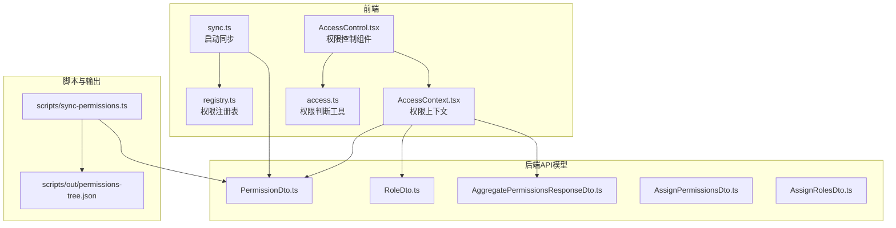
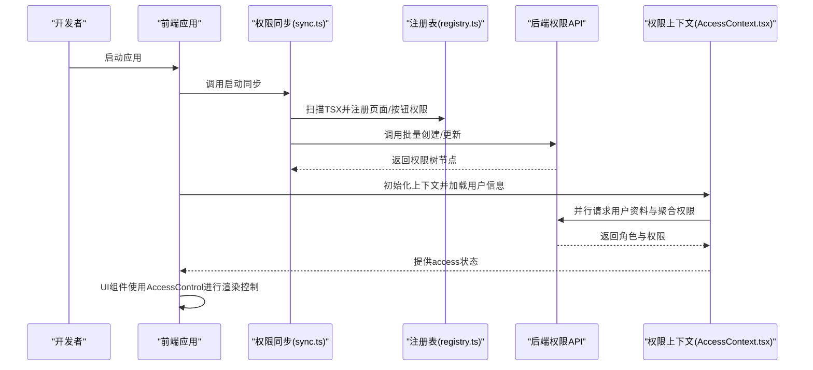
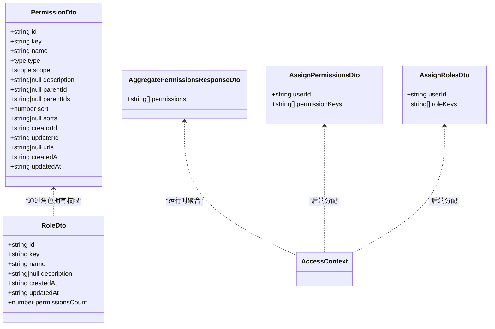
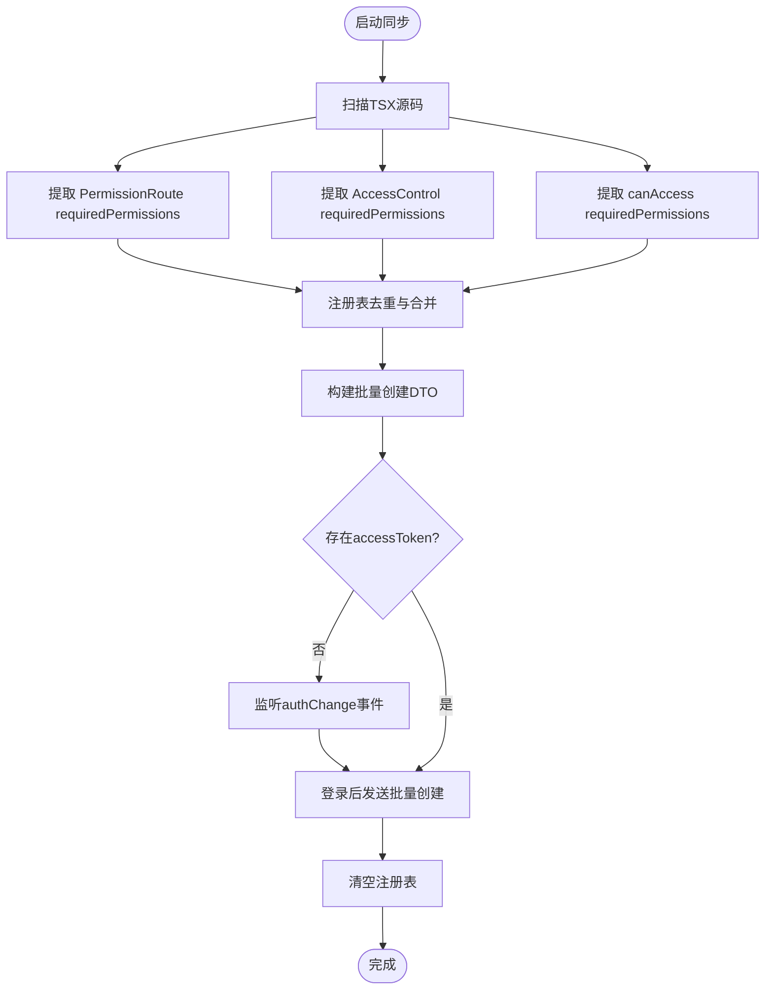
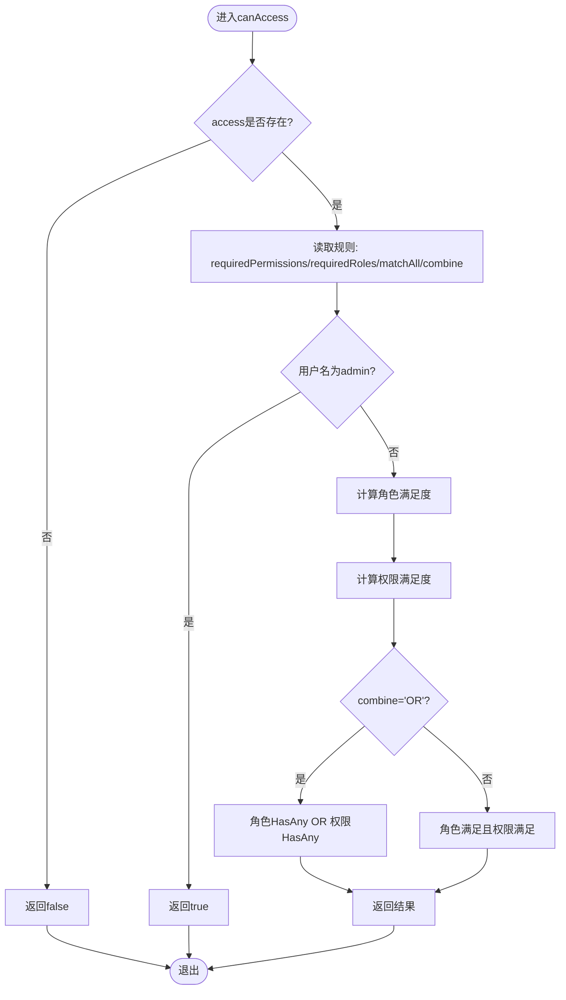
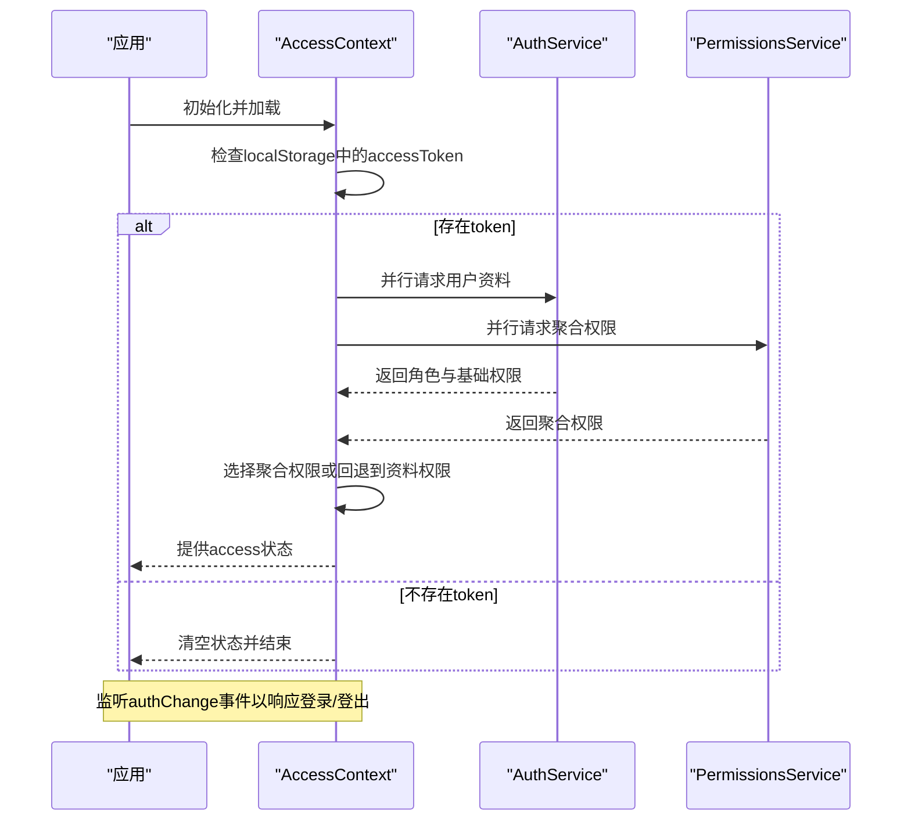
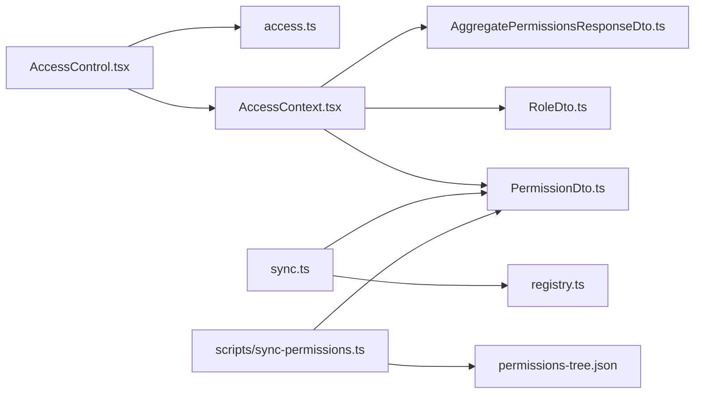

# 权限模型设计

<cite>
**本文引用的文件**
- [src/permissions/registry.ts](file://src/permissions/registry.ts)
- [src/permissions/sync.ts](file://src/permissions/sync.ts)
- [src/permissions/AccessControl.tsx](file://src/permissions/AccessControl.tsx)
- [src/utils/access.ts](file://src/utils/access.ts)
- [src/context/AccessContext.tsx](file://src/context/AccessContext.tsx)
- [src/api/models/PermissionDto.ts](file://src/api/models/PermissionDto.ts)
- [src/api/models/RoleDto.ts](file://src/api/models/RoleDto.ts)
- [src/api/models/AggregatePermissionsResponseDto.ts](file://src/api/models/AggregatePermissionsResponseDto.ts)
- [src/api/models/AssignPermissionsDto.ts](file://src/api/models/AssignPermissionsDto.ts)
- [src/api/models/AssignRolesDto.ts](file://src/api/models/AssignRolesDto.ts)
- [scripts/sync-permissions.ts](file://scripts/sync-permissions.ts)
- [scripts/out/permissions-tree.json](file://scripts/out/permissions-tree.json)
</cite>

## 目录
1. [简介](#简介)
2. [项目结构](#项目结构)
3. [核心组件](#核心组件)
4. [架构总览](#架构总览)
5. [详细组件分析](#详细组件分析)
6. [依赖分析](#依赖分析)
7. [性能考量](#性能考量)
8. [故障排查指南](#故障排查指南)
9. [结论](#结论)
10. [附录](#附录)

## 简介
本文件面向权限模型设计，围绕基于角色的权限管理（RBAC）进行系统化阐述。文档聚焦以下方面：
- 权限与角色的数据结构设计
- 权限继承与组合规则
- 权限注册系统工作原理
- 权限数据存储格式与验证算法
- 扩展性设计、性能优化策略与安全注意事项
- 权限模型配置示例与最佳实践

## 项目结构
权限体系由前端注册与同步、运行时权限上下文、权限验证工具以及后端API模型共同组成。前端负责在启动时扫描并批量创建/更新权限，运行时通过上下文聚合用户的角色与权限，并在UI层进行即时校验。

图表来源
- [src/permissions/registry.ts](file://src/permissions/registry.ts#L1-L129)
- [src/permissions/sync.ts](file://src/permissions/sync.ts#L1-L159)
- [src/permissions/AccessControl.tsx](file://src/permissions/AccessControl.tsx#L1-L43)
- [src/utils/access.ts](file://src/utils/access.ts#L1-L65)
- [src/context/AccessContext.tsx](file://src/context/AccessContext.tsx#L1-L181)
- [src/api/models/PermissionDto.ts](file://src/api/models/PermissionDto.ts#L1-L85)
- [src/api/models/RoleDto.ts](file://src/api/models/RoleDto.ts#L1-L36)
- [src/api/models/AggregatePermissionsResponseDto.ts](file://src/api/models/AggregatePermissionsResponseDto.ts#L1-L9)
- [src/api/models/AssignPermissionsDto.ts](file://src/api/models/AssignPermissionsDto.ts#L1-L16)
- [src/api/models/AssignRolesDto.ts](file://src/api/models/AssignRolesDto.ts#L1-L16)
- [scripts/sync-permissions.ts](file://scripts/sync-permissions.ts#L1-L200)
- [scripts/out/permissions-tree.json](file://scripts/out/permissions-tree.json)

章节来源
- [src/permissions/registry.ts](file://src/permissions/registry.ts#L1-L129)
- [src/permissions/sync.ts](file://src/permissions/sync.ts#L1-L159)
- [src/permissions/AccessControl.tsx](file://src/permissions/AccessControl.tsx#L1-L43)
- [src/utils/access.ts](file://src/utils/access.ts#L1-L65)
- [src/context/AccessContext.tsx](file://src/context/AccessContext.tsx#L1-L181)
- [src/api/models/PermissionDto.ts](file://src/api/models/PermissionDto.ts#L1-L85)
- [src/api/models/RoleDto.ts](file://src/api/models/RoleDto.ts#L1-L36)
- [src/api/models/AggregatePermissionsResponseDto.ts](file://src/api/models/AggregatePermissionsResponseDto.ts#L1-L9)
- [src/api/models/AssignPermissionsDto.ts](file://src/api/models/AssignPermissionsDto.ts#L1-L16)
- [src/api/models/AssignRolesDto.ts](file://src/api/models/AssignRolesDto.ts#L1-L16)
- [scripts/sync-permissions.ts](file://scripts/sync-permissions.ts#L1-L200)
- [scripts/out/permissions-tree.json](file://scripts/out/permissions-tree.json)

## 核心组件
- 权限注册表（registry.ts）：在应用启动或扫描阶段收集页面/按钮权限键，统一去重并导出批量创建DTO。
- 启动同步（sync.ts）：全量扫描TSX源码，提取权限键与位置信息，按需调用后端批量创建接口。
- 权限控制组件（AccessControl.tsx）：在UI层根据用户权限与角色进行条件渲染。
- 权限判断工具（access.ts）：提供可复用的权限/角色组合判定逻辑，支持“全部满足/任一满足”与“与/或”组合策略。
- 权限上下文（AccessContext.tsx）：全局管理用户角色与权限聚合，支持并行加载与错误降级。
- API模型（PermissionDto.ts、RoleDto.ts、AggregatePermissionsResponseDto.ts、AssignPermissionsDto.ts、AssignRolesDto.ts）：定义权限与角色的数据结构及分配接口参数。

章节来源
- [src/permissions/registry.ts](file://src/permissions/registry.ts#L1-L129)
- [src/permissions/sync.ts](file://src/permissions/sync.ts#L1-L159)
- [src/permissions/AccessControl.tsx](file://src/permissions/AccessControl.tsx#L1-L43)
- [src/utils/access.ts](file://src/utils/access.ts#L1-L65)
- [src/context/AccessContext.tsx](file://src/context/AccessContext.tsx#L1-L181)
- [src/api/models/PermissionDto.ts](file://src/api/models/PermissionDto.ts#L1-L85)
- [src/api/models/RoleDto.ts](file://src/api/models/RoleDto.ts#L1-L36)
- [src/api/models/AggregatePermissionsResponseDto.ts](file://src/api/models/AggregatePermissionsResponseDto.ts#L1-L9)
- [src/api/models/AssignPermissionsDto.ts](file://src/api/models/AssignPermissionsDto.ts#L1-L16)
- [src/api/models/AssignRolesDto.ts](file://src/api/models/AssignRolesDto.ts#L1-L16)

## 架构总览
权限模型采用“前端注册+后端聚合”的双向协作模式：
- 前端负责“发现—注册—同步”，确保后端权限树与前端资源对齐。
- 运行时通过上下文聚合用户的角色与权限，UI层即时校验，保证一致性与低延迟。

图表来源
- [src/permissions/sync.ts](file://src/permissions/sync.ts#L17-L64)
- [src/permissions/registry.ts](file://src/permissions/registry.ts#L89-L101)
- [src/context/AccessContext.tsx](file://src/context/AccessContext.tsx#L83-L155)
- [src/permissions/AccessControl.tsx](file://src/permissions/AccessControl.tsx#L17-L42)

## 详细组件分析

### 数据结构设计
- 权限实体（PermissionDto）：包含唯一键、显示名、类型（API/页面/按钮）、作用域（WEB/ADMIN）、父ID链、排序链、关联URL、创建/更新时间等字段，支持树形结构与排序。
- 角色实体（RoleDto）：包含唯一键、显示名、描述、创建/更新时间与权限数量统计。
- 聚合权限响应（AggregatePermissionsResponseDto）：返回用户聚合后的权限键数组。
- 分配接口（AssignPermissionsDto、AssignRolesDto）：覆盖式分配用户的角色与权限。

图表来源
- [src/api/models/PermissionDto.ts](file://src/api/models/PermissionDto.ts#L5-L66)
- [src/api/models/RoleDto.ts](file://src/api/models/RoleDto.ts#L5-L34)
- [src/api/models/AggregatePermissionsResponseDto.ts](file://src/api/models/AggregatePermissionsResponseDto.ts#L5-L7)
- [src/api/models/AssignPermissionsDto.ts](file://src/api/models/AssignPermissionsDto.ts#L5-L14)
- [src/api/models/AssignRolesDto.ts](file://src/api/models/AssignRolesDto.ts#L5-L14)

章节来源
- [src/api/models/PermissionDto.ts](file://src/api/models/PermissionDto.ts#L1-L85)
- [src/api/models/RoleDto.ts](file://src/api/models/RoleDto.ts#L1-L36)
- [src/api/models/AggregatePermissionsResponseDto.ts](file://src/api/models/AggregatePermissionsResponseDto.ts#L1-L9)
- [src/api/models/AssignPermissionsDto.ts](file://src/api/models/AssignPermissionsDto.ts#L1-L16)
- [src/api/models/AssignRolesDto.ts](file://src/api/models/AssignRolesDto.ts#L1-L16)

### 权限注册系统
- 注册表职责：收集页面与按钮权限键，去重并生成批量创建DTO；支持将页面路由路径附加到权限的urls字段，便于后端构建树或反查来源。
- 启动同步流程：在应用启动时扫描TSX文件，提取三类权限来源：
  - PermissionRoute requiredPermissions
  - AccessControl requiredPermissions
  - canAccess(...requiredPermissions: [...])
- 批量创建：将注册表转换为BatchCreatePermissionsDto并调用后端接口；若未登录，监听authChange事件后再尝试同步。

图表来源
- [src/permissions/sync.ts](file://src/permissions/sync.ts#L74-L115)
- [src/permissions/registry.ts](file://src/permissions/registry.ts#L29-L101)

章节来源
- [src/permissions/registry.ts](file://src/permissions/registry.ts#L1-L129)
- [src/permissions/sync.ts](file://src/permissions/sync.ts#L1-L159)

### 权限验证算法
- 支持两种匹配策略：
  - 组内匹配：matchAll=true表示“全部满足”，false表示“任一满足”
  - 组间组合：combine='AND'表示角色组与权限组“与”关系，'OR'表示“或”关系
- 特殊放行：用户名为admin时直接放行
- 与后端保持一致：前端的canAccess与PermissionRoute的实现策略一致

图表来源
- [src/utils/access.ts](file://src/utils/access.ts#L16-L63)

章节来源
- [src/utils/access.ts](file://src/utils/access.ts#L1-L65)
- [src/permissions/AccessControl.tsx](file://src/permissions/AccessControl.tsx#L16-L42)

### 权限上下文与运行时聚合
- 上下文提供用户角色与权限聚合状态，支持并行加载用户资料与聚合权限，优先使用聚合接口返回的权限，失败时回退到资料接口。
- 登录/登出事件监听：通过自定义authChange事件触发重新加载，保证状态一致性。
- JWT用户名解析：在后端不可用时，从本地token解析用户名用于UI展示（权限控制仍由后端负责）。

图表来源
- [src/context/AccessContext.tsx](file://src/context/AccessContext.tsx#L83-L155)

章节来源
- [src/context/AccessContext.tsx](file://src/context/AccessContext.tsx#L1-L181)

### 权限控制组件
- AccessControl组件封装了权限判断与UI渲染逻辑，支持fallback元素与调试name标注。
- 与useAccess钩子配合，在loading状态下不渲染内容，避免闪烁或错误跳转。

章节来源
- [src/permissions/AccessControl.tsx](file://src/permissions/AccessControl.tsx#L1-L43)
- [src/context/AccessContext.tsx](file://src/context/AccessContext.tsx#L167-L171)

### 后端权限树与脚本同步
- 脚本同步（scripts/sync-permissions.ts）：递归扫描TSX，提取页面/按钮权限键与关联API，构建树形结构并批量创建/更新。
- 输出权限树（scripts/out/permissions-tree.json）：可用于审计与可视化。

章节来源
- [scripts/sync-permissions.ts](file://scripts/sync-permissions.ts#L1-L200)
- [scripts/out/permissions-tree.json](file://scripts/out/permissions-tree.json)

## 依赖分析
- 前端模块耦合：
  - AccessControl依赖useAccess与canAccess，形成“UI层—工具层”的清晰边界
  - AccessContext依赖懒加载的AuthService与PermissionsService，降低初始化成本
  - sync.ts依赖registry.ts与后端PermissionsService，形成“扫描—注册—同步”的闭环
- 数据模型依赖：
  - PermissionDto/RoleDto为权限树与角色的基础结构
  - AggregatePermissionsResponseDto与AssignPermissionsDto/AssignRolesDto为运行时与分配接口契约

图表来源
- [src/permissions/AccessControl.tsx](file://src/permissions/AccessControl.tsx#L1-L43)
- [src/utils/access.ts](file://src/utils/access.ts#L1-L65)
- [src/context/AccessContext.tsx](file://src/context/AccessContext.tsx#L1-L181)
- [src/permissions/sync.ts](file://src/permissions/sync.ts#L1-L159)
- [src/permissions/registry.ts](file://src/permissions/registry.ts#L1-L129)
- [src/api/models/PermissionDto.ts](file://src/api/models/PermissionDto.ts#L1-L85)
- [src/api/models/RoleDto.ts](file://src/api/models/RoleDto.ts#L1-L36)
- [src/api/models/AggregatePermissionsResponseDto.ts](file://src/api/models/AggregatePermissionsResponseDto.ts#L1-L9)
- [scripts/sync-permissions.ts](file://scripts/sync-permissions.ts#L1-L200)
- [scripts/out/permissions-tree.json](file://scripts/out/permissions-tree.json)

章节来源
- [src/permissions/AccessControl.tsx](file://src/permissions/AccessControl.tsx#L1-L43)
- [src/utils/access.ts](file://src/utils/access.ts#L1-L65)
- [src/context/AccessContext.tsx](file://src/context/AccessContext.tsx#L1-L181)
- [src/permissions/sync.ts](file://src/permissions/sync.ts#L1-L159)
- [src/permissions/registry.ts](file://src/permissions/registry.ts#L1-L129)
- [src/api/models/PermissionDto.ts](file://src/api/models/PermissionDto.ts#L1-L85)
- [src/api/models/RoleDto.ts](file://src/api/models/RoleDto.ts#L1-L36)
- [src/api/models/AggregatePermissionsResponseDto.ts](file://src/api/models/AggregatePermissionsResponseDto.ts#L1-L9)
- [scripts/sync-permissions.ts](file://scripts/sync-permissions.ts#L1-L200)
- [scripts/out/permissions-tree.json](file://scripts/out/permissions-tree.json)

## 性能考量
- 并行加载：AccessContext对用户资料与聚合权限采用Promise.allSettled并行请求，缩短首屏等待时间。
- 懒加载服务：通过懒加载AuthService与PermissionsService，避免初始化包体膨胀与循环依赖。
- 批量同步：前端一次性扫描并批量创建权限，减少后端交互次数。
- 去重与缓存：注册表使用Map按key去重，避免重复创建；同步完成后清空注册表，防止重复触发。
- 运行时优化：canAccess使用includes快速判断，matchAll与combine策略在小规模集合上开销可控。

## 故障排查指南
- 启动同步异常：
  - 现象：控制台打印启动同步异常或批量创建接口调用失败
  - 排查：确认accessToken是否存在；检查authChange事件是否正确触发；核对后端权限接口可用性
- 权限不生效：
  - 现象：页面/按钮未按预期显示
  - 排查：确认requiredPermissions与requiredRoles配置；检查matchAll与combine策略；核对用户聚合权限是否正确返回
- 用户名解析问题：
  - 现象：用户资料接口失败时UI显示用户名为空
  - 排查：确认JWT token结构；检查parseUsernameFromToken逻辑；必要时回退至后端返回的username
- 权限树不完整：
  - 现象：后端权限树缺少页面或按钮节点
  - 排查：检查sync-permissions脚本扫描规则；确认TSX中PermissionRoute/AccessControl/canAccess语法正确；核对批量创建返回结果

章节来源
- [src/permissions/sync.ts](file://src/permissions/sync.ts#L35-L64)
- [src/context/AccessContext.tsx](file://src/context/AccessContext.tsx#L128-L134)
- [src/utils/access.ts](file://src/utils/access.ts#L16-L63)

## 结论
该权限模型以“前端注册—后端聚合”为核心，结合运行时上下文与可复用的权限判断工具，实现了高内聚、低耦合的RBAC方案。通过树形权限结构、灵活的组合规则与完善的同步机制，既满足了前端即时渲染的需求，也保证了后端权限控制的权威性与一致性。建议在生产环境中持续完善权限树审计与自动化同步流程，确保权限数据的准确性与时效性。

## 附录

### 权限与角色的数据结构速览
- 权限（PermissionDto）：唯一键、类型、作用域、父ID链、排序链、关联URL、创建/更新时间等
- 角色（RoleDto）：唯一键、显示名、描述、权限数量统计
- 聚合权限（AggregatePermissionsResponseDto）：用户权限键数组
- 分配接口（AssignPermissionsDto/AssignRolesDto）：覆盖式分配用户的角色与权限

章节来源
- [src/api/models/PermissionDto.ts](file://src/api/models/PermissionDto.ts#L1-L85)
- [src/api/models/RoleDto.ts](file://src/api/models/RoleDto.ts#L1-L36)
- [src/api/models/AggregatePermissionsResponseDto.ts](file://src/api/models/AggregatePermissionsResponseDto.ts#L1-L9)
- [src/api/models/AssignPermissionsDto.ts](file://src/api/models/AssignPermissionsDto.ts#L1-L16)
- [src/api/models/AssignRolesDto.ts](file://src/api/models/AssignRolesDto.ts#L1-L16)

### 权限验证策略配置示例
- 组内匹配：matchAll=true（全部满足）或false（任一满足）
- 组间组合：combine='AND'（角色与权限均满足）或'OR'（角色或权限任一满足）
- 特殊放行：用户名为admin时直接放行

章节来源
- [src/utils/access.ts](file://src/utils/access.ts#L9-L14)
- [src/utils/access.ts](file://src/utils/access.ts#L28-L29)

### 最佳实践
- 权限键命名规范：采用“资源:动作”或“模块:能力”的语义化命名，便于后端树形组织与前端检索
- 权限树构建：优先使用PermissionRoute包裹页面权限，按钮权限使用AccessControl或canAccess，确保urls与API映射清晰
- 同步策略：开发期使用脚本同步，生产期结合前端启动同步与后端定时校验，确保权限树与代码变更同步
- 运行时策略：在UI层使用AccessControl进行条件渲染，避免敏感信息泄露；在路由守卫中结合后端动态路由API进行强约束
- 安全加固：严格区分WEB与ADMIN作用域；对管理员账户进行特殊放行的同时，确保后端严格校验；定期审计权限树与分配记录