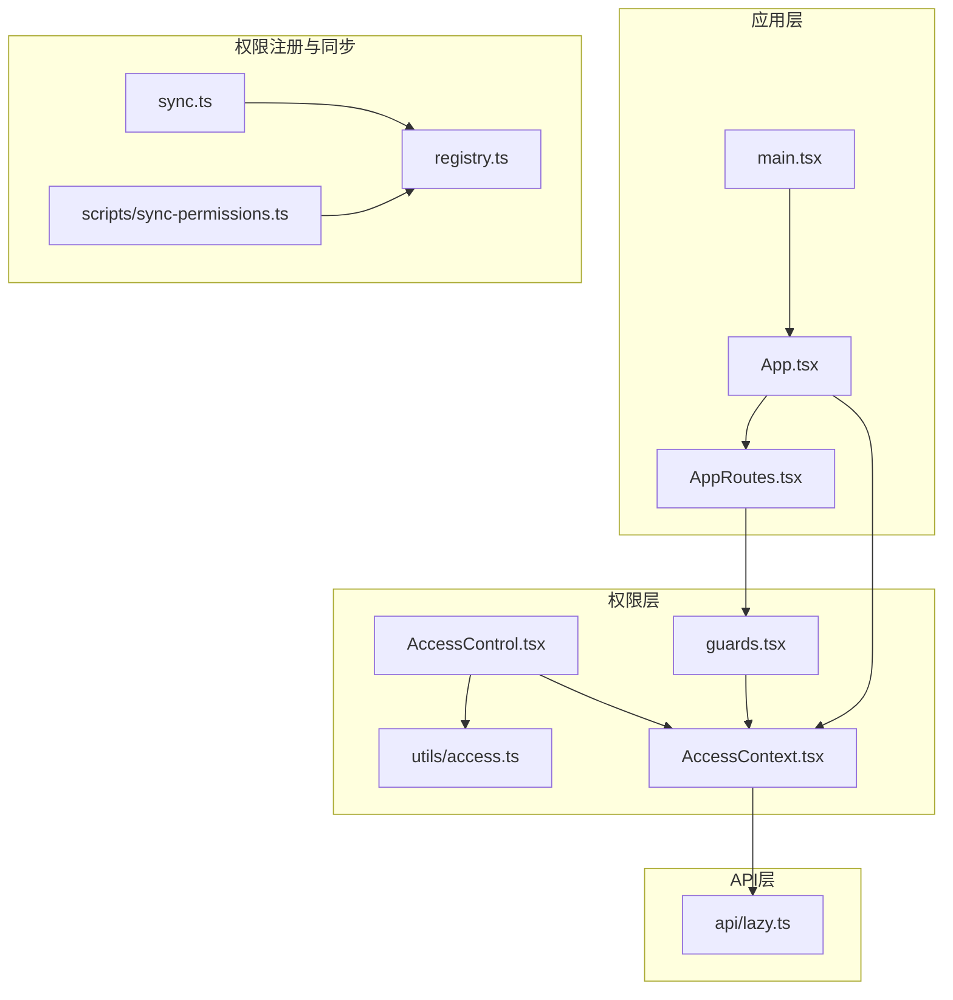
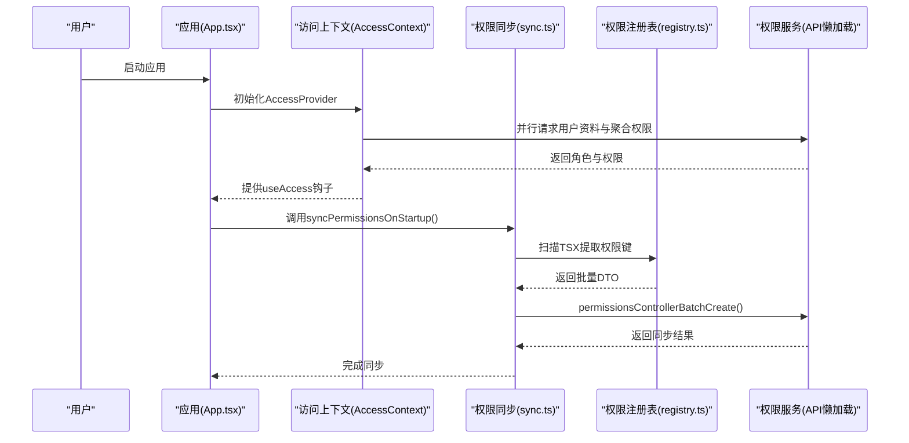
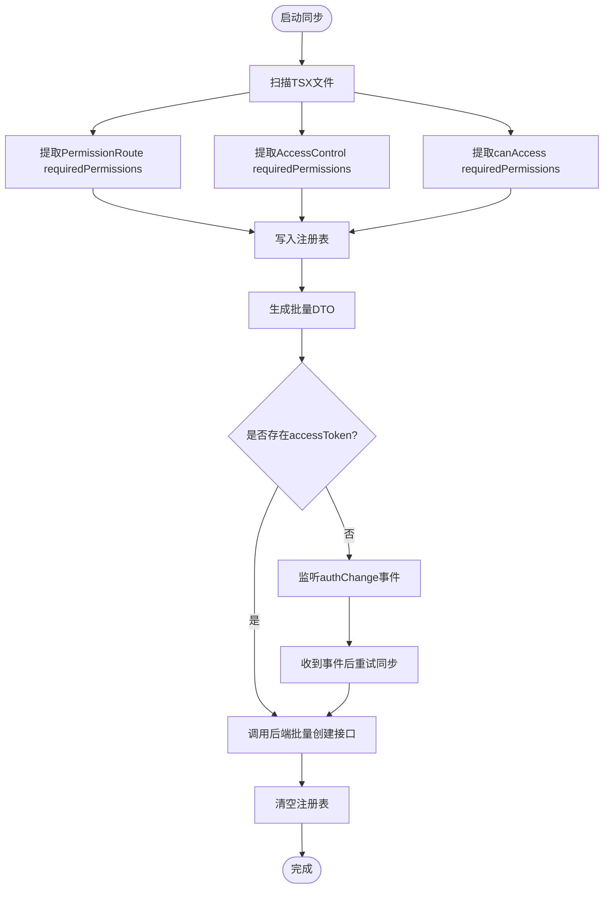
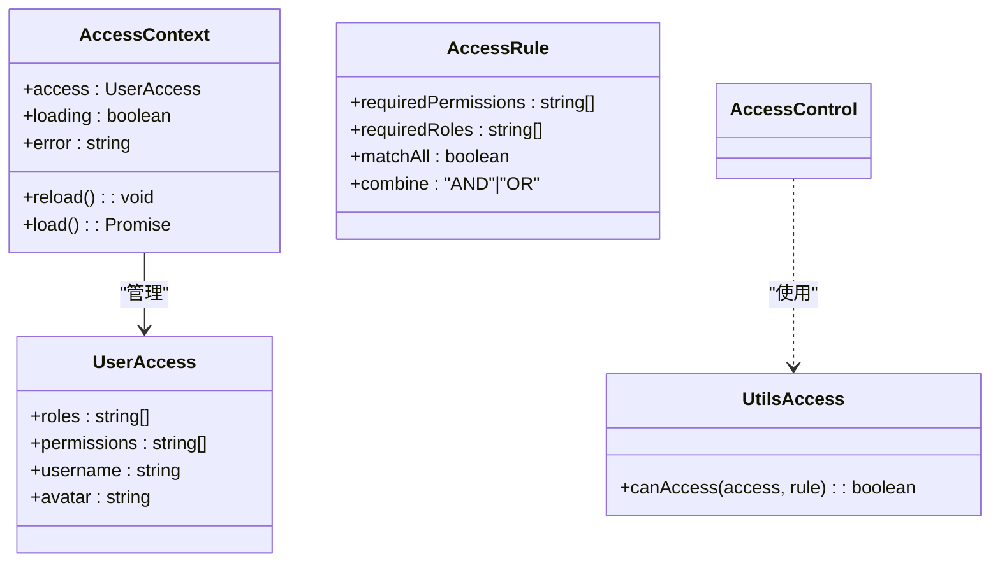
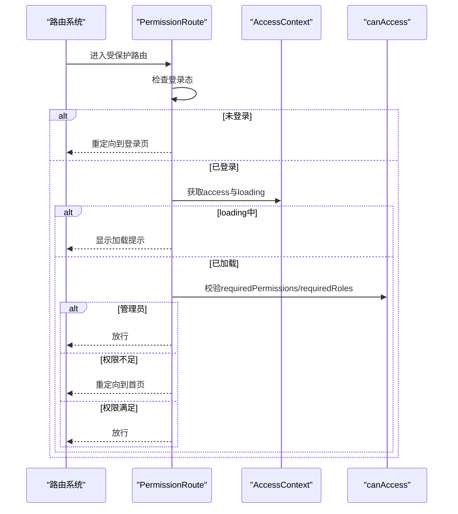
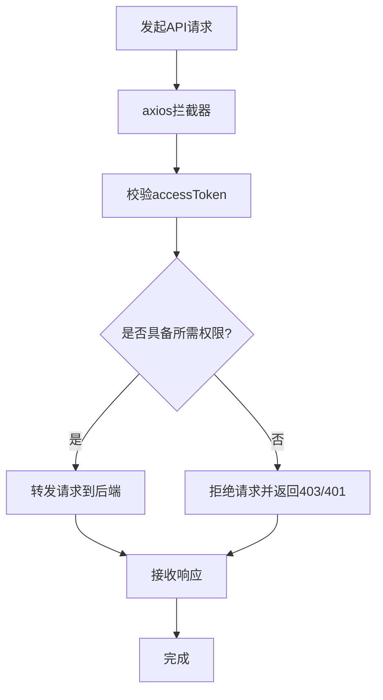
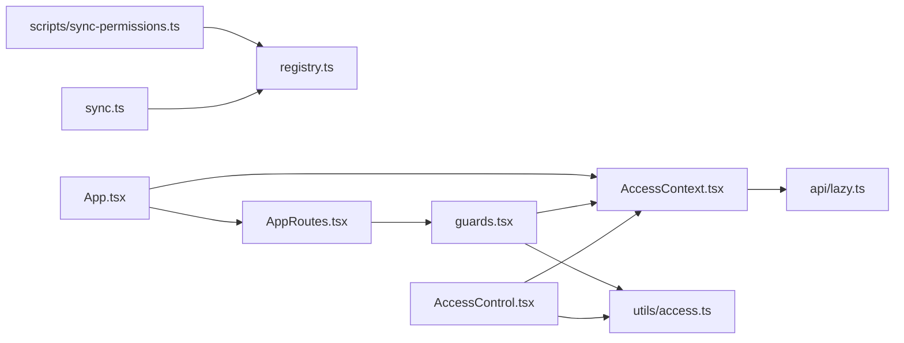

# 权限系统集成

<cite>
**本文档引用的文件**
- [src/permissions/AccessControl.tsx](file://src/permissions/AccessControl.tsx)
- [src/permissions/registry.ts](file://src/permissions/registry.ts)
- [src/permissions/sync.ts](file://src/permissions/sync.ts)
- [src/context/AccessContext.tsx](file://src/context/AccessContext.tsx)
- [src/route/guards.tsx](file://src/route/guards.tsx)
- [src/utils/access.ts](file://src/utils/access.ts)
- [src/main.tsx](file://src/main.tsx)
- [src/App.tsx](file://src/App.tsx)
- [src/api/lazy.ts](file://src/api/lazy.ts)
- [src/routes/AppRoutes.tsx](file://src/routes/AppRoutes.tsx)
- [scripts/sync-permissions.ts](file://scripts/sync-permissions.ts)
- [package.json](file://package.json)
</cite>

## 目录
1. [简介](#简介)
2. [项目结构](#项目结构)
3. [核心组件](#核心组件)
4. [架构总览](#架构总览)
5. [详细组件分析](#详细组件分析)
6. [依赖关系分析](#依赖关系分析)
7. [性能考虑](#性能考虑)
8. [故障排除指南](#故障排除指南)
9. [结论](#结论)
10. [附录](#附录)

## 简介
本技术文档面向权限系统与路由系统的集成，重点阐述以下方面：
- 路由守卫的实现与权限验证流程
- 权限系统与组件系统的集成策略（页面权限、按钮权限、显示/隐藏控制）
- 权限拦截器配置思路与API调用的权限检查
- 跨模块权限协调机制
- 集成配置示例与故障排除指南

权限系统采用“前端权限注册 + 启动时扫描同步 + 运行时守卫校验”的三层架构，既保证了开发期的自动化与一致性，又确保运行期的高性能与可维护性。

## 项目结构
权限系统相关的核心文件分布如下：
- 权限注册与同步：src/permissions/registry.ts、src/permissions/sync.ts
- 运行时权限上下文：src/context/AccessContext.tsx
- 组件级权限控制：src/permissions/AccessControl.tsx
- 路由级权限守卫：src/route/guards.tsx
- 通用权限判断工具：src/utils/access.ts
- 应用入口与提供者：src/main.tsx、src/App.tsx
- API懒加载与权限服务：src/api/lazy.ts
- 动态路由与路由入口：src/routes/AppRoutes.tsx
- 手动同步脚本：scripts/sync-permissions.ts
- 任务脚本与依赖：package.json

图表来源
- [src/App.tsx](file://src/App.tsx#L33-L49)
- [src/main.tsx](file://src/main.tsx#L11-L17)
- [src/routes/AppRoutes.tsx](file://src/routes/AppRoutes.tsx#L73-L98)
- [src/context/AccessContext.tsx](file://src/context/AccessContext.tsx#L64-L172)
- [src/permissions/AccessControl.tsx](file://src/permissions/AccessControl.tsx#L17-L42)
- [src/route/guards.tsx](file://src/route/guards.tsx#L20-L102)
- [src/utils/access.ts](file://src/utils/access.ts#L16-L63)
- [src/permissions/registry.ts](file://src/permissions/registry.ts#L29-L101)
- [src/permissions/sync.ts](file://src/permissions/sync.ts#L17-L38)
- [scripts/sync-permissions.ts](file://scripts/sync-permissions.ts#L62-L99)
- [src/api/lazy.ts](file://src/api/lazy.ts#L67-L70)

章节来源
- [src/App.tsx](file://src/App.tsx#L21-L51)
- [src/main.tsx](file://src/main.tsx#L1-L18)
- [src/routes/AppRoutes.tsx](file://src/routes/AppRoutes.tsx#L73-L98)

## 核心组件
- 权限注册表（registry.ts）：在应用启动或扫描阶段收集页面/按钮权限键，统一去重并导出批量创建DTO。
- 权限同步（sync.ts）：启动时扫描TSX文件，提取权限键并调用后端批量创建接口；支持未登录时监听认证事件再同步。
- 访问上下文（AccessContext.tsx）：全局管理用户角色与权限，加载用户资料与聚合权限，提供reload能力，并通过自定义事件响应登录/登出。
- 组件级权限控制（AccessControl.tsx）：基于useAccess与canAccess在组件层面进行显示/隐藏控制。
- 路由守卫（guards.tsx）：提供AuthRoute与PermissionRoute，分别处理登录态与权限校验，支持matchAll与combine策略。
- 通用权限判断（utils/access.ts）：与PermissionRoute保持一致的权限判断逻辑，支持AND/OR组合与管理员豁免。
- API懒加载（api/lazy.ts）：提供getPermissionsService等方法，避免循环依赖并兼容构建工具限制。
- 动态路由入口（AppRoutes.tsx）：整合公开路由与动态受保护路由，统一处理404与重定向。

章节来源
- [src/permissions/registry.ts](file://src/permissions/registry.ts#L29-L101)
- [src/permissions/sync.ts](file://src/permissions/sync.ts#L17-L38)
- [src/context/AccessContext.tsx](file://src/context/AccessContext.tsx#L64-L172)
- [src/permissions/AccessControl.tsx](file://src/permissions/AccessControl.tsx#L17-L42)
- [src/route/guards.tsx](file://src/route/guards.tsx#L20-L102)
- [src/utils/access.ts](file://src/utils/access.ts#L16-L63)
- [src/api/lazy.ts](file://src/api/lazy.ts#L67-L70)
- [src/routes/AppRoutes.tsx](file://src/routes/AppRoutes.tsx#L73-L98)

## 架构总览
权限系统集成的关键流程包括：
- 启动阶段：扫描TSX文件，构建权限注册表，调用后端批量创建/更新权限树。
- 运行阶段：AccessContext加载用户资料与聚合权限；路由守卫与组件级权限控制共同保障访问安全。
- API阶段：通过懒加载的权限服务进行权限相关的API调用。

图表来源
- [src/App.tsx](file://src/App.tsx#L33-L49)
- [src/context/AccessContext.tsx](file://src/context/AccessContext.tsx#L83-L155)
- [src/permissions/sync.ts](file://src/permissions/sync.ts#L17-L38)
- [src/permissions/registry.ts](file://src/permissions/registry.ts#L89-L101)
- [src/api/lazy.ts](file://src/api/lazy.ts#L67-L70)

## 详细组件分析

### 权限注册与同步（registry.ts、sync.ts）
- 注册策略：页面权限与按钮权限分别注册，支持去重与URL追踪；提供toBatchDto导出批量创建参数。
- 启动同步：扫描全项目TSX文件，提取PermissionRoute、AccessControl、canAccess中的requiredPermissions，构造批量创建请求；未登录时监听authChange事件后重试。
- 手动同步脚本：支持CLI模式，拉取后端API权限记录并合并，生成权限树JSON文件，便于审计与可视化。

图表来源
- [src/permissions/sync.ts](file://src/permissions/sync.ts#L74-L115)
- [src/permissions/registry.ts](file://src/permissions/registry.ts#L89-L101)
- [scripts/sync-permissions.ts](file://scripts/sync-permissions.ts#L101-L212)

章节来源
- [src/permissions/registry.ts](file://src/permissions/registry.ts#L29-L101)
- [src/permissions/sync.ts](file://src/permissions/sync.ts#L17-L38)
- [scripts/sync-permissions.ts](file://scripts/sync-permissions.ts#L62-L99)

### 访问上下文与权限判断（AccessContext.tsx、utils/access.ts）
- 访问上下文：并行加载用户资料与聚合权限，优先使用聚合权限；提供reload能力与自定义事件响应。
- 权限判断：支持matchAll（组内AND）与combine（角色组与权限组关系）策略；管理员用户名直接放行。

图表来源
- [src/context/AccessContext.tsx](file://src/context/AccessContext.tsx#L30-L49)
- [src/utils/access.ts](file://src/utils/access.ts#L9-L14)
- [src/utils/access.ts](file://src/utils/access.ts#L16-L63)

章节来源
- [src/context/AccessContext.tsx](file://src/context/AccessContext.tsx#L64-L172)
- [src/utils/access.ts](file://src/utils/access.ts#L16-L63)

### 路由守卫与组件级权限控制（guards.tsx、AccessControl.tsx）
- 路由守卫：
  - AuthRoute：仅判断登录态，未登录重定向至登录页。
  - PermissionRoute：支持requiredPermissions、requiredRoles、matchAll、combine；管理员直接放行；权限不足重定向至首页。
- 组件级权限控制：AccessControl基于useAccess与canAccess在组件层面进行显示/隐藏控制，支持fallback元素。

图表来源
- [src/route/guards.tsx](file://src/route/guards.tsx#L20-L102)
- [src/utils/access.ts](file://src/utils/access.ts#L16-L63)
- [src/context/AccessContext.tsx](file://src/context/AccessContext.tsx#L25-L35)

章节来源
- [src/route/guards.tsx](file://src/route/guards.tsx#L11-L102)
- [src/permissions/AccessControl.tsx](file://src/permissions/AccessControl.tsx#L17-L42)

### API调用的权限检查与拦截器配置
- 权限服务懒加载：通过getPermissionsService在需要时动态导入，避免循环依赖与构建警告。
- 权限拦截器思路：建议在axios拦截器中统一注入accessToken与权限标记，结合后端RBAC策略实现细粒度的API级权限控制。对于需要权限校验的API，拦截器在请求前校验用户权限集合，必要时携带额外的权限令牌或上下文头。

图表来源
- [src/api/lazy.ts](file://src/api/lazy.ts#L67-L70)
- [src/main.tsx](file://src/main.tsx#L4-L7)

章节来源
- [src/api/lazy.ts](file://src/api/lazy.ts#L67-L70)
- [src/main.tsx](file://src/main.tsx#L4-L7)

### 跨模块权限协调机制
- 权限键命名规范：页面权限以page:前缀、按钮权限以领域:动作前缀，确保跨模块一致性。
- 注册表去重与URL追踪：同一权限键在多模块出现时仅保留一份，自动合并urls字段，便于后端构建权限树与审计。
- 动态路由与守卫：AppRoutes集中管理公开与受保护路由，配合PermissionRoute实现模块间统一的权限控制。

章节来源
- [src/permissions/registry.ts](file://src/permissions/registry.ts#L18-L25)
- [src/permissions/registry.ts](file://src/permissions/registry.ts#L119-L128)
- [src/routes/AppRoutes.tsx](file://src/routes/AppRoutes.tsx#L73-L98)

## 依赖关系分析
- 组件耦合与内聚：权限相关逻辑集中在permissions、context、utils与route目录，职责清晰；AccessControl与guards复用utils/access的判断逻辑，降低重复。
- 外部依赖：React Router用于路由守卫；React Query用于数据获取（通过QueryProvider）；Axios用于HTTP请求（通过拦截器与懒加载服务）。
- 循环依赖规避：api/lazy.ts通过动态导入权限服务，避免在全局静态导入中产生循环依赖。

图表来源
- [src/permissions/AccessControl.tsx](file://src/permissions/AccessControl.tsx#L1-L43)
- [src/route/guards.tsx](file://src/route/guards.tsx#L1-L103)
- [src/context/AccessContext.tsx](file://src/context/AccessContext.tsx#L1-L181)
- [src/utils/access.ts](file://src/utils/access.ts#L1-L65)
- [src/permissions/sync.ts](file://src/permissions/sync.ts#L1-L159)
- [src/permissions/registry.ts](file://src/permissions/registry.ts#L1-L129)
- [src/routes/AppRoutes.tsx](file://src/routes/AppRoutes.tsx#L1-L115)
- [src/App.tsx](file://src/App.tsx#L1-L52)
- [src/api/lazy.ts](file://src/api/lazy.ts#L1-L75)

章节来源
- [src/permissions/AccessControl.tsx](file://src/permissions/AccessControl.tsx#L1-L43)
- [src/route/guards.tsx](file://src/route/guards.tsx#L1-L103)
- [src/context/AccessContext.tsx](file://src/context/AccessContext.tsx#L1-L181)
- [src/utils/access.ts](file://src/utils/access.ts#L1-L65)
- [src/permissions/sync.ts](file://src/permissions/sync.ts#L1-L159)
- [src/permissions/registry.ts](file://src/permissions/registry.ts#L1-L129)
- [src/routes/AppRoutes.tsx](file://src/routes/AppRoutes.tsx#L1-L115)
- [src/App.tsx](file://src/App.tsx#L1-L52)
- [src/api/lazy.ts](file://src/api/lazy.ts#L1-L75)

## 性能考虑
- 启动阶段扫描：使用Vite的import.meta.glob进行静态扫描，避免运行时解析成本；仅在首次启动与登录事件触发时执行同步。
- 并行加载：AccessContext并行请求用户资料与聚合权限，减少首屏等待时间。
- 懒加载服务：权限服务与其他API服务均通过懒加载，降低初始包体积与构建复杂度。
- 权限判断缓存：在组件层复用canAccess结果，避免重复计算；在路由守卫中利用loading状态避免闪烁。

## 故障排除指南
- 启动同步异常
  - 现象：控制台打印“启动同步异常”或“批量创建接口调用失败”。
  - 排查：确认accessToken存在；检查后端权限服务可达性；查看网络面板与后端日志。
  - 参考
    - [src/permissions/sync.ts](file://src/permissions/sync.ts#L35-L37)
    - [src/permissions/sync.ts](file://src/permissions/sync.ts#L58-L60)
- 权限不足重定向
  - 现象：进入受保护路由被重定向到首页。
  - 排查：确认用户角色与权限集合是否包含requiredPermissions/requiredRoles；检查管理员用户名豁免逻辑。
  - 参考
    - [src/route/guards.tsx](file://src/route/guards.tsx#L95-L98)
    - [src/utils/access.ts](file://src/utils/access.ts#L28-L29)
- 组件权限不生效
  - 现象：AccessControl未按预期显示/隐藏。
  - 排查：确认requiredPermissions/requiredRoles传参正确；检查useAccess返回的access对象；确认loading状态。
  - 参考
    - [src/permissions/AccessControl.tsx](file://src/permissions/AccessControl.tsx#L25-L28)
    - [src/permissions/AccessControl.tsx](file://src/permissions/AccessControl.tsx#L30-L35)
- 未登录访问受保护路由
  - 现象：被重定向到登录页。
  - 排查：确认localStorage中存在accessToken；检查AuthRoute逻辑。
  - 参考
    - [src/route/guards.tsx](file://src/route/guards.tsx#L35-L36)
- 手动同步脚本失败
  - 现象：CLI执行报错或未生成权限树。
  - 排查：确认API_BASE_URL与ACCESS_TOKEN环境变量；检查后端/permissions/all接口；查看脚本输出。
  - 参考
    - [scripts/sync-permissions.ts](file://scripts/sync-permissions.ts#L62-L99)
    - [scripts/sync-permissions.ts](file://scripts/sync-permissions.ts#L218-L260)

章节来源
- [src/permissions/sync.ts](file://src/permissions/sync.ts#L35-L37)
- [src/permissions/sync.ts](file://src/permissions/sync.ts#L58-L60)
- [src/route/guards.tsx](file://src/route/guards.tsx#L95-L98)
- [src/permissions/AccessControl.tsx](file://src/permissions/AccessControl.tsx#L25-L28)
- [scripts/sync-permissions.ts](file://scripts/sync-permissions.ts#L62-L99)

## 结论
该权限系统通过“前端注册 + 启动同步 + 运行时守卫”的设计，在保证开发效率的同时实现了高内聚、低耦合的权限控制体系。路由守卫与组件级权限控制相辅相成，配合API拦截器与后端RBAC策略，能够有效支撑跨模块的权限协调与扩展。

## 附录

### 集成配置示例
- 启动时同步权限
  - 在应用入口调用启动同步函数，确保在路由渲染前完成权限注册与后端同步。
  - 参考
    - [src/permissions/sync.ts](file://src/permissions/sync.ts#L17-L38)
- 路由守卫使用
  - 在路由配置中包裹PermissionRoute，设置requiredPermissions/requiredRoles与matchAll/combine策略。
  - 参考
    - [src/route/guards.tsx](file://src/route/guards.tsx#L20-L102)
- 组件级权限控制
  - 在按钮或功能区域使用AccessControl，传入requiredPermissions/requiredRoles与fallback元素。
  - 参考
    - [src/permissions/AccessControl.tsx](file://src/permissions/AccessControl.tsx#L17-L42)
- API拦截器配置
  - 在axios拦截器中注入accessToken与权限上下文，必要时在请求失败时触发权限刷新或登出。
  - 参考
    - [src/api/lazy.ts](file://src/api/lazy.ts#L11-L24)
    - [src/main.tsx](file://src/main.tsx#L4-L7)

### 脚本与任务
- 权限同步脚本
  - 通过npm脚本调用手动同步脚本，支持CLI模式与后端权限树合并。
  - 参考
    - [package.json](file://package.json#L134)
    - [scripts/sync-permissions.ts](file://scripts/sync-permissions.ts#L62-L99)