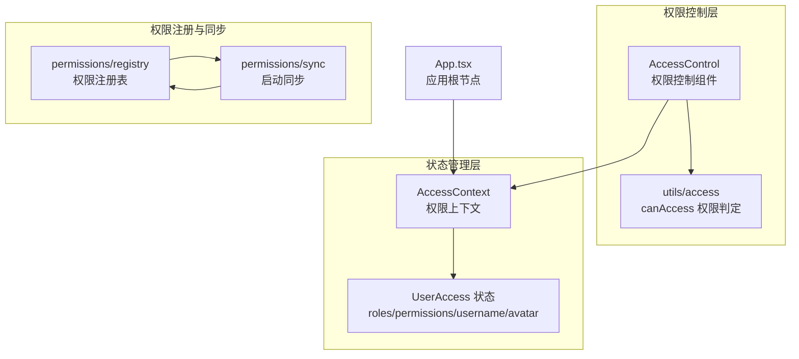
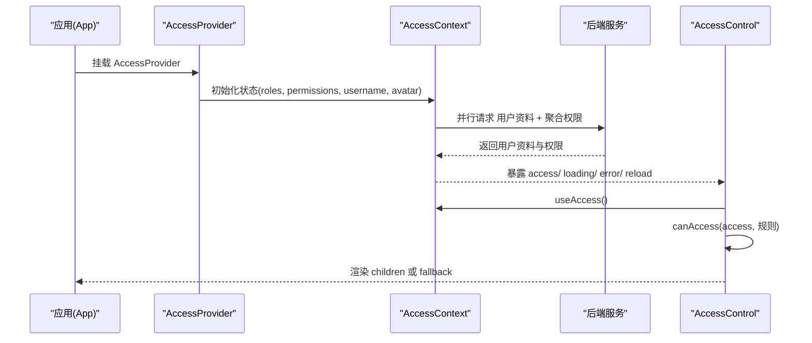
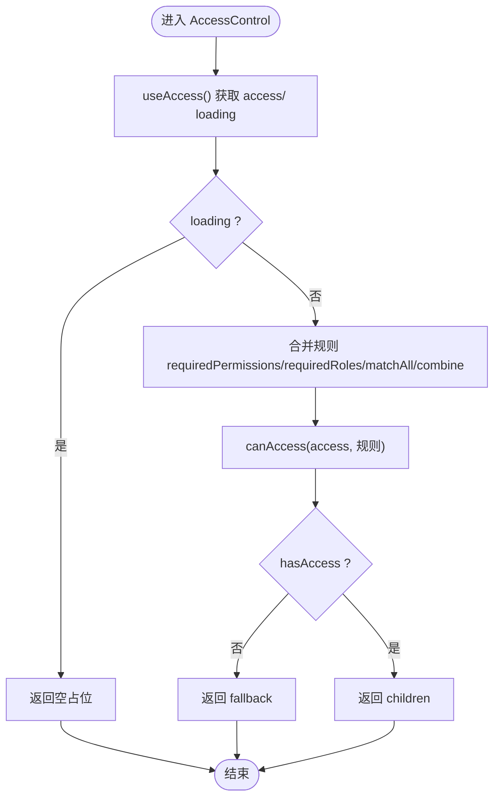
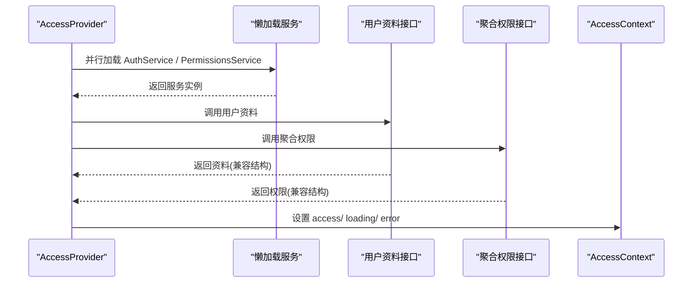
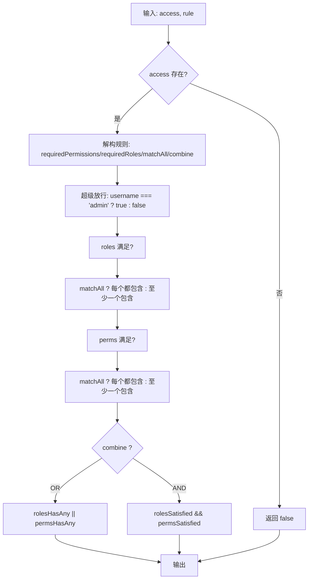
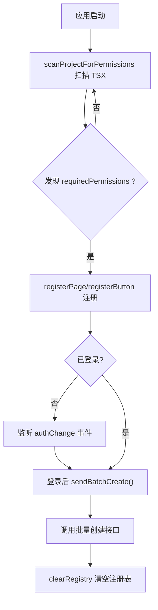
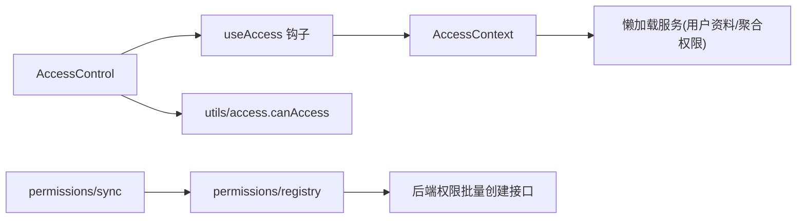

# 访问控制组件

<cite>
**本文引用的文件**
- [src/permissions/AccessControl.tsx](file://src/permissions/AccessControl.tsx)
- [src/context/AccessContext.tsx](file://src/context/AccessContext.tsx)
- [src/utils/access.ts](file://src/utils/access.ts)
- [src/permissions/registry.ts](file://src/permissions/registry.ts)
- [src/permissions/sync.ts](file://src/permissions/sync.ts)
- [src/App.tsx](file://src/App.tsx)
- [src/modules/app/pages/Edit/playlists/components/PlaylistDetails.tsx](file://src/modules/app/pages/Edit/playlists/components/PlaylistDetails.tsx)
</cite>

## 目录
1. [简介](#简介)
2. [项目结构](#项目结构)
3. [核心组件](#核心组件)
4. [架构总览](#架构总览)
5. [组件详解](#组件详解)
6. [依赖关系分析](#依赖关系分析)
7. [性能考量](#性能考量)
8. [故障排查指南](#故障排查指南)
9. [结论](#结论)
10. [附录](#附录)

## 简介
本技术文档围绕访问控制组件 AccessControl 展开，系统性阐述其权限检查逻辑、组件渲染控制与回退机制，详解 AccessContext 的作用与权限状态管理，以及组件生命周期中的权限验证流程。文档还覆盖组件使用方法、参数配置、错误处理策略，并提供实际使用示例与常见问题解决方案。

## 项目结构
访问控制能力由以下模块协同实现：
- AccessControl：权限控制渲染组件，基于 AccessContext 提供的权限状态与工具函数 canAccess 进行条件渲染。
- AccessContext：全局权限上下文，负责拉取用户角色与权限、管理加载状态与错误、提供 reload 能力。
- utils/access：统一的权限判定工具，支持角色与权限的多种组合策略。
- permissions/registry：前端侧权限注册表，用于收集页面/按钮权限键，配合同步脚本生成后端批量创建输入。
- permissions/sync：启动时扫描项目中的权限使用点，生成批量权限清单并提交后端。

图表来源
- [src/permissions/AccessControl.tsx](file://src/permissions/AccessControl.tsx#L1-L43)
- [src/context/AccessContext.tsx](file://src/context/AccessContext.tsx#L1-L181)
- [src/utils/access.ts](file://src/utils/access.ts#L1-L65)
- [src/permissions/registry.ts](file://src/permissions/registry.ts#L1-L129)
- [src/permissions/sync.ts](file://src/permissions/sync.ts#L1-L159)
- [src/App.tsx](file://src/App.tsx#L1-L52)

章节来源
- [src/permissions/AccessControl.tsx](file://src/permissions/AccessControl.tsx#L1-L43)
- [src/context/AccessContext.tsx](file://src/context/AccessContext.tsx#L1-L181)
- [src/utils/access.ts](file://src/utils/access.ts#L1-L65)
- [src/permissions/registry.ts](file://src/permissions/registry.ts#L1-L129)
- [src/permissions/sync.ts](file://src/permissions/sync.ts#L1-L159)
- [src/App.tsx](file://src/App.tsx#L1-L52)

## 核心组件
- AccessControl：根据 requiredPermissions、requiredRoles、matchAll、combine 等规则，结合 AccessContext 的 access 状态进行渲染或回退。
- AccessContext：提供 access、loading、error、reload，负责从后端拉取用户资料与聚合权限，并在登录状态变化时自动刷新。
- utils/access：统一的 canAccess 判定逻辑，支持“角色/权限”两组规则与“AND/OR”组合策略。
- permissions/registry：收集页面与按钮权限键，生成批量创建 DTO。
- permissions/sync：启动时扫描项目，将权限清单批量同步至后端。

章节来源
- [src/permissions/AccessControl.tsx](file://src/permissions/AccessControl.tsx#L5-L42)
- [src/context/AccessContext.tsx](file://src/context/AccessContext.tsx#L44-L181)
- [src/utils/access.ts](file://src/utils/access.ts#L9-L65)
- [src/permissions/registry.ts](file://src/permissions/registry.ts#L18-L129)
- [src/permissions/sync.ts](file://src/permissions/sync.ts#L17-L159)

## 架构总览
AccessControl 依赖 AccessContext 获取权限状态，再委托 utils/access 的 canAccess 判断是否满足所需权限。AccessContext 在应用启动时加载用户资料与聚合权限，并监听 authChange 事件以响应登录/登出状态变化。权限注册与同步模块在应用启动时扫描项目中的权限使用点，生成批量权限清单并提交后端。

图表来源
- [src/App.tsx](file://src/App.tsx#L33-L49)
- [src/context/AccessContext.tsx](file://src/context/AccessContext.tsx#L64-L172)
- [src/permissions/AccessControl.tsx](file://src/permissions/AccessControl.tsx#L17-L42)
- [src/utils/access.ts](file://src/utils/access.ts#L16-L65)

## 组件详解

### AccessControl 组件
- 功能：根据传入的权限规则与 AccessContext 的权限状态，决定是否渲染子节点或回退节点。
- 关键行为：
  - loading 期间返回空占位，避免闪烁或错误渲染。
  - 调用 canAccess(access, 规则) 判断是否满足要求。
  - 不满足时返回 fallback，满足时返回 children。
- 参数：
  - requiredPermissions：必需的权限键数组
  - requiredRoles：必需的角色数组
  - matchAll：组内是否需全部满足（默认 true）
  - combine：角色组与权限组之间的关系（'AND' | 'OR'，默认 'AND'）
  - children：满足条件时渲染的内容
  - fallback：不满足时的回退内容
  - name：调试标识（不影响逻辑）

图表来源
- [src/permissions/AccessControl.tsx](file://src/permissions/AccessControl.tsx#L17-L42)
- [src/utils/access.ts](file://src/utils/access.ts#L16-L65)

章节来源
- [src/permissions/AccessControl.tsx](file://src/permissions/AccessControl.tsx#L5-L42)

### AccessContext 与权限状态管理
- 职责：
  - 管理 UserAccess：roles、permissions、username、avatar
  - 管理 loading 与 error
  - 提供 reload 方法
  - 监听 authChange 事件，自动刷新
- 初始化与加载：
  - 若本地存在 accessToken，初始 loading 为 true，避免未加载完成时的闪烁
  - 并行请求用户资料与聚合权限，兼容不同后端响应结构
  - 聚合权限优先，若不可用则回退到用户资料中的权限
  - Profile 失败时，尝试从 JWT token 解析用户名（仅用于 UI 显示）
- 回退机制：
  - 聚合权限接口失败时，保留从 Profile 获取的权限
  - Profile 接口失败时，从 token 解析用户名并记录警告

图表来源
- [src/context/AccessContext.tsx](file://src/context/AccessContext.tsx#L83-L155)

章节来源
- [src/context/AccessContext.tsx](file://src/context/AccessContext.tsx#L64-L181)

### 权限判定工具 canAccess
- 支持的规则：
  - requiredPermissions：必需权限键数组
  - requiredRoles：必需角色数组
  - matchAll：组内是否需全部满足（默认 true）
  - combine：角色组与权限组关系（'AND' | 'OR'，默认 'AND'）
- 特殊放行：当 username 为 'admin' 时直接放行
- 判定流程：
  - 分别计算角色组与权限组满足情况
  - 根据 combine 决定返回 AND 或 OR 的最终布尔值

图表来源
- [src/utils/access.ts](file://src/utils/access.ts#L16-L65)

章节来源
- [src/utils/access.ts](file://src/utils/access.ts#L9-L65)

### 权限注册与同步
- registry：
  - registerPage：注册页面权限键，记录类型、范围、描述与路由路径
  - registerButton：注册按钮/操作权限键，记录类型、范围、描述
  - toBatchDto：导出批量创建 DTO
  - clearRegistry/getRegistrySnapshot：清理与快照
- sync：
  - 启动时扫描项目 TSX 文件，提取 PermissionRoute、AccessControl、canAccess 的 requiredPermissions
  - 生成批量权限清单并调用后端批量创建接口
  - 未登录时监听 authChange 事件，登录后再同步

图表来源
- [src/permissions/sync.ts](file://src/permissions/sync.ts#L74-L115)
- [src/permissions/registry.ts](file://src/permissions/registry.ts#L27-L101)

章节来源
- [src/permissions/registry.ts](file://src/permissions/registry.ts#L1-L129)
- [src/permissions/sync.ts](file://src/permissions/sync.ts#L1-L159)

## 依赖关系分析
- AccessControl 依赖 AccessContext 提供的 access 状态与 useAccess 钩子，同时依赖 utils/access 的 canAccess 判定。
- AccessContext 依赖懒加载的服务模块，分别调用用户资料与聚合权限接口，并在 authChange 事件触发时重新加载。
- 权限注册与同步模块在应用启动时运行，扫描项目中的权限使用点，生成批量权限清单并提交后端。

图表来源
- [src/permissions/AccessControl.tsx](file://src/permissions/AccessControl.tsx#L1-L43)
- [src/context/AccessContext.tsx](file://src/context/AccessContext.tsx#L1-L181)
- [src/utils/access.ts](file://src/utils/access.ts#L1-L65)
- [src/permissions/sync.ts](file://src/permissions/sync.ts#L1-L159)
- [src/permissions/registry.ts](file://src/permissions/registry.ts#L1-L129)

章节来源
- [src/permissions/AccessControl.tsx](file://src/permissions/AccessControl.tsx#L1-L43)
- [src/context/AccessContext.tsx](file://src/context/AccessContext.tsx#L1-L181)
- [src/utils/access.ts](file://src/utils/access.ts#L1-L65)
- [src/permissions/sync.ts](file://src/permissions/sync.ts#L1-L159)
- [src/permissions/registry.ts](file://src/permissions/registry.ts#L1-L129)

## 性能考量
- 并行加载：AccessContext 在加载用户资料与聚合权限时采用 Promise.allSettled 并行请求，减少总等待时间。
- 懒加载服务：通过懒加载避免初始包体膨胀与循环依赖。
- 初始 loading 控制：检测本地是否存在 accessToken，若存在则初始 loading 为 true，避免未加载完成时的闪烁。
- 权限判定缓存：canAccess 为纯函数，避免额外状态开销；建议在高频渲染场景中复用规则对象，减少重复计算。

## 故障排查指南
- 权限判定始终为 false
  - 检查 AccessContext 是否正确设置 access，确认 roles 与 permissions 是否为空
  - 确认 requiredPermissions/requiredRoles 与后端分配一致
  - 检查 matchAll 与 combine 的组合是否符合预期
- 加载期间空白
  - AccessControl 在 loading 期间返回空占位，属正常行为
  - 确认 AccessContext 的 loading 流程是否正确结束
- Profile 接口失败但 UI 需要显示用户名
  - AccessContext 会在 Profile 失败时尝试从 JWT token 解析用户名（仅用于显示）
  - 若解析失败，username 将为空，属于预期行为
- 权限未生效
  - 确认权限已在启动时通过 sync 扫描并提交后端
  - 检查 permissions/registry 是否正确注册了页面/按钮权限键
- 登录/登出后权限未刷新
  - 确认外部是否派发了 authChange 事件
  - 确认 AccessContext 是否监听并调用了 reload

章节来源
- [src/context/AccessContext.tsx](file://src/context/AccessContext.tsx#L83-L155)
- [src/permissions/sync.ts](file://src/permissions/sync.ts#L17-L38)
- [src/permissions/registry.ts](file://src/permissions/registry.ts#L89-L101)

## 结论
AccessControl 通过 AccessContext 与 utils/access 实现了灵活且高效的权限控制，结合权限注册与同步模块，形成从前端扫描到后端批量创建的闭环。其设计兼顾了用户体验（loading 占位）、健壮性（回退机制）与可维护性（清晰的规则与事件驱动刷新）。建议在实际使用中明确权限键命名规范，合理配置 matchAll 与 combine，并确保登录状态变更时派发 authChange 事件以触发权限刷新。

## 附录

### 使用示例与最佳实践
- 在页面/按钮上使用 AccessControl 控制渲染
  - 示例路径：[src/modules/app/pages/Edit/playlists/components/PlaylistDetails.tsx](file://src/modules/app/pages/Edit/playlists/components/PlaylistDetails.tsx#L123-L141)
  - 示例路径：[src/modules/app/pages/Edit/playlists/components/PlaylistDetails.tsx](file://src/modules/app/pages/Edit/playlists/components/PlaylistDetails.tsx#L193-L211)
  - 示例路径：[src/modules/app/pages/Edit/playlists/components/PlaylistDetails.tsx](file://src/modules/app/pages/Edit/playlists/components/PlaylistDetails.tsx#L323-L344)
- 在应用根节点挂载 AccessProvider
  - 示例路径：[src/App.tsx](file://src/App.tsx#L33-L49)
- 权限同步
  - 在应用启动时调用 syncPermissionsOnStartup，确保权限清单已提交后端
  - 示例路径：[src/permissions/sync.ts](file://src/permissions/sync.ts#L17-L38)

### 参数配置速查
- AccessControl
  - requiredPermissions：必需权限键数组
  - requiredRoles：必需角色数组
  - matchAll：组内是否需全部满足（默认 true）
  - combine：角色组与权限组关系（'AND' | 'OR'，默认 'AND'）
  - children：满足条件时渲染的内容
  - fallback：不满足时的回退内容
  - name：调试标识（不影响逻辑）

章节来源
- [src/permissions/AccessControl.tsx](file://src/permissions/AccessControl.tsx#L5-L42)
- [src/utils/access.ts](file://src/utils/access.ts#L9-L14)
- [src/modules/app/pages/Edit/playlists/components/PlaylistDetails.tsx](file://src/modules/app/pages/Edit/playlists/components/PlaylistDetails.tsx#L123-L141)
- [src/App.tsx](file://src/App.tsx#L33-L49)
- [src/permissions/sync.ts](file://src/permissions/sync.ts#L17-L38)