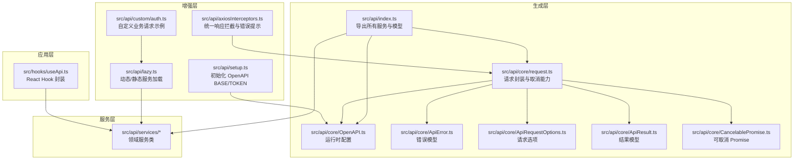
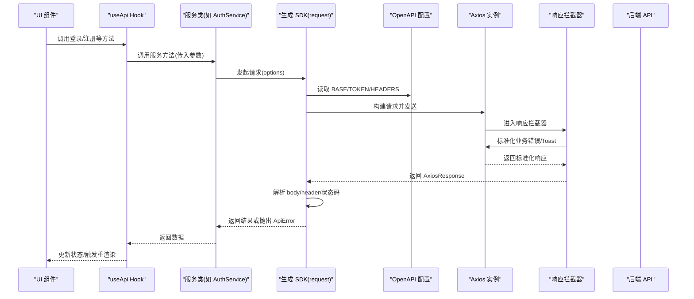
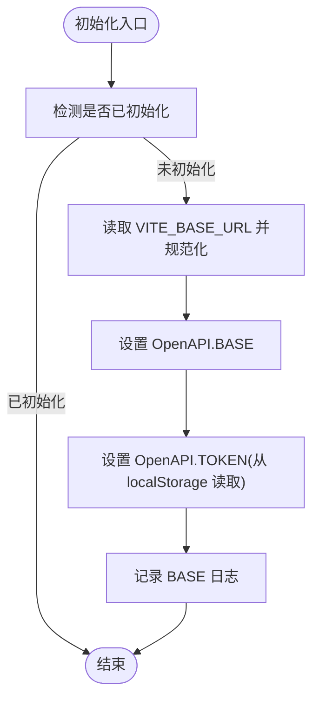
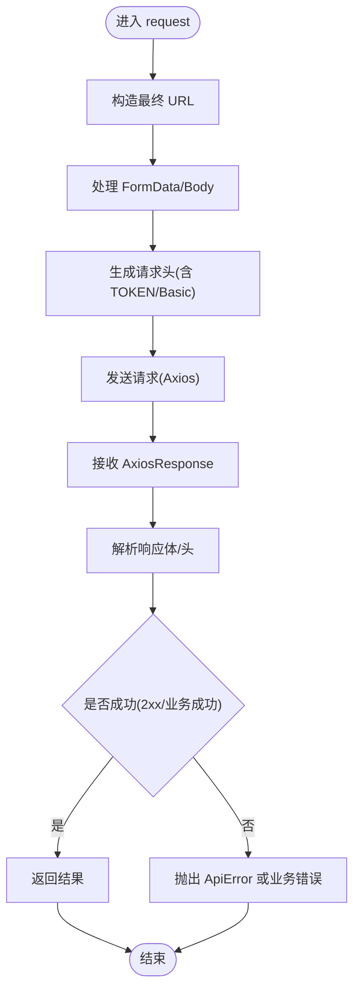
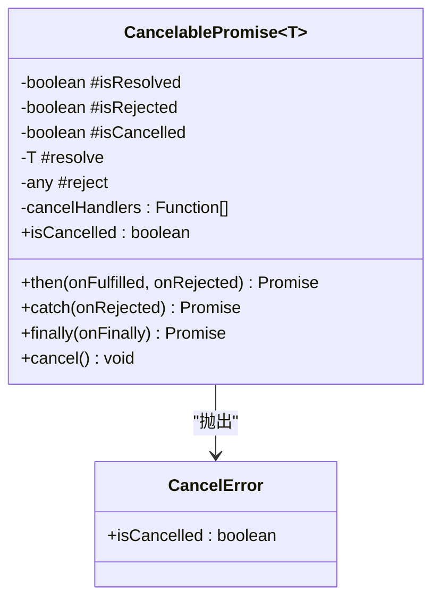
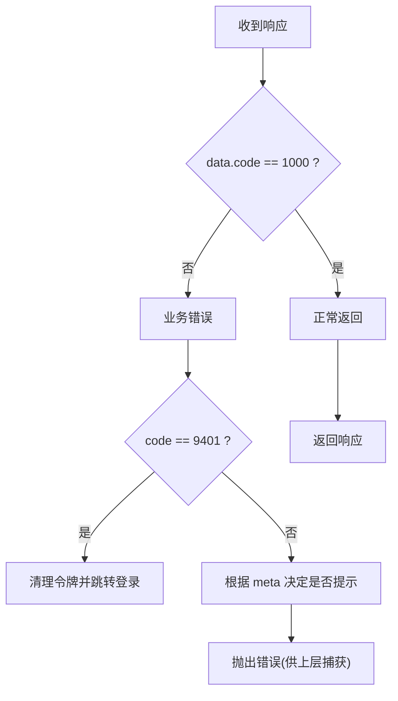
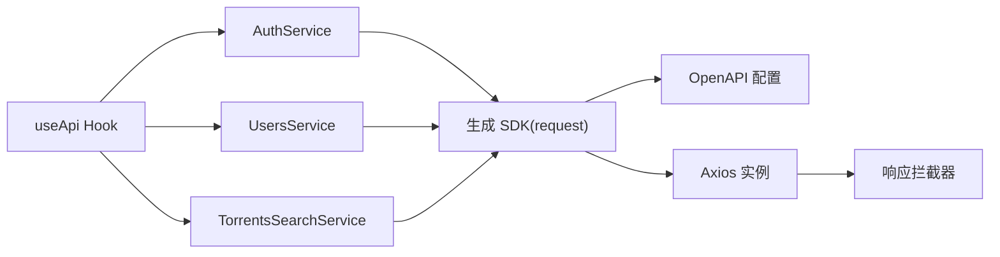
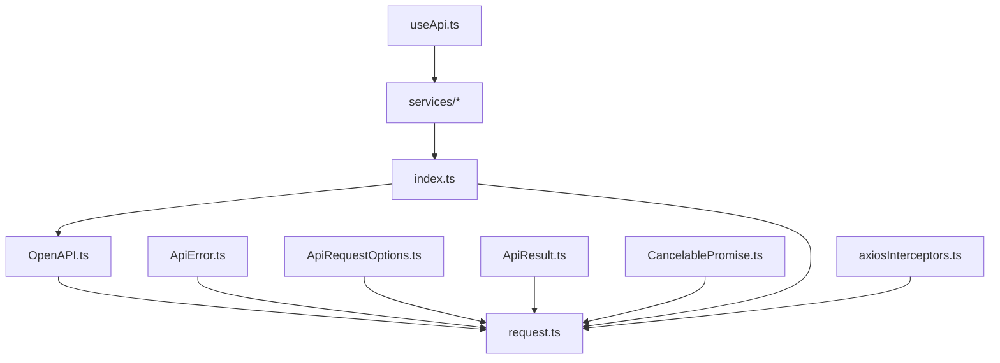

# API 客户端架构

<cite>
**本文档引用的文件**
- [src/api/index.ts](file://src/api/index.ts)
- [src/api/setup.ts](file://src/api/setup.ts)
- [src/api/core/OpenAPI.ts](file://src/api/core/OpenAPI.ts)
- [src/api/core/request.ts](file://src/api/core/request.ts)
- [src/api/core/ApiError.ts](file://src/api/core/ApiError.ts)
- [src/api/core/ApiRequestOptions.ts](file://src/api/core/ApiRequestOptions.ts)
- [src/api/core/ApiResult.ts](file://src/api/core/ApiResult.ts)
- [src/api/core/CancelablePromise.ts](file://src/api/core/CancelablePromise.ts)
- [src/api/axiosInterceptors.ts](file://src/api/axiosInterceptors.ts)
- [src/api/lazy.ts](file://src/api/lazy.ts)
- [src/api/custom/auth.ts](file://src/api/custom/auth.ts)
- [src/hooks/useApi.ts](file://src/hooks/useApi.ts)
</cite>

## 目录
1. [简介](#简介)
2. [项目结构](#项目结构)
3. [核心组件](#核心组件)
4. [架构总览](#架构总览)
5. [详细组件分析](#详细组件分析)
6. [依赖关系分析](#依赖关系分析)
7. [性能考量](#性能考量)
8. [故障排查指南](#故障排查指南)
9. [结论](#结论)
10. [附录](#附录)

## 简介
本文件面向 zTorrent-site 的前端团队与第三方开发者，系统性阐述基于 OpenAPI 的 API 客户端架构与 SDK 设计原则。内容涵盖：
- SDK 生成策略与客户端初始化流程
- 请求拦截器与响应处理机制
- 服务层组织结构与 API 调用封装
- 错误处理策略与最佳实践
- 使用示例与扩展指南

目标是帮助开发者高效、安全地进行 API 交互，并在复杂业务场景中保持一致性与可维护性。

## 项目结构
API 客户端位于 src/api 目录，采用“OpenAPI 生成 + 自定义增强”的混合架构：
- 生成层：由 openapi-typescript-codegen 生成的 SDK（核心请求逻辑、模型与服务类）
- 增强层：自定义的 OpenAPI 配置、请求封装、拦截器与工具函数
- 服务层：按领域划分的服务类，统一对外暴露方法
- Hook 层：在 React 中对服务层进行二次封装，便于查询与状态管理

**图表来源**
- [src/api/index.ts](file://src/api/index.ts#L1-L642)
- [src/api/core/request.ts](file://src/api/core/request.ts#L1-L324)
- [src/api/core/OpenAPI.ts](file://src/api/core/OpenAPI.ts#L1-L33)
- [src/api/setup.ts](file://src/api/setup.ts#L1-L35)
- [src/api/axiosInterceptors.ts](file://src/api/axiosInterceptors.ts#L1-L294)
- [src/api/lazy.ts](file://src/api/lazy.ts#L1-L75)
- [src/api/custom/auth.ts](file://src/api/custom/auth.ts#L1-L14)
- [src/hooks/useApi.ts](file://src/hooks/useApi.ts#L1-L312)

**章节来源**
- [src/api/index.ts](file://src/api/index.ts#L1-L642)
- [src/api/core/OpenAPI.ts](file://src/api/core/OpenAPI.ts#L1-L33)
- [src/api/core/request.ts](file://src/api/core/request.ts#L1-L324)
- [src/api/setup.ts](file://src/api/setup.ts#L1-L35)
- [src/api/axiosInterceptors.ts](file://src/api/axiosInterceptors.ts#L1-L294)
- [src/api/lazy.ts](file://src/api/lazy.ts#L1-L75)
- [src/api/custom/auth.ts](file://src/api/custom/auth.ts#L1-L14)
- [src/hooks/useApi.ts](file://src/hooks/useApi.ts#L1-L312)

## 核心组件
- OpenAPI 运行时配置：集中管理 BASE、TOKEN、凭据策略等
- 请求封装与取消：统一 URL 构造、头部生成、请求发送与错误捕获
- 可取消 Promise：支持在组件卸载或用户主动取消时中断请求
- 统一响应拦截：标准化业务错误码与 HTTP 错误，统一提示与跳转
- 服务层：按领域拆分的服务类，提供语义化 API
- Hook 封装：在 React 中集成查询缓存与状态管理

**章节来源**
- [src/api/core/OpenAPI.ts](file://src/api/core/OpenAPI.ts#L10-L32)
- [src/api/core/request.ts](file://src/api/core/request.ts#L294-L324)
- [src/api/core/CancelablePromise.ts](file://src/api/core/CancelablePromise.ts#L25-L132)
- [src/api/axiosInterceptors.ts](file://src/api/axiosInterceptors.ts#L196-L294)
- [src/api/index.ts](file://src/api/index.ts#L559-L642)

## 架构总览
整体交互链路如下：

**图表来源**
- [src/hooks/useApi.ts](file://src/hooks/useApi.ts#L19-L65)
- [src/api/core/request.ts](file://src/api/core/request.ts#L294-L324)
- [src/api/core/OpenAPI.ts](file://src/api/core/OpenAPI.ts#L22-L32)
- [src/api/axiosInterceptors.ts](file://src/api/axiosInterceptors.ts#L204-L291)

## 详细组件分析

### OpenAPI 运行时配置与初始化
- 配置项包括 BASE、TOKEN、凭据策略、自定义头部、路径编码器等
- 初始化策略：从 Vite 环境变量读取基础地址，规范化去除尾部斜杠；统一从 localStorage 读取访问令牌
- 保证仅初始化一次，避免热更新或重复导入导致的配置污染

**图表来源**
- [src/api/setup.ts](file://src/api/setup.ts#L18-L34)

**章节来源**
- [src/api/setup.ts](file://src/api/setup.ts#L1-L35)
- [src/api/core/OpenAPI.ts](file://src/api/core/OpenAPI.ts#L10-L32)

### 请求封装与可取消能力
- URL 构造：替换版本占位符与路径参数，拼接查询字符串
- 头部生成：合并附加头部、请求头、表单边界；自动注入 Authorization(Bearer 或 Basic)
- 请求发送：支持 withCredentials 与 XSRF 策略；统一错误处理（优先返回响应，否则抛出异常）
- 结果解析：区分 204 无体；支持响应头字段抽取
- 错误捕获：内置常见 HTTP 错误映射；非 2xx 或业务错误抛出 ApiError

**图表来源**
- [src/api/core/request.ts](file://src/api/core/request.ts#L92-L109)
- [src/api/core/request.ts](file://src/api/core/request.ts#L147-L191)
- [src/api/core/request.ts](file://src/api/core/request.ts#L200-L233)
- [src/api/core/request.ts](file://src/api/core/request.ts#L245-L250)
- [src/api/core/request.ts](file://src/api/core/request.ts#L252-L284)
- [src/api/core/request.ts](file://src/api/core/request.ts#L294-L324)

**章节来源**
- [src/api/core/request.ts](file://src/api/core/request.ts#L1-L324)
- [src/api/core/ApiError.ts](file://src/api/core/ApiError.ts#L8-L25)
- [src/api/core/ApiRequestOptions.ts](file://src/api/core/ApiRequestOptions.ts#L5-L17)
- [src/api/core/ApiResult.ts](file://src/api/core/ApiResult.ts#L5-L11)

### 可取消 Promise
- 支持在外部注册取消回调；在 Promise 执行期间可取消，触发 CancelError
- 与 Axios CancelToken 协同，避免悬挂请求占用资源

**图表来源**
- [src/api/core/CancelablePromise.ts](file://src/api/core/CancelablePromise.ts#L25-L132)

**章节来源**
- [src/api/core/CancelablePromise.ts](file://src/api/core/CancelablePromise.ts#L1-L132)

### 统一响应拦截与错误处理
- 统一响应结构：code/message/data/path/timestamp
- 业务错误码映射：将后端业务码转换为用户可读提示
- HTTP 错误与业务错误的差异化处理：401 统一清理令牌并跳转登录
- 通过 meta 控制静默提示、跳过特定错误码、自定义错误消息
- 开发环境打印详细错误上下文，便于定位问题

**图表来源**
- [src/api/axiosInterceptors.ts](file://src/api/axiosInterceptors.ts#L204-L291)

**章节来源**
- [src/api/axiosInterceptors.ts](file://src/api/axiosInterceptors.ts#L1-L294)

### 服务层组织与调用封装
- 服务类按领域划分，方法名与 OpenAPI operationId 对齐
- Hook 层对服务进行二次封装，结合 React Query 管理缓存与状态
- 动态/静态加载策略：避免构建器警告，兼顾灵活性

**图表来源**
- [src/hooks/useApi.ts](file://src/hooks/useApi.ts#L19-L65)
- [src/hooks/useApi.ts](file://src/hooks/useApi.ts#L149-L174)
- [src/hooks/useApi.ts](file://src/hooks/useApi.ts#L216-L234)
- [src/api/lazy.ts](file://src/api/lazy.ts#L31-L51)

**章节来源**
- [src/hooks/useApi.ts](file://src/hooks/useApi.ts#L1-L312)
- [src/api/lazy.ts](file://src/api/lazy.ts#L1-L75)

### 自定义业务请求示例
- 通过懒加载 OpenAPI 与 request，发起非生成域内的自定义请求
- 示例：获取当前用户资料

**章节来源**
- [src/api/custom/auth.ts](file://src/api/custom/auth.ts#L1-L14)
- [src/api/lazy.ts](file://src/api/lazy.ts#L11-L29)

## 依赖关系分析
- 生成 SDK 依赖 core 层（OpenAPI、request、ApiError、ApiRequestOptions、ApiResult、CancelablePromise）
- 服务层依赖生成 SDK 与 OpenAPI 配置
- 应用层（Hooks）依赖服务层与 React Query
- 响应拦截器独立于生成 SDK，但与 Axios 实例耦合

**图表来源**
- [src/api/index.ts](file://src/api/index.ts#L1-L10)
- [src/api/core/request.ts](file://src/api/core/request.ts#L1-L15)
- [src/api/axiosInterceptors.ts](file://src/api/axiosInterceptors.ts#L1-L1)

**章节来源**
- [src/api/index.ts](file://src/api/index.ts#L1-L642)
- [src/api/core/request.ts](file://src/api/core/request.ts#L1-L324)
- [src/api/axiosInterceptors.ts](file://src/api/axiosInterceptors.ts#L1-L294)

## 性能考量
- 请求取消：在组件卸载或用户快速切换时及时取消，避免无效渲染与资源浪费
- 动态导入：对大型服务采用动态导入，减少首屏体积；对被多处静态导入的服务采用静态返回，避免构建告警
- 缓存策略：结合 React Query 的缓存与失效策略，减少重复请求
- 头部与序列化：仅在必要时生成 FormData/JSON，避免不必要的数据转换

[本节为通用指导，无需列出具体文件来源]

## 故障排查指南
- 401 未授权
  - 表现：统一清理本地令牌并跳转登录页
  - 排查：确认 TOKEN 获取逻辑、登录流程与路由守卫
- 业务错误（code 非 1000）
  - 表现：根据业务码映射显示提示；开发环境打印详细日志
  - 排查：查看后端返回的 message/description；核对参数与权限
- HTTP 错误（4xx/5xx）
  - 表现：统一提示；部分网络错误有专门文案
  - 排查：检查网络、代理与跨域配置
- 请求未取消
  - 表现：组件卸载后仍有请求完成
  - 排查：确认是否正确调用可取消 Promise 的 cancel 方法

**章节来源**
- [src/api/axiosInterceptors.ts](file://src/api/axiosInterceptors.ts#L166-L192)
- [src/api/axiosInterceptors.ts](file://src/api/axiosInterceptors.ts#L226-L249)
- [src/api/axiosInterceptors.ts](file://src/api/axiosInterceptors.ts#L277-L281)
- [src/api/core/CancelablePromise.ts](file://src/api/core/CancelablePromise.ts#L109-L126)

## 结论
本架构以 OpenAPI 生成 SDK 为基础，结合自定义的 OpenAPI 配置、请求封装与统一响应拦截，形成高内聚、低耦合的 API 客户端体系。通过 Hook 层与服务层的清晰分工，开发者可以专注于业务逻辑，同时获得一致的错误处理、可取消请求与良好的开发体验。

[本节为总结，无需列出具体文件来源]

## 附录

### API 客户端使用示例
- 初始化 OpenAPI
  - 在应用入口或布局模块顶部调用初始化函数，设置 BASE 与 TOKEN
  - 参考：[src/api/setup.ts](file://src/api/setup.ts#L18-L34)
- 登录与注册（Hook 封装）
  - 使用认证 Hook 的 login/register/sendVerificationCode/logout 方法
  - 参考：[src/hooks/useApi.ts](file://src/hooks/useApi.ts#L11-L141)
- 获取种子列表与详情
  - 使用 useTorrents 的 fetchTorrents/getTorrentById
  - 参考：[src/hooks/useApi.ts](file://src/hooks/useApi.ts#L144-L201)
- 更新用户资料与头像
  - 使用 useUserProfile 的 updateProfile/uploadAvatar/setAvatar
  - 参考：[src/hooks/useApi.ts](file://src/hooks/useApi.ts#L203-L311)
- 自定义业务请求
  - 通过懒加载 OpenAPI 与 request 发起非生成域内的请求
  - 参考：[src/api/custom/auth.ts](file://src/api/custom/auth.ts#L1-L14), [src/api/lazy.ts](file://src/api/lazy.ts#L11-L29)

### 扩展指南
- 新增服务
  - 在对应领域目录新增服务类，遵循生成 SDK 的命名规范
  - 在 index.ts 中导出新服务，保持导出一致性
  - 参考：[src/api/index.ts](file://src/api/index.ts#L559-L642)
- 自定义拦截器
  - 如需扩展拦截器行为，在现有拦截器基础上增加条件分支
  - 参考：[src/api/axiosInterceptors.ts](file://src/api/axiosInterceptors.ts#L196-L294)
- 动态/静态加载策略
  - 对被多处静态导入的服务采用静态返回；对大模块采用动态导入
  - 参考：[src/api/lazy.ts](file://src/api/lazy.ts#L31-L51), [src/api/lazy.ts](file://src/api/lazy.ts#L36-L46)