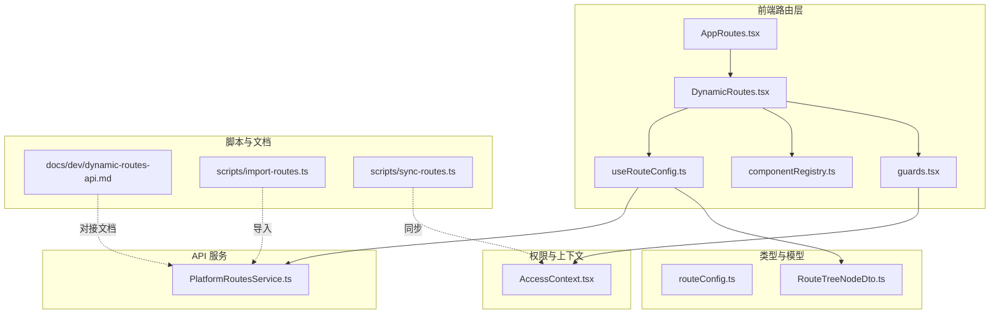
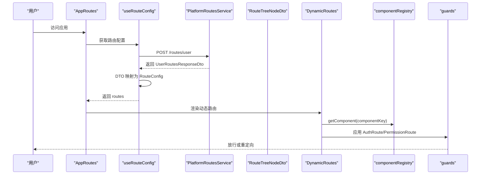
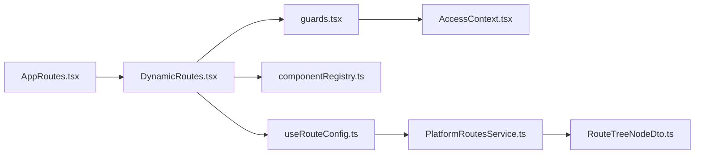

# 动态路由系统

<cite>
**本文档引用的文件**
- [DynamicRoutes.tsx](file://src/routes/DynamicRoutes.tsx)
- [AppRoutes.tsx](file://src/routes/AppRoutes.tsx)
- [guards.tsx](file://src/routes/guards.tsx)
- [componentRegistry.ts](file://src/routes/componentRegistry.ts)
- [routeConfig.ts](file://src/types/routeConfig.ts)
- [useRouteConfig.ts](file://src/hooks/useRouteConfig.ts)
- [dynamic-routes-api.md](file://docs/dev/dynamic-routes-api.md)
- [RouteTreeNodeDto.ts](file://src/api/models/RouteTreeNodeDto.ts)
- [PlatformRoutesService.ts](file://src/api/services/PlatformRoutesService.ts)
- [AccessContext.tsx](file://src/context/AccessContext.tsx)
- [import-routes.ts](file://scripts/import-routes.ts)
- [sync-routes.ts](file://scripts/sync-routes.ts)
</cite>

## 目录
1. [简介](#简介)
2. [项目结构](#项目结构)
3. [核心组件](#核心组件)
4. [架构总览](#架构总览)
5. [详细组件分析](#详细组件分析)
6. [依赖关系分析](#依赖关系分析)
7. [性能考量](#性能考量)
8. [故障排查指南](#故障排查指南)
9. [结论](#结论)
10. [附录](#附录)

## 简介
本文件系统性阐述 zTorrent-site 的动态路由体系，涵盖设计原理、实现机制、配置模型、组件注册、权限路由、运行时生成、嵌套路由与路由守卫等。目标是帮助开发者快速理解并扩展该路由系统。

## 项目结构
动态路由系统主要由以下模块组成：
- 路由配置类型与模型：定义前端路由配置的数据结构与后端 DTO。
- 路由配置 Hook：从后端拉取用户可访问的路由树，并进行本地兜底与缓存。
- 组件注册表：将“组件 Key”映射到懒加载组件，支撑动态渲染。
- 动态路由渲染器：根据配置递归生成路由树，支持布局包装、索引路由、重定向与新标签页打开。
- 路由守卫：提供基础登录态守卫与基于后端权限的高级守卫。
- 应用路由入口：整合公开路由与动态路由，统一处理 404。
- 权限上下文：提供用户角色与权限的全局状态，供守卫使用。
- 脚本工具：提供路由导入、权限同步与 API 文档对接。

图表来源
- [AppRoutes.tsx](file://src/routes/AppRoutes.tsx#L73-L98)
- [DynamicRoutes.tsx](file://src/routes/DynamicRoutes.tsx#L270-L292)
- [guards.tsx](file://src/routes/guards.tsx#L11-L15)
- [componentRegistry.ts](file://src/routes/componentRegistry.ts#L15-L250)
- [useRouteConfig.ts](file://src/hooks/useRouteConfig.ts#L38-L108)
- [routeConfig.ts](file://src/types/routeConfig.ts#L14-L48)
- [RouteTreeNodeDto.ts](file://src/api/models/RouteTreeNodeDto.ts#L5-L62)
- [PlatformRoutesService.ts](file://src/api/services/PlatformRoutesService.ts#L11-L35)
- [AccessContext.tsx](file://src/context/AccessContext.tsx#L64-L172)
- [dynamic-routes-api.md](file://docs/dev/dynamic-routes-api.md#L1-L127)
- [import-routes.ts](file://scripts/import-routes.ts#L7-L349)
- [sync-routes.ts](file://scripts/sync-routes.ts#L62-L99)

章节来源
- [AppRoutes.tsx](file://src/routes/AppRoutes.tsx#L73-L98)
- [DynamicRoutes.tsx](file://src/routes/DynamicRoutes.tsx#L270-L292)
- [guards.tsx](file://src/routes/guards.tsx#L11-L15)
- [componentRegistry.ts](file://src/routes/componentRegistry.ts#L15-L250)
- [useRouteConfig.ts](file://src/hooks/useRouteConfig.ts#L38-L108)
- [routeConfig.ts](file://src/types/routeConfig.ts#L14-L48)
- [RouteTreeNodeDto.ts](file://src/api/models/RouteTreeNodeDto.ts#L5-L62)
- [PlatformRoutesService.ts](file://src/api/services/PlatformRoutesService.ts#L11-L35)
- [AccessContext.tsx](file://src/context/AccessContext.tsx#L64-L172)
- [dynamic-routes-api.md](file://docs/dev/dynamic-routes-api.md#L1-L127)
- [import-routes.ts](file://scripts/import-routes.ts#L7-L349)
- [sync-routes.ts](file://scripts/sync-routes.ts#L62-L99)

## 核心组件
- 路由配置类型与模型
  - RouteConfig：前端路由配置对象，包含 id、path、component、layout、children、index、redirect、openInNewTab、permissions、isVisible、isEnabled、icon 等字段。
  - RouteTreeNodeDto：后端返回的树形节点 DTO，前端通过映射转换为 RouteConfig。
- 路由配置 Hook
  - useRouteConfig：使用查询库从后端获取用户可访问的路由树，支持本地兜底（如 Admin 节点）、缓存与认证状态监听。
- 组件注册表
  - componentRegistry：维护 componentKey → 懒加载组件的映射，提供 getComponent/hasComponent。
- 动态路由渲染器
  - DynamicRoutes：根据配置递归渲染路由，支持布局包装、索引路由、重定向、新标签页打开、嵌套路由与 404。
- 路由守卫
  - AuthRoute：基础登录态守卫。
  - PermissionRoute：基于后端权限与角色的高级守卫，支持 AND/OR、matchAll、admin 直通。
- 应用路由入口
  - AppRoutes：整合公开路由与动态路由，统一处理 404。
- 权限上下文
  - AccessContext：提供用户角色与权限的全局状态，供守卫使用。

章节来源
- [routeConfig.ts](file://src/types/routeConfig.ts#L14-L48)
- [RouteTreeNodeDto.ts](file://src/api/models/RouteTreeNodeDto.ts#L5-L62)
- [useRouteConfig.ts](file://src/hooks/useRouteConfig.ts#L38-L108)
- [componentRegistry.ts](file://src/routes/componentRegistry.ts#L15-L250)
- [DynamicRoutes.tsx](file://src/routes/DynamicRoutes.tsx#L56-L125)
- [guards.tsx](file://src/routes/guards.tsx#L11-L102)
- [AppRoutes.tsx](file://src/routes/AppRoutes.tsx#L73-L98)
- [AccessContext.tsx](file://src/context/AccessContext.tsx#L64-L172)

## 架构总览
动态路由系统遵循“后端驱动”的原则：前端通过 API 获取用户可访问的路由树，再由前端渲染器将其转换为 React Router 的路由结构。权限控制贯穿于守卫与后端路由树的 permissions 字段。

图表来源
- [AppRoutes.tsx](file://src/routes/AppRoutes.tsx#L73-L98)
- [useRouteConfig.ts](file://src/hooks/useRouteConfig.ts#L63-L100)
- [PlatformRoutesService.ts](file://src/api/services/PlatformRoutesService.ts#L17-L35)
- [RouteTreeNodeDto.ts](file://src/api/models/RouteTreeNodeDto.ts#L5-L62)
- [DynamicRoutes.tsx](file://src/routes/DynamicRoutes.tsx#L255-L264)
- [componentRegistry.ts](file://src/routes/componentRegistry.ts#L248-L250)
- [guards.tsx](file://src/routes/guards.tsx#L11-L102)

## 详细组件分析

### 路由配置模型与映射
- RouteConfig 字段说明
  - id：路由唯一标识
  - path：路由路径（支持相对/绝对）
  - component：组件 Key（对应 componentRegistry）
  - layout：布局类型（app/admin/forum/none）
  - permissions：访问所需权限点列表
  - children：子路由
  - index：是否为索引路由
  - redirect/openInNewTab：重定向策略
  - isVisible/isEnabled/icon/name：菜单与可见性控制
- DTO 到配置的映射
  - mapDtoToConfig 将 RouteTreeNodeDto 转换为 RouteConfig，强制转换 component/layout 等字段类型，保留 children 递归映射。

章节来源
- [routeConfig.ts](file://src/types/routeConfig.ts#L14-L48)
- [RouteTreeNodeDto.ts](file://src/api/models/RouteTreeNodeDto.ts#L5-L62)
- [useRouteConfig.ts](file://src/hooks/useRouteConfig.ts#L15-L32)

### 路由配置 Hook（useRouteConfig）
- 功能要点
  - 监听认证状态变化（authChange/storage），确保登录成功后能触发重新渲染。
  - 通过 PlatformRoutesService.routesControllerGetUserRoutes 获取用户路由树。
  - 本地兜底：若未检测到 Admin 节点，注入兜底节点以保证 /admin 路由可匹配。
  - 缓存与重试：staleTime 5 分钟，retry 1 次。
  - 数据校验：对响应结构进行校验，无效时抛错。
- 输出
  - routes：RouteConfig 数组
  - isLoading/error/refetch：查询状态

章节来源
- [useRouteConfig.ts](file://src/hooks/useRouteConfig.ts#L38-L108)
- [PlatformRoutesService.ts](file://src/api/services/PlatformRoutesService.ts#L17-L35)

### 组件注册表（componentRegistry）
- 作用
  - 建立 componentKey → 懒加载组件映射，支持按需加载。
  - 提供 getComponent/hasComponent 辅助方法。
- 布局组件
  - app/admin/forum/none 对应不同布局包装。
- 论坛布局特殊处理
  - forum 布局下使用全局加载器触发器，提升首次渲染体验。

章节来源
- [componentRegistry.ts](file://src/routes/componentRegistry.ts#L15-L250)
- [DynamicRoutes.tsx](file://src/routes/DynamicRoutes.tsx#L130-L248)

### 动态路由渲染器（DynamicRoutes）
- 渲染流程
  - renderRoute：单个配置项渲染，处理 isEnabled、redirect、index、children、懒加载组件与 Outlet。
  - renderLayoutRoutes：带布局的路由组渲染，支持 AuthRoute 包裹、索引重定向、Admin/Forum 局部 404。
- 关键特性
  - 嵌套路由：children 递归渲染，过滤未启用子路由。
  - 索引路由：index=true 时同时渲染 index 与 path 路由，解决 /admin/users/list 访问问题。
  - 重定向：支持当前页重定向与新标签页打开。
  - 布局包装：根据 layout 选择 AppLayout/AdminLayout/ForumLayout 或无布局。
  - 404 处理：全局 404 与各布局局部 404。

章节来源
- [DynamicRoutes.tsx](file://src/routes/DynamicRoutes.tsx#L56-L125)
- [DynamicRoutes.tsx](file://src/routes/DynamicRoutes.tsx#L130-L248)
- [DynamicRoutes.tsx](file://src/routes/DynamicRoutes.tsx#L294-L308)

### 路由守卫（guards）
- AuthRoute
  - 仅判断是否已登录，未登录重定向至 /login。
- PermissionRoute
  - 结合角色与权限，支持 AND/OR、matchAll、combine。
  - admin 用户直通。
  - loading 状态提示。
  - 日志输出便于调试。

章节来源
- [guards.tsx](file://src/routes/guards.tsx#L11-L102)
- [AccessContext.tsx](file://src/context/AccessContext.tsx#L64-L172)

### 应用路由入口（AppRoutes）
- 公开路由：登录、注册、忘记密码。
- 动态路由：通过 useDynamicRouteElements 渲染。
- 404 处理：未登录时重定向到登录页，已登录显示 404 页面。

章节来源
- [AppRoutes.tsx](file://src/routes/AppRoutes.tsx#L73-L115)

### 权限上下文（AccessContext）
- 提供用户角色与权限的全局状态，支持从 JWT 解析用户名作为回退。
- 并行加载用户资料与聚合权限，优先使用聚合权限。
- 监听 authChange 事件自动刷新。

章节来源
- [AccessContext.tsx](file://src/context/AccessContext.tsx#L64-L172)

### 路由配置示例与最佳实践
- 配置示例（来自脚本）
  - AppLayout 下的首页、种子列表、电影/剧集/分集/片单详情等。
  - ForumLayout 下的论坛首页、分类、标签、话题详情等。
  - AdminLayout 下的仪表盘、系统设置、导航管理、分类管理、种子管理、影片管理、播放列表管理、用户管理、字典管理等。
- 最佳实践
  - componentKey 与组件注册表保持一致。
  - children 为空时 component 可省略，作为目录节点。
  - index 与 path 同时使用时，确保 /admin/users/list 可访问。
  - 权限点命名规范，配合权限同步脚本自动生成树。
  - 布局类型与组件 Key 匹配，避免运行时找不到组件。

章节来源
- [import-routes.ts](file://scripts/import-routes.ts#L7-L349)
- [componentRegistry.ts](file://src/routes/componentRegistry.ts#L15-L250)

## 依赖关系分析
- 组件耦合
  - DynamicRoutes 依赖 useRouteConfig、componentRegistry、guards。
  - AppRoutes 依赖 DynamicRoutes 与公开页面组件。
  - guards 依赖 AccessContext。
  - useRouteConfig 依赖 PlatformRoutesService 与 RouteTreeNodeDto。
- 外部依赖
  - 后端 API：/routes/user、/routes/import、/routes/clear-cache。
  - 权限系统：后端聚合权限接口与权限同步脚本。

图表来源
- [DynamicRoutes.tsx](file://src/routes/DynamicRoutes.tsx#L5-L15)
- [AppRoutes.tsx](file://src/routes/AppRoutes.tsx#L8-L9)
- [guards.tsx](file://src/routes/guards.tsx#L5-L6)
- [useRouteConfig.ts](file://src/hooks/useRouteConfig.ts#L8-L10)
- [PlatformRoutesService.ts](file://src/api/services/PlatformRoutesService.ts#L5-L10)
- [RouteTreeNodeDto.ts](file://src/api/models/RouteTreeNodeDto.ts#L5-L62)
- [AccessContext.tsx](file://src/context/AccessContext.tsx#L1-L2)

章节来源
- [DynamicRoutes.tsx](file://src/routes/DynamicRoutes.tsx#L5-L15)
- [AppRoutes.tsx](file://src/routes/AppRoutes.tsx#L8-L9)
- [guards.tsx](file://src/routes/guards.tsx#L5-L6)
- [useRouteConfig.ts](file://src/hooks/useRouteConfig.ts#L8-L10)
- [PlatformRoutesService.ts](file://src/api/services/PlatformRoutesService.ts#L5-L10)
- [RouteTreeNodeDto.ts](file://src/api/models/RouteTreeNodeDto.ts#L5-L62)
- [AccessContext.tsx](file://src/context/AccessContext.tsx#L1-L2)

## 性能考量
- 懒加载与代码分割
  - 组件通过 lazy 与 Suspense 按需加载，减少首屏体积。
- 查询缓存
  - useRouteConfig 设置 staleTime 为 5 分钟，降低频繁请求。
- 并行加载
  - AccessContext 并行获取用户资料与聚合权限，缩短等待时间。
- 布局与 404
  - 布局内懒加载 404 页面，避免不必要的资源占用。

[本节为通用指导，无需列出具体文件来源]

## 故障排查指南
- 路由未生效
  - 检查 isEnabled 与 isVisible 是否为 true。
  - 确认 componentKey 与 componentRegistry 匹配。
  - 索引路由与 path 同时使用时，确认父路径正确拼接。
- 权限不足
  - 检查 PermissionRoute 的 requiredPermissions/requiredRoles 与 combine/matchAll。
  - 确认 AccessContext 正常加载权限，必要时触发 reload。
- 404 问题
  - 未登录用户会被重定向至登录页，已登录用户显示 404 页面。
  - Admin/Forum 布局下有局部 404，检查 children 是否覆盖全部路径。
- 调试建议
  - 查看 guards.tsx 中的日志输出，确认权限检查结果。
  - 使用 sync-routes.ts 生成权限树，核对页面与按钮权限键。

章节来源
- [guards.tsx](file://src/routes/guards.tsx#L79-L102)
- [AccessContext.tsx](file://src/context/AccessContext.tsx#L167-L172)
- [DynamicRoutes.tsx](file://src/routes/DynamicRoutes.tsx#L164-L174)
- [DynamicRoutes.tsx](file://src/routes/DynamicRoutes.tsx#L215-L223)
- [sync-routes.ts](file://scripts/sync-routes.ts#L62-L99)

## 结论
zTorrent-site 的动态路由系统以“后端驱动 + 前端渲染 + 权限守卫”为核心，具备良好的扩展性与可维护性。通过组件注册表与懒加载机制，系统在保证功能完整性的同时兼顾性能。配合脚本工具与权限上下文，开发者可以高效地完成路由配置、权限同步与调试。

[本节为总结，无需列出具体文件来源]

## 附录
- API 对接文档
  - 用户路由接口：POST /routes/user
  - 路由管理接口：/admin/routes（创建/更新/删除/排序/绑定权限）
  - 开发调试工具：POST /routes/import、POST /routes/clear-cache
- 路由配置导入
  - 脚本提供大量示例路由，可直接导入或参考其结构。

章节来源
- [dynamic-routes-api.md](file://docs/dev/dynamic-routes-api.md#L16-L76)
- [import-routes.ts](file://scripts/import-routes.ts#L7-L349)