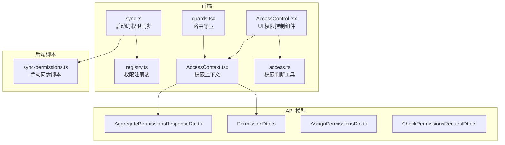
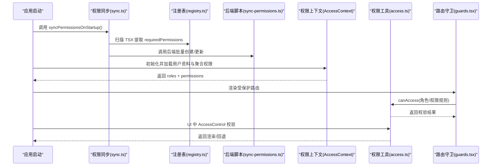
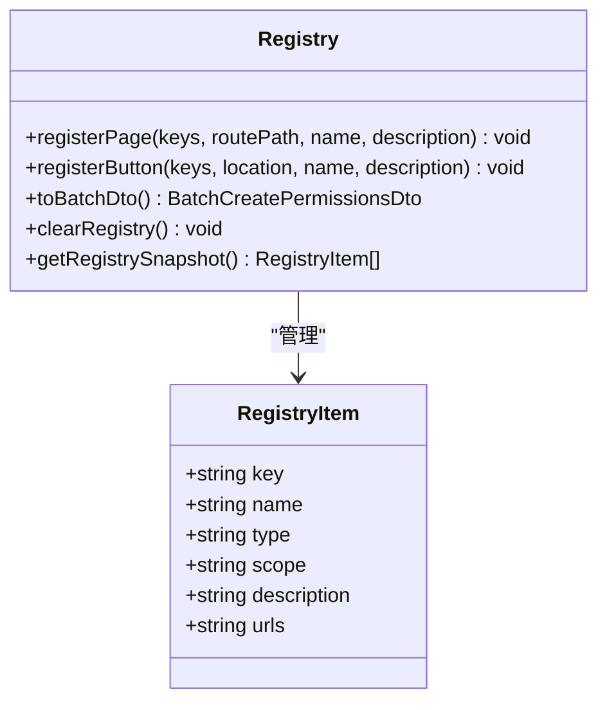
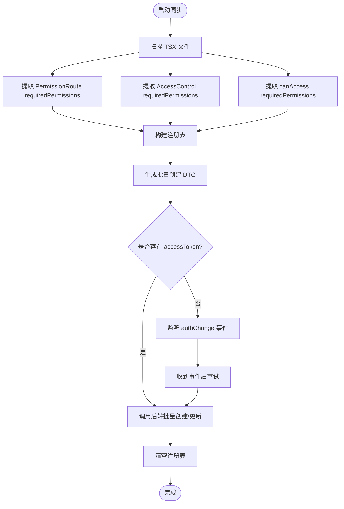
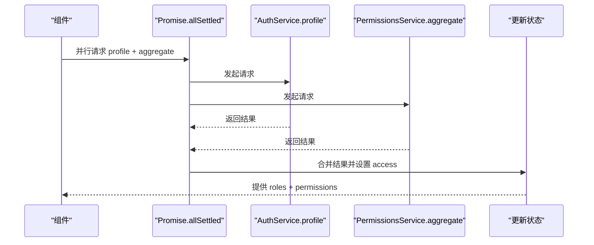
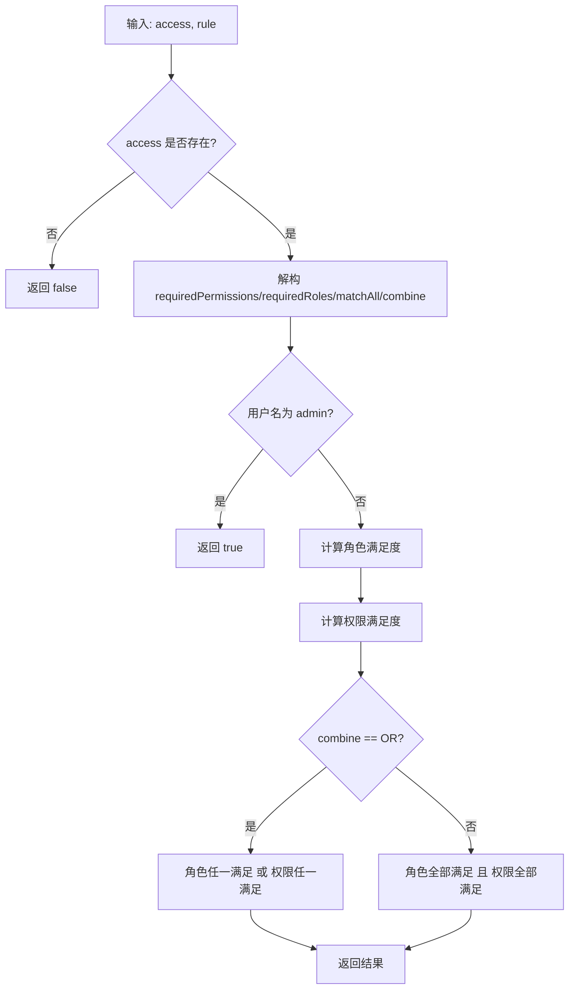
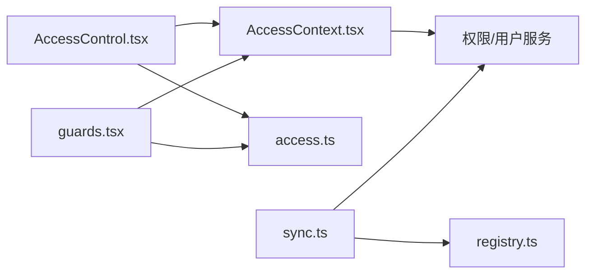
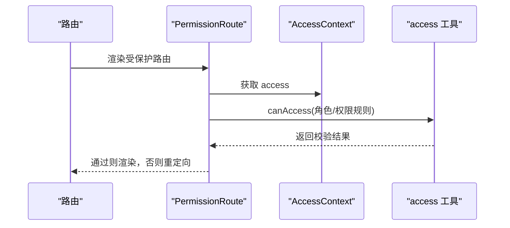

# 权限控制系统

<cite>
**本文档引用的文件**
- [AccessControl.tsx](file://src/permissions/AccessControl.tsx)
- [registry.ts](file://src/permissions/registry.ts)
- [sync.ts](file://src/permissions/sync.ts)
- [AccessContext.tsx](file://src/context/AccessContext.tsx)
- [access.ts](file://src/utils/access.ts)
- [guards.tsx](file://src/routes/guards.tsx)
- [AggregatePermissionsResponseDto.ts](file://src/api/models/AggregatePermissionsResponseDto.ts)
- [PermissionDto.ts](file://src/api/models/PermissionDto.ts)
- [AssignPermissionsDto.ts](file://src/api/models/AssignPermissionsDto.ts)
- [CheckPermissionsRequestDto.ts](file://src/api/models/CheckPermissionsRequestDto.ts)
- [sync-permissions.ts](file://scripts/sync-permissions.ts)
- [main.tsx](file://src/main.tsx)
</cite>

## 目录
1. [简介](#简介)
2. [项目结构](#项目结构)
3. [核心组件](#核心组件)
4. [架构总览](#架构总览)
5. [详细组件分析](#详细组件分析)
6. [依赖关系分析](#依赖关系分析)
7. [性能考量](#性能考量)
8. [故障排查指南](#故障排查指南)
9. [结论](#结论)
10. [附录](#附录)

## 简介
本文件系统性阐述 zTorrent-site 的权限控制系统，包括基于角色的权限模型、动态权限配置与权限继承机制、权限同步与实时更新、缓存与聚合策略、组件实现原理、验证流程与安全考虑，并提供配置示例与扩展指南，帮助开发者实现细粒度的访问控制。

## 项目结构
权限控制相关代码主要分布在以下模块：
- 前端权限注册与同步：src/permissions 下的 AccessControl、registry、sync
- 权限上下文与聚合：src/context/AccessContext、src/utils/access
- 路由守卫：src/routes/guards
- API 模型：src/api/models 下的权限相关 DTO
- 后端同步脚本：scripts/sync-permissions.ts
- 应用入口：src/main.tsx

**图表来源**
- [AccessControl.tsx](file://src/permissions/AccessControl.tsx#L1-L43)
- [registry.ts](file://src/permissions/registry.ts#L1-L129)
- [sync.ts](file://src/permissions/sync.ts#L1-L159)
- [AccessContext.tsx](file://src/context/AccessContext.tsx#L1-L181)
- [access.ts](file://src/utils/access.ts#L1-L65)
- [guards.tsx](file://src/routes/guards.tsx#L1-L103)
- [AggregatePermissionsResponseDto.ts](file://src/api/models/AggregatePermissionsResponseDto.ts#L1-L9)
- [PermissionDto.ts](file://src/api/models/PermissionDto.ts#L1-L85)
- [AssignPermissionsDto.ts](file://src/api/models/AssignPermissionsDto.ts#L1-L16)
- [CheckPermissionsRequestDto.ts](file://src/api/models/CheckPermissionsRequestDto.ts#L1-L9)
- [sync-permissions.ts](file://scripts/sync-permissions.ts#L1-L718)

**章节来源**
- [AccessControl.tsx](file://src/permissions/AccessControl.tsx#L1-L43)
- [registry.ts](file://src/permissions/registry.ts#L1-L129)
- [sync.ts](file://src/permissions/sync.ts#L1-L159)
- [AccessContext.tsx](file://src/context/AccessContext.tsx#L1-L181)
- [access.ts](file://src/utils/access.ts#L1-L65)
- [guards.tsx](file://src/routes/guards.tsx#L1-L103)
- [AggregatePermissionsResponseDto.ts](file://src/api/models/AggregatePermissionsResponseDto.ts#L1-L9)
- [PermissionDto.ts](file://src/api/models/PermissionDto.ts#L1-L85)
- [AssignPermissionsDto.ts](file://src/api/models/AssignPermissionsDto.ts#L1-L16)
- [CheckPermissionsRequestDto.ts](file://src/api/models/CheckPermissionsRequestDto.ts#L1-L9)
- [sync-permissions.ts](file://scripts/sync-permissions.ts#L1-L718)
- [main.tsx](file://src/main.tsx#L1-L18)

## 核心组件
- 权限注册表（registry.ts）：在应用启动或扫描阶段收集页面/按钮权限键，统一去重并导出批量创建 DTO，支持页面与按钮两类权限类型，WEB 作用域，可记录关联 URL。
- 权限同步（sync.ts）：启动时扫描 TSX 文件，提取 PermissionRoute/AccessControl/canAccess 的 requiredPermissions，构造批量创建请求并调用后端接口；未登录时监听 authChange 事件后重试。
- 权限上下文（AccessContext.tsx）：全局管理用户角色与权限，初始化时并行拉取用户资料与聚合权限，支持加载状态与错误处理，监听 authChange 自动刷新。
- 权限判断工具（access.ts）：提供 canAccess 方法，支持角色与权限的 AND/OR 组合、组内 matchAll 策略、管理员用户名超级放行。
- 权限控制组件（AccessControl.tsx）：在 UI 层根据权限规则渲染子组件或回退元素，加载期间不渲染。
- 路由守卫（guards.tsx）：提供 PermissionRoute 实现，支持角色与权限校验、组合策略、管理员放行与加载态提示。
- API 模型：定义权限实体、聚合响应、分配与检查请求等数据结构。

**章节来源**
- [registry.ts](file://src/permissions/registry.ts#L1-L129)
- [sync.ts](file://src/permissions/sync.ts#L1-L159)
- [AccessContext.tsx](file://src/context/AccessContext.tsx#L1-L181)
- [access.ts](file://src/utils/access.ts#L1-L65)
- [AccessControl.tsx](file://src/permissions/AccessControl.tsx#L1-L43)
- [guards.tsx](file://src/routes/guards.tsx#L1-L103)
- [AggregatePermissionsResponseDto.ts](file://src/api/models/AggregatePermissionsResponseDto.ts#L1-L9)
- [PermissionDto.ts](file://src/api/models/PermissionDto.ts#L1-L85)
- [AssignPermissionsDto.ts](file://src/api/models/AssignPermissionsDto.ts#L1-L16)
- [CheckPermissionsRequestDto.ts](file://src/api/models/CheckPermissionsRequestDto.ts#L1-L9)

## 架构总览
前端权限控制采用“注册-同步-聚合-校验”的闭环：
- 注册：在开发期或启动期扫描组件，收集权限键与 URL。
- 同步：将权限注册表批量创建/更新至后端。
- 聚合：应用启动时并行获取用户资料与聚合权限，合并为最终权限集合。
- 校验：在 UI 层（AccessControl）与路由层（PermissionRoute）执行权限判断。

**图表来源**
- [sync.ts](file://src/permissions/sync.ts#L17-L38)
- [registry.ts](file://src/permissions/registry.ts#L89-L101)
- [sync-permissions.ts](file://scripts/sync-permissions.ts#L91-L95)
- [AccessContext.tsx](file://src/context/AccessContext.tsx#L83-L155)
- [access.ts](file://src/utils/access.ts#L16-L63)
- [guards.tsx](file://src/routes/guards.tsx#L20-L102)

## 详细组件分析

### 权限注册表（registry.ts）
- 功能：收集页面与按钮权限键，去重并导出批量创建 DTO；支持页面类型记录路由 path，按钮类型记录位置辅助信息。
- 数据结构：Map 以 key 为索引，条目包含 key、name、type、scope、description、urls。
- 输出：toBatchDto 返回 BatchCreatePermissionsDto，包含 items 数组。

**图表来源**
- [registry.ts](file://src/permissions/registry.ts#L18-L27)
- [registry.ts](file://src/permissions/registry.ts#L89-L101)

**章节来源**
- [registry.ts](file://src/permissions/registry.ts#L1-L129)

### 权限同步（sync.ts）
- 启动同步：扫描项目内 TSX，提取 PermissionRoute、AccessControl、canAccess 的 requiredPermissions，构造批量创建请求；未登录时监听 authChange 事件后重试。
- 扫描规则：使用 import.meta.glob 原始文本读取，正则匹配 JSX 标签与属性，提取数组字面量内的权限键。
- 去重与整理：matchArrayLiterals 去重并提取字符串数组，safeAppendUrl 合并 URL。

**图表来源**
- [sync.ts](file://src/permissions/sync.ts#L74-L115)
- [sync.ts](file://src/permissions/sync.ts#L43-L64)

**章节来源**
- [sync.ts](file://src/permissions/sync.ts#L1-L159)

### 权限上下文（AccessContext.tsx）
- 初始化：检测本地是否存在 accessToken，若存在则进入加载状态；并行请求用户资料与聚合权限。
- 回退策略：Profile API 失败时尝试从 JWT token 解析用户名（仅用于 UI 显示），聚合权限失败时回退到 Profile 的权限。
- 事件驱动：监听 window.authChange 事件，自动重新加载权限。

**图表来源**
- [AccessContext.tsx](file://src/context/AccessContext.tsx#L96-L154)

**章节来源**
- [AccessContext.tsx](file://src/context/AccessContext.tsx#L1-L181)

### 权限判断工具（access.ts）
- 规则：支持 requiredPermissions、requiredRoles、matchAll（组内 AND/OR）、combine（角色组与权限组关系 AND/OR）。
- 特殊放行：用户名为 admin 直接通过。
- 与路由守卫一致：PermissionRoute 内部逻辑与 canAccess 保持一致。

**图表来源**
- [access.ts](file://src/utils/access.ts#L16-L63)

**章节来源**
- [access.ts](file://src/utils/access.ts#L1-L65)

### 权限控制组件（AccessControl.tsx）
- 作用：在 UI 层根据权限规则决定是否渲染 children 或 fallback。
- 加载策略：loading 期间不渲染，避免闪烁或错误跳转。

**章节来源**
- [AccessControl.tsx](file://src/permissions/AccessControl.tsx#L1-L43)

### 路由守卫（guards.tsx）
- PermissionRoute：支持 requiredPermissions、requiredRoles、matchAll、combine；管理员直接放行；加载期间显示提示；不满足时重定向到首页。
- AuthRoute：仅判断登录态。

**章节来源**
- [guards.tsx](file://src/routes/guards.tsx#L1-L103)

### API 模型与后端交互
- PermissionDto：后端权限实体，包含 key、name、type、scope、parentId、parentIds、sort、sorts、urls 等字段。
- AggregatePermissionsResponseDto：聚合权限响应，包含 permissions 数组。
- AssignPermissionsDto：分配权限请求，包含 userId 与 permissionKeys。
- CheckPermissionsRequestDto：检查权限请求，包含 keys 数组。

**章节来源**
- [PermissionDto.ts](file://src/api/models/PermissionDto.ts#L1-L85)
- [AggregatePermissionsResponseDto.ts](file://src/api/models/AggregatePermissionsResponseDto.ts#L1-L9)
- [AssignPermissionsDto.ts](file://src/api/models/AssignPermissionsDto.ts#L1-L16)
- [CheckPermissionsRequestDto.ts](file://src/api/models/CheckPermissionsRequestDto.ts#L1-L9)

## 依赖关系分析
- 组件耦合：
  - AccessControl 依赖 AccessContext 与 access 工具。
  - PermissionRoute 依赖 AccessContext 与 access 工具。
  - sync.ts 依赖 registry.ts 与后端权限服务。
  - AccessContext 依赖 AuthService 与 PermissionsService。
- 外部依赖：
  - 后端权限服务：批量创建/更新、聚合权限、检查权限等接口。
  - 浏览器存储：localStorage 中的 accessToken。
  - 自定义事件：window.authChange 用于登录态变更通知。

**图表来源**
- [AccessControl.tsx](file://src/permissions/AccessControl.tsx#L1-L43)
- [guards.tsx](file://src/routes/guards.tsx#L1-L103)
- [sync.ts](file://src/permissions/sync.ts#L1-L159)
- [registry.ts](file://src/permissions/registry.ts#L1-L129)
- [AccessContext.tsx](file://src/context/AccessContext.tsx#L1-L181)

**章节来源**
- [AccessControl.tsx](file://src/permissions/AccessControl.tsx#L1-L43)
- [guards.tsx](file://src/routes/guards.tsx#L1-L103)
- [sync.ts](file://src/permissions/sync.ts#L1-L159)
- [registry.ts](file://src/permissions/registry.ts#L1-L129)
- [AccessContext.tsx](file://src/context/AccessContext.tsx#L1-L181)

## 性能考量
- 启动阶段并行请求：AccessContext 在初始化时并行获取用户资料与聚合权限，减少首屏等待。
- 批量创建：通过一次性批量创建/更新权限，降低网络往返次数。
- 注册表去重：使用 Set 去除重复权限键，减少后端压力。
- 扫描优化：Vite import.meta.glob 以原始文本方式读取，避免编译开销；正则匹配精准提取所需信息。
- 缓存策略：当前实现以内存 Map 为主，建议在后端引入缓存层（如 Redis）以加速权限查询与聚合。

[本节为通用性能建议，无需特定文件引用]

## 故障排查指南
- 权限同步失败：
  - 检查是否已登录（localStorage 是否存在 accessToken）；未登录时需等待 authChange 事件。
  - 查看控制台日志，确认批量创建接口调用是否成功。
  - 确认注册表是否为空（未发现需要同步的权限项）。
- 权限上下文加载异常：
  - Profile API 失败时会回退到 JWT token 解析用户名，但权限以聚合接口为准。
  - 聚合权限接口失败时会回退到 Profile 的权限列表。
- 路由守卫不生效：
  - 确认 PermissionRoute 的 requiredPermissions/requiredRoles 配置正确。
  - 检查 combine 与 matchAll 策略是否符合预期。
  - 确认未处于 loading 状态（加载期间会显示提示）。

**章节来源**
- [sync.ts](file://src/permissions/sync.ts#L35-L37)
- [AccessContext.tsx](file://src/context/AccessContext.tsx#L128-L134)
- [guards.tsx](file://src/routes/guards.tsx#L39-L87)

## 结论
zTorrent-site 的权限控制系统通过“注册-同步-聚合-校验”的完整链路，实现了前端侧的细粒度访问控制。基于角色与权限的 AND/OR 组合、组内 matchAll 策略以及管理员超级放行，既保证了灵活性，又确保了安全性。配合启动时的批量同步与上下文的自动刷新，系统具备良好的实时性与可维护性。

[本节为总结性内容，无需特定文件引用]

## 附录

### 权限模型与继承机制
- 角色与权限：
  - 角色：用户所属的角色集合，用于粗粒度授权。
  - 权限：细粒度的权限键集合，用于精确控制功能与资源访问。
- 继承与组合：
  - 角色与权限可同时存在，combine 支持 AND/OR 组合。
  - 组内 matchAll 控制“全部满足（AND）”或“任一满足（OR）”。

**章节来源**
- [access.ts](file://src/utils/access.ts#L9-L14)
- [guards.tsx](file://src/routes/guards.tsx#L42-L77)

### 动态权限配置与实时更新
- 动态配置：
  - 通过 AccessControl 与 PermissionRoute 的 requiredPermissions/requiredRoles/matchAll/combine 实现运行时配置。
- 实时更新：
  - 登录/登出时通过 window.authChange 事件触发 AccessContext 重新加载。
  - 启动时自动扫描并同步权限，未登录时延迟到登录后执行。

**章节来源**
- [AccessControl.tsx](file://src/permissions/AccessControl.tsx#L17-L42)
- [guards.tsx](file://src/routes/guards.tsx#L157-L165)
- [sync.ts](file://src/permissions/sync.ts#L22-L34)

### 缓存管理策略
- 前端缓存：
  - 内存 Map 保存权限注册表，启动后清空，避免重复同步。
- 后端缓存：
  - 建议对权限树、聚合结果与用户权限进行缓存，结合失效策略提升查询性能。

**章节来源**
- [registry.ts](file://src/permissions/registry.ts#L106-L108)
- [sync.ts](file://src/permissions/sync.ts#L60-L64)

### 权限验证流程
- 路由层：PermissionRoute 在渲染受保护路由前进行权限校验，管理员直接放行。
- UI 层：AccessControl 在渲染具体组件前进行权限校验，加载期间不渲染。

**图表来源**
- [guards.tsx](file://src/routes/guards.tsx#L20-L102)
- [access.ts](file://src/utils/access.ts#L16-L63)

### 安全考虑
- 管理员放行：用户名为 admin 的用户可绕过权限校验，需谨慎配置与审计。
- 前后端协同：前端仅做 UI 层控制，关键业务逻辑应在后端严格校验。
- Token 降级：Profile API 失败时从 JWT 解析用户名仅用于 UI 显示，权限仍由后端动态路由与权限接口保障。

**章节来源**
- [access.ts](file://src/utils/access.ts#L28-L29)
- [AccessContext.tsx](file://src/context/AccessContext.tsx#L128-L134)

### 权限配置示例与扩展指南
- 页面权限：
  - 在路由包裹 PermissionRoute，并设置 requiredPermissions。
  - 使用 registerPage 注册页面权限键与路由 path。
- 按钮权限：
  - 在按钮上使用 AccessControl 或在代码中调用 canAccess。
  - 使用 registerButton 注册按钮权限键与位置辅助信息。
- 扩展策略：
  - 新增权限类型：在注册表中扩展 type/scope 字段。
  - 新增组合策略：在 canAccess 与 PermissionRoute 中扩展 combine/matchAll。
  - 新增后端接口：通过 AssignPermissionsDto/CheckPermissionsRequestDto 与后端权限服务对接。

**章节来源**
- [registry.ts](file://src/permissions/registry.ts#L36-L83)
- [AccessControl.tsx](file://src/permissions/AccessControl.tsx#L5-L11)
- [guards.tsx](file://src/routes/guards.tsx#L20-L34)
- [AssignPermissionsDto.ts](file://src/api/models/AssignPermissionsDto.ts#L1-L16)
- [CheckPermissionsRequestDto.ts](file://src/api/models/CheckPermissionsRequestDto.ts#L1-L9)