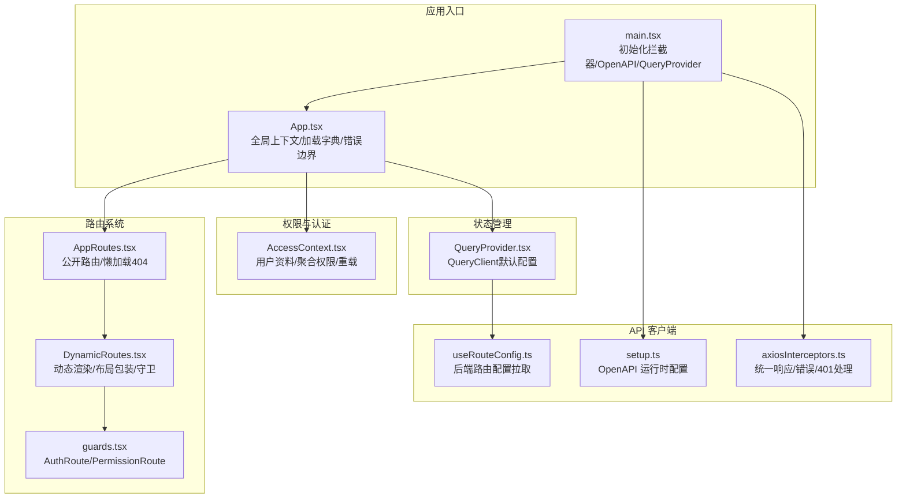
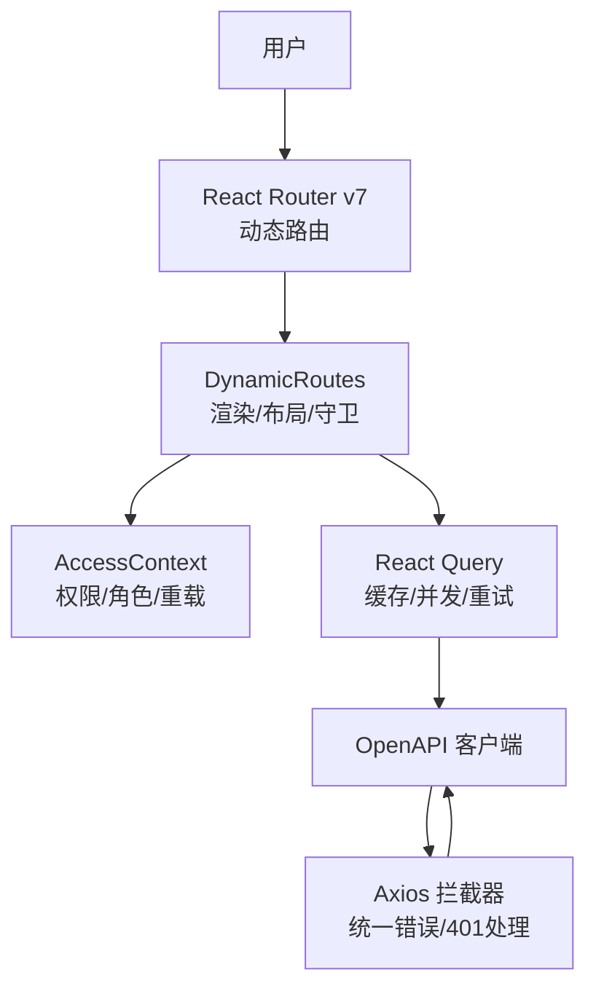
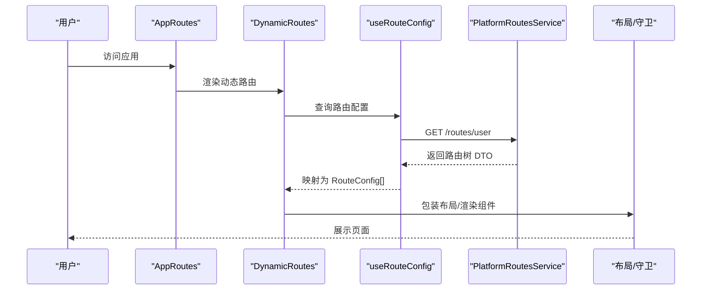
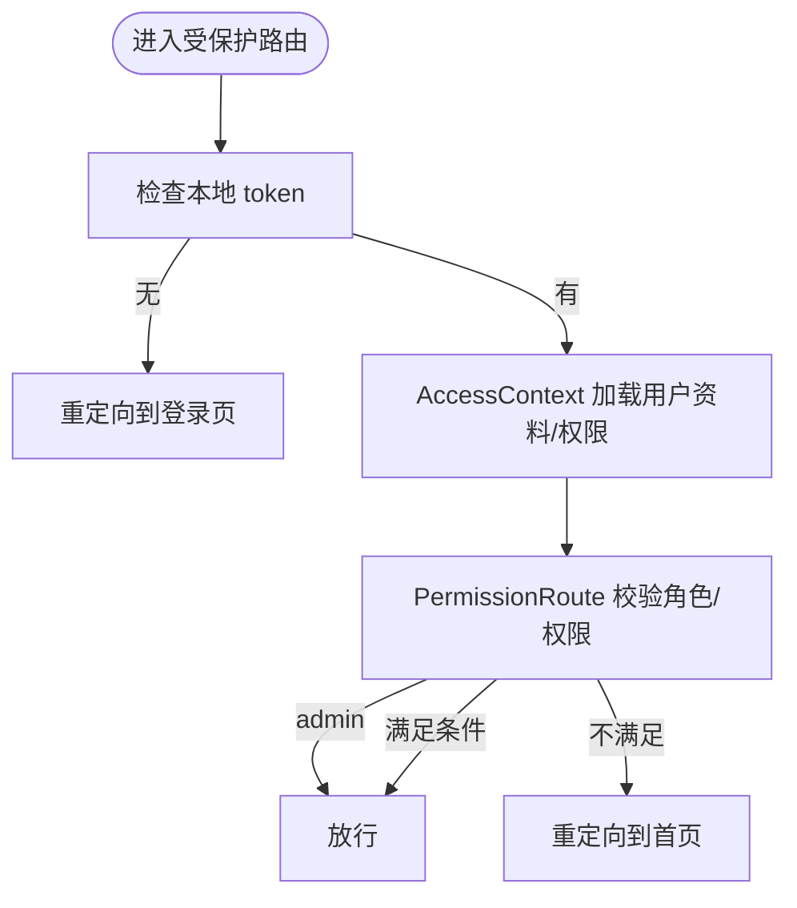
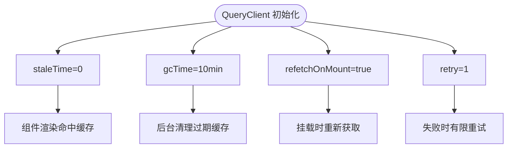
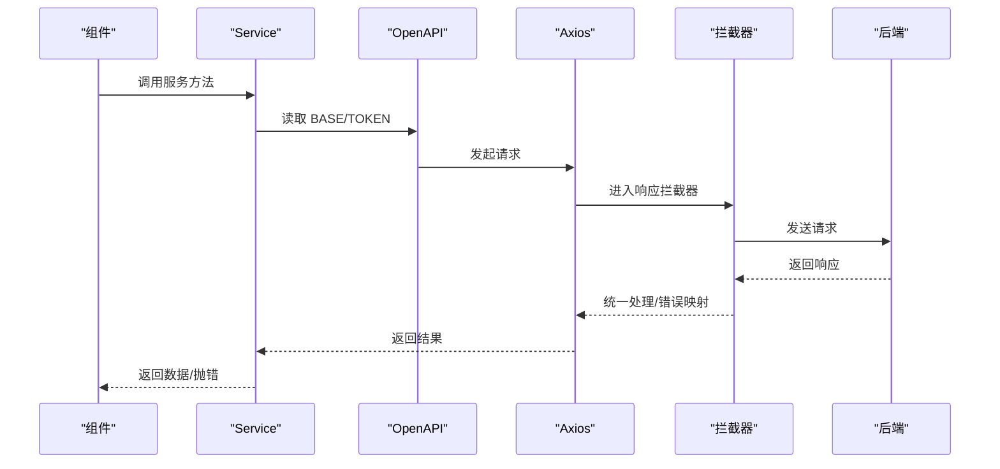
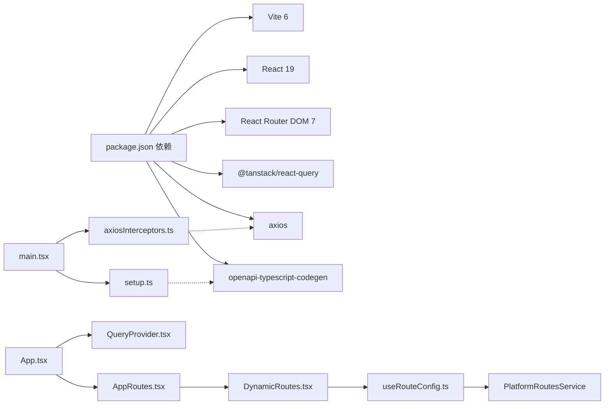

# 架构设计

<cite>
**本文引用的文件**
- [README.md](file://README.md)
- [package.json](file://package.json)
- [vite.config.ts](file://vite.config.ts)
- [src/main.tsx](file://src/main.tsx)
- [src/App.tsx](file://src/App.tsx)
- [src/routes/AppRoutes.tsx](file://src/routes/AppRoutes.tsx)
- [src/routes/DynamicRoutes.tsx](file://src/routes/DynamicRoutes.tsx)
- [src/providers/QueryProvider.tsx](file://src/providers/QueryProvider.tsx)
- [src/context/AccessContext.tsx](file://src/context/AccessContext.tsx)
- [src/hooks/useRouteConfig.ts](file://src/hooks/useRouteConfig.ts)
- [src/routes/guards.tsx](file://src/routes/guards.tsx)
- [src/api/setup.ts](file://src/api/setup.ts)
- [src/api/axiosInterceptors.ts](file://src/api/axiosInterceptors.ts)
- [src/types/routeConfig.ts](file://src/types/routeConfig.ts)
</cite>

## 目录
1. [简介](#简介)
2. [项目结构](#项目结构)
3. [核心组件](#核心组件)
4. [架构总览](#架构总览)
5. [详细组件分析](#详细组件分析)
6. [依赖分析](#依赖分析)
7. [性能考量](#性能考量)
8. [故障排查指南](#故障排查指南)
9. [结论](#结论)
10. [附录](#附录)

## 简介
本项目为视频流媒体站点前端应用，采用 React 19 与 Vite 构建，结合动态路由系统、基于后端的权限控制、以及 React Query 的状态管理模式，形成“前端即服务”的可扩展架构。系统通过 OpenAPI 客户端与后端 API 通信，并在运行时注入统一的环境配置与拦截器，确保请求一致性与用户体验。

## 项目结构
- 应用入口与初始化
  - 入口文件负责初始化拦截器、OpenAPI 配置、并挂载 QueryProvider 与根组件。
- 路由体系
  - 使用 React Router v7 的动态路由能力，路由配置来源于后端，支持布局包装、重定向、新标签页打开等特性。
- 权限与认证
  - AccessContext 负责拉取用户资料与聚合权限；路由守卫根据权限与角色进行细粒度控制。
- 状态管理
  - React Query 提供查询客户端与缓存策略，配合懒加载与并发请求提升性能。
- API 客户端
  - 基于 openapi-typescript-codegen 生成的服务层，结合 axios 拦截器与 OpenAPI 运行时配置，统一处理鉴权、错误与提示。

图表来源
- [src/main.tsx](file://src/main.tsx#L1-L18)
- [src/App.tsx](file://src/App.tsx#L1-L52)
- [src/routes/AppRoutes.tsx](file://src/routes/AppRoutes.tsx#L1-L115)
- [src/routes/DynamicRoutes.tsx](file://src/routes/DynamicRoutes.tsx#L1-L308)
- [src/routes/guards.tsx](file://src/routes/guards.tsx#L1-L103)
- [src/context/AccessContext.tsx](file://src/context/AccessContext.tsx#L1-L181)
- [src/providers/QueryProvider.tsx](file://src/providers/QueryProvider.tsx#L1-L30)
- [src/api/setup.ts](file://src/api/setup.ts#L1-L35)
- [src/api/axiosInterceptors.ts](file://src/api/axiosInterceptors.ts#L1-L294)
- [src/hooks/useRouteConfig.ts](file://src/hooks/useRouteConfig.ts#L1-L109)

章节来源
- [src/main.tsx](file://src/main.tsx#L1-L18)
- [src/App.tsx](file://src/App.tsx#L1-L52)
- [src/routes/AppRoutes.tsx](file://src/routes/AppRoutes.tsx#L1-L115)
- [src/routes/DynamicRoutes.tsx](file://src/routes/DynamicRoutes.tsx#L1-L308)
- [src/routes/guards.tsx](file://src/routes/guards.tsx#L1-L103)
- [src/context/AccessContext.tsx](file://src/context/AccessContext.tsx#L1-L181)
- [src/providers/QueryProvider.tsx](file://src/providers/QueryProvider.tsx#L1-L30)
- [src/api/setup.ts](file://src/api/setup.ts#L1-L35)
- [src/api/axiosInterceptors.ts](file://src/api/axiosInterceptors.ts#L1-L294)
- [src/hooks/useRouteConfig.ts](file://src/hooks/useRouteConfig.ts#L1-L109)

## 核心组件
- 应用入口与初始化
  - 初始化 axios 拦截器与 OpenAPI 运行时配置，保证请求头与基础地址一致。
  - 使用 QueryProvider 包裹应用，提供全局查询客户端。
- 路由系统
  - AppRoutes 负责公开路由与懒加载 404；DynamicRoutes 基于后端配置渲染动态路由，支持布局包装、索引路由、重定向与新标签页打开。
- 权限与认证
  - AccessContext 并发拉取用户资料与聚合权限，支持本地 token 解析回退与事件驱动重载。
- 状态管理
  - QueryProvider 提供默认查询策略：staleTime=0、较长 gcTime、挂载时重新获取、有限重试，兼顾实时性与体验。
- API 客户端
  - setup.ts 统一读取 VITE_BASE_URL 并规范化；axiosInterceptors.ts 实现统一响应结构、错误码映射、401 自动跳转与静默/跳过策略。

章节来源
- [src/main.tsx](file://src/main.tsx#L1-L18)
- [src/App.tsx](file://src/App.tsx#L1-L52)
- [src/providers/QueryProvider.tsx](file://src/providers/QueryProvider.tsx#L1-L30)
- [src/routes/AppRoutes.tsx](file://src/routes/AppRoutes.tsx#L1-L115)
- [src/routes/DynamicRoutes.tsx](file://src/routes/DynamicRoutes.tsx#L1-L308)
- [src/context/AccessContext.tsx](file://src/context/AccessContext.tsx#L1-L181)
- [src/api/setup.ts](file://src/api/setup.ts#L1-L35)
- [src/api/axiosInterceptors.ts](file://src/api/axiosInterceptors.ts#L1-L294)

## 架构总览
系统采用“前端即服务”架构：路由与权限由后端下发，前端通过动态路由渲染与守卫实现安全访问；API 通过 OpenAPI 与拦截器统一处理鉴权与错误；状态管理通过 React Query 提升数据一致性与用户体验。

图表来源
- [src/routes/DynamicRoutes.tsx](file://src/routes/DynamicRoutes.tsx#L1-L308)
- [src/context/AccessContext.tsx](file://src/context/AccessContext.tsx#L1-L181)
- [src/providers/QueryProvider.tsx](file://src/providers/QueryProvider.tsx#L1-L30)
- [src/api/setup.ts](file://src/api/setup.ts#L1-L35)
- [src/api/axiosInterceptors.ts](file://src/api/axiosInterceptors.ts#L1-L294)

## 详细组件分析

### 动态路由系统
- 设计要点
  - 路由配置来源于后端，前端仅负责渲染与守卫。
  - 支持布局包装（app/admin/forum/none）、索引路由、重定向（含新标签页）、子路由过滤与启用状态。
  - 对未启用的路由进行过滤，避免渲染无效节点。
- 关键流程
  - AppRoutes 负责公开路由与懒加载 404；DynamicRoutes 使用 useRouteConfig 拉取后端路由树，映射为前端 RouteConfig 并递归渲染。
  - 布局包装通过 getLayoutWrapper 选择 AppLayout/AdminLayout 或无布局；重定向优先级高于子路由。
- 代码片段路径
  - [src/routes/AppRoutes.tsx](file://src/routes/AppRoutes.tsx#L1-L115)
  - [src/routes/DynamicRoutes.tsx](file://src/routes/DynamicRoutes.tsx#L1-L308)
  - [src/hooks/useRouteConfig.ts](file://src/hooks/useRouteConfig.ts#L1-L109)
  - [src/types/routeConfig.ts](file://src/types/routeConfig.ts#L1-L49)

图表来源
- [src/routes/AppRoutes.tsx](file://src/routes/AppRoutes.tsx#L1-L115)
- [src/routes/DynamicRoutes.tsx](file://src/routes/DynamicRoutes.tsx#L1-L308)
- [src/hooks/useRouteConfig.ts](file://src/hooks/useRouteConfig.ts#L1-L109)

章节来源
- [src/routes/AppRoutes.tsx](file://src/routes/AppRoutes.tsx#L1-L115)
- [src/routes/DynamicRoutes.tsx](file://src/routes/DynamicRoutes.tsx#L1-L308)
- [src/hooks/useRouteConfig.ts](file://src/hooks/useRouteConfig.ts#L1-L109)
- [src/types/routeConfig.ts](file://src/types/routeConfig.ts#L1-L49)

### 权限控制机制
- 设计要点
  - AccessContext 并发获取用户资料与聚合权限，支持本地 token 解析回退；监听 authChange 事件与 storage 事件，确保跨标签页同步。
  - 路由守卫 PermissionRoute 支持角色与权限的 AND/OR 组合、matchAll 控制、admin 用户直通。
- 关键流程
  - 登录成功后触发 authChange，useRouteConfig.enabled=true，重新拉取路由配置；权限变更后，PermissionRoute 重新计算授权。
- 代码片段路径
  - [src/context/AccessContext.tsx](file://src/context/AccessContext.tsx#L1-L181)
  - [src/routes/guards.tsx](file://src/routes/guards.tsx#L1-L103)
  - [src/hooks/useRouteConfig.ts](file://src/hooks/useRouteConfig.ts#L1-L109)

图表来源
- [src/context/AccessContext.tsx](file://src/context/AccessContext.tsx#L1-L181)
- [src/routes/guards.tsx](file://src/routes/guards.tsx#L1-L103)

章节来源
- [src/context/AccessContext.tsx](file://src/context/AccessContext.tsx#L1-L181)
- [src/routes/guards.tsx](file://src/routes/guards.tsx#L1-L103)
- [src/hooks/useRouteConfig.ts](file://src/hooks/useRouteConfig.ts#L1-L109)

### 状态管理模式（React Query）
- 设计要点
  - 默认策略：staleTime=0（立即视为过期）、gcTime=10 分钟、refetchOnMount=true、retry=1；减少窗口焦点/挂载时的重复请求，提升“秒开”体验。
  - 与懒加载结合，避免不必要的数据预取。
- 代码片段路径
  - [src/providers/QueryProvider.tsx](file://src/providers/QueryProvider.tsx#L1-L30)

图表来源
- [src/providers/QueryProvider.tsx](file://src/providers/QueryProvider.tsx#L1-L30)

章节来源
- [src/providers/QueryProvider.tsx](file://src/providers/QueryProvider.tsx#L1-L30)

### API 客户端架构
- 设计要点
  - OpenAPI 运行时配置：统一读取 VITE_BASE_URL 并去除尾部斜杠；TOKEN 从 localStorage 读取。
  - axios 拦截器：统一响应结构、业务错误码映射、HTTP 401 自动清除 token 并跳转登录、支持静默与跳过错误码。
- 代码片段路径
  - [src/api/setup.ts](file://src/api/setup.ts#L1-L35)
  - [src/api/axiosInterceptors.ts](file://src/api/axiosInterceptors.ts#L1-L294)

图表来源
- [src/api/setup.ts](file://src/api/setup.ts#L1-L35)
- [src/api/axiosInterceptors.ts](file://src/api/axiosInterceptors.ts#L1-L294)

章节来源
- [src/api/setup.ts](file://src/api/setup.ts#L1-L35)
- [src/api/axiosInterceptors.ts](file://src/api/axiosInterceptors.ts#L1-L294)

## 依赖分析
- 技术栈与版本
  - React 19、Vite 6、React Router DOM 7、React Query 5、Axios、TailwindCSS 4。
- 关键依赖与作用
  - 构建与编译：Vite + React Compiler（面向 React 19 优化）。
  - 状态管理：@tanstack/react-query。
  - HTTP 客户端：axios + openapi-typescript-codegen 生成的服务层。
  - UI 与工具：Radix UI、Framer Motion、Zustand（局部状态）、Sonner（通知）。
- 代码级依赖关系
  - main.tsx 依赖 axiosInterceptors 与 setup；App.tsx 依赖 QueryProvider、AccessContext、AppRoutes。
  - DynamicRoutes 依赖 useRouteConfig 与 guards；useRouteConfig 依赖 PlatformRoutesService。
  - axiosInterceptors 与 setup 彼此独立，分别负责运行时配置与拦截器安装。

图表来源
- [package.json](file://package.json#L1-L148)
- [src/main.tsx](file://src/main.tsx#L1-L18)
- [src/App.tsx](file://src/App.tsx#L1-L52)
- [src/routes/AppRoutes.tsx](file://src/routes/AppRoutes.tsx#L1-L115)
- [src/routes/DynamicRoutes.tsx](file://src/routes/DynamicRoutes.tsx#L1-L308)
- [src/hooks/useRouteConfig.ts](file://src/hooks/useRouteConfig.ts#L1-L109)
- [src/api/axiosInterceptors.ts](file://src/api/axiosInterceptors.ts#L1-L294)
- [src/api/setup.ts](file://src/api/setup.ts#L1-L35)

章节来源
- [package.json](file://package.json#L1-L148)
- [src/main.tsx](file://src/main.tsx#L1-L18)
- [src/App.tsx](file://src/App.tsx#L1-L52)
- [src/routes/AppRoutes.tsx](file://src/routes/AppRoutes.tsx#L1-L115)
- [src/routes/DynamicRoutes.tsx](file://src/routes/DynamicRoutes.tsx#L1-L308)
- [src/hooks/useRouteConfig.ts](file://src/hooks/useRouteConfig.ts#L1-L109)
- [src/api/axiosInterceptors.ts](file://src/api/axiosInterceptors.ts#L1-L294)
- [src/api/setup.ts](file://src/api/setup.ts#L1-L35)

## 性能考量
- 构建与打包
  - Vite 使用 esbuild 压缩，Rollup 手动分包 vendor：react-vendor、ui-vendor、data-vendor、chart-vendor、utils-vendor，降低重复依赖与首屏体积。
  - 优化依赖去重与预构建，减少冷启动时间。
- 运行时性能
  - React Query 默认策略：staleTime=0、较长 gcTime，提升页面切换与返回的“秒开”体验；refetchOnMount 确保数据新鲜度。
  - 动态路由按需懒加载组件与布局，避免一次性加载全部页面。
  - axios 拦截器统一错误处理，减少重复的错误分支逻辑。
- 代码生成与类型安全
  - openapi-typescript-codegen 生成强类型服务层，减少手写样板代码与类型不一致风险。

## 故障排查指南
- 登录态异常
  - 现象：路由跳转到登录页或权限不足。
  - 排查：确认 localStorage 中是否存在 accessToken；检查 AccessContext 是否正确加载用户资料与权限；监听 authChange 事件是否触发。
- 401/未授权
  - 现象：出现“登录已过期，请重新登录”提示并跳转。
  - 排查：拦截器会自动清除 token 并触发 authChange；检查后端是否正确返回业务码；确认 VITE_BASE_URL 配置是否正确。
- 路由不生效
  - 现象：访问 /admin 或特定页面无响应。
  - 排查：useRouteConfig 是否 enabled=true；后端是否返回 admin 节点；DynamicRoutes 是否正确过滤 isEnabled=false 的路由。
- 错误提示过多
  - 现象：频繁弹出错误提示。
  - 排查：在请求 meta 中设置 silent 或 skipErrorCodes/skipBusinessCodes；确认业务码映射是否符合预期。

章节来源
- [src/context/AccessContext.tsx](file://src/context/AccessContext.tsx#L1-L181)
- [src/api/axiosInterceptors.ts](file://src/api/axiosInterceptors.ts#L1-L294)
- [src/hooks/useRouteConfig.ts](file://src/hooks/useRouteConfig.ts#L1-L109)
- [src/routes/DynamicRoutes.tsx](file://src/routes/DynamicRoutes.tsx#L1-L308)

## 结论
本项目通过“后端驱动的动态路由 + 前端强一致的状态与拦截器”实现了高内聚、低耦合的前端架构。React 19 与 Vite 的组合提供了现代化的开发与构建体验；React Query 的默认策略在实时性与性能间取得平衡；权限控制与 API 客户端的统一抽象提升了可维护性与可扩展性。建议持续关注后端路由与权限的演进，保持前端动态配置与守卫策略的一致性。

## 附录
- 环境变量
  - VITE_BASE_URL：后端基础地址，初始化 OpenAPI.BASE。
- 构建脚本
  - dev/build：分别对应开发与生产构建；api:generate 用于从后端 OpenAPI JSON 生成客户端代码。
- 重要路径
  - 应用入口：src/main.tsx
  - 根组件：src/App.tsx
  - 路由入口：src/routes/AppRoutes.tsx
  - 动态路由：src/routes/DynamicRoutes.tsx
  - 权限上下文：src/context/AccessContext.tsx
  - 查询提供者：src/providers/QueryProvider.tsx
  - OpenAPI 初始化：src/api/setup.ts
  - Axios 拦截器：src/api/axiosInterceptors.ts
  - 路由配置类型：src/types/routeConfig.ts