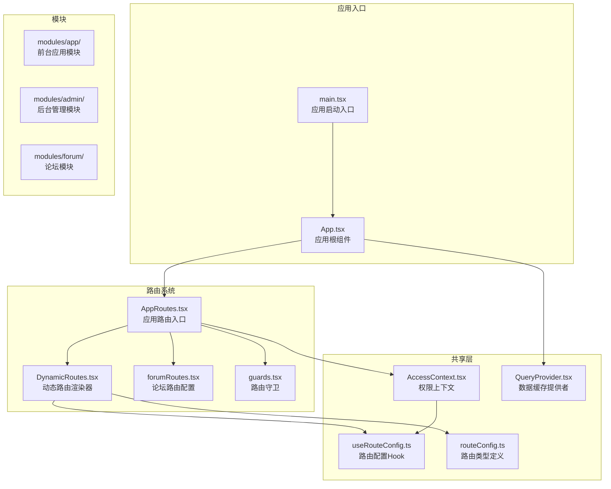
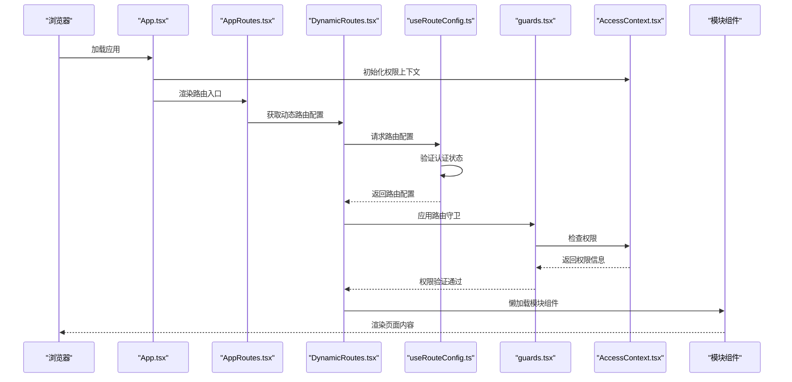
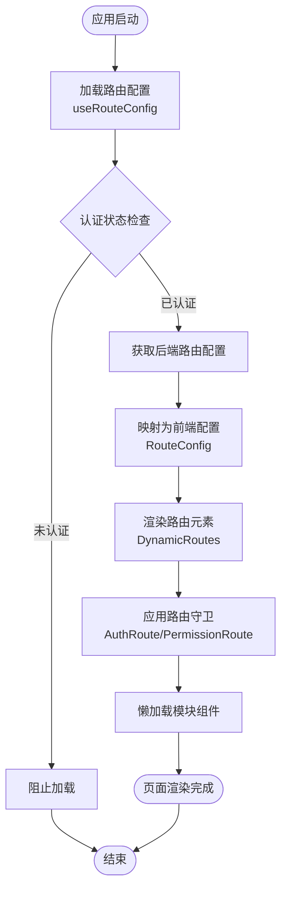
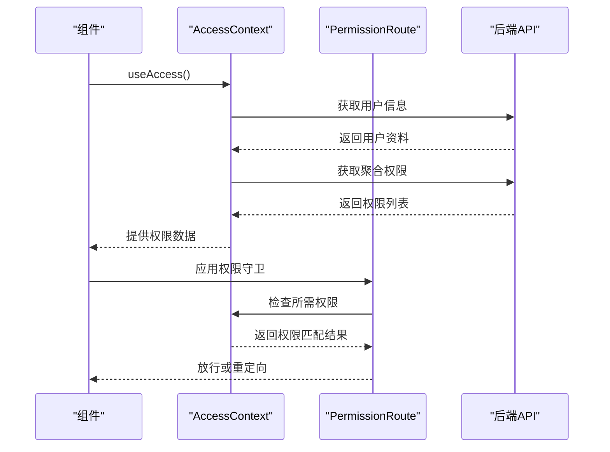
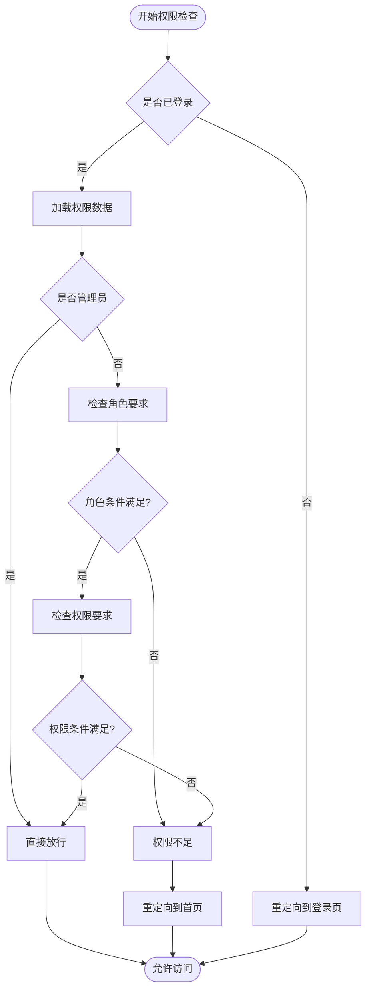
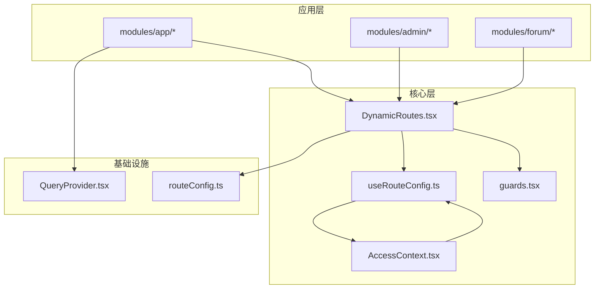

# 模块化架构设计

<cite>
**本文档引用的文件**
- [README.md](file://README.md)
- [main.tsx](file://src/main.tsx)
- [App.tsx](file://src/App.tsx)
- [AppRoutes.tsx](file://src/routes/AppRoutes.tsx)
- [DynamicRoutes.tsx](file://src/routes/DynamicRoutes.tsx)
- [forumRoutes.tsx](file://src/routes/forumRoutes.tsx)
- [useRouteConfig.ts](file://src/hooks/useRouteConfig.ts)
- [guards.tsx](file://src/routes/guards.tsx)
- [AccessContext.tsx](file://src/context/AccessContext.tsx)
- [QueryProvider.tsx](file://src/providers/QueryProvider.tsx)
- [routeConfig.ts](file://src/types/routeConfig.ts)
</cite>

## 目录
1. [简介](#简介)
2. [项目结构](#项目结构)
3. [核心组件](#核心组件)
4. [架构总览](#架构总览)
5. [详细组件分析](#详细组件分析)
6. [依赖关系分析](#依赖关系分析)
7. [性能考虑](#性能考虑)
8. [故障排除指南](#故障排除指南)
9. [结论](#结论)

## 简介
本项目采用模块化架构，将前台应用、后台管理、论坛三大功能域分离为独立模块，通过统一的动态路由系统和权限体系实现松耦合、高内聚的组织方式。该设计提升了代码复用性、可维护性和团队协作效率，支持按需加载和运行时权限控制。

## 项目结构
项目采用“按功能域分层”的模块化组织方式，核心目录结构如下：



**图表来源**
- [main.tsx](file://src/main.tsx#L1-L18)
- [App.tsx](file://src/App.tsx#L1-L52)
- [AppRoutes.tsx](file://src/routes/AppRoutes.tsx#L1-L115)
- [DynamicRoutes.tsx](file://src/routes/DynamicRoutes.tsx#L1-L308)
- [forumRoutes.tsx](file://src/routes/forumRoutes.tsx#L1-L106)

**章节来源**
- [README.md](file://README.md#L1-L11)
- [main.tsx](file://src/main.tsx#L1-L18)
- [App.tsx](file://src/App.tsx#L1-L52)

## 核心组件
三大核心模块各自承担明确职责，并通过统一的基础设施协同工作：

### 前台应用模块（App Module）
- **职责**：视频内容浏览、种子管理、用户交互
- **关键特性**：懒加载页面、全局主题切换、下载器集成
- **数据流**：通过全局查询客户端管理状态，权限上下文提供访问控制

### 后台管理模块（Admin Module）
- **职责**：系统管理、内容审核、用户管理、运营工具
- **关键特性**：基于权限的精细化控制、仪表板、批量操作
- **数据流**：动态路由配置驱动模块加载，权限守卫保障安全

### 论坛模块（Forum Module）
- **职责**：社区讨论、话题管理、标签系统
- **关键特性**：独立布局系统、话题 bounty、订阅管理
- **数据流**：独立路由体系，与应用模块解耦

**章节来源**
- [AppRoutes.tsx](file://src/routes/AppRoutes.tsx#L1-L115)
- [DynamicRoutes.tsx](file://src/routes/DynamicRoutes.tsx#L1-L308)
- [forumRoutes.tsx](file://src/routes/forumRoutes.tsx#L1-L106)

## 架构总览
系统采用“动态路由 + 权限控制 + 模块化”的整体架构：



**图表来源**
- [App.tsx](file://src/App.tsx#L21-L51)
- [AppRoutes.tsx](file://src/routes/AppRoutes.tsx#L73-L98)
- [DynamicRoutes.tsx](file://src/routes/DynamicRoutes.tsx#L255-L264)
- [useRouteConfig.ts](file://src/hooks/useRouteConfig.ts#L38-L108)
- [guards.tsx](file://src/routes/guards.tsx#L11-L15)
- [AccessContext.tsx](file://src/context/AccessContext.tsx#L64-L172)

## 详细组件分析

### 动态路由系统
动态路由系统是模块化架构的核心，实现了运行时的路由配置和模块加载：



**图表来源**
- [useRouteConfig.ts](file://src/hooks/useRouteConfig.ts#L38-L108)
- [DynamicRoutes.tsx](file://src/routes/DynamicRoutes.tsx#L56-L125)
- [guards.tsx](file://src/routes/guards.tsx#L11-L15)

#### 路由配置类型系统
```mermaid
classDiagram
class RouteConfig {
+string id
+string path
+string component
+LayoutType layout
+string[] permissions
+RouteConfig[] children
+string name
+boolean index
+string redirect
+boolean openInNewTab
+boolean isVisible
+boolean isEnabled
+string icon
}
class RouteConfigResponse {
+RouteConfig[] routes
}
class LayoutType {
<<enumeration>>
"app"
"admin"
"forum"
"none"
}
RouteConfig --> RouteConfig : "children"
RouteConfigResponse --> RouteConfig : "contains"
```

**图表来源**
- [routeConfig.ts](file://src/types/routeConfig.ts#L14-L41)

**章节来源**
- [DynamicRoutes.tsx](file://src/routes/DynamicRoutes.tsx#L1-L308)
- [routeConfig.ts](file://src/types/routeConfig.ts#L1-L49)

### 权限控制系统
权限系统通过上下文提供者和路由守卫实现多层安全保障：



**图表来源**
- [AccessContext.tsx](file://src/context/AccessContext.tsx#L64-L172)
- [guards.tsx](file://src/routes/guards.tsx#L20-L102)

#### 权限检查算法


**图表来源**
- [guards.tsx](file://src/routes/guards.tsx#L42-L77)

**章节来源**
- [AccessContext.tsx](file://src/context/AccessContext.tsx#L1-L181)
- [guards.tsx](file://src/routes/guards.tsx#L1-L103)

### 模块间通信机制
模块间通过以下机制实现松耦合通信：

1. **统一路由入口**：所有模块通过动态路由系统注册
2. **权限上下文**：提供跨模块的权限信息共享
3. **事件系统**：通过自定义事件实现状态同步
4. **懒加载机制**：按需加载模块，减少初始包体积

**章节来源**
- [AppRoutes.tsx](file://src/routes/AppRoutes.tsx#L73-L98)
- [DynamicRoutes.tsx](file://src/routes/DynamicRoutes.tsx#L39-L51)
- [AccessContext.tsx](file://src/context/AccessContext.tsx#L161-L165)

## 依赖关系分析
模块化架构的依赖关系呈现星型拓扑，中心为动态路由系统：



**图表来源**
- [DynamicRoutes.tsx](file://src/routes/DynamicRoutes.tsx#L1-L308)
- [useRouteConfig.ts](file://src/hooks/useRouteConfig.ts#L1-L109)
- [AccessContext.tsx](file://src/context/AccessContext.tsx#L1-L181)
- [QueryProvider.tsx](file://src/providers/QueryProvider.tsx#L1-L30)

**章节来源**
- [main.tsx](file://src/main.tsx#L1-L18)
- [App.tsx](file://src/App.tsx#L1-L52)

## 性能考虑
系统在多个层面优化性能表现：

### 懒加载策略
- **按需加载**：模块组件仅在访问时加载
- **代码分割**：大型模块独立打包，提升首屏速度
- **缓存机制**：路由配置5分钟缓存，减少重复请求

### 数据缓存优化
- **查询缓存**：React Query提供智能缓存管理
- **GC时间**：10分钟垃圾回收时间，平衡内存占用
- **静默更新**：窗口焦点时后台刷新，避免阻塞用户操作

### 渲染性能
- **Suspense边界**：提供渐进式加载体验
- **错误边界**：全局错误捕获，防止应用崩溃
- **虚拟滚动**：大数据列表的高效渲染

## 故障排除指南
常见问题及解决方案：

### 路由配置问题
**症状**：模块无法加载或显示空白页
**排查步骤**：
1. 检查后端路由配置是否正确返回
2. 验证组件注册表中是否存在对应组件
3. 确认权限配置是否允许当前用户访问

**章节来源**
- [useRouteConfig.ts](file://src/hooks/useRouteConfig.ts#L63-L100)

### 权限相关问题
**症状**：用户无法访问特定功能
**排查步骤**：
1. 检查用户角色和权限分配
2. 验证权限字符串格式
3. 确认权限守卫配置

**章节来源**
- [AccessContext.tsx](file://src/context/AccessContext.tsx#L102-L154)
- [guards.tsx](file://src/routes/guards.tsx#L42-L58)

### 性能问题
**症状**：页面加载缓慢或内存占用过高
**排查步骤**：
1. 检查网络请求频率和缓存策略
2. 分析代码分割效果
3. 监控React Query缓存命中率

**章节来源**
- [QueryProvider.tsx](file://src/providers/QueryProvider.tsx#L4-L22)

## 结论
zTorrent-site 的模块化架构通过动态路由系统、权限控制和懒加载机制，实现了高度解耦的功能模块。该设计不仅提升了代码的可维护性和扩展性，还为团队协作提供了清晰的边界划分。模块间的通信机制简洁高效，数据流向清晰可控，为构建复杂的企业级应用奠定了坚实基础。

通过合理的依赖管理和性能优化策略，系统能够在保证功能完整性的同时，提供优秀的用户体验和开发效率。这种架构模式特别适合需要快速迭代和持续交付的项目，能够有效支撑业务的长期发展需求。